# API参考

<cite>
**本文档引用的文件**
- [lib/wishes.ts](file://lib/wishes.ts)
- [types/index.ts](file://types/index.ts)
- [data/mock/wishes.ts](file://data/mock/wishes.ts)
- [lib/utils.ts](file://lib/utils.ts)
- [components/wish/wish-card.tsx](file://components/wish/wish-card.tsx)
- [components/wish/wish-list-section.tsx](file://components/wish/wish-list-section.tsx)
- [app/page.tsx](file://app/page.tsx)
- [app/wishes/[id]/page.tsx](file://app/wishes/[id]/page.tsx)
</cite>

## 目录
1. [简介](#简介)
2. [项目结构](#项目结构)
3. [核心组件](#核心组件)
4. [架构概览](#架构概览)
5. [详细组件分析](#详细组件分析)
6. [依赖关系分析](#依赖关系分析)
7. [性能考虑](#性能考虑)
8. [故障排除指南](#故障排除指南)
9. [结论](#结论)
10. [附录](#附录)

## 简介

梦想回应平台是一个基于Next.js构建的Web应用，旨在为用户提供一个分享和回应他人愿望的空间。本API参考文档专注于lib/wishes.ts中的数据访问API，详细说明了所有公开的函数接口、数据结构定义以及使用模式。

该平台的核心功能包括：
- 愿望列表的获取和排序
- 特色愿望的筛选和展示
- 单个愿望的详情查询
- 与特定愿望关联的回应内容检索

## 项目结构

项目采用模块化的架构设计，主要分为以下几个层次：

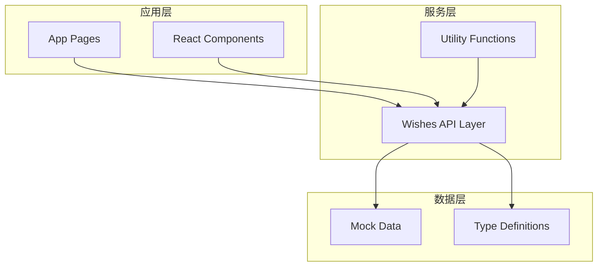

**图表来源**
- [lib/wishes.ts:1-27](file://lib/wishes.ts#L1-L27)
- [types/index.ts:1-58](file://types/index.ts#L1-L58)
- [data/mock/wishes.ts:1-210](file://data/mock/wishes.ts#L1-L210)

**章节来源**
- [lib/wishes.ts:1-27](file://lib/wishes.ts#L1-L27)
- [types/index.ts:1-58](file://types/index.ts#L1-L58)

## 核心组件

### 数据访问API

lib/wishes.ts提供了四个核心的公开函数，用于数据访问和操作：

#### getWishes()
- **函数签名**: `getWishes(): Wish[]`
- **功能**: 获取所有愿望并按最后更新时间降序排列
- **返回值**: 排序后的Wish数组
- **复杂度**: O(n log n)，其中n为愿望数量
- **使用场景**: 主页愿望列表展示、愿望流页面

#### getFeaturedWishes()
- **函数签名**: `getFeaturedWishes(): Wish[]`
- **功能**: 获取所有特色愿望（featured为true）
- **返回值**: 特色Wish数组
- **复杂度**: O(n)，其中n为愿望总数
- **使用场景**: 首页特色愿望区域展示

#### getWishById(id: string)
- **函数签名**: `getWishById(id: string): Wish | undefined`
- **功能**: 根据ID获取单个愿望
- **参数**: 
  - `id`: string - 愿望的唯一标识符
- **返回值**: 匹配的Wish对象或undefined
- **复杂度**: O(n)，其中n为愿望数量
- **使用场景**: 愿望详情页面

#### getResponsesByWishId(wishId: string)
- **函数签名**: `getResponsesByWishId(wishId: string): Response[]`
- **功能**: 获取与特定愿望关联的所有回应，并按创建时间降序排列
- **参数**: 
  - `wishId`: string - 愿望的唯一标识符
- **返回值**: 关联的Response数组
- **复杂度**: O(m log m)，其中m为相关回应数量
- **使用场景**: 愿望详情页面的回应列表展示

**章节来源**
- [lib/wishes.ts:5-26](file://lib/wishes.ts#L5-L26)

### 类型定义系统

项目使用TypeScript定义了完整的类型系统，确保类型安全和开发体验。

#### 基础类型

##### WishStatus
- **类型**: `"open" | "clarifying" | "in_progress" | "supported" | "completed"`
- **含义**: 愿望的状态枚举
- **用途**: 表示愿望的不同发展阶段

##### ResponseType  
- **类型**: `"Advice" | "Resource" | "Introduction" | "Opportunity" | "Support" | "Similar Experience"`
- **含义**: 回应类型的枚举
- **用途**: 标识回应的具体类型

##### WishCategory
- **类型**: `"Life" | "Creative" | "Learning" | "Career" | "Community"`
- **含义**: 愿望类别的枚举
- **用途**: 对愿望进行分类管理

#### 实体接口

##### Wish接口
定义了愿望实体的完整结构：

| 属性名 | 类型 | 必填 | 描述 |
|--------|------|------|------|
| id | string | 是 | 愿望唯一标识符 |
| title | string | 是 | 愿望标题 |
| summary | string | 是 | 愿望摘要 |
| originLabel | string | 否 | 起源标签 |
| description | string | 是 | 详细描述 |
| whyImportant | string | 是 | 重要性说明 |
| currentBlocker | string | 是 | 当前障碍 |
| desiredResponseTypes | ResponseType[] | 是 | 期望的回应类型数组 |
| category | WishCategory | 是 | 愿望类别 |
| status | WishStatus | 是 | 愿望状态 |
| responseCount | number | 是 | 回应回复数 |
| featured | boolean | 是 | 是否为特色愿望 |
| allowAnonymous | boolean | 是 | 是否允许匿名回应 |
| allowPlatformSupport | boolean | 是 | 是否允许平台支持 |
| createdAt | string | 是 | 创建时间（ISO 8601格式） |
| updatedAt | string | 是 | 最后更新时间（ISO 8601格式） |
| progressUpdates | ProgressUpdate[] | 是 | 进展更新数组 |

##### Response接口
定义了回应实体的结构：

| 属性名 | 类型 | 必填 | 描述 |
|--------|------|------|------|
| id | string | 是 | 回应唯一标识符 |
| wishId | string | 是 | 关联的愿望ID |
| authorName | string | 是 | 回应者姓名 |
| type | ResponseType | 是 | 回应类型 |
| content | string | 是 | 回应内容 |
| createdAt | string | 是 | 创建时间（ISO 8601格式） |

##### ProgressUpdate接口
定义了进展更新实体：

| 属性名 | 类型 | 必填 | 描述 |
|--------|------|------|------|
| id | string | 是 | 更新唯一标识符 |
| title | string | 是 | 更新标题 |
| detail | string | 是 | 更新详情 |
| date | string | 是 | 更新日期（ISO 8601格式） |

**章节来源**
- [types/index.ts:1-58](file://types/index.ts#L1-L58)

## 架构概览

系统采用分层架构设计，通过薄数据访问层隔离数据源：

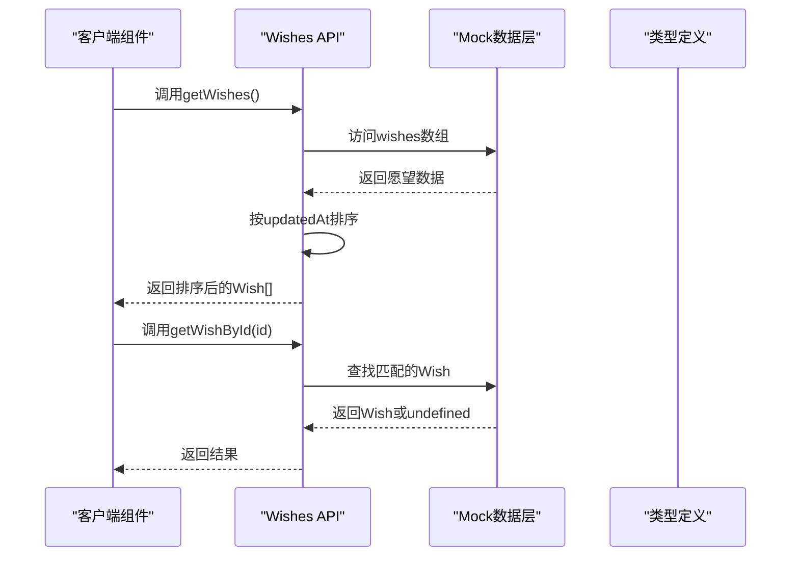

**图表来源**
- [lib/wishes.ts:5-26](file://lib/wishes.ts#L5-L26)
- [data/mock/wishes.ts:12-150](file://data/mock/wishes.ts#L12-L150)

### 数据流图

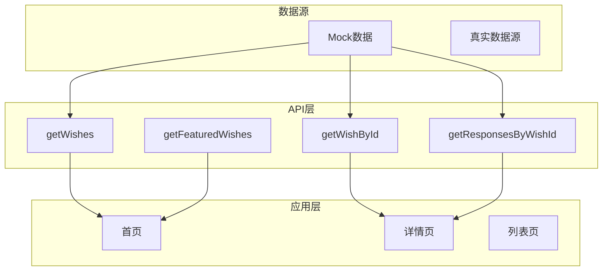

**图表来源**
- [lib/wishes.ts:1-27](file://lib/wishes.ts#L1-L27)
- [app/page.tsx:4-28](file://app/page.tsx#L4-L28)
- [app/wishes/[id]/page.tsx:19-37](file://app/wishes/[id]/page.tsx#L19-L37)

## 详细组件分析

### 数据访问层

#### getWishes() 函数分析

该函数实现了核心的数据获取逻辑：

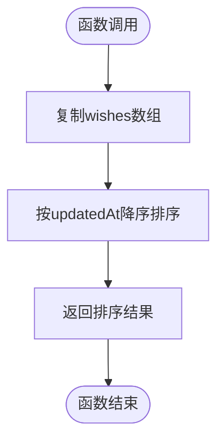

**图表来源**
- [lib/wishes.ts:5-9](file://lib/wishes.ts#L5-L9)

**算法复杂度**: O(n log n)
- 时间复杂度: O(n)用于复制，O(n log n)用于排序
- 空间复杂度: O(n)用于存储副本

#### getWishById() 函数分析

该函数提供了高效的单点查询能力：

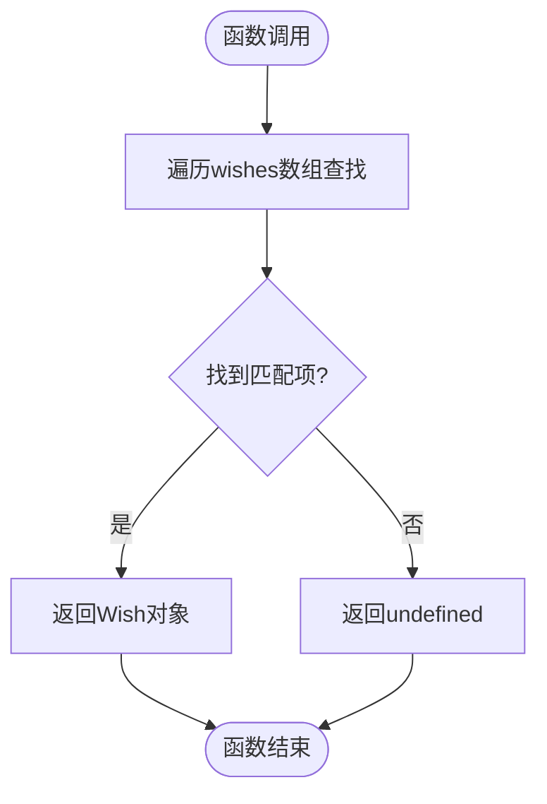

**图表来源**
- [lib/wishes.ts:15-17](file://lib/wishes.ts#L15-L17)

**算法复杂度**: O(n)
- 时间复杂度: O(n)线性搜索
- 空间复杂度: O(1)

#### getResponsesByWishId() 函数分析

该函数实现了关联数据的高效检索：

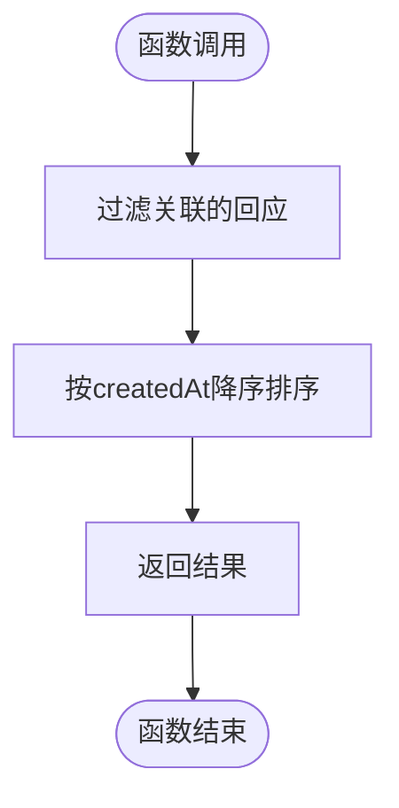

**图表来源**
- [lib/wishes.ts:19-26](file://lib/wishes.ts#L19-L26)

**算法复杂度**: O(m log m)
- 其中m为关联回应的数量
- 时间复杂度: O(m)过滤 + O(m log m)排序
- 空间复杂度: O(m)

### 组件集成模式

#### 首页集成示例

首页使用API的典型模式：

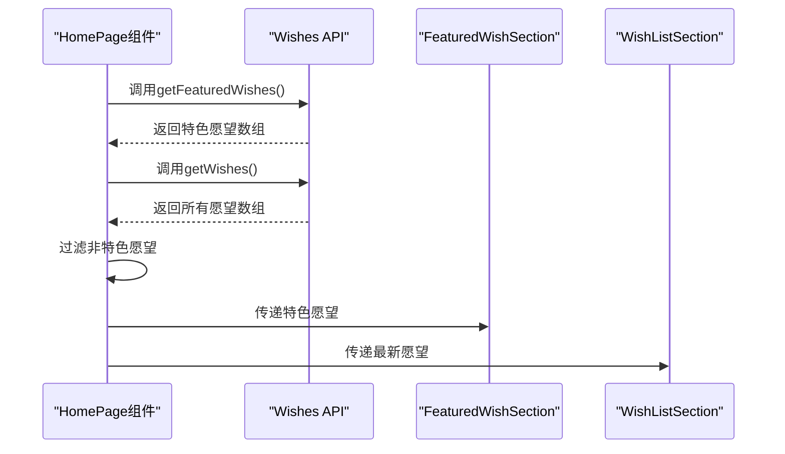

**图表来源**
- [app/page.tsx:6-28](file://app/page.tsx#L6-L28)
- [components/wish/featured-wish-section.tsx:9-46](file://components/wish/featured-wish-section.tsx#L9-L46)
- [components/wish/wish-list-section.tsx:12-77](file://components/wish/wish-list-section.tsx#L12-L77)

#### 详情页集成示例

详情页的API使用模式：

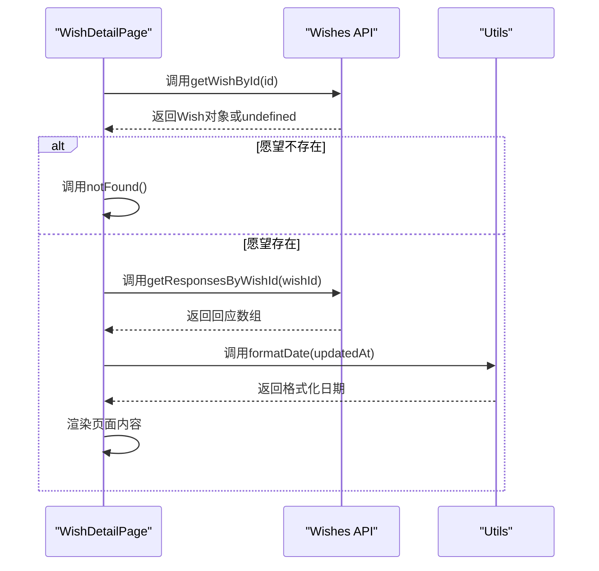

**图表来源**
- [app/wishes/[id]/page.tsx:19-37](file://app/wishes/[id]/page.tsx#L19-L37)
- [lib/utils.ts:5-10](file://lib/utils.ts#L5-L10)

**章节来源**
- [app/page.tsx:4-28](file://app/page.tsx#L4-L28)
- [app/wishes/[id]/page.tsx:19-37](file://app/wishes/[id]/page.tsx#L19-L37)

## 依赖关系分析

### 模块依赖图

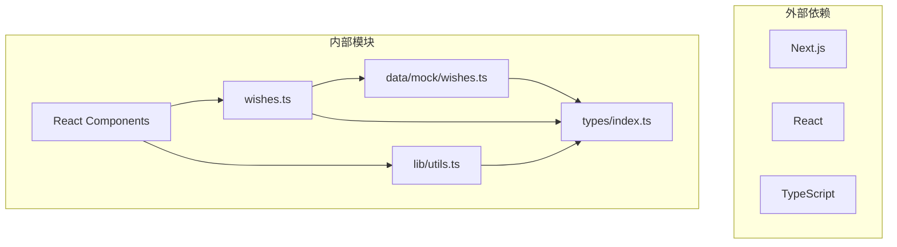

**图表来源**
- [lib/wishes.ts:1](file://lib/wishes.ts#L1)
- [types/index.ts:1](file://types/index.ts#L1)
- [data/mock/wishes.ts:1](file://data/mock/wishes.ts#L1)
- [lib/utils.ts:1](file://lib/utils.ts#L1)

### 组件依赖关系

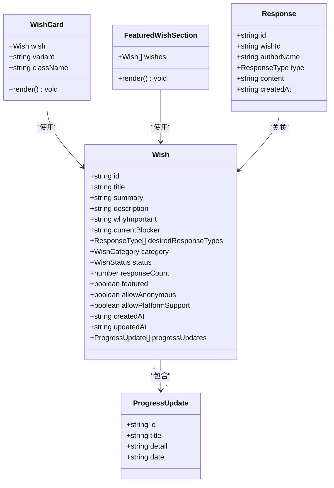

**图表来源**
- [types/index.ts:30-57](file://types/index.ts#L30-L57)
- [components/wish/wish-card.tsx:9-13](file://components/wish/wish-card.tsx#L9-L13)
- [components/wish/featured-wish-section.tsx:5-7](file://components/wish/featured-wish-section.tsx#L5-L7)

**章节来源**
- [lib/wishes.ts:1-27](file://lib/wishes.ts#L1-L27)
- [types/index.ts:1-58](file://types/index.ts#L1-L58)

## 性能考虑

### 时间复杂度分析

| 函数 | 时间复杂度 | 空间复杂度 | 优化建议 |
|------|------------|------------|----------|
| getWishes() | O(n log n) | O(n) | 考虑缓存机制 |
| getFeaturedWishes() | O(n) | O(1) | 可添加索引优化 |
| getWishById() | O(n) | O(1) | 使用Map替代数组 |
| getResponsesByWishId() | O(m log m) | O(m) | 预排序策略 |

### 内存使用优化

1. **数组复制**: getWishes()创建数组副本避免修改原始数据
2. **惰性加载**: 建议在需要时才加载大量数据
3. **缓存策略**: 可考虑实现LRU缓存机制

### 扩展性建议

1. **索引优化**: 为常用查询字段建立索引
2. **分页支持**: 实现分页机制处理大数据集
3. **并发处理**: 支持并行数据请求

## 故障排除指南

### 常见问题及解决方案

#### 空数据返回
- **症状**: getWishById()返回undefined
- **原因**: ID不匹配或数据未加载
- **解决方案**: 验证ID格式和数据完整性

#### 排序异常
- **症状**: 愿望列表顺序不正确
- **原因**: updatedAt格式不符合ISO 8601
- **解决方案**: 确保时间戳格式一致

#### 性能问题
- **症状**: 页面加载缓慢
- **原因**: 大量数据处理
- **解决方案**: 实施分页和缓存策略

### 错误处理模式

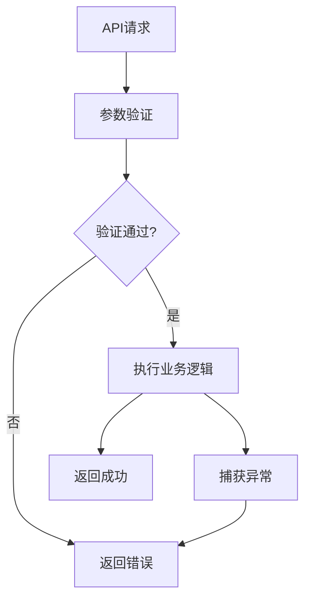

**章节来源**
- [app/wishes/[id]/page.tsx:27-29](file://app/wishes/[id]/page.tsx#L27-L29)

## 结论

梦想回应平台的API设计体现了清晰的职责分离和良好的扩展性。通过薄数据访问层的设计，系统实现了Mock数据与真实数据源的无缝切换，为未来的数据库集成奠定了基础。

关键优势：
1. **类型安全**: 完整的TypeScript类型定义确保编译时检查
2. **模块化设计**: 清晰的函数职责划分便于维护
3. **可扩展性**: 易于替换数据源和添加新功能
4. **性能考虑**: 合理的算法选择和潜在优化点

## 附录

### 使用示例

#### 基础使用模式

```typescript
// 获取所有愿望
const allWishes = getWishes();

// 获取特色愿望
const featured = getFeaturedWishes();

// 获取单个愿望
const wish = getWishById("some-id");

// 获取关联回应
const responses = getResponsesByWishId("some-id");
```

#### 组件集成示例

```typescript
// 在组件中使用
const HomePage = () => {
  const featuredWishes = getFeaturedWishes();
  const allWishes = getWishes();
  
  return (
    <div>
      <FeaturedWishSection wishes={featuredWishes} />
      <WishListSection wishes={allWishes} />
    </div>
  );
};
```

### 最佳实践

1. **数据验证**: 始终验证API返回的数据完整性
2. **错误处理**: 实现适当的错误处理和用户反馈
3. **性能监控**: 监控API调用频率和响应时间
4. **缓存策略**: 实施合理的缓存机制减少重复请求
5. **类型安全**: 充分利用TypeScript类型系统

### 版本兼容性

当前版本为1.0，主要变更包括：
- 初始API设计
- 完整的类型定义
- 基础的Mock数据支持

未来版本计划：
- 添加数据库集成支持
- 实现分页和搜索功能
- 增强错误处理机制
- 优化性能和缓存策略