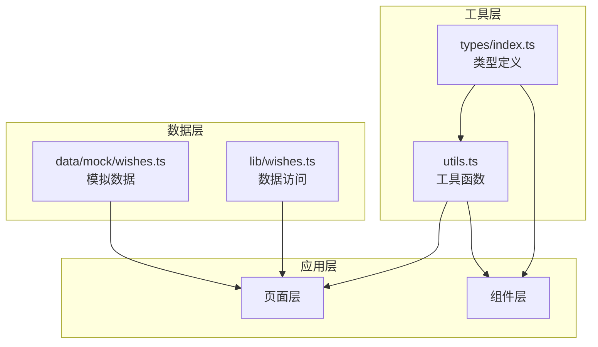
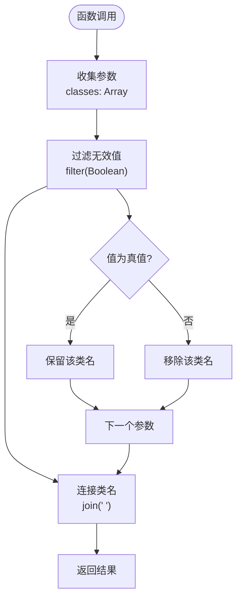
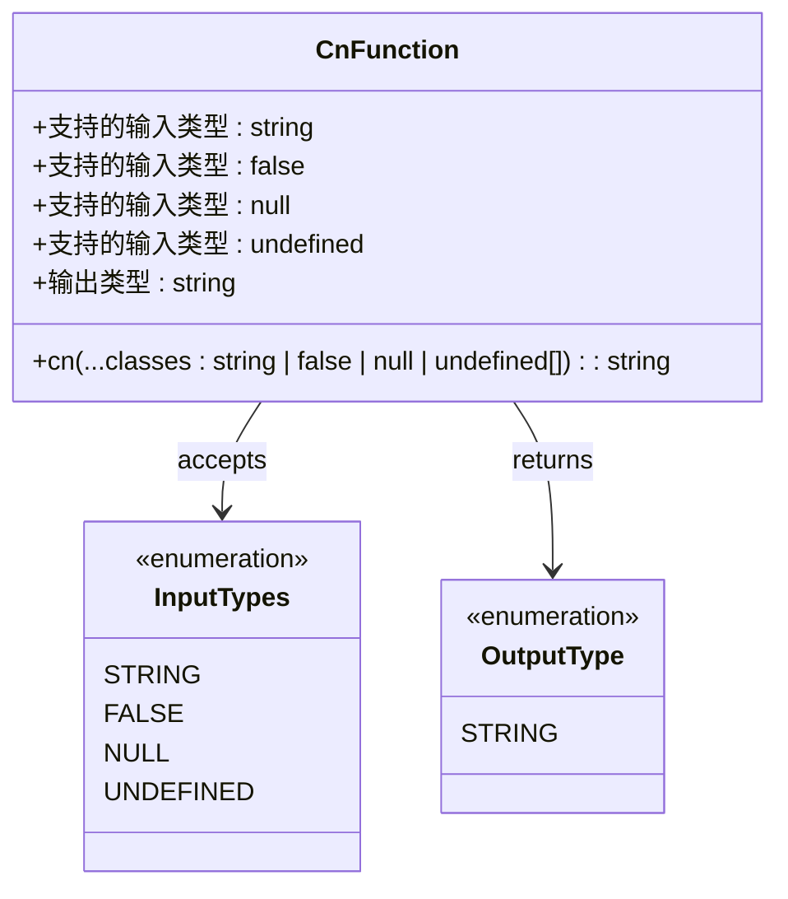
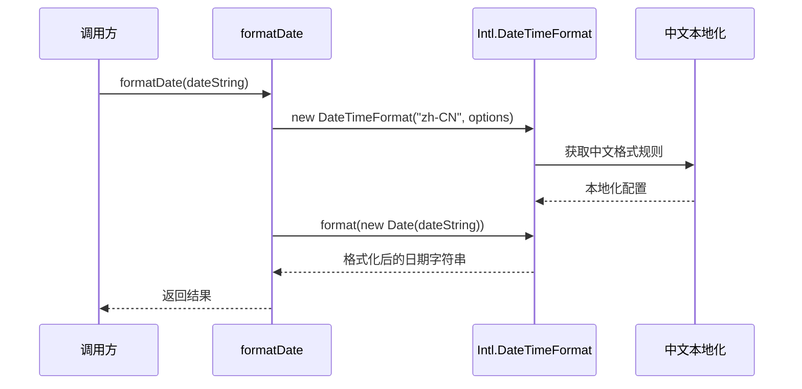
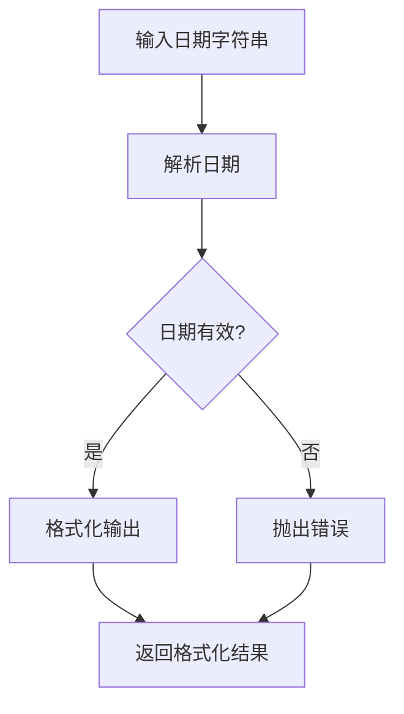
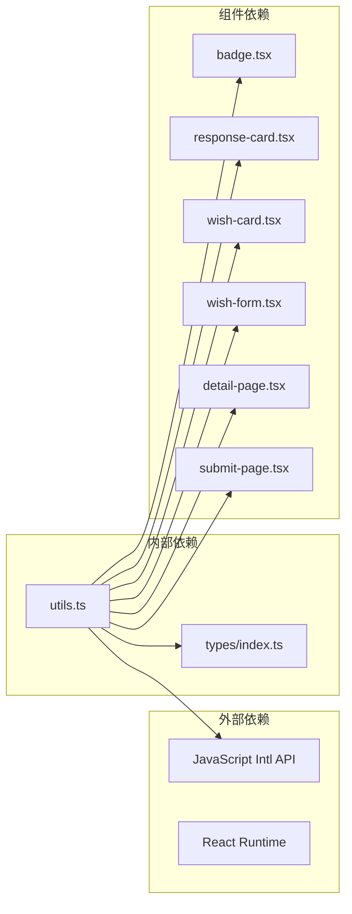

# 工具函数

<cite>
**本文档引用的文件**
- [lib/utils.ts](file://lib/utils.ts)
- [types/index.ts](file://types/index.ts)
- [components/ui/badge.tsx](file://components/ui/badge.tsx)
- [components/response/response-card.tsx](file://components/response/response-card.tsx)
- [components/wish/wish-card.tsx](file://components/wish/wish-card.tsx)
- [components/wish/wish-form.tsx](file://components/wish/wish-form.tsx)
- [app/wishes/[id]/page.tsx](file://app/wishes/[id]/page.tsx)
- [app/submit/page.tsx](file://app/submit/page.tsx)
- [package.json](file://package.json)
- [tsconfig.json](file://tsconfig.json)
</cite>

## 目录
1. [简介](#简介)
2. [项目结构](#项目结构)
3. [核心组件](#核心组件)
4. [架构概览](#架构概览)
5. [详细组件分析](#详细组件分析)
6. [依赖分析](#依赖分析)
7. [性能考虑](#性能考虑)
8. [故障排除指南](#故障排除指南)
9. [结论](#结论)
10. [附录](#附录)

## 简介

本文件为梦想回应平台的工具函数详细API文档，专注于`lib/utils.ts`中定义的通用工具函数。该文件提供了两个核心工具函数：`cn`类名合并函数和`formatDate`日期格式化函数。这些工具函数在整个应用中被广泛使用，用于简化UI组件的样式管理和日期显示格式化。

工具函数的设计目标是提供简洁、可靠且高性能的通用功能，减少重复代码，提高开发效率。所有函数都经过精心设计，具有明确的类型定义和边界情况处理机制。

## 项目结构

工具函数位于`lib/utils.ts`文件中，采用导出函数的方式提供全局可用的工具能力。项目采用模块化的架构设计，工具函数通过相对路径导入到各个组件中使用。

```mermaid
graph TB
subgraph "lib"
Utils[utils.ts<br/>工具函数库]
end
subgraph "components"
Badge[ui/badge.tsx<br/>徽章组件]
ResponseCard[response/response-card.tsx<br/>响应卡片]
WishCard[wish/wish-card.tsx<br/>愿望卡片]
WishForm[wish/wish-form.tsx<br/>愿望表单]
end
subgraph "pages"
DetailPage[app/wishes/[id]/page.tsx<br/>详情页面]
SubmitPage[app/submit/page.tsx<br/>提交页面]
end
Utils --> Badge
Utils --> ResponseCard
Utils --> WishCard
Utils --> WishForm
Utils --> DetailPage
```

**图表来源**
- [lib/utils.ts:1-12](file://lib/utils.ts#L1-L12)
- [components/ui/badge.tsx:1-37](file://components/ui/badge.tsx#L1-L37)
- [components/response/response-card.tsx:1-48](file://components/response/response-card.tsx#L1-L48)
- [components/wish/wish-card.tsx:1-93](file://components/wish/wish-card.tsx#L1-L93)
- [app/wishes/[id]/page.tsx:1-184](file://app/wishes/[id]/page.tsx#L1-L184)

**章节来源**
- [lib/utils.ts:1-12](file://lib/utils.ts#L1-L12)
- [package.json:1-29](file://package.json#L1-L29)
- [tsconfig.json:1-29](file://tsconfig.json#L1-L29)

## 核心组件

### cn 类名合并函数

`cn`函数是Tailwind CSS类名合并的核心工具，用于动态组合多个CSS类名，自动过滤无效值并生成最终的类名字符串。

**函数签名**
```typescript
export function cn(...classes: Array<string | false | null | undefined>): string
```

**参数说明**
- `classes`: 可变参数数组，接受任意数量的字符串或布尔值、null、undefined
- 支持的数据类型：`string | false | null | undefined`

**返回值**
- 返回合并后的类名字符串，多个类名之间用空格分隔

**设计目的**
- 简化条件类名的拼接逻辑
- 自动处理空值和无效值
- 提供类型安全的类名管理

**使用场景**
- 动态样式切换（如按钮状态）
- 条件类名应用（如选中状态）
- 组件样式继承和扩展

**章节来源**
- [lib/utils.ts:1-3](file://lib/utils.ts#L1-L3)
- [components/ui/badge.tsx:27-31](file://components/ui/badge.tsx#L27-L31)
- [components/wish/wish-card.tsx:24-30](file://components/wish/wish-card.tsx#L24-L30)
- [components/wish/wish-form.tsx:82-89](file://components/wish/wish-form.tsx#L82-L89)

### formatDate 日期格式化函数

`formatDate`函数用于将ISO格式的日期字符串转换为本地化的中文日期显示格式。

**函数签名**
```typescript
export function formatDate(dateString: string): string
```

**参数说明**
- `dateString`: ISO 8601格式的日期字符串
- 类型：`string`

**返回值**
- 返回格式化的中文日期字符串
- 格式：月份（长格式）+ 日期（数字）

**设计目的**
- 统一日期显示格式
- 支持国际化本地化需求
- 简化日期格式化逻辑

**使用场景**
- 显示创建时间、更新时间
- 响应卡片的时间戳显示
- 进度更新的时间标记

**章节来源**
- [lib/utils.ts:5-10](file://lib/utils.ts#L5-L10)
- [components/response/response-card.tsx:26](file://components/response/response-card.tsx#L26)
- [components/wish/wish-card.tsx:61](file://components/wish/wish-card.tsx#L61)
- [app/wishes/[id]/page.tsx:175](file://app/wishes/[id]/page.tsx#L175)

## 架构概览

工具函数在整个应用架构中扮演着基础设施的角色，为各个组件提供通用的工具能力。



**图表来源**
- [lib/utils.ts:1-12](file://lib/utils.ts#L1-L12)
- [types/index.ts:1-58](file://types/index.ts#L1-L58)
- [components/ui/badge.tsx:1-37](file://components/ui/badge.tsx#L1-L37)
- [app/wishes/[id]/page.tsx:1-184](file://app/wishes/[id]/page.tsx#L1-L184)

## 详细组件分析

### cn 函数详细分析

#### 函数实现原理



**图表来源**
- [lib/utils.ts:1-3](file://lib/utils.ts#L1-L3)

#### 类型系统支持



**图表来源**
- [lib/utils.ts:1-3](file://lib/utils.ts#L1-L3)

#### 使用模式和最佳实践

**条件类名应用**
```typescript
// 基础用法
const baseClasses = "rounded-lg border";
const dynamicClasses = cn(baseClasses, isActive && "bg-blue-500");

// 复杂条件组合
const buttonClasses = cn(
  "px-4 py-2 rounded-md",
  variant === "primary" && "bg-blue-600 text-white",
  disabled && "opacity-50 cursor-not-allowed",
  className
);
```

**组件样式继承**
```typescript
// Badge组件中的使用
const badgeClasses = cn(
  "inline-flex items-center gap-2 rounded-none",
  tones[tone],
  className
);
```

**章节来源**
- [lib/utils.ts:1-3](file://lib/utils.ts#L1-L3)
- [components/ui/badge.tsx:27-31](file://components/ui/badge.tsx#L27-L31)
- [components/wish/wish-card.tsx:24-30](file://components/wish/wish-card.tsx#L24-L30)

### formatDate 函数详细分析

#### 本地化实现机制



**图表来源**
- [lib/utils.ts:5-10](file://lib/utils.ts#L5-L10)

#### 日期格式化选项

| 选项 | 值 | 描述 |
|------|-----|------|
| `month` | `"long"` | 显示完整月份名称（如：一月、二月） |
| `day` | `"numeric"` | 显示数字日期（如：1、15、31） |

#### 错误处理机制



**图表来源**
- [lib/utils.ts:5-10](file://lib/utils.ts#L5-L10)

**章节来源**
- [lib/utils.ts:5-10](file://lib/utils.ts#L5-L10)
- [components/response/response-card.tsx:26](file://components/response/response-card.tsx#L26)
- [components/wish/wish-card.tsx:61](file://components/wish/wish-card.tsx#L61)
- [app/wishes/[id]/page.tsx:175](file://app/wishes/[id]/page.tsx#L175)

## 依赖分析

工具函数的依赖关系相对简单，主要依赖于JavaScript原生的类型系统和浏览器的国际化API。



**图表来源**
- [lib/utils.ts:1-12](file://lib/utils.ts#L1-L12)
- [types/index.ts:1-58](file://types/index.ts#L1-L58)
- [components/ui/badge.tsx:1-37](file://components/ui/badge.tsx#L1-L37)
- [components/response/response-card.tsx:1-48](file://components/response/response-card.tsx#L1-L48)

**章节来源**
- [lib/utils.ts:1-12](file://lib/utils.ts#L1-L12)
- [types/index.ts:1-58](file://types/index.ts#L1-L58)

## 性能考虑

### cn 函数性能优化

1. **内存分配优化**
   - 使用数组的`filter`和`join`方法，避免手动字符串拼接
   - 单次遍历处理所有参数，时间复杂度O(n)

2. **运行时性能**
   - 避免不必要的字符串操作
   - 利用JavaScript引擎的内置优化

3. **类型检查开销**
   - TypeScript编译时检查，运行时无额外开销
   - 支持多种类型输入，无需运行时类型转换

### formatDate 函数性能优化

1. **缓存策略**
   - `Intl.DateTimeFormat`实例可复用，但当前实现每次调用都会创建新实例
   - 对于高频调用场景，可考虑缓存DateTimeFormat实例

2. **输入验证**
   - 依赖浏览器的Date构造函数进行验证
   - 无效日期会抛出异常，确保数据质量

3. **本地化开销**
   - 使用浏览器内置的国际化API，性能最优
   - 中文本地化配置固定，避免动态计算

**章节来源**
- [lib/utils.ts:1-12](file://lib/utils.ts#L1-L12)

## 故障排除指南

### cn 函数常见问题

**问题1：类名顺序不正确**
```typescript
// ❌ 错误：参数顺序影响最终结果
const classes = cn("bg-red-500", isActive && "bg-blue-500", "text-white");

// ✅ 正确：确保基础类名在前
const classes = cn("text-white", "bg-red-500", isActive && "bg-blue-500");
```

**问题2：条件类名逻辑错误**
```typescript
// ❌ 错误：使用了错误的条件
const classes = cn("btn", disabled === false && "disabled");

// ✅ 正确：使用布尔值或显式比较
const classes = cn("btn", !disabled && "disabled");
```

### formatDate 函数常见问题

**问题1：日期格式不符合预期**
```typescript
// ❌ 错误：传入非ISO格式日期
const formatted = formatDate("2024-01-01"); // 可能失败

// ✅ 正确：确保传入有效的ISO格式
const formatted = formatDate("2024-01-01T00:00:00Z");
```

**问题2：时区显示问题**
```typescript
// ❌ 错误：期望UTC时间
const time = formatDate("2024-01-01T12:00:00Z");

// ✅ 正确：理解本地化显示
// 实际显示为用户本地时间格式
```

**问题3：空值处理**
```typescript
// ❌ 错误：传入null或undefined
const formatted = formatDate(null);

// ✅ 正确：确保传入有效字符串
const formatted = dateString ? formatDate(dateString) : "暂无日期";
```

**章节来源**
- [lib/utils.ts:1-12](file://lib/utils.ts#L1-L12)

## 结论

工具函数库虽然简洁，但在整个应用架构中发挥着重要作用。`cn`和`formatDate`两个函数分别解决了类名管理和日期格式化这两个常见且重要的问题。

**设计优势**
- **简洁性**：函数接口简单明了，易于理解和使用
- **类型安全**：完整的TypeScript类型定义，提供编译时检查
- **性能友好**：利用JavaScript原生API，运行时开销最小
- **可维护性**：集中式的工具函数，便于统一修改和测试

**扩展建议**
- 可以考虑添加更多的格式化选项
- 可以实现缓存机制以提高频繁调用的性能
- 可以添加更多的工具函数，如字符串处理、数值格式化等

## 附录

### 测试策略和验证方法

由于当前项目未包含专门的测试文件，建议采用以下测试策略：

**单元测试建议**
```typescript
// 测试 cn 函数
describe('cn 函数', () => {
  test('合并多个类名', () => {
    expect(cn('a', 'b', 'c')).toBe('a b c');
  });
  
  test('过滤无效值', () => {
    expect(cn('a', false, null, undefined, 'b')).toBe('a b');
  });
  
  test('处理空参数', () => {
    expect(cn()).toBe('');
  });
});

// 测试 formatDate 函数
describe('formatDate 函数', () => {
  test('格式化有效日期', () => {
    expect(formatDate('2024-01-01')).toMatch(/.*月.*日/);
  });
  
  test('处理无效日期', () => {
    expect(() => formatDate('invalid-date')).toThrow();
  });
});
```

**集成测试建议**
- 在实际组件中验证工具函数的使用效果
- 测试不同语言环境下的显示效果
- 验证性能在大量数据场景下的表现

**章节来源**
- [lib/utils.ts:1-12](file://lib/utils.ts#L1-L12)
- [types/index.ts:1-58](file://types/index.ts#L1-L58)