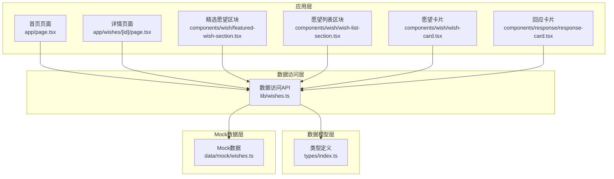
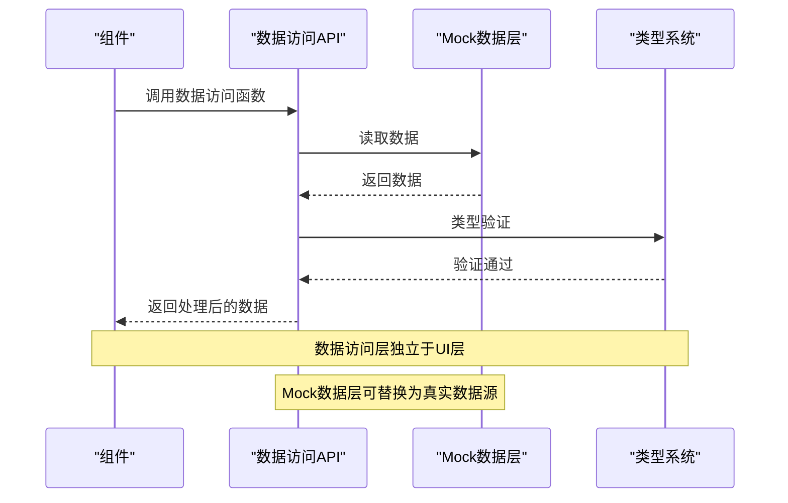
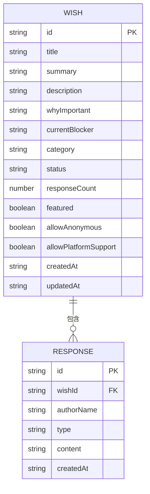
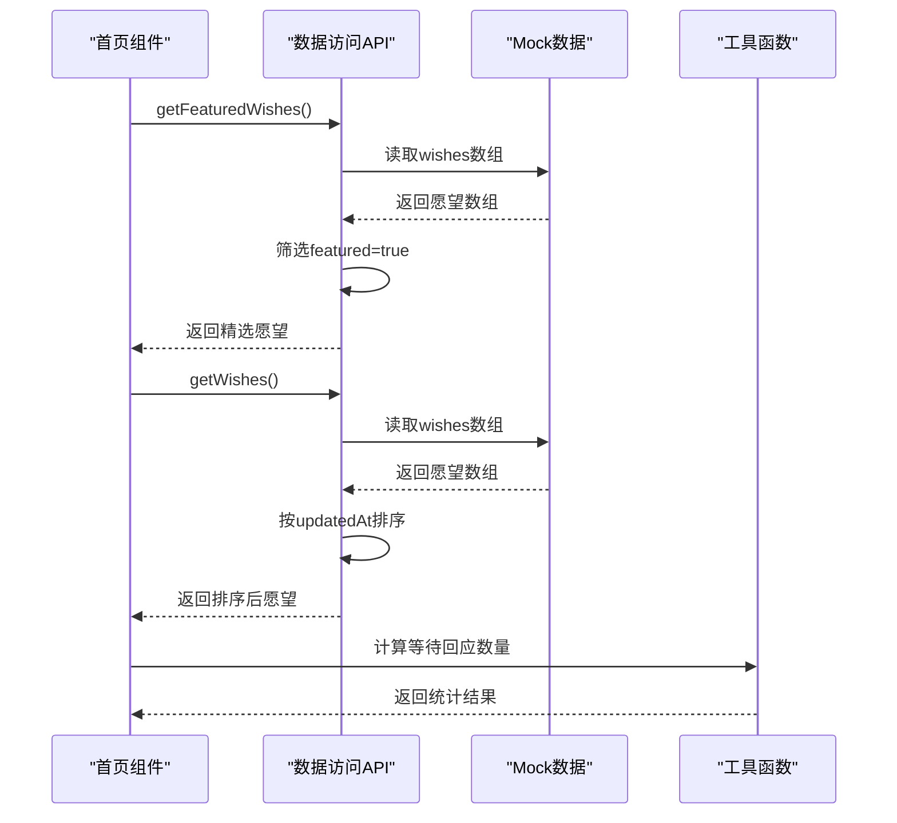
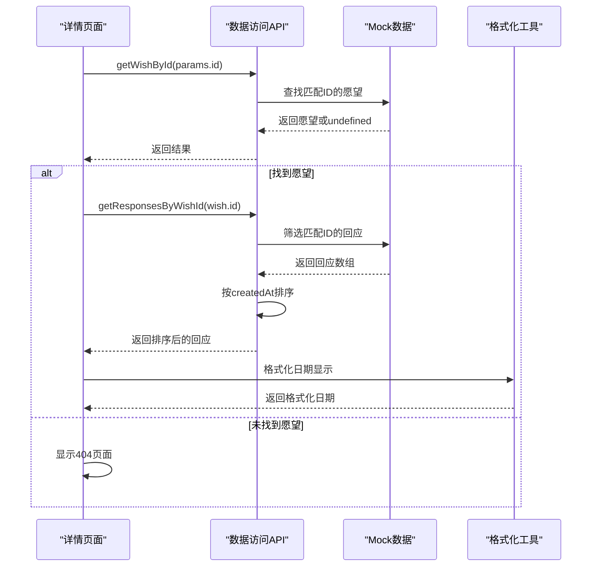
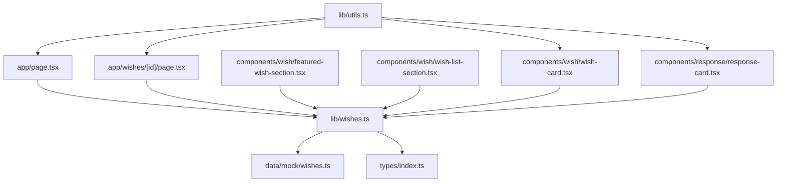
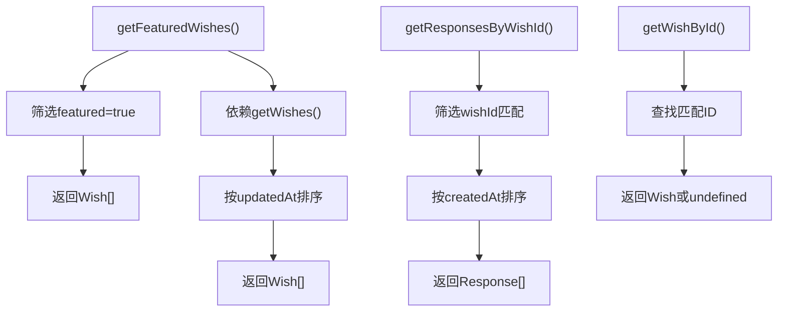

# 数据访问API

<cite>
**本文引用的文件**
- [lib/wishes.ts](file://lib/wishes.ts)
- [types/index.ts](file://types/index.ts)
- [data/mock/wishes.ts](file://data/mock/wishes.ts)
- [app/page.tsx](file://app/page.tsx)
- [app/wishes/[id]/page.tsx](file://app/wishes/[id]/page.tsx)
- [components/wish/featured-wish-section.tsx](file://components/wish/featured-wish-section.tsx)
- [components/wish/wish-list-section.tsx](file://components/wish/wish-list-section.tsx)
- [components/wish/wish-card.tsx](file://components/wish/wish-card.tsx)
- [components/response/response-card.tsx](file://components/response/response-card.tsx)
- [lib/utils.ts](file://lib/utils.ts)
</cite>

## 目录
1. [简介](#简介)
2. [项目结构](#项目结构)
3. [核心组件](#核心组件)
4. [架构概览](#架构概览)
5. [详细组件分析](#详细组件分析)
6. [依赖关系分析](#依赖关系分析)
7. [性能考量](#性能考量)
8. [故障排除指南](#故障排除指南)
9. [结论](#结论)
10. [附录](#附录)

## 简介
本文件为梦想回应平台的数据访问API详细文档，专注于lib/wishes.ts中的数据访问函数实现。该API提供愿望（Wish）和回应（Response）数据的查询接口，采用Mock数据层设计，便于未来替换为真实数据库查询。文档涵盖函数签名、参数类型、返回值类型、业务逻辑、数据处理流程、性能特征、错误处理策略以及在组件中的正确使用方式。

## 项目结构
数据访问API位于lib目录下，配合types定义数据模型，data/mock提供Mock数据源，各页面组件通过API函数获取和展示数据。



**图表来源**
- [lib/wishes.ts:1-27](file://lib/wishes.ts#L1-L27)
- [types/index.ts:1-58](file://types/index.ts#L1-L58)
- [data/mock/wishes.ts:1-210](file://data/mock/wishes.ts#L1-L210)

**章节来源**
- [lib/wishes.ts:1-27](file://lib/wishes.ts#L1-L27)
- [types/index.ts:1-58](file://types/index.ts#L1-L58)
- [data/mock/wishes.ts:1-210](file://data/mock/wishes.ts#L1-L210)

## 核心组件
本节详细介绍lib/wishes.ts中的四个核心数据访问函数，包括它们的函数签名、参数类型、返回值类型、业务逻辑和使用场景。

### getWishes() 函数
- **函数签名**: getWishes()
- **参数**: 无
- **返回值**: Wish[]（按updatedAt降序排列的愿望数组）
- **业务逻辑**: 返回所有愿望数据，按照最后更新时间进行降序排序
- **数据处理流程**: 
  1. 复制wishes数组避免修改原始数据
  2. 使用sort方法按updatedAt字段进行时间倒序排序
  3. 返回排序后的数组
- **性能特征**: 时间复杂度O(n log n)，空间复杂度O(n)
- **使用示例**: 在首页获取最新愿望列表

### getFeaturedWishes() 函数
- **函数签名**: getFeaturedWishes()
- **参数**: 无
- **返回值**: Wish[]（标记为featured的愿望数组）
- **业务逻辑**: 获取所有标记为精选的愿望
- **数据处理流程**:
  1. 调用getWishes()获取已排序的愿望列表
  2. 使用filter方法筛选featured为true的愿望
- **性能特征**: 时间复杂度O(n)，空间复杂度O(n)
- **使用示例**: 在首页展示精选愿望区域

### getWishById() 函数
- **函数签名**: getWishById(id: string)
- **参数**: id: string（愿望唯一标识符）
- **返回值**: Wish | undefined（找到返回愿望对象，未找到返回undefined）
- **业务逻辑**: 根据ID查找特定愿望
- **数据处理流程**:
  1. 使用find方法在wishes数组中搜索匹配的ID
  2. 返回第一个匹配项或undefined
- **性能特征**: 时间复杂度O(n)，空间复杂度O(1)
- **使用示例**: 在详情页面根据路由参数获取特定愿望

### getResponsesByWishId() 函数
- **函数签名**: getResponsesByWishId(wishId: string)
- **参数**: wishId: string（愿望ID）
- **返回值**: Response[]（按createdAt降序排列的回应数组）
- **业务逻辑**: 获取指定愿望的所有回应，按创建时间降序排列
- **数据处理流程**:
  1. 使用filter方法筛选响应数组中wishId匹配的回应
  2. 使用sort方法按createdAt字段进行时间倒序排序
- **性能特征**: 时间复杂度O(m log m)，其中m为特定愿望的回应数量
- **使用示例**: 在详情页面展示特定愿望的回应列表

**章节来源**
- [lib/wishes.ts:5-26](file://lib/wishes.ts#L5-L26)

## 架构概览
数据访问API采用分层架构设计，确保Mock数据层与业务逻辑的解耦。



**图表来源**
- [lib/wishes.ts:1-27](file://lib/wishes.ts#L1-L27)
- [data/mock/wishes.ts:1-210](file://data/mock/wishes.ts#L1-L210)
- [types/index.ts:1-58](file://types/index.ts#L1-L58)

## 详细组件分析

### 数据模型定义
API基于以下核心数据模型工作：



**图表来源**
- [types/index.ts:30-58](file://types/index.ts#L30-L58)

### API函数调用流程

#### 首页数据加载流程


**图表来源**
- [app/page.tsx:6-28](file://app/page.tsx#L6-L28)
- [lib/wishes.ts:11-13](file://lib/wishes.ts#L11-L13)
- [lib/wishes.ts:5-9](file://lib/wishes.ts#L5-L9)

#### 详情页面数据加载流程


**图表来源**
- [app/wishes/[id]/page.tsx:19-31](file://app/wishes/[id]/page.tsx#L19-L31)
- [lib/wishes.ts:15-26](file://lib/wishes.ts#L15-L26)

### 组件集成模式

#### 精选愿望区块
精选愿望区块通过API获取数据并渲染：
- 接收Wish[]数组作为props
- 第一个愿望作为主展示，其余作为网格布局
- 使用WishCard组件渲染每个愿望

#### 愿望列表区块
愿望列表区块实现过滤和排序功能：
- 实现类别过滤：Life、Creative、Learning、Career、Community
- 实现状态过滤：等待回应、整理中、推进中、已连接帮助
- 使用CSS列布局实现响应式网格

#### 回应卡片组件
回应卡片组件展示单个回应的详细信息：
- 展示作者名称、回应类型、创建时间和内容
- 使用响应式布局适配不同屏幕尺寸
- 提供回应类型的价值说明

**章节来源**
- [components/wish/featured-wish-section.tsx:9-46](file://components/wish/featured-wish-section.tsx#L9-L46)
- [components/wish/wish-list-section.tsx:12-76](file://components/wish/wish-list-section.tsx#L12-L76)
- [components/response/response-card.tsx:18-47](file://components/response/response-card.tsx#L18-L47)

## 依赖关系分析

### 模块依赖图


**图表来源**
- [lib/wishes.ts:1](file://lib/wishes.ts#L1)
- [app/page.tsx:4](file://app/page.tsx#L4)
- [app/wishes/[id]/page.tsx:10](file://app/wishes/[id]/page.tsx#L10)

### 数据流分析
API函数之间的数据流转关系：



**图表来源**
- [lib/wishes.ts:5-26](file://lib/wishes.ts#L5-L26)

**章节来源**
- [lib/wishes.ts:1-27](file://lib/wishes.ts#L1-L27)
- [app/page.tsx:6-8](file://app/page.tsx#L6-L8)
- [app/wishes/[id]/page.tsx:25-31](file://app/wishes/[id]/page.tsx#L25-L31)

## 性能考量

### 时间复杂度分析
- **getWishes()**: O(n log n) - 主要由排序操作决定
- **getFeaturedWishes()**: O(n) - 单次过滤操作
- **getWishById()**: O(n) - 线性查找操作
- **getResponsesByWishId()**: O(m log m) - 先过滤O(m)，后排序O(m log m)

### 空间复杂度分析
- 所有函数都创建新的数组副本，空间复杂度为O(n)或O(m)
- 排序操作使用原生Array.sort，额外空间复杂度为O(log n)

### 优化建议
1. **缓存策略**: 对频繁访问的数据添加内存缓存
2. **分页支持**: 为大量数据实现分页加载
3. **索引优化**: 为常用查询字段建立索引
4. **批量操作**: 合并多个相关查询减少网络往返

### Mock数据层优势
- **开发效率**: 快速原型开发和测试
- **离线可用**: 不依赖网络即可运行
- **可预测性**: 固定数据集便于调试
- **可替换性**: 易于替换为真实数据源

## 故障排除指南

### 常见问题及解决方案

#### 数据为空或undefined
- **症状**: API返回undefined或空数组
- **原因**: ID不存在或Mock数据未正确导入
- **解决方案**: 
  1. 检查ID格式和存在性
  2. 验证Mock数据导入路径
  3. 添加适当的错误处理和默认值

#### 性能问题
- **症状**: 页面加载缓慢，特别是大量数据时
- **原因**: 大数组的排序和过滤操作
- **解决方案**:
  1. 实现数据分页
  2. 添加本地缓存
  3. 优化排序算法

#### 类型错误
- **症状**: TypeScript编译错误
- **原因**: 数据模型不匹配
- **解决方案**:
  1. 检查types/index.ts中的类型定义
  2. 确保Mock数据符合类型约束
  3. 使用类型守卫进行运行时验证

### 错误处理最佳实践

#### API层错误处理
```typescript
// 建议的错误处理模式
export function getWishById(id: string): Wish | null {
  try {
    const result = wishes.find((wish) => wish.id === id);
    return result || null;
  } catch (error) {
    console.error(`获取愿望失败: ${id}`, error);
    return null;
  }
}
```

#### 组件层错误处理
```typescript
// 在组件中使用
const wish = getWishById(params.id);
if (!wish) {
  notFound(); // 或显示错误界面
}
```

**章节来源**
- [app/wishes/[id]/page.tsx:27-29](file://app/wishes/[id]/page.tsx#L27-L29)
- [lib/wishes.ts:15-16](file://lib/wishes.ts#L15-L16)

## 结论
梦想回应平台的数据访问API通过清晰的分层架构实现了良好的可维护性和可扩展性。Mock数据层设计确保了开发效率和测试便利性，同时保持了与真实数据源的兼容性。API函数提供了完整的数据查询能力，支持排序、过滤和分页等常见需求。通过遵循本文档的最佳实践，开发者可以高效地使用这些API并在未来轻松替换为真实的数据源。

## 附录

### 函数签名参考表

| 函数名 | 参数类型 | 返回值类型 | 描述 |
|--------|----------|------------|------|
| getWishes | 无 | Wish[] | 获取所有愿望并按更新时间排序 |
| getFeaturedWishes | 无 | Wish[] | 获取标记为精选的愿望 |
| getWishById | id: string | Wish \| undefined | 根据ID获取特定愿望 |
| getResponsesByWishId | wishId: string | Response[] | 获取特定愿望的所有回应并按时间排序 |

### 使用示例路径
- 首页数据加载: [app/page.tsx:6-8](file://app/page.tsx#L6-L8)
- 详情页面数据加载: [app/wishes/[id]/page.tsx:25-31](file://app/wishes/[id]/page.tsx#L25-L31)
- 组件集成: [components/wish/featured-wish-section.tsx:9-46](file://components/wish/featured-wish-section.tsx#L9-L46)

### Mock数据结构
- 愿望数据: [data/mock/wishes.ts:12-150](file://data/mock/wishes.ts#L12-L150)
- 回应数据: [data/mock/wishes.ts:152-210](file://data/mock/wishes.ts#L152-L210)