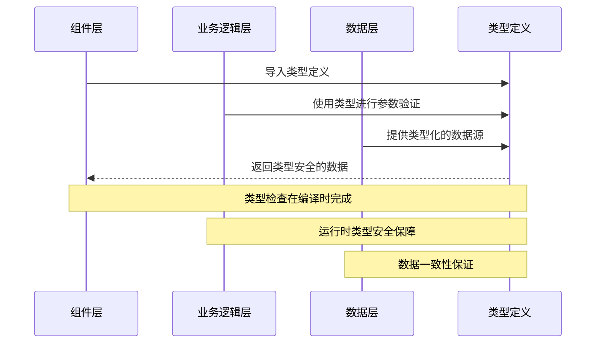
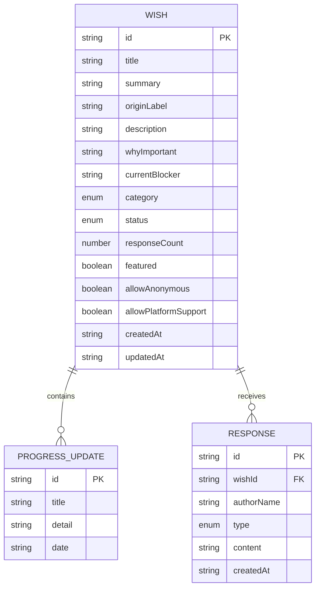

# 类型定义

<cite>
**本文档引用的文件**
- [types/index.ts](file://types/index.ts)
- [data/mock/wishes.ts](file://data/mock/wishes.ts)
- [lib/wishes.ts](file://lib/wishes.ts)
- [lib/utils.ts](file://lib/utils.ts)
- [components/wish/wish-form.tsx](file://components/wish/wish-form.tsx)
- [components/wish/wish-card.tsx](file://components/wish/wish-card.tsx)
- [components/response/response-card.tsx](file://components/response/response-card.tsx)
- [components/wish/progress-timeline.tsx](file://components/wish/progress-timeline.tsx)
- [components/wish/wish-status-badge.tsx](file://components/wish/wish-status-badge.tsx)
- [app/wishes/[id]/page.tsx](file://app/wishes/[id]/page.tsx)
</cite>

## 目录
1. [简介](#简介)
2. [项目结构](#项目结构)
3. [核心类型系统](#核心类型系统)
4. [架构概览](#架构概览)
5. [详细类型分析](#详细类型分析)
6. [类型关系图](#类型关系图)
7. [使用示例与最佳实践](#使用示例与最佳实践)
8. [泛型与约束](#泛型与约束)
9. [扩展与自定义指南](#扩展与自定义指南)
10. [故障排除](#故障排除)
11. [结论](#结论)

## 简介

梦想回应平台是一个基于 Next.js 构建的 Web 应用，旨在为用户提供一个表达愿望并获得社区回应的平台。本项目采用 TypeScript 进行强类型开发，通过精心设计的类型系统确保数据结构的一致性和安全性。

本文档详细记录了项目中的所有 TypeScript 类型定义，包括 Wish、Response、ProgressUpdate 等核心实体的接口定义，解释类型之间的关系和继承模式，并提供实际使用示例和最佳实践指导。

## 项目结构

项目采用模块化的文件组织方式，类型定义集中在 `types/index.ts` 文件中，通过清晰的命名空间和模块导入机制实现类型共享。

```mermaid
graph TB
subgraph "类型定义层"
T1[types/index.ts]
end
subgraph "数据层"
D1[data/mock/wishes.ts]
end
subgraph "业务逻辑层"
L1[lib/wishes.ts]
L2[lib/utils.ts]
end
subgraph "组件层"
C1[components/wish/wish-form.tsx]
C2[components/wish/wish-card.tsx]
C3[components/response/response-card.tsx]
C4[components/wish/progress-timeline.tsx]
C5[components/wish/wish-status-badge.tsx]
end
subgraph "页面层"
P1[app/wishes/[id]/page.tsx]
P2[app/page.tsx]
end
T1 --> D1
T1 --> L1
T1 --> L2
T1 --> C1
T1 --> C2
T1 --> C3
T1 --> C4
T1 --> C5
T1 --> P1
T1 --> P2
```

**图表来源**
- [types/index.ts:1-58](file://types/index.ts#L1-L58)
- [data/mock/wishes.ts:1-210](file://data/mock/wishes.ts#L1-L210)

## 核心类型系统

项目的核心类型系统由三个主要部分组成：

### 枚举类型（Type Aliases）
- `WishStatus`: 表示愿望状态的枚举集合
- `ResponseType`: 表示回应类型的枚举集合  
- `WishCategory`: 表示愿望类别的枚举集合

### 接口类型（Interfaces）
- `ProgressUpdate`: 进展更新的数据结构
- `Wish`: 愿望实体的完整数据结构
- `Response`: 回应实体的数据结构

**章节来源**
- [types/index.ts:1-58](file://types/index.ts#L1-L58)

## 架构概览

类型系统在整个应用架构中扮演着关键角色，通过类型安全确保各层之间的数据传递正确性。



**图表来源**
- [types/index.ts:1-58](file://types/index.ts#L1-L58)
- [lib/wishes.ts:1-27](file://lib/wishes.ts#L1-L27)

## 详细类型分析

### WishStatus 枚举类型

`WishStatus` 是一个联合类型，定义了愿望的生命周期状态：

```mermaid
classDiagram
class WishStatus {
<<enumeration>>
"open"
"clarifying"
"in_progress"
"supported"
"completed"
}
class Wish {
+string id
+string title
+string summary
+string originLabel?
+string description
+string whyImportant
+string currentBlocker
+ResponseType[] desiredResponseTypes
+WishCategory category
+WishStatus status
+number responseCount
+boolean featured
+boolean allowAnonymous
+boolean allowPlatformSupport
+string createdAt
+string updatedAt
+ProgressUpdate[] progressUpdates
}
Wish --> WishStatus : uses
```

**图表来源**
- [types/index.ts:1-48](file://types/index.ts#L1-L48)

**属性说明：**
- **必填属性**：`id`、`title`、`summary`、`description`、`whyImportant`、`currentBlocker`、`category`、`status`、`createdAt`、`updatedAt`
- **可选属性**：`originLabel`、`progressUpdates`（数组类型）
- **特殊属性**：`desiredResponseTypes` 为 `ResponseType[]` 数组类型

**章节来源**
- [types/index.ts:30-48](file://types/index.ts#L30-L48)

### ResponseType 枚举类型

`ResponseType` 定义了回应的六种类型：

**章节来源**
- [types/index.ts:8-14](file://types/index.ts#L8-L14)

### WishCategory 枚举类型

`WishCategory` 包含五个类别：

**章节来源**
- [types/index.ts:16-21](file://types/index.ts#L16-L21)

### ProgressUpdate 接口

`ProgressUpdate` 描述愿望的进展更新：

**章节来源**
- [types/index.ts:23-28](file://types/index.ts#L23-L28)

### Response 接口

`Response` 定义了用户对愿望的回应：

**章节来源**
- [types/index.ts:50-57](file://types/index.ts#L50-L57)

## 类型关系图



**图表来源**
- [types/index.ts:23-57](file://types/index.ts#L23-L57)

## 使用示例与最佳实践

### 在组件中使用类型

#### WishForm 组件中的类型使用

在表单组件中，`ResponseType` 被用作状态类型：

**章节来源**
- [components/wish/wish-form.tsx:95-131](file://components/wish/wish-form.tsx#L95-L131)

#### WishCard 组件中的类型使用

卡片组件接收完整的 `Wish` 对象：

**章节来源**
- [components/wish/wish-card.tsx:9-13](file://components/wish/wish-card.tsx#L9-L13)

### 在业务逻辑中使用类型

#### 数据访问层中的类型使用

数据访问函数返回类型化的数据：

**章节来源**
- [lib/wishes.ts:5-26](file://lib/wishes.ts#L5-L26)

### 在页面组件中使用类型

#### 动态路由页面中的类型使用

页面组件使用类型进行参数验证：

**章节来源**
- [app/wishes/[id]/page.tsx:19-37](file://app/wishes/[id]/page.tsx#L19-L37)

## 泛型与约束

### 类型约束模式

项目中的类型使用体现了以下约束模式：

1. **字符串字面量类型约束**：确保状态值的合法性
2. **数组类型约束**：确保关联数据的完整性
3. **可选属性约束**：区分必需和可选字段

### 泛型使用场景

虽然当前项目未广泛使用泛型，但可以在以下场景中考虑使用：

```typescript
// 示例：通用的数据获取函数
function getData<T>(endpoint: string): Promise<T[]> {
  // 实现
}

// 示例：类型安全的过滤函数
function filterByType<T extends Response>(responses: Response[], type: ResponseType): T[] {
  return responses.filter(r => r.type === type) as T[];
}
```

## 扩展与自定义指南

### 添加新的愿望状态

要添加新的愿望状态，需要同时更新：

1. **类型定义**：在 `WishStatus` 中添加新值
2. **组件映射**：更新状态显示组件的状态映射
3. **业务逻辑**：更新相关的业务规则

### 扩展愿望字段

添加新字段时的步骤：

1. **更新接口定义**：在 `Wish` 接口中添加字段
2. **更新数据源**：在 mock 数据中添加默认值
3. **更新组件**：在相关组件中使用新字段
4. **更新验证**：如需，添加相应的验证逻辑

### 自定义类型扩展

```typescript
// 扩展现有接口
interface ExtendedWish extends Wish {
  customField?: string;
  computedProperty: string;
}

// 创建新的类型别名
type EnhancedWish = Wish & {
  metadata: Record<string, unknown>;
  tags: string[];
};
```

## 故障排除

### 常见类型错误

1. **属性不存在错误**：确保使用正确的属性名称
2. **类型不匹配错误**：检查枚举值的正确性
3. **可选属性访问错误**：使用条件检查或可选链操作符

### 调试技巧

1. **使用 TypeScript 的类型检查功能**
2. **利用 IDE 的智能提示**
3. **在关键位置添加类型注解**

**章节来源**
- [lib/utils.ts:1-12](file://lib/utils.ts#L1-L12)

## 结论

梦想回应平台的类型系统设计体现了现代 TypeScript 开发的最佳实践。通过精心设计的枚举类型和接口定义，项目实现了：

- **类型安全**：编译时类型检查确保数据完整性
- **可维护性**：清晰的类型层次结构便于维护
- **扩展性**：灵活的类型定义支持未来功能扩展
- **开发体验**：完善的类型提示提升开发效率

该类型系统为整个应用提供了坚实的基础，确保了数据流的一致性和组件间的协作可靠性。通过遵循本文档中的最佳实践和扩展指南，开发者可以安全地扩展和定制类型定义以满足新的需求。