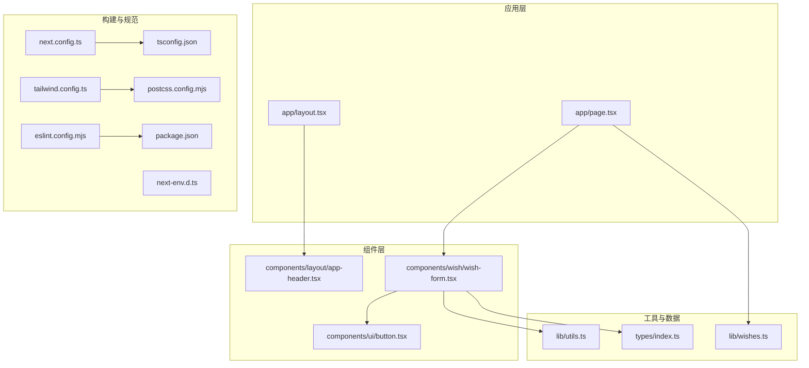
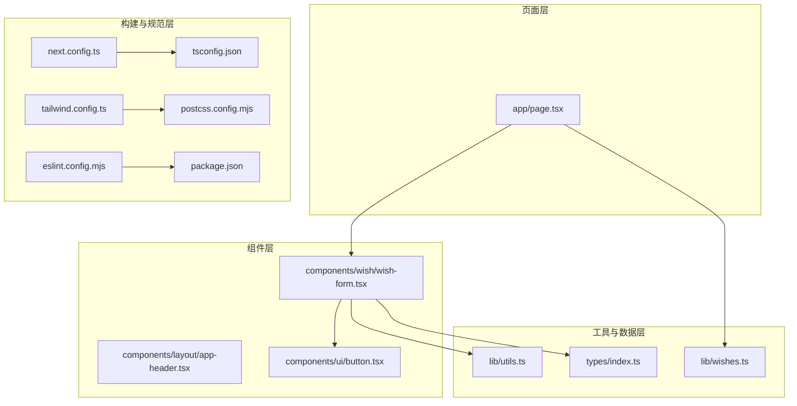
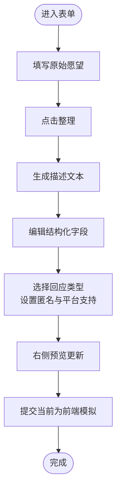
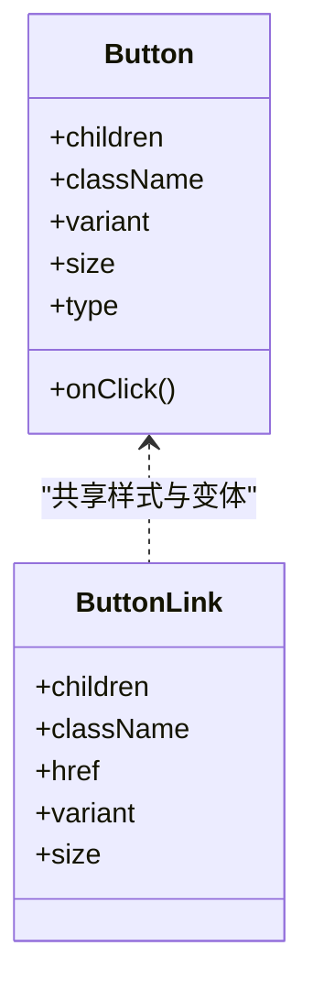
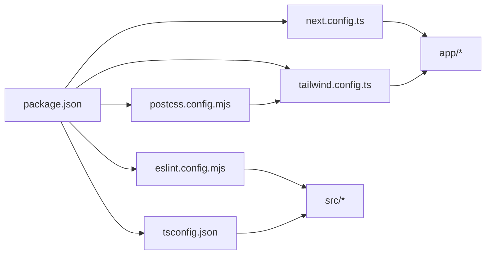

# 代码规范与最佳实践

<cite>
**本文引用的文件**   
- [eslint.config.mjs](file://eslint.config.mjs)
- [tsconfig.json](file://tsconfig.json)
- [package.json](file://package.json)
- [next.config.ts](file://next.config.ts)
- [tailwind.config.ts](file://tailwind.config.ts)
- [postcss.config.mjs](file://postcss.config.mjs)
- [next-env.d.ts](file://next-env.d.ts)
- [app/layout.tsx](file://app/layout.tsx)
- [app/page.tsx](file://app/page.tsx)
- [components/ui/button.tsx](file://components/ui/button.tsx)
- [components/layout/app-header.tsx](file://components/layout/app-header.tsx)
- [components/wish/wish-form.tsx](file://components/wish/wish-form.tsx)
- [lib/utils.ts](file://lib/utils.ts)
- [lib/wishes.ts](file://lib/wishes.ts)
- [types/index.ts](file://types/index.ts)
</cite>

## 目录
1. [简介](#简介)
2. [项目结构](#项目结构)
3. [核心组件](#核心组件)
4. [架构总览](#架构总览)
5. [详细组件分析](#详细组件分析)
6. [依赖关系分析](#依赖关系分析)
7. [性能考量](#性能考量)
8. [故障排查指南](#故障排查指南)
9. [结论](#结论)
10. [附录](#附录)

## 简介
本文件为“梦想回应平台”的代码规范与最佳实践指南，覆盖 ESLint 规则与 Web Vitals 质量标准、TypeScript 编译配置与类型安全实践、代码格式化与命名约定、注释与文档标准、性能优化与内存管理、错误处理与异常管理、以及重构与可维护性指导原则。目标是在保证开发效率的同时，确保代码一致性、可读性与可扩展性。

## 项目结构
项目采用 Next.js App Router 结构，按功能模块组织文件：
- 应用入口与全局样式：app/layout.tsx、app/globals.css、app/page.tsx
- 组件层：components/ui（通用 UI）、components/layout（布局）、components/wish（业务组件）
- 工具与数据访问：lib/utils.ts、lib/wishes.ts
- 类型定义：types/index.ts
- 构建与工具链：next.config.ts、tsconfig.json、tailwind.config.ts、postcss.config.mjs、eslint.config.mjs、package.json、next-env.d.ts

图表来源
- [app/layout.tsx:1-29](file://app/layout.tsx#L1-L29)
- [app/page.tsx:1-29](file://app/page.tsx#L1-L29)
- [components/layout/app-header.tsx:1-64](file://components/layout/app-header.tsx#L1-L64)
- [components/ui/button.tsx:1-75](file://components/ui/button.tsx#L1-L75)
- [components/wish/wish-form.tsx:1-264](file://components/wish/wish-form.tsx#L1-L264)
- [lib/utils.ts:1-12](file://lib/utils.ts#L1-L12)
- [lib/wishes.ts:1-27](file://lib/wishes.ts#L1-L27)
- [types/index.ts:1-58](file://types/index.ts#L1-L58)
- [next.config.ts:1-9](file://next.config.ts#L1-L9)
- [tsconfig.json:1-29](file://tsconfig.json#L1-L29)
- [tailwind.config.ts:1-55](file://tailwind.config.ts#L1-L55)
- [postcss.config.mjs:1-9](file://postcss.config.mjs#L1-L9)
- [eslint.config.mjs:1-19](file://eslint.config.mjs#L1-L19)
- [package.json:1-29](file://package.json#L1-L29)
- [next-env.d.ts:1-7](file://next-env.d.ts#L1-L7)

章节来源
- [app/layout.tsx:1-29](file://app/layout.tsx#L1-L29)
- [app/page.tsx:1-29](file://app/page.tsx#L1-L29)
- [next.config.ts:1-9](file://next.config.ts#L1-L9)
- [tsconfig.json:1-29](file://tsconfig.json#L1-L29)
- [tailwind.config.ts:1-55](file://tailwind.config.ts#L1-L55)
- [postcss.config.mjs:1-9](file://postcss.config.mjs#L1-L9)
- [eslint.config.mjs:1-19](file://eslint.config.mjs#L1-L19)
- [package.json:1-29](file://package.json#L1-L29)
- [next-env.d.ts:1-7](file://next-env.d.ts#L1-L7)

## 核心组件
- 布局与导航：根布局负责站点元信息与全局样式注入；头部组件提供导航与按钮。
- 页面逻辑：首页聚合精选与最新愿望，并统计待回应数量。
- 表单组件：愿望表单分三步引导用户完成从原始想法到结构化内容的整理，并支持 AI 预览模拟。
- 通用 UI：Button 提供多种变体与尺寸，统一交互风格。
- 工具函数：条件类名合并与日期格式化等基础能力。
- 数据访问：通过 lib 层封装 mock 数据，便于替换为真实后端。

章节来源
- [app/layout.tsx:1-29](file://app/layout.tsx#L1-L29)
- [app/page.tsx:1-29](file://app/page.tsx#L1-L29)
- [components/layout/app-header.tsx:1-64](file://components/layout/app-header.tsx#L1-L64)
- [components/ui/button.tsx:1-75](file://components/ui/button.tsx#L1-L75)
- [components/wish/wish-form.tsx:1-264](file://components/wish/wish-form.tsx#L1-L264)
- [lib/utils.ts:1-12](file://lib/utils.ts#L1-L12)
- [lib/wishes.ts:1-27](file://lib/wishes.ts#L1-L27)

## 架构总览
系统遵循“页面层 → 组件层 → 工具与数据层 → 构建与规范层”的分层设计。页面负责数据获取与渲染；组件层复用性强；工具与数据层抽象数据访问；构建与规范层统一约束开发体验与质量。

图表来源
- [app/page.tsx:1-29](file://app/page.tsx#L1-L29)
- [components/wish/wish-form.tsx:1-264](file://components/wish/wish-form.tsx#L1-L264)
- [components/layout/app-header.tsx:1-64](file://components/layout/app-header.tsx#L1-L64)
- [components/ui/button.tsx:1-75](file://components/ui/button.tsx#L1-L75)
- [lib/wishes.ts:1-27](file://lib/wishes.ts#L1-L27)
- [lib/utils.ts:1-12](file://lib/utils.ts#L1-L12)
- [types/index.ts:1-58](file://types/index.ts#L1-L58)
- [next.config.ts:1-9](file://next.config.ts#L1-L9)
- [tsconfig.json:1-29](file://tsconfig.json#L1-L29)
- [tailwind.config.ts:1-55](file://tailwind.config.ts#L1-L55)
- [postcss.config.mjs:1-9](file://postcss.config.mjs#L1-L9)
- [eslint.config.mjs:1-19](file://eslint.config.mjs#L1-L19)
- [package.json:1-29](file://package.json#L1-L29)

## 详细组件分析

### 组件：WishForm（愿望表单）
- 功能要点
  - 第一步：输入原始愿望，触发“整理”以生成结构化内容。
  - 第二步：编辑标题、描述、动机与卡点。
  - 第三步：选择所需回应类型、设置匿名与平台支持选项。
  - 右侧预览组件展示整理后的效果。
- 设计模式
  - 使用受控组件与状态管理，保持 UI 与状态同步。
  - 将复杂交互拆分为小函数（如 Field、Toggle），提升可读性。
- 性能与可维护性
  - 通过局部状态隔离表单字段，避免不必要的重渲染。
  - 使用工具函数合并类名，减少重复逻辑。

图表来源
- [components/wish/wish-form.tsx:95-263](file://components/wish/wish-form.tsx#L95-L263)

章节来源
- [components/wish/wish-form.tsx:1-264](file://components/wish/wish-form.tsx#L1-L264)

### 组件：Button（通用按钮）
- 设计要点
  - 支持原生按钮与链接两种形态，统一基类样式与变体/尺寸映射。
  - 通过类型联合限定变体与尺寸，增强安全性。
- 可复用性
  - 通过 className 扩展与 props 组合，满足不同场景。

图表来源
- [components/ui/button.tsx:40-74](file://components/ui/button.tsx#L40-L74)

章节来源
- [components/ui/button.tsx:1-75](file://components/ui/button.tsx#L1-L75)

### 组件：AppHeader（应用头部）
- 设计要点
  - 包含品牌标识、导航项与发布按钮，响应式布局。
  - 使用 Badge 与 ButtonLink 统一风格。
- 可维护性
  - 导航项集中定义，便于扩展与维护。

章节来源
- [components/layout/app-header.tsx:1-64](file://components/layout/app-header.tsx#L1-L64)

### 页面：HomePage（首页）
- 设计要点
  - 调用数据访问层获取愿望列表，计算待回应数量并渲染各区块。
- 可维护性
  - 将数据获取与渲染分离，利于后续替换为真实接口。

章节来源
- [app/page.tsx:1-29](file://app/page.tsx#L1-L29)
- [lib/wishes.ts:1-27](file://lib/wishes.ts#L1-L27)

### 工具：utils（工具函数）
- 设计要点
  - 条件类名合并函数用于简化样式拼接。
  - 日期格式化函数统一时间展示格式。
- 可复用性
  - 作为通用工具库，供组件层调用。

章节来源
- [lib/utils.ts:1-12](file://lib/utils.ts#L1-L12)

### 类型：index（类型定义）
- 设计要点
  - 定义愿望状态、回应类型、分类与接口，确保数据结构一致。
- 可维护性
  - 类型集中管理，便于跨模块共享与约束。

章节来源
- [types/index.ts:1-58](file://types/index.ts#L1-L58)

## 依赖关系分析
- 构建与运行
  - Next.js 作为框架，配合 TypeScript 与 TailwindCSS 实现类型安全与样式体系。
  - PostCSS 与 Autoprefixer 自动处理浏览器兼容与前缀。
- 规范与质量
  - ESLint 采用 Next.js 的 Web Vitals 规则集，结合自定义忽略规则，保障性能指标与可维护性。
- 开发脚本
  - 提供 dev/build/start/lint 等常用命令，统一开发流程。

图表来源
- [package.json:1-29](file://package.json#L1-L29)
- [next.config.ts:1-9](file://next.config.ts#L1-L9)
- [eslint.config.mjs:1-19](file://eslint.config.mjs#L1-L19)
- [tsconfig.json:1-29](file://tsconfig.json#L1-L29)
- [tailwind.config.ts:1-55](file://tailwind.config.ts#L1-L55)
- [postcss.config.mjs:1-9](file://postcss.config.mjs#L1-L9)

章节来源
- [package.json:1-29](file://package.json#L1-L29)
- [next.config.ts:1-9](file://next.config.ts#L1-L9)
- [eslint.config.mjs:1-19](file://eslint.config.mjs#L1-L19)
- [tsconfig.json:1-29](file://tsconfig.json#L1-L29)
- [tailwind.config.ts:1-55](file://tailwind.config.ts#L1-L55)
- [postcss.config.mjs:1-9](file://postcss.config.mjs#L1-L9)

## 性能考量
- Web Vitals 与 ESLint 集成
  - 通过引入 Next.js 的 Web Vitals 规则集，自动识别潜在影响 LCP、INP、CLS 的问题，降低性能回归风险。
- 构建与运行时优化
  - 启用严格模式与增量编译，缩短开发时长。
  - 使用路径别名与打包器解析策略，减少模块解析开销。
- 组件层面优化
  - 将大组件拆分为细粒度子组件，避免不必要的重渲染。
  - 在交互密集区域使用受控组件与最小状态树，减少状态抖动。
- 样式与资源
  - Tailwind 按需扫描范围明确，避免无用样式进入产物。
  - 图片与字体采用现代加载策略，配合占位与懒加载。

章节来源
- [eslint.config.mjs:1-19](file://eslint.config.mjs#L1-L19)
- [tsconfig.json:1-29](file://tsconfig.json#L1-L29)
- [tailwind.config.ts:1-55](file://tailwind.config.ts#L1-L55)
- [postcss.config.mjs:1-9](file://postcss.config.mjs#L1-L9)
- [next.config.ts:1-9](file://next.config.ts#L1-L9)

## 故障排查指南
- ESLint 报错
  - 检查是否命中忽略规则或未纳入扫描范围；必要时调整忽略列表或新增规则。
  - 关注 Web Vitals 相关规则提示，优先修复影响 LCP/INP/CLS 的问题。
- TypeScript 错误
  - 确认类型定义完整且与实际数据结构一致；使用类型守卫与非空断言时保持谨慎。
  - 若出现类型冲突，检查路径映射与插件配置。
- 构建失败
  - 核对 Next.js 配置与环境变量；确认 distDir 设置与构建脚本一致。
- 样式异常
  - 检查 Tailwind 扫描路径与颜色/字体定义；确认 PostCSS 插件顺序正确。

章节来源
- [eslint.config.mjs:1-19](file://eslint.config.mjs#L1-L19)
- [tsconfig.json:1-29](file://tsconfig.json#L1-L29)
- [next.config.ts:1-9](file://next.config.ts#L1-L9)
- [tailwind.config.ts:1-55](file://tailwind.config.ts#L1-L55)
- [postcss.config.mjs:1-9](file://postcss.config.mjs#L1-L9)

## 结论
本规范以 Next.js 生态为核心，结合 ESLint Web Vitals 规则、严格的 TypeScript 配置与 TailwindCSS 样式体系，形成从构建到运行的完整质量闭环。建议在日常开发中持续遵循本文档的命名、格式、类型与性能实践，确保代码一致性与长期可维护性。

## 附录

### 代码规范与最佳实践清单
- ESLint 与 Web Vitals
  - 使用 Next.js 提供的 Web Vitals 规则集，关注 LCP/INP/CLS 指标。
  - 明确忽略规则，避免将构建产物与第三方目录纳入扫描。
- TypeScript 编译配置
  - 严格模式开启，禁止 emit，启用增量编译与隔离模块。
  - 使用 bundler 解析策略与路径别名，提升开发体验。
- 代码格式化与命名约定
  - 文件命名：页面与组件使用帕斯卡命名法；工具函数使用驼峰命名法。
  - 变量命名：语义化强、避免缩写；常量使用全大写加下划线。
  - 组件命名：功能明确、层级清晰；UI 组件统一前缀（如 ui/）。
- 注释与文档
  - 对外暴露的组件与函数提供简要说明；复杂逻辑补充注释。
  - README 或组件注释中说明职责、参数与返回值。
- 性能优化与内存管理
  - 减少不必要的状态提升与重渲染；使用受控组件与局部状态。
  - 避免在渲染期间进行昂贵计算；将计算结果缓存或延迟执行。
- 错误处理与异常管理
  - 对外部数据访问进行容错处理；对用户输入进行校验与清理。
  - 使用类型守卫与边界条件判断，避免未定义行为。
- 重构与可维护性
  - 遵循单一职责；拆分过长函数与过深嵌套。
  - 保持类型稳定与接口一致；逐步替换实现而不改变调用方。