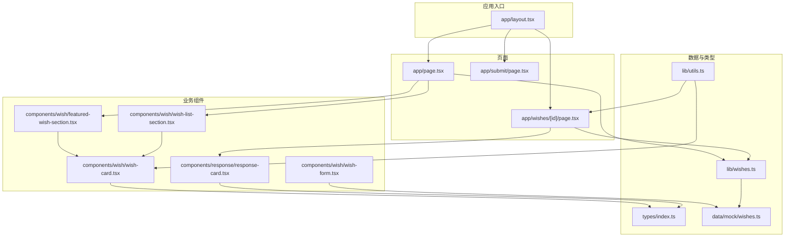
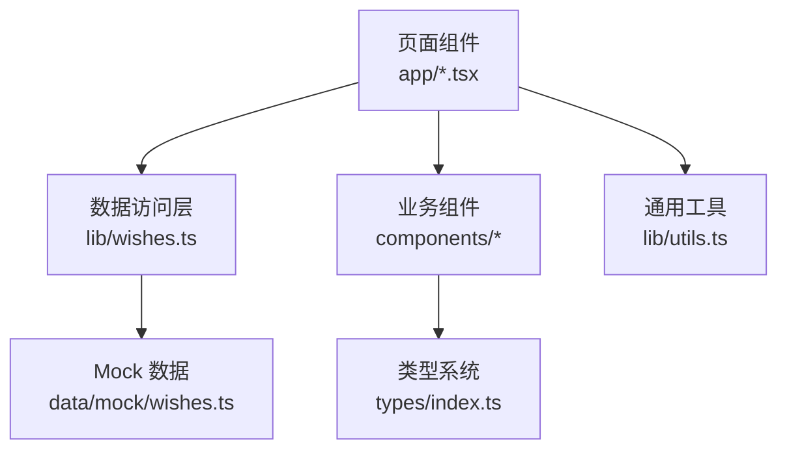
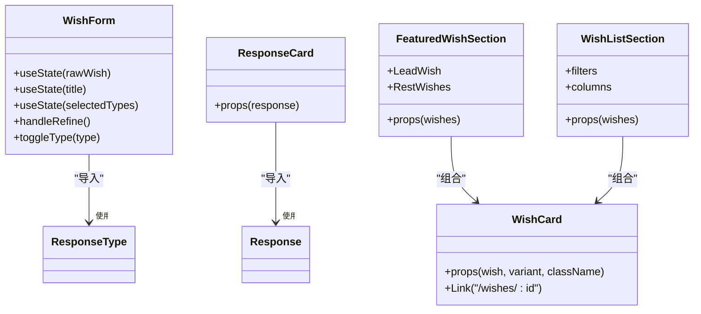
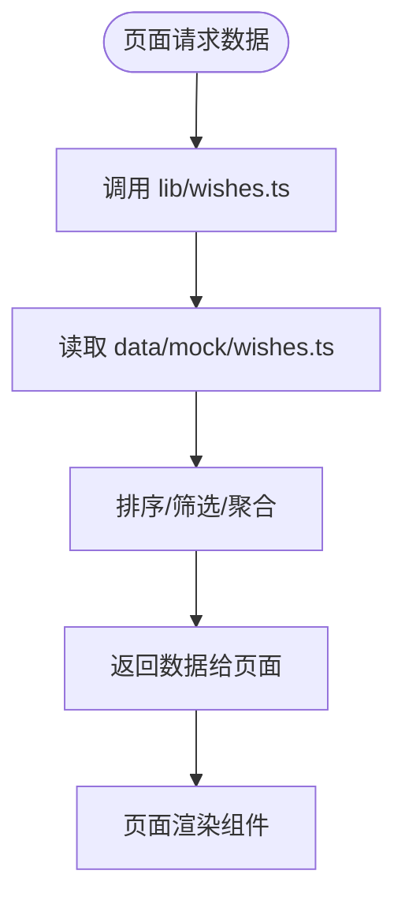
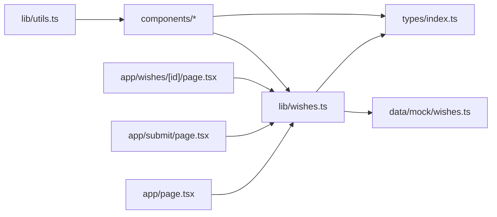

# 功能开发流程

<cite>
**本文引用的文件**
- [package.json](file://package.json)
- [next.config.ts](file://next.config.ts)
- [app/layout.tsx](file://app/layout.tsx)
- [app/page.tsx](file://app/page.tsx)
- [app/submit/page.tsx](file://app/submit/page.tsx)
- [app/wishes/[id]/page.tsx](file://app/wishes/[id]/page.tsx)
- [components/wish/wish-form.tsx](file://components/wish/wish-form.tsx)
- [components/wish/wish-card.tsx](file://components/wish/wish-card.tsx)
- [components/wish/featured-wish-section.tsx](file://components/wish/featured-wish-section.tsx)
- [components/wish/wish-list-section.tsx](file://components/wish/wish-list-section.tsx)
- [components/response/response-card.tsx](file://components/response/response-card.tsx)
- [lib/wishes.ts](file://lib/wishes.ts)
- [lib/utils.ts](file://lib/utils.ts)
- [types/index.ts](file://types/index.ts)
- [data/mock/wishes.ts](file://data/mock/wishes.ts)
</cite>

## 目录
1. [引言](#引言)
2. [项目结构](#项目结构)
3. [核心组件](#核心组件)
4. [架构总览](#架构总览)
5. [详细组件分析](#详细组件分析)
6. [依赖关系分析](#依赖关系分析)
7. [性能考量](#性能考量)
8. [故障排查指南](#故障排查指南)
9. [结论](#结论)
10. [附录](#附录)

## 引言
本文件面向希望在本项目中新增功能的开发者，提供从需求分析到功能上线的标准化流程。内容覆盖：
- 页面路由配置（Next.js App Router）
- 组件设计与复用模式
- 数据访问层扩展与 Mock 数据管理
- API 接口开发与集成最佳实践
- 表单验证、状态管理与错误处理
- 测试与质量保障实施步骤

## 项目结构
本项目采用 Next.js App Router 的目录约定组织页面与组件，核心目录如下：
- app：页面级路由与布局
- components：可复用 UI 与业务组件
- lib：数据访问与通用工具
- types：类型定义
- data/mock：Mock 数据
- 根配置：package.json、next.config.ts 等

图表来源
- [app/layout.tsx:1-29](file://app/layout.tsx#L1-L29)
- [app/page.tsx:1-29](file://app/page.tsx#L1-L29)
- [app/submit/page.tsx:1-24](file://app/submit/page.tsx#L1-L24)
- [app/wishes/[id]/page.tsx:1-184](file://app/wishes/[id]/page.tsx#L1-L184)
- [components/wish/wish-form.tsx:1-264](file://components/wish/wish-form.tsx#L1-L264)
- [components/wish/wish-card.tsx:1-93](file://components/wish/wish-card.tsx#L1-L93)
- [components/wish/featured-wish-section.tsx:1-47](file://components/wish/featured-wish-section.tsx#L1-L47)
- [components/wish/wish-list-section.tsx:1-77](file://components/wish/wish-list-section.tsx#L1-L77)
- [components/response/response-card.tsx:1-48](file://components/response/response-card.tsx#L1-L48)
- [lib/wishes.ts:1-27](file://lib/wishes.ts#L1-L27)
- [lib/utils.ts:1-12](file://lib/utils.ts#L1-L12)
- [types/index.ts:1-58](file://types/index.ts#L1-L58)
- [data/mock/wishes.ts:1-210](file://data/mock/wishes.ts#L1-L210)

章节来源
- [package.json:1-29](file://package.json#L1-L29)
- [next.config.ts:1-9](file://next.config.ts#L1-L9)
- [app/layout.tsx:1-29](file://app/layout.tsx#L1-L29)

## 核心组件
- 页面组件：负责路由渲染与数据获取，如首页、提交页、愿望详情页。
- 业务组件：如 wish-form、wish-card、response-card 等，封装交互与展示逻辑。
- 数据访问层：lib/wishes.ts 将页面与 Mock 数据解耦，便于替换为真实后端。
- 类型系统：types/index.ts 提供 Wish、Response、枚举类型，确保数据一致性。

章节来源
- [app/page.tsx:1-29](file://app/page.tsx#L1-L29)
- [app/submit/page.tsx:1-24](file://app/submit/page.tsx#L1-L24)
- [app/wishes/[id]/page.tsx:1-184](file://app/wishes/[id]/page.tsx#L1-L184)
- [components/wish/wish-form.tsx:1-264](file://components/wish/wish-form.tsx#L1-L264)
- [components/wish/wish-card.tsx:1-93](file://components/wish/wish-card.tsx#L1-L93)
- [components/response/response-card.tsx:1-48](file://components/response/response-card.tsx#L1-L48)
- [lib/wishes.ts:1-27](file://lib/wishes.ts#L1-L27)
- [types/index.ts:1-58](file://types/index.ts#L1-L58)

## 架构总览
本项目采用“页面组件 + 业务组件 + 数据访问层 + 类型系统”的分层架构。页面通过 lib 层访问数据，业务组件复用性强，类型系统贯穿始终，确保可维护性与可扩展性。

图表来源
- [app/page.tsx:1-29](file://app/page.tsx#L1-L29)
- [app/submit/page.tsx:1-24](file://app/submit/page.tsx#L1-L24)
- [app/wishes/[id]/page.tsx:1-184](file://app/wishes/[id]/page.tsx#L1-L184)
- [lib/wishes.ts:1-27](file://lib/wishes.ts#L1-L27)
- [data/mock/wishes.ts:1-210](file://data/mock/wishes.ts#L1-L210)
- [types/index.ts:1-58](file://types/index.ts#L1-L58)
- [lib/utils.ts:1-12](file://lib/utils.ts#L1-L12)

## 详细组件分析

### 新增页面：标准化步骤（以 App Router 为例）
- 路由与页面文件
  - 在 app 下新建目录与页面文件，例如 app/new-feature/page.tsx。
  - 如需动态路由，使用方括号命名，如 app/wishes/[id]/page.tsx。
- 布局与元信息
  - 使用 app/layout.tsx 作为根布局，确保全局样式与头部组件一致。
  - 在页面内导出 metadata 或使用默认布局。
- 数据获取
  - 首屏数据通过 lib 层获取，保持与 Mock 数据解耦。
  - 如需静态生成参数，可实现 generateStaticParams。
- 导航与跳转
  - 使用 Next.js Link 或编程式导航进行页面间跳转。
- 示例参考
  - 新增页面：app/submit/page.tsx
  - 动态详情页：app/wishes/[id]/page.tsx

章节来源
- [app/layout.tsx:1-29](file://app/layout.tsx#L1-L29)
- [app/submit/page.tsx:1-24](file://app/submit/page.tsx#L1-L24)
- [app/wishes/[id]/page.tsx:1-184](file://app/wishes/[id]/page.tsx#L1-L184)

### 业务组件开发流程（以 wish-form、wish-card 为例）
- 设计原则
  - 单一职责：每个组件聚焦一个功能点。
  - 可复用性：通过 props 传递数据与行为，避免硬编码。
  - 类型安全：严格使用 types/index.ts 中的类型。
- 组件拆分
  - 将复杂表单拆分为字段组件（如 Field、Toggle）与主组件（WishForm）。
  - 将列表项拆分为卡片组件（WishCard），并在容器组件中组合。
- 状态管理
  - 表单内部状态使用 useState 管理，避免污染全局状态。
  - 对外暴露受控属性与回调，便于父组件统一管理。
- 错误处理
  - 对空值、非法输入进行前置校验与提示。
  - 对不可达数据返回兜底文案或占位符。
- 示例参考
  - 表单组件：components/wish/wish-form.tsx
  - 列表卡片：components/wish/wish-card.tsx
  - 列表容器：components/wish/wish-list-section.tsx
  - 特色推荐容器：components/wish/featured-wish-section.tsx
  - 回应卡片：components/response/response-card.tsx

图表来源
- [components/wish/wish-form.tsx:1-264](file://components/wish/wish-form.tsx#L1-L264)
- [components/wish/wish-card.tsx:1-93](file://components/wish/wish-card.tsx#L1-L93)
- [components/response/response-card.tsx:1-48](file://components/response/response-card.tsx#L1-L48)
- [components/wish/featured-wish-section.tsx:1-47](file://components/wish/featured-wish-section.tsx#L1-L47)
- [components/wish/wish-list-section.tsx:1-77](file://components/wish/wish-list-section.tsx#L1-L77)
- [types/index.ts:1-58](file://types/index.ts#L1-L58)

章节来源
- [components/wish/wish-form.tsx:1-264](file://components/wish/wish-form.tsx#L1-L264)
- [components/wish/wish-card.tsx:1-93](file://components/wish/wish-card.tsx#L1-L93)
- [components/wish/featured-wish-section.tsx:1-47](file://components/wish/featured-wish-section.tsx#L1-L47)
- [components/wish/wish-list-section.tsx:1-77](file://components/wish/wish-list-section.tsx#L1-L77)
- [components/response/response-card.tsx:1-48](file://components/response/response-card.tsx#L1-L48)

### 数据访问层扩展与 Mock 数据管理
- 扩展策略
  - 保持 lib/wishes.ts 作为数据访问门面，所有页面数据请求从此处进入。
  - 通过函数封装排序、筛选、聚合等逻辑，便于替换为真实后端。
- Mock 数据
  - data/mock/wishes.ts 提供 Wish、Response、枚举集合，用于前端演示与联调。
  - 新增数据时，遵循 types/index.ts 中的接口定义，确保类型一致。
- 替换方案
  - 当接入后端时，仅需修改 lib/wishes.ts 中的具体实现，不影响页面与组件。

图表来源
- [lib/wishes.ts:1-27](file://lib/wishes.ts#L1-L27)
- [data/mock/wishes.ts:1-210](file://data/mock/wishes.ts#L1-L210)
- [types/index.ts:1-58](file://types/index.ts#L1-L58)

章节来源
- [lib/wishes.ts:1-27](file://lib/wishes.ts#L1-L27)
- [data/mock/wishes.ts:1-210](file://data/mock/wishes.ts#L1-L210)
- [types/index.ts:1-58](file://types/index.ts#L1-L58)

### API 接口开发与集成最佳实践
- 接口设计
  - 明确请求/响应结构，优先复用 types/index.ts 中的类型。
  - 使用 REST 风格路径，如 /api/wishes、/api/responses。
- 集成方式
  - 页面内通过 lib 层发起请求，避免直接在组件中写网络逻辑。
  - 对于静态路由参数，可在页面实现 generateStaticParams 并结合服务端渲染。
- 错误处理
  - 对 404、5xx 等异常场景进行统一处理（如 notFound、错误提示）。
  - 对空数据返回默认占位，保证用户体验。

章节来源
- [app/wishes/[id]/page.tsx:13-184](file://app/wishes/[id]/page.tsx#L13-L184)
- [types/index.ts:1-58](file://types/index.ts#L1-L58)

### 表单验证、状态管理与错误处理模式
- 表单验证
  - 在提交前进行必填字段与格式校验，失败时提示用户。
  - 对 AI 预览等异步操作，使用加载态与禁用按钮提升可用性。
- 状态管理
  - 表单内部使用 useState 管理字段状态；对外通过 props 与回调暴露。
  - 列表筛选与过滤在容器组件中集中处理，减少重复逻辑。
- 错误处理
  - 对不存在的数据返回 notFound 或友好提示。
  - 对空数组或缺失字段提供默认文案与占位。

章节来源
- [components/wish/wish-form.tsx:1-264](file://components/wish/wish-form.tsx#L1-L264)
- [components/wish/wish-list-section.tsx:1-77](file://components/wish/wish-list-section.tsx#L1-L77)
- [app/wishes/[id]/page.tsx:27-29](file://app/wishes/[id]/page.tsx#L27-L29)

### 功能测试与质量保证
- 单元测试
  - 对纯函数与工具函数（如日期格式化）编写测试用例。
- 组件测试
  - 使用快照测试与交互测试，覆盖关键分支（如空数据、错误状态）。
- 端到端测试
  - 覆盖新增页面的完整流程（路由、渲染、交互）。
- 代码规范
  - 使用 ESLint 与 TypeScript 保证代码质量与类型安全。

章节来源
- [package.json:5-10](file://package.json#L5-L10)
- [lib/utils.ts:1-12](file://lib/utils.ts#L1-L12)

## 依赖关系分析
- 页面依赖 lib 层，lib 层依赖 types 与 data/mock。
- 业务组件依赖 types 与 lib，实现低耦合高内聚。
- 根布局统一注入全局样式与头部组件，确保一致性。

图表来源
- [app/page.tsx:1-29](file://app/page.tsx#L1-L29)
- [app/submit/page.tsx:1-24](file://app/submit/page.tsx#L1-L24)
- [app/wishes/[id]/page.tsx:1-184](file://app/wishes/[id]/page.tsx#L1-L184)
- [lib/wishes.ts:1-27](file://lib/wishes.ts#L1-L27)
- [types/index.ts:1-58](file://types/index.ts#L1-L58)
- [data/mock/wishes.ts:1-210](file://data/mock/wishes.ts#L1-L210)
- [lib/utils.ts:1-12](file://lib/utils.ts#L1-L12)

章节来源
- [package.json:1-29](file://package.json#L1-L29)
- [next.config.ts:1-9](file://next.config.ts#L1-L9)
- [app/layout.tsx:1-29](file://app/layout.tsx#L1-L29)

## 性能考量
- 静态生成与预渲染：对详情页使用 generateStaticParams，减少首屏渲染压力。
- 组件懒加载：对非关键路径组件按需引入。
- 数据缓存：在 lib 层增加内存缓存，避免重复计算与请求。
- 图片与字体优化：使用 Next.js 默认优化策略。

## 故障排查指南
- 路由 404
  - 检查动态路由参数与 generateStaticParams 返回值。
  - 确认目标数据是否存在。
- 数据为空
  - 核对 lib 层数据源与类型定义是否匹配。
  - 检查 Mock 数据是否完整。
- 组件渲染异常
  - 使用 React DevTools 检查 props 与状态。
  - 对空值进行防御性渲染。

章节来源
- [app/wishes/[id]/page.tsx:13-184](file://app/wishes/[id]/page.tsx#L13-L184)
- [lib/wishes.ts:1-27](file://lib/wishes.ts#L1-L27)
- [types/index.ts:1-58](file://types/index.ts#L1-L58)

## 结论
通过以上流程与实践，可以在本项目中高效、安全地新增功能。关键在于：
- 严格的分层与职责划分
- 以类型驱动的开发范式
- 以 lib 层为数据唯一入口
- 以组件为中心的可复用设计
- 以测试与规范保障质量

## 附录
- 开发环境
  - 使用 Next.js 15、React 19、TypeScript 5。
  - 通过 npm scripts 启动开发与构建。
- 配置参考
  - next.config.ts 设置严格模式与构建目录。
  - app/layout.tsx 提供全局样式与头部组件。

章节来源
- [package.json:1-29](file://package.json#L1-L29)
- [next.config.ts:1-9](file://next.config.ts#L1-L9)
- [app/layout.tsx:1-29](file://app/layout.tsx#L1-L29)