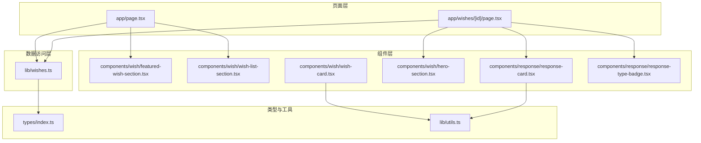
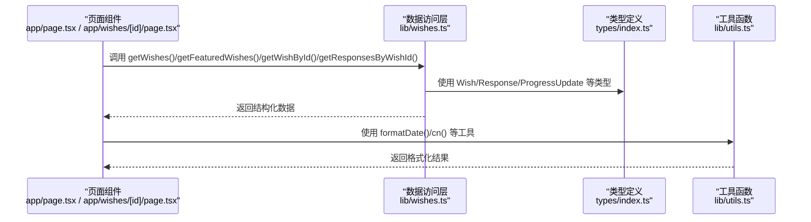
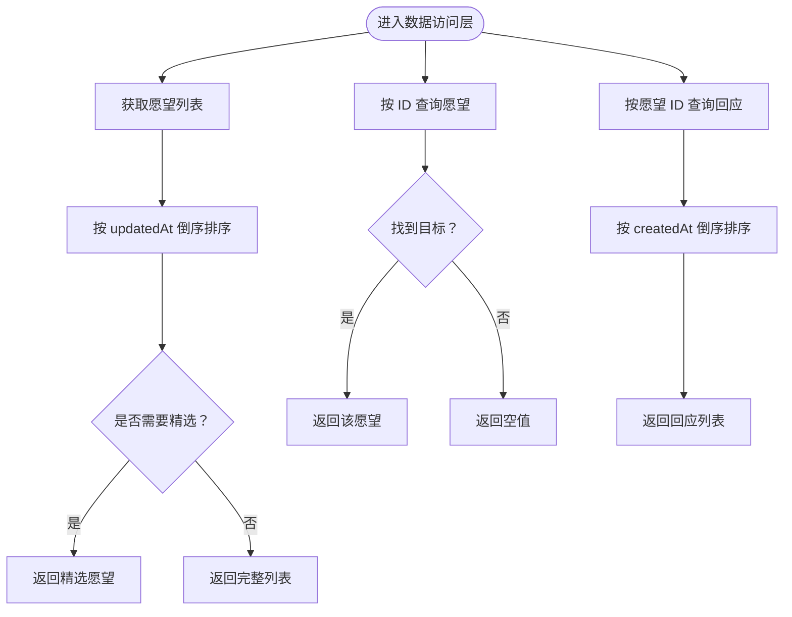
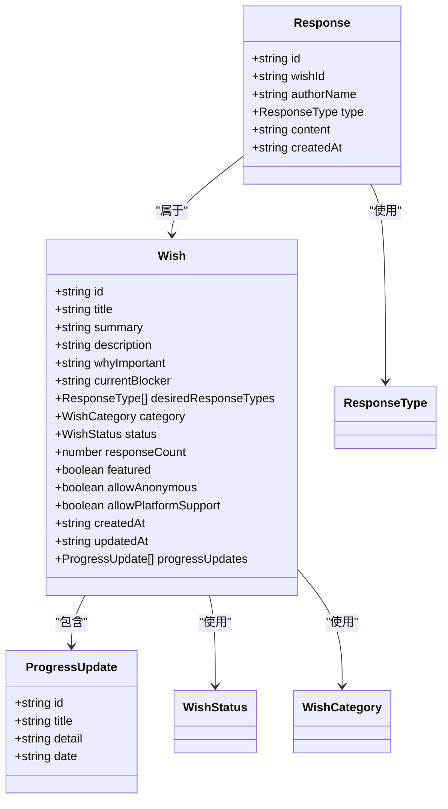
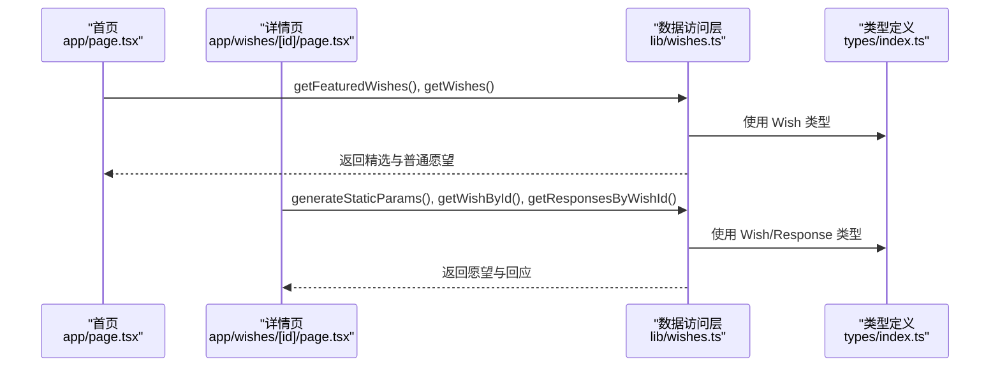
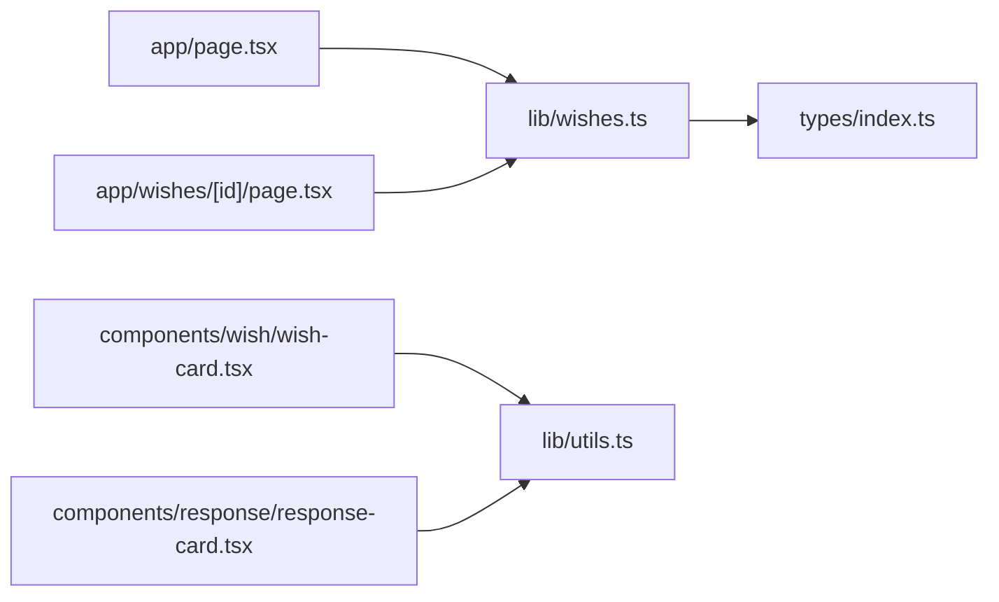

# 数据层扩展

<cite>
**本文引用的文件**
- [lib/wishes.ts](file://lib/wishes.ts)
- [types/index.ts](file://types/index.ts)
- [lib/utils.ts](file://lib/utils.ts)
- [app/page.tsx](file://app/page.tsx)
- [app/wishes/[id]/page.tsx](file://app/wishes/[id]/page.tsx)
- [components/wish/wish-list-section.tsx](file://components/wish/wish-list-section.tsx)
- [components/wish/featured-wish-section.tsx](file://components/wish/featured-wish-section.tsx)
- [components/wish/wish-card.tsx](file://components/wish/wish-card.tsx)
- [components/wish/hero-section.tsx](file://components/wish/hero-section.tsx)
- [components/response/response-card.tsx](file://components/response/response-card.tsx)
- [components/response/response-type-badge.tsx](file://components/response/response-type-badge.tsx)
- [package.json](file://package.json)
</cite>

## 目录
1. [简介](#简介)
2. [项目结构](#项目结构)
3. [核心组件](#核心组件)
4. [架构总览](#架构总览)
5. [详细组件分析](#详细组件分析)
6. [依赖分析](#依赖分析)
7. [性能考虑](#性能考虑)
8. [故障排查指南](#故障排查指南)
9. [结论](#结论)
10. [附录](#附录)

## 简介
本指南面向希望扩展现有数据访问层的开发者，目标是在不破坏现有页面组件的前提下，平滑引入真实后端与数据库，并保持 Mock 数据的可替换性。文档覆盖以下主题：
- 新增 API 接口与数据模型定义
- Mock 数据管理与迁移策略
- 数据获取模式、缓存策略与错误处理
- 数据验证、转换与格式化
- 集成真实后端与数据库连接
- 版本管理与向后兼容
- 测试与监控最佳实践

## 项目结构
当前项目采用“页面级组件 + 业务数据访问层 + 类型定义 + 工具函数”的分层组织方式：
- 页面组件负责渲染与交互，通过 lib 层的数据访问函数获取数据
- lib 层封装数据来源（当前为 Mock），未来可无缝切换至真实 API
- types 层集中定义数据模型与枚举类型
- 工具函数提供通用格式化与类名拼接能力
- 组件层复用性强，便于在不同页面间共享

图表来源
- [app/page.tsx:1-29](file://app/page.tsx#L1-L29)
- [app/wishes/[id]/page.tsx](file://app/wishes/[id]/page.tsx#L1-L184)
- [lib/wishes.ts:1-27](file://lib/wishes.ts#L1-L27)
- [types/index.ts:1-58](file://types/index.ts#L1-L58)
- [lib/utils.ts:1-12](file://lib/utils.ts#L1-L12)
- [components/wish/featured-wish-section.tsx:1-47](file://components/wish/featured-wish-section.tsx#L1-L47)
- [components/wish/wish-list-section.tsx:1-77](file://components/wish/wish-list-section.tsx#L1-L77)
- [components/wish/wish-card.tsx:1-93](file://components/wish/wish-card.tsx#L1-L93)
- [components/wish/hero-section.tsx:1-53](file://components/wish/hero-section.tsx#L1-L53)
- [components/response/response-card.tsx:1-48](file://components/response/response-card.tsx#L1-L48)
- [components/response/response-type-badge.tsx:1-43](file://components/response/response-type-badge.tsx#L1-L43)

章节来源
- [app/page.tsx:1-29](file://app/page.tsx#L1-L29)
- [app/wishes/[id]/page.tsx](file://app/wishes/[id]/page.tsx#L1-L184)
- [lib/wishes.ts:1-27](file://lib/wishes.ts#L1-L27)
- [types/index.ts:1-58](file://types/index.ts#L1-L58)
- [lib/utils.ts:1-12](file://lib/utils.ts#L1-L12)

## 核心组件
- 数据访问层（lib/wishes.ts）
  - 提供查询愿望列表、精选愿望、按 ID 查询愿望、按愿望 ID 查询回应等方法
  - 当前直接返回内存中的 Mock 数据，便于替换为真实 API
- 类型系统（types/index.ts）
  - 定义 Wish、Response、ProgressUpdate 及其相关枚举类型
  - 为数据模型提供强类型约束，便于后续迁移与校验
- 工具函数（lib/utils.ts）
  - 提供类名拼接与日期格式化等通用能力
- 页面与组件（app/* 与 components/*）
  - 页面通过数据访问层获取数据并传递给组件
  - 组件负责展示与交互，不直接依赖数据源

章节来源
- [lib/wishes.ts:1-27](file://lib/wishes.ts#L1-L27)
- [types/index.ts:1-58](file://types/index.ts#L1-L58)
- [lib/utils.ts:1-12](file://lib/utils.ts#L1-L12)
- [app/page.tsx:1-29](file://app/page.tsx#L1-L29)
- [app/wishes/[id]/page.tsx](file://app/wishes/[id]/page.tsx#L1-L184)

## 架构总览
下图展示了从页面到数据访问层再到类型系统的调用关系，以及组件对工具函数的依赖。

图表来源
- [app/page.tsx:1-29](file://app/page.tsx#L1-L29)
- [app/wishes/[id]/page.tsx](file://app/wishes/[id]/page.tsx#L1-L184)
- [lib/wishes.ts:1-27](file://lib/wishes.ts#L1-L27)
- [types/index.ts:1-58](file://types/index.ts#L1-L58)
- [lib/utils.ts:1-12](file://lib/utils.ts#L1-L12)

## 详细组件分析

### 数据访问层（lib/wishes.ts）
- 设计要点
  - 将页面层与数据源解耦，通过薄层函数屏蔽底层差异（当前为内存 Mock，未来可替换为 API 或数据库）
  - 对外暴露稳定的查询接口，便于组件直接消费
- 关键方法
  - 获取所有愿望并按更新时间倒序
  - 获取精选愿望
  - 按 ID 获取单个愿望
  - 按愿望 ID 获取回应并按创建时间倒序
- 扩展建议
  - 引入统一的错误包装与重试策略
  - 增加缓存层（如内存缓存/持久化缓存）以提升性能
  - 提供分页与过滤参数，支持大规模数据场景

图表来源
- [lib/wishes.ts:5-26](file://lib/wishes.ts#L5-L26)

章节来源
- [lib/wishes.ts:1-27](file://lib/wishes.ts#L1-L27)

### 类型系统（types/index.ts）
- 设计要点
  - 使用联合类型与接口定义领域模型，确保前后端一致
  - 通过枚举限定状态、类别与回应类型，降低歧义
- 关键实体
  - Wish：包含标题、摘要、描述、状态、分类、回应数、是否置顶、创建/更新时间、进度更新等
  - Response：包含回应内容、作者名、类型、创建时间等
  - ProgressUpdate：用于记录推进节点
- 扩展建议
  - 为每个字段补充默认值与可选性说明
  - 引入版本号字段，便于后续迁移与兼容

图表来源
- [types/index.ts:1-58](file://types/index.ts#L1-L58)

章节来源
- [types/index.ts:1-58](file://types/index.ts#L1-L58)

### 工具函数（lib/utils.ts）
- 设计要点
  - 提供跨组件复用的能力，如类名拼接与日期格式化
- 扩展建议
  - 增加国际化与本地化支持
  - 抽象为可配置的格式化器，便于在不同页面定制展示风格

章节来源
- [lib/utils.ts:1-12](file://lib/utils.ts#L1-L12)

### 页面与组件（app/* 与 components/*）
- 设计要点
  - 页面组件仅负责数据拉取与布局，不关心数据来源
  - 组件层通过 props 接收数据并渲染，具备良好的可测试性
- 典型流程
  - 首页：获取精选与普通愿望，计算待回应数量
  - 详情页：根据动态路由参数获取愿望与回应，生成静态参数以支持预渲染

图表来源
- [app/page.tsx:1-29](file://app/page.tsx#L1-L29)
- [app/wishes/[id]/page.tsx](file://app/wishes/[id]/page.tsx#L13-L31)
- [lib/wishes.ts:5-26](file://lib/wishes.ts#L5-L26)
- [types/index.ts:30-57](file://types/index.ts#L30-L57)

章节来源
- [app/page.tsx:1-29](file://app/page.tsx#L1-L29)
- [app/wishes/[id]/page.tsx](file://app/wishes/[id]/page.tsx#L1-L184)
- [components/wish/wish-list-section.tsx:1-77](file://components/wish/wish-list-section.tsx#L1-L77)
- [components/wish/featured-wish-section.tsx:1-47](file://components/wish/featured-wish-section.tsx#L1-L47)
- [components/wish/wish-card.tsx:1-93](file://components/wish/wish-card.tsx#L1-L93)
- [components/wish/hero-section.tsx:1-53](file://components/wish/hero-section.tsx#L1-L53)
- [components/response/response-card.tsx:1-48](file://components/response/response-card.tsx#L1-L48)
- [components/response/response-type-badge.tsx:1-43](file://components/response/response-type-badge.tsx#L1-L43)

## 依赖分析
- 组件与数据访问层
  - 页面组件依赖 lib/wishes.ts 的查询函数
  - 组件层依赖类型定义与工具函数
- 外部依赖
  - Next.js 生态（App Router、SSR/CSR、静态生成）
  - React 与 TypeScript

图表来源
- [app/page.tsx:1-29](file://app/page.tsx#L1-L29)
- [app/wishes/[id]/page.tsx](file://app/wishes/[id]/page.tsx#L1-L184)
- [lib/wishes.ts:1-27](file://lib/wishes.ts#L1-L27)
- [types/index.ts:1-58](file://types/index.ts#L1-L58)
- [lib/utils.ts:1-12](file://lib/utils.ts#L1-L12)
- [components/wish/wish-card.tsx:1-93](file://components/wish/wish-card.tsx#L1-L93)
- [components/response/response-card.tsx:1-48](file://components/response/response-card.tsx#L1-L48)

章节来源
- [package.json:1-29](file://package.json#L1-L29)

## 性能考虑
- 缓存策略
  - 内存缓存：在 lib 层维护最近查询结果，避免重复计算与重复请求
  - 持久化缓存：结合浏览器存储或服务端缓存（如 Redis），减少冷启动与重复加载
- 分页与懒加载
  - 列表页启用分页或虚拟滚动，避免一次性渲染大量数据
- 预渲染与增量更新
  - 使用 generateStaticParams 与增量静态再生（ISR）优化首屏性能
- 数据压缩与传输
  - 对长文本字段进行必要的裁剪与延迟加载
- 错误与降级
  - 请求失败时返回兜底数据或提示，保证用户体验连续性

## 故障排查指南
- 常见问题
  - 详情页 404：当按 ID 未找到愿望时触发 notFound，需确认路由参数与数据一致性
  - 数据为空：检查数据访问层返回值与组件渲染逻辑
  - 时间排序异常：确认日期字符串格式与解析顺序
- 建议措施
  - 在数据访问层增加日志与错误边界
  - 为关键查询添加超时与重试机制
  - 对外部 API 增加健康检查与熔断保护

章节来源
- [app/wishes/[id]/page.tsx](file://app/wishes/[id]/page.tsx#L27-L29)

## 结论
通过将页面层与数据访问层解耦，项目已具备良好的扩展基础。后续可在不改动组件的前提下，无缝接入真实后端与数据库；同时借助类型系统与工具函数，保障数据一致性与可维护性。建议优先完善缓存、错误处理与监控体系，再逐步引入分页、过滤与版本管理等高级特性。

## 附录

### 数据获取模式与缓存策略
- 获取模式
  - 首屏：页面直接调用 lib 层函数获取所需数据
  - 详情页：结合静态参数生成与运行时查询，兼顾 SEO 与实时性
- 缓存策略
  - L1：内存缓存（短期有效）
  - L2：持久化缓存（长期有效）
  - L3：CDN/边缘缓存（跨用户共享）

### 错误处理机制
- 统一错误包装：为 API/数据库调用提供统一的错误对象
- 重试与退避：对瞬时错误自动重试，指数退避避免雪崩
- 降级与兜底：失败时返回 Mock 数据或最小可用数据集

### 数据验证、转换与格式化
- 验证
  - 字段必填与类型校验
  - 枚举值范围校验
- 转换
  - 日期字符串转 Date 对象
  - 文本长度与 HTML 安全处理
- 格式化
  - 日期格式化（本地化）
  - 类名拼接与样式注入

### 集成真实后端与数据库
- 后端集成
  - 使用 fetch 或 HTTP 客户端封装 API
  - 为每个查询建立独立的适配器，保持 lib 层接口不变
- 数据库连接
  - 使用连接池与事务管理
  - 对热点数据建立索引，优化查询性能

### 数据迁移、版本管理与向后兼容
- 版本管理
  - 为数据模型增加版本号字段
  - 通过适配器映射旧版本字段到新结构
- 向后兼容
  - 保留旧字段并在适配器中做兼容处理
  - 渐进式迁移，避免一次性大改

### 数据层测试与监控
- 单元测试
  - 针对 lib 层函数编写测试，覆盖正常与异常路径
- 集成测试
  - 模拟 API/数据库响应，验证端到端流程
- 监控
  - 记录请求耗时、错误率与缓存命中率
  - 建立告警机制，及时发现性能与可用性问题