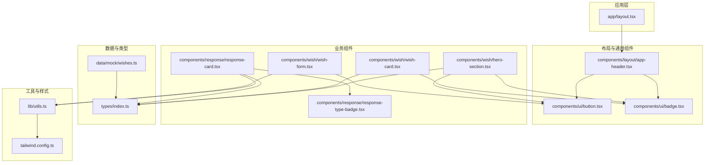
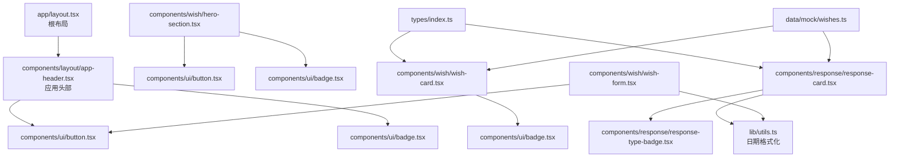
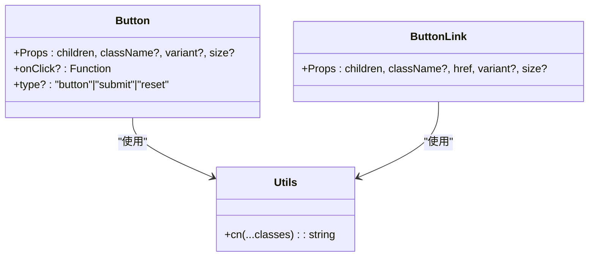
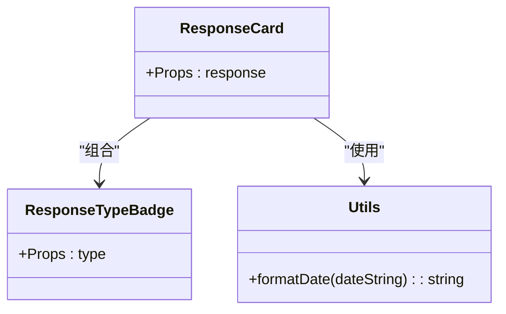
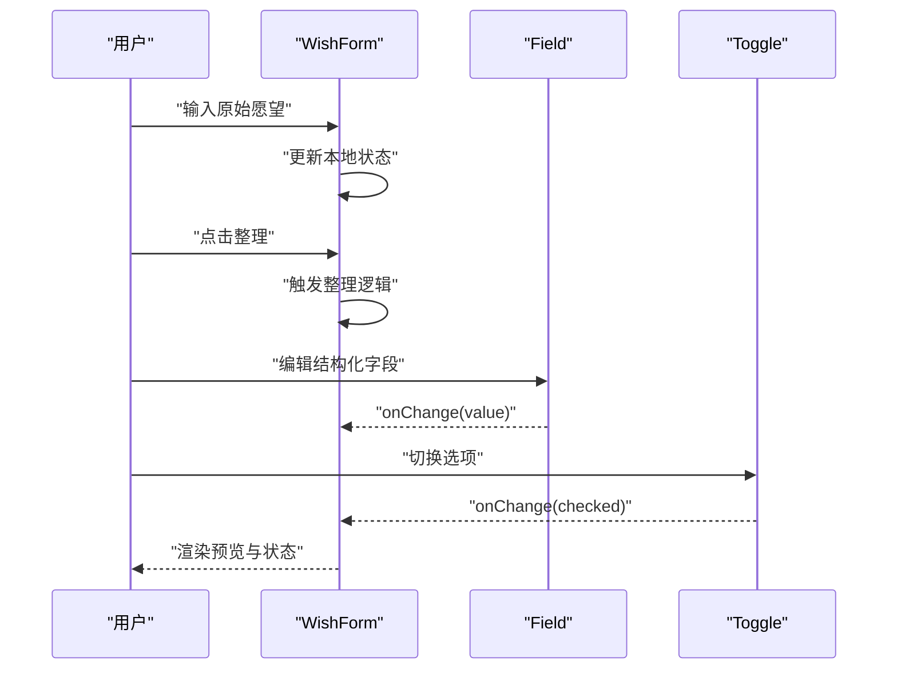
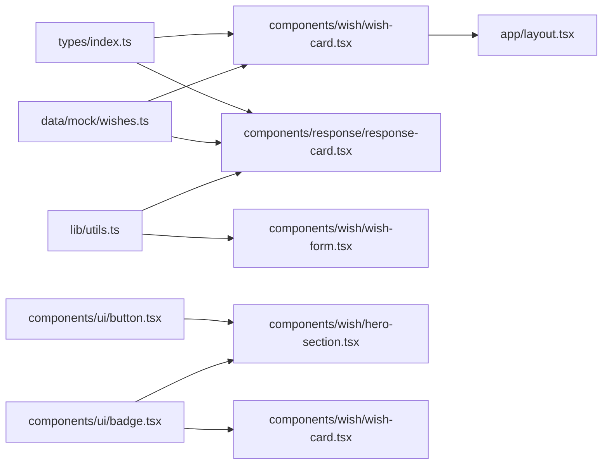

# 组件开发流程

<cite>
**本文引用的文件**   
- [package.json](file://package.json)
- [next.config.ts](file://next.config.ts)
- [tailwind.config.ts](file://tailwind.config.ts)
- [types/index.ts](file://types/index.ts)
- [lib/utils.ts](file://lib/utils.ts)
- [components/ui/button.tsx](file://components/ui/button.tsx)
- [components/ui/badge.tsx](file://components/ui/badge.tsx)
- [components/layout/app-header.tsx](file://components/layout/app-header.tsx)
- [components/response/response-card.tsx](file://components/response/response-card.tsx)
- [components/response/response-type-badge.tsx](file://components/response/response-type-badge.tsx)
- [components/wish/wish-card.tsx](file://components/wish/wish-card.tsx)
- [components/wish/hero-section.tsx](file://components/wish/hero-section.tsx)
- [components/wish/wish-form.tsx](file://components/wish/wish-form.tsx)
- [data/mock/wishes.ts](file://data/mock/wishes.ts)
- [app/layout.tsx](file://app/layout.tsx)
</cite>

## 目录
1. [简介](#简介)
2. [项目结构](#项目结构)
3. [核心组件](#核心组件)
4. [架构总览](#架构总览)
5. [详细组件分析](#详细组件分析)
6. [依赖关系分析](#依赖关系分析)
7. [性能考量](#性能考量)
8. [故障排查指南](#故障排查指南)
9. [结论](#结论)
10. [附录](#附录)

## 简介
本文件面向组件开发的标准流程，结合仓库中的实际组件与配置，系统阐述从组件设计到实现的全过程，覆盖以下要点：
- 组件类型定义与 Props 接口设计
- 状态管理（客户端组件与服务器组件的选择与实现差异）
- 组件组合模式与复用策略
- 组件间通信（props 传递、事件处理、上下文使用）
- 组件测试、调试与性能优化方法
- UI 组件库的设计原则与命名规范

## 项目结构
该项目基于 Next.js App Router，采用按功能分层的目录组织方式：
- app：应用根布局与页面入口
- components：按功能域拆分的组件集合（ui、layout、response、wish）
- data：数据模型与示例数据
- lib：通用工具函数
- types：全局类型定义
- 配置：Next.js、Tailwind CSS、ESLint 等

图表来源
- [app/layout.tsx:13-28](file://app/layout.tsx#L13-L28)
- [components/layout/app-header.tsx:22-63](file://components/layout/app-header.tsx#L22-L63)
- [components/ui/button.tsx:40-74](file://components/ui/button.tsx#L40-L74)
- [components/ui/badge.tsx:20-36](file://components/ui/badge.tsx#L20-L36)
- [components/wish/hero-section.tsx:10-52](file://components/wish/hero-section.tsx#L10-L52)
- [components/wish/wish-card.tsx:15-92](file://components/wish/wish-card.tsx#L15-L92)
- [components/wish/wish-form.tsx:95-263](file://components/wish/wish-form.tsx#L95-L263)
- [components/response/response-card.tsx:18-47](file://components/response/response-card.tsx#L18-L47)
- [components/response/response-type-badge.tsx:38-42](file://components/response/response-type-badge.tsx#L38-L42)
- [types/index.ts:1-58](file://types/index.ts#L1-L58)
- [data/mock/wishes.ts:12-150](file://data/mock/wishes.ts#L12-L150)
- [lib/utils.ts:1-12](file://lib/utils.ts#L1-L12)
- [tailwind.config.ts:1-55](file://tailwind.config.ts#L1-L55)

章节来源
- [package.json:1-29](file://package.json#L1-L29)
- [next.config.ts:3-6](file://next.config.ts#L3-L6)
- [tailwind.config.ts:4-51](file://tailwind.config.ts#L4-L51)

## 核心组件
本节聚焦 UI 组件库与业务组件的关键实现，总结类型定义、Props 设计与状态管理策略。

- 类型与数据模型
  - 使用 TypeScript 枚举联合类型与接口统一描述领域对象，确保 Props 与数据一致性。
  - 示例：领域类型包括状态、响应类型、分类等；实体接口包含字段与可选属性，便于扩展与兼容。

- 工具函数
  - 样式合并：通过工具函数将多个类名按条件拼接，避免冗余与冲突。
  - 日期格式化：统一日期展示风格，提升一致性与可维护性。

- UI 组件库
  - Button：支持按钮与链接两种渲染形态，通过变体与尺寸映射实现风格统一与可扩展。
  - Badge：通过色调映射实现语义化标签，支持多语义风格。

- 业务组件
  - HeroSection：聚合卡片与引导按钮，体现主视觉与行动号召。
  - WishCard：封装愿望卡片交互与展示逻辑，支持特色态与默认态。
  - ResponseCard：展示回应详情与类型标签，配合类型映射增强可读性。
  - WishForm：演示受控表单与本地状态管理，包含字段组件与开关组件。

章节来源
- [types/index.ts:1-58](file://types/index.ts#L1-L58)
- [lib/utils.ts:1-12](file://lib/utils.ts#L1-L12)
- [components/ui/button.tsx:24-74](file://components/ui/button.tsx#L24-L74)
- [components/ui/badge.tsx:14-36](file://components/ui/badge.tsx#L14-L36)
- [components/wish/hero-section.tsx:6-52](file://components/wish/hero-section.tsx#L6-L52)
- [components/wish/wish-card.tsx:9-92](file://components/wish/wish-card.tsx#L9-L92)
- [components/response/response-card.tsx:14-47](file://components/response/response-card.tsx#L14-L47)
- [components/response/response-type-badge.tsx:34-42](file://components/response/response-type-badge.tsx#L34-L42)
- [components/wish/wish-form.tsx:25-263](file://components/wish/wish-form.tsx#L25-L263)

## 架构总览
应用采用 App Router 结构，根布局负责注入全局头部与页面主体，业务组件按功能域拆分，UI 组件库提供基础构件，数据与类型定义贯穿全链路。

图表来源
- [app/layout.tsx:13-28](file://app/layout.tsx#L13-L28)
- [components/layout/app-header.tsx:22-63](file://components/layout/app-header.tsx#L22-L63)
- [components/ui/button.tsx:40-74](file://components/ui/button.tsx#L40-L74)
- [components/ui/badge.tsx:20-36](file://components/ui/badge.tsx#L20-L36)
- [components/wish/hero-section.tsx:10-52](file://components/wish/hero-section.tsx#L10-L52)
- [components/wish/wish-card.tsx:15-92](file://components/wish/wish-card.tsx#L15-L92)
- [components/response/response-card.tsx:18-47](file://components/response/response-card.tsx#L18-L47)
- [components/response/response-type-badge.tsx:38-42](file://components/response/response-type-badge.tsx#L38-L42)
- [components/wish/wish-form.tsx:95-263](file://components/wish/wish-form.tsx#L95-L263)
- [lib/utils.ts:5-10](file://lib/utils.ts#L5-L10)
- [types/index.ts:30-58](file://types/index.ts#L30-L58)
- [data/mock/wishes.ts:12-150](file://data/mock/wishes.ts#L12-L150)

## 详细组件分析

### 组件类型定义与 Props 设计
- 类型集中管理：在类型文件中定义枚举与接口，保证组件 Props 的类型安全与可演进性。
- 接口职责单一：每个组件的 Props 明确输入范围，避免过度耦合。
- 可选属性与默认值：通过可选字段与默认参数减少调用方负担，同时保持向后兼容。

章节来源
- [types/index.ts:1-58](file://types/index.ts#L1-L58)

### Button 组件（客户端组件）
- 设计要点
  - 形态分离：通过两个导出函数分别处理按钮与链接场景，降低调用复杂度。
  - 变体与尺寸：以映射表承载视觉风格，便于扩展与统一维护。
  - 样式合并：使用工具函数进行类名拼接，避免硬编码字符串。
- 状态管理
  - 作为纯展示组件，内部不持有状态；事件回调由父组件传入，遵循“受控”原则。
- 复用策略
  - 将通用样式与交互抽离为独立函数，便于在不同场景下复用。

图表来源
- [components/ui/button.tsx:24-74](file://components/ui/button.tsx#L24-L74)
- [lib/utils.ts:1-3](file://lib/utils.ts#L1-L3)

章节来源
- [components/ui/button.tsx:24-74](file://components/ui/button.tsx#L24-L74)
- [lib/utils.ts:1-3](file://lib/utils.ts#L1-L3)

### Badge 组件（客户端组件）
- 设计要点
  - 色调映射：通过记录表将语义与样式绑定，便于扩展新色调。
  - 语义化：支持多种语义风格，满足不同信息层级的展示需求。
- 状态管理
  - 纯展示组件，无内部状态。

章节来源
- [components/ui/badge.tsx:14-36](file://components/ui/badge.tsx#L14-L36)

### 响应卡片组件（客户端组件）
- 设计要点
  - 类型标签：通过类型映射生成标签与样式，保证一致性。
  - 文案辅助：根据类型提供帮助性文案，提升用户理解。
- 状态管理
  - 以只读 Props 输入为主，内部不维护状态。

图表来源
- [components/response/response-card.tsx:14-47](file://components/response/response-card.tsx#L14-L47)
- [components/response/response-type-badge.tsx:34-42](file://components/response/response-type-badge.tsx#L34-L42)
- [lib/utils.ts:5-10](file://lib/utils.ts#L5-L10)

章节来源
- [components/response/response-card.tsx:14-47](file://components/response/response-card.tsx#L14-L47)
- [components/response/response-type-badge.tsx:34-42](file://components/response/response-type-badge.tsx#L34-L42)
- [lib/utils.ts:5-10](file://lib/utils.ts#L5-L10)

### 愿望卡片组件（客户端组件）
- 设计要点
  - 变体支持：通过变体区分默认态与特色态，统一视觉层次。
  - 交互提示：通过伪元素与过渡动画增强交互反馈。
- 状态管理
  - 纯展示组件，内部不维护状态。

章节来源
- [components/wish/wish-card.tsx:9-92](file://components/wish/wish-card.tsx#L9-L92)

### 愿望表单组件（客户端组件）
- 设计要点
  - 表单分步：将复杂表单拆分为多个步骤，降低认知负担。
  - 受控组件：通过 useState 管理各字段状态，保证数据一致性。
  - 组合子组件：将字段与开关抽象为独立组件，提升复用性。
- 状态管理
  - 使用受控模式，所有状态由父组件驱动，便于测试与调试。
- 事件处理
  - 通过回调函数处理输入变更与按钮点击，保持组件解耦。

图表来源
- [components/wish/wish-form.tsx:95-263](file://components/wish/wish-form.tsx#L95-L263)

章节来源
- [components/wish/wish-form.tsx:25-263](file://components/wish/wish-form.tsx#L25-L263)

### 页面级布局（服务器组件）
- 设计要点
  - 根布局负责注入全局头部与页面主体，确保一致的导航与品牌呈现。
  - 服务器组件天然具备首屏渲染优势，适合用于布局与静态内容。

章节来源
- [app/layout.tsx:13-28](file://app/layout.tsx#L13-L28)

## 依赖关系分析
- 组件间依赖
  - 布局组件依赖 UI 组件库，形成自底向上的依赖关系。
  - 业务组件依赖类型与数据模块，确保数据一致性。
- 工具与样式
  - 工具函数被广泛复用，降低重复代码。
  - Tailwind 配置集中管理颜色、字体与阴影，统一视觉语言。

图表来源
- [types/index.ts:30-58](file://types/index.ts#L30-L58)
- [data/mock/wishes.ts:12-150](file://data/mock/wishes.ts#L12-L150)
- [lib/utils.ts:1-12](file://lib/utils.ts#L1-L12)
- [components/ui/button.tsx:40-74](file://components/ui/button.tsx#L40-L74)
- [components/ui/badge.tsx:20-36](file://components/ui/badge.tsx#L20-L36)
- [components/wish/hero-section.tsx:10-52](file://components/wish/hero-section.tsx#L10-L52)
- [components/wish/wish-card.tsx:15-92](file://components/wish/wish-card.tsx#L15-L92)
- [components/wish/wish-form.tsx:95-263](file://components/wish/wish-form.tsx#L95-L263)
- [app/layout.tsx:13-28](file://app/layout.tsx#L13-L28)

章节来源
- [types/index.ts:1-58](file://types/index.ts#L1-L58)
- [data/mock/wishes.ts:1-210](file://data/mock/wishes.ts#L1-L210)
- [lib/utils.ts:1-12](file://lib/utils.ts#L1-L12)
- [components/ui/button.tsx:1-75](file://components/ui/button.tsx#L1-L75)
- [components/ui/badge.tsx:1-37](file://components/ui/badge.tsx#L1-L37)
- [components/wish/hero-section.tsx:1-53](file://components/wish/hero-section.tsx#L1-L53)
- [components/wish/wish-card.tsx:1-93](file://components/wish/wish-card.tsx#L1-L93)
- [components/wish/wish-form.tsx:1-264](file://components/wish/wish-form.tsx#L1-L264)
- [app/layout.tsx:1-29](file://app/layout.tsx#L1-L29)

## 性能考量
- 组件粒度与渲染
  - 将复杂视图拆分为多个小组件，减少不必要的重渲染。
  - 对于纯展示组件，尽量避免在内部持有状态，降低渲染成本。
- 样式与资源
  - 使用 Tailwind 配置集中管理样式，避免重复类名与未使用的样式。
  - 合理使用工具函数进行类名拼接，避免字符串拼接导致的性能问题。
- 数据与计算
  - 在组件外部进行数据转换与格式化，减少在渲染过程中进行昂贵操作。
- 服务器组件优先
  - 首屏与静态内容优先使用服务器组件，提升首屏性能与 SEO。

## 故障排查指南
- 类型错误
  - 当 Props 与类型不匹配时，检查类型定义与调用处的字段是否一致。
- 样式异常
  - 检查工具函数的类名拼接逻辑，确保条件正确且顺序合理。
- 交互异常
  - 确认事件回调是否正确传递至组件，避免因未传入回调导致的交互失效。
- 数据不一致
  - 检查数据来源与类型定义，确保组件接收的数据符合预期结构。

## 结论
本项目通过清晰的类型定义、稳定的 UI 组件库与合理的组件拆分，形成了可维护、可扩展的组件开发体系。建议在后续迭代中持续完善测试与性能监控，确保组件质量与用户体验。

## 附录
- 组件开发最佳实践清单
  - 明确职责：每个组件只负责单一功能，避免过度耦合。
  - 类型安全：使用 TypeScript 统一定义 Props 与状态，减少运行时错误。
  - 受控组件：优先使用受控模式管理表单与交互状态，便于测试与调试。
  - 组合优先：通过组合子组件提升复用性，减少重复代码。
  - 服务器组件：首屏与静态内容优先使用服务器组件，提升性能。
  - 样式统一：通过工具函数与配置文件集中管理样式，保持视觉一致性。
  - 测试与调试：为关键组件编写单元测试与集成测试，建立调试流程与性能指标。