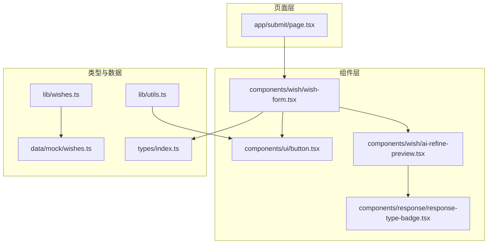
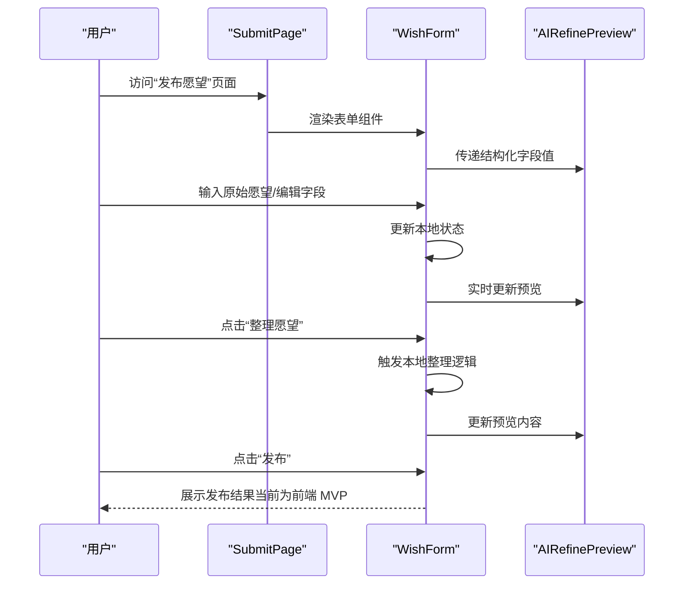
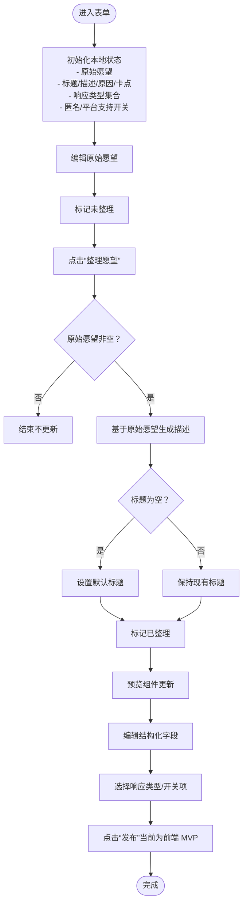
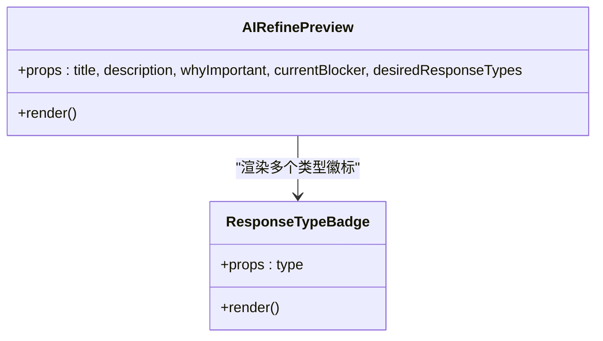
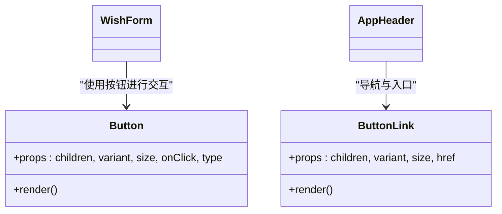
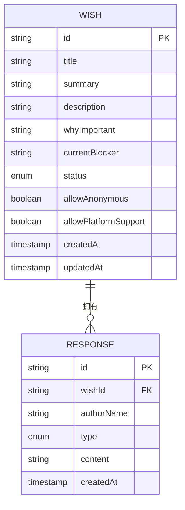
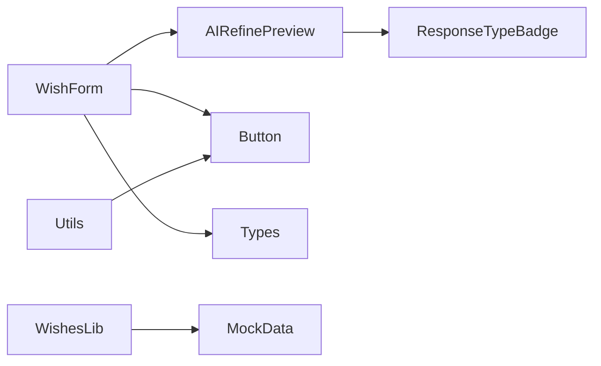

# 表单验证与状态管理

<cite>
**本文引用的文件**
- [components/wish/wish-form.tsx](file://components/wish/wish-form.tsx)
- [components/wish/ai-refine-preview.tsx](file://components/wish/ai-refine-preview.tsx)
- [components/ui/button.tsx](file://components/ui/button.tsx)
- [components/response/response-type-badge.tsx](file://components/response/response-type-badge.tsx)
- [app/submit/page.tsx](file://app/submit/page.tsx)
- [lib/utils.ts](file://lib/utils.ts)
- [lib/wishes.ts](file://lib/wishes.ts)
- [types/index.ts](file://types/index.ts)
- [data/mock/wishes.ts](file://data/mock/wishes.ts)
- [components/layout/app-header.tsx](file://components/layout/app-header.tsx)
</cite>

## 目录
1. [简介](#简介)
2. [项目结构](#项目结构)
3. [核心组件](#核心组件)
4. [架构总览](#架构总览)
5. [详细组件分析](#详细组件分析)
6. [依赖关系分析](#依赖关系分析)
7. [性能考虑](#性能考虑)
8. [故障排查指南](#故障排查指南)
9. [结论](#结论)
10. [附录](#附录)

## 简介
本指南聚焦于表单验证与状态管理的最佳实践，结合仓库中的“发布愿望”表单组件，系统讲解以下主题：
- 表单状态设计模式：本地状态、全局状态与服务器状态的管理策略
- 客户端验证、服务端验证与混合验证的实现思路
- 表单数据的采集、验证、提交与重置流程
- 错误处理、加载状态与成功反馈的用户体验设计
- 性能优化、防抖与节流的实现技巧
- 复杂表单场景的解决方案与最佳实践

## 项目结构
本项目采用 Next.js App Router 结构，表单功能位于“发布愿望”页面中，核心逻辑集中在表单组件与其子组件中；类型定义与数据访问层分别位于 types 与 lib 目录。

图表来源
- [app/submit/page.tsx:1-24](file://app/submit/page.tsx#L1-L24)
- [components/wish/wish-form.tsx:1-264](file://components/wish/wish-form.tsx#L1-L264)
- [components/wish/ai-refine-preview.tsx:1-59](file://components/wish/ai-refine-preview.tsx#L1-L59)
- [components/ui/button.tsx:1-75](file://components/ui/button.tsx#L1-L75)
- [components/response/response-type-badge.tsx:1-43](file://components/response/response-type-badge.tsx#L1-L43)
- [types/index.ts:1-58](file://types/index.ts#L1-L58)
- [data/mock/wishes.ts:1-210](file://data/mock/wishes.ts#L1-L210)
- [lib/wishes.ts:1-27](file://lib/wishes.ts#L1-L27)
- [lib/utils.ts:1-12](file://lib/utils.ts#L1-L12)

章节来源
- [app/submit/page.tsx:1-24](file://app/submit/page.tsx#L1-L24)
- [components/wish/wish-form.tsx:1-264](file://components/wish/wish-form.tsx#L1-L264)

## 核心组件
- 发布愿望表单（WishForm）：负责多步骤表单的数据收集、本地状态管理与 UI 预览联动
- AI 整理预览（AIRefinePreview）：展示结构化内容的实时预览
- 按钮（Button）：统一的交互入口，支持原生按钮与链接两种形态
- 响应类型徽标（ResponseTypeBadge）：用于展示用户选择的响应类型
- 页面入口（SubmitPage）：承载表单容器与引导文案
- 类型定义（types/index.ts）：定义 Wish、Response、WishStatus、ResponseType 等核心类型
- 数据访问层（lib/wishes.ts）：封装对 mock 数据的访问接口
- 工具函数（lib/utils.ts）：通用样式合并与日期格式化工具
- 模拟数据（data/mock/wishes.ts）：提供 Wish 与 Response 的示例数据

章节来源
- [components/wish/wish-form.tsx:95-264](file://components/wish/wish-form.tsx#L95-L264)
- [components/wish/ai-refine-preview.tsx:13-59](file://components/wish/ai-refine-preview.tsx#L13-L59)
- [components/ui/button.tsx:40-75](file://components/ui/button.tsx#L40-L75)
- [components/response/response-type-badge.tsx:38-43](file://components/response/response-type-badge.tsx#L38-L43)
- [app/submit/page.tsx:3-23](file://app/submit/page.tsx#L3-L23)
- [types/index.ts:30-58](file://types/index.ts#L30-L58)
- [lib/wishes.ts:5-27](file://lib/wishes.ts#L5-L27)
- [lib/utils.ts:1-12](file://lib/utils.ts#L1-L12)
- [data/mock/wishes.ts:12-210](file://data/mock/wishes.ts#L12-L210)

## 架构总览
表单采用“客户端渲染 + 本地状态 + 模拟数据”的 MVP 架构。页面负责承载，表单组件负责状态与交互，预览组件负责实时展示，类型与数据层提供约束与数据访问。

图表来源
- [app/submit/page.tsx:3-23](file://app/submit/page.tsx#L3-L23)
- [components/wish/wish-form.tsx:95-264](file://components/wish/wish-form.tsx#L95-L264)
- [components/wish/ai-refine-preview.tsx:13-59](file://components/wish/ai-refine-preview.tsx#L13-L59)

## 详细组件分析

### 表单组件（WishForm）状态设计模式
- 本地状态：使用 React useState 管理原始愿望、结构化字段、响应类型集合、开关选项等
- 服务器状态：当前为前端 MVP，未接入真实后端；可扩展为 useSWR 或自定义 Hook 管理异步提交与状态
- 状态同步：通过 props 向预览组件传递当前值，实现“所见即所得”的即时反馈

图表来源
- [components/wish/wish-form.tsx:95-131](file://components/wish/wish-form.tsx#L95-L131)
- [components/wish/wish-form.tsx:147-163](file://components/wish/wish-form.tsx#L147-L163)
- [components/wish/wish-form.tsx:169-188](file://components/wish/wish-form.tsx#L169-L188)
- [components/wish/wish-form.tsx:196-215](file://components/wish/wish-form.tsx#L196-L215)
- [components/wish/wish-form.tsx:236-239](file://components/wish/wish-form.tsx#L236-L239)

章节来源
- [components/wish/wish-form.tsx:95-131](file://components/wish/wish-form.tsx#L95-L131)
- [components/wish/wish-form.tsx:147-163](file://components/wish/wish-form.tsx#L147-L163)
- [components/wish/wish-form.tsx:169-188](file://components/wish/wish-form.tsx#L169-L188)
- [components/wish/wish-form.tsx:196-215](file://components/wish/wish-form.tsx#L196-L215)
- [components/wish/wish-form.tsx:236-239](file://components/wish/wish-form.tsx#L236-L239)

### 预览组件（AIRefinePreview）与响应类型徽标
- 预览组件接收结构化字段，以卡片形式展示标题、描述、原因、卡点与响应类型集合
- 响应类型徽标根据类型映射不同样式，便于用户快速识别

图表来源
- [components/wish/ai-refine-preview.tsx:13-59](file://components/wish/ai-refine-preview.tsx#L13-L59)
- [components/response/response-type-badge.tsx:38-43](file://components/response/response-type-badge.tsx#L38-L43)

章节来源
- [components/wish/ai-refine-preview.tsx:13-59](file://components/wish/ai-refine-preview.tsx#L13-L59)
- [components/response/response-type-badge.tsx:38-43](file://components/response/response-type-badge.tsx#L38-L43)

### 按钮组件（Button）与交互入口
- 统一的按钮样式与交互行为，支持原生按钮与链接跳转
- 在表单中作为“整理愿望”“发布”等操作的触发器

图表来源
- [components/ui/button.tsx:40-75](file://components/ui/button.tsx#L40-L75)
- [components/layout/app-header.tsx:53-59](file://components/layout/app-header.tsx#L53-L59)

章节来源
- [components/ui/button.tsx:40-75](file://components/ui/button.tsx#L40-L75)
- [components/layout/app-header.tsx:53-59](file://components/layout/app-header.tsx#L53-L59)

### 类型与数据层
- 类型定义：Wish、Response、WishStatus、ResponseType、WishCategory 等，确保表单字段与后端模型一致
- 数据访问层：封装对 mock 数据的查询与排序逻辑，便于替换为真实后端

图表来源
- [types/index.ts:30-58](file://types/index.ts#L30-L58)
- [data/mock/wishes.ts:12-210](file://data/mock/wishes.ts#L12-L210)

章节来源
- [types/index.ts:1-58](file://types/index.ts#L1-L58)
- [lib/wishes.ts:5-27](file://lib/wishes.ts#L5-L27)
- [data/mock/wishes.ts:12-210](file://data/mock/wishes.ts#L12-L210)

## 依赖关系分析
- 组件耦合：WishForm 与 AIRefinePreview 通过 props 单向数据流耦合；Button 与 AppHeader 通过 UI 层耦合
- 类型耦合：WishForm 使用 types 中的 ResponseType、WishStatus 等类型，保证字段一致性
- 数据耦合：lib/wishes.ts 提供数据访问接口，避免页面直接依赖 mock 文件

图表来源
- [components/wish/wish-form.tsx:95-264](file://components/wish/wish-form.tsx#L95-L264)
- [components/wish/ai-refine-preview.tsx:13-59](file://components/wish/ai-refine-preview.tsx#L13-L59)
- [components/ui/button.tsx:40-75](file://components/ui/button.tsx#L40-L75)
- [components/response/response-type-badge.tsx:38-43](file://components/response/response-type-badge.tsx#L38-L43)
- [types/index.ts:1-58](file://types/index.ts#L1-L58)
- [lib/wishes.ts:5-27](file://lib/wishes.ts#L5-L27)
- [data/mock/wishes.ts:12-210](file://data/mock/wishes.ts#L12-L210)
- [lib/utils.ts:1-12](file://lib/utils.ts#L1-L12)

章节来源
- [components/wish/wish-form.tsx:95-264](file://components/wish/wish-form.tsx#L95-L264)
- [components/wish/ai-refine-preview.tsx:13-59](file://components/wish/ai-refine-preview.tsx#L13-L59)
- [components/ui/button.tsx:40-75](file://components/ui/button.tsx#L40-L75)
- [components/response/response-type-badge.tsx:38-43](file://components/response/response-type-badge.tsx#L38-L43)
- [types/index.ts:1-58](file://types/index.ts#L1-L58)
- [lib/wishes.ts:5-27](file://lib/wishes.ts#L5-L27)
- [data/mock/wishes.ts:12-210](file://data/mock/wishes.ts#L12-L210)
- [lib/utils.ts:1-12](file://lib/utils.ts#L1-L12)

## 性能考虑
- 防抖与节流
  - 对频繁输入的字段（如原始愿望）可在 handleChange 中引入防抖，减少不必要的状态更新与重渲染
  - 对预览组件的渲染可使用 memo 化（例如 React.memo），避免在非必要时重复计算
- 本地状态最小化
  - 将可由其他字段派生的状态（如“已整理”标志）置于本地，避免冗余持久化
- 批量更新
  - 将多个字段的更新合并为一次状态提交，降低渲染次数
- 虚拟化与懒加载
  - 若未来扩展为长列表或复杂预览，可考虑虚拟化与懒加载策略
- 样式与类名
  - 使用工具函数合并类名，避免重复字符串拼接带来的开销

章节来源
- [lib/utils.ts:1-3](file://lib/utils.ts#L1-L3)

## 故障排查指南
- 表单未触发提交
  - 检查按钮类型与事件绑定：确保“发布”按钮为提交类型且绑定了正确的处理函数
  - 当前实现为前端 MVP，无真实提交逻辑，需补充后端集成
- 预览未更新
  - 确认 props 是否正确传递至预览组件；检查字段更新链路是否完整
- 响应类型样式异常
  - 检查类型映射表与徽标组件的 className 生成逻辑
- 加载与错误状态缺失
  - 当前未实现加载与错误反馈，建议在提交流程中增加 loading 与 error 状态，并在 UI 中显式提示

章节来源
- [components/ui/button.tsx:40-75](file://components/ui/button.tsx#L40-L75)
- [components/wish/ai-refine-preview.tsx:13-59](file://components/wish/ai-refine-preview.tsx#L13-L59)
- [components/response/response-type-badge.tsx:38-43](file://components/response/response-type-badge.tsx#L38-L43)

## 结论
本项目以简洁的表单组件展示了本地状态驱动的多步骤表单流程，配合预览组件实现了良好的用户体验。建议在现有基础上：
- 引入客户端验证与服务端验证的混合策略
- 增加加载、错误与成功反馈的状态管理
- 通过防抖与节流优化输入性能
- 将提交流程与后端对接，完善服务器状态管理

## 附录
- 最佳实践清单
  - 明确状态来源：区分本地状态、全局状态与服务器状态
  - 优先使用受控组件与受控输入
  - 将可复用的 UI 逻辑抽离为独立组件（如按钮、徽标）
  - 使用类型系统约束数据结构，确保前后端一致
  - 为复杂表单提供分步校验与局部重渲染