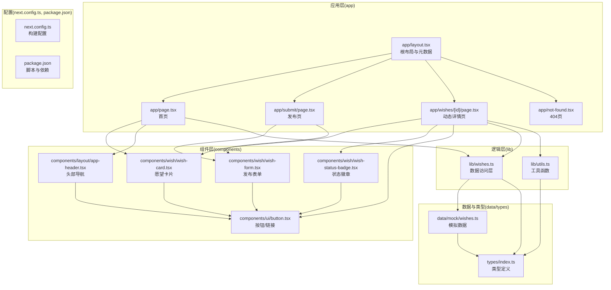
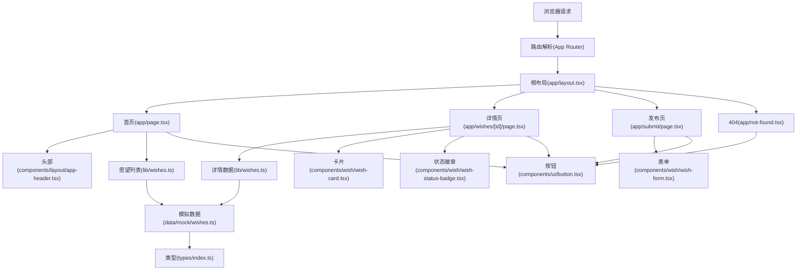
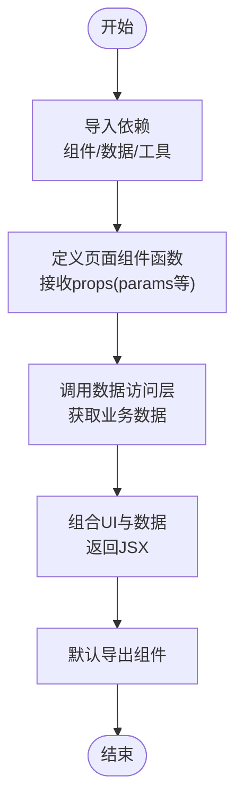
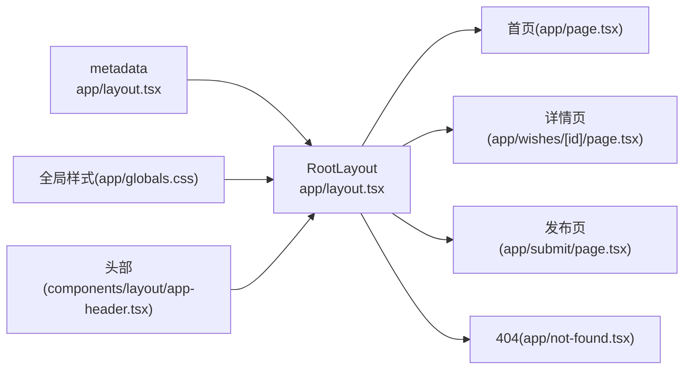
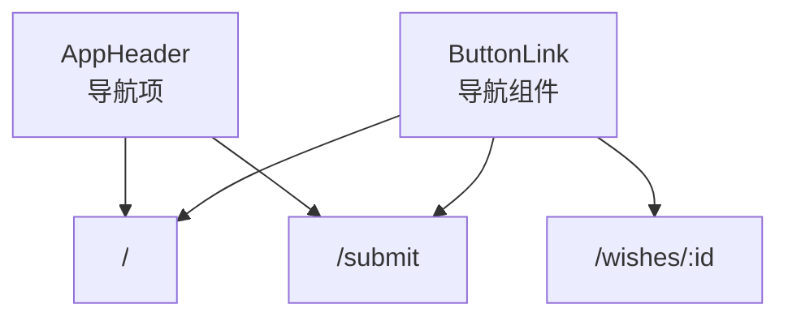
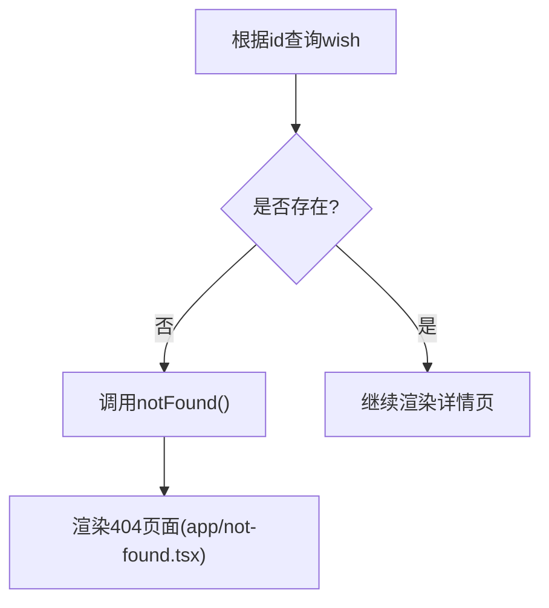
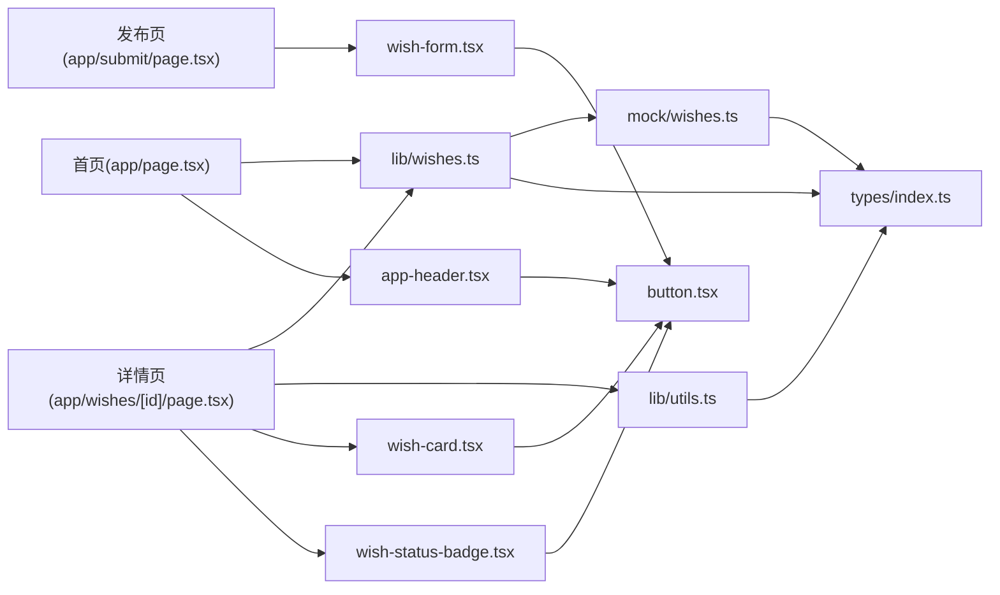

# 页面开发流程

<cite>
**本文引用的文件**
- [app/layout.tsx](file://app/layout.tsx)
- [app/page.tsx](file://app/page.tsx)
- [app/wishes/[id]/page.tsx](file://app/wishes/[id]/page.tsx)
- [app/submit/page.tsx](file://app/submit/page.tsx)
- [app/not-found.tsx](file://app/not-found.tsx)
- [lib/wishes.ts](file://lib/wishes.ts)
- [lib/utils.ts](file://lib/utils.ts)
- [components/layout/app-header.tsx](file://components/layout/app-header.tsx)
- [components/wish/wish-form.tsx](file://components/wish/wish-form.tsx)
- [components/wish/wish-card.tsx](file://components/wish/wish-card.tsx)
- [components/wish/wish-status-badge.tsx](file://components/wish/wish-status-badge.tsx)
- [components/ui/button.tsx](file://components/ui/button.tsx)
- [data/mock/wishes.ts](file://data/mock/wishes.ts)
- [types/index.ts](file://types/index.ts)
- [next.config.ts](file://next.config.ts)
- [package.json](file://package.json)
- [app/globals.css](file://app/globals.css)
</cite>

## 目录
1. [简介](#简介)
2. [项目结构](#项目结构)
3. [核心组件](#核心组件)
4. [架构总览](#架构总览)
5. [详细组件分析](#详细组件分析)
6. [依赖分析](#依赖分析)
7. [性能考虑](#性能考虑)
8. [故障排查指南](#故障排查指南)
9. [结论](#结论)
10. [附录](#附录)

## 简介
本文件面向使用 Next.js App Router 的开发者，系统性梳理页面开发的完整流程，覆盖页面组件创建与配置、动态路由参数处理、页面元数据设置、布局继承、页面间导航与路由配置最佳实践、页面生命周期与数据预取、SEO 优化、页面级错误边界与 404 处理、以及性能优化与代码分割策略。文档结合仓库中的实际页面与组件，提供可操作的实现范式与可视化图示。

## 项目结构
本项目采用 Next.js App Router 的约定式路由，页面位于 app 目录下，根布局与全局样式在根层级组织，业务逻辑通过 lib 层封装，UI 组件拆分至 components 与 data/types 等目录，便于复用与维护。

图表来源
- [app/layout.tsx:1-29](file://app/layout.tsx#L1-L29)
- [app/page.tsx:1-29](file://app/page.tsx#L1-L29)
- [app/submit/page.tsx:1-24](file://app/submit/page.tsx#L1-L24)
- [app/wishes/[id]/page.tsx:1-184](file://app/wishes/[id]/page.tsx#L1-L184)
- [app/not-found.tsx:1-24](file://app/not-found.tsx#L1-L24)
- [lib/wishes.ts:1-27](file://lib/wishes.ts#L1-L27)
- [lib/utils.ts:1-12](file://lib/utils.ts#L1-L12)
- [components/layout/app-header.tsx:1-64](file://components/layout/app-header.tsx#L1-L64)
- [components/wish/wish-form.tsx:1-264](file://components/wish/wish-form.tsx#L1-L264)
- [components/wish/wish-card.tsx:1-93](file://components/wish/wish-card.tsx#L1-L93)
- [components/wish/wish-status-badge.tsx:1-39](file://components/wish/wish-status-badge.tsx#L1-L39)
- [components/ui/button.tsx:1-75](file://components/ui/button.tsx#L1-L75)
- [data/mock/wishes.ts:1-210](file://data/mock/wishes.ts#L1-L210)
- [types/index.ts:1-58](file://types/index.ts#L1-L58)
- [next.config.ts:1-9](file://next.config.ts#L1-L9)
- [package.json:1-29](file://package.json#L1-L29)

章节来源
- [app/layout.tsx:1-29](file://app/layout.tsx#L1-L29)
- [app/page.tsx:1-29](file://app/page.tsx#L1-L29)
- [app/submit/page.tsx:1-24](file://app/submit/page.tsx#L1-L24)
- [app/wishes/[id]/page.tsx:1-184](file://app/wishes/[id]/page.tsx#L1-L184)
- [app/not-found.tsx:1-24](file://app/not-found.tsx#L1-L24)
- [lib/wishes.ts:1-27](file://lib/wishes.ts#L1-L27)
- [lib/utils.ts:1-12](file://lib/utils.ts#L1-L12)
- [components/layout/app-header.tsx:1-64](file://components/layout/app-header.tsx#L1-L64)
- [components/wish/wish-form.tsx:1-264](file://components/wish/wish-form.tsx#L1-L264)
- [components/wish/wish-card.tsx:1-93](file://components/wish/wish-card.tsx#L1-L93)
- [components/wish/wish-status-badge.tsx:1-39](file://components/wish/wish-status-badge.tsx#L1-L39)
- [components/ui/button.tsx:1-75](file://components/ui/button.tsx#L1-L75)
- [data/mock/wishes.ts:1-210](file://data/mock/wishes.ts#L1-L210)
- [types/index.ts:1-58](file://types/index.ts#L1-L58)
- [next.config.ts:1-9](file://next.config.ts#L1-L9)
- [package.json:1-29](file://package.json#L1-L29)

## 核心组件
- 根布局与元数据：在根布局中集中声明站点元信息，并注入全局样式与通用头部组件，确保所有页面共享一致的外观与 SEO 基础。
- 首页：聚合热门与最新愿望列表，计算待回声数量等派生数据，渲染主页内容区块。
- 动态详情页：基于动态路由参数加载单条愿望及其回应，实现静态生成参数与 404 处理。
- 发布页：提供愿望发布的表单组件，演示客户端交互与 UI 组合。
- 404 页：统一的未找到页面，引导用户回到首页。
- 数据访问层：将 mock 数据封装为稳定的接口，便于替换为真实后端。
- 工具函数：提供类名合并与日期格式化等通用能力。
- 组件体系：头部导航、愿望卡片、状态徽章、按钮/链接等，形成可复用的 UI 基石。

章节来源
- [app/layout.tsx:1-29](file://app/layout.tsx#L1-L29)
- [app/page.tsx:1-29](file://app/page.tsx#L1-L29)
- [app/wishes/[id]/page.tsx:1-184](file://app/wishes/[id]/page.tsx#L1-L184)
- [app/submit/page.tsx:1-24](file://app/submit/page.tsx#L1-L24)
- [app/not-found.tsx:1-24](file://app/not-found.tsx#L1-L24)
- [lib/wishes.ts:1-27](file://lib/wishes.ts#L1-L27)
- [lib/utils.ts:1-12](file://lib/utils.ts#L1-L12)
- [components/layout/app-header.tsx:1-64](file://components/layout/app-header.tsx#L1-L64)
- [components/wish/wish-form.tsx:1-264](file://components/wish/wish-form.tsx#L1-L264)
- [components/wish/wish-card.tsx:1-93](file://components/wish/wish-card.tsx#L1-L93)
- [components/wish/wish-status-badge.tsx:1-39](file://components/wish/wish-status-badge.tsx#L1-L39)
- [components/ui/button.tsx:1-75](file://components/ui/button.tsx#L1-L75)

## 架构总览
Next.js App Router 将页面视为组件，通过 app 目录下的约定文件组织路由；根布局负责全局结构与元数据；页面组件负责业务数据与视图渲染；lib 层封装数据访问；components 层提供可复用 UI；data 与 types 提供数据模型与类型约束。

图表来源
- [app/layout.tsx:1-29](file://app/layout.tsx#L1-L29)
- [app/page.tsx:1-29](file://app/page.tsx#L1-L29)
- [app/wishes/[id]/page.tsx:1-184](file://app/wishes/[id]/page.tsx#L1-L184)
- [app/submit/page.tsx:1-24](file://app/submit/page.tsx#L1-L24)
- [app/not-found.tsx:1-24](file://app/not-found.tsx#L1-L24)
- [lib/wishes.ts:1-27](file://lib/wishes.ts#L1-L27)
- [components/layout/app-header.tsx:1-64](file://components/layout/app-header.tsx#L1-L64)
- [components/wish/wish-form.tsx:1-264](file://components/wish/wish-form.tsx#L1-L264)
- [components/wish/wish-card.tsx:1-93](file://components/wish/wish-card.tsx#L1-L93)
- [components/wish/wish-status-badge.tsx:1-39](file://components/wish/wish-status-badge.tsx#L1-L39)
- [components/ui/button.tsx:1-75](file://components/ui/button.tsx#L1-L75)
- [data/mock/wishes.ts:1-210](file://data/mock/wishes.ts#L1-L210)
- [types/index.ts:1-58](file://types/index.ts#L1-L58)

## 详细组件分析

### 页面组件创建与配置流程（从导入到导出）
- 导入依赖：按需引入业务组件、UI 组件、数据访问函数与工具函数。
- 函数签名：定义默认导出的页面组件函数，接收 props（如 params）。
- 数据预取：在组件内调用数据访问层函数获取所需数据。
- 视图渲染：组合 UI 组件与业务数据，返回 JSX 结构。
- 导出组件：确保默认导出的组件符合 Next.js 路由约定。

图表来源
- [app/page.tsx:1-29](file://app/page.tsx#L1-L29)
- [app/submit/page.tsx:1-24](file://app/submit/page.tsx#L1-L24)
- [lib/wishes.ts:1-27](file://lib/wishes.ts#L1-L27)
- [lib/utils.ts:1-12](file://lib/utils.ts#L1-L12)

章节来源
- [app/page.tsx:1-29](file://app/page.tsx#L1-L29)
- [app/submit/page.tsx:1-24](file://app/submit/page.tsx#L1-L24)
- [lib/wishes.ts:1-27](file://lib/wishes.ts#L1-L27)
- [lib/utils.ts:1-12](file://lib/utils.ts#L1-L12)

### 动态路由参数处理与页面生命周期
- 动态路由：通过 app/wishes/[id]/page.tsx 实现动态参数 id 的捕获与解析。
- 生命周期：页面组件在服务端渲染或静态生成期间执行，支持异步数据获取。
- 参数预渲染：通过 generateStaticParams 生成静态参数，提升性能与 SEO。
- 错误处理：当根据 id 无法查到数据时，调用 notFound 触发 404 页面。

```mermaid
sequenceDiagram
participant Browser as "浏览器"
participant Router as "Next.js路由"
participant Page as "WishDetailPage"
participant Data as "lib/wishes.ts"
participant Mock as "data/mock/wishes.ts"
Browser->>Router : 请求 /wishes/ : id
Router->>Page : 渲染页面并解析params
Page->>Data : getWishById(id)
Data->>Mock : 查找匹配的wish
Mock-->>Data : 返回wish或undefined
Data-->>Page : 返回wish
alt 未找到
Page->>Browser : notFound() -> 404
else 找到
Page->>Data : getResponsesByWishId(wish.id)
Data->>Mock : 过滤对应responses
Mock-->>Data : 返回responses
Data-->>Page : 返回responses
Page-->>Browser : 渲染详情页
end
```

图表来源
- [app/wishes/[id]/page.tsx:13-37](file://app/wishes/[id]/page.tsx#L13-L37)
- [app/wishes/[id]/page.tsx:19-37](file://app/wishes/[id]/page.tsx#L19-L37)
- [lib/wishes.ts:15-26](file://lib/wishes.ts#L15-L26)
- [data/mock/wishes.ts:12-210](file://data/mock/wishes.ts#L12-L210)

章节来源
- [app/wishes/[id]/page.tsx:1-184](file://app/wishes/[id]/page.tsx#L1-L184)
- [lib/wishes.ts:1-27](file://lib/wishes.ts#L1-L27)
- [data/mock/wishes.ts:1-210](file://data/mock/wishes.ts#L1-L210)

### 页面元数据设置与布局继承
- 元数据：在根布局中导出 metadata 对象，统一设置站点标题与描述。
- 布局：RootLayout 接收 children 并包裹 html/body/main 结构，注入全局样式与头部组件。
- 继承关系：所有页面共享根布局，实现一致的结构与外观。

图表来源
- [app/layout.tsx:8-28](file://app/layout.tsx#L8-L28)
- [app/layout.tsx:13-28](file://app/layout.tsx#L13-L28)
- [app/globals.css:1-67](file://app/globals.css#L1-L67)
- [components/layout/app-header.tsx:1-64](file://components/layout/app-header.tsx#L1-L64)

章节来源
- [app/layout.tsx:1-29](file://app/layout.tsx#L1-L29)
- [app/globals.css:1-67](file://app/globals.css#L1-L67)
- [components/layout/app-header.tsx:1-64](file://components/layout/app-header.tsx#L1-L64)

### 页面间导航与路由配置最佳实践
- 导航组件：使用 next/link 包装的 ButtonLink 组件实现页面跳转，保持一致的样式与交互。
- 头部导航：AppHeader 中定义导航项，统一入口与风格。
- 路由配置：Next.js 自动解析 app 目录结构为路由，无需额外配置；可通过 next.config.ts 设置严格模式与构建目录。

图表来源
- [components/layout/app-header.tsx:6-51](file://components/layout/app-header.tsx#L6-L51)
- [components/ui/button.tsx:59-74](file://components/ui/button.tsx#L59-L74)
- [app/wishes/[id]/page.tsx:31-37](file://app/wishes/[id]/page.tsx#L31-L37)

章节来源
- [components/layout/app-header.tsx:1-64](file://components/layout/app-header.tsx#L1-L64)
- [components/ui/button.tsx:1-75](file://components/ui/button.tsx#L1-L75)
- [next.config.ts:1-9](file://next.config.ts#L1-L9)

### 页面生命周期管理、数据预取与 SEO 优化
- 生命周期：页面组件在服务端渲染或静态生成期间执行，支持异步数据获取。
- 数据预取：在页面组件内部调用 lib 层函数获取数据，避免在客户端进行重型计算。
- SEO：通过根布局的 metadata 设置标题与描述；动态详情页可进一步扩展 Open Graph 等元信息。
- 静态参数：generateStaticParams 用于静态生成详情页，提升性能与 SEO。

章节来源
- [app/layout.tsx:8-11](file://app/layout.tsx#L8-L11)
- [app/wishes/[id]/page.tsx:13-17](file://app/wishes/[id]/page.tsx#L13-L17)
- [lib/wishes.ts:1-27](file://lib/wishes.ts#L1-L27)

### 页面级错误边界与 404 页面
- 错误边界：在详情页中，当根据 id 无法查询到数据时，调用 notFound() 触发 404 页面。
- 404 页面：统一的未找到页面，提供返回首页的按钮，改善用户体验。

图表来源
- [app/wishes/[id]/page.tsx:27-29](file://app/wishes/[id]/page.tsx#L27-L29)
- [app/not-found.tsx:1-24](file://app/not-found.tsx#L1-L24)

章节来源
- [app/wishes/[id]/page.tsx:1-184](file://app/wishes/[id]/page.tsx#L1-L184)
- [app/not-found.tsx:1-24](file://app/not-found.tsx#L1-L24)

### 性能优化与代码分割策略
- 代码分割：Next.js 默认按页面进行代码分割，动态路由详情页按需加载。
- 静态生成：通过 generateStaticParams 生成静态参数，减少运行时开销。
- 组件拆分：将 UI 组件拆分为独立文件，利于缓存与复用。
- 构建配置：通过 next.config.ts 设置严格模式与自定义构建目录，便于生产部署。

章节来源
- [app/wishes/[id]/page.tsx:13-17](file://app/wishes/[id]/page.tsx#L13-L17)
- [next.config.ts:1-9](file://next.config.ts#L1-L9)

## 依赖分析
- 页面到组件：页面通过导入 UI 组件与业务组件实现功能拼装。
- 页面到数据：页面通过 lib 层的数据访问函数获取数据，解耦业务与数据源。
- 组件到工具：UI 组件依赖工具函数进行类名合并与日期格式化。
- 数据到类型：数据与类型定义相互依赖，保证数据结构一致性。

图表来源
- [app/page.tsx:1-29](file://app/page.tsx#L1-L29)
- [app/wishes/[id]/page.tsx:1-184](file://app/wishes/[id]/page.tsx#L1-L184)
- [app/submit/page.tsx:1-24](file://app/submit/page.tsx#L1-L24)
- [lib/wishes.ts:1-27](file://lib/wishes.ts#L1-L27)
- [lib/utils.ts:1-12](file://lib/utils.ts#L1-L12)
- [components/layout/app-header.tsx:1-64](file://components/layout/app-header.tsx#L1-L64)
- [components/wish/wish-form.tsx:1-264](file://components/wish/wish-form.tsx#L1-L264)
- [components/wish/wish-card.tsx:1-93](file://components/wish/wish-card.tsx#L1-L93)
- [components/wish/wish-status-badge.tsx:1-39](file://components/wish/wish-status-badge.tsx#L1-L39)
- [components/ui/button.tsx:1-75](file://components/ui/button.tsx#L1-L75)
- [data/mock/wishes.ts:1-210](file://data/mock/wishes.ts#L1-L210)
- [types/index.ts:1-58](file://types/index.ts#L1-L58)

章节来源
- [app/page.tsx:1-29](file://app/page.tsx#L1-L29)
- [app/wishes/[id]/page.tsx:1-184](file://app/wishes/[id]/page.tsx#L1-L184)
- [app/submit/page.tsx:1-24](file://app/submit/page.tsx#L1-L24)
- [lib/wishes.ts:1-27](file://lib/wishes.ts#L1-L27)
- [lib/utils.ts:1-12](file://lib/utils.ts#L1-L12)
- [components/layout/app-header.tsx:1-64](file://components/layout/app-header.tsx#L1-L64)
- [components/wish/wish-form.tsx:1-264](file://components/wish/wish-form.tsx#L1-L264)
- [components/wish/wish-card.tsx:1-93](file://components/wish/wish-card.tsx#L1-L93)
- [components/wish/wish-status-badge.tsx:1-39](file://components/wish/wish-status-badge.tsx#L1-L39)
- [components/ui/button.tsx:1-75](file://components/ui/button.tsx#L1-L75)
- [data/mock/wishes.ts:1-210](file://data/mock/wishes.ts#L1-L210)
- [types/index.ts:1-58](file://types/index.ts#L1-L58)

## 性能考虑
- 静态生成与预渲染：利用 generateStaticParams 与静态数据源，减少运行时计算。
- 组件懒加载：将非关键路径组件延迟加载，降低首屏体积。
- 图片与资源：合理使用占位与懒加载策略，避免阻塞主线程。
- 构建优化：启用严格模式与合适的构建目录，配合 CI/CD 流水线进行缓存与增量构建。

## 故障排查指南
- 404 页面：当详情页根据 id 查询不到数据时触发 notFound()，检查数据源与 id 是否正确。
- 导航异常：确认 next/link 与 ButtonLink 的 href 使用正确，避免硬编码路径。
- 样式冲突：检查全局样式与组件局部样式的优先级，避免覆盖。
- 类型错误：确保数据访问函数返回值与类型定义一致，防止运行时异常。

章节来源
- [app/wishes/[id]/page.tsx:27-29](file://app/wishes/[id]/page.tsx#L27-L29)
- [components/ui/button.tsx:59-74](file://components/ui/button.tsx#L59-L74)
- [app/globals.css:1-67](file://app/globals.css#L1-L67)
- [types/index.ts:1-58](file://types/index.ts#L1-L58)

## 结论
本项目遵循 Next.js App Router 的约定式路由与组件化思想，通过根布局统一元数据与结构，页面组件聚焦业务数据与视图渲染，lib 层封装数据访问，components 层提供可复用 UI，形成清晰的职责分离与良好的可维护性。结合静态生成、错误边界与 404 页面、导航与 SEO 最佳实践，以及性能优化策略，能够高效构建可扩展的页面体系。

## 附录
- 构建与启动：通过 package.json 中的脚本进行开发、构建与启动。
- 配置说明：next.config.ts 提供严格模式与构建目录配置，便于生产环境部署。

章节来源
- [package.json:1-29](file://package.json#L1-L29)
- [next.config.ts:1-9](file://next.config.ts#L1-L9)