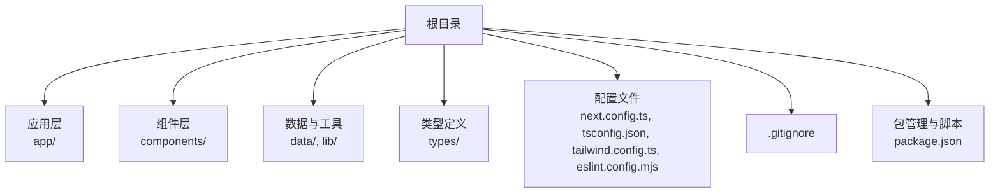
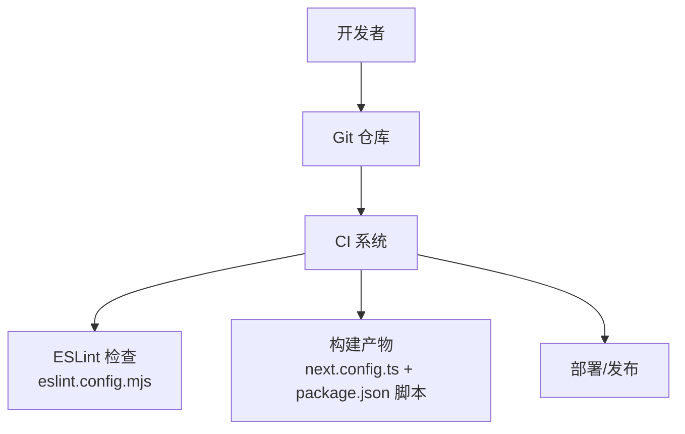
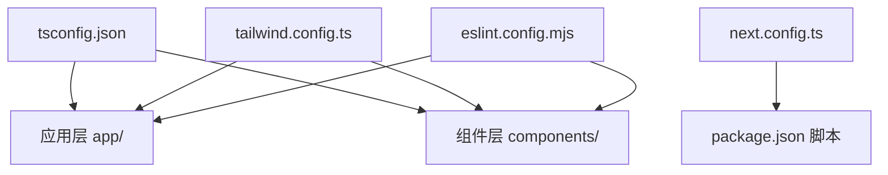

# 团队协作与版本控制

<cite>
**本文引用的文件**
- [package.json](file://package.json)
- [.gitignore](file://.gitignore)
- [next.config.ts](file://next.config.ts)
- [tsconfig.json](file://tsconfig.json)
- [tailwind.config.ts](file://tailwind.config.ts)
- [eslint.config.mjs](file://eslint.config.mjs)
</cite>

## 目录
1. [引言](#引言)
2. [项目结构](#项目结构)
3. [核心组件](#核心组件)
4. [架构总览](#架构总览)
5. [详细组件分析](#详细组件分析)
6. [依赖关系分析](#依赖关系分析)
7. [性能考虑](#性能考虑)
8. [故障排查指南](#故障排查指南)
9. [结论](#结论)
10. [附录](#附录)

## 引言
本工作流程文档面向团队协作与版本控制，结合当前仓库的技术栈（Next.js、TypeScript、Tailwind CSS、ESLint）与现有配置，制定可落地的Git分支管理策略、代码审查流程、Pull Request（PR）最佳实践、版本号管理与发布流程、冲突解决与合并指导原则、团队沟通与任务分配模式、持续集成与自动化测试配置思路，以及项目文档维护与知识共享规范。目标是提升开发效率、保证代码质量、降低合并风险，并促进团队知识沉淀。

## 项目结构
该仓库为一个基于Next.js的应用工程，采用TypeScript与Tailwind CSS进行前端开发，使用ESLint进行静态检查。构建产物目录通过环境变量进行配置，便于CI/CD流水线复用。.gitignore已屏蔽Next.js运行时缓存、构建输出、覆盖率等目录，避免污染版本库。

**章节来源**
- [package.json:1-29](file://package.json#L1-L29)
- [.gitignore:1-9](file://.gitignore#L1-L9)
- [next.config.ts:1-9](file://next.config.ts#L1-L9)
- [tsconfig.json:1-29](file://tsconfig.json#L1-L29)
- [tailwind.config.ts:1-55](file://tailwind.config.ts#L1-L55)
- [eslint.config.mjs:1-19](file://eslint.config.mjs#L1-L19)

## 核心组件
- 构建与运行配置：通过环境变量控制构建输出目录，便于在本地与CI中统一产物路径。
- 类型系统：严格模式开启，模块解析采用bundler，支持路径别名，确保类型安全与模块化组织。
- 样式框架：Tailwind CSS通过content扫描范围覆盖app、components、data、lib目录，确保按需生成样式。
- 质量保障：ESLint规则继承Next.js核心Web Vitals规则，并忽略构建产物与缓存目录，减少误报。
- 版本与脚本：项目版本由package.json维护；提供开发、构建、启动与代码检查脚本。

**章节来源**
- [next.config.ts:3-6](file://next.config.ts#L3-L6)
- [tsconfig.json:2-23](file://tsconfig.json#L2-L23)
- [tailwind.config.ts:4-9](file://tailwind.config.ts#L4-L9)
- [eslint.config.mjs:3-16](file://eslint.config.mjs#L3-L16)
- [package.json:5-10](file://package.json#L5-L10)

## 架构总览
下图展示了从开发者提交到CI校验再到部署的关键路径，映射到仓库中的实际配置文件。

**图表来源**
- [eslint.config.mjs:1-19](file://eslint.config.mjs#L1-L19)
- [next.config.ts:1-9](file://next.config.ts#L1-L9)
- [package.json:5-10](file://package.json#L5-L10)

## 详细组件分析

### 分支管理策略与合并流程
- 分支模型建议采用Git Flow或GitHub Flow的变体，结合本项目特性给出以下规范：
  - main/master：生产就绪分支，受保护，禁止直接推送，必须通过PR合并。
  - develop：集成分支，每日构建，合并前需通过CI与代码审查。
  - feature/<主题>：功能开发分支，命名清晰，基于develop创建，完成后回并至develop。
  - release/<版本>：预发布分支，仅用于修复紧急问题与最终验证，完成后合并至main并打标签。
  - hotfix/<问题>：线上热修复分支，从main创建，修复后同时合并回main与develop。

- 合并策略与要求：
  - PR必须关联任务单，描述变更内容、影响范围与测试要点。
  - 合并前必须通过CI（Lint、构建、测试），且至少一名审查者批准。
  - 合并方式优先squash或rebase，保持提交历史整洁；cherry-pick用于hotfix快速回归。

- 冲突解决与合并指导：
  - 避免在feature分支长期偏离develop导致大范围冲突；建议频繁rebase或merge develop。
  - 冲突优先在本地解决，解决后在PR内触发CI重新检查。
  - 对于复杂改动，建议拆分PR，降低耦合度与审查成本。

### 代码审查标准流程与检查清单
- 审查流程：
  - 提交PR后自动触发CI检查；审查者在PR页面进行评论与决策。
  - 审查者关注点包括：功能正确性、边界条件、性能影响、安全性、可维护性、测试覆盖。
  - 审查通过后方可合并；若提出修改意见，作者需逐条回复并更新代码。

- 检查清单（示例）：
  - 代码是否符合ESLint规则与项目风格？
  - 是否新增必要的类型定义与注释？
  - 是否引入了不必要的依赖或破坏了模块边界？
  - 是否有充分的单元/集成测试覆盖？
  - 是否对UI/交互进行了自测并提供截图或GIF？
  - 是否更新了相关文档或迁移说明？

- 工具与配置：
  - ESLint规则已在仓库中配置，审查前请先在本地执行检查以减少往返。
  - Tailwind扫描范围已覆盖主要目录，确保样式按需生成。

**章节来源**
- [eslint.config.mjs:3-16](file://eslint.config.mjs#L3-L16)
- [tailwind.config.ts:4-9](file://tailwind.config.ts#L4-L9)

### Pull Request 创建、审查与合并最佳实践
- 创建PR：
  - 使用清晰的主题与描述，列出变更点、影响面与测试步骤。
  - 将PR关联到对应的任务单或需求文档链接。
- 审查过程：
  - 审查者应关注逻辑正确性、可读性与可扩展性；对重构与新特性给予更严格把关。
  - 争议问题尽量在PR评论中闭环，必要时安排同步讨论。
- 合并策略：
  - 优先使用squash合并保留整洁历史；rebase用于需要保留细粒度提交的场景。
  - 合并后及时删除已合并的分支，保持仓库整洁。

### 版本号管理与发布流程
- 版本号策略：
  - 采用语义化版本（SemVer），主版本号用于破坏性变更，次版本号用于向后兼容的功能新增，修订号用于向后兼容的问题修正。
  - 项目当前版本由package.json维护，发布前统一更新版本号并打Git标签。
- 发布流程：
  - 在release分支完成最终验证后，合并至main并打上对应标签。
  - CI触发构建与制品上传，随后发布到目标环境（如预览/生产）。
  - 发布后在仓库中记录变更日志摘要，便于追溯。

**章节来源**
- [package.json:2-4](file://package.json#L2-L4)

### 团队沟通与任务分配协作模式
- 任务分配：
  - 使用Issue/任务单进行需求拆解与跟踪，每个feature/bug对应一个任务单。
  - 开发者认领任务单并在feature分支上推进，避免多人同时修改同一模块。
- 沟通机制：
  - 日常站会同步进度与阻塞项；跨模块协作通过PR评论与同步会议解决。
  - 复杂设计在评审前形成简要方案文档，减少后期返工。

### 持续集成与自动化测试配置思路
- CI检查项（建议）：
  - 代码格式与风格：ESLint检查（仓库已配置）。
  - 构建验证：执行构建脚本，确保产物可生成且无编译错误。
  - 测试：在仓库中添加测试脚本与测试文件，CI中执行测试并生成覆盖率报告。
  - 安全扫描：对依赖进行漏洞扫描（如npm audit或SAST）。
- 触发策略：
  - push到非保护分支触发Lint与构建；PR打开时触发完整CI矩阵。
  - main合并时触发发布流程（构建+制品上传+部署）。

**章节来源**
- [eslint.config.mjs:1-19](file://eslint.config.mjs#L1-L19)
- [package.json:5-10](file://package.json#L5-L10)

### 项目文档维护与知识共享规范
- 文档分类：
  - 架构文档：描述整体技术选型、模块划分与数据流。
  - 开发指南：包括分支策略、PR规范、代码风格、测试与调试流程。
  - API/接口文档：基于TypeScript类型与组件导出生成。
  - 运维手册：部署流程、监控指标、回滚策略。
- 存放位置与更新：
  - 文档集中存放于docs/或根目录README.md，随代码一起版本化。
  - 每次重大变更或发布后更新文档摘要，确保与实现一致。
- 知识共享：
  - 建立“技术分享”时间，介绍新技术、踩坑总结与最佳实践。
  - 对外贡献或开源时，同步内部文档以便复用。

## 依赖关系分析
- 配置文件之间的耦合关系：
  - tsconfig.json的paths与bundler解析影响模块导入路径，需与组件与应用层目录结构保持一致。
  - tailwind.config.ts的content扫描范围决定样式按需生成，需覆盖所有使用样式的目录。
  - next.config.ts的distDir与package.json脚本共同决定构建产物路径，CI中需保持一致。
  - eslint.config.mjs的规则与忽略列表影响审查覆盖面，需与构建产物目录保持同步。

**图表来源**
- [tsconfig.json:21-23](file://tsconfig.json#L21-L23)
- [tailwind.config.ts:4-9](file://tailwind.config.ts#L4-L9)
- [next.config.ts:3-6](file://next.config.ts#L3-L6)
- [eslint.config.mjs:3-16](file://eslint.config.mjs#L3-L16)
- [package.json:5-10](file://package.json#L5-L10)

**章节来源**
- [tsconfig.json:21-23](file://tsconfig.json#L21-L23)
- [tailwind.config.ts:4-9](file://tailwind.config.ts#L4-L9)
- [next.config.ts:3-6](file://next.config.ts#L3-L6)
- [eslint.config.mjs:3-16](file://eslint.config.mjs#L3-L16)
- [package.json:5-10](file://package.json#L5-L10)

## 性能考虑
- 构建性能：
  - 使用增量编译与bundler解析，缩短TypeScript编译时间。
  - Tailwind按需生成样式，减少CSS体积与加载时间。
- 运行时性能：
  - 严格模式与类型检查有助于早期发现潜在性能问题。
  - CI中加入性能回归检测（如Bundle大小阈值、LCP等指标）。

## 故障排查指南
- 常见问题与定位：
  - 构建失败：检查next.config.ts的distDir与package.json脚本是否一致；确认本地与CI环境变量一致。
  - ESLint报错：根据eslint.config.mjs的规则与忽略列表逐项排查；优先在本地执行lint修复。
  - 样式异常：核对tailwind.config.ts的content扫描范围是否覆盖到相关目录。
  - 类型错误：检查tsconfig.json的paths与模块解析设置，确保导入路径正确。
- 本地验证清单：
  - 执行lint与构建，确保无错误。
  - 在不同浏览器/设备上进行关键交互自测。
  - 如涉及样式或布局，确认Tailwind类名与配置一致。

**章节来源**
- [next.config.ts:3-6](file://next.config.ts#L3-L6)
- [eslint.config.mjs:3-16](file://eslint.config.mjs#L3-L16)
- [tailwind.config.ts:4-9](file://tailwind.config.ts#L4-L9)
- [tsconfig.json:2-23](file://tsconfig.json#L2-L23)

## 结论
通过明确的分支策略、严格的代码审查流程、完善的PR与合并规范、清晰的版本号与发布流程、以及可落地的CI配置思路，团队可以在保证质量的前提下高效协作。配合文档维护与知识共享机制，将持续提升团队的开发效率与可维护性。

## 附录
- 关键配置速览：
  - 构建与运行：next.config.ts、package.json脚本
  - 类型系统：tsconfig.json
  - 样式框架：tailwind.config.ts
  - 质量保障：eslint.config.mjs
  - 忽略规则：.gitignore