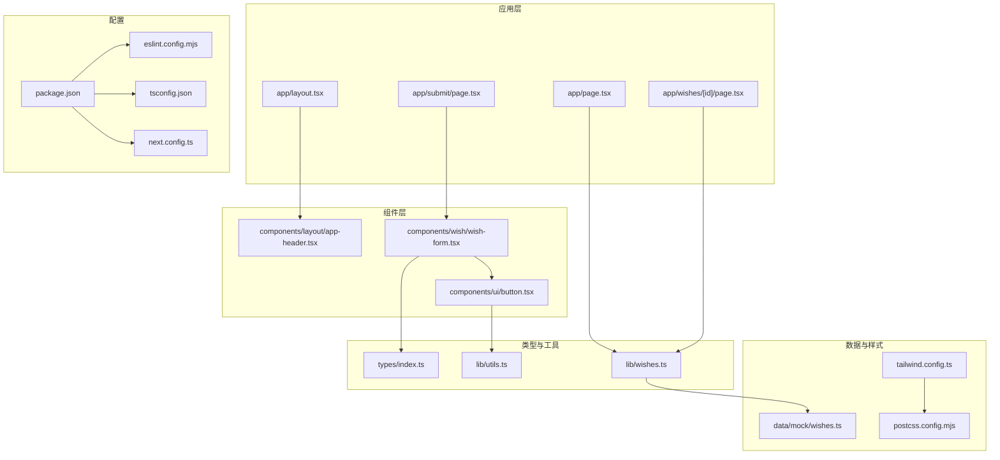
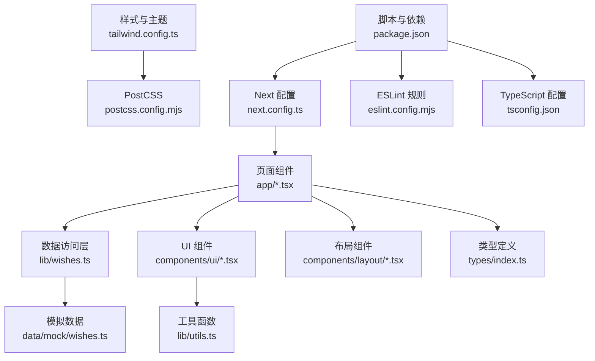
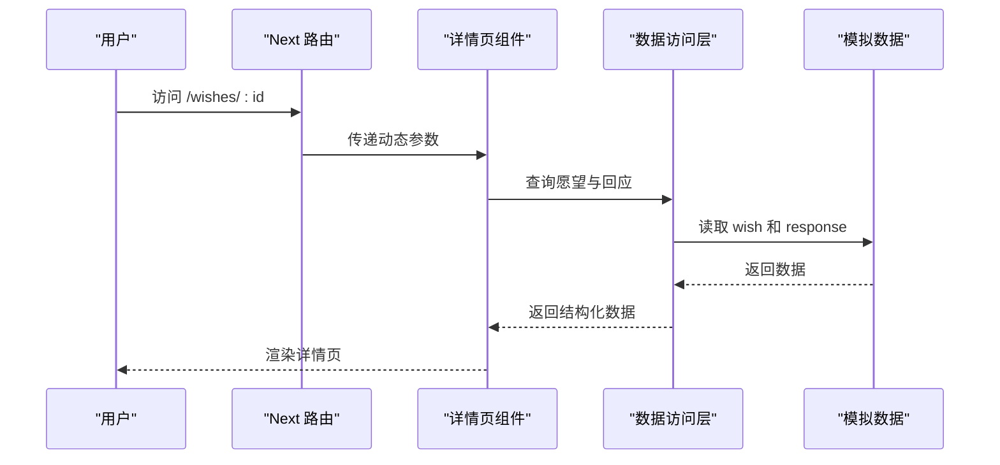
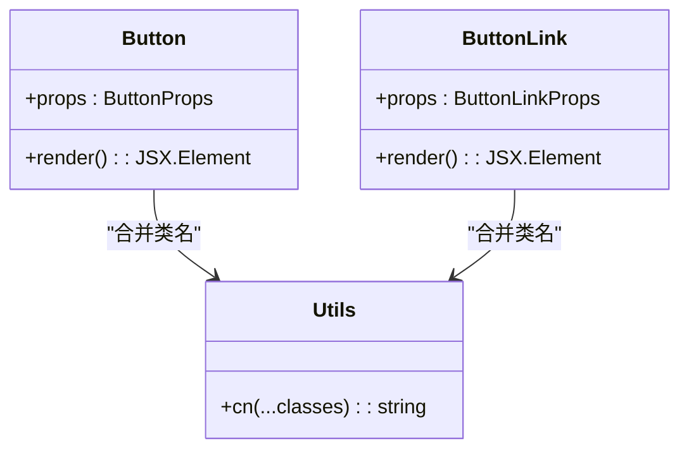
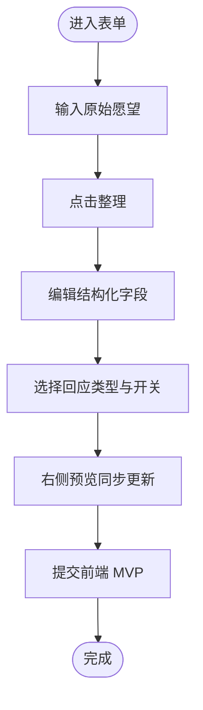
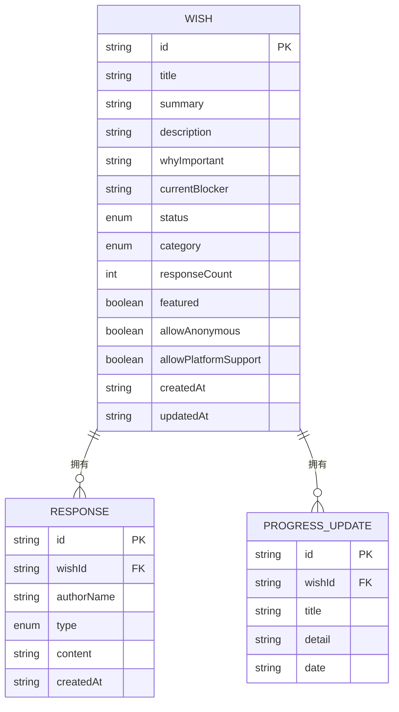
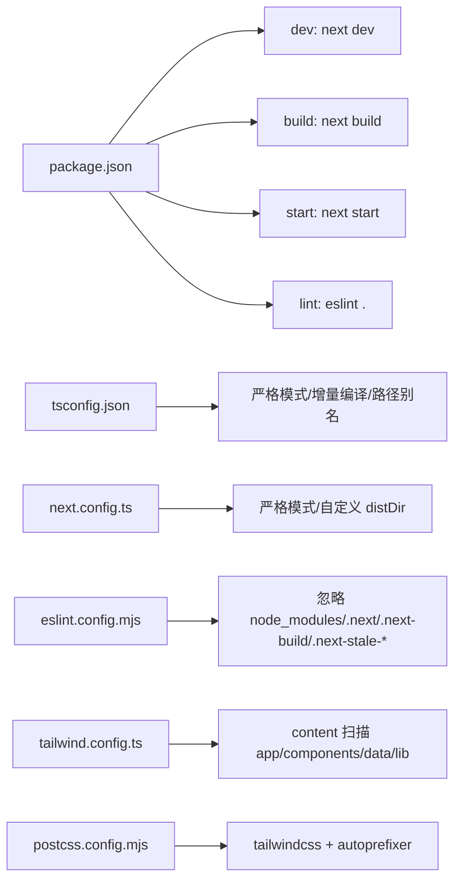

# 开发指南

<cite>
**本文引用的文件**
- [package.json](file://package.json)
- [eslint.config.mjs](file://eslint.config.mjs)
- [tsconfig.json](file://tsconfig.json)
- [next.config.ts](file://next.config.ts)
- [tailwind.config.ts](file://tailwind.config.ts)
- [postcss.config.mjs](file://postcss.config.mjs)
- [app/layout.tsx](file://app/layout.tsx)
- [app/page.tsx](file://app/page.tsx)
- [app/submit/page.tsx](file://app/submit/page.tsx)
- [app/wishes/[id]/page.tsx](file://app/wishes/[id]/page.tsx)
- [components/ui/button.tsx](file://components/ui/button.tsx)
- [components/layout/app-header.tsx](file://components/layout/app-header.tsx)
- [components/wish/wish-form.tsx](file://components/wish/wish-form.tsx)
- [types/index.ts](file://types/index.ts)
- [lib/utils.ts](file://lib/utils.ts)
- [lib/wishes.ts](file://lib/wishes.ts)
- [data/mock/wishes.ts](file://data/mock/wishes.ts)
</cite>

## 目录
1. [简介](#简介)
2. [项目结构](#项目结构)
3. [核心组件](#核心组件)
4. [架构总览](#架构总览)
5. [详细组件分析](#详细组件分析)
6. [依赖关系分析](#依赖关系分析)
7. [性能考虑](#性能考虑)
8. [故障排查指南](#故障排查指南)
9. [结论](#结论)
10. [附录](#附录)

## 简介
本指南面向“梦想回应平台”的开发与协作，覆盖代码规范（ESLint、TypeScript 编译与格式化）、页面与组件新增流程、重构与优化原则、调试与开发工具、版本控制与分支管理、CI 与自动化测试、团队协作与代码审查，以及构建与部署准备。文档基于仓库现有配置与代码进行提炼，确保可操作与可落地。

## 项目结构
项目采用 Next.js 应用程序目录结构，按功能模块组织页面、组件、类型与数据层，配合 TailwindCSS 实现样式体系与工具类驱动的 UI 设计。

图表来源
- [app/layout.tsx:1-29](file://app/layout.tsx#L1-L29)
- [app/page.tsx:1-29](file://app/page.tsx#L1-L29)
- [app/submit/page.tsx:1-24](file://app/submit/page.tsx#L1-L24)
- [app/wishes/[id]/page.tsx](file://app/wishes/[id]/page.tsx#L1-L184)
- [components/layout/app-header.tsx:1-64](file://components/layout/app-header.tsx#L1-L64)
- [components/ui/button.tsx:1-75](file://components/ui/button.tsx#L1-L75)
- [components/wish/wish-form.tsx:1-264](file://components/wish/wish-form.tsx#L1-L264)
- [types/index.ts:1-58](file://types/index.ts#L1-L58)
- [lib/utils.ts:1-12](file://lib/utils.ts#L1-L12)
- [lib/wishes.ts:1-27](file://lib/wishes.ts#L1-L27)
- [data/mock/wishes.ts:1-210](file://data/mock/wishes.ts#L1-L210)
- [tailwind.config.ts:1-55](file://tailwind.config.ts#L1-L55)
- [postcss.config.mjs:1-9](file://postcss.config.mjs#L1-L9)
- [package.json:1-29](file://package.json#L1-L29)
- [eslint.config.mjs:1-19](file://eslint.config.mjs#L1-L19)
- [tsconfig.json:1-29](file://tsconfig.json#L1-L29)
- [next.config.ts:1-9](file://next.config.ts#L1-L9)

章节来源
- [package.json:1-29](file://package.json#L1-L29)
- [tsconfig.json:1-29](file://tsconfig.json#L1-L29)
- [next.config.ts:1-9](file://next.config.ts#L1-L9)
- [tailwind.config.ts:1-55](file://tailwind.config.ts#L1-L55)
- [postcss.config.mjs:1-9](file://postcss.config.mjs#L1-L9)
- [eslint.config.mjs:1-19](file://eslint.config.mjs#L1-L19)

## 核心组件
- 页面与布局
  - 根布局负责注入全局样式与顶层导航，统一站点外观与语义。
  - 首页聚合热门与最新愿望，展示平台状态。
  - 提交页承载愿望表单，引导用户完成结构化表达。
  - 详情页根据动态路由参数加载愿望与回应，渲染进度与互动区域。
- 组件体系
  - 布局组件：顶部导航，提供站点入口与登录/注册入口占位。
  - UI 组件：按钮组件提供多种变体与尺寸，统一交互风格。
  - 业务组件：愿望表单封装多步骤输入与预览，类型安全与可复用。
- 类型系统
  - 定义愿望、回应、状态与分类等核心类型，保障数据一致性。
- 工具与数据访问
  - 工具函数提供类名合并与日期格式化。
  - 数据访问层封装对模拟数据的查询与排序逻辑，便于替换为真实后端。

章节来源
- [app/layout.tsx:1-29](file://app/layout.tsx#L1-L29)
- [app/page.tsx:1-29](file://app/page.tsx#L1-L29)
- [app/submit/page.tsx:1-24](file://app/submit/page.tsx#L1-L24)
- [app/wishes/[id]/page.tsx:1-L184](file://app/wishes/[id]/page.tsx#L1-L184)
- [components/layout/app-header.tsx:1-64](file://components/layout/app-header.tsx#L1-L64)
- [components/ui/button.tsx:1-75](file://components/ui/button.tsx#L1-L75)
- [components/wish/wish-form.tsx:1-264](file://components/wish/wish-form.tsx#L1-L264)
- [types/index.ts:1-58](file://types/index.ts#L1-L58)
- [lib/utils.ts:1-12](file://lib/utils.ts#L1-L12)
- [lib/wishes.ts:1-27](file://lib/wishes.ts#L1-L27)
- [data/mock/wishes.ts:1-210](file://data/mock/wishes.ts#L1-L210)

## 架构总览
系统采用“页面驱动 + 组件复用 + 类型约束 + 样式工具”的分层架构。页面通过数据访问层获取模拟数据，组件通过类型定义保证输入输出一致，Tailwind 提供原子化样式与主题扩展。

图表来源
- [app/page.tsx:1-29](file://app/page.tsx#L1-L29)
- [app/submit/page.tsx:1-24](file://app/submit/page.tsx#L1-L24)
- [app/wishes/[id]/page.tsx](file://app/wishes/[id]/page.tsx#L1-L184)
- [lib/wishes.ts:1-27](file://lib/wishes.ts#L1-L27)
- [data/mock/wishes.ts:1-210](file://data/mock/wishes.ts#L1-L210)
- [components/ui/button.tsx:1-75](file://components/ui/button.tsx#L1-L75)
- [components/layout/app-header.tsx:1-64](file://components/layout/app-header.tsx#L1-L64)
- [lib/utils.ts:1-12](file://lib/utils.ts#L1-L12)
- [types/index.ts:1-58](file://types/index.ts#L1-L58)
- [tailwind.config.ts:1-55](file://tailwind.config.ts#L1-L55)
- [postcss.config.mjs:1-9](file://postcss.config.mjs#L1-L9)
- [next.config.ts:1-9](file://next.config.ts#L1-L9)
- [package.json:1-29](file://package.json#L1-L29)
- [eslint.config.mjs:1-19](file://eslint.config.mjs#L1-L19)
- [tsconfig.json:1-29](file://tsconfig.json#L1-L29)

## 详细组件分析

### 页面与路由流程
- 首页聚合热门与最新愿望，统计待回应数量，渲染头部与列表区块。
- 提交页展示引导文案与表单，表单内部包含多步骤输入与预览。
- 详情页根据动态路由参数生成静态参数，加载愿望与回应，渲染背景装饰、摘要、背景信息、所需回应类型、平台推进进度与回应列表。

图表来源
- [app/wishes/[id]/page.tsx](file://app/wishes/[id]/page.tsx#L13-L30)
- [lib/wishes.ts:15-26](file://lib/wishes.ts#L15-L26)
- [data/mock/wishes.ts:1-210](file://data/mock/wishes.ts#L1-L210)

章节来源
- [app/page.tsx:1-29](file://app/page.tsx#L1-L29)
- [app/submit/page.tsx:1-24](file://app/submit/page.tsx#L1-L24)
- [app/wishes/[id]/page.tsx:1-L184](file://app/wishes/[id]/page.tsx#L1-L184)
- [lib/wishes.ts:1-27](file://lib/wishes.ts#L1-L27)
- [data/mock/wishes.ts:1-210](file://data/mock/wishes.ts#L1-L210)

### 组件：按钮 Button
- 设计要点
  - 统一基类样式与交互状态，支持主/次/幽灵三种变体与多尺寸。
  - 通过工具函数合并类名，避免重复样式。
  - 同时支持原生按钮与链接跳转两种形态。
- 类型与接口
  - 使用联合类型限定变体与尺寸键值，确保调用方传入合法值。
  - 接口分离按钮与链接形态，避免不必要的属性耦合。

图表来源
- [components/ui/button.tsx:40-75](file://components/ui/button.tsx#L40-L75)
- [lib/utils.ts:1-3](file://lib/utils.ts#L1-L3)

章节来源
- [components/ui/button.tsx:1-75](file://components/ui/button.tsx#L1-L75)
- [lib/utils.ts:1-12](file://lib/utils.ts#L1-L12)

### 组件：愿望表单 WishForm
- 流程与交互
  - 第一步：原始愿望文本输入，触发“整理”按钮以生成结构化描述。
  - 第二步：编辑标题、描述、为何重要、当前卡点等字段。
  - 第三步：选择所需回应类型、匿名与平台支持开关；右侧预览实时更新。
- 状态管理
  - 使用受控组件与本地状态，确保输入与预览同步。
  - 通过工具函数合并类名，提升样式一致性与可维护性。
- 类型与数据
  - 依赖类型定义与模拟数据，保证字段完整性与默认值合理。

图表来源
- [components/wish/wish-form.tsx:95-131](file://components/wish/wish-form.tsx#L95-L131)
- [types/index.ts:1-58](file://types/index.ts#L1-L58)
- [data/mock/wishes.ts:1-210](file://data/mock/wishes.ts#L1-L210)

章节来源
- [components/wish/wish-form.tsx:1-264](file://components/wish/wish-form.tsx#L1-L264)
- [types/index.ts:1-58](file://types/index.ts#L1-L58)
- [data/mock/wishes.ts:1-210](file://data/mock/wishes.ts#L1-L210)

### 类型系统与数据模型
- 类型定义
  - 定义愿望状态、回应类型、分类与接口，确保页面与组件消费的数据结构一致。
- 数据模型
  - 模拟数据包含愿望、回应与进度更新，页面通过数据访问层进行查询与排序。

图表来源
- [types/index.ts:23-58](file://types/index.ts#L23-L58)
- [data/mock/wishes.ts:13-150](file://data/mock/wishes.ts#L13-L150)
- [data/mock/wishes.ts:152-210](file://data/mock/wishes.ts#L152-L210)

章节来源
- [types/index.ts:1-58](file://types/index.ts#L1-L58)
- [data/mock/wishes.ts:1-210](file://data/mock/wishes.ts#L1-L210)

## 依赖关系分析
- 构建与运行
  - Next.js 提供开发服务器、构建与启动命令，支持严格模式与自定义 dist 目录。
  - TypeScript 严格模式与 bundler 解析，结合路径别名，提升开发体验与类型安全。
- 样式与工具链
  - TailwindCSS 扫描应用目录，按主题扩展颜色、字体、阴影与背景，PostCSS 自动前缀与集成。
- 质量保障
  - ESLint 基于 Next 核心 Web Vitals 规则，忽略构建产物与缓存目录，保持规则聚焦源码。

图表来源
- [package.json:5-10](file://package.json#L5-L10)
- [tsconfig.json:2-26](file://tsconfig.json#L2-L26)
- [next.config.ts:3-6](file://next.config.ts#L3-L6)
- [eslint.config.mjs:6-15](file://eslint.config.mjs#L6-L15)
- [tailwind.config.ts:4-9](file://tailwind.config.ts#L4-L9)
- [postcss.config.mjs:1-6](file://postcss.config.mjs#L1-L6)

章节来源
- [package.json:1-29](file://package.json#L1-L29)
- [tsconfig.json:1-29](file://tsconfig.json#L1-L29)
- [next.config.ts:1-9](file://next.config.ts#L1-L9)
- [eslint.config.mjs:1-19](file://eslint.config.mjs#L1-L19)
- [tailwind.config.ts:1-55](file://tailwind.config.ts#L1-L55)
- [postcss.config.mjs:1-9](file://postcss.config.mjs#L1-L9)

## 性能考虑
- 构建与运行
  - 使用严格模式与增量编译，减少类型检查开销；自定义 dist 目录便于部署与缓存策略。
- 样式与渲染
  - Tailwind 原子类减少重复样式，主题扩展集中管理视觉变量；页面组件按需渲染，避免无谓重绘。
- 数据访问
  - 将页面数据访问封装在薄层，便于替换为异步查询或缓存策略，降低页面耦合度。
- 可维护性
  - 组件职责单一、类型约束明确，有助于长期内部性能优化与重构。

章节来源
- [next.config.ts:1-9](file://next.config.ts#L1-L9)
- [tsconfig.json:1-29](file://tsconfig.json#L1-L29)
- [tailwind.config.ts:1-55](file://tailwind.config.ts#L1-L55)
- [lib/wishes.ts:1-27](file://lib/wishes.ts#L1-L27)

## 故障排查指南
- ESLint 报错
  - 确认忽略规则未误排除源码；优先修复规则冲突，必要时在局部注释禁用。
- TypeScript 错误
  - 严格模式下逐项补齐类型；使用路径别名与插件名称配置避免解析异常。
- 样式不生效
  - 检查 Tailwind content 扫描路径是否包含目标目录；确认 PostCSS 插件顺序正确。
- 构建失败
  - 查看 dist 目录权限与路径；清理缓存后重试；核对 Next 配置与环境变量。
- 页面空白或路由异常
  - 检查动态路由参数与数据访问层返回值；确保 notFound 处理逻辑正确。

章节来源
- [eslint.config.mjs:1-19](file://eslint.config.mjs#L1-L19)
- [tsconfig.json:1-29](file://tsconfig.json#L1-L29)
- [tailwind.config.ts:1-55](file://tailwind.config.ts#L1-L55)
- [postcss.config.mjs:1-9](file://postcss.config.mjs#L1-L9)
- [next.config.ts:1-9](file://next.config.ts#L1-L9)
- [app/wishes/[id]/page.tsx:1-L30](file://app/wishes/[id]/page.tsx#L1-L30)

## 结论
本指南总结了“梦想回应平台”的开发规范、组件与页面实现流程、质量保障与性能优化策略。遵循本文档可显著提升开发效率与代码可维护性，并为后续 CI/CD、测试与团队协作奠定基础。

## 附录

### 代码规范与最佳实践
- ESLint
  - 基于 Next 核心 Web Vitals 规则，忽略构建产物与缓存目录，保持规则聚焦源码。
- TypeScript
  - 严格模式、bundler 解析、路径别名、严格 JSX 保留，确保类型安全与构建兼容。
- 代码格式化
  - 建议在本地 IDE 集成格式化工具，与 ESLint 规则协同，统一风格。
- 样式
  - 使用 Tailwind 原子类与主题扩展，避免内联样式；通过工具函数合并类名提升可读性。

章节来源
- [eslint.config.mjs:1-19](file://eslint.config.mjs#L1-L19)
- [tsconfig.json:1-29](file://tsconfig.json#L1-L29)
- [tailwind.config.ts:1-55](file://tailwind.config.ts#L1-L55)

### 新增页面流程（标准化步骤）
- 路由与页面
  - 在 app 下创建页面文件（如 app/new-page/page.tsx），导出默认组件。
  - 如需动态路由，创建 [param]/page.tsx 并在页面中解构参数。
- 布局与样式
  - 在 app/layout.tsx 中统一注入全局样式与头部导航。
  - 使用 Tailwind 原子类与主题扩展，避免硬编码样式。
- 数据访问
  - 在 lib 下新增数据访问函数，封装查询与排序逻辑，便于替换为真实后端。
- 类型与组件
  - 在 types 下补充必要类型；在 components 下复用或新增 UI 组件。
- 导航与入口
  - 在布局组件中添加导航入口，确保用户可达。

章节来源
- [app/layout.tsx:1-29](file://app/layout.tsx#L1-L29)
- [app/page.tsx:1-29](file://app/page.tsx#L1-L29)
- [app/submit/page.tsx:1-24](file://app/submit/page.tsx#L1-L24)
- [app/wishes/[id]/page.tsx:1-L184](file://app/wishes/[id]/page.tsx#L1-L184)
- [lib/wishes.ts:1-27](file://lib/wishes.ts#L1-L27)
- [types/index.ts:1-58](file://types/index.ts#L1-L58)

### 添加新组件的标准流程
- 组件设计
  - 明确单一职责，拆分内部子组件；对外暴露清晰的 props 接口。
- 类型定义
  - 使用联合类型与接口约束 props，避免运行时错误。
- 样式集成
  - 使用工具函数合并类名，统一风格；优先使用 Tailwind 原子类。
- 复用与测试
  - 在多个页面中复用组件；在本地进行交互验证，确保行为符合预期。

章节来源
- [components/ui/button.tsx:1-75](file://components/ui/button.tsx#L1-L75)
- [components/wish/wish-form.tsx:1-264](file://components/wish/wish-form.tsx#L1-L264)
- [lib/utils.ts:1-12](file://lib/utils.ts#L1-L12)
- [types/index.ts:1-58](file://types/index.ts#L1-L58)

### 代码重构与优化指导
- 性能优化
  - 减少不必要的重渲染：使用受控组件与本地状态；拆分大组件为更小单元。
  - 数据访问层下沉：将查询与排序逻辑集中在 lib 层，便于缓存与替换。
- 可维护性
  - 统一命名与目录结构；为复杂逻辑编写注释与小节说明；保持类型定义与组件接口稳定。
- 可测试性
  - 将副作用隔离在组件外部；为纯函数与工具函数提供测试入口。

章节来源
- [lib/wishes.ts:1-27](file://lib/wishes.ts#L1-L27)
- [components/wish/wish-form.tsx:1-264](file://components/wish/wish-form.tsx#L1-L264)
- [lib/utils.ts:1-12](file://lib/utils.ts#L1-L12)

### 调试技巧与开发工具
- 开发服务器
  - 使用 next dev 启动热更新；在严格模式下尽早暴露潜在问题。
- 类型检查
  - 在编辑器中启用 TypeScript 检查，利用路径别名快速定位文件。
- 样式调试
  - 使用 Tailwind 原子类逐步叠加，定位样式冲突；检查 content 扫描路径。
- 路由与数据
  - 在详情页中打印参数与返回数据，确认数据访问层行为。

章节来源
- [package.json:5-10](file://package.json#L5-L10)
- [next.config.ts:1-9](file://next.config.ts#L1-L9)
- [tailwind.config.ts:1-55](file://tailwind.config.ts#L1-L55)
- [app/wishes/[id]/page.tsx:1-L30](file://app/wishes/[id]/page.tsx#L1-L30)

### 版本控制与分支管理
- 分支策略
  - 主分支用于稳定发布；特性分支用于新页面与组件开发；修复分支用于紧急修复。
- 提交规范
  - 使用清晰的提交信息描述变更内容与影响范围；关联相关 issue 或需求。
- 合并与审查
  - 通过 Pull Request 进行代码审查，确保类型安全、样式一致与性能达标。

[本节为通用实践说明，无需特定文件引用]

### 持续集成与自动化测试
- 构建与 lint
  - 在 CI 中执行构建与 lint 步骤，确保规则一致与产物可用。
- 测试建议
  - 为纯函数与工具函数编写单元测试；为页面与组件编写快照或交互测试。
- 部署准备
  - 使用自定义 dist 目录与生产启动命令，确保部署一致性。

章节来源
- [package.json:5-10](file://package.json#L5-L10)
- [next.config.ts:1-9](file://next.config.ts#L1-L9)

### 团队协作与代码审查
- 规范统一
  - ESLint 与 TypeScript 配置在团队内保持一致；IDE 插件与格式化工具统一。
- 审查重点
  - 类型安全性、组件复用性、样式一致性、路由与数据流设计。
- 文档与沟通
  - 为新增页面与组件补充说明文档；在评审中强调设计动机与风险点。

章节来源
- [eslint.config.mjs:1-19](file://eslint.config.mjs#L1-L19)
- [tsconfig.json:1-29](file://tsconfig.json#L1-L29)
- [tailwind.config.ts:1-55](file://tailwind.config.ts#L1-L55)

### 构建配置与部署准备
- 构建命令
  - 使用 build 与 start 命令；distDir 可通过环境变量定制。
- 样式与资源
  - Tailwind 扫描路径覆盖 app、components、data、lib；PostCSS 自动前缀。
- 部署建议
  - 在 CI 中缓存依赖与构建产物；使用自定义 dist 目录进行部署。

章节来源
- [package.json:5-10](file://package.json#L5-L10)
- [next.config.ts:1-9](file://next.config.ts#L1-L9)
- [tailwind.config.ts:1-55](file://tailwind.config.ts#L1-L55)
- [postcss.config.mjs:1-9](file://postcss.config.mjs#L1-L9)