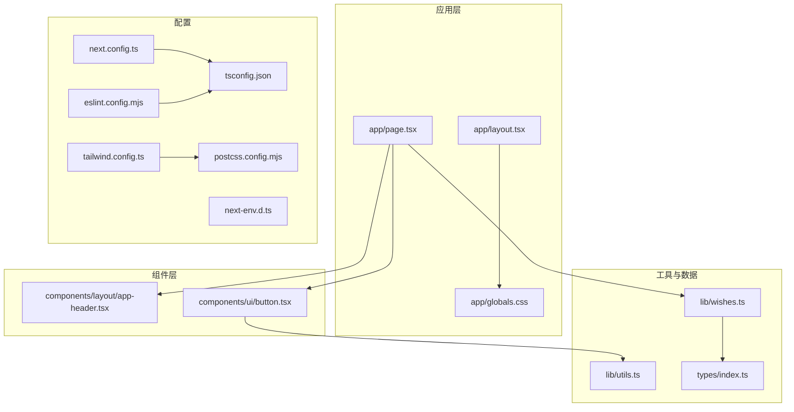
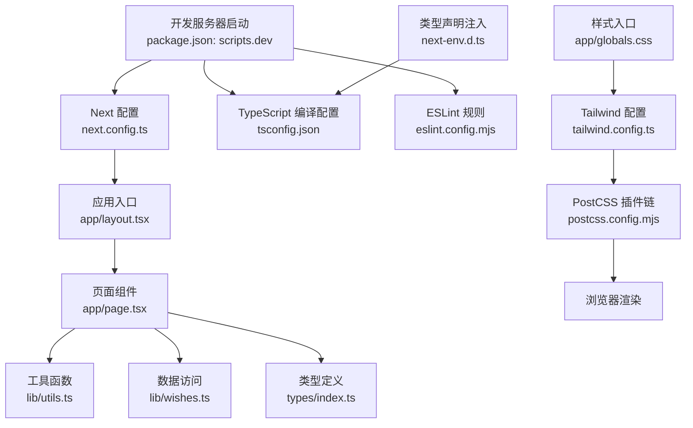
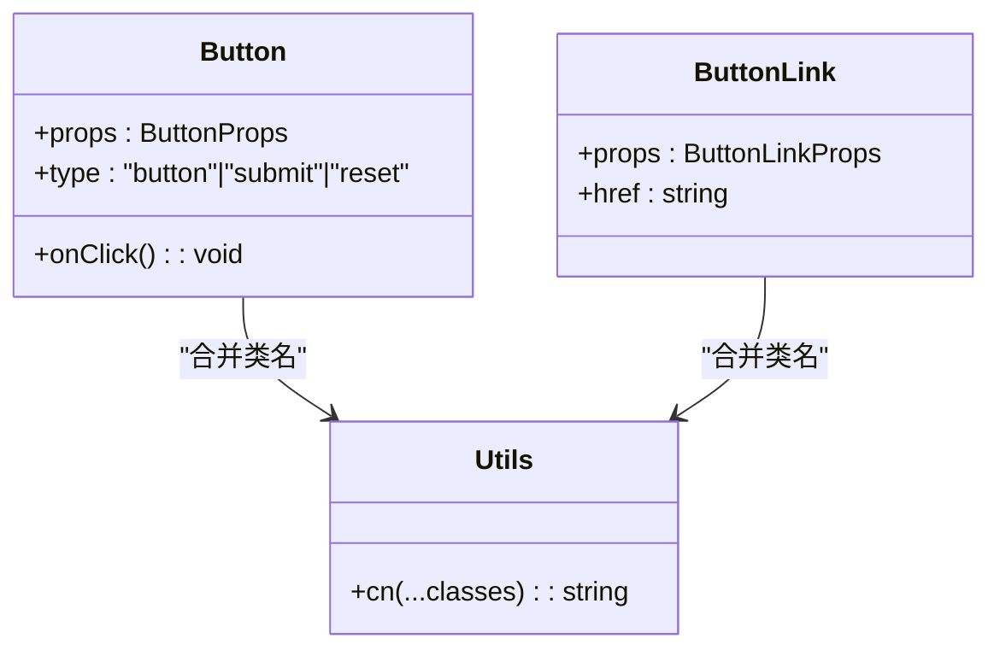
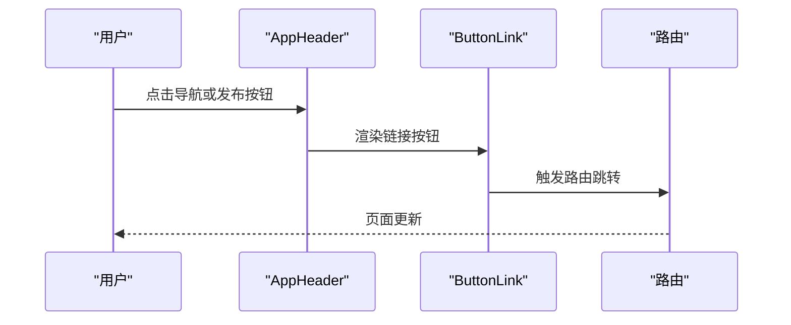
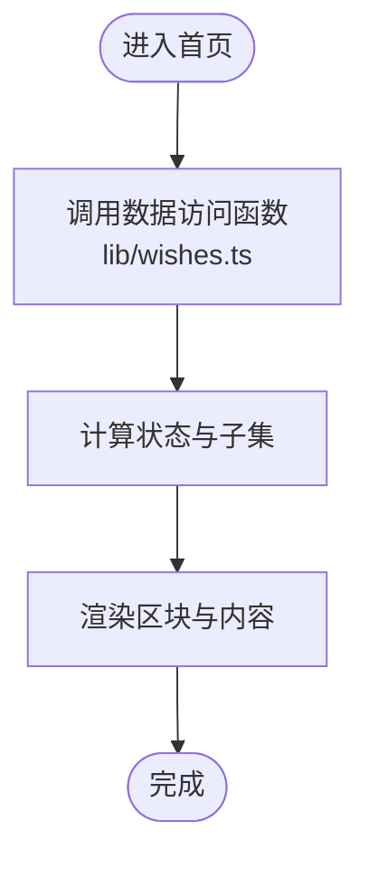
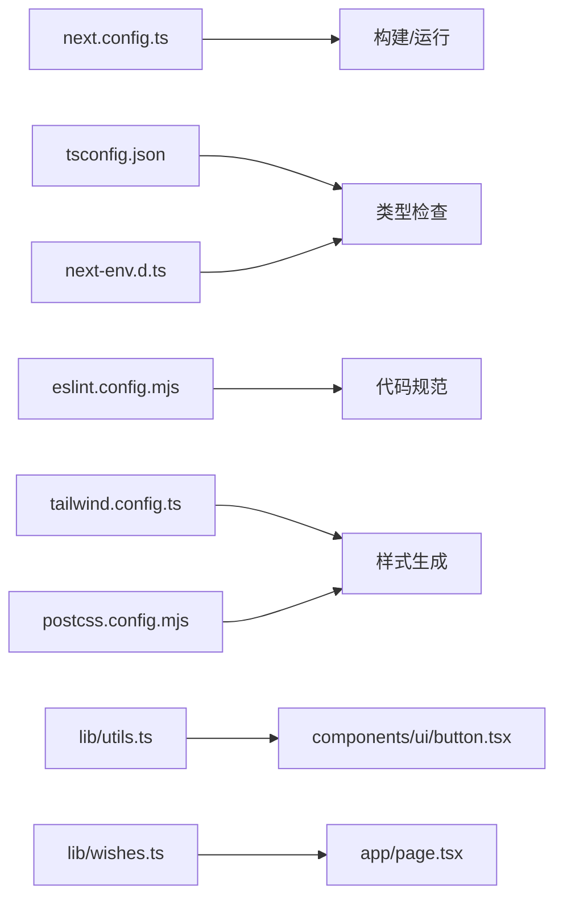

# 调试与开发工具

<cite>
**本文引用的文件**
- [package.json](file://package.json)
- [next.config.ts](file://next.config.ts)
- [tsconfig.json](file://tsconfig.json)
- [tailwind.config.ts](file://tailwind.config.ts)
- [postcss.config.mjs](file://postcss.config.mjs)
- [eslint.config.mjs](file://eslint.config.mjs)
- [next-env.d.ts](file://next-env.d.ts)
- [app/layout.tsx](file://app/layout.tsx)
- [app/page.tsx](file://app/page.tsx)
- [app/globals.css](file://app/globals.css)
- [components/ui/button.tsx](file://components/ui/button.tsx)
- [components/layout/app-header.tsx](file://components/layout/app-header.tsx)
- [lib/utils.ts](file://lib/utils.ts)
- [lib/wishes.ts](file://lib/wishes.ts)
- [types/index.ts](file://types/index.ts)
</cite>

## 目录
1. [简介](#简介)
2. [项目结构](#项目结构)
3. [核心组件](#核心组件)
4. [架构总览](#架构总览)
5. [详细组件分析](#详细组件分析)
6. [依赖关系分析](#依赖关系分析)
7. [性能考量](#性能考量)
8. [故障排除指南](#故障排除指南)
9. [结论](#结论)
10. [附录](#附录)

## 简介
本指南面向使用 Next.js 的前端开发者，围绕开发调试与工具使用提供系统化建议，涵盖以下主题：
- Next.js 开发服务器调试技巧与热重载机制
- 浏览器开发者工具（含 React DevTools）与性能分析
- TypeScript 调试配置与断点设置
- Tailwind CSS 调试与样式问题排查
- 构建过程调试与错误定位
- 性能监控与分析工具使用
- 日志记录与错误追踪最佳实践
- 常见开发问题的解决方案与故障排除流程

## 项目结构
该项目采用 Next.js App Router 结构，关键目录与文件如下：
- 应用入口与布局：app/layout.tsx、app/page.tsx
- 全局样式：app/globals.css、tailwind.config.ts、postcss.config.mjs
- 组件层：components/ui、components/layout、components/wish
- 工具与类型：lib/utils.ts、lib/wishes.ts、types/index.ts
- 配置：next.config.ts、tsconfig.json、eslint.config.mjs、next-env.d.ts
- 启动脚本：package.json 中的 dev/build/start/lint

图表来源
- [app/layout.tsx:1-29](file://app/layout.tsx#L1-L29)
- [app/page.tsx:1-29](file://app/page.tsx#L1-L29)
- [app/globals.css:1-67](file://app/globals.css#L1-L67)
- [components/layout/app-header.tsx:1-64](file://components/layout/app-header.tsx#L1-L64)
- [components/ui/button.tsx:1-75](file://components/ui/button.tsx#L1-L75)
- [lib/utils.ts:1-12](file://lib/utils.ts#L1-L12)
- [lib/wishes.ts:1-27](file://lib/wishes.ts#L1-L27)
- [types/index.ts:1-58](file://types/index.ts#L1-L58)
- [next.config.ts:1-9](file://next.config.ts#L1-L9)
- [tsconfig.json:1-29](file://tsconfig.json#L1-L29)
- [eslint.config.mjs:1-19](file://eslint.config.mjs#L1-L19)
- [next-env.d.ts:1-7](file://next-env.d.ts#L1-L7)
- [tailwind.config.ts:1-55](file://tailwind.config.ts#L1-L55)
- [postcss.config.mjs:1-9](file://postcss.config.mjs#L1-L9)

章节来源
- [package.json:1-29](file://package.json#L1-L29)
- [next.config.ts:1-9](file://next.config.ts#L1-L9)
- [tsconfig.json:1-29](file://tsconfig.json#L1-L29)
- [tailwind.config.ts:1-55](file://tailwind.config.ts#L1-L55)
- [postcss.config.mjs:1-9](file://postcss.config.mjs#L1-L9)
- [eslint.config.mjs:1-19](file://eslint.config.mjs#L1-L19)
- [next-env.d.ts:1-7](file://next-env.d.ts#L1-L7)
- [app/layout.tsx:1-29](file://app/layout.tsx#L1-L29)
- [app/page.tsx:1-29](file://app/page.tsx#L1-L29)
- [app/globals.css:1-67](file://app/globals.css#L1-L67)
- [components/layout/app-header.tsx:1-64](file://components/layout/app-header.tsx#L1-L64)
- [components/ui/button.tsx:1-75](file://components/ui/button.tsx#L1-L75)
- [lib/utils.ts:1-12](file://lib/utils.ts#L1-L12)
- [lib/wishes.ts:1-27](file://lib/wishes.ts#L1-L27)
- [types/index.ts:1-58](file://types/index.ts#L1-L58)

## 核心组件
- 应用根布局与元数据：在根布局中引入全局样式与头部组件，并设置页面级元信息，便于统一主题与导航。
- 主页页面逻辑：从数据层读取愿望列表与精选列表，计算状态并渲染区块。
- UI 组件：按钮组件支持多种变体与尺寸，复用样式合并工具；链接按钮通过路由跳转集成。
- 工具函数：样式类名合并与日期格式化，降低重复逻辑。
- 数据访问层：对 mock 数据进行排序、筛选与查询，为页面提供稳定接口。

章节来源
- [app/layout.tsx:1-29](file://app/layout.tsx#L1-L29)
- [app/page.tsx:1-29](file://app/page.tsx#L1-L29)
- [components/ui/button.tsx:1-75](file://components/ui/button.tsx#L1-L75)
- [lib/utils.ts:1-12](file://lib/utils.ts#L1-L12)
- [lib/wishes.ts:1-27](file://lib/wishes.ts#L1-L27)

## 架构总览
下图展示了开发期从启动到渲染的关键路径，以及样式与类型系统的参与：

图表来源
- [package.json:5-10](file://package.json#L5-L10)
- [next.config.ts:1-9](file://next.config.ts#L1-L9)
- [tsconfig.json:1-29](file://tsconfig.json#L1-L29)
- [eslint.config.mjs:1-19](file://eslint.config.mjs#L1-L19)
- [app/layout.tsx:1-29](file://app/layout.tsx#L1-L29)
- [app/page.tsx:1-29](file://app/page.tsx#L1-L29)
- [lib/utils.ts:1-12](file://lib/utils.ts#L1-L12)
- [lib/wishes.ts:1-27](file://lib/wishes.ts#L1-L27)
- [types/index.ts:1-58](file://types/index.ts#L1-L58)
- [app/globals.css:1-67](file://app/globals.css#L1-L67)
- [tailwind.config.ts:1-55](file://tailwind.config.ts#L1-L55)
- [postcss.config.mjs:1-9](file://postcss.config.mjs#L1-L9)
- [next-env.d.ts:1-7](file://next-env.d.ts#L1-L7)

## 详细组件分析

### 组件一：按钮 Button 与 ButtonLink
- 设计要点
  - 支持多种变体与尺寸，通过样式映射与合并工具生成最终类名。
  - 提供原生按钮与链接两种形态，统一交互语义。
- 调试建议
  - 在浏览器 Elements 面板检查最终类名是否符合预期。
  - 使用 React DevTools 定位组件 props 变化，确认变体/尺寸参数传递正确。
  - 在组件内添加条件断点，验证禁用态与点击回调触发时机。

图表来源
- [components/ui/button.tsx:24-75](file://components/ui/button.tsx#L24-L75)
- [lib/utils.ts:1-3](file://lib/utils.ts#L1-L3)

章节来源
- [components/ui/button.tsx:1-75](file://components/ui/button.tsx#L1-L75)
- [lib/utils.ts:1-12](file://lib/utils.ts#L1-L12)

### 组件二：应用头部 AppHeader
- 设计要点
  - 导航项与徽标组合，响应式显示发布按钮。
  - 使用 Badge 与 ButtonLink 实现视觉层级与交互一致性。
- 调试建议
  - 使用浏览器设备模式测试断点行为。
  - 在 React DevTools 中观察导航项的渲染与选中态切换。

图表来源
- [components/layout/app-header.tsx:22-63](file://components/layout/app-header.tsx#L22-L63)
- [components/ui/button.tsx:59-74](file://components/ui/button.tsx#L59-L74)

章节来源
- [components/layout/app-header.tsx:1-64](file://components/layout/app-header.tsx#L1-L64)
- [components/ui/button.tsx:1-75](file://components/ui/button.tsx#L1-L75)

### 组件三：主页 Home Page
- 设计要点
  - 从数据层获取愿望列表，计算“等待回声”数量，分区块渲染。
  - 使用 Tailwind 类名控制间距与布局。
- 调试建议
  - 在数据访问函数处设置断点，验证排序与筛选逻辑。
  - 使用 React DevTools 查看区块渲染次数与 key 是否合理。

图表来源
- [app/page.tsx:6-28](file://app/page.tsx#L6-L28)
- [lib/wishes.ts:5-17](file://lib/wishes.ts#L5-L17)

章节来源
- [app/page.tsx:1-29](file://app/page.tsx#L1-L29)
- [lib/wishes.ts:1-27](file://lib/wishes.ts#L1-L27)

## 依赖关系分析
- 配置耦合
  - next.config.ts 控制严格模式与构建输出目录，影响开发体验与产物位置。
  - tsconfig.json 启用严格模式与 bundler 解析，确保类型安全与模块解析稳定性。
  - tailwind.config.ts 与 postcss.config.mjs 共同决定样式扫描范围与后处理链路。
- 组件耦合
  - 页面组件依赖数据访问层与工具函数，保持 UI 与业务逻辑分离。
  - UI 组件依赖样式合并工具，避免重复类名拼接。
- 类型系统
  - next-env.d.ts 注入 Next.js 类型声明，配合 tsconfig.json 的 include/exclude 形成完整类型网。

图表来源
- [next.config.ts:1-9](file://next.config.ts#L1-L9)
- [tsconfig.json:1-29](file://tsconfig.json#L1-L29)
- [eslint.config.mjs:1-19](file://eslint.config.mjs#L1-L19)
- [tailwind.config.ts:1-55](file://tailwind.config.ts#L1-L55)
- [postcss.config.mjs:1-9](file://postcss.config.mjs#L1-L9)
- [next-env.d.ts:1-7](file://next-env.d.ts#L1-L7)
- [lib/utils.ts:1-12](file://lib/utils.ts#L1-L12)
- [lib/wishes.ts:1-27](file://lib/wishes.ts#L1-L27)
- [components/ui/button.tsx:1-75](file://components/ui/button.tsx#L1-L75)
- [app/page.tsx:1-29](file://app/page.tsx#L1-L29)

章节来源
- [next.config.ts:1-9](file://next.config.ts#L1-L9)
- [tsconfig.json:1-29](file://tsconfig.json#L1-L29)
- [eslint.config.mjs:1-19](file://eslint.config.mjs#L1-L19)
- [tailwind.config.ts:1-55](file://tailwind.config.ts#L1-L55)
- [postcss.config.mjs:1-9](file://postcss.config.mjs#L1-L9)
- [next-env.d.ts:1-7](file://next-env.d.ts#L1-L7)
- [lib/utils.ts:1-12](file://lib/utils.ts#L1-L12)
- [lib/wishes.ts:1-27](file://lib/wishes.ts#L1-L27)
- [components/ui/button.tsx:1-75](file://components/ui/button.tsx#L1-L75)
- [app/page.tsx:1-29](file://app/page.tsx#L1-L29)

## 性能考量
- 开发服务器与热重载
  - 使用开发脚本启动，修改任意文件后自动触发热重载，减少手动刷新成本。
  - 若热重载未生效，优先检查文件保存状态与编辑器插件配置。
- 构建性能
  - 严格模式与增量编译可提升类型检查效率，但首次构建时间可能较长。
  - Tailwind 扫描范围由配置控制，尽量缩小扫描目录以减少构建开销。
- 运行时性能
  - 使用 React DevTools Profiler 分析组件渲染与重渲染热点。
  - 在页面组件中对昂贵计算进行 memo 化，避免不必要的重渲染。
- 样式性能
  - 合理拆分 Tailwind 类名，避免单行类名过长导致的样式解析压力。
  - 使用 @layer 与自定义组件类名组织样式，提升可维护性与缓存命中率。

## 故障排除指南
- 开发服务器无法启动或端口占用
  - 检查开发脚本与端口占用情况，必要时更换端口或终止冲突进程。
  - 章节来源: [package.json:5-10](file://package.json#L5-L10)
- 热重载不生效
  - 确认文件已保存且未被忽略；检查编辑器的自动保存与格式化插件。
  - 若使用外部文件监听，请确保文件系统事件可用。
- 样式未更新或类名无效
  - 确认 Tailwind 扫描路径包含当前文件；清理构建缓存后重试。
  - 章节来源: [tailwind.config.ts:4-9](file://tailwind.config.ts#L4-L9)
- TypeScript 报错或类型缺失
  - 检查 tsconfig.json 的 include/exclude 与路径映射；确保类型声明文件存在。
  - 章节来源: [tsconfig.json:21-26](file://tsconfig.json#L21-L26), [next-env.d.ts:1-7](file://next-env.d.ts#L1-L7)
- ESLint 忽略规则或误报
  - 检查忽略列表与规则扩展，必要时临时关闭规则定位问题。
  - 章节来源: [eslint.config.mjs:5-15](file://eslint.config.mjs#L5-L15)
- 页面渲染异常或数据不一致
  - 在数据访问函数处设置断点，核对排序与筛选逻辑；检查数据模型与类型定义。
  - 章节来源: [lib/wishes.ts:5-17](file://lib/wishes.ts#L5-L17), [types/index.ts:30-48](file://types/index.ts#L30-L48)
- 构建失败或产物缺失
  - 检查构建脚本与 distDir 配置；确认依赖安装与版本兼容性。
  - 章节来源: [package.json:7-8](file://package.json#L7-L8), [next.config.ts:5-6](file://next.config.ts#L5-L6)

## 结论
通过合理的配置与工具链，本项目在开发期具备良好的调试与可观测性。建议在日常开发中：
- 将热重载与断点调试结合，快速定位 UI 与数据问题
- 利用 React DevTools 与性能分析工具优化渲染性能
- 以 Tailwind 配置与 PostCSS 插件链管理样式，提高可维护性
- 以 TypeScript 严格模式与 ESLint 规范保障代码质量
- 建立标准化的日志与错误追踪流程，提升问题定位效率

## 附录
- 开发命令速查
  - 启动开发服务器：参考 [package.json:5-10](file://package.json#L5-L10)
  - 构建项目：参考 [package.json:7-8](file://package.json#L7-L8)
  - 运行生产服务：参考 [package.json:7-8](file://package.json#L7-L8)
  - 代码检查：参考 [package.json:9-10](file://package.json#L9-L10)
- 关键配置参考
  - Next.js 配置：参考 [next.config.ts:1-9](file://next.config.ts#L1-L9)
  - TypeScript 配置：参考 [tsconfig.json:1-29](file://tsconfig.json#L1-L29)
  - Tailwind 配置：参考 [tailwind.config.ts:1-55](file://tailwind.config.ts#L1-L55)
  - PostCSS 配置：参考 [postcss.config.mjs:1-9](file://postcss.config.mjs#L1-L9)
  - ESLint 配置：参考 [eslint.config.mjs:1-19](file://eslint.config.mjs#L1-L19)
  - 类型声明注入：参考 [next-env.d.ts:1-7](file://next-env.d.ts#L1-L7)
- 样式与主题
  - 全局样式入口：参考 [app/globals.css:1-67](file://app/globals.css#L1-L67)
  - 根布局与主题色：参考 [app/layout.tsx:18-26](file://app/layout.tsx#L18-L26)