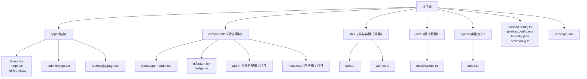
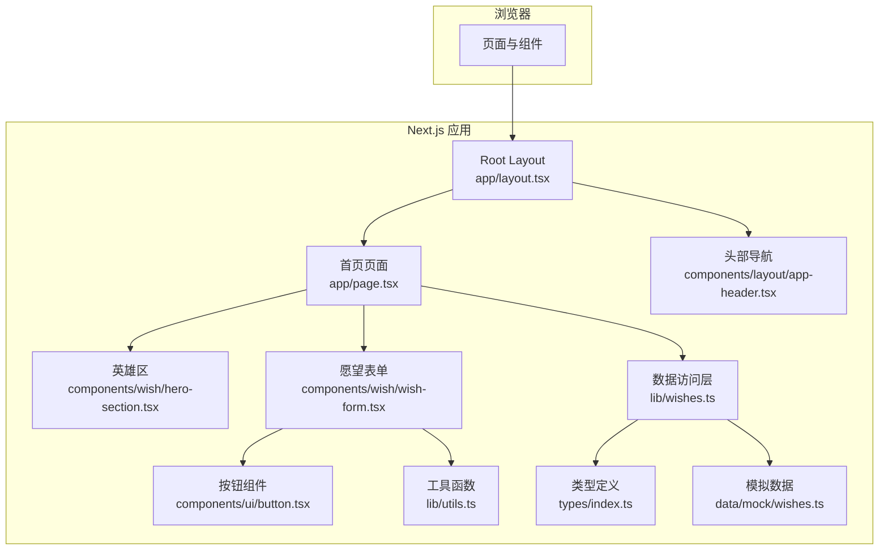
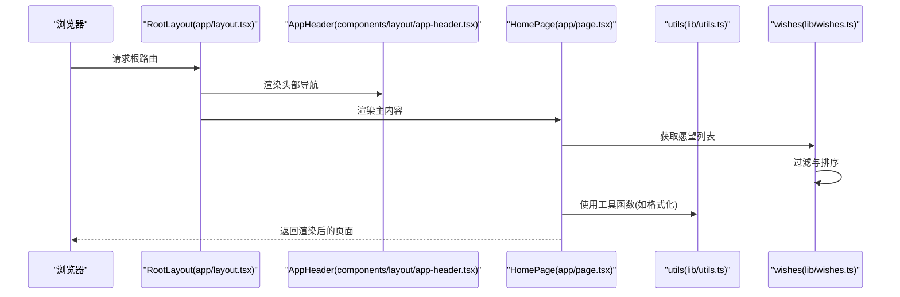
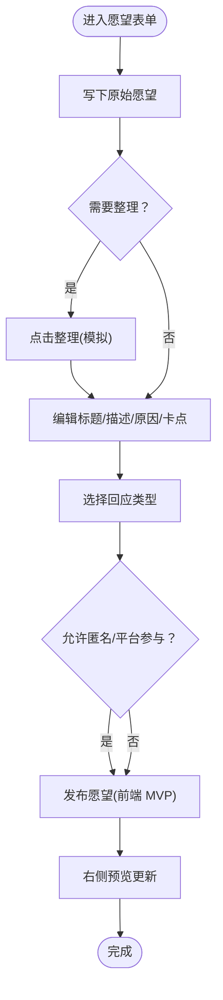
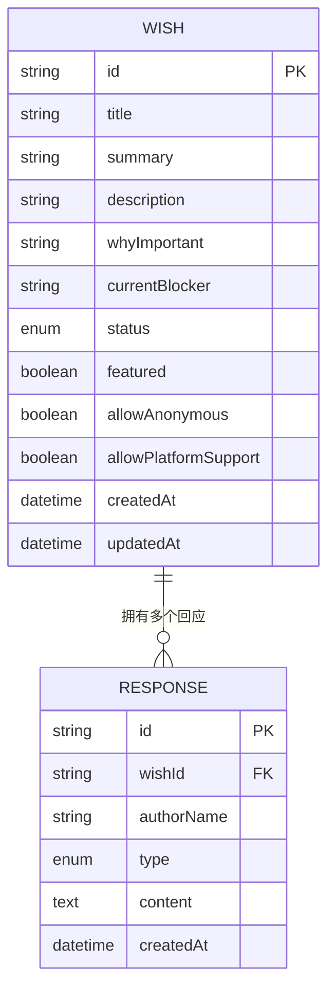
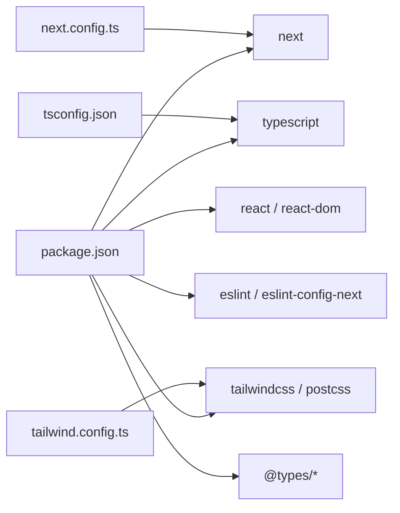

# 快速开始

<cite>
**本文引用的文件**
- [package.json](file://package.json)
- [next.config.ts](file://next.config.ts)
- [tsconfig.json](file://tsconfig.json)
- [tailwind.config.ts](file://tailwind.config.ts)
- [app/layout.tsx](file://app/layout.tsx)
- [app/page.tsx](file://app/page.tsx)
- [app/globals.css](file://app/globals.css)
- [components/layout/app-header.tsx](file://components/layout/app-header.tsx)
- [components/ui/button.tsx](file://components/ui/button.tsx)
- [components/wish/hero-section.tsx](file://components/wish/hero-section.tsx)
- [components/wish/wish-form.tsx](file://components/wish/wish-form.tsx)
- [lib/utils.ts](file://lib/utils.ts)
- [lib/wishes.ts](file://lib/wishes.ts)
- [types/index.ts](file://types/index.ts)
- [data/mock/wishes.ts](file://data/mock/wishes.ts)
</cite>

## 目录
1. [简介](#简介)
2. [项目结构](#项目结构)
3. [核心组件](#核心组件)
4. [架构概览](#架构概览)
5. [详细组件分析](#详细组件分析)
6. [依赖分析](#依赖分析)
7. [性能考虑](#性能考虑)
8. [故障排除指南](#故障排除指南)
9. [结论](#结论)
10. [附录](#附录)

## 简介
本指南面向首次接触「梦的平台 / 愿望被回应的平台」的开发者，帮助你在本地快速搭建并运行项目。你将学到：
- 环境要求与推荐配置
- 项目克隆、依赖安装与开发服务器启动
- 常用开发命令说明（如 dev、build、start）
- 项目结构快速浏览与关键文件定位
- 基本运行验证步骤与常见问题排查

### 产品气质与开发约束

开发时请严格遵循以下约束：

**想要的感觉**：温柔、克制、真实、有希望、有叙事感、有留白

**不要做成**：普通论坛、Reddit 风、外包任务平台、招聘网站、SaaS 后台 dashboard、心理树洞产品、过度梦幻/发光/渐变的页面

**参考气质**：Notion 的克制和留白 + Linear/Vercel 的秩序感和干净感 + 一点更柔和的人味和叙事感

**文案原则**：
- 少用宏大口号，多用真实、具体、温和表达
- 强调"被回应"而非"许愿成功"
- 回应叫"回声"而不是"评论"
- 困难叫"卡点"而不是"问题"

### 开发优先级

根据产品需求，当前开发优先级为：
1. **最高优先级**：愿望详情页精修——决定产品成不成立
2. **中优先级**：发布愿望页精修
3. **低优先级**：首页二次精修
4. **仅纠偏用**：主 Prompt 作为产品宪法，不做日常使用

## 项目结构
该项目采用 Next.js 应用程序，使用 App Router 结构组织页面与组件。整体目录组织以功能域为导向，便于扩展与维护。

图表来源
- [app/layout.tsx:1-29](file://app/layout.tsx#L1-L29)
- [components/layout/app-header.tsx:1-64](file://components/layout/app-header.tsx#L1-L64)
- [lib/utils.ts:1-12](file://lib/utils.ts#L1-L12)
- [lib/wishes.ts:1-27](file://lib/wishes.ts#L1-L27)
- [data/mock/wishes.ts:1-210](file://data/mock/wishes.ts#L1-L210)
- [types/index.ts:1-58](file://types/index.ts#L1-L58)

章节来源
- [app/layout.tsx:1-29](file://app/layout.tsx#L1-L29)
- [components/layout/app-header.tsx:1-64](file://components/layout/app-header.tsx#L1-L64)
- [lib/utils.ts:1-12](file://lib/utils.ts#L1-L12)
- [lib/wishes.ts:1-27](file://lib/wishes.ts#L1-L27)
- [data/mock/wishes.ts:1-210](file://data/mock/wishes.ts#L1-L210)
- [types/index.ts:1-58](file://types/index.ts#L1-L58)

## 核心组件
- 应用根布局与元数据：负责全局样式引入、语言设置与顶层容器结构。
- 首页：聚合精选与最新愿望，展示平台愿景与入口。
- 头部导航：提供站点 Logo、主导航与发布入口按钮。
- 按钮与徽章：统一的交互组件，保证视觉一致性。
- 愿望表单：多步骤引导用户整理与发布愿望，包含 AI 预览与响应类型选择。
- 工具函数：类名合并与日期格式化等通用逻辑。
- 数据访问层：封装对模拟数据的查询，便于替换为真实后端。
- 类型系统：集中定义愿望、回应与状态等核心类型。

章节来源
- [app/layout.tsx:1-29](file://app/layout.tsx#L1-L29)
- [app/page.tsx:1-29](file://app/page.tsx#L1-L29)
- [components/layout/app-header.tsx:1-64](file://components/layout/app-header.tsx#L1-L64)
- [components/ui/button.tsx:1-75](file://components/ui/button.tsx#L1-L75)
- [components/wish/wish-form.tsx:1-264](file://components/wish/wish-form.tsx#L1-L264)
- [lib/utils.ts:1-12](file://lib/utils.ts#L1-L12)
- [lib/wishes.ts:1-27](file://lib/wishes.ts#L1-L27)
- [types/index.ts:1-58](file://types/index.ts#L1-L58)

## 架构概览
应用采用 Next.js App Router，页面通过动态路由与静态资源配合 Tailwind CSS 实现响应式设计。数据通过 lib 层的函数访问 mock 数据，便于后续替换为真实后端。

图表来源
- [app/layout.tsx:1-29](file://app/layout.tsx#L1-L29)
- [app/page.tsx:1-29](file://app/page.tsx#L1-L29)
- [components/layout/app-header.tsx:1-64](file://components/layout/app-header.tsx#L1-L64)
- [components/wish/hero-section.tsx:1-53](file://components/wish/hero-section.tsx#L1-L53)
- [components/wish/wish-form.tsx:1-264](file://components/wish/wish-form.tsx#L1-L264)
- [components/ui/button.tsx:1-75](file://components/ui/button.tsx#L1-L75)
- [lib/utils.ts:1-12](file://lib/utils.ts#L1-L12)
- [lib/wishes.ts:1-27](file://lib/wishes.ts#L1-L27)
- [types/index.ts:1-58](file://types/index.ts#L1-L58)
- [data/mock/wishes.ts:1-210](file://data/mock/wishes.ts#L1-L210)

## 详细组件分析

### 页面与布局
- 根布局负责注入全局样式、设置语言与主题色板，并挂载顶部导航与主内容区域。
- 首页聚合精选与最新愿望，统计“等待回声”的数量，展示平台愿景与入口。

图表来源
- [app/layout.tsx:1-29](file://app/layout.tsx#L1-L29)
- [components/layout/app-header.tsx:1-64](file://components/layout/app-header.tsx#L1-L64)
- [app/page.tsx:1-29](file://app/page.tsx#L1-L29)
- [lib/utils.ts:1-12](file://lib/utils.ts#L1-L12)
- [lib/wishes.ts:1-27](file://lib/wishes.ts#L1-L27)

章节来源
- [app/layout.tsx:1-29](file://app/layout.tsx#L1-L29)
- [app/page.tsx:1-29](file://app/page.tsx#L1-L29)
- [lib/wishes.ts:1-27](file://lib/wishes.ts#L1-L27)

### 组件与样式
- 英雄区展示精选语录与行动按钮，强调“先整理，再回应”的理念。
- 愿望表单采用三步流程：原始表达 → 结构化编辑 → 选择回应类型与发布选项；右侧提供 AI 预览与提示文案。
- 按钮组件提供多种风格与尺寸，统一交互体验。

图表来源
- [components/wish/wish-form.tsx:1-264](file://components/wish/wish-form.tsx#L1-L264)
- [components/wish/hero-section.tsx:1-53](file://components/wish/hero-section.tsx#L1-L53)
- [components/ui/button.tsx:1-75](file://components/ui/button.tsx#L1-L75)

章节来源
- [components/wish/wish-form.tsx:1-264](file://components/wish/wish-form.tsx#L1-L264)
- [components/wish/hero-section.tsx:1-53](file://components/wish/hero-section.tsx#L1-L53)
- [components/ui/button.tsx:1-75](file://components/ui/button.tsx#L1-L75)

### 数据与类型
- 类型系统定义愿望、回应与状态等核心类型，确保组件间契约清晰。
- 数据访问层封装对模拟数据的查询，便于替换为真实后端接口。
- 模拟数据包含多条愿望与回应，覆盖不同状态与类别，支撑页面渲染与交互。

图表来源
- [types/index.ts:1-58](file://types/index.ts#L1-L58)
- [data/mock/wishes.ts:1-210](file://data/mock/wishes.ts#L1-L210)
- [lib/wishes.ts:1-27](file://lib/wishes.ts#L1-L27)

章节来源
- [types/index.ts:1-58](file://types/index.ts#L1-L58)
- [data/mock/wishes.ts:1-210](file://data/mock/wishes.ts#L1-L210)
- [lib/wishes.ts:1-27](file://lib/wishes.ts#L1-L27)

## 依赖分析
- 构建与运行时：Next.js 15、React 19、React DOM 19。
- 开发工具：TypeScript、Tailwind CSS、PostCSS、ESLint 及其 Next.js 配置。
- 配置文件：tsconfig.json 控制编译目标与模块解析；tailwind.config.ts 定义颜色、字体与阴影；next.config.ts 设置严格模式与构建输出目录。

图表来源
- [package.json:1-29](file://package.json#L1-L29)
- [tsconfig.json:1-29](file://tsconfig.json#L1-L29)
- [tailwind.config.ts:1-55](file://tailwind.config.ts#L1-L55)
- [next.config.ts:1-9](file://next.config.ts#L1-L9)

章节来源
- [package.json:1-29](file://package.json#L1-L29)
- [tsconfig.json:1-29](file://tsconfig.json#L1-L29)
- [tailwind.config.ts:1-55](file://tailwind.config.ts#L1-L55)
- [next.config.ts:1-9](file://next.config.ts#L1-L9)

## 性能考虑
- 使用 Next.js App Router 的服务端渲染与静态生成能力，结合客户端组件按需加载，减少首屏体积。
- Tailwind CSS 通过 content 白名单仅生成实际使用的样式，避免无用 CSS。
- 严格模式与 TypeScript 提升开发体验与运行时稳定性。
- 构建输出目录可自定义，便于缓存与部署优化。

## 故障排除指南
- Node.js 版本不兼容
  - 症状：安装或启动时报错，提示版本过低或不支持。
  - 排查：确认已安装满足要求的 Node.js 版本（建议使用 LTS）。
  - 参考：Next.js 15 与 React 19 对较新的 Node.js 版本更友好。
- 依赖安装失败
  - 症状：npm install 报错或卡住。
  - 排查：清理缓存与锁文件后重试；检查网络代理；确保 npm/yarn/pnpm 版本稳定。
- 构建失败
  - 症状：npm run build 报错。
  - 排查：查看错误日志中是否有类型错误或样式未找到；确认 tsconfig 与 tailwind 配置正确；检查路径别名与模块解析。
- 开发服务器无法启动
  - 症状：npm run dev 启动后页面空白或白屏。
  - 排查：检查端口占用；确认根布局与页面导出正确；查看浏览器控制台错误；验证全局样式与组件导入路径。
- 样式异常
  - 症状：页面元素无样式或样式错乱。
  - 排查：确认 Tailwind 配置的 content 路径包含所有组件；重启开发服务器；清理浏览器缓存。
- 路由与页面缺失
  - 症状：访问特定路由返回 404 或空白。
  - 排查：确认 App Router 的页面文件命名与路径；检查动态路由参数与页面导出；验证 layout.tsx 是否正确包裹子页面。

章节来源
- [package.json:1-29](file://package.json#L1-L29)
- [tsconfig.json:1-29](file://tsconfig.json#L1-L29)
- [tailwind.config.ts:1-55](file://tailwind.config.ts#L1-L55)
- [next.config.ts:1-9](file://next.config.ts#L1-L9)
- [app/layout.tsx:1-29](file://app/layout.tsx#L1-L29)
- [app/page.tsx:1-29](file://app/page.tsx#L1-L29)

## 结论
通过本指南，你已掌握环境准备、项目启动与常用命令的使用方法，并对项目结构与关键组件有了整体认知。建议在本地成功运行后，逐步探索各页面与组件的交互细节，再进行二次开发与功能扩展。

## 附录

### 环境要求与推荐配置
- Node.js：建议使用 LTS 版本（如 18.x 或 20.x），以确保与 Next.js 15 和 React 19 的兼容性。
- 包管理器：推荐使用 npm 8+ 或更高版本；也可使用 yarn 或 pnpm。
- 文本编辑器：建议使用 VS Code 并安装 TypeScript、ESLint、Tailwind CSS 相关插件以提升开发体验。

### 开发命令说明
- npm run dev：启动开发服务器，启用热重载与严格模式。
- npm run build：执行构建，产物输出至自定义目录（由配置控制）。
- npm run start：启动生产服务器，加载构建产物。
- npm run lint：运行 ESLint 检查。

章节来源
- [package.json:5-10](file://package.json#L5-L10)
- [next.config.ts:3-6](file://next.config.ts#L3-L6)

### 项目结构快速浏览
- app：页面与布局，包含根布局、首页、发布页与详情页等。
- components：可复用 UI 组件与业务组件，如头部、按钮、徽章、愿望卡片、回应卡片等。
- lib：工具函数与数据访问层，封装对模拟数据的查询。
- data：模拟数据，包含愿望与回应列表。
- types：全局类型定义，统一数据结构。
- 配置：tsconfig.json、tailwind.config.ts、postcss.config.mjs、next.config.ts。

章节来源
- [app/layout.tsx:1-29](file://app/layout.tsx#L1-L29)
- [components/layout/app-header.tsx:1-64](file://components/layout/app-header.tsx#L1-L64)
- [lib/utils.ts:1-12](file://lib/utils.ts#L1-L12)
- [lib/wishes.ts:1-27](file://lib/wishes.ts#L1-L27)
- [data/mock/wishes.ts:1-210](file://data/mock/wishes.ts#L1-L210)
- [types/index.ts:1-58](file://types/index.ts#L1-L58)
- [tsconfig.json:1-29](file://tsconfig.json#L1-L29)
- [tailwind.config.ts:1-55](file://tailwind.config.ts#L1-L55)
- [next.config.ts:1-9](file://next.config.ts#L1-L9)

### 运行验证步骤
- 克隆仓库后，安装依赖并启动开发服务器。
- 打开浏览器访问开发地址，应看到根页面加载成功。
- 点击导航或按钮，验证页面跳转与交互正常。
- 访问发布页，查看愿望表单是否可操作，右侧预览是否随输入更新。
- 若一切正常，即可继续进行二次开发。

### 常见初始化问题与解决方案
- 依赖安装失败：清理缓存与锁文件后重试；检查网络与代理。
- 构建失败：修复类型错误；确认 Tailwind content 路径；检查路径别名。
- 开发服务器启动失败：检查端口占用；确认根布局与页面导出；查看控制台错误。
- 样式异常：确认 Tailwind 配置；重启开发服务器；清理缓存。
- 路由 404：检查页面文件命名与路径；确认动态路由参数；验证 layout.tsx 包裹。