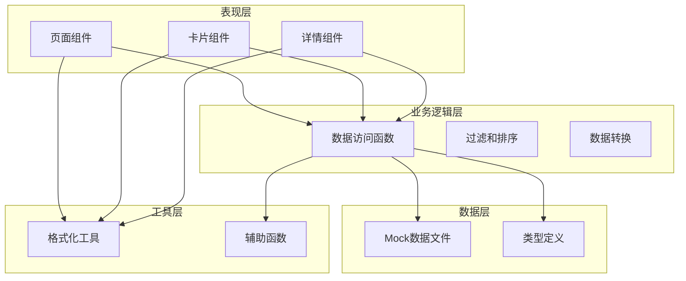
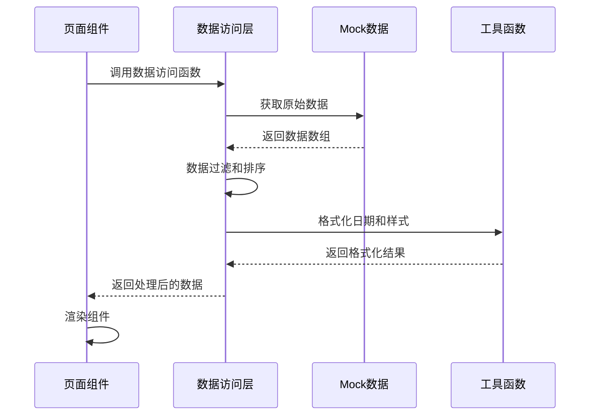
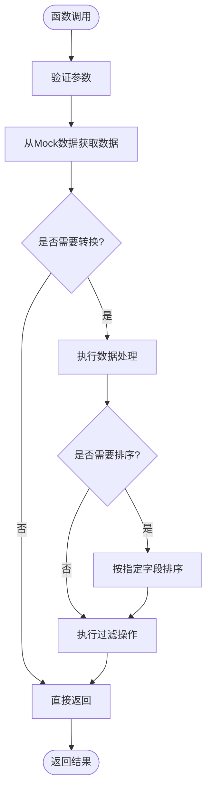
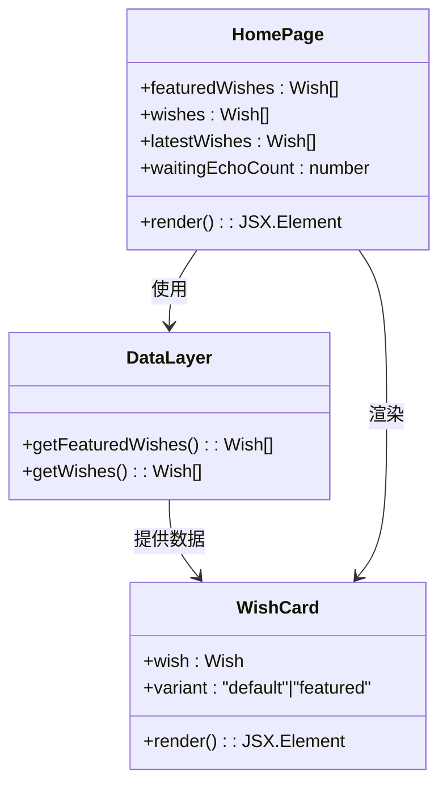
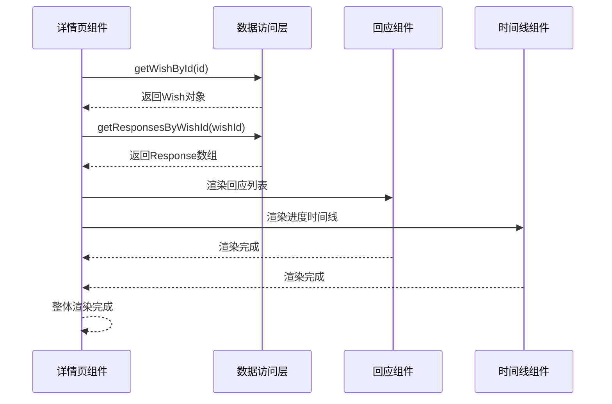
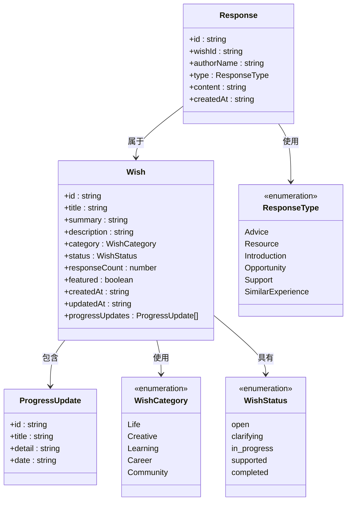

# Mock数据系统

<cite>
**本文档引用的文件**
- [data/mock/wishes.ts](file://data/mock/wishes.ts)
- [lib/wishes.ts](file://lib/wishes.ts)
- [types/index.ts](file://types/index.ts)
- [app/page.tsx](file://app/page.tsx)
- [app/wishes/[id]/page.tsx](file://app/wishes/[id]/page.tsx)
- [components/wish/wish-card.tsx](file://components/wish/wish-card.tsx)
- [components/response/response-card.tsx](file://components/response/response-card.tsx)
- [components/wish/progress-timeline.tsx](file://components/wish/progress-timeline.tsx)
- [lib/utils.ts](file://lib/utils.ts)
- [package.json](file://package.json)
- [next.config.ts](file://next.config.ts)
- [tsconfig.json](file://tsconfig.json)
</cite>

## 目录
1. [简介](#简介)
2. [项目结构](#项目结构)
3. [核心组件](#核心组件)
4. [架构概览](#架构概览)
5. [详细组件分析](#详细组件分析)
6. [依赖关系分析](#依赖关系分析)
7. [性能考虑](#性能考虑)
8. [故障排除指南](#故障排除指南)
9. [结论](#结论)
10. [附录](#附录)

## 简介

梦想回应平台的Mock数据系统是一个完整的模拟数据解决方案，专为Next.js应用设计，支持离线开发和单元测试。该系统通过类型安全的接口定义和模块化的数据结构，为前端组件提供了稳定的数据源，同时保持了与未来真实数据库集成的兼容性。

Mock数据系统的核心目标是在开发早期阶段提供完整的功能演示，允许开发者在无需后端服务的情况下进行界面调试和功能验证。系统涵盖了愿望(Wish)、回应(Response)和进度更新(ProgressUpdate)三个核心实体，每个实体都经过精心设计以反映真实世界的使用场景。

## 项目结构

项目采用基于功能的组织结构，Mock数据系统位于`data/mock/`目录下，与业务逻辑分离：

```mermaid
graph TB
subgraph "项目结构"
A[data/mock/] --> B[wishes.ts]
C[lib/] --> D[wishes.ts]
E[types/] --> F[index.ts]
G[components/] --> H[wish/]
G --> I[response/]
J[app/] --> K[page.tsx]
J --> L[wishes/[id]/page.tsx]
end
subgraph "Mock数据层"
B --> M[Wish数组]
B --> N[Response数组]
B --> O[ResponseType枚举]
end
subgraph "业务逻辑层"
D --> P[数据访问函数]
D --> Q[过滤和排序]
end
subgraph "类型定义层"
F --> R[Wish接口]
F --> S[Response接口]
F --> T[ProgressUpdate接口]
end
```

**图表来源**
- [data/mock/wishes.ts:1-210](file://data/mock/wishes.ts#L1-L210)
- [lib/wishes.ts:1-27](file://lib/wishes.ts#L1-L27)
- [types/index.ts:1-58](file://types/index.ts#L1-L58)

**章节来源**
- [data/mock/wishes.ts:1-210](file://data/mock/wishes.ts#L1-L210)
- [lib/wishes.ts:1-27](file://lib/wishes.ts#L1-L27)
- [types/index.ts:1-58](file://types/index.ts#L1-L58)

## 核心组件

### 数据模型定义

Mock数据系统的核心是三个主要数据实体，每个实体都有明确的职责和数据结构：

#### Wish实体结构
Wish实体代表用户提交的梦想或愿望，包含完整的元数据和状态信息：

| 字段名 | 类型 | 必填 | 描述 |
|--------|------|------|------|
| id | string | 是 | 唯一标识符，用于URL路由和数据关联 |
| title | string | 是 | 愿望标题，显示在卡片和详情页 |
| summary | string | 是 | 简短摘要，用于列表展示 |
| description | string | 是 | 详细描述，用于详情页展示 |
| whyImportant | string | 是 | 重要性说明，帮助回应者理解价值 |
| currentBlocker | string | 是 | 当前障碍，明确需要的帮助类型 |
| category | WishCategory | 是 | 分类标签，支持过滤和搜索 |
| status | WishStatus | 是 | 状态枚举，跟踪进展阶段 |
| responseCount | number | 是 | 回应数量，用于统计和排序 |
| featured | boolean | 是 | 是否推荐，影响展示优先级 |
| allowAnonymous | boolean | 是 | 是否允许匿名回应 |
| allowPlatformSupport | boolean | 是 | 是否允许平台介入支持 |
| createdAt | string | 是 | 创建时间，ISO格式日期字符串 |
| updatedAt | string | 是 | 更新时间，ISO格式日期字符串 |
| progressUpdates | ProgressUpdate[] | 否 | 平台推进记录数组 |

#### Response实体结构
Response实体代表社区成员对愿望提供的帮助或回应：

| 字段名 | 类型 | 必填 | 描述 |
|--------|------|------|------|
| id | string | 是 | 唯一标识符 |
| wishId | string | 是 | 关联的愿望ID |
| authorName | string | 是 | 回应者姓名或匿名标识 |
| type | ResponseType | 是 | 回应类型，决定帮助性质 |
| content | string | 是 | 回应内容，Markdown格式 |
| createdAt | string | 是 | 创建时间，ISO格式 |

#### ProgressUpdate实体结构
ProgressUpdate实体记录平台对愿望的推进过程：

| 字段名 | 类型 | 必填 | 描述 |
|--------|------|------|------|
| id | string | 是 | 唯一标识符 |
| title | string | 是 | 更新标题，简洁描述进展 |
| detail | string | 是 | 详细说明，完整描述行动 |
| date | string | 是 | 发布日期，ISO格式 |

**章节来源**
- [types/index.ts:23-58](file://types/index.ts#L23-L58)
- [data/mock/wishes.ts:12-150](file://data/mock/wishes.ts#L12-L150)

### 数据生成策略

Mock数据采用了多种生成策略来确保数据的多样性和真实性：

#### 多样化场景覆盖
系统包含了五种不同类型的愿望，涵盖生活、创意、学习、职业和社区等多个领域，确保测试场景的全面性。

#### 真实时间线模拟
所有数据都包含精确的时间戳，模拟真实的创建和更新时间，支持按时间排序和状态追踪。

#### 关联数据完整性
每个Wish实体都包含相应的Response数据，形成完整的互动生态，支持端到端的功能测试。

**章节来源**
- [data/mock/wishes.ts:3-10](file://data/mock/wishes.ts#L3-L10)
- [data/mock/wishes.ts:12-150](file://data/mock/wishes.ts#L12-L150)

## 架构概览

Mock数据系统采用分层架构设计，确保了良好的可维护性和扩展性：



**图表来源**
- [lib/wishes.ts:1-27](file://lib/wishes.ts#L1-L27)
- [data/mock/wishes.ts:1-210](file://data/mock/wishes.ts#L1-L210)
- [lib/utils.ts:1-12](file://lib/utils.ts#L1-L12)

### 控制流程

系统遵循标准的React组件生命周期，通过数据访问函数实现数据的获取和处理：



**图表来源**
- [lib/wishes.ts:5-26](file://lib/wishes.ts#L5-L26)
- [lib/utils.ts:5-10](file://lib/utils.ts#L5-L10)

**章节来源**
- [lib/wishes.ts:1-27](file://lib/wishes.ts#L1-L27)
- [app/page.tsx:1-29](file://app/page.tsx#L1-L29)
- [app/wishes/[id]/page.tsx:19-32](file://app/wishes/[id]/page.tsx#L19-L32)

## 详细组件分析

### 数据访问层

数据访问层是Mock系统的核心，提供了类型安全的数据获取接口：

#### 主要函数功能

| 函数名 | 参数 | 返回值 | 功能描述 |
|--------|------|--------|----------|
| getWishes | 无 | Wish[] | 获取所有愿望并按更新时间排序 |
| getFeaturedWishes | 无 | Wish[] | 获取推荐愿望 |
| getWishById | id: string | Wish \| undefined | 根据ID获取特定愿望 |
| getResponsesByWishId | wishId: string | Response[] | 获取特定愿望的所有回应 |

#### 实现模式

数据访问层采用了函数式编程模式，每个函数都是纯函数，不依赖外部状态：



**图表来源**
- [lib/wishes.ts:5-26](file://lib/wishes.ts#L5-L26)

**章节来源**
- [lib/wishes.ts:1-27](file://lib/wishes.ts#L1-L27)

### 组件集成分析

Mock数据系统与React组件的集成采用了松耦合的设计原则：

#### 首页组件集成

首页组件通过数据访问层获取数据，实现了完整的数据流：



**图表来源**
- [app/page.tsx:4-28](file://app/page.tsx#L4-L28)
- [lib/wishes.ts:11-13](file://lib/wishes.ts#L11-L13)

#### 详情页组件集成

详情页组件展示了更复杂的数据处理逻辑：



**图表来源**
- [app/wishes/[id]/page.tsx:25-31](file://app/wishes/[id]/page.tsx#L25-L31)
- [lib/wishes.ts:19-26](file://lib/wishes.ts#L19-L26)

**章节来源**
- [app/page.tsx:1-29](file://app/page.tsx#L1-L29)
- [app/wishes/[id]/page.tsx:19-184](file://app/wishes/[id]/page.tsx#L19-L184)

### 数据模型分析

系统的数据模型设计体现了类型安全和扩展性的平衡：

#### 类型层次结构



**图表来源**
- [types/index.ts:1-58](file://types/index.ts#L1-L58)

**章节来源**
- [types/index.ts:1-58](file://types/index.ts#L1-L58)

## 依赖关系分析

Mock数据系统的依赖关系设计遵循了清晰的分层原则：

```mermaid
graph TB
subgraph "外部依赖"
A[React]
B[Next.js]
C[TypeScript]
end
subgraph "内部模块"
D[app/page.tsx]
E[app/wishes/[id]/page.tsx]
F[components/wish/]
G[components/response/]
H[lib/wishes.ts]
I[data/mock/wishes.ts]
J[types/index.ts]
K[lib/utils.ts]
end
A --> D
B --> D
C --> D
D --> H
E --> H
H --> I
H --> J
D --> F
E --> F
E --> G
F --> K
G --> K
I --> J
```

**图表来源**
- [package.json:11-27](file://package.json#L11-L27)
- [app/page.tsx:1-4](file://app/page.tsx#L1-L4)
- [app/wishes/[id]/page.tsx:1-11](file://app/wishes/[id]/page.tsx#L1-L11)

### 模块间耦合度

系统采用了低耦合的设计原则，各模块之间的依赖关系清晰明确：

| 模块 | 依赖模块 | 依赖类型 | 说明 |
|------|----------|----------|------|
| app/page.tsx | lib/wishes.ts | 直接依赖 | 数据访问层 |
| app/wishes/[id]/page.tsx | lib/wishes.ts | 直接依赖 | 数据访问层 |
| components/wish/wish-card.tsx | lib/utils.ts | 直接依赖 | 工具函数 |
| components/response/response-card.tsx | lib/utils.ts | 直接依赖 | 工具函数 |
| lib/wishes.ts | data/mock/wishes.ts | 直接依赖 | Mock数据 |
| lib/wishes.ts | types/index.ts | 直接依赖 | 类型定义 |
| data/mock/wishes.ts | types/index.ts | 直接依赖 | 类型定义 |

**章节来源**
- [package.json:1-29](file://package.json#L1-L29)
- [tsconfig.json:21-23](file://tsconfig.json#L21-L23)

## 性能考虑

Mock数据系统在设计时充分考虑了性能优化：

### 数据访问优化

- **内存缓存**：所有数据访问都是基于内存中的数组操作，避免了网络请求开销
- **懒加载**：数据仅在需要时才被访问，支持按需加载
- **排序优化**：使用原生数组方法进行排序，时间复杂度为O(n log n)

### 组件渲染优化

- **浅比较**：React组件使用浅比较进行渲染优化
- **条件渲染**：根据数据状态进行条件渲染，减少不必要的DOM操作
- **虚拟滚动**：列表组件支持虚拟滚动，提升大数据量场景下的性能

### 开发环境优化

- **热重载**：支持快速热重载，提高开发效率
- **类型检查**：编译时类型检查，及早发现潜在问题
- **代码分割**：按需加载组件，减少初始包大小

## 故障排除指南

### 常见问题及解决方案

#### 数据不显示问题

**症状**：页面空白或数据显示异常
**原因**：
- Mock数据导入路径错误
- 数据类型不匹配
- 组件渲染逻辑错误

**解决方案**：
1. 检查数据导入路径是否正确
2. 验证数据结构是否符合类型定义
3. 确认组件渲染逻辑

#### 排序问题

**症状**：愿望列表顺序不正确
**原因**：
- 时间戳格式不正确
- 排序算法错误

**解决方案**：
1. 确保时间戳为ISO格式
2. 检查排序函数逻辑

#### 组件渲染问题

**症状**：组件显示异常或崩溃
**原因**：
- 缺少必需的props
- 数据格式不正确

**解决方案**：
1. 检查组件props验证
2. 确认数据完整性

**章节来源**
- [lib/wishes.ts:5-26](file://lib/wishes.ts#L5-L26)
- [components/wish/wish-card.tsx:15-93](file://components/wish/wish-card.tsx#L15-L93)

## 结论

梦想回应平台的Mock数据系统是一个设计精良、结构清晰的模拟数据解决方案。系统通过类型安全的接口、模块化的数据结构和松耦合的组件集成，为Next.js应用提供了完整的开发和测试支持。

系统的主要优势包括：

1. **类型安全**：完整的TypeScript类型定义确保了数据的正确性
2. **易于扩展**：模块化设计支持轻松添加新的数据实体和功能
3. **开发友好**：支持离线开发和快速迭代
4. **测试支持**：为单元测试和集成测试提供了稳定的测试数据
5. **向后兼容**：为未来的数据库集成做好了充分准备

通过遵循本文档的指导原则和最佳实践，开发者可以有效地使用和扩展Mock数据系统，为梦想回应平台的成功开发奠定坚实基础。

## 附录

### 扩展指南

#### 新增数据实体步骤

1. **定义类型**：在`types/index.ts`中添加新的接口定义
2. **创建Mock数据**：在`data/mock/wishes.ts`中添加实体数据
3. **更新数据访问层**：在`lib/wishes.ts`中添加相应的数据访问函数
4. **集成到组件**：在需要的组件中使用新的数据

#### 修改数据结构指南

1. **备份现有数据**：在修改前备份现有的Mock数据
2. **更新类型定义**：修改`types/index.ts`中的接口定义
3. **更新数据访问层**：调整`lib/wishes.ts`中的数据处理逻辑
4. **测试组件兼容性**：确保所有组件都能正确处理新的数据结构

#### 添加测试用例

1. **单元测试**：为数据访问函数编写单元测试
2. **集成测试**：测试组件与数据层的集成
3. **端到端测试**：验证完整的用户流程

### 最佳实践

#### 数据管理

- **保持数据一致性**：确保所有相关实体的数据保持一致
- **使用有意义的ID**：为实体选择有意义且唯一的ID
- **维护时间戳**：确保所有时间戳的准确性和一致性

#### 代码组织

- **模块化设计**：保持模块间的低耦合高内聚
- **类型安全**：充分利用TypeScript的类型系统
- **文档化**：为重要的数据结构和函数添加注释

#### 性能优化

- **避免重复计算**：缓存计算结果，避免重复处理
- **优化渲染**：使用React的优化技术提升渲染性能
- **监控性能**：定期监控和评估系统性能