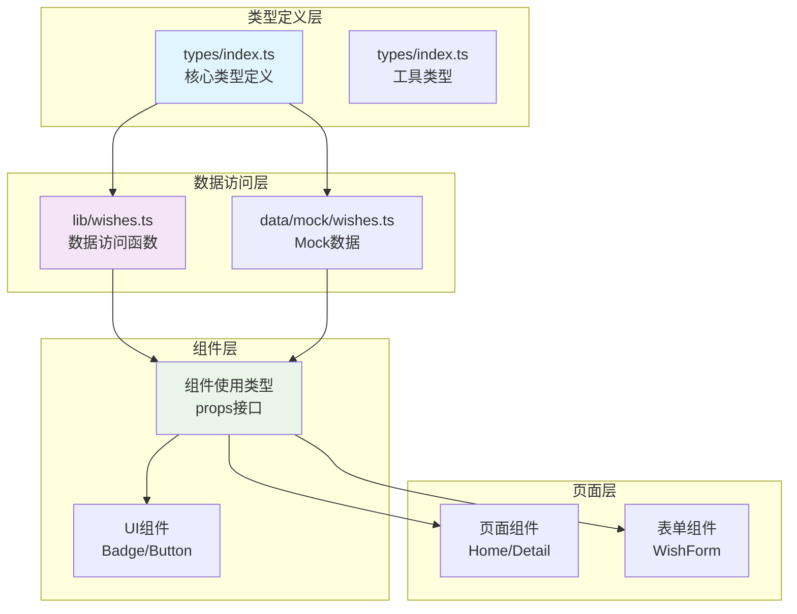
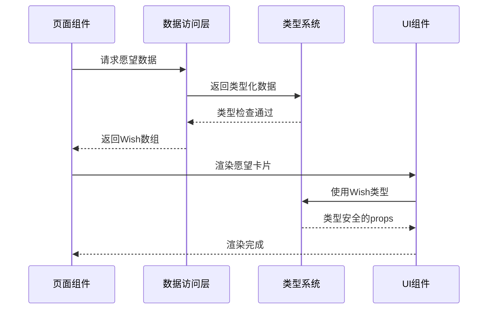
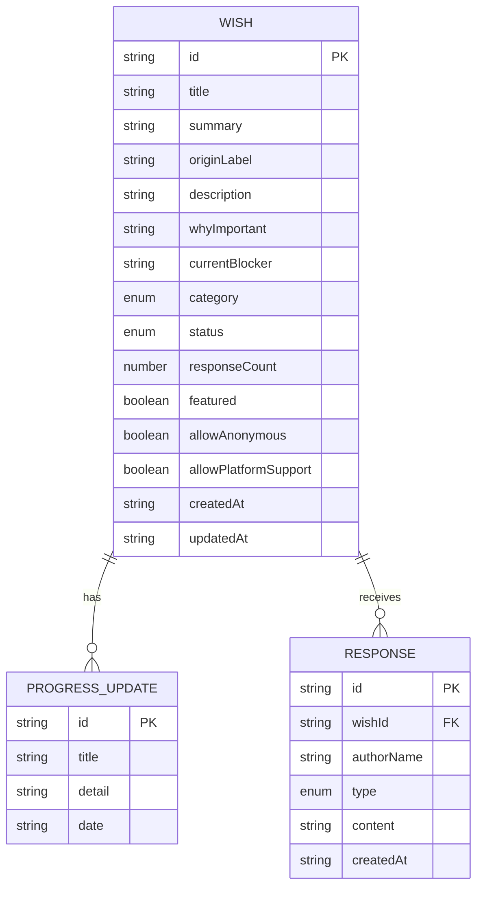
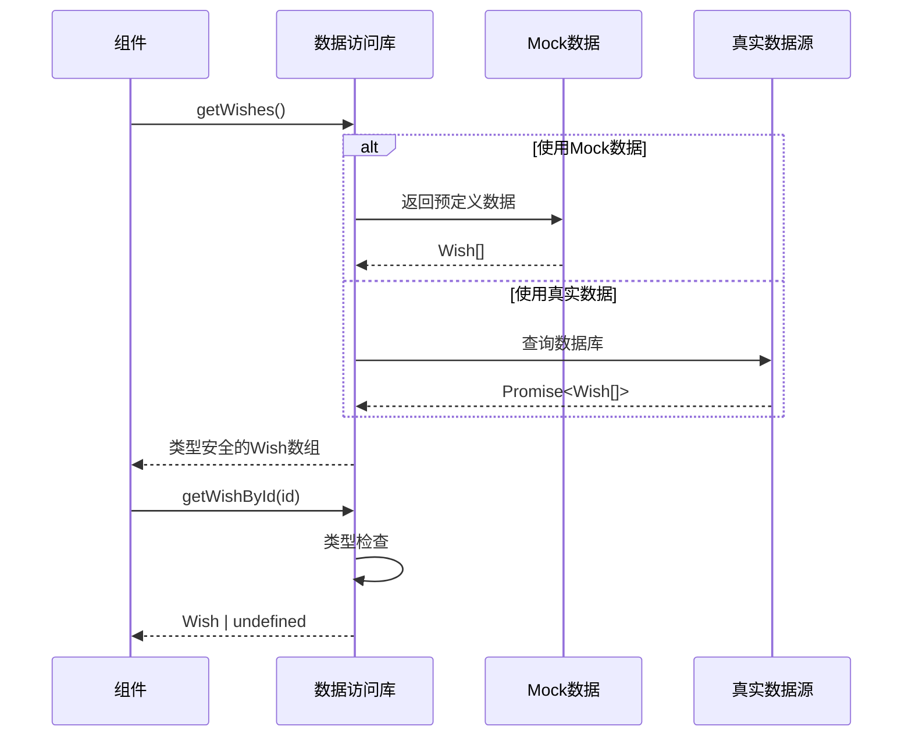

# TypeScript类型系统

<cite>
**本文档引用的文件**
- [types/index.ts](file://types/index.ts)
- [lib/wishes.ts](file://lib/wishes.ts)
- [lib/utils.ts](file://lib/utils.ts)
- [data/mock/wishes.ts](file://data/mock/wishes.ts)
- [components/wish/wish-card.tsx](file://components/wish/wish-card.tsx)
- [components/response/response-card.tsx](file://components/response/response-card.tsx)
- [components/wish/progress-timeline.tsx](file://components/wish/progress-timeline.tsx)
- [components/wish/wish-status-badge.tsx](file://components/wish/wish-status-badge.tsx)
- [components/wish/wish-form.tsx](file://components/wish/wish-form.tsx)
- [components/ui/badge.tsx](file://components/ui/badge.tsx)
- [components/ui/button.tsx](file://components/ui/button.tsx)
- [app/page.tsx](file://app/page.tsx)
- [app/wishes/[id]/page.tsx](file://app/wishes/[id]/page.tsx)
</cite>

## 目录
1. [简介](#简介)
2. [项目结构](#项目结构)
3. [核心类型定义](#核心类型定义)
4. [架构设计](#架构设计)
5. [类型系统详解](#类型系统详解)
6. [类型使用最佳实践](#类型使用最佳实践)
7. [数据访问层协作机制](#数据访问层协作机制)
8. [类型使用示例](#类型使用示例)
9. [常见问题与解决方案](#常见问题与解决方案)
10. [性能考虑](#性能考虑)
11. [故障排除指南](#故障排除指南)
12. [结论](#结论)

## 简介

「梦的平台 / 愿望被回应的平台」是一个基于 Next.js 构建的社区响应平台，旨在帮助用户发布和回应各种生活愿望。本项目采用严格的 TypeScript 类型系统来确保数据的一致性和完整性，通过精心设计的类型定义来约束数据结构，防止运行时错误，并提供更好的开发体验。

该项目的核心目标是：
- 提供清晰的数据模型定义
- 确保类型安全的数据流转
- 支持 Mock 数据和真实数据库的无缝切换
- 通过类型推导提升开发效率

### 类型系统与 PRD 对齐说明

当前类型定义与 PRD 之间存在以下差异，需在后续迭代中对齐：

**WishStatus 枚举**
- 代码当前：`open | clarifying | in_progress | supported | completed`
- PRD 定义：`open | responded | curated | in_progress | realized`
- PRD 的状态流转更清晰：`open → responded → curated → in_progress → realized`
- 自动化规则：首条回应后自动从 `open` 升级为 `responded`，其余状态由运营手动控制

**ResponseType 枚举**
- 代码当前：6 种（Advice/Resource/Introduction/Opportunity/Support/Similar Experience）
- PRD 定义：8 种（新增 `direct_help` / `sponsor`）

**Response 接口缺失字段**
- PRD 要求 `is_public: boolean`（是否公开，默认 true）
- PRD 要求 `available_for_followup: boolean`（是否接受后续联系，默认 false）

**Wish 接口差异**
- 代码缺少 `raw_input` 字段（用户原始输入，用于 AI 结构化的输入源）
- 代码缺少 `visibility` 字段（`public | anonymous`，控制公开/匿名发布）
- 字段命名风格差异：代码用驼峰（`whyImportant`），PRD 用蛇形（`why_it_matters`）

## 项目结构

项目采用模块化的文件组织方式，类型定义集中在`types/index.ts`中，业务逻辑分布在不同的模块中：

```mermaid
graph TB
subgraph "类型定义层"
T1[types/index.ts<br/>核心类型定义]
end
subgraph "数据访问层"
D1[lib/wishes.ts<br/>数据访问函数]
D2[data/mock/wishes.ts<br/>Mock数据]
end
subgraph "组件层"
C1[components/wish/*<br/>愿望相关组件]
C2[components/response/*<br/>回应相关组件]
C3[components/ui/*<br/>通用UI组件]
end
subgraph "页面层"
P1[app/page.tsx<br/>首页]
P2[app/wishes/[id]/page.tsx<br/>详情页]
end
T1 --> D1
T1 --> D2
D1 --> C1
D1 --> C2
D2 --> C1
D2 --> C2
C1 --> P1
C2 --> P2
```

**图表来源**
- [types/index.ts:1-58](file://types/index.ts#L1-L58)
- [lib/wishes.ts:1-27](file://lib/wishes.ts#L1-L27)
- [data/mock/wishes.ts:1-210](file://data/mock/wishes.ts#L1-L210)

**章节来源**
- [types/index.ts:1-58](file://types/index.ts#L1-L58)
- [lib/wishes.ts:1-27](file://lib/wishes.ts#L1-L27)
- [data/mock/wishes.ts:1-210](file://data/mock/wishes.ts#L1-L210)

## 核心类型定义

### 类型系统概览

项目的核心类型系统由以下关键类型组成：

```mermaid
classDiagram
class WishStatus {
<<union type>>
"open"
"clarifying"
"in_progress"
"supported"
"completed"
}
class ResponseType {
<<union type>>
"Advice"
"Resource"
"Introduction"
"Opportunity"
"Support"
"Similar Experience"
}
class WishCategory {
<<union type>>
"Life"
"Creative"
"Learning"
"Career"
"Community"
}
class ProgressUpdate {
+string id
+string title
+string detail
+string date
}
class Wish {
+string id
+string title
+string summary
+string originLabel?
+string description
+string whyImportant
+string currentBlocker
+ResponseType[] desiredResponseTypes
+WishCategory category
+WishStatus status
+number responseCount
+boolean featured
+boolean allowAnonymous
+boolean allowPlatformSupport
+string createdAt
+string updatedAt
+ProgressUpdate[] progressUpdates
}
class Response {
+string id
+string wishId
+string authorName
+ResponseType type
+string content
+string createdAt
}
Wish --> ProgressUpdate : "包含"
Response --> Wish : "关联"
```

**图表来源**
- [types/index.ts:1-58](file://types/index.ts#L1-L58)

### 数据模型详细说明

#### WishStatus（愿望状态）
定义了愿望生命周期中的五个状态：
- `open`: 等待回应状态
- `clarifying`: 整理中状态  
- `in_progress`: 推进中状态
- `supported`: 已连接帮助状态
- `completed`: 已发生状态

#### ResponseType（回应类型）
定义了六种不同类型的回应：
- `Advice`: 建议类回应
- `Resource`: 资源类回应
- `Introduction`: 介绍类回应
- `Opportunity`: 机会类回应
- `Support`: 支持类回应
- `Similar Experience`: 相似经历类回应

#### WishCategory（愿望分类）
定义了五个愿望类别：
- `Life`: 生活类
- `Creative`: 创作类
- `Learning`: 学习类
- `Career`: 职业类
- `Community`: 社区类

#### ProgressUpdate（进度更新）
用于记录愿望推进过程中的关键节点：
- `id`: 更新标识符
- `title`: 更新标题
- `detail`: 更新详情
- `date`: 更新日期

#### Wish（愿望主体）
核心数据模型，包含愿望的所有属性：
- 基本信息：`id`, `title`, `summary`, `description`
- 重要性说明：`whyImportant`, `currentBlocker`
- 响应偏好：`desiredResponseTypes`, `category`
- 状态管理：`status`, `responseCount`, `featured`
- 平台设置：`allowAnonymous`, `allowPlatformSupport`
- 时间戳：`createdAt`, `updatedAt`
- 进度追踪：`progressUpdates`

#### Response（回应）
回应数据模型：
- 关联信息：`wishId`, `authorName`
- 回应类型：`type`
- 内容：`content`
- 时间戳：`createdAt`

**章节来源**
- [types/index.ts:1-58](file://types/index.ts#L1-L58)

## 架构设计

### 类型系统架构



**图表来源**
- [types/index.ts:1-58](file://types/index.ts#L1-L58)
- [lib/wishes.ts:1-27](file://lib/wishes.ts#L1-L27)
- [data/mock/wishes.ts:1-210](file://data/mock/wishes.ts#L1-L210)

### 数据流架构



**图表来源**
- [lib/wishes.ts:5-26](file://lib/wishes.ts#L5-L26)
- [components/wish/wish-card.tsx:7-13](file://components/wish/wish-card.tsx#L7-L13)

**章节来源**
- [lib/wishes.ts:1-27](file://lib/wishes.ts#L1-L27)
- [components/wish/wish-card.tsx:1-93](file://components/wish/wish-card.tsx#L1-L93)

## 类型系统详解

### 类型约束与验证规则

#### 字段约束分析

| 字段名 | 类型 | 必填 | 约束 | 验证规则 |
|--------|------|------|------|----------|
| `id` | `string` | 必填 | 唯一标识符 | UUID格式，全局唯一 |
| `title` | `string` | 必填 | 标题文本 | 长度限制，UTF-8编码 |
| `summary` | `string` | 必填 | 摘要描述 | 长度限制，简洁明了 |
| `originLabel` | `string?` | 可选 | 来源标签 | 可为空字符串 |
| `description` | `string` | 必填 | 详细描述 | 结构化文本，换行支持 |
| `whyImportant` | `string` | 必填 | 重要性说明 | 逻辑连贯，情感真挚 |
| `currentBlocker` | `string` | 必填 | 当前障碍 | 具体明确，可解决性 |
| `desiredResponseTypes` | `ResponseType[]` | 必填 | 希望的回应类型 | 数组非空，类型有效 |
| `category` | `WishCategory` | 必填 | 愿望分类 | 枚举值之一 |
| `status` | `WishStatus` | 必填 | 愿望状态 | 枚举值之一，语义正确 |
| `responseCount` | `number` | 必填 | 回应回复数 | 非负整数，递增 |
| `featured` | `boolean` | 必填 | 是否精选 | 布尔值，影响排序 |
| `allowAnonymous` | `boolean` | 必填 | 是否允许匿名 | 布尔值，隐私设置 |
| `allowPlatformSupport` | `boolean` | 必填 | 是否允许平台支持 | 布尔值，服务设置 |
| `createdAt` | `string` | 必填 | 创建时间 | ISO 8601格式 |
| `updatedAt` | `string` | 必填 | 更新时间 | ISO 8601格式 |
| `progressUpdates` | `ProgressUpdate[]` | 必填 | 进度更新列表 | 数组，可为空 |

#### 类型安全保证机制

1. **编译时类型检查**：所有类型定义在编译时进行严格检查
2. **运行时数据验证**：通过TypeScript的类型守卫确保数据完整性
3. **接口契约约束**：组件间通过明确的接口契约传递数据
4. **泛型类型推导**：利用TypeScript的类型推导减少重复声明

### 类型关系图



**图表来源**
- [types/index.ts:30-57](file://types/index.ts#L30-L57)

**章节来源**
- [types/index.ts:1-58](file://types/index.ts#L1-L58)

## 类型使用最佳实践

### 接口设计原则

#### 组件Props接口设计

```typescript
// 推荐：明确的Props接口
interface WishCardProps {
  wish: Wish;
  variant?: "default" | "featured";
  className?: string;
}

// 推荐：可选属性使用问号标记
interface ResponseCardProps {
  response: Response;
  showAuthor?: boolean;
}

// 不推荐：any类型滥用
interface BadExampleProps {
  data: any;
}
```

#### 泛型应用技巧

```typescript
// 使用泛型实现类型安全的数组操作
function getItemsById<T extends { id: string }>(items: T[], id: string): T | undefined {
  return items.find(item => item.id === id);
}

// 使用映射类型创建派生类型
type PartialWish = Partial<Wish>;
type RequiredWish = Required<Wish>;
type PickWish = Pick<Wish, 'id' | 'title' | 'status'>;
```

#### 类型推导优化

```typescript
// 利用TypeScript的类型推导减少显式声明
const wish: Wish = {
  id: "test-id",
  title: "测试愿望",
  summary: "测试摘要",
  description: "测试描述",
  whyImportant: "测试重要性",
  currentBlocker: "测试障碍",
  desiredResponseTypes: ["Advice"],
  category: "Life",
  status: "open",
  responseCount: 0,
  featured: false,
  allowAnonymous: true,
  allowPlatformSupport: true,
  createdAt: "2026-01-01T00:00:00Z",
  updatedAt: "2026-01-01T00:00:00Z",
  progressUpdates: []
};

// 使用typeof获取变量类型
const wishFromAPI = await fetchWishData();
type WishFromAPI = typeof wishFromAPI; // 自动推导类型
```

### 类型安全的数据处理

#### 数据访问函数的类型安全

```typescript
// 类型安全的数据访问函数
export function getWishById(id: string): Wish | undefined {
  return wishes.find((wish) => wish.id === id);
}

// 使用类型守卫确保数据完整性
export function getResponsesByWishId(wishId: string): Response[] {
  const filtered = responses.filter((response) => response.wishId === wishId);
  return filtered.sort(
    (a, b) =>
      new Date(b.createdAt).getTime() - new Date(a.createdAt).getTime(),
  );
}
```

#### 错误处理与类型安全

```typescript
// 使用联合类型处理可能的错误情况
type ApiResponse<T> = {
  success: true;
  data: T;
} | {
  success: false;
  error: string;
};

// 类型安全的错误处理
function safeParseWish(json: string): ApiResponse<Wish> {
  try {
    const parsed = JSON.parse(json);
    // 类型验证逻辑
    if (isValidWish(parsed)) {
      return { success: true, data: parsed };
    }
    return { success: false, error: "Invalid wish data" };
  } catch (error) {
    return { success: false, error: error.message };
  }
}
```

**章节来源**
- [components/wish/wish-card.tsx:9-13](file://components/wish/wish-card.tsx#L9-L13)
- [components/response/response-card.tsx:14-16](file://components/response/response-card.tsx#L14-L16)
- [lib/wishes.ts:5-26](file://lib/wishes.ts#L5-L26)

## 数据访问层协作机制

### Mock数据与真实数据的统一接口



**图表来源**
- [lib/wishes.ts:5-17](file://lib/wishes.ts#L5-L17)
- [data/mock/wishes.ts:12-150](file://data/mock/wishes.ts#L12-L150)

### 数据一致性保证机制

#### 类型驱动的数据验证

```typescript
// 使用TypeScript确保数据结构一致性
const mockWishes: Wish[] = [
  {
    id: "city-breakfast-club",
    title: "想做一个周末早餐俱乐部...",
    summary: "...",
    description: "...",
    whyImportant: "...",
    currentBlocker: "...",
    desiredResponseTypes: ["Advice", "Introduction", "Support"],
    category: "Community",
    status: "in_progress",
    responseCount: 5,
    featured: true,
    allowAnonymous: false,
    allowPlatformSupport: true,
    createdAt: "2026-04-05T10:30:00.000Z",
    updatedAt: "2026-04-20T09:10:00.000Z",
    progressUpdates: [
      {
        id: "progress-1",
        title: "平台协助整理了第一场试运行的范围",
        detail: "...",
        date: "2026-04-12T08:00:00.000Z"
      }
    ]
  }
];

// 编译时检查确保所有必需字段都存在
```

#### 数据转换与类型映射

```typescript
// 将外部数据转换为内部类型
function transformExternalWish(data: ExternalWish): Wish {
  return {
    id: data.id.toString(),
    title: data.title.trim(),
    summary: data.summary.trim(),
    description: data.description.trim(),
    whyImportant: data.whyImportant.trim(),
    currentBlocker: data.currentBlocker.trim(),
    desiredResponseTypes: data.desiredResponseTypes.map(type => 
      transformResponseType(type)
    ),
    category: transformCategory(data.category),
    status: transformStatus(data.status),
    responseCount: Number(data.responseCount),
    featured: Boolean(data.featured),
    allowAnonymous: Boolean(data.allowAnonymous),
    allowPlatformSupport: Boolean(data.allowPlatformSupport),
    createdAt: new Date(data.createdAt).toISOString(),
    updatedAt: new Date(data.updatedAt).toISOString(),
    progressUpdates: data.progressUpdates.map(update => ({
      id: update.id.toString(),
      title: update.title.trim(),
      detail: update.detail.trim(),
      date: new Date(update.date).toISOString()
    }))
  };
}
```

**章节来源**
- [data/mock/wishes.ts:1-210](file://data/mock/wishes.ts#L1-L210)
- [lib/wishes.ts:1-27](file://lib/wishes.ts#L1-L27)

## 类型使用示例

### 组件类型使用示例

#### 愿望卡片组件

```typescript
// 在组件中使用Wish类型
interface WishCardProps {
  wish: Wish;
  variant?: "default" | "featured";
  className?: string;
}

export function WishCard({ wish, variant = "default" }: WishCardProps) {
  return (
    <div>
      <h3>{wish.title}</h3>
      <p>{wish.summary}</p>
      <Badge tone={getCategoryColor(wish.category)}>
        {wish.category}
      </Badge>
      <WishStatusBadge status={wish.status} />
    </div>
  );
}
```

#### 回应卡片组件

```typescript
// 使用Response类型
interface ResponseCardProps {
  response: Response;
}

export function ResponseCard({ response }: ResponseCardProps) {
  return (
    <div>
      <ResponseTypeBadge type={response.type} />
      <p>{response.authorName}</p>
      <p>{formatDate(response.createdAt)}</p>
      <p>{response.content}</p>
    </div>
  );
}
```

#### 进度时间轴组件

```typescript
// 使用ProgressUpdate类型
interface ProgressTimelineProps {
  updates: ProgressUpdate[];
}

export function ProgressTimeline({ updates }: ProgressTimelineProps) {
  return (
    <div>
      {updates.map(update => (
        <div key={update.id}>
          <p>{formatDate(update.date)}</p>
          <h3>{update.title}</h3>
          <p>{update.detail}</p>
        </div>
      ))}
    </div>
  );
}
```

### 页面组件中的类型使用

#### 首页组件

```typescript
export default function HomePage() {
  const featuredWishes = getFeaturedWishes();
  const wishes = getWishes();
  const latestWishes = wishes.filter((wish) => !wish.featured);
  
  return (
    <div>
      <HeroSection wishes={wishes} />
      <FeaturedWishSection wishes={featuredWishes} />
      <WishListSection wishes={latestWishes} />
    </div>
  );
}
```

#### 详情页组件

```typescript
export default async function WishDetailPage({
  params,
}: {
  params: Promise<{ id: string }>;
}) {
  const { id } = await params;
  const wish = getWishById(id);
  
  if (!wish) {
    notFound();
  }
  
  const wishResponses = getResponsesByWishId(wish.id);
  
  return (
    <div>
      <h1>{wish.title}</h1>
      <p>{wish.description}</p>
      <ProgressTimeline updates={wish.progressUpdates} />
      <div>
        {wishResponses.map(response => (
          <ResponseCard key={response.id} response={response} />
        ))}
      </div>
    </div>
  );
}
```

### 表单组件中的类型使用

#### 愿望表单组件

```typescript
export function WishForm() {
  const [selectedTypes, setSelectedTypes] = useState<ResponseType[]>(
    defaultStructured.desiredResponseTypes,
  );
  
  const toggleType = (type: ResponseType) => {
    setSelectedTypes((current) =>
      current.includes(type)
        ? current.filter((item) => item !== type)
        : [...current, type],
    );
  };
  
  return (
    <div>
      <div className="flex flex-wrap gap-3">
        {responseTypes.map((type) => {
          const selected = selectedTypes.includes(type);
          
          return (
            <button
              key={type}
              onClick={() => toggleType(type)}
              className={selected ? "selected" : "normal"}
            >
              {type}
            </button>
          );
        })}
      </div>
    </div>
  );
}
```

**章节来源**
- [components/wish/wish-card.tsx:1-93](file://components/wish/wish-card.tsx#L1-L93)
- [components/response/response-card.tsx:1-48](file://components/response/response-card.tsx#L1-L48)
- [components/wish/progress-timeline.tsx:1-76](file://components/wish/progress-timeline.tsx#L1-L76)
- [app/page.tsx:1-29](file://app/page.tsx#L1-L29)
- [app/wishes/[id]/page.tsx:1-37](file://app/wishes/[id]/page.tsx#L1-L37)
- [components/wish/wish-form.tsx:1-264](file://components/wish/wish-form.tsx#L1-L264)

## 常见问题与解决方案

### 类型兼容性问题

#### 问题：枚举值不匹配
**现象**：编译时报错，提示枚举值不在预期范围内
**解决方案**：
```typescript
// 确保使用正确的枚举值
const status: WishStatus = "open"; // ✅ 正确
const category: WishCategory = "Life"; // ✅ 正确

// 避免使用不存在的值
// const invalidStatus: WishStatus = "invalid"; // ❌ 编译错误
```

#### 问题：可选属性访问错误
**现象**：访问可能为undefined的属性时报错
**解决方案**：
```typescript
// 使用类型守卫
if (wish.originLabel) {
  console.log(wish.originLabel);
}

// 或使用可选链操作符
console.log(wish.originLabel?.toUpperCase());

// 或使用默认值
const originLabel = wish.originLabel || "未知来源";
```

#### 问题：数组类型不匹配
**现象**：数组元素类型不一致导致编译错误
**解决方案**：
```typescript
// 确保数组元素类型一致
const types: ResponseType[] = ["Advice", "Support", "Opportunity"];

// 使用类型断言时要谨慎
const unsafeTypes = ["Advice", "Support"] as ResponseType[];

// 更安全的做法是使用类型守卫
function isValidResponseType(type: string): type is ResponseType {
  const validTypes = ["Advice", "Resource", "Introduction", "Opportunity", "Support", "Similar Experience"];
  return validTypes.includes(type);
}
```

### 性能优化问题

#### 问题：大量数据渲染性能下降
**现象**：页面渲染缓慢，特别是大量愿望和回应时
**解决方案**：
```typescript
// 使用虚拟滚动
import { FixedSizeList as List } from "react-window";

// 实现分页加载
function usePaginatedWishes(pageSize: number = 20) {
  const [wishes, setWishes] = useState<Wish[]>([]);
  const [page, setPage] = useState(0);
  
  useEffect(() => {
    const startIndex = page * pageSize;
    const endIndex = startIndex + pageSize;
    const paginated = wishes.slice(startIndex, endIndex);
    // 渲染当前页数据
  }, [wishes, page]);
}

// 使用React.memo优化组件渲染
const MemoizedWishCard = memo(WishCard);
```

#### 问题：类型检查编译时间过长
**现象**：TypeScript编译时间过长
**解决方案**：
```typescript
// 启用增量编译
// tsconfig.json
{
  "compilerOptions": {
    "incremental": true,
    "skipLibCheck": true,
    "strictNullChecks": true
  }
}

// 分离类型定义和实现代码
// types/index.ts - 仅包含类型定义
// lib/types.ts - 包含类型实现
```

### 开发体验问题

#### 问题：IDE智能提示不准确
**现象**：VSCode无法正确识别类型信息
**解决方案**：
```typescript
// 确保正确的导入路径
import type { Wish } from "@/types"; // ✅ 导入类型
import { Wish } from "@/types"; // ❌ 导入实现

// 使用精确的类型注解
const wish: Wish = {
  // IDE会提供完整的属性提示
};

// 利用TypeScript的类型推导
const wish = {
  id: "test",
  title: "test",
  // ... 其他属性
}; // TypeScript自动推导为Wish类型
```

#### 问题：类型定义重复
**现象**：多个文件中重复定义相同的类型
**解决方案**：
```typescript
// 将公共类型定义集中到types/index.ts
export type WishStatus = "open" | "clarifying" | "in_progress" | "supported" | "completed";
export type ResponseType = "Advice" | "Resource" | "Introduction" | "Opportunity" | "Support" | "Similar Experience";

// 在其他文件中导入使用
import type { WishStatus, ResponseType } from "@/types";
```

**章节来源**
- [types/index.ts:1-58](file://types/index.ts#L1-L58)
- [components/wish/wish-card.tsx:1-93](file://components/wish/wish-card.tsx#L1-L93)
- [lib/utils.ts:1-12](file://lib/utils.ts#L1-L12)

## 性能考虑

### 类型系统的性能特性

#### 编译时优化
- **静态类型检查**：在编译时发现类型错误，避免运行时错误
- **类型推导**：减少显式类型注解，提高开发效率
- **增量编译**：仅重新编译受影响的文件

#### 运行时性能
- **零运行时开销**：TypeScript类型在编译后被移除
- **内存效率**：类型信息不占用运行时内存
- **打包优化**：TypeScript编译后的JavaScript与普通JS相同

### 性能优化建议

#### 类型设计优化
```typescript
// 使用联合类型替代any
// 不推荐
function processData(data: any) {
  // 处理逻辑
}

// 推荐
type ProcessableData = string | number | boolean;

function processData(data: ProcessableData) {
  switch (typeof data) {
    case "string":
      return data.toUpperCase();
    case "number":
      return data * 2;
    case "boolean":
      return !data;
  }
}
```

#### 组件性能优化
```typescript
// 使用React.memo避免不必要的重渲染
const MemoizedWishCard = memo(({ wish }: { wish: Wish }) => {
  return <div>{wish.title}</div>;
});

// 使用useMemo缓存计算结果
const formattedWishes = useMemo(() => {
  return wishes.map(wish => ({
    ...wish,
    formattedTitle: formatTitle(wish.title)
  }));
}, [wishes]);

// 使用useCallback优化回调函数
const handleWishClick = useCallback((id: string) => {
  router.push(`/wishes/${id}`);
}, []);
```

## 故障排除指南

### 常见编译错误

#### 类型不兼容错误
**错误信息**：`Type 'string' is not assignable to type 'WishStatus'`
**解决方法**：
```typescript
// 确保使用正确的枚举值
const status: WishStatus = "open"; // ✅

// 如果必须从字符串转换，使用类型守卫
function safeParseStatus(str: string): WishStatus {
  const validStatuses: WishStatus[] = ["open", "clarifying", "in_progress", "supported", "completed"];
  return validStatuses.includes(str as WishStatus) ? str as WishStatus : "open";
}
```

#### 属性缺失错误
**错误信息**：`Property 'title' is missing in type '{}' but required in type 'Wish'`
**解决方法**：
```typescript
// 确保所有必需属性都已提供
const wish: Wish = {
  id: "test",
  title: "测试标题",
  summary: "测试摘要",
  description: "测试描述",
  whyImportant: "测试重要性",
  currentBlocker: "测试障碍",
  desiredResponseTypes: ["Advice"],
  category: "Life",
  status: "open",
  responseCount: 0,
  featured: false,
  allowAnonymous: true,
  allowPlatformSupport: true,
  createdAt: "2026-01-01T00:00:00Z",
  updatedAt: "2026-01-01T00:00:00Z",
  progressUpdates: []
};
```

### 运行时调试技巧

#### 类型断言的安全使用
```typescript
// 谨慎使用类型断言
const data = JSON.parse(jsonString);

// 不推荐：无条件断言
const wish = data as Wish;

// 推荐：带验证的断言
function assertIsWish(obj: any): obj is Wish {
  return (
    typeof obj === "object" &&
    obj !== null &&
    typeof obj.id === "string" &&
    typeof obj.title === "string"
  );
}

const wish = assertIsWish(data) ? data : null;
```

#### 开发环境配置
```typescript
// tsconfig.json配置
{
  "compilerOptions": {
    "strict": true,
    "noImplicitAny": true,
    "strictNullChecks": true,
    "strictFunctionTypes": true,
    "forceConsistentCasingInFileNames": true,
    "skipLibCheck": true
  }
}
```

### 调试工具和技巧

#### VSCode配置
```json
{
  "typescript.preferences.importModuleSpecifier": "relative",
  "typescript.preferences.importModuleSpecifierEnding": "js",
  "typescript.suggest.autoImports": true,
  "typescript.suggest.completeFunctionCalls": true,
  "editor.suggest.insertMode": "replace"
}
```

#### 类型检查脚本
```bash
#!/bin/bash
# 检查TypeScript类型
npx tsc --noEmit --skipLibCheck

# 检查类型安全性
npx tsserver --disableAutomaticDiagnosticCreation
```

**章节来源**
- [types/index.ts:1-58](file://types/index.ts#L1-L58)
- [lib/utils.ts:1-12](file://lib/utils.ts#L1-L12)

## 结论

"梦想回应平台"的TypeScript类型系统通过精心设计的数据模型和严格的类型约束，为整个应用提供了坚实的基础。该系统的主要优势包括：

### 核心优势

1. **类型安全**：编译时类型检查确保数据完整性
2. **开发效率**：智能提示和类型推导提升开发体验
3. **维护性**：清晰的类型定义便于代码维护和重构
4. **扩展性**：灵活的类型系统支持功能扩展

### 最佳实践总结

1. **明确的类型定义**：使用联合类型和接口定义清晰的数据结构
2. **类型守卫**：在运行时验证数据类型和结构
3. **组件类型化**：为每个组件定义明确的Props接口
4. **泛型应用**：利用泛型实现类型安全的通用组件
5. **Mock数据集成**：通过类型系统统一Mock数据和真实数据

### 未来改进方向

1. **更严格的类型验证**：引入运行时类型验证库
2. **类型文档生成**：自动生成类型文档
3. **类型测试**：为类型定义编写单元测试
4. **性能监控**：监控类型系统的性能影响

通过持续优化类型系统，"梦想回应平台"能够为用户提供更加稳定、可靠和高效的使用体验，同时为开发者提供更好的开发工具和保障。