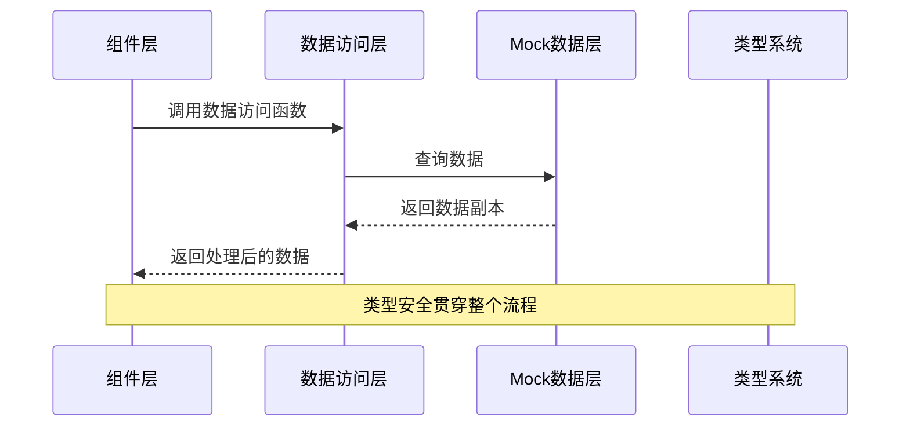
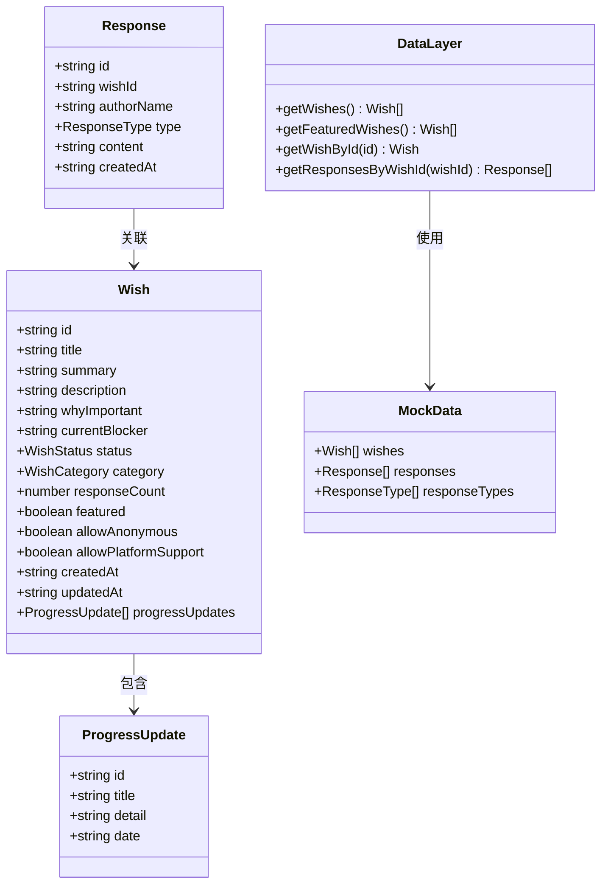
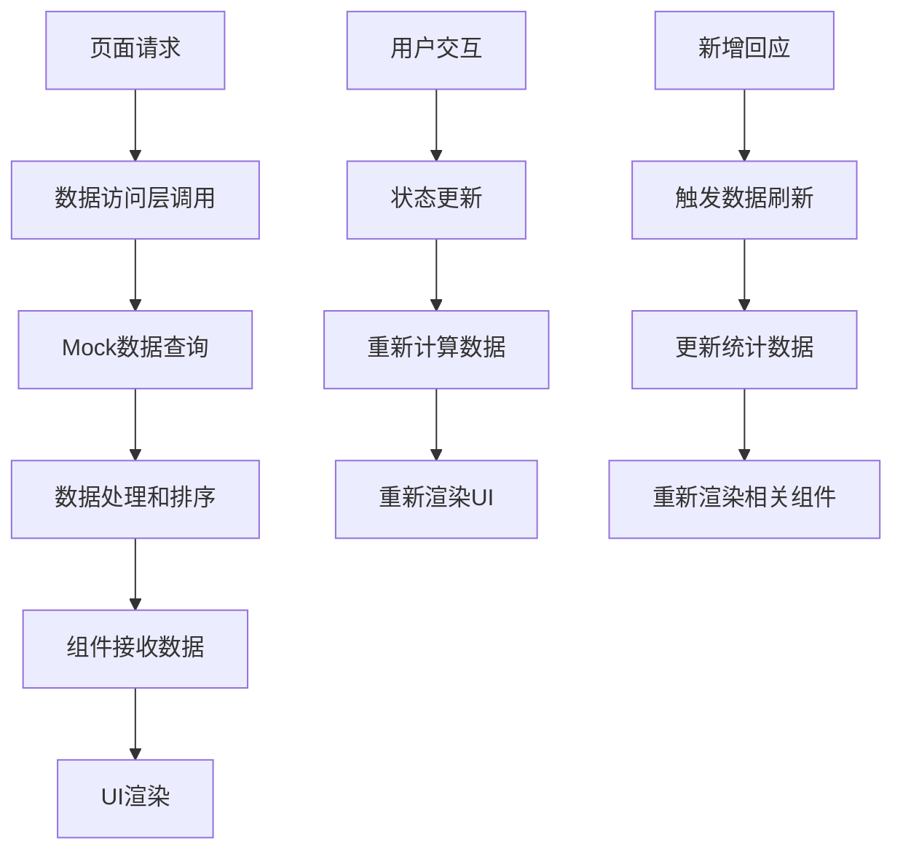
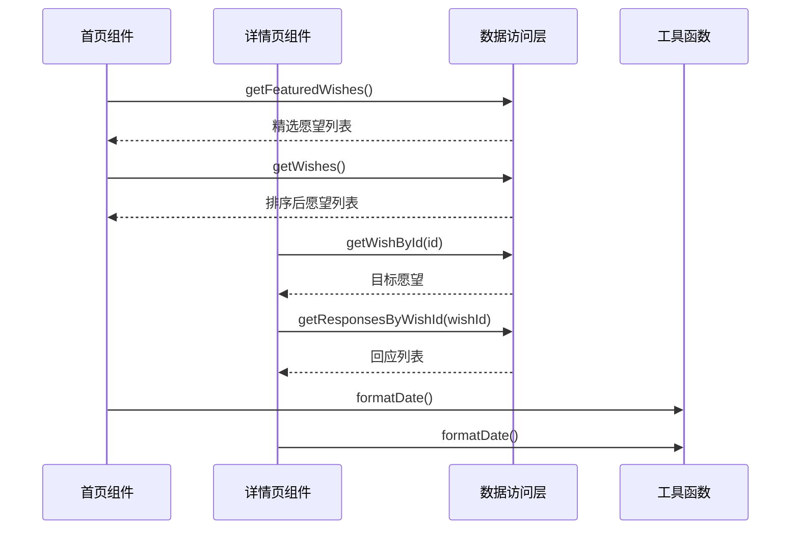
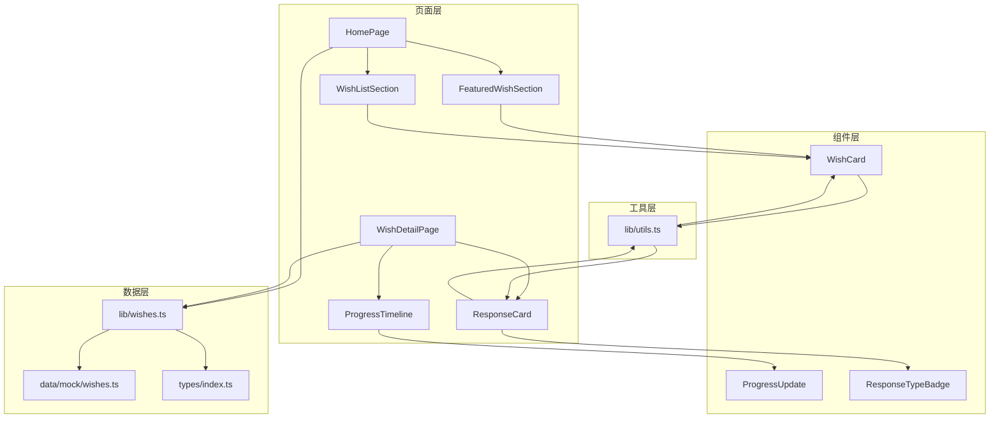
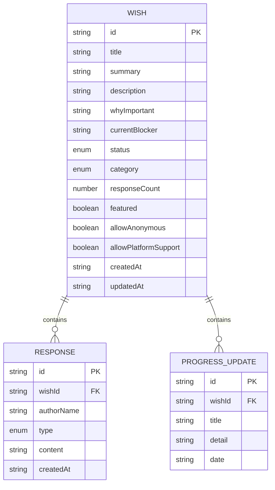

# 数据层设计

<cite>
**本文档引用的文件**
- [lib/wishes.ts](file://lib/wishes.ts)
- [data/mock/wishes.ts](file://data/mock/wishes.ts)
- [types/index.ts](file://types/index.ts)
- [lib/utils.ts](file://lib/utils.ts)
- [app/page.tsx](file://app/page.tsx)
- [app/wishes/[id]/page.tsx](file://app/wishes/[id]/page.tsx)
- [components/wish/wish-list-section.tsx](file://components/wish/wish-list-section.tsx)
- [components/wish/wish-card.tsx](file://components/wish/wish-card.tsx)
- [components/wish/featured-wish-section.tsx](file://components/wish/featured-wish-section.tsx)
- [components/response/response-card.tsx](file://components/response/response-card.tsx)
- [package.json](file://package.json)
</cite>

## 目录
1. [简介](#简介)
2. [项目结构](#项目结构)
3. [核心组件](#核心组件)
4. [架构概览](#架构概览)
5. [详细组件分析](#详细组件分析)
6. [依赖关系分析](#依赖关系分析)
7. [性能考虑](#性能考虑)
8. [故障排除指南](#故障排除指南)
9. [结论](#结论)
10. [附录](#附录)

## 简介

「梦的平台」是一个基于 Next.js 构建的全栈应用，专注于为用户提供一个温暖、真实的愿望回应社区。本项目采用 TypeScript 进行强类型开发，通过精心设计的数据层架构实现了 Mock 数据驱动的开发模式，为后续迁移到 Supabase 真实数据库奠定了坚实基础。

该数据层设计的核心目标是在保持组件独立性的同时，提供灵活的数据访问接口，使得 Mock 数据与真实数据库之间的切换无需修改业务逻辑代码。通过 lib/wishes.ts 中的数据访问层封装，以及 data/mock/wishes.ts 中的模拟数据系统，项目实现了完整的数据流管理机制。

### 数据模型与 PRD 对齐说明

当前代码实现与 PRD 定义之间存在以下差异，需在后续迭代中对齐：

#### WishStatus 枚举差异

| 代码当前值 | PRD 定义值 | 含义 |
|-----------|-----------|------|
| `open` | `open` | 已发布，暂无有效回应 |
| `clarifying` | `responded` | 代码：整理中 / PRD：已有有效回应 |
| `in_progress` | `curated` | 代码：推进中 / PRD：被平台精选 |
| `supported` | `in_progress` | 代码：已连接帮助 / PRD：平台正在推进 |
| `completed` | `realized` | 代码：已发生 / PRD：阶段性实现 |

PRD 的状态流转链路更清晰：`open → responded → curated → in_progress → realized`

#### ResponseType 差异
- 代码当前：6 种（Advice/Resource/Introduction/Opportunity/Support/Similar Experience）
- PRD 定义：8 种（新增 `direct_help`（我可以直接帮）、`sponsor`（愿意提供资源支持））

#### Response 字段差异
PRD 定义了更多字段：
- `is_public`（是否公开，默认 true）
- `available_for_followup`（是否接受后续联系，默认 false）
- 当前代码的 Response 接口缺少这两个字段

#### Wish 字段差异
PRD 使用 `raw_input` / `structured_story` / `why_it_matters` / `current_blocker`（蛇形命名），代码使用 `description` / `whyImportant` / `currentBlocker`（驼峰命名），且代码缺少 `raw_input` / `visibility` 字段。

## 项目结构

项目采用模块化组织方式，数据层相关文件分布如下：

```mermaid
graph TB
subgraph "数据层架构"
A[lib/wishes.ts<br/>数据访问层] --> B[data/mock/wishes.ts<br/>Mock数据]
C[types/index.ts<br/>类型定义] --> A
D[lib/utils.ts<br/>工具函数] --> E[组件层]
E --> F[app/page.tsx<br/>首页]
E --> G[app/wishes/[id]/page.tsx<br/>详情页]
E --> H[组件库]
end
subgraph "组件层"
I[WishCard] --> J[WishListSection]
K[ResponseCard] --> L[Response Type Badge]
M[FeaturedWishSection] --> I
end
subgraph "类型系统"
N[Wish] --> O[Response]
P[ProgressUpdate] --> N
Q[ResponseType] --> O
end
```

**图表来源**
- [lib/wishes.ts:1-27](file://lib/wishes.ts#L1-L27)
- [data/mock/wishes.ts:1-210](file://data/mock/wishes.ts#L1-L210)
- [types/index.ts:1-58](file://types/index.ts#L1-L58)

**章节来源**
- [lib/wishes.ts:1-27](file://lib/wishes.ts#L1-L27)
- [data/mock/wishes.ts:1-210](file://data/mock/wishes.ts#L1-L210)
- [types/index.ts:1-58](file://types/index.ts#L1-L58)

## 核心组件

### 数据访问层（lib/wishes.ts）

数据访问层是整个数据系统的核心抽象，通过薄层封装实现了Mock数据与真实数据库的解耦：

- **getWishes()**: 获取所有愿望列表，按updatedAt降序排序
- **getFeaturedWishes()**: 获取精选愿望，基于getWishes()过滤featured标记
- **getWishById(id)**: 根据ID精确查找愿望
- **getResponsesByWishId(wishId)**: 获取指定愿望的所有回应，按createdAt降序排序

每个函数都返回数据副本，确保数据不可变性和安全性。

### Mock数据系统（data/mock/wishes.ts）

Mock数据系统提供了完整的测试和演示环境，包含：

- **响应类型定义**: ResponseType枚举，涵盖Advice、Resource、Introduction、Opportunity、Support、Similar Experience六种类型
- **愿望数据**: 五个精心设计的真实场景示例，涵盖Life、Creative、Learning、Career、Community五大类别
- **回应数据**: 七条高质量的回应内容，展示不同类型的帮助价值

### 类型定义系统（types/index.ts）

项目采用严格的TypeScript类型系统：

- **WishStatus**: 四种状态枚举（open、clarifying、in_progress、supported、completed）
- **WishCategory**: 五种类别枚举（Life、Creative、Learning、Career、Community）
- **Wish接口**: 完整的愿望数据结构，包含基本信息、状态管理、统计信息等
- **Response接口**: 回应数据结构，关联到具体愿望
- **ProgressUpdate接口**: 进展更新结构，用于记录项目推进过程

**章节来源**
- [lib/wishes.ts:3-27](file://lib/wishes.ts#L3-L27)
- [data/mock/wishes.ts:1-210](file://data/mock/wishes.ts#L1-L210)
- [types/index.ts:1-58](file://types/index.ts#L1-L58)

## 架构概览

数据层采用分层架构设计，实现了清晰的关注点分离：



**图表来源**
- [lib/wishes.ts:5-26](file://lib/wishes.ts#L5-L26)
- [data/mock/wishes.ts:12-150](file://data/mock/wishes.ts#L12-L150)
- [types/index.ts:30-58](file://types/index.ts#L30-L58)

架构特点：
- **抽象层隔离**: 数据访问层与数据存储层完全解耦
- **类型安全保障**: 全流程TypeScript类型检查
- **数据不可变性**: 所有查询返回数据副本
- **扩展性设计**: 易于替换为真实数据库实现

## 详细组件分析

### 数据访问层类图



**图表来源**
- [types/index.ts:23-58](file://types/index.ts#L23-L58)
- [lib/wishes.ts:5-26](file://lib/wishes.ts#L5-L26)
- [data/mock/wishes.ts:12-210](file://data/mock/wishes.ts#L12-L210)

### 数据流管理机制

数据从获取到渲染的完整生命周期：



**图表来源**
- [app/page.tsx:6-28](file://app/page.tsx#L6-L28)
- [app/wishes/[id]/page.tsx:19-31](file://app/wishes/[id]/page.tsx#L19-L31)
- [lib/wishes.ts:5-26](file://lib/wishes.ts#L5-L26)

### 组件数据绑定流程



**图表来源**
- [app/page.tsx:4-28](file://app/page.tsx#L4-L28)
- [app/wishes/[id]/page.tsx:25-31](file://app/wishes/[id]/page.tsx#L25-L31)
- [lib/utils.ts:5-10](file://lib/utils.ts#L5-L10)

**章节来源**
- [app/page.tsx:1-29](file://app/page.tsx#L1-L29)
- [app/wishes/[id]/page.tsx:1-184](file://app/wishes/[id]/page.tsx#L1-L184)
- [lib/utils.ts:1-12](file://lib/utils.ts#L1-L12)

## 依赖关系分析

### 组件依赖图



**图表来源**
- [app/page.tsx:1-4](file://app/page.tsx#L1-L4)
- [app/wishes/[id]/page.tsx:3-8](file://app/wishes/[id]/page.tsx#L3-L8)
- [lib/wishes.ts:1](file://lib/wishes.ts#L1)
- [lib/utils.ts:1-3](file://lib/utils.ts#L1-L3)

### 类型依赖关系



**图表来源**
- [types/index.ts:30-58](file://types/index.ts#L30-L58)

**章节来源**
- [package.json:11-27](file://package.json#L11-L27)

## 性能考虑

### 当前实现的性能特征

1. **内存使用**: Mock数据在内存中缓存，避免重复加载
2. **查询效率**: 数组过滤和排序操作在小规模数据集上表现良好
3. **渲染优化**: Next.js的静态生成和客户端路由优化

### 可能的性能瓶颈

1. **数据规模**: 当愿望数量增长时，数组操作可能成为瓶颈
2. **排序复杂度**: updatedAt排序涉及多次日期解析
3. **重复计算**: 多个组件可能重复执行相同的过滤操作

### 性能优化建议

1. **索引优化**: 为常用查询字段建立索引
2. **分页加载**: 实现无限滚动和分页机制
3. **缓存策略**: 添加内存缓存和持久化缓存
4. **批量查询**: 减少重复的数据访问调用

## 故障排除指南

### 常见问题及解决方案

1. **数据为空问题**
   - 检查Mock数据是否正确导入
   - 验证数据访问函数的返回值
   - 确认组件的错误边界处理

2. **类型错误**
   - 确保所有数据字段符合类型定义
   - 检查枚举值的有效性
   - 验证可选字段的处理

3. **排序异常**
   - 检查日期字符串格式
   - 确认时间戳的正确性
   - 验证排序算法的稳定性

### 调试技巧

1. **日志记录**: 在数据访问层添加详细的日志输出
2. **单元测试**: 为数据访问函数编写测试用例
3. **类型检查**: 利用TypeScript的编译时检查
4. **性能监控**: 监控数据访问的性能指标

**章节来源**
- [lib/wishes.ts:5-26](file://lib/wishes.ts#L5-L26)
- [types/index.ts:1-58](file://types/index.ts#L1-L58)

## 结论

"梦想回应平台"的数据层设计展现了现代前端应用的最佳实践：

1. **架构清晰**: 分层设计实现了关注点分离
2. **类型安全**: 完整的TypeScript类型系统保障了代码质量
3. **易于扩展**: Mock数据与真实数据库的无缝切换
4. **性能友好**: 合理的数据结构和查询策略

该设计为项目的长期发展奠定了坚实基础，既满足了当前的功能需求，又为未来的功能扩展和技术演进预留了充足的空间。

## 附录

### 数据层扩展指南

#### 从Mock数据迁移到真实数据库

1. **接口适配**
   ```typescript
   // 替换现有的Mock实现
   export async function getWishes() {
     // 数据库查询实现
     return db.query('SELECT * FROM wishes ORDER BY updated_at DESC');
   }
   ```

2. **数据库迁移**
   - 设计数据库表结构
   - 创建迁移脚本
   - 数据导入和验证

3. **缓存策略**
   - 实现Redis缓存
   - 设置合理的过期时间
   - 缓存失效策略

4. **错误处理**
   - 数据库连接错误处理
   - 查询超时处理
   - 降级策略实现

#### 新增数据模型

1. **类型定义**
   ```typescript
   export interface User {
     id: string;
     name: string;
     email: string;
   }
   ```

2. **数据访问层**
   ```typescript
   export function getUserById(id: string) {
     // 实现用户数据查询
   }
   ```

3. **Mock数据**
   ```typescript
   export const users: User[] = [
     // 用户数据
   ];
   ```

#### 性能优化实践

1. **查询优化**
   - 使用索引优化常用查询
   - 实现查询缓存
   - 减少不必要的数据传输

2. **内存管理**
   - 实现数据分页
   - 使用虚拟化技术
   - 及时清理无用数据

3. **并发控制**
   - 实现乐观锁机制
   - 处理并发更新冲突
   - 数据一致性保证