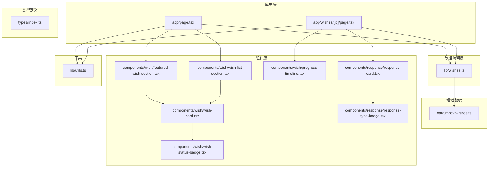
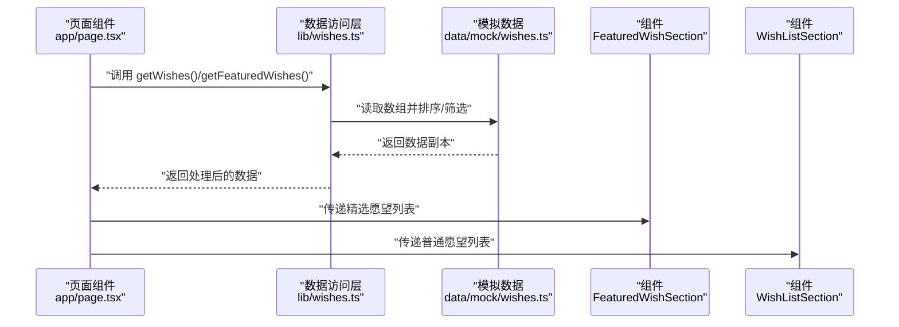
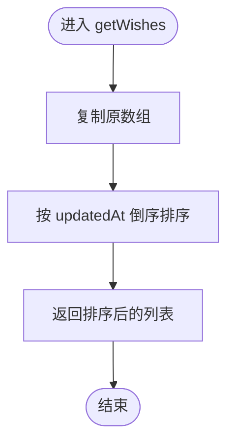
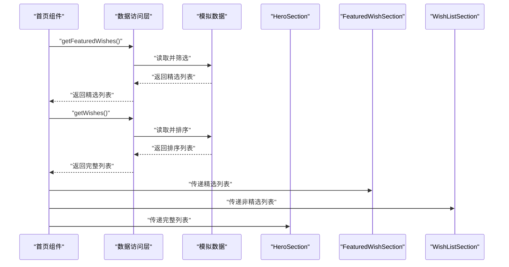
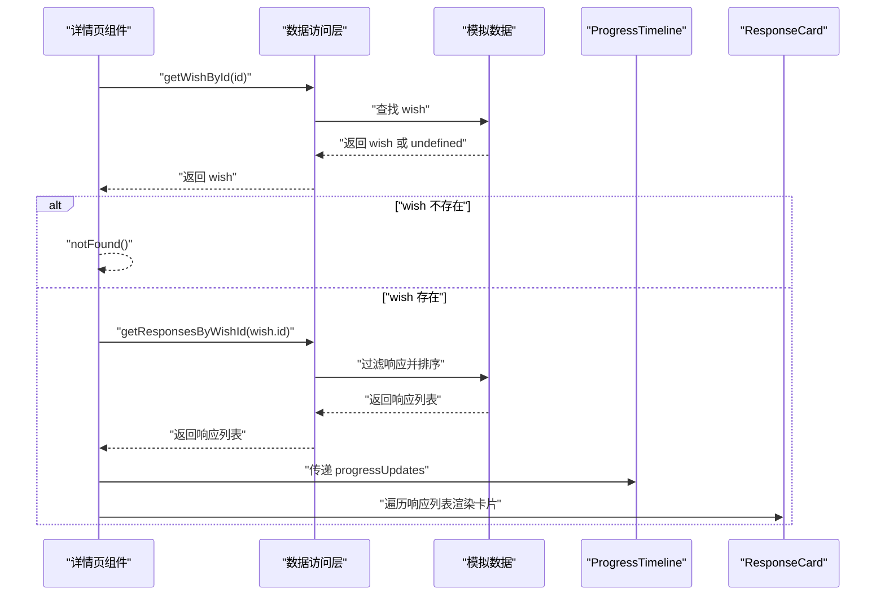
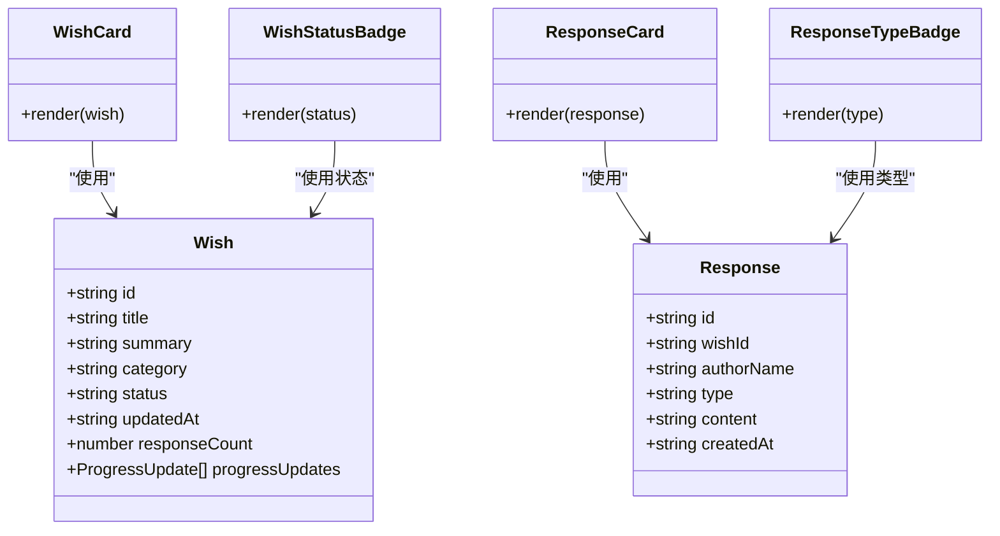
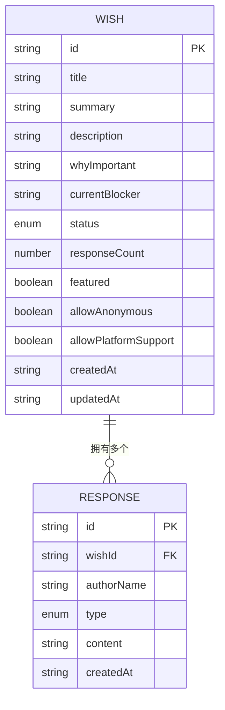
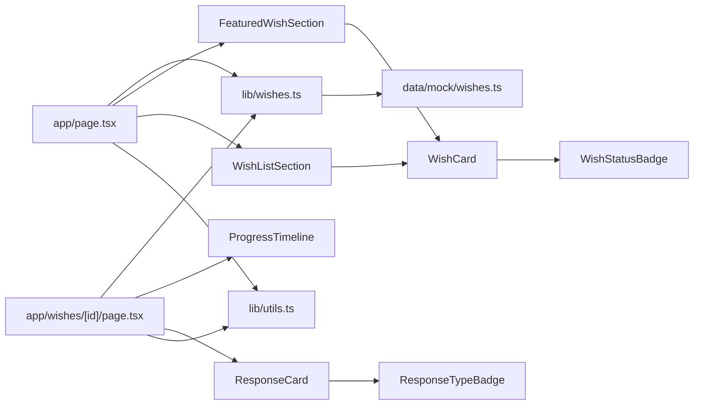

# 数据流管理

<cite>
**本文引用的文件**
- [lib/wishes.ts](file://lib/wishes.ts)
- [lib/utils.ts](file://lib/utils.ts)
- [types/index.ts](file://types/index.ts)
- [app/page.tsx](file://app/page.tsx)
- [app/wishes/[id]/page.tsx](file://app/wishes/[id]/page.tsx)
- [data/mock/wishes.ts](file://data/mock/wishes.ts)
- [components/wish/featured-wish-section.tsx](file://components/wish/featured-wish-section.tsx)
- [components/wish/wish-list-section.tsx](file://components/wish/wish-list-section.tsx)
- [components/wish/wish-card.tsx](file://components/wish/wish-card.tsx)
- [components/wish/progress-timeline.tsx](file://components/wish/progress-timeline.tsx)
- [components/response/response-card.tsx](file://components/response/response-card.tsx)
- [components/response/response-type-badge.tsx](file://components/response/response-type-badge.tsx)
- [components/wish/wish-status-badge.tsx](file://components/wish/wish-status-badge.tsx)
- [package.json](file://package.json)
- [next.config.ts](file://next.config.ts)
</cite>

## 目录
1. [简介](#简介)
2. [项目结构](#项目结构)
3. [核心组件](#核心组件)
4. [架构总览](#架构总览)
5. [详细组件分析](#详细组件分析)
6. [依赖关系分析](#依赖关系分析)
7. [性能考量](#性能考量)
8. [故障排查指南](#故障排查指南)
9. [结论](#结论)
10. [附录](#附录)

## 简介
本文件面向“梦想回应平台”的数据流管理，系统性梳理从数据获取、处理到组件渲染的完整数据生命周期。文档覆盖以下要点：
- 数据访问层调用与数据转换处理
- 组件状态更新与单向数据流
- 缓存策略与性能优化（预加载、懒加载、增量更新）
- 调试与监控方法
- 最佳实践与常见陷阱
- 实际应用示例与代码片段路径

## 项目结构
该仓库采用按功能分层的组织方式：
- 应用入口与页面：app 目录下的页面组件负责数据拉取与传递
- 数据访问层：lib/wishes.ts 提供统一的数据访问接口，屏蔽底层数据源差异
- 类型定义：types/index.ts 明确定义 Wish、Response 及其枚举类型
- 模拟数据：data/mock/wishes.ts 提供本地开发与演示所需的数据
- 组件层：components 下的各功能组件负责渲染与交互
- 工具函数：lib/utils.ts 提供通用工具（类名拼接、日期格式化）

图表来源
- [app/page.tsx:1-29](file://app/page.tsx#L1-L29)
- [app/wishes/[id]/page.tsx:1-184](file://app/wishes/[id]/page.tsx#L1-L184)
- [lib/wishes.ts:1-27](file://lib/wishes.ts#L1-L27)
- [data/mock/wishes.ts:1-210](file://data/mock/wishes.ts#L1-L210)
- [components/wish/featured-wish-section.tsx:1-47](file://components/wish/featured-wish-section.tsx#L1-L47)
- [components/wish/wish-list-section.tsx:1-77](file://components/wish/wish-list-section.tsx#L1-L77)
- [components/wish/wish-card.tsx:1-93](file://components/wish/wish-card.tsx#L1-L93)
- [components/wish/progress-timeline.tsx:1-76](file://components/wish/progress-timeline.tsx#L1-L76)
- [components/response/response-card.tsx:1-48](file://components/response/response-card.tsx#L1-L48)
- [components/response/response-type-badge.tsx:1-43](file://components/response/response-type-badge.tsx#L1-L43)
- [components/wish/wish-status-badge.tsx:1-39](file://components/wish/wish-status-badge.tsx#L1-L39)
- [lib/utils.ts:1-12](file://lib/utils.ts#L1-L12)

章节来源
- [app/page.tsx:1-29](file://app/page.tsx#L1-L29)
- [app/wishes/[id]/page.tsx:1-184](file://app/wishes/[id]/page.tsx#L1-L184)
- [lib/wishes.ts:1-27](file://lib/wishes.ts#L1-L27)
- [data/mock/wishes.ts:1-210](file://data/mock/wishes.ts#L1-L210)
- [lib/utils.ts:1-12](file://lib/utils.ts#L1-L12)
- [types/index.ts:1-58](file://types/index.ts#L1-L58)

## 核心组件
- 数据访问层（lib/wishes.ts）：封装数据查询逻辑，提供 getWishes、getFeaturedWishes、getWishById、getResponsesByWishId 等方法，确保组件层无需关心数据来源（当前为本地 mock，未来可替换为数据库或 API）。
- 页面组件（app/page.tsx、app/wishes/[id]/page.tsx）：在服务端或构建期拉取数据，计算派生字段（如等待回声计数），并将数据向下传递给子组件。
- 渲染组件（components/*）：接收 props 并进行展示，部分组件内部进行简单排序或过滤（如响应列表按创建时间倒序）。
- 工具函数（lib/utils.ts）：提供类名合并与日期格式化等通用能力。

章节来源
- [lib/wishes.ts:1-27](file://lib/wishes.ts#L1-L27)
- [app/page.tsx:1-29](file://app/page.tsx#L1-L29)
- [app/wishes/[id]/page.tsx:1-184](file://app/wishes/[id]/page.tsx#L1-L184)
- [lib/utils.ts:1-12](file://lib/utils.ts#L1-L12)

## 架构总览
数据流遵循“自顶向下”的单向数据流原则：
- 页面组件在渲染前拉取数据并计算派生信息
- 数据访问层统一封装数据获取与基础转换
- 组件仅负责展示与少量本地处理（排序、过滤）
- 工具函数提供纯函数式辅助

图表来源
- [app/page.tsx:1-29](file://app/page.tsx#L1-L29)
- [lib/wishes.ts:1-27](file://lib/wishes.ts#L1-L27)
- [data/mock/wishes.ts:1-210](file://data/mock/wishes.ts#L1-L210)
- [components/wish/featured-wish-section.tsx:1-47](file://components/wish/featured-wish-section.tsx#L1-L47)
- [components/wish/wish-list-section.tsx:1-77](file://components/wish/wish-list-section.tsx#L1-L77)

## 详细组件分析

### 数据访问层（lib/wishes.ts）
- 设计目标：将页面层与数据源解耦，便于未来替换为真实后端（如 Supabase）。
- 关键方法：
  - getWishes：对 wish 列表按 updatedAt 倒序排序
  - getFeaturedWishes：基于 getWishes 的结果筛选 featured=true
  - getWishById：按 id 查找 wish
  - getResponsesByWishId：按 wishId 过滤响应并按 createdAt 倒序排序
- 复杂度分析：排序为 O(n log n)，过滤为 O(n)，整体以 O(n log n) 为主
- 错误处理：未显式抛错；若 id 不存在，getWishById 返回 undefined，由调用方决定行为（如详情页通过 notFound 处理）

图表来源
- [lib/wishes.ts:5-9](file://lib/wishes.ts#L5-L9)

章节来源
- [lib/wishes.ts:1-27](file://lib/wishes.ts#L1-L27)

### 首页数据流（app/page.tsx）
- 数据获取：调用 getFeaturedWishes 与 getWishes，计算等待回声数量
- 数据传递：将精选列表与普通列表分别传递给 FeaturedWishSection 与 WishListSection
- 处理逻辑：在组件内进行二次筛选（非精选列表、按状态统计）

图表来源
- [app/page.tsx:1-29](file://app/page.tsx#L1-L29)
- [lib/wishes.ts:1-27](file://lib/wishes.ts#L1-L27)
- [data/mock/wishes.ts:1-210](file://data/mock/wishes.ts#L1-L210)

章节来源
- [app/page.tsx:1-29](file://app/page.tsx#L1-L29)

### 详情页数据流（app/wishes/[id]/page.tsx）
- 静态参数生成：generateStaticParams 基于模拟数据生成静态路由参数
- 数据获取：根据 params.id 获取 wish，不存在则 notFound；随后获取该 wish 的所有响应
- 数据处理：格式化日期、拼装文案提示
- 渲染：将 wish 与响应列表传递给多个子组件（含进度时间轴与响应卡片）

图表来源
- [app/wishes/[id]/page.tsx:13-184](file://app/wishes/[id]/page.tsx#L13-L184)
- [lib/wishes.ts:15-26](file://lib/wishes.ts#L15-L26)
- [data/mock/wishes.ts:1-210](file://data/mock/wishes.ts#L1-L210)

章节来源
- [app/wishes/[id]/page.tsx:1-184](file://app/wishes/[id]/page.tsx#L1-L184)

### 组件渲染链路（WishCard、WishStatusBadge、ResponseCard、ResponseTypeBadge）
- WishCard：接收 wish，渲染标题、摘要、分类、状态、更新时间、回应数或推进节点数
- WishStatusBadge：根据状态映射渲染不同色阶的徽标
- ResponseCard：渲染作者名、日期、内容与帮助价值说明
- ResponseTypeBadge：根据响应类型映射渲染不同样式的徽标

图表来源
- [types/index.ts:30-58](file://types/index.ts#L30-L58)
- [components/wish/wish-card.tsx:1-93](file://components/wish/wish-card.tsx#L1-L93)
- [components/wish/wish-status-badge.tsx:1-39](file://components/wish/wish-status-badge.tsx#L1-L39)
- [components/response/response-card.tsx:1-48](file://components/response/response-card.tsx#L1-L48)
- [components/response/response-type-badge.tsx:1-43](file://components/response/response-type-badge.tsx#L1-L43)

章节来源
- [types/index.ts:1-58](file://types/index.ts#L1-L58)
- [components/wish/wish-card.tsx:1-93](file://components/wish/wish-card.tsx#L1-L93)
- [components/wish/wish-status-badge.tsx:1-39](file://components/wish/wish-status-badge.tsx#L1-L39)
- [components/response/response-card.tsx:1-48](file://components/response/response-card.tsx#L1-L48)
- [components/response/response-type-badge.tsx:1-43](file://components/response/response-type-badge.tsx#L1-L43)

### 数据模型与类型约束
- Wish：包含 id、标题、摘要、描述、为何重要、当前卡点、期望回应类型、分类、状态、回应数、是否置顶、匿名与平台支持开关、创建/更新时间、进度更新等字段
- Response：包含 id、所属 wishId、作者名、类型、内容、创建时间
- 枚举类型：WishStatus、ResponseType、WishCategory

图表来源
- [types/index.ts:30-58](file://types/index.ts#L30-L58)

章节来源
- [types/index.ts:1-58](file://types/index.ts#L1-L58)

## 依赖关系分析
- 页面组件依赖数据访问层与模拟数据
- 组件层依赖类型定义与工具函数
- 数据访问层依赖模拟数据
- 工具函数为纯函数，无副作用

图表来源
- [app/page.tsx:1-29](file://app/page.tsx#L1-L29)
- [app/wishes/[id]/page.tsx:1-184](file://app/wishes/[id]/page.tsx#L1-L184)
- [lib/wishes.ts:1-27](file://lib/wishes.ts#L1-L27)
- [data/mock/wishes.ts:1-210](file://data/mock/wishes.ts#L1-L210)
- [components/wish/featured-wish-section.tsx:1-47](file://components/wish/featured-wish-section.tsx#L1-L47)
- [components/wish/wish-list-section.tsx:1-77](file://components/wish/wish-list-section.tsx#L1-L77)
- [components/wish/wish-card.tsx:1-93](file://components/wish/wish-card.tsx#L1-L93)
- [components/wish/progress-timeline.tsx:1-76](file://components/wish/progress-timeline.tsx#L1-L76)
- [components/response/response-card.tsx:1-48](file://components/response/response-card.tsx#L1-L48)
- [components/response/response-type-badge.tsx:1-43](file://components/response/response-type-badge.tsx#L1-L43)
- [components/wish/wish-status-badge.tsx:1-39](file://components/wish/wish-status-badge.tsx#L1-L39)
- [lib/utils.ts:1-12](file://lib/utils.ts#L1-L12)

章节来源
- [app/page.tsx:1-29](file://app/page.tsx#L1-L29)
- [app/wishes/[id]/page.tsx:1-184](file://app/wishes/[id]/page.tsx#L1-L184)
- [lib/wishes.ts:1-27](file://lib/wishes.ts#L1-L27)
- [data/mock/wishes.ts:1-210](file://data/mock/wishes.ts#L1-L210)
- [lib/utils.ts:1-12](file://lib/utils.ts#L1-L12)

## 性能考量
- 预加载与静态生成
  - 详情页通过 generateStaticParams 生成静态路由参数，有利于提升首屏性能与 SEO
  - 页面组件在构建期或服务端拉取数据，减少客户端渲染压力
- 懒加载与分页
  - 当前 wish 列表为一次性渲染，建议在 wish-list-section 中引入虚拟滚动或分页，避免长列表导致的布局抖动与内存占用
- 增量更新
  - 对于响应列表，可在详情页增加“加载更多”或“实时刷新”按钮，结合本地缓存与时间戳实现增量更新
- 排序与过滤
  - getWishes 与 getResponsesByWishId 已内置排序，避免在组件内重复排序造成不必要的开销
- 缓存策略
  - 本地 mock 数据可作为缓存基线；未来接入后端时，建议在数据访问层加入内存缓存与失效策略（如基于 updatedAt 的缓存 TTL）
- 工具函数
  - lib/utils.ts 的纯函数可复用，减少重复计算

章节来源
- [app/wishes/[id]/page.tsx:13-17](file://app/wishes/[id]/page.tsx#L13-L17)
- [lib/wishes.ts:5-9](file://lib/wishes.ts#L5-L9)
- [lib/wishes.ts:19-26](file://lib/wishes.ts#L19-L26)
- [lib/utils.ts:1-12](file://lib/utils.ts#L1-L12)

## 故障排查指南
- 数据为空或未渲染
  - 检查数据访问层返回值：getWishById 在 id 不存在时返回 undefined，详情页应触发 notFound
  - 检查组件 props 传递：确认父组件已正确传递数据
- 排序异常
  - 确认 updatedAt 字段格式为可解析的时间字符串；getWishes 与 getResponsesByWishId 使用时间戳比较，请确保字段一致性
- 日期显示异常
  - 使用 lib/utils.ts 的 formatDate，确保传入字符串可被 new Date 解析
- 静态参数缺失
  - generateStaticParams 依赖 data/mock/wishes.ts 中的 id 列表，新增 wish 后需同步更新静态参数

章节来源
- [app/wishes/[id]/page.tsx:27-29](file://app/wishes/[id]/page.tsx#L27-L29)
- [lib/wishes.ts:15-17](file://lib/wishes.ts#L15-L17)
- [lib/utils.ts:5-10](file://lib/utils.ts#L5-L10)
- [data/mock/wishes.ts:12-150](file://data/mock/wishes.ts#L12-L150)

## 结论
本项目采用清晰的单向数据流设计：页面组件负责数据拉取与派生计算，数据访问层统一封装数据源，组件层专注渲染与少量本地处理。通过类型定义与工具函数保障一致性与可维护性。未来可在此基础上扩展缓存、懒加载与增量更新机制，进一步提升性能与用户体验。

## 附录
- 代码片段路径示例（用于定位实现）
  - 首页数据拉取与传递：[app/page.tsx:6-25](file://app/page.tsx#L6-L25)
  - 详情页静态参数与数据获取：[app/wishes/[id]/page.tsx:13-31](file://app/wishes/[id]/page.tsx#L13-L31)
  - 数据访问层方法：[lib/wishes.ts:5-26](file://lib/wishes.ts#L5-L26)
  - 响应卡片渲染：[components/response/response-card.tsx:18-45](file://components/response/response-card.tsx#L18-L45)
  - 状态徽标映射：[components/wish/wish-status-badge.tsx:4-28](file://components/wish/wish-status-badge.tsx#L4-L28)
  - 类名合并工具：[lib/utils.ts:1-3](file://lib/utils.ts#L1-L3)
  - 日期格式化工具：[lib/utils.ts:5-10](file://lib/utils.ts#L5-L10)