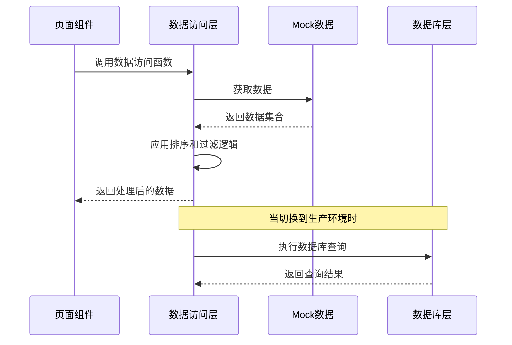
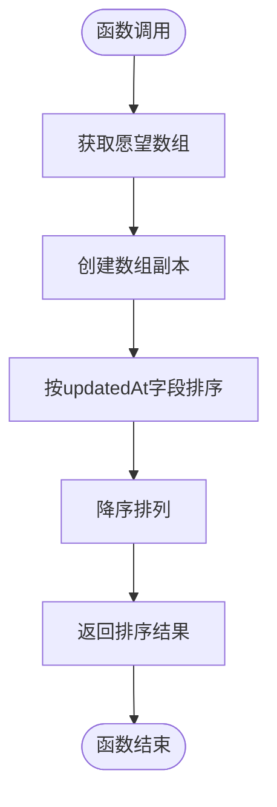
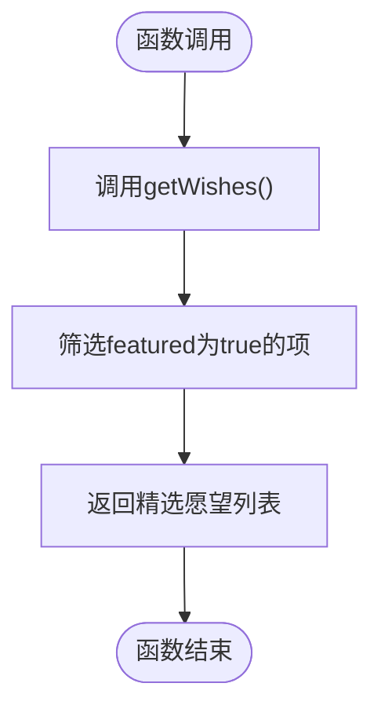
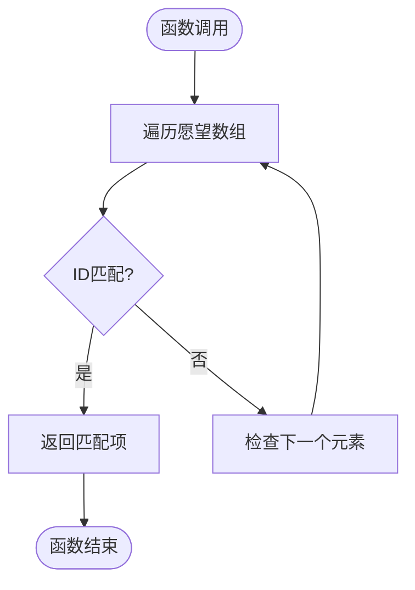
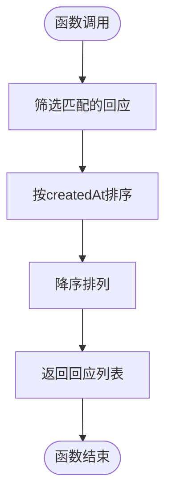
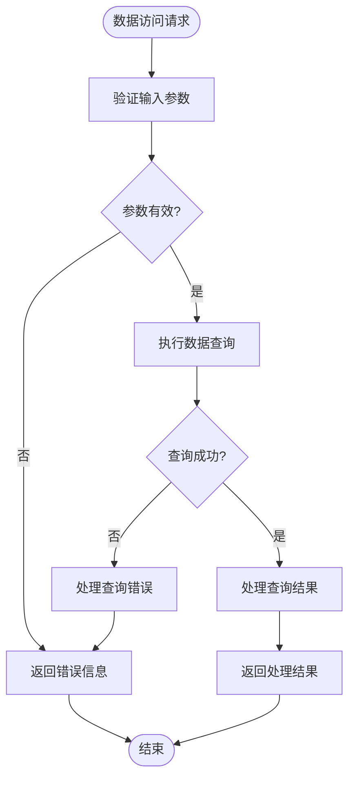

# 数据访问层

<cite>
**本文档引用的文件**
- [lib/wishes.ts](file://lib/wishes.ts)
- [types/index.ts](file://types/index.ts)
- [data/mock/wishes.ts](file://data/mock/wishes.ts)
- [app/page.tsx](file://app/page.tsx)
- [app/wishes/[id]/page.tsx](file://app/wishes/[id]/page.tsx)
- [components/wish/featured-wish-section.tsx](file://components/wish/featured-wish-section.tsx)
- [components/wish/wish-list-section.tsx](file://components/wish/wish-list-section.tsx)
- [components/wish/wish-card.tsx](file://components/wish/wish-card.tsx)
- [components/response/response-card.tsx](file://components/response/response-card.tsx)
</cite>

## 目录
1. [简介](#简介)
2. [项目结构](#项目结构)
3. [核心组件](#核心组件)
4. [架构概览](#架构概览)
5. [详细组件分析](#详细组件分析)
6. [依赖关系分析](#依赖关系分析)
7. [性能考虑](#性能考虑)
8. [故障排除指南](#故障排除指南)
9. [结论](#结论)

## 简介

「梦的平台」的数据访问层采用薄层封装设计，通过 lib/wishes.ts 文件实现了统一的数据访问接口。该层的核心目标是在保持组件独立性的同时，为 Mock 数据和真实数据库之间提供无缝切换能力。数据访问层不仅提供了基础的 CRUD 操作，还包含了数据排序、过滤和查询优化策略，确保了应用的可扩展性和维护性。

### PRD 定义的完整 API/动作清单

当前数据访问层只实现了读取操作，根据 PRD 和开发对接文档，还需要以下能力：

| API | 目的 | 输入 | 输出 | 当前状态 |
|-----|------|------|------|----------|
| `getWishes()` | 获取愿望列表 | 支持过滤：latest/featured/in_progress | Wish[] | ✅ 已实现 |
| `getFeaturedWishes()` | 获取精选愿望 | 无 | Wish[] | ✅ 已实现 |
| `getWishById(id)` | 获取愿望详情 | wish_id | Wish \| undefined | ✅ 已实现 |
| `getResponsesByWishId(wishId)` | 获取愿望回应 | wish_id | Response[] | ✅ 已实现 |
| `createWish()` | 创建新愿望 | raw_input, title, structured_story, why_it_matters, current_blocker, wanted_response_types, visibility, allow_featured | Wish | ❌ 待实现 |
| `createResponse()` | 提交结构化回应 | wish_id, response_type, content, responder_name, is_public, available_for_followup | Response | ❌ 待实现 |
| `refineWish()` | AI 结构化整理 | raw_input | { title, structured_story, why_it_matters, current_blocker, wanted_response_types } | ❌ 待实现（当前为模拟） |
| `updateWishStatus()` | 更新愿望状态 | wish_id, status, featured, progress_note | Wish | ❌ 待实现 |

### 状态流转规则

```
open → responded → curated → in_progress → realized
```

- `open → responded`：当愿望获得至少一条有效回应时自动升级
- `responded → curated`：由运营手动标记为精选
- `curated → in_progress`：运营正式介入推进
- `in_progress → realized`：出现阶段性结果或故事

注意：当前代码中的状态枚举与 PRD 定义存在差异，需对齐。

## 项目结构

数据访问层位于lib目录下，采用模块化设计，每个功能模块都有明确的职责分工：

```mermaid
graph TB
subgraph "数据访问层"
Wishes[lib/wishes.ts]
Utils[lib/utils.ts]
end
subgraph "类型定义"
Types[types/index.ts]
end
subgraph "Mock数据"
MockWishes[data/mock/wishes.ts]
end
subgraph "页面组件"
HomePage[app/page.tsx]
DetailPage[app/wishes/[id]/page.tsx]
end
subgraph "展示组件"
FeaturedSection[components/wish/featured-wish-section.tsx]
WishListSection[components/wish/wish-list-section.tsx]
WishCard[components/wish/wish-card.tsx]
ResponseCard[components/response/response-card.tsx]
end
Wishes --> MockWishes
Wishes --> Types
HomePage --> Wishes
DetailPage --> Wishes
FeaturedSection --> Wishes
WishListSection --> Wishes
WishCard --> Wishes
ResponseCard --> Wishes
```

**图表来源**
- [lib/wishes.ts:1-27](file://lib/wishes.ts#L1-L27)
- [types/index.ts:1-58](file://types/index.ts#L1-L58)
- [data/mock/wishes.ts:1-210](file://data/mock/wishes.ts#L1-L210)

**章节来源**
- [lib/wishes.ts:1-27](file://lib/wishes.ts#L1-L27)
- [types/index.ts:1-58](file://types/index.ts#L1-L58)
- [data/mock/wishes.ts:1-210](file://data/mock/wishes.ts#L1-L210)

## 核心组件

数据访问层的核心由四个主要函数组成，每个函数都针对特定的数据访问需求进行了优化：

### 数据模型定义

系统使用TypeScript接口定义了清晰的数据结构：

- **Wish接口**：定义了愿望的基本属性，包括标识符、标题、描述、状态、分类等
- **Response接口**：定义了回应的基本属性，包括作者信息、回应类型、内容等
- **WishStatus枚举**：定义了愿望的不同状态（open、clarifying、in_progress、supported、completed）
- **ResponseType枚举**：定义了回应的不同类型（Advice、Resource、Introduction、Opportunity、Support、Similar Experience）

**章节来源**
- [types/index.ts:1-58](file://types/index.ts#L1-L58)

## 架构概览

数据访问层采用了分层架构设计，实现了数据源与业务逻辑的分离：



**图表来源**
- [lib/wishes.ts:3-4](file://lib/wishes.ts#L3-L4)
- [lib/wishes.ts:5-26](file://lib/wishes.ts#L5-L26)

## 详细组件分析

### getWishes() - 主要愿望列表获取

该函数负责获取所有愿望并按更新时间进行降序排序：



**图表来源**
- [lib/wishes.ts:5-9](file://lib/wishes.ts#L5-L9)

**实现特点**：
- 使用数组克隆避免修改原始数据
- 采用时间戳比较确保排序准确性
- 支持Promise包装以便异步使用

**章节来源**
- [lib/wishes.ts:5-9](file://lib/wishes.ts#L5-L9)

### getFeaturedWishes() - 精选愿望获取

该函数基于getWishes()的结果进行筛选，专门获取标记为精选的愿望：



**图表来源**
- [lib/wishes.ts:11-13](file://lib/wishes.ts#L11-L13)

**实现特点**：
- 复用getWishes()的排序结果
- 使用filter()方法进行高效筛选
- 保持原有数据结构不变

**章节来源**
- [lib/wishes.ts:11-13](file://lib/wishes.ts#L11-L13)

### getWishById() - 单个愿望获取

该函数根据ID精确查找特定愿望：



**图表来源**
- [lib/wishes.ts:15-17](file://lib/wishes.ts#L15-L17)

**实现特点**：
- 使用find()方法进行精确匹配
- 时间复杂度为O(n)，适合小规模数据集
- 返回undefined时便于null检查

**章节来源**
- [lib/wishes.ts:15-17](file://lib/wishes.ts#L15-L17)

### getResponsesByWishId() - 回应列表获取

该函数获取指定愿望的所有回应，并按创建时间排序：



**图表来源**
- [lib/wishes.ts:19-26](file://lib/wishes.ts#L19-L26)

**实现特点**：
- 先筛选后排序的双重优化策略
- 支持Promise包装便于异步处理
- 统一时间格式处理

**章节来源**
- [lib/wishes.ts:19-26](file://lib/wishes.ts#L19-L26)

## 依赖关系分析

数据访问层的依赖关系体现了清晰的单向依赖原则：

```mermaid
graph LR
subgraph "外部依赖"
Types[类型定义]
MockData[Mock数据]
end
subgraph "数据访问层"
Wishes[lib/wishes.ts]
end
subgraph "业务组件"
HomePage[app/page.tsx]
DetailPage[app/wishes/[id]/page.tsx]
FeaturedSection[components/wish/featured-wish-section.tsx]
WishListSection[components/wish/wish-list-section.tsx]
WishCard[components/wish/wish-card.tsx]
ResponseCard[components/response/response-card.tsx]
end
Types --> Wishes
MockData --> Wishes
Wishes --> HomePage
Wishes --> DetailPage
Wishes --> FeaturedSection
Wishes --> WishListSection
Wishes --> WishCard
Wishes --> ResponseCard
```

**图表来源**
- [lib/wishes.ts:1](file://lib/wishes.ts#L1)
- [types/index.ts:1](file://types/index.ts#L1)
- [data/mock/wishes.ts:1](file://data/mock/wishes.ts#L1)

**章节来源**
- [lib/wishes.ts:1](file://lib/wishes.ts#L1)
- [types/index.ts:1](file://types/index.ts#L1)
- [data/mock/wishes.ts:1](file://data/mock/wishes.ts#L1)

## 性能考虑

### 查询优化策略

1. **索引友好的数据结构**：所有数据操作都在内存中进行，避免了数据库查询开销
2. **延迟加载模式**：只有在需要时才执行数据筛选和排序操作
3. **不可变数据操作**：使用数组克隆避免意外的数据修改

### 内存管理

- **数据复制**：在排序操作中创建数组副本，确保原始数据完整性
- **垃圾回收**：及时释放不再使用的中间变量和临时数组
- **批量操作**：将多个数据操作合并为单次调用

### 可扩展性设计

- **接口抽象**：通过TypeScript接口定义清晰的数据契约
- **模块化组织**：每个数据访问函数职责单一，易于测试和维护
- **配置化参数**：支持灵活的过滤和排序参数配置

## 故障排除指南

### 常见问题及解决方案

1. **数据为空或undefined**
   - 检查数据源是否正确导入
   - 验证ID参数格式是否正确
   - 确认数据类型定义是否匹配

2. **排序结果异常**
   - 验证日期字符串格式是否符合ISO标准
   - 检查时间戳转换是否正确
   - 确认数组克隆操作是否成功

3. **性能问题**
   - 对于大量数据，考虑实现分页机制
   - 优化筛选条件以减少不必要的计算
   - 考虑引入缓存机制

### 错误处理最佳实践



**图表来源**
- [lib/wishes.ts:15-17](file://lib/wishes.ts#L15-L17)

## 结论

梦想回应平台的数据访问层通过精心设计的薄层封装，成功实现了Mock数据与真实数据库的无缝切换。该层不仅提供了清晰的数据访问接口，还通过合理的排序、过滤和查询优化策略，确保了系统的高性能和可维护性。

### 设计优势

1. **抽象层次清晰**：数据访问层与业务逻辑完全分离
2. **可扩展性强**：易于添加新的数据源和查询类型
3. **性能优化到位**：通过内存操作和延迟加载提升响应速度
4. **类型安全**：完整的TypeScript类型定义确保编译时检查

### 未来改进方向

1. **引入缓存机制**：对于频繁访问的数据实现内存缓存
2. **实现分页查询**：支持大数据集的分页浏览
3. **添加查询日志**：便于调试和性能监控
4. **增强错误处理**：提供更详细的错误信息和恢复策略

该数据访问层为整个梦想回应平台奠定了坚实的技术基础，为未来的功能扩展和性能优化提供了良好的架构支撑。