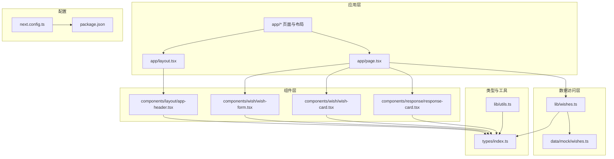
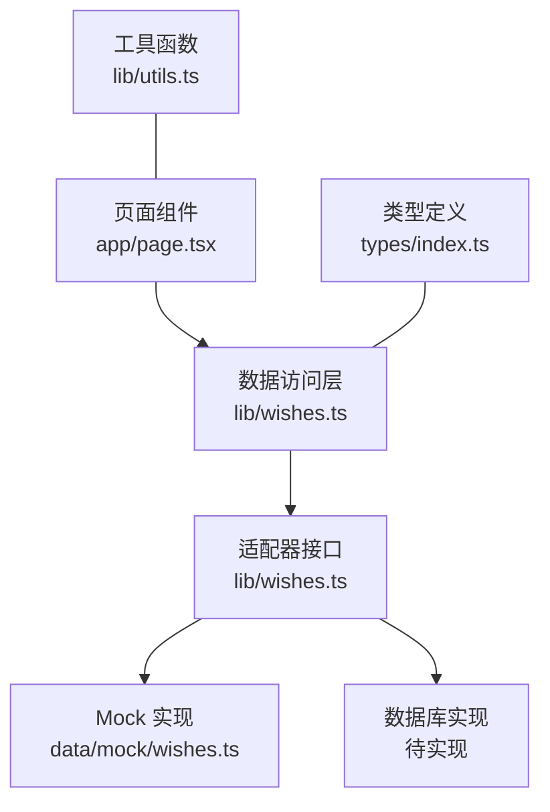
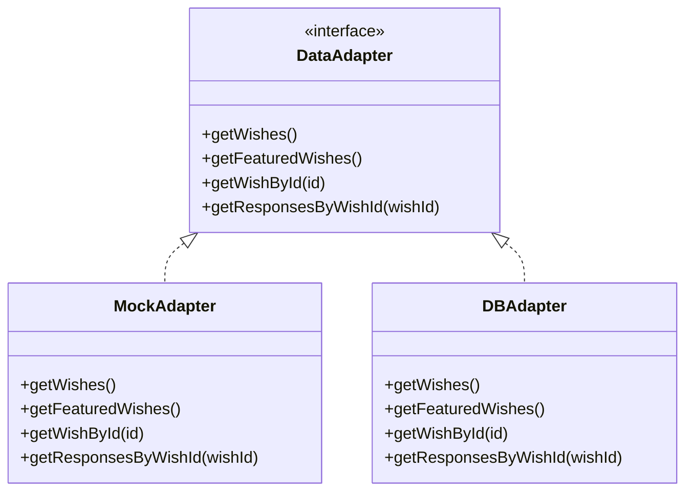
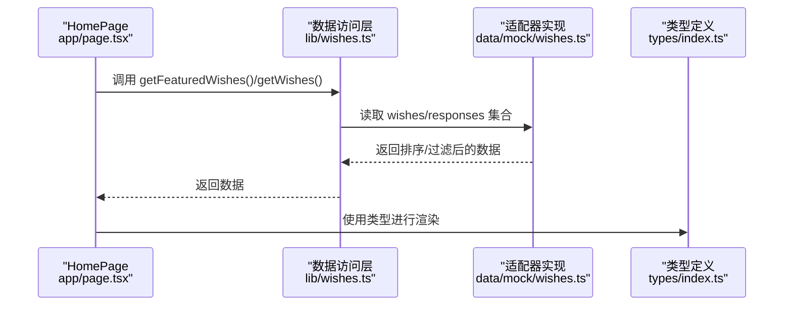
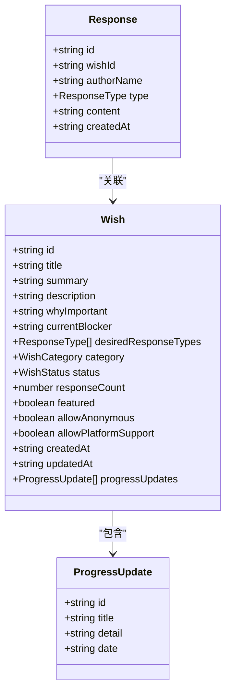
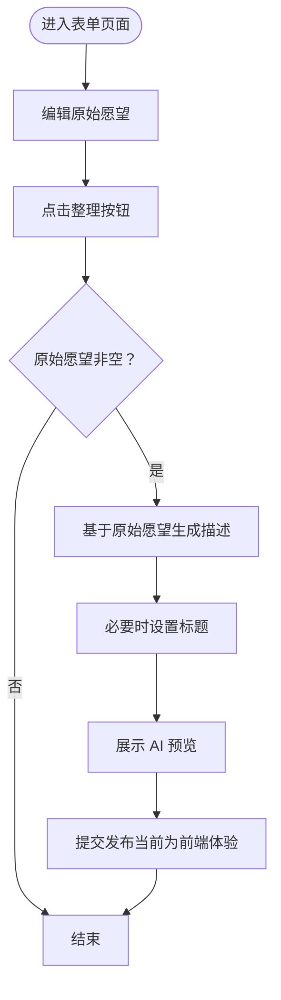
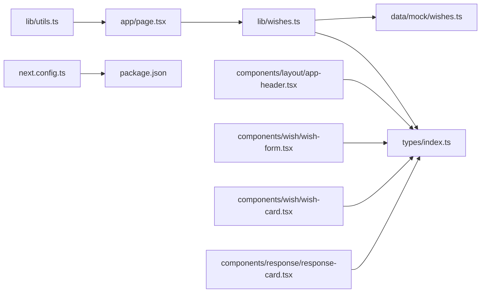

# 可扩展性与扩展点

<cite>
**本文引用的文件**
- [package.json](file://package.json)
- [next.config.ts](file://next.config.ts)
- [lib/wishes.ts](file://lib/wishes.ts)
- [data/mock/wishes.ts](file://data/mock/wishes.ts)
- [types/index.ts](file://types/index.ts)
- [app/layout.tsx](file://app/layout.tsx)
- [app/page.tsx](file://app/page.tsx)
- [components/layout/app-header.tsx](file://components/layout/app-header.tsx)
- [components/wish/wish-form.tsx](file://components/wish/wish-form.tsx)
- [components/wish/wish-card.tsx](file://components/wish/wish-card.tsx)
- [components/response/response-card.tsx](file://components/response/response-card.tsx)
- [lib/utils.ts](file://lib/utils.ts)
</cite>

## 目录
1. [引言](#引言)
2. [项目结构](#项目结构)
3. [核心组件](#核心组件)
4. [架构总览](#架构总览)
5. [详细组件分析](#详细组件分析)
6. [依赖分析](#依赖分析)
7. [性能考量](#性能考量)
8. [故障排查指南](#故障排查指南)
9. [结论](#结论)
10. [附录](#附录)

## 引言
本文件面向“梦想回应平台”的可扩展性与扩展点设计，聚焦以下目标：
- 描述从 Mock 数据层到真实数据库的迁移路径与适配器模式应用
- 说明扩展点设计：插件系统、中间件机制、钩子函数的实现思路
- 阐述模块化架构优势：组件解耦与依赖注入策略
- 解释配置驱动的扩展方式：运行时配置与环境变量管理
- 分析第三方集成扩展点：API 网关与外部服务集成
- 提供架构演进最佳实践：版本兼容性与渐进式迁移策略
- 讨论性能扩展与水平扩展的设计考虑

## 项目结构
该项目采用 Next.js 应用结构，按功能域组织代码：
- app：页面与布局
- components：UI 组件与业务组件
- lib：通用工具与数据访问层（当前为薄封装）
- data/mock：模拟数据
- types：类型定义
- next.config.ts：构建配置
- package.json：依赖与脚本

图表来源
- [app/layout.tsx:1-29](file://app/layout.tsx#L1-L29)
- [app/page.tsx:1-29](file://app/page.tsx#L1-L29)
- [components/layout/app-header.tsx:1-64](file://components/layout/app-header.tsx#L1-L64)
- [components/wish/wish-form.tsx:1-264](file://components/wish/wish-form.tsx#L1-L264)
- [components/wish/wish-card.tsx:1-93](file://components/wish/wish-card.tsx#L1-L93)
- [components/response/response-card.tsx:1-48](file://components/response/response-card.tsx#L1-L48)
- [lib/wishes.ts:1-27](file://lib/wishes.ts#L1-L27)
- [data/mock/wishes.ts:1-210](file://data/mock/wishes.ts#L1-L210)
- [types/index.ts:1-58](file://types/index.ts#L1-L58)
- [lib/utils.ts:1-12](file://lib/utils.ts#L1-L12)
- [next.config.ts:1-9](file://next.config.ts#L1-L9)
- [package.json:1-29](file://package.json#L1-L29)

章节来源
- [package.json:1-29](file://package.json#L1-L29)
- [next.config.ts:1-9](file://next.config.ts#L1-L9)
- [app/layout.tsx:1-29](file://app/layout.tsx#L1-L29)
- [app/page.tsx:1-29](file://app/page.tsx#L1-L29)
- [lib/wishes.ts:1-27](file://lib/wishes.ts#L1-L27)
- [data/mock/wishes.ts:1-210](file://data/mock/wishes.ts#L1-L210)
- [types/index.ts:1-58](file://types/index.ts#L1-L58)
- [lib/utils.ts:1-12](file://lib/utils.ts#L1-L12)

## 核心组件
- 数据访问层（lib/wishes.ts）：以函数形式暴露数据查询接口，当前内部依赖 data/mock/wishes.ts 中的静态数组，便于未来替换为真实数据源。
- 类型系统（types/index.ts）：集中定义 Wish、Response、WishStatus、ResponseType、WishCategory 等类型，确保跨组件一致性。
- 页面与布局（app/page.tsx、app/layout.tsx）：页面通过 lib/wishes.ts 获取数据，布局包含导航与全局样式。
- 组件体系（components/*）：响应式卡片、愿望卡片、表单等，均消费 types/index.ts 中的类型定义。
- 工具库（lib/utils.ts）：提供 cn 与日期格式化等通用方法。

章节来源
- [lib/wishes.ts:1-27](file://lib/wishes.ts#L1-L27)
- [data/mock/wishes.ts:1-210](file://data/mock/wishes.ts#L1-L210)
- [types/index.ts:1-58](file://types/index.ts#L1-L58)
- [app/page.tsx:1-29](file://app/page.tsx#L1-L29)
- [app/layout.tsx:1-29](file://app/layout.tsx#L1-L29)
- [components/response/response-card.tsx:1-48](file://components/response/response-card.tsx#L1-L48)
- [components/wish/wish-card.tsx:1-93](file://components/wish/wish-card.tsx#L1-L93)
- [components/wish/wish-form.tsx:1-264](file://components/wish/wish-form.tsx#L1-L264)
- [lib/utils.ts:1-12](file://lib/utils.ts#L1-L12)

## 架构总览
当前架构采用“页面 → 数据访问层 → 模拟数据”的单向数据流。为实现可扩展性，建议引入适配器模式与依赖注入，使数据访问层不感知具体存储实现，从而平滑迁移到真实数据库。

图表来源
- [app/page.tsx:1-29](file://app/page.tsx#L1-L29)
- [lib/wishes.ts:1-27](file://lib/wishes.ts#L1-L27)
- [data/mock/wishes.ts:1-210](file://data/mock/wishes.ts#L1-L210)
- [types/index.ts:1-58](file://types/index.ts#L1-L58)
- [lib/utils.ts:1-12](file://lib/utils.ts#L1-L12)

## 详细组件分析

### 数据访问层与适配器模式
- 当前实现：lib/wishes.ts 直接导入 data/mock/wishes.ts 中的静态数组，封装排序、筛选等逻辑，保持页面层调用一致。
- 扩展建议：
  - 抽象数据访问接口（如 getWishes、getWishById、getResponsesByWishId），定义统一签名。
  - 为 Mock 与数据库分别实现适配器，通过工厂或 DI 注入选择具体实现。
  - 在迁移过程中，页面无需改动，仅替换注入的适配器实例即可完成平滑过渡。

图表来源
- [lib/wishes.ts:1-27](file://lib/wishes.ts#L1-L27)
- [data/mock/wishes.ts:1-210](file://data/mock/wishes.ts#L1-L210)

章节来源
- [lib/wishes.ts:1-27](file://lib/wishes.ts#L1-L27)
- [data/mock/wishes.ts:1-210](file://data/mock/wishes.ts#L1-L210)

### 页面到数据访问层的调用流程

图表来源
- [app/page.tsx:1-29](file://app/page.tsx#L1-L29)
- [lib/wishes.ts:1-27](file://lib/wishes.ts#L1-L27)
- [data/mock/wishes.ts:1-210](file://data/mock/wishes.ts#L1-L210)
- [types/index.ts:1-58](file://types/index.ts#L1-L58)

章节来源
- [app/page.tsx:1-29](file://app/page.tsx#L1-L29)
- [lib/wishes.ts:1-27](file://lib/wishes.ts#L1-L27)
- [data/mock/wishes.ts:1-210](file://data/mock/wishes.ts#L1-L210)
- [types/index.ts:1-58](file://types/index.ts#L1-L58)

### 组件与类型的关系

图表来源
- [types/index.ts:23-58](file://types/index.ts#L23-L58)

章节来源
- [types/index.ts:1-58](file://types/index.ts#L1-L58)

### 表单与预览的交互流程

图表来源
- [components/wish/wish-form.tsx:108-124](file://components/wish/wish-form.tsx#L108-L124)

章节来源
- [components/wish/wish-form.tsx:1-264](file://components/wish/wish-form.tsx#L1-L264)

## 依赖分析
- 组件间依赖：页面依赖数据访问层；组件依赖类型定义；工具函数被多处复用。
- 外部依赖：Next.js、React、TailwindCSS、TypeScript 等。
- 配置依赖：next.config.ts 通过环境变量控制 distDir，package.json 定义构建与启动脚本。

图表来源
- [app/page.tsx:1-29](file://app/page.tsx#L1-L29)
- [lib/wishes.ts:1-27](file://lib/wishes.ts#L1-L27)
- [data/mock/wishes.ts:1-210](file://data/mock/wishes.ts#L1-L210)
- [types/index.ts:1-58](file://types/index.ts#L1-L58)
- [components/layout/app-header.tsx:1-64](file://components/layout/app-header.tsx#L1-L64)
- [components/wish/wish-form.tsx:1-264](file://components/wish/wish-form.tsx#L1-L264)
- [components/wish/wish-card.tsx:1-93](file://components/wish/wish-card.tsx#L1-L93)
- [components/response/response-card.tsx:1-48](file://components/response/response-card.tsx#L1-L48)
- [lib/utils.ts:1-12](file://lib/utils.ts#L1-L12)
- [next.config.ts:1-9](file://next.config.ts#L1-L9)
- [package.json:1-29](file://package.json#L1-L29)

章节来源
- [package.json:1-29](file://package.json#L1-L29)
- [next.config.ts:1-9](file://next.config.ts#L1-L9)
- [app/page.tsx:1-29](file://app/page.tsx#L1-L29)
- [lib/wishes.ts:1-27](file://lib/wishes.ts#L1-L27)
- [data/mock/wishes.ts:1-210](file://data/mock/wishes.ts#L1-L210)
- [types/index.ts:1-58](file://types/index.ts#L1-L58)
- [lib/utils.ts:1-12](file://lib/utils.ts#L1-L12)

## 性能考量
- 渲染性能
  - 将排序与筛选逻辑置于数据访问层，避免在组件中重复计算，降低渲染成本。
  - 对长列表使用分页或虚拟滚动（建议在后续版本引入）。
- 数据访问性能
  - Mock 层适合开发与演示；生产环境应引入缓存层（如 Redis）与数据库索引优化。
  - 查询接口应支持分页、过滤与排序参数，减少一次性传输大量数据。
- 构建与部署
  - 通过 next.config.ts 的 distDir 配置与 package.json 的构建脚本，确保构建产物稳定与可复用。
- 水平扩展
  - 采用无状态页面与可注入的数据适配器，便于多实例部署与负载均衡。
  - 将静态资源交由 CDN 加速，减少服务器压力。

## 故障排查指南
- 页面未显示数据
  - 检查数据访问层函数返回值与类型定义是否匹配。
  - 确认 Mock 数据是否存在与字段完整。
- 日期显示异常
  - 检查 lib/utils.ts 的日期格式化逻辑与输入字符串格式。
- 构建失败
  - 检查 next.config.ts 的 distDir 是否正确，以及 package.json 的脚本命令。

章节来源
- [lib/wishes.ts:1-27](file://lib/wishes.ts#L1-L27)
- [data/mock/wishes.ts:1-210](file://data/mock/wishes.ts#L1-L210)
- [lib/utils.ts:1-12](file://lib/utils.ts#L1-L12)
- [next.config.ts:1-9](file://next.config.ts#L1-L9)
- [package.json:1-29](file://package.json#L1-L29)

## 结论
本项目已具备清晰的模块化结构与类型约束，为后续扩展提供了良好基础。通过引入适配器模式与依赖注入，可实现从 Mock 到数据库的平滑迁移；通过配置驱动与中间件机制，可进一步增强系统的可扩展性与可维护性。建议在下一阶段逐步引入缓存、分页与数据库适配器，并完善第三方集成与监控告警体系。

## 附录

### 扩展点设计建议
- 插件系统
  - 以适配器接口为核心，定义插件注册与生命周期钩子（如初始化、请求拦截、响应处理）。
- 中间件机制
  - 在 Next.js 中利用中间件清单与函数映射，实现统一的鉴权、日志与限流。
- 钩子函数
  - 在数据访问层暴露钩子（如查询前/后钩子），用于埋点、审计与二次加工。
- 配置驱动
  - 通过环境变量与运行时配置切换 Mock/DB、启用/禁用功能开关与第三方服务开关。
- 第三方集成
  - 以适配器封装外部 API（如支付、推送、分析），统一错误处理与重试策略。
- 版本兼容与渐进式迁移
  - 采用双写与读取策略，逐步切换至新实现；通过特性开关与灰度发布控制风险。

### 迁移路径示例（概念）

[此图为概念示意，不对应具体源码文件]