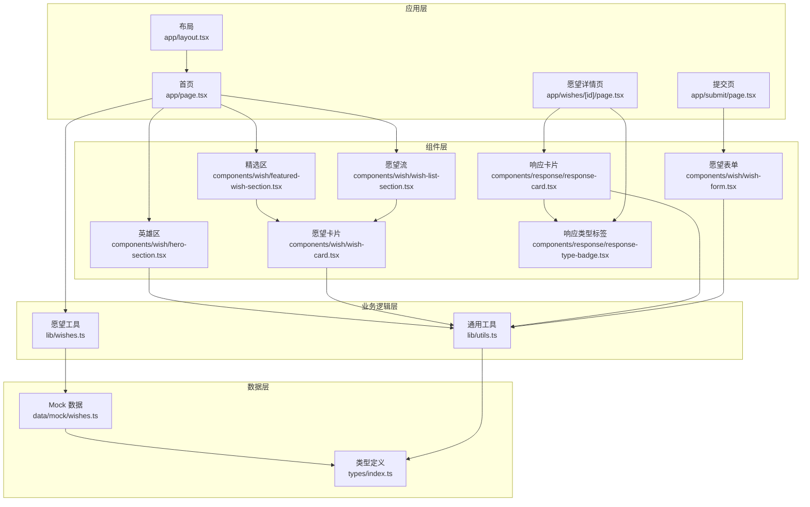
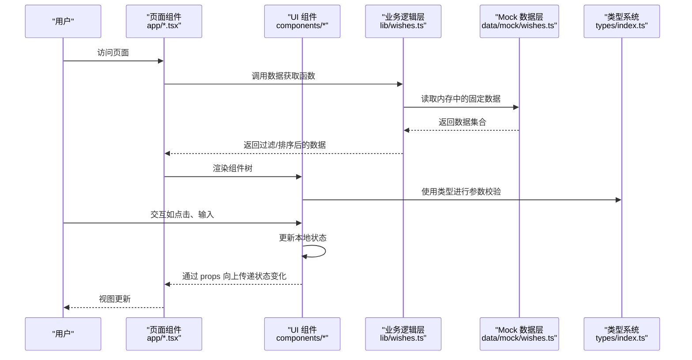
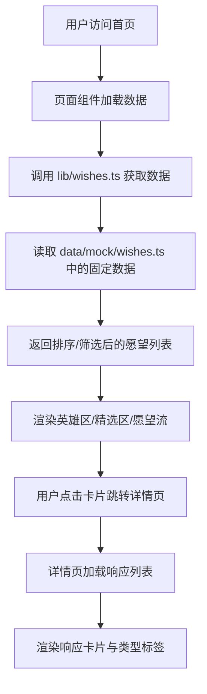
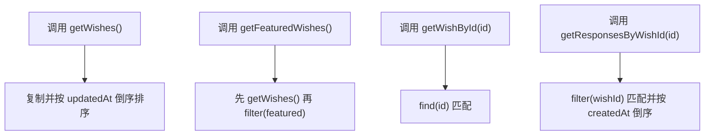
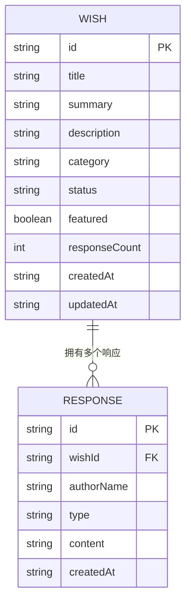
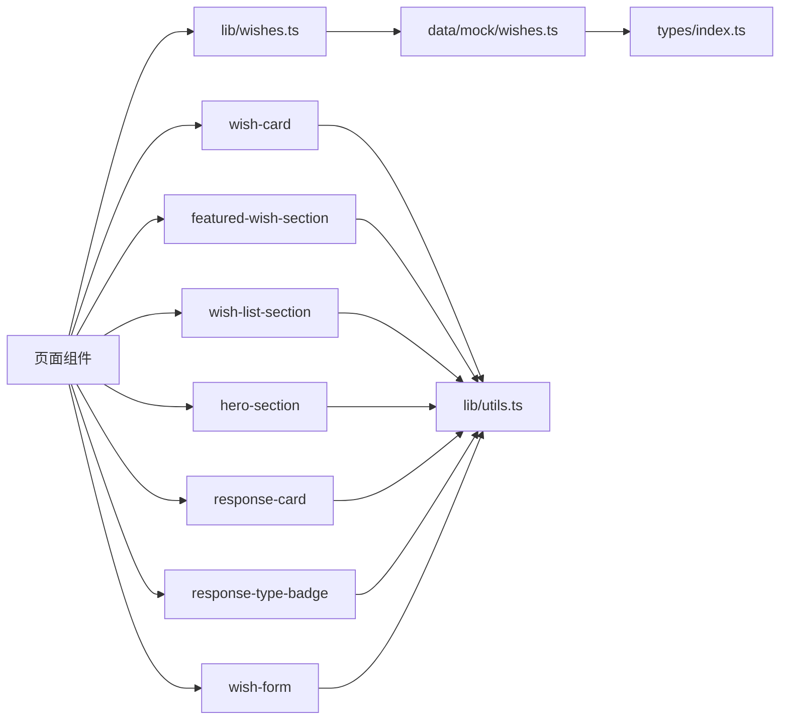

# 数据流架构

<cite>
**本文引用的文件**
- [package.json](file://package.json)
- [app/layout.tsx](file://app/layout.tsx)
- [app/page.tsx](file://app/page.tsx)
- [app/submit/page.tsx](file://app/submit/page.tsx)
- [app/wishes/[id]/page.tsx](file://app/wishes/[id]/page.tsx)
- [types/index.ts](file://types/index.ts)
- [lib/utils.ts](file://lib/utils.ts)
- [lib/wishes.ts](file://lib/wishes.ts)
- [data/mock/wishes.ts](file://data/mock/wishes.ts)
- [components/wish/wish-form.tsx](file://components/wish/wish-form.tsx)
- [components/wish/wish-card.tsx](file://components/wish/wish-card.tsx)
- [components/wish/featured-wish-section.tsx](file://components/wish/featured-wish-section.tsx)
- [components/wish/wish-list-section.tsx](file://components/wish/wish-list-section.tsx)
- [components/wish/hero-section.tsx](file://components/wish/hero-section.tsx)
- [components/response/response-card.tsx](file://components/response/response-card.tsx)
- [components/response/response-type-badge.tsx](file://components/response/response-type-badge.tsx)
</cite>

## 目录
1. [简介](#简介)
2. [项目结构](#项目结构)
3. [核心组件](#核心组件)
4. [架构总览](#架构总览)
5. [详细组件分析](#详细组件分析)
6. [依赖关系分析](#依赖关系分析)
7. [性能考量](#性能考量)
8. [故障排查指南](#故障排查指南)
9. [结论](#结论)
10. [附录](#附录)

## 简介
本文件为“梦想回应平台”的数据流架构文档，聚焦从用户界面到数据访问层的完整数据流路径，覆盖页面组件如何调用业务逻辑层、业务逻辑层如何处理数据请求，以及 Mock 数据层的模拟实现。文档详细说明数据流向：用户操作 → 组件状态 → 业务逻辑 → 数据访问 → 数据存储 → 状态更新 → 视图渲染的完整循环；解释类型安全的数据流设计（TypeScript 接口在数据传递中的作用）；阐述状态管理模式（本地状态管理与全局状态管理策略）；分析数据缓存与性能优化方案；并提供数据流调试与错误处理的最佳实践。

## 项目结构
该项目采用 Next.js App Router 结构，页面级路由位于 app/ 下，UI 组件位于 components/ 下，类型定义位于 types/，业务数据访问封装在 lib/，Mock 数据位于 data/mock/。整体组织遵循“按功能域分层”的思路：页面负责组合组件与数据获取；组件负责视图与交互；lib 封装数据访问；data/mock 提供数据源。

图表来源
- [app/layout.tsx:1-29](file://app/layout.tsx#L1-L29)
- [app/page.tsx:1-29](file://app/page.tsx#L1-L29)
- [app/submit/page.tsx](file://app/submit/page.tsx)
- [app/wishes/[id]/page.tsx](file://app/wishes/[id]/page.tsx)
- [lib/wishes.ts:1-27](file://lib/wishes.ts#L1-L27)
- [lib/utils.ts:1-12](file://lib/utils.ts#L1-L12)
- [data/mock/wishes.ts:1-210](file://data/mock/wishes.ts#L1-L210)
- [types/index.ts:1-58](file://types/index.ts#L1-L58)
- [components/wish/hero-section.tsx:1-53](file://components/wish/hero-section.tsx#L1-L53)
- [components/wish/featured-wish-section.tsx:1-47](file://components/wish/featured-wish-section.tsx#L1-L47)
- [components/wish/wish-list-section.tsx:1-77](file://components/wish/wish-list-section.tsx#L1-L77)
- [components/wish/wish-card.tsx:1-93](file://components/wish/wish-card.tsx#L1-L93)
- [components/response/response-card.tsx:1-48](file://components/response/response-card.tsx#L1-L48)
- [components/response/response-type-badge.tsx:1-43](file://components/response/response-type-badge.tsx#L1-L43)
- [components/wish/wish-form.tsx:1-264](file://components/wish/wish-form.tsx#L1-L264)

章节来源
- [package.json:1-29](file://package.json#L1-L29)
- [app/layout.tsx:1-29](file://app/layout.tsx#L1-L29)
- [app/page.tsx:1-29](file://app/page.tsx#L1-L29)

## 核心组件
- 页面组件
  - 首页：负责加载精选与最新愿望列表，计算等待回声数量，并渲染英雄区、精选区与愿望流。
  - 提交页：承载愿望表单，用于收集与编辑结构化愿望信息。
  - 详情页：承载响应列表与响应卡片，展示某愿望的回应。
- 业务逻辑层
  - lib/wishes.ts：封装愿望与响应的查询方法，屏蔽底层数据源差异，便于未来替换为真实后端。
- 数据层
  - data/mock/wishes.ts：提供固定数据集（愿望与响应），包含类型约束与示例数据。
  - types/index.ts：定义 Wish、Response、WishStatus、ResponseType、WishCategory、ProgressUpdate 等类型。
- UI 组件
  - wish-card、featured-wish-section、wish-list-section、hero-section：负责渲染与交互。
  - response-card、response-type-badge：负责响应展示与分类标签。
  - wish-form：负责表单字段与本地状态管理。

章节来源
- [app/page.tsx:1-29](file://app/page.tsx#L1-L29)
- [app/submit/page.tsx](file://app/submit/page.tsx)
- [app/wishes/[id]/page.tsx](file://app/wishes/[id]/page.tsx)
- [lib/wishes.ts:1-27](file://lib/wishes.ts#L1-L27)
- [data/mock/wishes.ts:1-210](file://data/mock/wishes.ts#L1-L210)
- [types/index.ts:1-58](file://types/index.ts#L1-L58)
- [components/wish/wish-card.tsx:1-93](file://components/wish/wish-card.tsx#L1-L93)
- [components/wish/featured-wish-section.tsx:1-47](file://components/wish/featured-wish-section.tsx#L1-L47)
- [components/wish/wish-list-section.tsx:1-77](file://components/wish/wish-list-section.tsx#L1-L77)
- [components/wish/hero-section.tsx:1-53](file://components/wish/hero-section.tsx#L1-L53)
- [components/response/response-card.tsx:1-48](file://components/response/response-card.tsx#L1-L48)
- [components/response/response-type-badge.tsx:1-43](file://components/response/response-type-badge.tsx#L1-L43)
- [components/wish/wish-form.tsx:1-264](file://components/wish/wish-form.tsx#L1-L264)

## 架构总览
下图展示了从用户操作到视图渲染的完整数据流路径，以及各层之间的依赖关系。

图表来源
- [app/page.tsx:1-29](file://app/page.tsx#L1-L29)
- [lib/wishes.ts:1-27](file://lib/wishes.ts#L1-L27)
- [data/mock/wishes.ts:1-210](file://data/mock/wishes.ts#L1-L210)
- [types/index.ts:1-58](file://types/index.ts#L1-L58)

## 详细组件分析

### 页面组件数据流
- 首页
  - 通过 lib/wishes.ts 获取精选与最新愿望，并计算等待回声数量。
  - 渲染英雄区、精选区与愿望流。
- 提交页
  - 承载 wish-form，负责本地状态管理与表单交互。
- 详情页
  - 通过 lib/wishes.ts 获取指定愿望及其响应列表，渲染响应卡片。

图表来源
- [app/page.tsx:1-29](file://app/page.tsx#L1-L29)
- [lib/wishes.ts:1-27](file://lib/wishes.ts#L1-L27)
- [data/mock/wishes.ts:1-210](file://data/mock/wishes.ts#L1-L210)
- [components/wish/hero-section.tsx:1-53](file://components/wish/hero-section.tsx#L1-L53)
- [components/wish/featured-wish-section.tsx:1-47](file://components/wish/featured-wish-section.tsx#L1-L47)
- [components/wish/wish-list-section.tsx:1-77](file://components/wish/wish-list-section.tsx#L1-L77)
- [components/response/response-card.tsx:1-48](file://components/response/response-card.tsx#L1-L48)
- [components/response/response-type-badge.tsx:1-43](file://components/response/response-type-badge.tsx#L1-L43)

章节来源
- [app/page.tsx:1-29](file://app/page.tsx#L1-L29)
- [app/submit/page.tsx](file://app/submit/page.tsx)
- [app/wishes/[id]/page.tsx](file://app/wishes/[id]/page.tsx)
- [lib/wishes.ts:1-27](file://lib/wishes.ts#L1-L27)

### 业务逻辑层（lib/wishes.ts）
- 设计目标
  - 将页面级数据访问封装为统一接口，隔离数据源（当前为 Mock，未来可替换为 Supabase 或其他后端）。
  - 保持组件与数据源解耦，便于演进。
- 关键职责
  - 获取所有愿望并按更新时间倒序。
  - 获取精选愿望（基于 featured 字段）。
  - 按 ID 查询愿望与响应。
  - 对响应按创建时间倒序排序。
- 复杂度
  - 数组遍历与过滤：O(n)，排序：O(n log n)。

图表来源
- [lib/wishes.ts:1-27](file://lib/wishes.ts#L1-L27)
- [data/mock/wishes.ts:1-210](file://data/mock/wishes.ts#L1-L210)

章节来源
- [lib/wishes.ts:1-27](file://lib/wishes.ts#L1-L27)

### Mock 数据层（data/mock/wishes.ts）
- 设计目标
  - 提供稳定、可扩展的示例数据，支撑前端开发与演示。
  - 与类型系统强绑定，确保数据一致性。
- 数据结构
  - wishes：愿望数组，包含标题、摘要、描述、分类、状态、进度更新等。
  - responses：响应数组，包含作者名、类型、内容、创建时间等。
  - responseTypes：可用的响应类型集合。
- 可扩展性
  - 新增字段时需同步更新 types/index.ts 与 Mock 数据。
  - 未来可替换为远程 API，保持 lib/wishes.ts 接口不变。

图表来源
- [data/mock/wishes.ts:1-210](file://data/mock/wishes.ts#L1-L210)
- [types/index.ts:1-58](file://types/index.ts#L1-L58)

章节来源
- [data/mock/wishes.ts:1-210](file://data/mock/wishes.ts#L1-L210)
- [types/index.ts:1-58](file://types/index.ts#L1-L58)

### 类型安全的数据流设计
- 类型定义
  - Wish、Response、WishStatus、ResponseType、WishCategory、ProgressUpdate 等。
- 传递路径
  - 页面组件接收来自 lib/wishes.ts 的数据，以 props 形式传递给子组件。
  - 子组件使用类型定义进行参数校验与渲染。
- 优势
  - 编译期检查，降低运行时错误风险。
  - 易于重构与演进，避免数据结构不一致导致的异常。

章节来源
- [types/index.ts:1-58](file://types/index.ts#L1-L58)
- [lib/wishes.ts:1-27](file://lib/wishes.ts#L1-L27)
- [components/wish/wish-card.tsx:1-93](file://components/wish/wish-card.tsx#L1-L93)
- [components/response/response-card.tsx:1-48](file://components/response/response-card.tsx#L1-L48)

### 状态管理模式
- 本地状态管理
  - wish-form 使用 useState 管理原始愿望、结构化字段、响应类型选择、匿名与平台支持开关等。
  - 本地状态在组件内部更新，不涉及全局状态库。
- 全局状态管理策略
  - 当前项目未引入全局状态库（如 Zustand、Redux），建议：
    - 仅在跨页面共享且频繁使用的场景（如用户态、主题偏好）引入。
    - 保持 lib/wishes.ts 作为单一数据源，避免重复拉取与状态漂移。
- 本地状态与全局状态的边界
  - 本地状态：表单、模态框、页面内筛选器等。
  - 全局状态：用户登录态、语言、主题、收藏夹等。

章节来源
- [components/wish/wish-form.tsx:1-264](file://components/wish/wish-form.tsx#L1-L264)

### 数据缓存与性能优化
- 现状
  - Mock 数据驻留在内存，无需网络请求，读取开销极低。
  - 排序与过滤在客户端完成，数据量较小时性能良好。
- 优化建议
  - 列表渲染
    - 使用虚拟滚动（如 react-window）处理长列表。
    - 对 columns-1 md:columns-2 xl:columns-3 的瀑布流，结合图片懒加载与占位符。
  - 数据访问
    - 对 getWishes()/getResponsesByWishId() 增加 memoization，避免重复计算。
    - 对高频筛选/排序场景，考虑使用 useMemo/useCallback。
  - 渲染优化
    - 将重型组件（如响应卡片）拆分为独立模块，按需加载。
    - 使用 React.Suspense 与动态导入（若引入服务端渲染）。
  - 网络层替换
    - 未来接入后端时，结合 SWR/Apollo/React Query 实现缓存与并发控制。

章节来源
- [lib/wishes.ts:1-27](file://lib/wishes.ts#L1-L27)
- [components/wish/wish-list-section.tsx:1-77](file://components/wish/wish-list-section.tsx#L1-L77)

### 错误处理与调试最佳实践
- 错误处理
  - 页面级兜底：not-found.tsx（若存在）用于 404 场景。
  - 组件级容错：对空数据、缺失字段进行防御式渲染。
  - 类型错误：利用 TypeScript 在编译期捕获类型不匹配。
- 调试建议
  - 在 lib/wishes.ts 中增加日志或断言，验证数据完整性。
  - 使用 React DevTools 检查 props 与状态变化。
  - 对排序/过滤逻辑添加单元测试，确保稳定性。
- 可观测性
  - 为关键数据流埋点（如首次渲染耗时、响应列表加载耗时）。
  - 对用户交互（点击、输入）记录事件，辅助定位问题。

章节来源
- [app/not-found.tsx](file://app/not-found.tsx)
- [lib/wishes.ts:1-27](file://lib/wishes.ts#L1-L27)
- [types/index.ts:1-58](file://types/index.ts#L1-L58)

## 依赖关系分析
- 组件依赖
  - 页面组件依赖 lib/wishes.ts 与 UI 组件。
  - UI 组件依赖类型系统与通用工具。
- 业务依赖
  - lib/wishes.ts 依赖 data/mock/wishes.ts。
- 类型依赖
  - 所有数据结构与接口均依赖 types/index.ts。

图表来源
- [lib/wishes.ts:1-27](file://lib/wishes.ts#L1-L27)
- [data/mock/wishes.ts:1-210](file://data/mock/wishes.ts#L1-L210)
- [types/index.ts:1-58](file://types/index.ts#L1-L58)
- [lib/utils.ts:1-12](file://lib/utils.ts#L1-L12)
- [components/wish/wish-card.tsx:1-93](file://components/wish/wish-card.tsx#L1-L93)
- [components/wish/featured-wish-section.tsx:1-47](file://components/wish/featured-wish-section.tsx#L1-L47)
- [components/wish/wish-list-section.tsx:1-77](file://components/wish/wish-list-section.tsx#L1-L77)
- [components/wish/hero-section.tsx:1-53](file://components/wish/hero-section.tsx#L1-L53)
- [components/response/response-card.tsx:1-48](file://components/response/response-card.tsx#L1-L48)
- [components/response/response-type-badge.tsx:1-43](file://components/response/response-type-badge.tsx#L1-L43)
- [components/wish/wish-form.tsx:1-264](file://components/wish/wish-form.tsx#L1-L264)

章节来源
- [lib/wishes.ts:1-27](file://lib/wishes.ts#L1-L27)
- [data/mock/wishes.ts:1-210](file://data/mock/wishes.ts#L1-L210)
- [types/index.ts:1-58](file://types/index.ts#L1-L58)
- [lib/utils.ts:1-12](file://lib/utils.ts#L1-L12)

## 性能考量
- 客户端渲染优化
  - 列表渲染：使用 CSS 多列布局与图片懒加载，减少首屏压力。
  - 组件拆分：将响应卡片与类型标签拆分为独立模块，按需加载。
- 数据访问优化
  - 对 getWishes()/getResponsesByWishId() 增加缓存与去重逻辑。
  - 对高频筛选/排序场景使用 useMemo/useCallback。
- 未来演进
  - 引入服务端渲染（SSR）与增量静态生成（ISR），提升首屏性能。
  - 使用缓存层（如 Redis）与 CDN 加速静态资源。

## 故障排查指南
- 常见问题
  - 数据为空：检查 lib/wishes.ts 的过滤/查找逻辑是否正确。
  - 类型不匹配：核对 types/index.ts 与 data/mock/wishes.ts 的字段一致性。
  - 渲染异常：检查组件 props 是否满足类型要求，是否存在未处理的空值。
- 调试步骤
  - 在 lib/wishes.ts 中打印中间结果，确认数据来源与转换过程。
  - 使用 React DevTools 检查组件树与状态变化。
  - 对排序/过滤逻辑编写单元测试，确保边界条件正确。

章节来源
- [lib/wishes.ts:1-27](file://lib/wishes.ts#L1-L27)
- [types/index.ts:1-58](file://types/index.ts#L1-L58)

## 结论
本项目通过清晰的分层架构实现了从页面到数据层的稳定数据流：页面组件负责组合与渲染，业务逻辑层封装数据访问，Mock 数据层提供示例数据，类型系统保障数据一致性。当前以本地状态管理为主，配合 lib/wishes.ts 的薄封装，既满足 MVP 需求，又为未来接入真实后端与引入全局状态管理预留了空间。建议在保持类型安全的前提下，逐步引入缓存与渲染优化，持续完善错误处理与可观测性，以支撑更大规模的数据与更高的性能要求。

## 附录
- 术语
  - MVP：最小可行产品，强调快速验证核心功能。
  - Mock 数据：模拟数据，用于前端开发与演示。
  - 类型安全：通过 TypeScript 在编译期保证数据结构正确性。
- 参考
  - Next.js App Router 文档与最佳实践。
  - React 状态管理与性能优化指南。