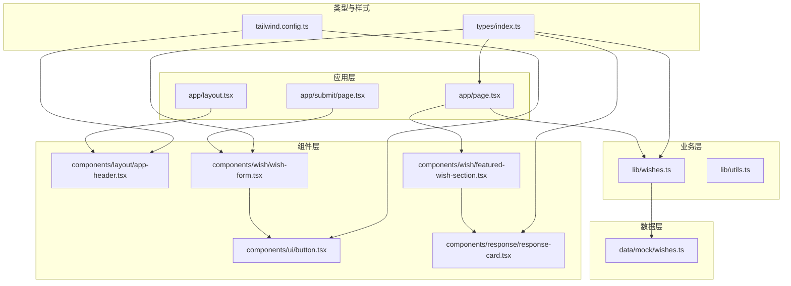
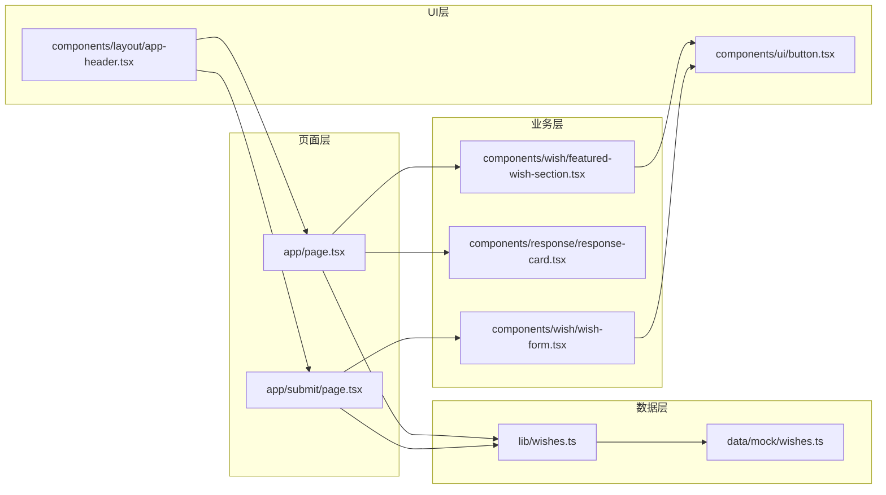
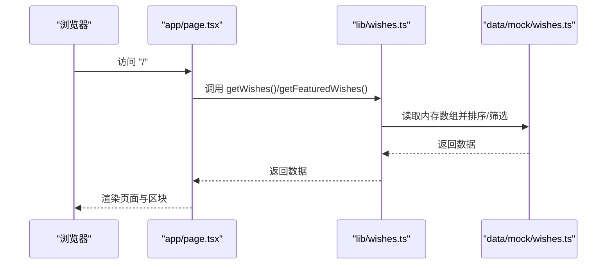
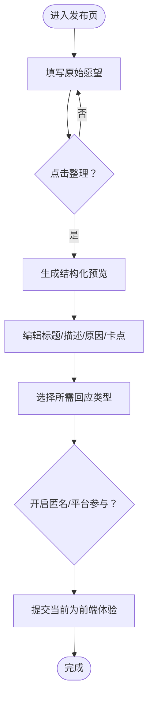
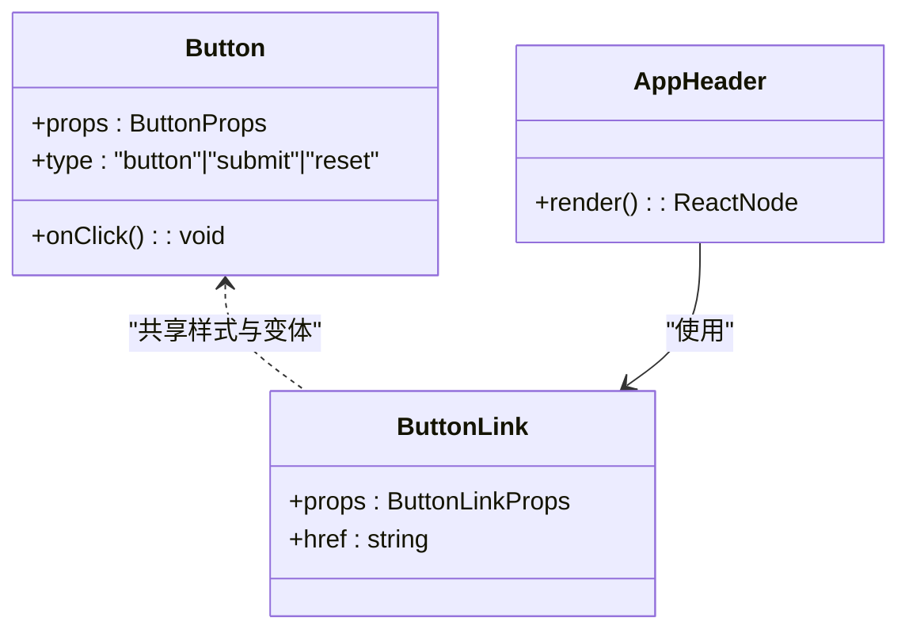
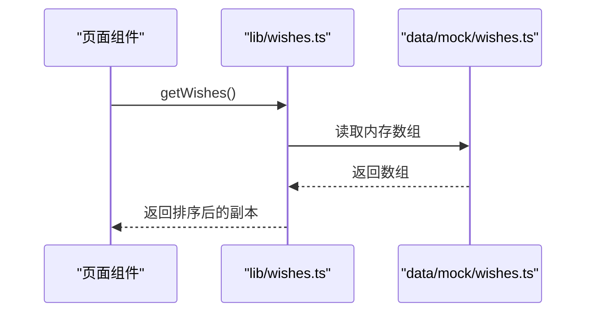
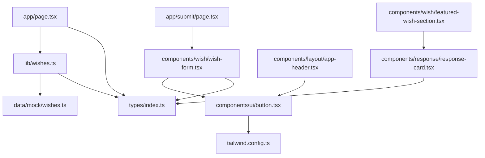
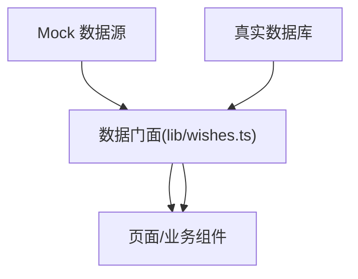

# 架构设计

<cite>
**本文引用的文件**
- [package.json](file://package.json)
- [next.config.ts](file://next.config.ts)
- [tailwind.config.ts](file://tailwind.config.ts)
- [types/index.ts](file://types/index.ts)
- [lib/utils.ts](file://lib/utils.ts)
- [lib/wishes.ts](file://lib/wishes.ts)
- [data/mock/wishes.ts](file://data/mock/wishes.ts)
- [app/layout.tsx](file://app/layout.tsx)
- [app/page.tsx](file://app/page.tsx)
- [app/submit/page.tsx](file://app/submit/page.tsx)
- [components/layout/app-header.tsx](file://components/layout/app-header.tsx)
- [components/ui/button.tsx](file://components/ui/button.tsx)
- [components/response/response-card.tsx](file://components/response/response-card.tsx)
- [components/wish/featured-wish-section.tsx](file://components/wish/featured-wish-section.tsx)
- [components/wish/wish-form.tsx](file://components/wish/wish-form.tsx)
</cite>

## 目录
1. [引言](#引言)
2. [项目结构](#项目结构)
3. [核心组件](#核心组件)
4. [架构总览](#架构总览)
5. [详细组件分析](#详细组件分析)
6. [依赖关系分析](#依赖关系分析)
7. [性能考虑](#性能考虑)
8. [故障排查指南](#故障排查指南)
9. [结论](#结论)
10. [附录](#附录)

## 引言
本架构设计文档面向「梦的平台 / 愿望被回应的平台」的前端架构，基于 Next.js App Router 的现代前端模式，系统性阐述页面组件、业务组件、UI 组件的分层职责，客户端与服务器组件的分工与协作，数据流从界面到数据访问层的完整路径，类型安全设计（TypeScript 接口与枚举）的作用，样式系统（Tailwind CSS）的集成与主题配置，以及从 Mock 数据层向真实数据库迁移的可扩展路径与技术权衡。

### 产品架构五层模型

本项目的架构不仅是技术分层，更对应产品的五层结构：

```
流量入口层 → 表达结构化层 → 回应互动层 → 推进匹配层 → 结果沉淀层
```

- **流量入口层**：愿望广场 / 故事内容，吸引用户进入
- **表达结构化层**：发布愿望 + AI 整理，将模糊愿望翻译成可回应对象
- **回应互动层**：建议/资源/支持/认领等结构化回应，这是平台灵魂
- **推进匹配层**：精选愿望 / 平台介入，少量愿望进入推进流程
- **结果沉淀层**：进展页 / 实现故事页，形成传播与信任闭环

其中真正需要重点做的是中间三层：没有结构化，愿望不可处理；没有回应，平台没有灵魂；没有推进，平台没有闭环。

### 回应 ≠ 评论：核心差异化架构

本平台最关键的架构决策是**结构化回应系统**。回应不是泛评论，而是带类型的帮助输入。这使得平台从"社交互动"拉向"行动互动"：

- 普通评论区：加油 / 祝你成功 / 好感人
- 结构化回应：我可以给你作品集模板 / 我认识一个初创公司在招人 / 我愿意帮你 mock interview

这是完全两种产品。回应类型标签（Advice/Resource/Introduction/Opportunity/Support/Similar Experience）是架构层面的核心差异化。

### AI 的架构定位

AI 在本项目中是"翻译层"，不是主角：
- 把模糊、情绪化的愿望翻译成清晰、可被回应的结构化对象
- 不代替人类关系和帮助
- MVP 阶段先做模拟实现，后续再接入真实 LLM
- 生成失败时必须允许用户手动填写

## 项目结构
项目采用 Next.js App Router 的应用级结构，按功能域组织文件：
- 应用入口与全局布局：app/layout.tsx、app/globals.css
- 页面路由：app/page.tsx、app/submit/page.tsx、app/wishes/[id]/page.tsx（占位）
- 业务逻辑封装：lib/wishes.ts（数据访问门面）、lib/utils.ts（工具函数）
- 类型定义：types/index.ts（领域模型与枚举）
- 样式系统：tailwind.config.ts（主题与内容扫描路径）
- 组件库：components/ui（通用 UI 组件）、components/layout（布局组件）、components/response 与 components/wish（业务组件）



图表来源
- [app/layout.tsx:1-29](file://app/layout.tsx#L1-L29)
- [app/page.tsx:1-29](file://app/page.tsx#L1-L29)
- [app/submit/page.tsx:1-24](file://app/submit/page.tsx#L1-L24)
- [lib/wishes.ts:1-27](file://lib/wishes.ts#L1-L27)
- [lib/utils.ts:1-12](file://lib/utils.ts#L1-L12)
- [types/index.ts:1-58](file://types/index.ts#L1-L58)
- [tailwind.config.ts:1-55](file://tailwind.config.ts#L1-L55)
- [components/layout/app-header.tsx:1-64](file://components/layout/app-header.tsx#L1-L64)
- [components/ui/button.tsx:1-75](file://components/ui/button.tsx#L1-L75)
- [components/response/response-card.tsx:1-48](file://components/response/response-card.tsx#L1-L48)
- [components/wish/featured-wish-section.tsx:1-47](file://components/wish/featured-wish-section.tsx#L1-L47)
- [components/wish/wish-form.tsx:1-264](file://components/wish/wish-form.tsx#L1-L264)
- [data/mock/wishes.ts:1-210](file://data/mock/wishes.ts#L1-L210)

章节来源
- [package.json:1-29](file://package.json#L1-L29)
- [next.config.ts:1-9](file://next.config.ts#L1-L9)
- [tailwind.config.ts:1-55](file://tailwind.config.ts#L1-L55)

## 核心组件
- 应用根布局与元数据：app/layout.tsx 提供全局 HTML 结构、站点元数据与顶层导航栏，统一注入样式与主体容器。
- 首页与提交页：app/page.tsx 与 app/submit/page.tsx 分别承载“愿望广场”和“发布愿望”的页面级逻辑；页面通过 lib/wishes.ts 获取数据并向下传递给业务组件。
- 业务组件：components/wish/* 与 components/response/* 负责渲染具体业务视图（如精选愿望、愿望卡片、回应卡片），并与 UI 组件解耦。
- UI 组件：components/ui/button.tsx 提供可复用的按钮与链接按钮，支持多种变体与尺寸，配合 Tailwind 主题实现一致的交互与视觉风格。
- 工具与类型：lib/utils.ts 提供类名合并与日期格式化等通用工具；types/index.ts 定义 Wish、Response、枚举类型及进度更新结构，确保端到端类型安全。

章节来源
- [app/layout.tsx:1-29](file://app/layout.tsx#L1-L29)
- [app/page.tsx:1-29](file://app/page.tsx#L1-L29)
- [app/submit/page.tsx:1-24](file://app/submit/page.tsx#L1-L24)
- [lib/wishes.ts:1-27](file://lib/wishes.ts#L1-L27)
- [lib/utils.ts:1-12](file://lib/utils.ts#L1-L12)
- [types/index.ts:1-58](file://types/index.ts#L1-L58)
- [components/ui/button.tsx:1-75](file://components/ui/button.tsx#L1-L75)

## 架构总览
本项目采用“页面组件 + 业务组件 + UI 组件”的三层分层：
- 页面组件：负责路由级数据获取与页面级状态管理，调用业务组件渲染内容。
- 业务组件：封装具体业务视图与交互，消费来自 lib 层的数据门面，避免直接依赖数据源。
- UI 组件：提供最小可用的可复用交互单元，通过 props 与主题系统保证一致性。

数据流从页面组件出发，经由业务组件，最终落到 UI 组件；类型定义贯穿所有层级，确保编译期安全。样式系统通过 Tailwind 配置集中管理颜色、字体、阴影与背景图案，确保视觉一致性与可维护性。



图表来源
- [app/page.tsx:1-29](file://app/page.tsx#L1-L29)
- [app/submit/page.tsx:1-24](file://app/submit/page.tsx#L1-L24)
- [components/wish/featured-wish-section.tsx:1-47](file://components/wish/featured-wish-section.tsx#L1-L47)
- [components/response/response-card.tsx:1-48](file://components/response/response-card.tsx#L1-L48)
- [components/wish/wish-form.tsx:1-264](file://components/wish/wish-form.tsx#L1-L264)
- [components/ui/button.tsx:1-75](file://components/ui/button.tsx#L1-L75)
- [components/layout/app-header.tsx:1-64](file://components/layout/app-header.tsx#L1-L64)
- [lib/wishes.ts:1-27](file://lib/wishes.ts#L1-L27)
- [data/mock/wishes.ts:1-210](file://data/mock/wishes.ts#L1-L210)

## 详细组件分析

### 页面组件：首页与提交页
- app/page.tsx
  - 职责：拉取全部愿望与精选愿望，计算待回应数量，渲染首页内容区块。
  - 协作：调用 lib/wishes.ts 获取数据；组合 FeaturedWishSection 与 WishListSection 渲染列表。
- app/submit/page.tsx
  - 职责：渲染“发布愿望”页面，引导用户填写表单。
  - 协作：直接引入 WishForm 组件，形成页面级交互闭环。



图表来源
- [app/page.tsx:1-29](file://app/page.tsx#L1-L29)
- [lib/wishes.ts:1-27](file://lib/wishes.ts#L1-L27)
- [data/mock/wishes.ts:1-210](file://data/mock/wishes.ts#L1-L210)

章节来源
- [app/page.tsx:1-29](file://app/page.tsx#L1-L29)
- [app/submit/page.tsx:1-24](file://app/submit/page.tsx#L1-L24)

### 业务组件：愿望与回应
- components/wish/featured-wish-section.tsx
  - 职责：渲染精选愿望区域，包含主推与并列项，使用 WishCard 渲染。
- components/response/response-card.tsx
  - 职责：渲染单条回应卡片，根据类型映射文案，使用工具函数格式化日期。
- components/wish/wish-form.tsx
  - 职责：多步骤表单，支持 AI 辅助整理预览、响应类型选择、匿名与平台支持开关。
  - 客户端行为：使用“use client”标记，内部通过 useState 管理表单状态与预览刷新。



图表来源
- [components/wish/wish-form.tsx:1-264](file://components/wish/wish-form.tsx#L1-L264)

章节来源
- [components/wish/featured-wish-section.tsx:1-47](file://components/wish/featured-wish-section.tsx#L1-L47)
- [components/response/response-card.tsx:1-48](file://components/response/response-card.tsx#L1-L48)
- [components/wish/wish-form.tsx:1-264](file://components/wish/wish-form.tsx#L1-L264)

### UI 组件：按钮与头部导航
- components/ui/button.tsx
  - 职责：提供统一的按钮与链接按钮，支持变体（primary/secondary/ghost）与尺寸（sm/md/lg），复用基础样式与主题色。
- components/layout/app-header.tsx
  - 职责：提供站点 Logo、导航与发布按钮，使用 Badge 与 ButtonLink 组合，保持一致的视觉与交互。



图表来源
- [components/ui/button.tsx:1-75](file://components/ui/button.tsx#L1-L75)
- [components/layout/app-header.tsx:1-64](file://components/layout/app-header.tsx#L1-L64)

章节来源
- [components/ui/button.tsx:1-75](file://components/ui/button.tsx#L1-L75)
- [components/layout/app-header.tsx:1-64](file://components/layout/app-header.tsx#L1-L64)

### 数据访问门面：lib/wishes.ts
- 职责：对数据源进行抽象，提供 getWishes、getFeaturedWishes、getWishById、getResponsesByWishId 等方法，屏蔽底层存储差异。
- 设计要点：返回副本并进行排序/筛选，避免组件直接修改共享数据；便于后续替换为真实数据库查询。



图表来源
- [lib/wishes.ts:1-27](file://lib/wishes.ts#L1-L27)
- [data/mock/wishes.ts:1-210](file://data/mock/wishes.ts#L1-L210)

章节来源
- [lib/wishes.ts:1-27](file://lib/wishes.ts#L1-L27)

### 类型安全设计
- types/index.ts
  - 定义 Wish、Response、ProgressUpdate 等接口，以及 WishStatus、ResponseType、WishCategory 等联合类型与枚举，确保数据结构一致。
- 使用场景：页面组件、业务组件、UI 组件均通过 TypeScript 接口约束 props，减少运行时错误。
- 工具函数：lib/utils.ts 中的 cn 与 formatDate 使用类型推导，保障参数与返回值的正确性。

章节来源
- [types/index.ts:1-58](file://types/index.ts#L1-L58)
- [lib/utils.ts:1-12](file://lib/utils.ts#L1-L12)

### 样式系统：Tailwind CSS 集成与主题
- tailwind.config.ts
  - 内容扫描：覆盖 app、components、data、lib 目录，确保按需生成样式。
  - 主题扩展：自定义颜色（ink、sand、oat、mist、clay、moss、blush、line）、字体族（sans、serif）、阴影（card、soft）与背景（paper）。
- 组件使用：各组件通过类名引用主题变量，实现一致的视觉语言与可维护的样式体系。

章节来源
- [tailwind.config.ts:1-55](file://tailwind.config.ts#L1-L55)

## 依赖关系分析
- 组件依赖
  - 页面组件依赖业务组件与 UI 组件，业务组件依赖 UI 组件与类型定义。
  - UI 组件依赖工具函数与主题配置。
- 数据依赖
  - 页面组件通过 lib/wishes.ts 访问数据，lib 层依赖 data/mock/wishes.ts。
- 外部依赖
  - Next.js App Router、React 19、Tailwind CSS、TypeScript。



图表来源
- [app/page.tsx:1-29](file://app/page.tsx#L1-L29)
- [app/submit/page.tsx:1-24](file://app/submit/page.tsx#L1-L24)
- [lib/wishes.ts:1-27](file://lib/wishes.ts#L1-L27)
- [components/wish/wish-form.tsx:1-264](file://components/wish/wish-form.tsx#L1-L264)
- [components/wish/featured-wish-section.tsx:1-47](file://components/wish/featured-wish-section.tsx#L1-L47)
- [components/response/response-card.tsx:1-48](file://components/response/response-card.tsx#L1-L48)
- [components/ui/button.tsx:1-75](file://components/ui/button.tsx#L1-L75)
- [components/layout/app-header.tsx:1-64](file://components/layout/app-header.tsx#L1-L64)
- [data/mock/wishes.ts:1-210](file://data/mock/wishes.ts#L1-L210)
- [tailwind.config.ts:1-55](file://tailwind.config.ts#L1-L55)
- [types/index.ts:1-58](file://types/index.ts#L1-L58)

章节来源
- [package.json:1-29](file://package.json#L1-L29)
- [next.config.ts:1-9](file://next.config.ts#L1-L9)

## 性能考虑
- 构建与运行
  - Next.js 严格模式与 distDir 配置提升构建稳定性与产物目录可控性。
- 样式体积
  - Tailwind 内容扫描限定在必要目录，避免无用样式膨胀。
- 数据访问
  - lib 层对数据进行浅拷贝与排序，避免重复计算；页面层按需渲染区块，减少不必要的重绘。
- 组件渲染
  - UI 组件通过 props 与主题类名组合，降低内联样式的开销；业务组件拆分职责，利于细粒度的重渲染优化。

章节来源
- [next.config.ts:1-9](file://next.config.ts#L1-L9)
- [tailwind.config.ts:1-55](file://tailwind.config.ts#L1-L55)
- [lib/wishes.ts:1-27](file://lib/wishes.ts#L1-L27)

## 故障排查指南
- 样式异常
  - 检查 tailwind.config.ts 的 content 扫描路径是否包含对应组件目录；确认类名拼写与主题变量是否存在。
- 类型错误
  - 检查 types/index.ts 中的接口与枚举是否与实际数据一致；确保业务组件与 UI 组件的 props 符合接口定义。
- 数据未更新
  - 确认 lib/wishes.ts 的数据门面是否正确返回副本与排序；检查 data/mock/wishes.ts 是否存在目标 ID 或过滤条件。
- 组件交互无效
  - 确认“use client”标记存在于需要客户端状态的组件中；检查事件绑定与状态更新逻辑。

章节来源
- [tailwind.config.ts:1-55](file://tailwind.config.ts#L1-L55)
- [types/index.ts:1-58](file://types/index.ts#L1-L58)
- [lib/wishes.ts:1-27](file://lib/wishes.ts#L1-L27)
- [data/mock/wishes.ts:1-210](file://data/mock/wishes.ts#L1-L210)
- [components/wish/wish-form.tsx:1-264](file://components/wish/wish-form.tsx#L1-L264)

## 结论
本架构以 Next.js App Router 为核心，通过页面组件、业务组件与 UI 组件的清晰分层，实现了职责分离与高内聚低耦合。类型安全贯穿全栈，Tailwind 主题统一视觉语言，lib 层数据门面为未来迁移至真实数据库预留了平滑路径。整体设计兼顾开发效率、可维护性与可扩展性。

### 架构与产品对齐要点

1. **状态枚举待对齐**：代码中 WishStatus（`open/clarifying/in_progress/supported/completed`）与 PRD 定义（`open/responded/curated/in_progress/realized`）存在差异，需在后续迭代中对齐
2. **回应系统是灵魂**：架构上必须保证回应的类型化、结构化，不能退化成普通评论区
3. **AI 是翻译层**：架构上 AI 整理应作为独立模块，可替换（模拟→真实LLM），不与表单逻辑强耦合
4. **数据门面可切换**：lib/wishes.ts 的接口签名不变，替换内部实现即可完成从 Mock 到 Supabase 的迁移
5. **产品气质约束**：架构必须服务于"温柔、克制、真实、有希望"的产品气质，避免做成论坛、任务平台或 dashboard

## 附录

### 可扩展性设计：Mock 到数据库迁移路径
- 数据门面不变：保持 lib/wishes.ts 的接口签名不变，替换内部实现即可完成迁移。
- 数据源替换：将 data/mock/wishes.ts 替换为真实数据库查询（如 Supabase、Prisma 等），并在 lib 层封装查询逻辑。
- 类型保持一致：types/index.ts 的接口与枚举无需改动，确保前后端契约稳定。
- 样式与组件：UI 组件与业务组件依赖的主题变量与 props 结构保持不变，迁移成本低。



图表来源
- [lib/wishes.ts:1-27](file://lib/wishes.ts#L1-L27)
- [data/mock/wishes.ts:1-210](file://data/mock/wishes.ts#L1-L210)