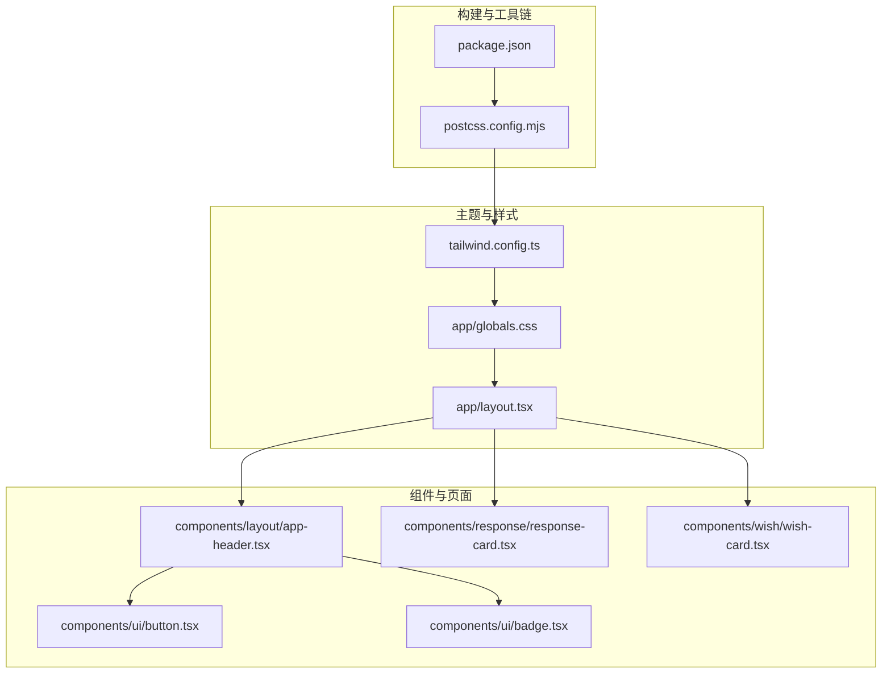
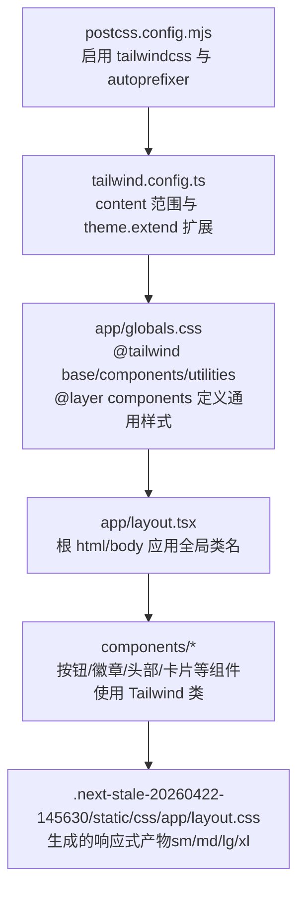
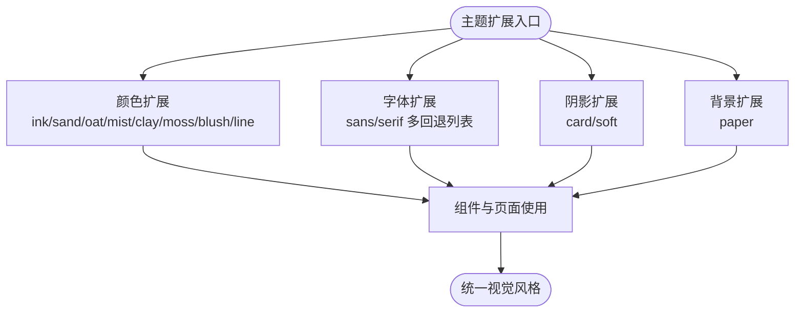
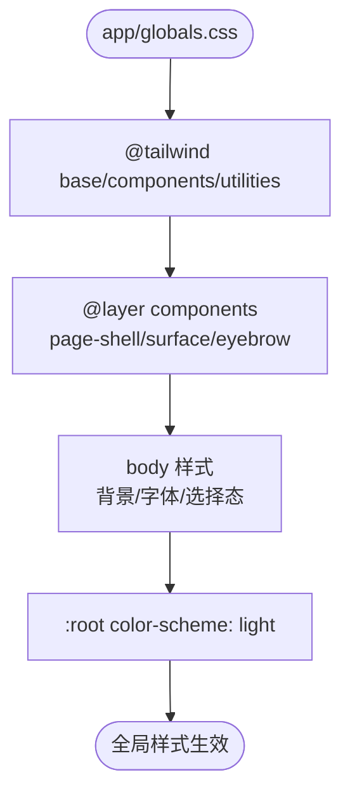
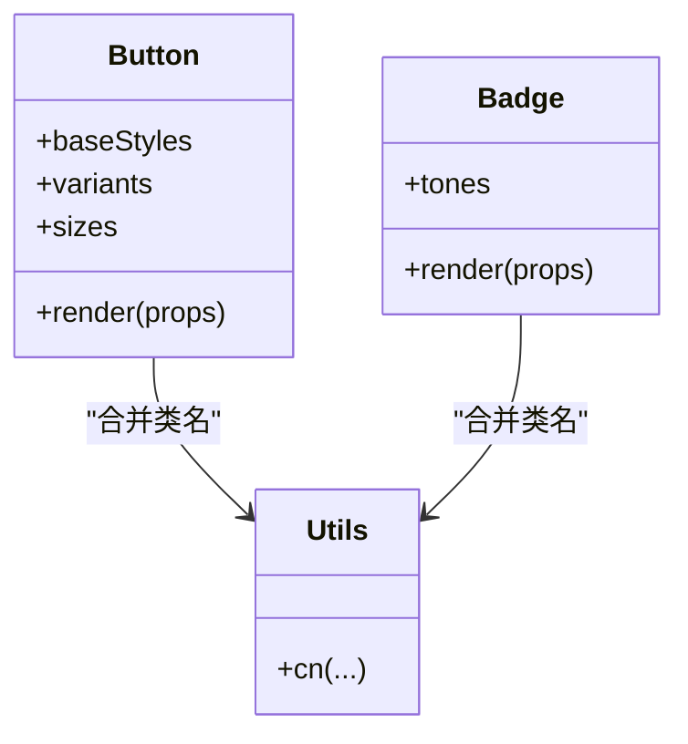
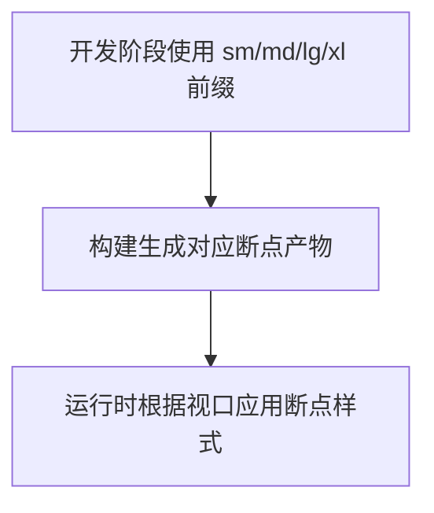
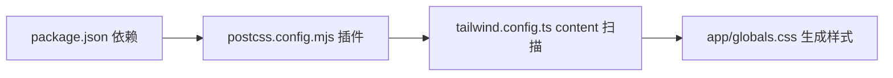

# 样式与主题架构

<cite>
**本文引用的文件**
- [tailwind.config.ts](file://tailwind.config.ts)
- [postcss.config.mjs](file://postcss.config.mjs)
- [package.json](file://package.json)
- [app/globals.css](file://app/globals.css)
- [app/layout.tsx](file://app/layout.tsx)
- [components/ui/button.tsx](file://components/ui/button.tsx)
- [components/ui/badge.tsx](file://components/ui/badge.tsx)
- [components/layout/app-header.tsx](file://components/layout/app-header.tsx)
- [components/response/response-card.tsx](file://components/response/response-card.tsx)
- [components/wish/wish-card.tsx](file://components/wish/wish-card.tsx)
- [lib/utils.ts](file://lib/utils.ts)
- [.next-stale-20260422-145630/static/css/app/layout.css](file://.next-stale-20260422-145630/static/css/app/layout.css)
</cite>

## 目录
1. [引言](#引言)
2. [项目结构](#项目结构)
3. [核心组件](#核心组件)
4. [架构总览](#架构总览)
5. [详细组件分析](#详细组件分析)
6. [依赖关系分析](#依赖关系分析)
7. [性能考量](#性能考量)
8. [故障排查指南](#故障排查指南)
9. [结论](#结论)
10. [附录](#附录)

## 引言
本文件面向“梦想回应平台”的样式与主题架构，围绕 Tailwind CSS 3.4.16 的实用优先理念，系统梳理自定义主题配置、颜色系统、字体与阴影体系、背景图案、响应式断点与组件样式组织方式，并结合工程化构建链路（PostCSS、Next.js）说明样式生成、按需加载与 Tree Shaking 的实现路径。同时提供暗色模式与无障碍支持的扩展建议，以及样式定制与性能优化的最佳实践。

## 项目结构
样式与主题相关的关键文件分布如下：
- 构建与工具链：postcss.config.mjs、package.json
- 主题配置：tailwind.config.ts
- 全局样式：app/globals.css
- 页面布局与根节点：app/layout.tsx
- 组件样式：components/ui/button.tsx、components/ui/badge.tsx、components/layout/app-header.tsx、components/response/response-card.tsx、components/wish/wish-card.tsx
- 工具函数：lib/utils.ts
- 响应式产物：.next-stale-20260422-145630/static/css/app/layout.css（包含 sm/md/lg 等断点产物）

图表来源
- [postcss.config.mjs:1-9](file://postcss.config.mjs#L1-L9)
- [package.json:1-29](file://package.json#L1-L29)
- [tailwind.config.ts:1-55](file://tailwind.config.ts#L1-L55)
- [app/globals.css:1-67](file://app/globals.css#L1-L67)
- [app/layout.tsx:1-29](file://app/layout.tsx#L1-L29)
- [components/ui/button.tsx:1-75](file://components/ui/button.tsx#L1-L75)
- [components/ui/badge.tsx:1-37](file://components/ui/badge.tsx#L1-L37)
- [components/layout/app-header.tsx:1-64](file://components/layout/app-header.tsx#L1-L64)
- [components/response/response-card.tsx:1-48](file://components/response/response-card.tsx#L1-L48)
- [components/wish/wish-card.tsx:1-93](file://components/wish/wish-card.tsx#L1-L93)

章节来源
- [postcss.config.mjs:1-9](file://postcss.config.mjs#L1-L9)
- [package.json:1-29](file://package.json#L1-L29)
- [tailwind.config.ts:1-55](file://tailwind.config.ts#L1-L55)
- [app/globals.css:1-67](file://app/globals.css#L1-L67)
- [app/layout.tsx:1-29](file://app/layout.tsx#L1-L29)

## 核心组件
- 主题配置与颜色系统
  - 在主题扩展中新增一组品牌色阶，如墨（ink）、沙（sand）、燕麦（oat）、雾（mist）、粘土（clay）、苔藓（moss）、腮红（blush）、线条（line），并以语义命名用于组件与页面。
  - 字体系统扩展了无衬线与衬线两套族列表，确保在不同操作系统与语言环境下有良好的回退与本地化体验。
  - 阴影与背景图案通过扩展键统一管理，便于在组件中复用一致的视觉层级与材质感。
- 全局样式与根节点
  - 在全局样式中引入三类 Tailwind 层级（base/components/utilities），并在 :root 中声明 color-scheme: light，为后续暗色模式提供基础。
  - body 设置了渐变背景与主文字色，保证页面基调；同时对选择态、按钮/输入等进行字体继承与基础排版统一。
  - 使用 @layer components 定义通用容器与表面样式（如 page-shell、surface），形成可复用的布局与卡片基底。
- 组件样式组织
  - 按钮组件采用组合式风格（variants/sizes/baseStyles）与条件合并类名的模式，确保可维护性与一致性。
  - 徽章组件通过 tone 映射不同色彩与前缀色，形成语义化标签体系。
  - 头部导航、愿望卡片、回应卡片等均直接使用 Tailwind 类名与主题色，体现实用优先的设计哲学。

章节来源
- [tailwind.config.ts:10-49](file://tailwind.config.ts#L10-L49)
- [app/globals.css:5-66](file://app/globals.css#L5-L66)
- [components/ui/button.tsx:6-22](file://components/ui/button.tsx#L6-L22)
- [components/ui/badge.tsx:5-12](file://components/ui/badge.tsx#L5-L12)
- [components/layout/app-header.tsx:22-61](file://components/layout/app-header.tsx#L22-L61)
- [components/response/response-card.tsx:18-45](file://components/response/response-card.tsx#L18-L45)
- [components/wish/wish-card.tsx:15-91](file://components/wish/wish-card.tsx#L15-L91)

## 架构总览
下图展示了从构建到运行时的样式生成与应用流程，包括 PostCSS 插件链、Tailwind 主题扩展、全局样式层与组件类名注入的关系。

图表来源
- [postcss.config.mjs:1-9](file://postcss.config.mjs#L1-L9)
- [tailwind.config.ts:3-9](file://tailwind.config.ts#L3-L9)
- [app/globals.css:1-3](file://app/globals.css#L1-L3)
- [app/layout.tsx:19-26](file://app/layout.tsx#L19-L26)
- [.next-stale-20260422-145630/static/css/app/layout.css:2191-2438](file://.next-stale-20260422-145630/static/css/app/layout.css#L2191-L2438)

## 详细组件分析

### 主题配置与颜色系统
- 颜色体系
  - 自定义品牌色以 ink、sand、oat、mist、clay、moss、blush、line 等命名，覆盖文本、边框、背景、阴影等场景。
  - 颜色命名遵循“语义化 + 视觉联想”，便于在组件中快速选择与替换。
- 字体系统
  - sans 与 serif 分别提供多平台回退列表，兼顾国际化与本地化显示。
- 阴影与背景
  - card 与 soft 阴影用于卡片与分层内容，paper 背景图案用于纸质感页面元素。

图表来源
- [tailwind.config.ts:10-49](file://tailwind.config.ts#L10-L49)

章节来源
- [tailwind.config.ts:10-49](file://tailwind.config.ts#L10-L49)

### 全局样式与通用组件层
- 全局重置与基础排版
  - 在 :root 声明 light color-scheme，为暗色模式预留开关。
  - body 设置渐变背景与主文字色，确保页面基调一致。
  - 对 a、button、input、textarea 等进行字体继承，提升一致性。
- 通用组件层
  - page-shell：统一页面最大宽度与内边距，适配移动端到桌面端。
  - surface：卡片表面的基础圆角、边框、阴影与背景，作为卡片基底。
  - eyebrow：细小标题样式，用于强调性信息。

图表来源
- [app/globals.css:1-66](file://app/globals.css#L1-L66)

章节来源
- [app/globals.css:5-66](file://app/globals.css#L5-L66)

### 组件样式组织与优先级
- 组件样式组织
  - 按钮：baseStyles 作为基础交互与过渡，variants 控制外观（primary/secondary/ghost），sizes 控制尺寸，最终通过工具函数合并类名。
  - 徽章：通过 tone 映射不同色彩与前缀色，形成语义化标签。
  - 头部导航、卡片等组件直接使用主题色与通用层类名，保持一致性。
- 类名合并与优先级
  - 工具函数 cn 将多个类名按顺序拼接，后传入的 className 可覆盖默认样式，形成“默认样式 < 组合变体 < 用户自定义”的优先级链。
  - Tailwind 采用“后出现者优先”的原则，因此用户自定义类应置于最后以覆盖默认样式。

图表来源
- [components/ui/button.tsx:6-22](file://components/ui/button.tsx#L6-L22)
- [components/ui/badge.tsx:5-12](file://components/ui/badge.tsx#L5-L12)
- [lib/utils.ts:1-3](file://lib/utils.ts#L1-L3)

章节来源
- [components/ui/button.tsx:6-22](file://components/ui/button.tsx#L6-L22)
- [components/ui/badge.tsx:5-12](file://components/ui/badge.tsx#L5-L12)
- [lib/utils.ts:1-3](file://lib/utils.ts#L1-L3)

### 响应式设计策略
- 断点与产物
  - 产物中包含 sm、md、lg、xl 等断点的样式，用于在不同屏幕尺寸下调整布局与排版。
- 实践示例
  - 页面与组件广泛使用 sm:、md:、lg: 前缀类，确保在移动端到桌面端的连续体验。
- 优化建议
  - 在 tailwind.config.ts 中仅保留实际使用的断点，减少产物体积。
  - 合理拆分组件，避免在小屏上渲染大段复杂样式。

图表来源
- [.next-stale-20260422-145630/static/css/app/layout.css:2191-2438](file://.next-stale-20260422-145630/static/css/app/layout.css#L2191-L2438)

章节来源
- [.next-stale-20260422-145630/static/css/app/layout.css:2191-2438](file://.next-stale-20260422-145630/static/css/app/layout.css#L2191-L2438)

### 暗色模式与无障碍支持
- 暗色模式
  - 当前在 :root 声明 color-scheme: light，未见暗色模式切换逻辑。
  - 建议：在根节点增加暗色模式开关，动态切换类名或 CSS 变量，配合主题扩展中的颜色映射实现深浅适配。
- 无障碍
  - 使用 focus-visible:outline 与 focus-visible:ring 提升键盘可达性。
  - 文本对比度与可读性：确保 ink 与背景色满足 WCAG AA/AAA 要求；必要时引入对比度校验工具。

章节来源
- [app/globals.css:5-7](file://app/globals.css#L5-L7)
- [components/ui/button.tsx:6-7](file://components/ui/button.tsx#L6-L7)

## 依赖关系分析
- 构建链路
  - package.json 声明 tailwindcss、postcss、autoprefixer 版本，确保与 Tailwind 3.4.16 兼容。
  - postcss.config.mjs 启用 tailwindcss 与 autoprefixer，完成从源码到浏览器兼容样式的转换。
- 主题扫描范围
  - tailwind.config.ts 的 content 指向 app、components、data、lib 目录，确保所有使用 Tailwind 类名的文件都会被扫描并生成所需样式。

图表来源
- [package.json:16-26](file://package.json#L16-L26)
- [postcss.config.mjs:1-9](file://postcss.config.mjs#L1-L9)
- [tailwind.config.ts:4-9](file://tailwind.config.ts#L4-L9)

章节来源
- [package.json:16-26](file://package.json#L16-L26)
- [postcss.config.mjs:1-9](file://postcss.config.mjs#L1-L9)
- [tailwind.config.ts:4-9](file://tailwind.config.ts#L4-L9)

## 性能考量
- 按需加载与 Tree Shaking
  - 通过 tailwind.config.ts 的 content 精准扫描，仅生成实际使用的类名，避免无用样式进入产物。
  - 组件中尽量使用原子类，减少自定义 CSS 文件体积。
- 产物体积控制
  - 移除未使用的断点与颜色，避免生成冗余样式。
  - 将重复的样式抽象为通用层（如 @layer components），减少重复类名。
- 渲染性能
  - 避免在首屏强制触发大量重排/重绘（如大范围阴影与复杂背景）。
  - 合理使用 transform 与 opacity 动画，利用 GPU 加速。

## 故障排查指南
- 样式未生效
  - 检查 tailwind.config.ts 的 content 是否包含当前文件路径。
  - 确认 app/globals.css 已在根布局中导入。
- 响应式样式异常
  - 查看断点产物是否正确生成，确认 sm/md/lg/xl 前缀使用是否符合预期。
- 暗色模式不工作
  - 在根节点添加暗色模式切换逻辑，并确保颜色映射与对比度满足要求。
- 可访问性问题
  - 检查焦点可见性、对比度与键盘导航可用性，必要时补充测试用例。

章节来源
- [tailwind.config.ts:4-9](file://tailwind.config.ts#L4-L9)
- [app/globals.css:1-3](file://app/globals.css#L1-L3)
- [app/layout.tsx:6](file://app/layout.tsx#L6)

## 结论
本项目以 Tailwind CSS 3.4.16 为核心，通过主题扩展与全局样式层实现了统一的品牌色彩、字体与视觉体系；组件层采用实用优先的类名组织方式，辅以工具函数实现灵活覆盖。构建链路清晰，按需生成样式，具备良好的可维护性与扩展性。建议后续完善暗色模式与无障碍支持，并持续精简产物以提升性能。

## 附录
- 最佳实践清单
  - 使用语义化颜色命名，避免硬编码十六进制值。
  - 将通用样式抽象为 @layer components，减少重复。
  - 严格控制断点数量，按需启用 sm/md/lg/xl。
  - 在组件中优先使用原子类，避免过度自定义 CSS。
  - 为暗色模式与无障碍提供明确的切换与验证机制。