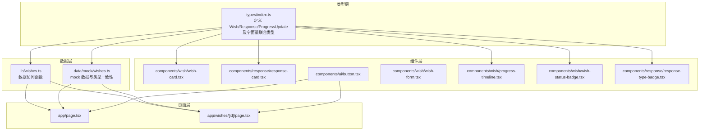
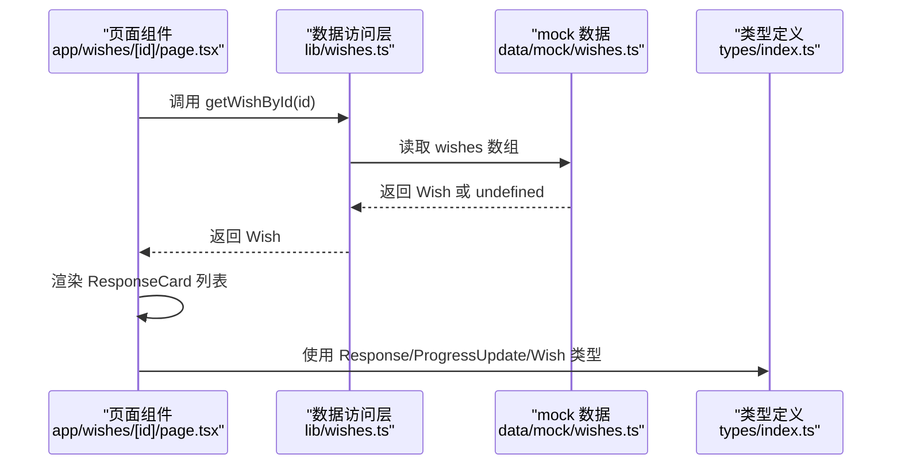
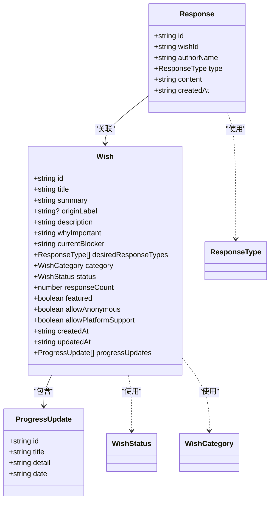
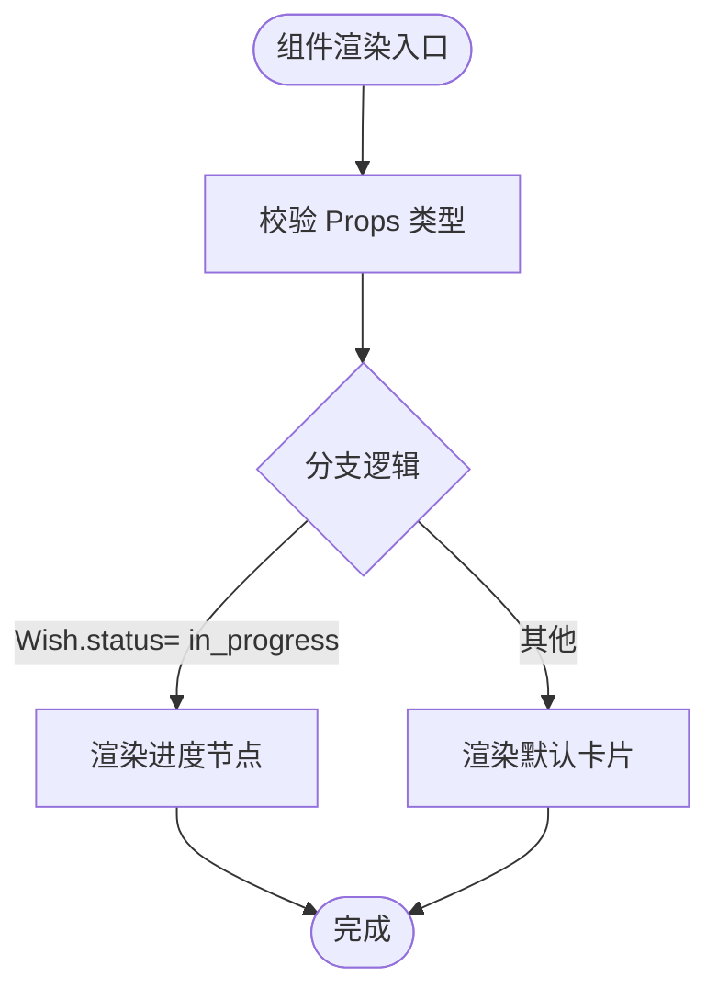
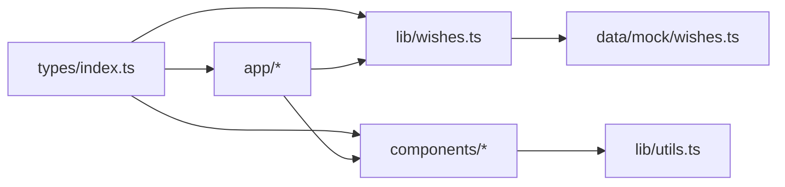

# 类型安全架构

<cite>
**本文引用的文件**
- [types/index.ts](file://types/index.ts)
- [lib/wishes.ts](file://lib/wishes.ts)
- [lib/utils.ts](file://lib/utils.ts)
- [tsconfig.json](file://tsconfig.json)
- [next.config.ts](file://next.config.ts)
- [components/wish/wish-card.tsx](file://components/wish/wish-card.tsx)
- [components/response/response-card.tsx](file://components/response/response-card.tsx)
- [components/ui/button.tsx](file://components/ui/button.tsx)
- [components/layout/app-header.tsx](file://components/layout/app-header.tsx)
- [components/wish/wish-form.tsx](file://components/wish/wish-form.tsx)
- [components/wish/progress-timeline.tsx](file://components/wish/progress-timeline.tsx)
- [app/page.tsx](file://app/page.tsx)
- [app/wishes/[id]/page.tsx](file://app/wishes/[id]/page.tsx)
- [data/mock/wishes.ts](file://data/mock/wishes.ts)
- [components/wish/wish-status-badge.tsx](file://components/wish/wish-status-badge.tsx)
- [components/response/response-type-badge.tsx](file://components/response/response-type-badge.tsx)
</cite>

## 目录
1. [简介](#简介)
2. [项目结构](#项目结构)
3. [核心组件](#核心组件)
4. [架构总览](#架构总览)
5. [详细组件分析](#详细组件分析)
6. [依赖分析](#依赖分析)
7. [性能考虑](#性能考虑)
8. [故障排查指南](#故障排查指南)
9. [结论](#结论)
10. [附录](#附录)

## 简介
本文件面向“梦想回应平台”的类型安全架构，基于 TypeScript 5.7.2 与 Next.js（App Router）进行全栈类型设计。文档聚焦以下方面：
- 核心实体类型：Wish、Response、ProgressUpdate 及其字面量联合类型（WishStatus、ResponseType、WishCategory）
- 组件层类型：Props、State 的自动推导与显式约束
- 工具函数与泛型：类型参数与工具函数的类型约束
- 类型守卫与断言：安全使用策略
- 类型扩展与向后兼容：最佳实践
- 类型错误预防与调试：方法论与工具链

## 项目结构
项目采用按功能域分层的组织方式：
- types：集中定义全局类型与字面量联合类型
- lib：业务数据访问层（当前使用 mock 数据，未来可替换为数据库查询）
- data/mock：模拟数据与类型一致性校验
- components：UI 组件与业务组件，严格通过类型约束 Props
- app：页面级组件，负责数据获取与渲染
- 配置：tsconfig.json 启用严格模式；next.config.ts 提供 Next.js 配置

图表来源
- [types/index.ts:1-58](file://types/index.ts#L1-L58)
- [lib/wishes.ts:1-27](file://lib/wishes.ts#L1-L27)
- [data/mock/wishes.ts:1-210](file://data/mock/wishes.ts#L1-L210)
- [components/wish/wish-card.tsx:1-93](file://components/wish/wish-card.tsx#L1-L93)
- [components/response/response-card.tsx:1-48](file://components/response/response-card.tsx#L1-L48)
- [components/ui/button.tsx:1-75](file://components/ui/button.tsx#L1-L75)
- [components/wish/wish-form.tsx:1-264](file://components/wish/wish-form.tsx#L1-L264)
- [components/wish/progress-timeline.tsx:1-76](file://components/wish/progress-timeline.tsx#L1-L76)
- [components/wish/wish-status-badge.tsx:1-39](file://components/wish/wish-status-badge.tsx#L1-L39)
- [components/response/response-type-badge.tsx:1-43](file://components/response/response-type-badge.tsx#L1-L43)
- [app/page.tsx:1-29](file://app/page.tsx#L1-L29)
- [app/wishes/[id]/page.tsx:1-184](file://app/wishes/[id]/page.tsx#L1-L184)

章节来源
- [tsconfig.json:1-29](file://tsconfig.json#L1-L29)
- [next.config.ts:1-9](file://next.config.ts#L1-L9)

## 核心组件
本节梳理类型系统在各层的关键应用与设计要点。

- 字面量联合类型
  - WishStatus：用于表示愿望状态的字面量集合，确保状态值在编译期受控
  - ResponseType：用于标识回应类型，保证类型安全的映射与渲染
  - WishCategory：用于分类过滤与展示
- 实体接口
  - Wish：包含愿望基本信息、状态、分类、回应计数、匿名与平台支持开关、时间戳、进度更新数组等字段
  - Response：包含回应作者名、类型、内容、关联愿望 ID、创建时间
  - ProgressUpdate：用于记录平台推进的节点信息
- 工具函数类型
  - cn(...)：接收可选布尔/空值，返回字符串，保障类名拼接安全
  - formatDate(...)：接收日期字符串，返回本地化格式化后的字符串

章节来源
- [types/index.ts:1-58](file://types/index.ts#L1-L58)
- [lib/utils.ts:1-12](file://lib/utils.ts#L1-L12)

## 架构总览
类型安全贯穿“类型层 → 数据层 → 组件层 → 页面层”的全链路：
- 类型层统一定义实体与字面量，避免魔法字符串与隐式类型
- 数据层通过函数签名约束入参与返回值，保证调用方契约清晰
- 组件层通过 Props 接口与类型别名约束渲染行为
- 页面层通过静态参数生成与异步数据流确保路由与数据一致性

图表来源
- [app/wishes/[id]/page.tsx:19-31](file://app/wishes/[id]/page.tsx#L19-L31)
- [lib/wishes.ts:15-17](file://lib/wishes.ts#L15-L17)
- [data/mock/wishes.ts:12-150](file://data/mock/wishes.ts#L12-L150)
- [types/index.ts:30-57](file://types/index.ts#L30-L57)

## 详细组件分析

### 实体类型与字面量联合类型
- 设计原则
  - 使用字面量联合类型替代字符串常量，防止拼写错误与非法值注入
  - 将枚举语义内聚到类型层面，便于后续迁移至强枚举或数值枚举
- 关键类型
  - WishStatus：open、clarifying、in_progress、supported、completed
  - ResponseType：Advice、Resource、Introduction、Opportunity、Support、Similar Experience
  - WishCategory：Life、Creative、Learning、Career、Community
- 接口设计
  - Wish：包含必需字段与可选字段，确保可选字段在使用时进行存在性检查
  - Response：通过 wishId 与 Wish 建立弱关联，利于后续数据库外键约束
  - ProgressUpdate：用于平台推进记录，字段均为字符串，便于统一格式化

图表来源
- [types/index.ts:1-58](file://types/index.ts#L1-L58)

章节来源
- [types/index.ts:1-58](file://types/index.ts#L1-L58)

### 组件类型参数与 Props 约束
- 组件 Props 显式声明，避免隐式 any
  - WishCard：接收 Wish 与可选 variant/className，内部根据状态与进度更新进行分支渲染
  - ResponseCard：接收 Response，使用 Record<ResponseType, string> 进行类型安全的映射
  - ProgressTimeline：接收 ProgressUpdate[]，在空数组时渲染占位
  - Button：区分 ButtonAsButtonProps 与 ButtonLinkProps，通过联合类型约束互斥属性
  - WishForm：使用 useState 与类型参数 ResponseType[] 约束选择集合
- 类型推导
  - ReactNode、Promise<{ id: string }> 等由 TS 自动推导，减少样板代码
  - 通过 Record<...> 将字面量联合类型映射为样式/文案配置，避免 switch/if 分支

图表来源
- [components/wish/wish-card.tsx:9-19](file://components/wish/wish-card.tsx#L9-L19)
- [components/response/response-card.tsx:14-18](file://components/response/response-card.tsx#L14-L18)
- [components/wish/progress-timeline.tsx:4-6](file://components/wish/progress-timeline.tsx#L4-L6)
- [components/ui/button.tsx:24-38](file://components/ui/button.tsx#L24-L38)
- [components/wish/wish-form.tsx:101-103](file://components/wish/wish-form.tsx#L101-L103)

章节来源
- [components/wish/wish-card.tsx:1-93](file://components/wish/wish-card.tsx#L1-L93)
- [components/response/response-card.tsx:1-48](file://components/response/response-card.tsx#L1-L48)
- [components/wish/progress-timeline.tsx:1-76](file://components/wish/progress-timeline.tsx#L1-L76)
- [components/ui/button.tsx:1-75](file://components/ui/button.tsx#L1-L75)
- [components/wish/wish-form.tsx:1-264](file://components/wish/wish-form.tsx#L1-L264)

### 工具函数与类型约束
- cn(...classes: Array<string | false | null | undefined>)
  - 通过联合类型约束输入，利用 filter(Boolean) 在运行时安全过滤无效类名
- formatDate(dateString: string)
  - 输入为字符串，输出为本地化格式字符串，避免直接操作 Date 对象导致的异常

章节来源
- [lib/utils.ts:1-12](file://lib/utils.ts#L1-L12)

### 泛型类型的应用场景
- 当前代码未直接使用显式泛型类型参数（如<T>），但具备良好的泛型使用基础：
  - ReactNode、Promise<T> 等内置泛型已在组件与页面中广泛使用
  - 可在工具函数中引入泛型以提升复用性（例如，通用的列表项渲染函数）
  - 在未来接入数据库查询时，可通过泛型约束查询结果与实体映射

章节来源
- [components/ui/button.tsx:24-38](file://components/ui/button.tsx#L24-L38)
- [app/wishes/[id]/page.tsx:20-23](file://app/wishes/[id]/page.tsx#L20-L23)

### 类型守卫与类型断言的安全使用
- 类型守卫
  - 使用字面量联合类型与 Record 映射，避免冗长的 if/else 或 switch
  - 在数组过滤与排序中，利用类型系统确保元素满足接口约束
- 类型断言
  - 当 mock 数据与接口定义一致时，可谨慎使用断言（例如将字面量数组断言为 ResponseType[]）
  - 建议优先通过构造函数与工厂函数保证类型安全，减少断言使用

章节来源
- [components/response/response-card.tsx:5-12](file://components/response/response-card.tsx#L5-L12)
- [components/wish/wish-form.tsx:22-23](file://components/wish/wish-form.tsx#L22-L23)
- [data/mock/wishes.ts:3-10](file://data/mock/wishes.ts#L3-L10)

### 类型扩展与向后兼容的最佳实践
- 新增字段
  - 优先在现有接口上添加可选字段，避免破坏既有调用方
  - 通过默认值与条件渲染确保旧数据兼容
- 字面量联合类型扩展
  - 新增状态或类型时，同步更新映射表与渲染逻辑
- 数据访问层扩展
  - 保持函数签名稳定，新增参数使用可选参数或配置对象
- 页面静态参数
  - generateStaticParams 返回 Promise<{ id: string }>，确保路由参数类型安全

章节来源
- [app/wishes/[id]/page.tsx:13-17](file://app/wishes/[id]/page.tsx#L13-L17)
- [lib/wishes.ts:15-17](file://lib/wishes.ts#L15-L17)

### 类型错误的预防与调试
- 编译时严格检查
  - tsconfig.json 启用 strict、noImplicitAny、noUncheckedIndexedAccess 等严格选项
  - isolatedModules 与 noEmit 配合确保构建稳定性
- 运行时辅助
  - 使用 cn 与 formatDate 等工具函数降低运行时错误概率
  - 在组件中对可选字段进行存在性检查后再使用
- 调试建议
  - 使用 VS Code 的类型提示与快速修复
  - 在复杂映射中使用中间变量保存推导结果，便于查看类型面板

章节来源
- [tsconfig.json:7-13](file://tsconfig.json#L7-L13)
- [lib/utils.ts:1-12](file://lib/utils.ts#L1-L12)

## 依赖分析
类型系统在各模块间的耦合关系如下：
- types/index.ts 为全局类型中心，被 lib、components、app 广泛依赖
- lib/wishes.ts 依赖 data/mock/wishes.ts 的类型一致性
- components 通过类型约束与 props 交互，避免跨组件类型漂移
- 页面层通过 generateStaticParams 与数据访问层协作，确保路由与数据类型一致

图表来源
- [types/index.ts:1-58](file://types/index.ts#L1-L58)
- [lib/wishes.ts:1-27](file://lib/wishes.ts#L1-L27)
- [data/mock/wishes.ts:1-210](file://data/mock/wishes.ts#L1-L210)
- [lib/utils.ts:1-12](file://lib/utils.ts#L1-L12)
- [app/page.tsx:1-29](file://app/page.tsx#L1-L29)
- [app/wishes/[id]/page.tsx:1-184](file://app/wishes/[id]/page.tsx#L1-L184)

章节来源
- [types/index.ts:1-58](file://types/index.ts#L1-L58)
- [lib/wishes.ts:1-27](file://lib/wishes.ts#L1-L27)
- [data/mock/wishes.ts:1-210](file://data/mock/wishes.ts#L1-L210)
- [lib/utils.ts:1-12](file://lib/utils.ts#L1-L12)
- [app/page.tsx:1-29](file://app/page.tsx#L1-L29)
- [app/wishes/[id]/page.tsx:1-184](file://app/wishes/[id]/page.tsx#L1-L184)

## 性能考虑
- 类型推导与编译期优化
  - 严格类型检查有助于 IDE 快速定位错误，减少运行时开销
- 组件渲染
  - 使用字面量联合类型与 Record 映射，避免重复判断，提升渲染性能
- 数据访问
  - 通过 lib 层封装数据访问，便于未来替换为数据库查询而不影响组件层

## 故障排查指南
- 常见问题
  - 字符串拼写错误导致的状态/类型不匹配：使用字面量联合类型替代字符串常量
  - 可选字段未判空导致的运行时错误：在使用前进行存在性检查
  - Props 类型不匹配：显式声明组件 Props 接口，避免隐式 any
- 调试步骤
  - 打开 tsconfig.json 的严格模式，观察编译器报错
  - 在 VS Code 中使用“Go to Type Definition”与“Peek Definition”查看类型来源
  - 对复杂映射使用中间变量保存推导结果，便于在类型面板查看

章节来源
- [types/index.ts:1-58](file://types/index.ts#L1-L58)
- [components/wish/wish-card.tsx:9-19](file://components/wish/wish-card.tsx#L9-L19)
- [components/response/response-card.tsx:5-12](file://components/response/response-card.tsx#L5-L12)

## 结论
本项目通过严格的类型系统设计，实现了从类型层到页面层的全栈类型安全：
- 字面量联合类型与实体接口确保了状态与数据的合法性
- 组件 Props 与工具函数类型约束提升了可维护性与可读性
- 类型守卫与最小断言策略降低了运行时风险
- 未来可平滑扩展至数据库查询与更复杂的泛型场景

## 附录
- 配置要点
  - tsconfig.json 启用严格模式与增量编译，确保类型安全与构建效率
  - next.config.ts 提供 Next.js 运行时配置，与类型系统协同工作

章节来源
- [tsconfig.json:1-29](file://tsconfig.json#L1-L29)
- [next.config.ts:1-9](file://next.config.ts#L1-L9)