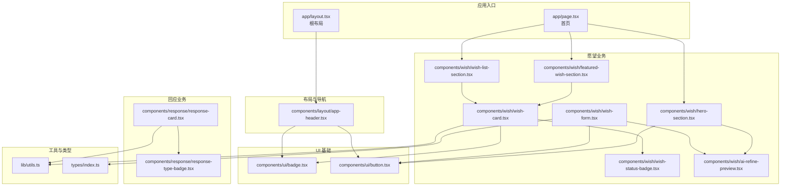
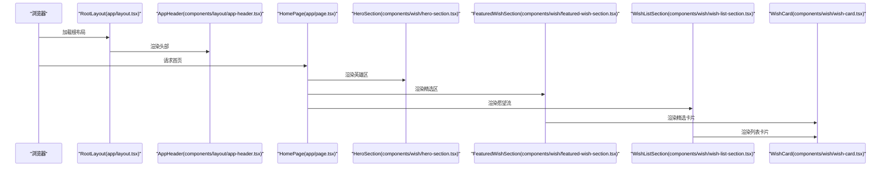
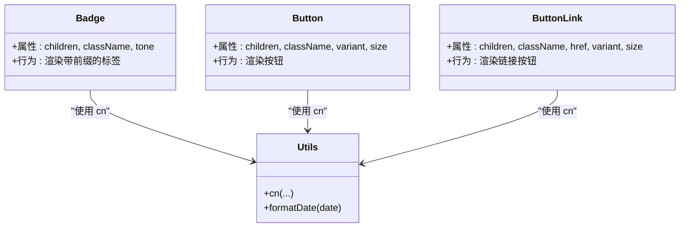
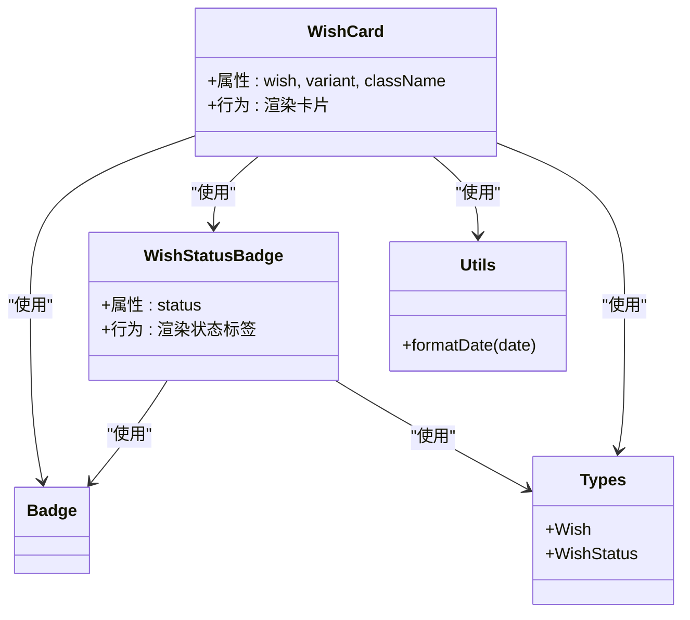
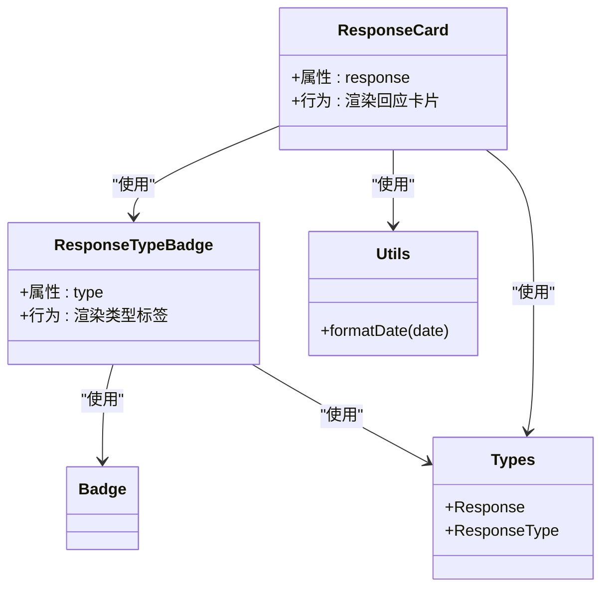
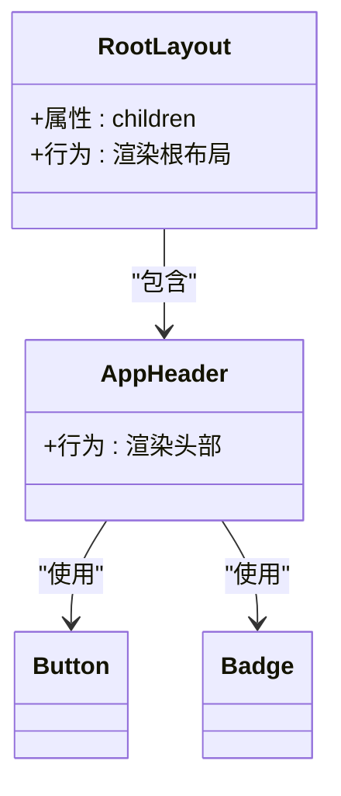
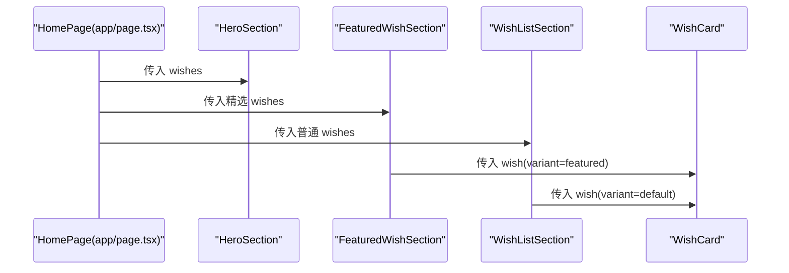
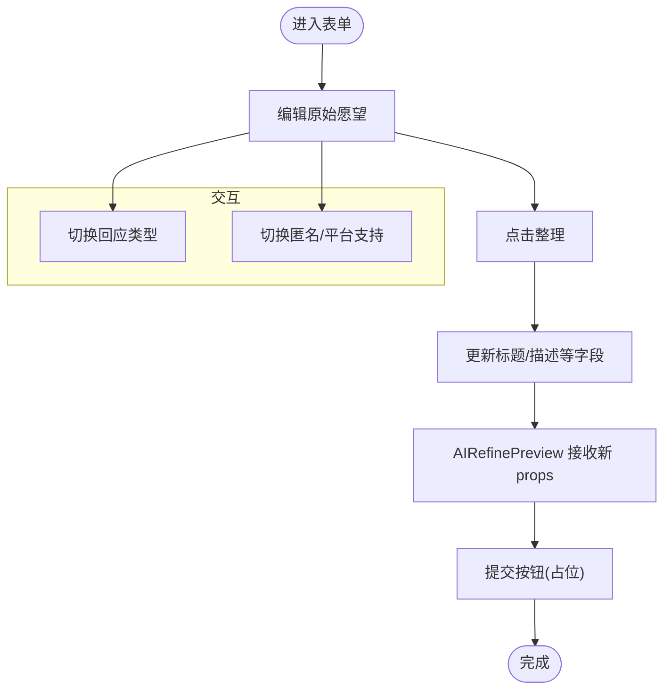
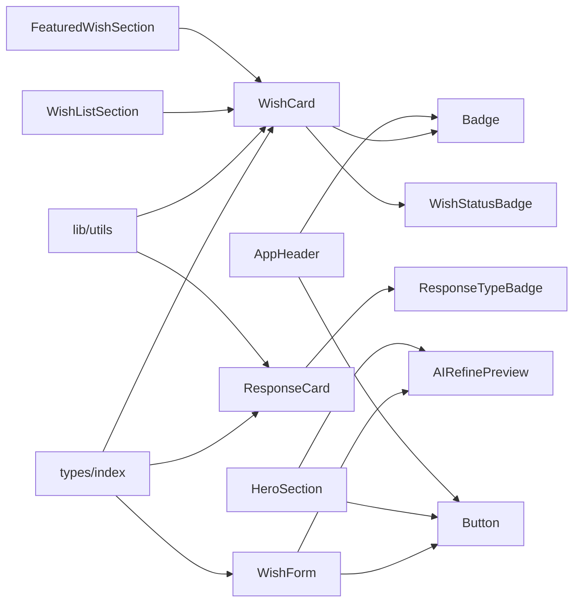

# 组件架构

<cite>
**本文引用的文件**
- [package.json](file://package.json)
- [next.config.ts](file://next.config.ts)
- [app/layout.tsx](file://app/layout.tsx)
- [app/page.tsx](file://app/page.tsx)
- [components/ui/badge.tsx](file://components/ui/badge.tsx)
- [components/ui/button.tsx](file://components/ui/button.tsx)
- [components/layout/app-header.tsx](file://components/layout/app-header.tsx)
- [components/wish/wish-card.tsx](file://components/wish/wish-card.tsx)
- [components/wish/wish-status-badge.tsx](file://components/wish/wish-status-badge.tsx)
- [components/response/response-card.tsx](file://components/response/response-card.tsx)
- [components/response/response-type-badge.tsx](file://components/response/response-type-badge.tsx)
- [components/wish/featured-wish-section.tsx](file://components/wish/featured-wish-section.tsx)
- [components/wish/wish-list-section.tsx](file://components/wish/wish-list-section.tsx)
- [components/wish/hero-section.tsx](file://components/wish/hero-section.tsx)
- [components/wish/wish-form.tsx](file://components/wish/wish-form.tsx)
- [components/wish/ai-refine-preview.tsx](file://components/wish/ai-refine-preview.tsx)
- [lib/utils.ts](file://lib/utils.ts)
- [types/index.ts](file://types/index.ts)
</cite>

## 目录
1. [简介](#简介)
2. [项目结构](#项目结构)
3. [核心组件](#核心组件)
4. [架构总览](#架构总览)
5. [详细组件分析](#详细组件分析)
6. [依赖分析](#依赖分析)
7. [性能考虑](#性能考虑)
8. [故障排查指南](#故障排查指南)
9. [结论](#结论)
10. [附录](#附录)

## 简介
本文件为“梦想回应平台”的组件架构文档，聚焦于基于 React 19.0.0 的组件化设计与 Next.js 应用中的页面与组件组织方式。文档从三层组件层次结构出发，系统阐述 UI 基础组件（Badge、Button）、业务组件（WishCard、ResponseCard）、页面组件（RootLayout、AppHeader）的职责划分与依赖关系；总结组件通信模式（props 传递、事件处理、状态提升）；提出可复用与可扩展的设计原则，并给出性能优化与最佳实践建议。

## 项目结构
项目采用按功能域分层的目录组织方式：
- app：Next.js App Router 页面与布局
- components：可复用组件库
  - ui：通用 UI 基础组件
  - layout：布局与导航组件
  - wish：愿望相关业务组件
  - response：回应相关业务组件
- lib：工具函数与数据访问封装
- types：全局类型定义
- 根级配置：Next 配置、包管理等

图表来源
- [app/layout.tsx:13-28](file://app/layout.tsx#L13-L28)
- [app/page.tsx:6-28](file://app/page.tsx#L6-L28)
- [components/layout/app-header.tsx:22-63](file://components/layout/app-header.tsx#L22-L63)
- [components/ui/badge.tsx:20-36](file://components/ui/badge.tsx#L20-L36)
- [components/ui/button.tsx:40-74](file://components/ui/button.tsx#L40-L74)
- [components/wish/wish-card.tsx:15-92](file://components/wish/wish-card.tsx#L15-L92)
- [components/wish/wish-status-badge.tsx:34-38](file://components/wish/wish-status-badge.tsx#L34-L38)
- [components/response/response-card.tsx:18-47](file://components/response/response-card.tsx#L18-L47)
- [components/response/response-type-badge.tsx:38-42](file://components/response/response-type-badge.tsx#L38-L42)
- [components/wish/featured-wish-section.tsx:9-46](file://components/wish/featured-wish-section.tsx#L9-L46)
- [components/wish/wish-list-section.tsx:12-76](file://components/wish/wish-list-section.tsx#L12-L76)
- [components/wish/hero-section.tsx:10-52](file://components/wish/hero-section.tsx#L10-L52)
- [components/wish/wish-form.tsx:95-263](file://components/wish/wish-form.tsx#L95-L263)
- [components/wish/ai-refine-preview.tsx:13-58](file://components/wish/ai-refine-preview.tsx#L13-L58)
- [lib/utils.ts:1-12](file://lib/utils.ts#L1-L12)
- [types/index.ts:30-57](file://types/index.ts#L30-L57)

章节来源
- [package.json:11-15](file://package.json#L11-L15)
- [next.config.ts:3-6](file://next.config.ts#L3-L6)
- [app/layout.tsx:13-28](file://app/layout.tsx#L13-L28)
- [app/page.tsx:6-28](file://app/page.tsx#L6-L28)

## 核心组件
本节对三层组件中的关键组件进行职责与接口说明，强调其可复用性与扩展性。

- UI 基础组件
  - Badge：语义化标签，支持多种色调与样式组合，作为装饰与状态标识的基础元素。
  - Button：统一按钮风格，支持多种变体与尺寸，同时提供 Button 与 ButtonLink 两种渲染形态。
- 业务组件
  - WishCard：愿望卡片，承载标题、摘要、分类、状态、进度/回应数等信息，支持普通与精选两种展示变体。
  - ResponseCard：回应卡片，展示回应类型、作者、时间、内容及帮助价值说明。
- 页面组件
  - RootLayout：根布局，注入全局头部与主内容区域。
  - AppHeader：站点头部，包含 Logo、导航与发布入口。

章节来源
- [components/ui/badge.tsx:14-36](file://components/ui/badge.tsx#L14-L36)
- [components/ui/button.tsx:24-74](file://components/ui/button.tsx#L24-L74)
- [components/wish/wish-card.tsx:9-92](file://components/wish/wish-card.tsx#L9-L92)
- [components/response/response-card.tsx:14-47](file://components/response/response-card.tsx#L14-L47)
- [app/layout.tsx:13-28](file://app/layout.tsx#L13-L28)
- [components/layout/app-header.tsx:22-63](file://components/layout/app-header.tsx#L22-L63)

## 架构总览
下图展示了页面渲染流程与组件间的调用关系，体现从根布局到页面再到业务组件的数据流与依赖链。

图表来源
- [app/layout.tsx:13-28](file://app/layout.tsx#L13-L28)
- [components/layout/app-header.tsx:22-63](file://components/layout/app-header.tsx#L22-L63)
- [app/page.tsx:6-28](file://app/page.tsx#L6-L28)
- [components/wish/hero-section.tsx:10-52](file://components/wish/hero-section.tsx#L10-L52)
- [components/wish/featured-wish-section.tsx:9-46](file://components/wish/featured-wish-section.tsx#L9-L46)
- [components/wish/wish-list-section.tsx:12-76](file://components/wish/wish-list-section.tsx#L12-L76)
- [components/wish/wish-card.tsx:15-92](file://components/wish/wish-card.tsx#L15-L92)

## 详细组件分析

### UI 基础组件：Badge 与 Button
- 设计要点
  - Badge：通过 tone 映射不同配色与前缀样式，保持视觉一致性与可扩展性。
  - Button：通过 variants/sizes 组合生成统一风格，ButtonLink 适配 Next.js Link，保证路由跳转与样式一致。
- 复用与扩展
  - 通过映射表集中管理样式，新增色调/变体时只需扩展映射，避免分散配置。
  - 接口分离（ButtonAsButtonProps/ButtonLinkProps）确保单一职责，降低耦合。
- 性能与可维护性
  - 使用 className 合并与条件渲染，减少不必要的 DOM 属性计算。

图表来源
- [components/ui/badge.tsx:20-36](file://components/ui/badge.tsx#L20-L36)
- [components/ui/button.tsx:40-74](file://components/ui/button.tsx#L40-L74)
- [lib/utils.ts:1-12](file://lib/utils.ts#L1-L12)

章节来源
- [components/ui/badge.tsx:14-36](file://components/ui/badge.tsx#L14-L36)
- [components/ui/button.tsx:24-74](file://components/ui/button.tsx#L24-L74)
- [lib/utils.ts:1-12](file://lib/utils.ts#L1-L12)

### 业务组件：WishCard 与 WishStatusBadge
- 设计要点
  - WishCard：根据 variant 切换样式与交互，内嵌 WishStatusBadge 与 Badge，统一状态与分类展示。
  - WishStatusBadge：将枚举状态映射为标签文案与色调，便于跨组件复用。
- 数据与样式
  - 通过 props 接收 Wish 对象，格式化时间与进度信息，保持展示与逻辑解耦。
- 可扩展性
  - 新增状态只需扩展映射表，不影响现有渲染逻辑。

图表来源
- [components/wish/wish-card.tsx:15-92](file://components/wish/wish-card.tsx#L15-L92)
- [components/wish/wish-status-badge.tsx:34-38](file://components/wish/wish-status-badge.tsx#L34-L38)
- [components/ui/badge.tsx:20-36](file://components/ui/badge.tsx#L20-L36)
- [lib/utils.ts:5-10](file://lib/utils.ts#L5-L10)
- [types/index.ts:30-48](file://types/index.ts#L30-L48)

章节来源
- [components/wish/wish-card.tsx:9-92](file://components/wish/wish-card.tsx#L9-L92)
- [components/wish/wish-status-badge.tsx:30-38](file://components/wish/wish-status-badge.tsx#L30-L38)
- [lib/utils.ts:5-10](file://lib/utils.ts#L5-L10)
- [types/index.ts:30-48](file://types/index.ts#L30-L48)

### 业务组件：ResponseCard 与 ResponseTypeBadge
- 设计要点
  - ResponseCard：展示回应类型、作者、时间、内容与帮助价值说明，结构清晰，便于扩展字段。
  - ResponseTypeBadge：将响应类型映射为标签文案与色调，与 Badge 组合形成统一风格。
- 可复用性
  - 类型映射集中管理，新增类型只需扩展映射表。

图表来源
- [components/response/response-card.tsx:18-47](file://components/response/response-card.tsx#L18-L47)
- [components/response/response-type-badge.tsx:38-42](file://components/response/response-type-badge.tsx#L38-L42)
- [components/ui/badge.tsx:20-36](file://components/ui/badge.tsx#L20-L36)
- [lib/utils.ts:5-10](file://lib/utils.ts#L5-L10)
- [types/index.ts:50-57](file://types/index.ts#L50-L57)

章节来源
- [components/response/response-card.tsx:14-47](file://components/response/response-card.tsx#L14-L47)
- [components/response/response-type-badge.tsx:34-42](file://components/response/response-type-badge.tsx#L34-L42)
- [lib/utils.ts:5-10](file://lib/utils.ts#L5-L10)
- [types/index.ts:50-57](file://types/index.ts#L50-L57)

### 页面组件：RootLayout 与 AppHeader
- 设计要点
  - RootLayout：统一注入头部与主内容容器，保证页面骨架一致。
  - AppHeader：包含 Logo、导航与发布入口，使用 ButtonLink 与 Badge 提升一致性。
- 依赖关系
  - RootLayout 依赖 AppHeader；AppHeader 依赖 Button 与 Badge。

图表来源
- [app/layout.tsx:13-28](file://app/layout.tsx#L13-L28)
- [components/layout/app-header.tsx:22-63](file://components/layout/app-header.tsx#L22-L63)
- [components/ui/button.tsx:40-74](file://components/ui/button.tsx#L40-L74)
- [components/ui/badge.tsx:20-36](file://components/ui/badge.tsx#L20-L36)

章节来源
- [app/layout.tsx:13-28](file://app/layout.tsx#L13-L28)
- [components/layout/app-header.tsx:22-63](file://components/layout/app-header.tsx#L22-L63)

### 页面组件：HomePage 与业务区块
- 设计要点
  - HomePage：聚合 HeroSection、FeaturedWishSection、WishListSection，负责数据筛选与传参。
  - FeaturedWishSection/WishListSection：分别渲染精选与列表视图，内部复用 WishCard。
- 组件通信
  - props 下发：Wish 对象与过滤器数组自上而下传递。
  - 事件处理：列表区的筛选按钮为静态展示，未绑定交互逻辑；表单区 WishForm 为客户端组件，内部状态驱动预览更新。

图表来源
- [app/page.tsx:6-28](file://app/page.tsx#L6-L28)
- [components/wish/hero-section.tsx:10-52](file://components/wish/hero-section.tsx#L10-L52)
- [components/wish/featured-wish-section.tsx:9-46](file://components/wish/featured-wish-section.tsx#L9-L46)
- [components/wish/wish-list-section.tsx:12-76](file://components/wish/wish-list-section.tsx#L12-L76)
- [components/wish/wish-card.tsx:15-92](file://components/wish/wish-card.tsx#L15-L92)

章节来源
- [app/page.tsx:6-28](file://app/page.tsx#L6-L28)
- [components/wish/featured-wish-section.tsx:9-46](file://components/wish/featured-wish-section.tsx#L9-L46)
- [components/wish/wish-list-section.tsx:12-76](file://components/wish/wish-list-section.tsx#L12-L76)
- [components/wish/wish-card.tsx:9-92](file://components/wish/wish-card.tsx#L9-L92)

### 表单组件：WishForm 与 AIRefinePreview
- 设计要点
  - WishForm：标记为客户端组件，内部使用 useState 管理多字段状态；提供“整理”按钮触发预览更新；支持选择回应类型与开关选项。
  - AIRefinePreview：接收标题、描述、为什么重要、当前卡点与期望回应类型，渲染结构化预览。
- 组件通信
  - 状态提升：WishForm 内部状态通过 props 下发至 AIRefinePreview，实现预览与表单联动。
  - 事件处理：字段变更、类型切换、开关切换均通过回调更新状态。

图表来源
- [components/wish/wish-form.tsx:95-263](file://components/wish/wish-form.tsx#L95-L263)
- [components/wish/ai-refine-preview.tsx:13-58](file://components/wish/ai-refine-preview.tsx#L13-L58)

章节来源
- [components/wish/wish-form.tsx:1-264](file://components/wish/wish-form.tsx#L1-L264)
- [components/wish/ai-refine-preview.tsx:1-59](file://components/wish/ai-refine-preview.tsx#L1-L59)

## 依赖分析
- 组件内聚与耦合
  - UI 基础组件（Badge、Button）低耦合、高内聚，被多个业务组件复用。
  - 业务组件（WishCard、ResponseCard）依赖 UI 基础组件与类型定义，保持清晰边界。
- 外部依赖
  - Next.js Link 用于导航；Tailwind CSS 用于样式；cn 工具函数用于类名合并。
- 类型安全
  - types/index.ts 定义 Wish、Response、枚举类型，贯穿组件与页面层，确保数据结构一致。

图表来源
- [components/layout/app-header.tsx:22-63](file://components/layout/app-header.tsx#L22-L63)
- [components/ui/button.tsx:40-74](file://components/ui/button.tsx#L40-L74)
- [components/ui/badge.tsx:20-36](file://components/ui/badge.tsx#L20-L36)
- [components/wish/hero-section.tsx:10-52](file://components/wish/hero-section.tsx#L10-L52)
- [components/wish/ai-refine-preview.tsx:13-58](file://components/wish/ai-refine-preview.tsx#L13-L58)
- [components/wish/featured-wish-section.tsx:9-46](file://components/wish/featured-wish-section.tsx#L9-L46)
- [components/wish/wish-list-section.tsx:12-76](file://components/wish/wish-list-section.tsx#L12-L76)
- [components/wish/wish-card.tsx:15-92](file://components/wish/wish-card.tsx#L15-L92)
- [components/wish/wish-status-badge.tsx:34-38](file://components/wish/wish-status-badge.tsx#L34-L38)
- [components/response/response-card.tsx:18-47](file://components/response/response-card.tsx#L18-L47)
- [components/response/response-type-badge.tsx:38-42](file://components/response/response-type-badge.tsx#L38-L42)
- [components/wish/wish-form.tsx:95-263](file://components/wish/wish-form.tsx#L95-L263)
- [lib/utils.ts:1-12](file://lib/utils.ts#L1-L12)
- [types/index.ts:30-57](file://types/index.ts#L30-L57)

章节来源
- [lib/utils.ts:1-12](file://lib/utils.ts#L1-L12)
- [types/index.ts:1-58](file://types/index.ts#L1-L58)

## 性能考虑
- 组件渲染优化
  - 使用 cn 合并类名，减少无效属性渲染；Badge/Button 的样式映射集中管理，避免重复计算。
  - 列表渲染时，WishListSection 通过列数与间距控制，结合 break-inside-avoid 与 hover 效果，平衡视觉与性能。
- 客户端组件
  - WishForm 标记为客户端组件，内部状态驱动预览更新，避免服务端渲染负担。
- 代码分割与懒加载
  - 页面组件按需加载，Next.js 默认按路由拆分构建产物；可在大型业务组件处进一步拆分以优化首屏。
- 样式与主题
  - Tailwind 配置集中，避免重复样式类导致的体积膨胀；通过映射表统一色调，减少样式分支。

## 故障排查指南
- 样式异常
  - 检查 cn 合并顺序与条件渲染，确保最终类名正确拼接。
  - 确认 Badge/Button 的 tone/variant 是否在映射表中存在对应项。
- 数据不一致
  - 确保 types/index.ts 中的枚举与映射表一致，避免渲染空白或错误文案。
- 导航问题
  - ButtonLink 与 Link 的 href 必须与路由匹配；检查 AppHeader 的导航项是否指向有效路径。
- 表单交互
  - WishForm 内部状态需通过回调更新；若预览未刷新，检查 props 是否随状态变化正确传递。

章节来源
- [lib/utils.ts:1-12](file://lib/utils.ts#L1-L12)
- [types/index.ts:1-58](file://types/index.ts#L1-L58)
- [components/layout/app-header.tsx:22-63](file://components/layout/app-header.tsx#L22-L63)
- [components/wish/wish-form.tsx:95-263](file://components/wish/wish-form.tsx#L95-L263)

## 结论
本项目以清晰的三层组件结构实现了 UI 与业务的解耦：UI 基础组件提供一致的视觉与交互基线；业务组件承载领域逻辑并复用基础组件；页面组件负责数据聚合与布局。通过 props 传递、事件处理与状态提升，组件间协作明确且易于扩展。配合类型系统与工具函数，整体具备良好的可维护性与可扩展性。建议在后续迭代中引入细粒度的代码分割与懒加载策略，持续优化首屏性能。

## 附录
- 技术栈与版本
  - React 19.0.0、Next.js、Tailwind CSS、TypeScript
- 最佳实践与命名约定
  - 组件命名：动词短语或名词短语，如 WishCard、ResponseCard、AppHeader。
  - Props 命名：语义化、简洁，如 variant、status、type。
  - 文件命名：小驼峰，如 wish-card.tsx、response-type-badge.tsx。
  - 样式命名：使用 Tailwind 实用类，避免过度抽象。
- 开发建议
  - 将样式映射集中管理，新增风格时只改映射表。
  - 业务组件尽量无副作用，通过 props 与回调与父组件通信。
  - 对大型页面与复杂表单进行模块化拆分，必要时使用动态导入。