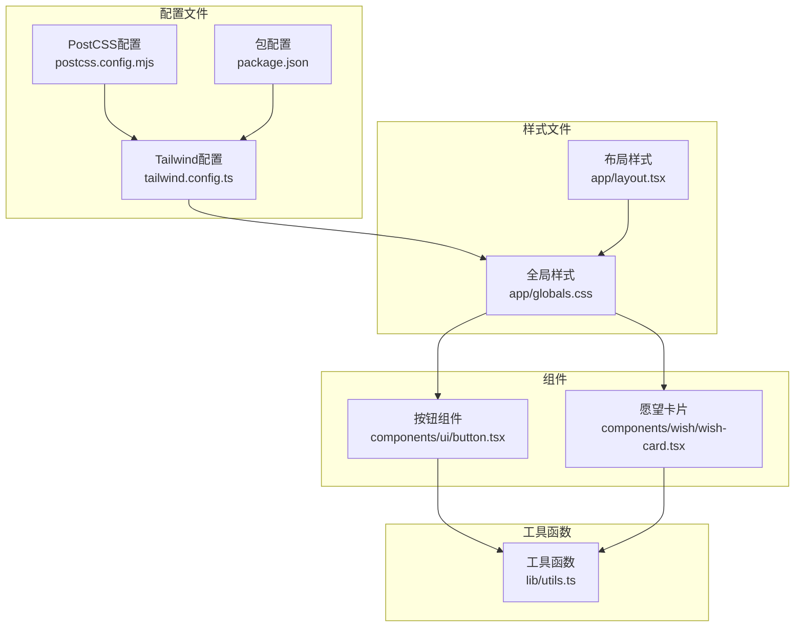
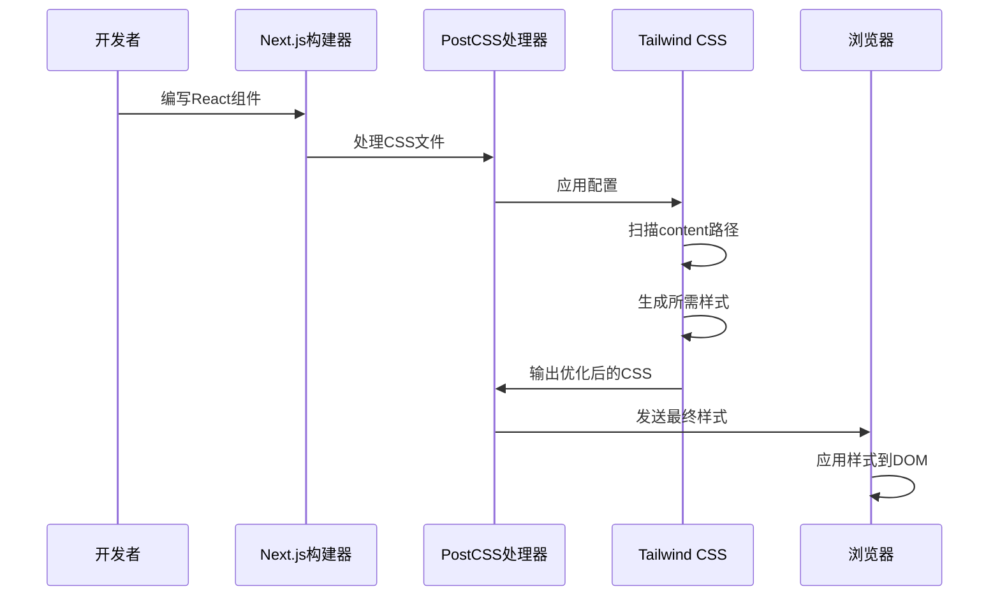
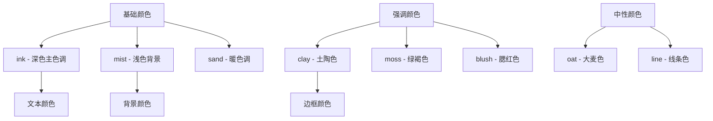
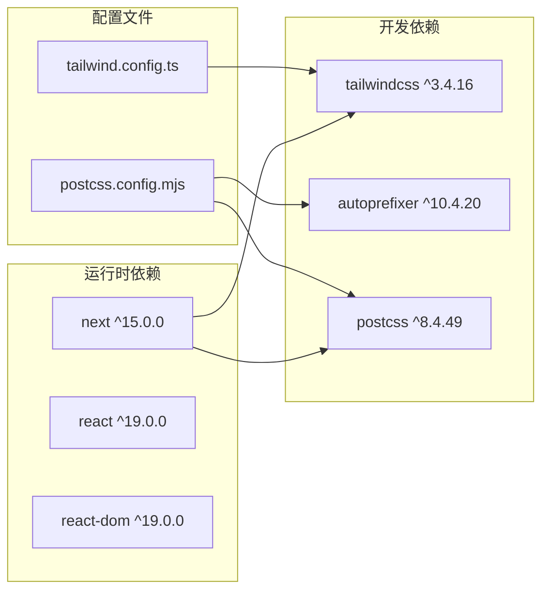
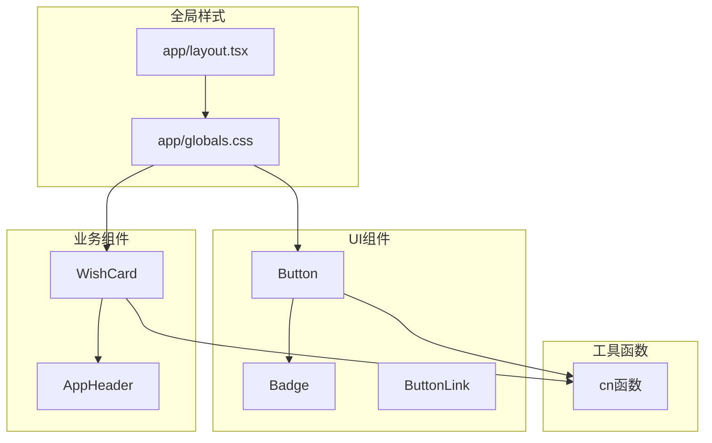

# Tailwind CSS配置

<cite>
**本文档引用的文件**
- [tailwind.config.ts](file://tailwind.config.ts)
- [postcss.config.mjs](file://postcss.config.mjs)
- [package.json](file://package.json)
- [app/globals.css](file://app/globals.css)
- [components/ui/button.tsx](file://components/ui/button.tsx)
- [components/wish/wish-card.tsx](file://components/wish/wish-card.tsx)
- [app/layout.tsx](file://app/layout.tsx)
- [lib/utils.ts](file://lib/utils.ts)
- [next.config.ts](file://next.config.ts)
</cite>

## 目录
1. [简介](#简介)
2. [项目结构](#项目结构)
3. [核心配置组件](#核心配置组件)
4. [架构概览](#架构概览)
5. [详细组件分析](#详细组件分析)
6. [依赖关系分析](#依赖关系分析)
7. [性能考虑](#性能考虑)
8. [故障排除指南](#故障排除指南)
9. [结论](#结论)

## 简介

本项目采用Tailwind CSS作为主要的样式框架，通过精心设计的配置实现了独特的自然色调美学。配置文件包含了完整的content路径扫描、主题扩展、颜色系统定制、字体家族配置和阴影效果定义。项目特别注重按需生成样式以优化性能，并提供了丰富的自定义颜色变量来支持整体的设计语言。

## 项目结构

该项目采用Next.js框架，Tailwind CSS配置位于根目录的`tailwind.config.ts`文件中，PostCSS配置在`postcss.config.mjs`中定义。全局样式通过`app/globals.css`文件管理，所有组件都遵循统一的样式约定。

**图表来源**
- [tailwind.config.ts:1-55](file://tailwind.config.ts#L1-L55)
- [postcss.config.mjs:1-9](file://postcss.config.mjs#L1-L9)
- [package.json:1-29](file://package.json#L1-L29)

**章节来源**
- [tailwind.config.ts:1-55](file://tailwind.config.ts#L1-L55)
- [postcss.config.mjs:1-9](file://postcss.config.mjs#L1-L9)
- [package.json:1-29](file://package.json#L1-L29)

## 核心配置组件

### Content路径配置

项目采用精确的content路径扫描策略，确保只处理必要的文件：

- `./app/**/*.{js,ts,jsx,tsx,mdx}` - 应用层组件和页面
- `./components/**/*.{js,ts,jsx,tsx,mdx}` - 可复用UI组件
- `./data/**/*.{js,ts,jsx,tsx,mdx}` - 数据层文件
- `./lib/**/*.{js,ts,jsx,tsx,mdx}` - 工具函数库

这种配置确保了按需生成样式的高效性，避免了不必要的样式计算。

### 主题扩展配置

配置文件通过`theme.extend`对象实现了深度的主题定制：

#### 颜色系统定制

项目定义了8种自然色调的颜色变量：
- **ink** (#22201B) - 深邃的墨色
- **sand** (#F4EFE6) - 温暖的沙色
- **oat** (#ECE4D8) - 柔和的大麦色
- **mist** (#F8F5F0) - 清新的薄雾色
- **clay** (#A48668) - 土陶般的陶土色
- **moss** (#66725C) - 苔藓的绿褐色
- **blush** (#CBB3A7) - 淡雅的腮红色
- **line** (#DDD5C8) - 细腻的线条色

这些颜色形成了统一的自然色调体系，支持从深到浅的渐变过渡。

#### 字体家族配置

配置了两种字体族：
- **sans** 字体族：包含多种系统字体，确保跨平台兼容性
- **serif** 字体族：提供优雅的衬线字体选择

字体配置支持多语言环境，特别是中文系统的良好显示效果。

#### 阴影效果定义

定义了两种专用阴影效果：
- **card** 阴影：柔和的立体感阴影
- **soft** 阴影：复合层次的阴影效果

#### 背景图像定制

实现了纸张质感的背景图像：
- **paper** 背景：结合径向渐变和线性渐变的复合背景

**章节来源**
- [tailwind.config.ts:3-51](file://tailwind.config.ts#L3-L51)

## 架构概览

Tailwind CSS在项目中的集成采用了标准的PostCSS工作流：

**图表来源**
- [postcss.config.mjs:1-9](file://postcss.config.mjs#L1-L9)
- [tailwind.config.ts:1-55](file://tailwind.config.ts#L1-L55)

## 详细组件分析

### 颜色系统实现

项目实现了完整的颜色系统，支持多种使用场景：

#### 颜色变量使用模式

在组件中，颜色变量通过以下模式使用：
- 文本颜色：`text-ink`、`text-clay`等
- 背景颜色：`bg-ink`、`bg-sand`等  
- 边框颜色：`border-clay`、`border-line`等
- 阴影颜色：通过自定义阴影实现

#### 颜色层次结构

颜色系统遵循清晰的层次结构：
- 基础色：ink、mist、sand
- 强调色：clay、moss、blush
- 中性色：oat、line

**图表来源**
- [tailwind.config.ts:12-21](file://tailwind.config.ts#L12-L21)
- [components/ui/button.tsx:6-16](file://components/ui/button.tsx#L6-L16)

**章节来源**
- [tailwind.config.ts:12-21](file://tailwind.config.ts#L12-L21)
- [components/ui/button.tsx:6-16](file://components/ui/button.tsx#L6-L16)

### 字体系统配置

字体配置支持多语言环境和跨平台兼容性：

#### 字体优先级

字体配置遵循以下优先级顺序：
1. 系统特定字体（如SF Pro Display）
2. 国际化字体（Segoe UI、PingFang SC）
3. 系统回退字体（Hiragino Sans GB）
4. 系统UI字体（ui-sans-serif、system-ui）
5. 最终回退字体（sans-serif）

#### 字体使用场景

- **sans** 字体用于正文和界面元素
- **serif** 字体用于标题和强调文本
- **font-family** 属性在全局样式中统一配置

**章节来源**
- [tailwind.config.ts:22-39](file://tailwind.config.ts#L22-L39)
- [app/globals.css:25-32](file://app/globals.css#L25-L32)

### 阴影效果实现

项目定义了两种专门的阴影效果：

#### Card阴影
- 适用于卡片组件
- 提供柔和的立体感
- 支持透明度控制

#### Soft阴影  
- 复合层次的阴影效果
- 适合复杂的视觉层次
- 包含多个阴影层

**章节来源**
- [tailwind.config.ts:40-43](file://tailwind.config.ts#L40-L43)

### 组件样式集成

各个组件充分利用了Tailwind CSS的原子化特性：

#### 按钮组件样式

按钮组件展示了多种样式组合：
- 基础样式：`inline-flex`、`items-center`、`justify-center`
- 状态样式：`:hover`、`:focus`、`:disabled`
- 尺寸变体：不同尺寸的padding和字体大小
- 颜色变体：primary、secondary、ghost三种风格

#### 卡片组件样式

卡片组件体现了复杂样式的组合：
- 背景渐变：`radial-gradient`实现纸张质感
- 过渡动画：`transition`和`duration`属性
- 层次结构：`isolation`和`z-index`管理
- 响应式设计：不同断点下的样式调整

**章节来源**
- [components/ui/button.tsx:6-22](file://components/ui/button.tsx#L6-L22)
- [components/wish/wish-card.tsx:24-33](file://components/wish/wish-card.tsx#L24-L33)

## 依赖关系分析

### 外部依赖

项目对Tailwind CSS及其相关工具的依赖关系：

**图表来源**
- [package.json:16-27](file://package.json#L16-L27)
- [tailwind.config.ts:1](file://tailwind.config.ts#L1)
- [postcss.config.mjs:1-9](file://postcss.config.mjs#L1-L9)

### 内部依赖关系

组件之间的样式依赖关系：

**图表来源**
- [app/globals.css:1-67](file://app/globals.css#L1-L67)
- [components/ui/button.tsx:4](file://components/ui/button.tsx#L4)
- [components/wish/wish-card.tsx:5](file://components/wish/wish-card.tsx#L5)

**章节来源**
- [package.json:16-27](file://package.json#L16-L27)
- [app/globals.css:1-67](file://app/globals.css#L1-L67)

## 性能考虑

### 按需生成优化

项目通过精确的content路径配置实现了高效的按需生成：

- **精确扫描范围**：只扫描必要的目录，避免不必要的文件处理
- **文件类型过滤**：限制处理的文件类型，减少解析开销
- **缓存机制**：利用Next.js的构建缓存提高重复构建速度

### 样式体积控制

- **原子化设计**：通过原子类组合减少重复样式定义
- **条件样式**：使用条件渲染避免生成不使用的样式
- **工具函数**：通过`cn`函数动态组合样式类，避免静态样式膨胀

### 构建优化

- **PostCSS流水线**：利用PostCSS的插件链优化CSS处理
- **自动前缀**：通过autoprefixer自动处理浏览器兼容性
- **生产环境优化**：在构建过程中进行CSS压缩和优化

## 故障排除指南

### 常见配置问题

#### 样式不生效

**问题描述**：自定义颜色或样式在组件中不显示

**解决方案**：
1. 检查content路径是否包含相关文件
2. 确认颜色变量是否正确拼写
3. 验证Tailwind指令是否正确引入

#### 颜色变量未识别

**问题描述**：使用自定义颜色变量时报错

**解决方案**：
1. 确认颜色变量已在`tailwind.config.ts`中定义
2. 检查颜色值格式是否正确
3. 验证Tailwind配置文件是否正确导入

#### 字体显示异常

**问题描述**：字体在某些平台上显示不正确

**解决方案**：
1. 检查字体优先级配置
2. 确认系统字体是否可用
3. 考虑添加字体加载优化

### 调试技巧

#### 开发环境调试

1. **启用Tailwind调试模式**：在开发环境中启用详细日志
2. **检查生成的CSS**：查看浏览器开发者工具中的实际样式
3. **验证content扫描**：确认所有相关文件都被正确扫描

#### 生产环境优化

1. **CSS分析工具**：使用工具分析最终CSS体积
2. **性能监控**：监控样式加载时间和渲染性能
3. **缓存策略**：优化CSS缓存和版本控制

**章节来源**
- [tailwind.config.ts:4-9](file://tailwind.config.ts#L4-L9)
- [lib/utils.ts:1-3](file://lib/utils.ts#L1-L3)

## 结论

本项目的Tailwind CSS配置展现了现代前端开发的最佳实践。通过精确的content路径配置、精心设计的自然色调系统、完善的字体管理和高效的按需生成机制，实现了优秀的性能表现和一致的视觉体验。

配置的核心优势包括：
- **性能优化**：通过精确的文件扫描和原子化设计实现快速构建
- **设计一致性**：统一的自然色调系统确保视觉连贯性
- **可维护性**：模块化的配置结构便于长期维护
- **扩展性**：灵活的主题扩展机制支持未来功能扩展

建议在后续开发中继续遵循这些配置原则，同时关注新版本Tailwind CSS的功能更新，以保持技术栈的先进性和性能优势。