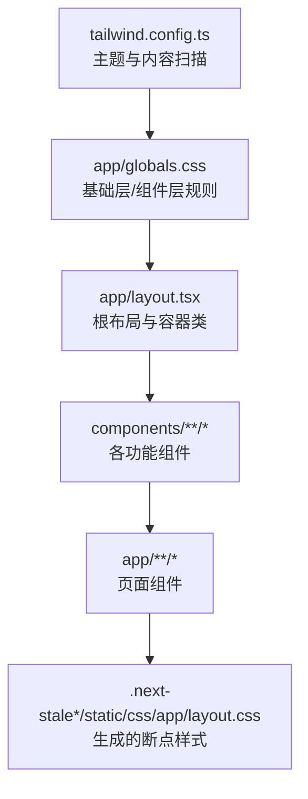
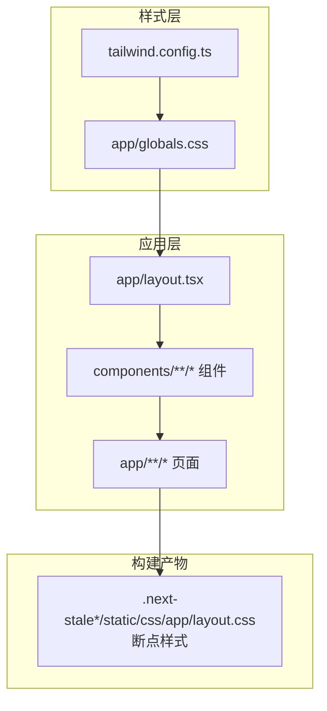
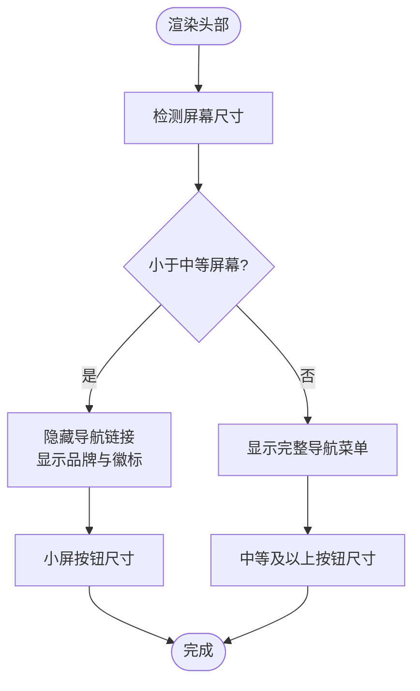
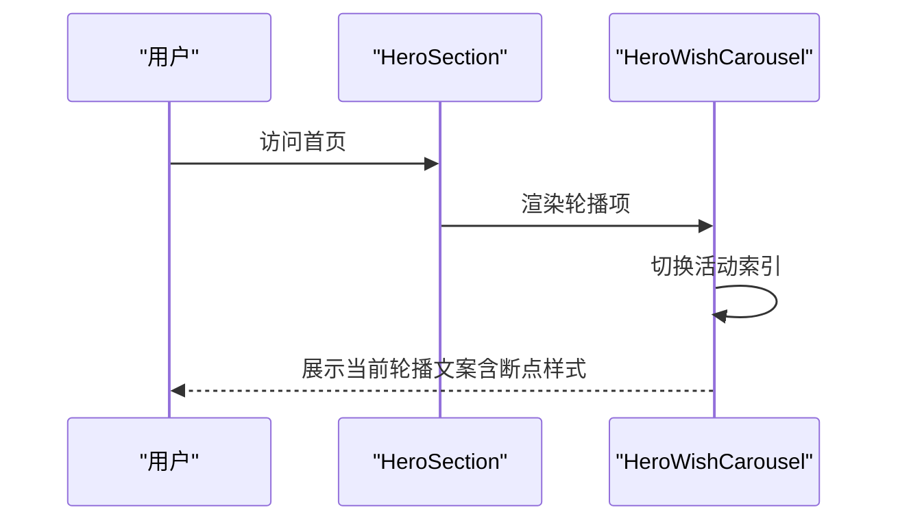
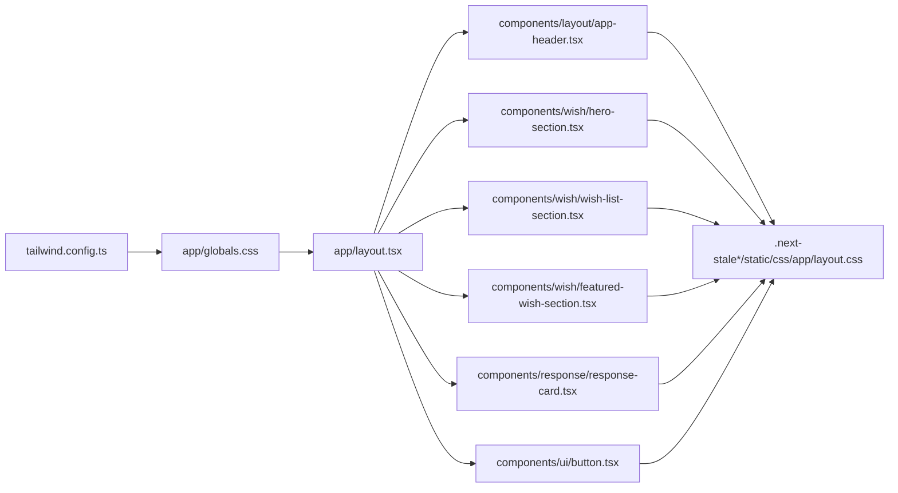

# 响应式设计

<cite>
**本文引用的文件**
- [tailwind.config.ts](file://tailwind.config.ts)
- [app/layout.tsx](file://app/layout.tsx)
- [app/globals.css](file://app/globals.css)
- [next.config.ts](file://next.config.ts)
- [lib/utils.ts](file://lib/utils.ts)
- [components/layout/app-header.tsx](file://components/layout/app-header.tsx)
- [components/wish/hero-section.tsx](file://components/wish/hero-section.tsx)
- [components/wish/hero-wish-carousel.tsx](file://components/wish/hero-wish-carousel.tsx)
- [components/wish/wish-card.tsx](file://components/wish/wish-card.tsx)
- [components/wish/wish-list-section.tsx](file://components/wish/wish-list-section.tsx)
- [components/wish/featured-wish-section.tsx](file://components/wish/featured-wish-section.tsx)
- [components/response/response-card.tsx](file://components/response/response-card.tsx)
- [components/ui/button.tsx](file://components/ui/button.tsx)
- [types/index.ts](file://types/index.ts)
- [.next-stale-20260422-145630/static/css/app/layout.css](file://.next-stale-20260422-145630/static/css/app/layout.css)
</cite>

## 目录
1. [简介](#简介)
2. [项目结构](#项目结构)
3. [核心组件](#核心组件)
4. [架构总览](#架构总览)
5. [详细组件分析](#详细组件分析)
6. [依赖关系分析](#依赖关系分析)
7. [性能考量](#性能考量)
8. [故障排查指南](#故障排查指南)
9. [结论](#结论)
10. [附录](#附录)

## 简介
本文件系统性梳理该项目的响应式设计策略与实现方式，重点覆盖以下方面：
- 移动端优先的设计理念与断点配置
- 使用 Tailwind 响应式前缀（sm、md、lg、xl、2xl）进行布局适配
- 具体响应式布局示例：网格系统、间距调整、字体缩放
- 视口配置与移动设备适配最佳实践
- 响应式图片处理与媒体查询使用指南
- 性能优化建议与测试方法

## 项目结构
项目采用 Next.js 应用程序目录结构，样式通过 Tailwind CSS 驱动，并在全局样式中统一引入基础层与自定义组件层规则。响应式策略主要体现在：
- Tailwind 配置集中扩展主题与内容扫描范围
- 全局样式中定义页面壳层与通用组件样式
- 各页面与组件通过响应式前缀实现多端一致体验

**图示来源**
- [tailwind.config.ts:1-55](file://tailwind.config.ts#L1-L55)
- [app/globals.css:1-67](file://app/globals.css#L1-L67)
- [app/layout.tsx:1-29](file://app/layout.tsx#L1-L29)
- [.next-stale-20260422-145630/static/css/app/layout.css:2096-2438](file://.next-stale-20260422-145630/static/css/app/layout.css#L2096-L2438)

**章节来源**
- [tailwind.config.ts:1-55](file://tailwind.config.ts#L1-L55)
- [app/globals.css:1-67](file://app/globals.css#L1-L67)
- [app/layout.tsx:1-29](file://app/layout.tsx#L1-L29)
- [.next-stale-20260422-145630/static/css/app/layout.css:2096-2438](file://.next-stale-20260422-145630/static/css/app/layout.css#L2096-L2438)

## 核心组件
- Tailwind 主题与内容扫描：集中扩展颜色、字体、阴影、背景等主题变量，并限定内容扫描路径以确保按需生成样式。
- 全局样式与页面壳层：在基础层中统一重置与基础样式，在组件层中定义页面壳层与通用组件样式，如页面最大宽度、内边距等。
- 根布局：在根 HTML 中应用最小高度、背景与文字颜色，并包裹导航与主内容区域。

**章节来源**
- [tailwind.config.ts:10-49](file://tailwind.config.ts#L10-L49)
- [app/globals.css:54-66](file://app/globals.css#L54-L66)
- [app/layout.tsx:18-26](file://app/layout.tsx#L18-L26)

## 架构总览
响应式架构由“主题配置 → 全局样式 → 组件/页面 → 构建产物”构成。构建后生成的 CSS 文件包含 sm、md、lg、xl 等断点规则，组件通过 Tailwind 响应式前缀直接消费这些规则。

**图示来源**
- [tailwind.config.ts:1-55](file://tailwind.config.ts#L1-L55)
- [app/globals.css:1-67](file://app/globals.css#L1-L67)
- [app/layout.tsx:1-29](file://app/layout.tsx#L1-L29)
- [.next-stale-20260422-145630/static/css/app/layout.css:2096-2438](file://.next-stale-20260422-145630/static/css/app/layout.css#L2096-L2438)

## 详细组件分析

### 头部导航（移动端优先）
- 设计要点
  - 小屏隐藏导航链接，仅显示品牌与徽标信息；通过 sm 前缀在小屏上切换按钮大小与显示状态。
  - 中等及以上屏幕展示完整导航菜单与主导航按钮。
- 关键实现位置
  - 导航容器在小屏隐藏，中等屏显示。
  - 发布按钮在小屏与大屏分别使用不同尺寸类名，保证交互元素在不同屏幕下的可点击面积与视觉权重。

**图示来源**
- [components/layout/app-header.tsx:41-59](file://components/layout/app-header.tsx#L41-L59)

**章节来源**
- [components/layout/app-header.tsx:22-63](file://components/layout/app-header.tsx#L22-L63)

### 英雄区与轮播（多断点字体与布局）
- 设计要点
  - 使用 sm 前缀为轮播文本设置最小高度、最大宽度与字号，确保在小屏与大屏的可读性与比例协调。
  - 英雄区整体在小屏与大屏采用不同的内边距与标题排版，提升阅读节奏。
- 关键实现位置
  - 轮播容器与文本在不同断点下调整字号与行高，避免小屏拥挤与大屏失焦。
  - 英雄区外层容器使用 sm 前缀控制内边距与垂直留白。

**图示来源**
- [components/wish/hero-section.tsx:10-52](file://components/wish/hero-section.tsx#L10-L52)
- [components/wish/hero-wish-carousel.tsx:13-55](file://components/wish/hero-wish-carousel.tsx#L13-L55)

**章节来源**
- [components/wish/hero-section.tsx:10-52](file://components/wish/hero-section.tsx#L10-L52)
- [components/wish/hero-wish-carousel.tsx:13-55](file://components/wish/hero-wish-carousel.tsx#L13-L55)

### 愿望卡片（断点下的排版与间距）
- 设计要点
  - 卡片标题在不同断点下采用不同的字号与行高，保证在小屏与大屏的层次感。
  - 卡片容器在不同断点下调整内边距与圆角，提升触摸交互体验。
- 关键实现位置
  - 标题类名根据是否“精选”变体在不同断点下应用不同的字号与行高。
  - 卡片容器在不同断点下调整内边距与圆角半径。

**章节来源**
- [components/wish/wish-card.tsx:15-92](file://components/wish/wish-card.tsx#L15-L92)

### 愿望列表（多列栅格与断点）
- 设计要点
  - 使用 Tailwind 的列数类在不同断点下实现多列布局，从单列到两列再到三列，充分利用桌面端空间。
  - 通过断点类微调卡片之间的间距，使布局在不同屏幕下保持稳定。
- 关键实现位置
  - 列表容器在不同断点下设置列数与列间距。
  - 卡片在不同断点下设置上下间距，避免在列布局中出现拥挤。

**章节来源**
- [components/wish/wish-list-section.tsx:65-73](file://components/wish/wish-list-section.tsx#L65-L73)

### 精选愿望区（双栏布局与断点）
- 设计要点
  - 使用 lg 前缀将内容拆分为侧边信息与主内容区，主内容区再以 lg 前缀拆分为两列，形成清晰的信息层级。
  - 在小屏下自动折叠为单列，保证信息完整性。
- 关键实现位置
  - 双栏容器在 lg 断点下生效，侧边信息与主内容区各自设置合适的内边距与间距。

**章节来源**
- [components/wish/featured-wish-section.tsx:18-43](file://components/wish/featured-wish-section.tsx#L18-L43)

### 回应卡片（断点下的内边距与排版）
- 设计要点
  - 在小屏与大屏下分别调整内边距与字体大小，确保在不同屏幕下的可读性与触控友好性。
- 关键实现位置
  - 卡片容器在 sm 断点下调整内边距，标题与副标题在不同断点下设置合适的字号。

**章节来源**
- [components/response/response-card.tsx:18-47](file://components/response/response-card.tsx#L18-L47)

### 按钮组件（断点下的尺寸与交互）
- 设计要点
  - 通过 size 参数在不同断点下选择合适的内边距与字号，保证在小屏与大屏的交互一致性。
  - 通过 variant 参数控制外观风格，结合断点类实现不同屏幕下的视觉权重。
- 关键实现位置
  - 按钮在不同断点下使用不同的内边距与字号类名，确保可点击区域与视觉比例合理。

**章节来源**
- [components/ui/button.tsx:40-74](file://components/ui/button.tsx#L40-L74)

### 类型定义（断点与布局相关）
- 设计要点
  - 类型定义中未直接声明断点，但通过组件与页面中的断点类名体现布局策略。
- 关键实现位置
  - 布局与样式通过组件类名与 Tailwind 断点类组合实现跨端一致性。

**章节来源**
- [types/index.ts:1-58](file://types/index.ts#L1-L58)

## 依赖关系分析
- 主题与内容扫描
  - Tailwind 配置集中扩展主题变量，并限定内容扫描路径，确保按需生成样式，减少冗余。
- 全局样式与组件层
  - 全局样式中定义页面壳层与通用组件样式，组件层通过组合类名实现复用与一致性。
- 构建产物断点
  - 构建产物中包含 sm、md、lg、xl 等断点规则，组件通过响应式前缀直接消费这些规则。

**图示来源**
- [tailwind.config.ts:1-55](file://tailwind.config.ts#L1-L55)
- [app/globals.css:1-67](file://app/globals.css#L1-L67)
- [app/layout.tsx:1-29](file://app/layout.tsx#L1-L29)
- [components/layout/app-header.tsx:1-64](file://components/layout/app-header.tsx#L1-L64)
- [components/wish/hero-section.tsx:1-53](file://components/wish/hero-section.tsx#L1-L53)
- [components/wish/wish-list-section.tsx:1-77](file://components/wish/wish-list-section.tsx#L1-L77)
- [components/wish/featured-wish-section.tsx:1-47](file://components/wish/featured-wish-section.tsx#L1-L47)
- [components/response/response-card.tsx:1-48](file://components/response/response-card.tsx#L1-L48)
- [components/ui/button.tsx:1-75](file://components/ui/button.tsx#L1-L75)
- [.next-stale-20260422-145630/static/css/app/layout.css:2096-2438](file://.next-stale-20260422-145630/static/css/app/layout.css#L2096-L2438)

**章节来源**
- [tailwind.config.ts:1-55](file://tailwind.config.ts#L1-L55)
- [app/globals.css:1-67](file://app/globals.css#L1-L67)
- [app/layout.tsx:1-29](file://app/layout.tsx#L1-L29)
- [.next-stale-20260422-145630/static/css/app/layout.css:2096-2438](file://.next-stale-20260422-145630/static/css/app/layout.css#L2096-L2438)

## 性能考量
- 按需生成与内容扫描
  - 通过 Tailwind 配置限制内容扫描路径，避免生成未使用的样式，降低 CSS 体积。
- 断点样式合并
  - 构建产物中按断点合并样式，减少重复定义，提升运行时性能。
- 图片与媒体资源
  - 建议使用现代图片格式与懒加载策略，配合断点类实现不同 DPR 下的图片选择，减少带宽占用。
- 交互与动画
  - 在小屏上尽量减少复杂动画，优先使用过渡与轻量级效果，避免掉帧。
- 测试与验证
  - 使用浏览器开发者工具的设备模拟器与真机调试相结合，覆盖主流断点与设备密度。

## 故障排查指南
- 断点不生效
  - 检查 Tailwind 内容扫描路径是否包含目标组件与页面。
  - 确认断点类拼写正确且与 Tailwind 版本支持的前缀一致。
- 样式冲突
  - 使用组合类名时注意优先级，必要时通过 !important 或更高特异性类名覆盖。
- 字体与排版异常
  - 在不同断点下检查字号、行高与字重的组合，确保可读性与层级清晰。
- 间距与对齐问题
  - 使用 Flexbox/Grid 的断点类时，确认主轴与交叉轴的对齐方式在不同断点下符合预期。

## 结论
本项目采用移动端优先策略，通过 Tailwind 的响应式前缀与断点规则，结合全局样式与组件层的统一规范，实现了从小屏到桌面端的一致体验。断点策略覆盖 sm、md、lg、xl 等常见场景，配合网格、列数、内边距与字体缩放等手段，有效提升了可读性与交互效率。建议在后续迭代中持续关注图片与媒体资源的响应式处理，并通过自动化测试与真机调试保障跨端质量。

## 附录

### 断点与前缀使用速览
- sm：小屏增强（如内边距、字体、最小高度、显示属性）
- md：中等屏（如列数、间距、显示属性）
- lg：大屏（如双栏布局、更大字体）
- xl：超宽屏（如三列栅格）

**章节来源**
- [.next-stale-20260422-145630/static/css/app/layout.css:2096-2438](file://.next-stale-20260422-145630/static/css/app/layout.css#L2096-L2438)