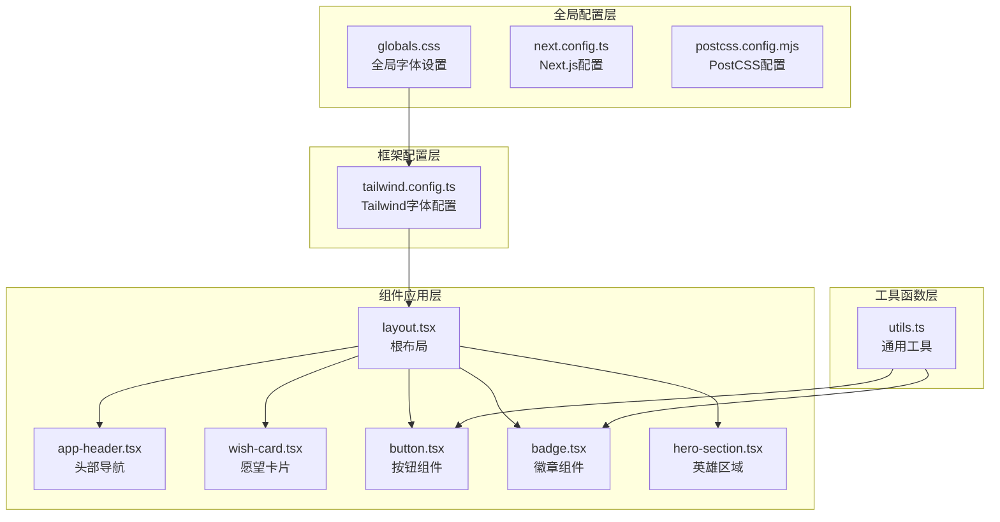
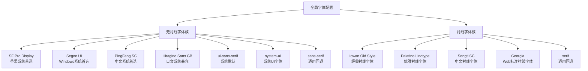
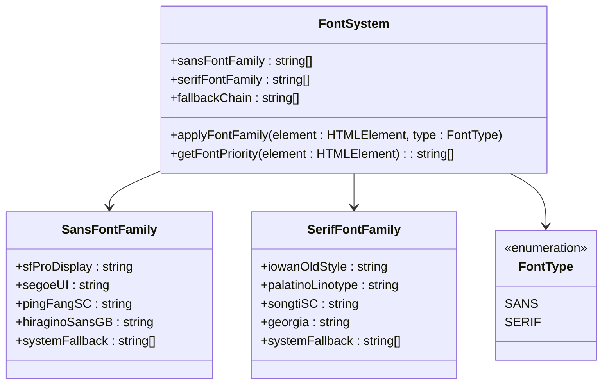
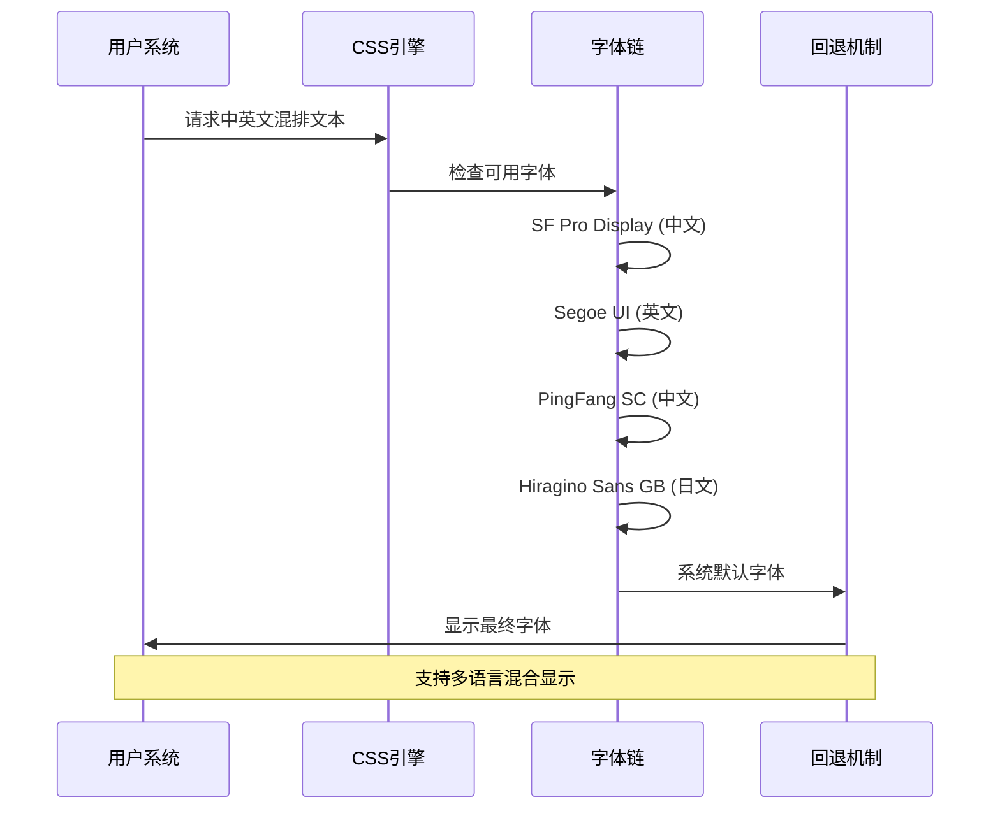
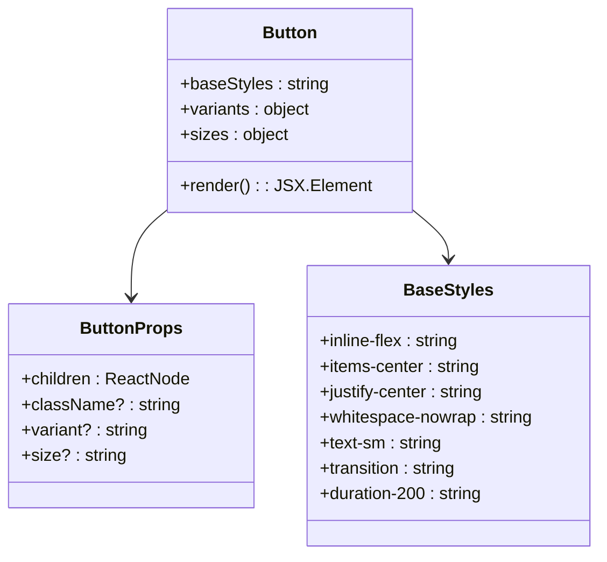
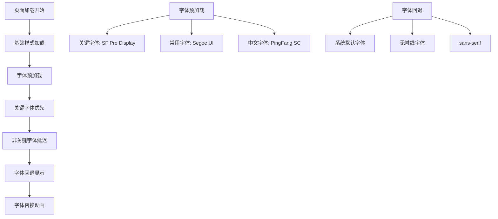
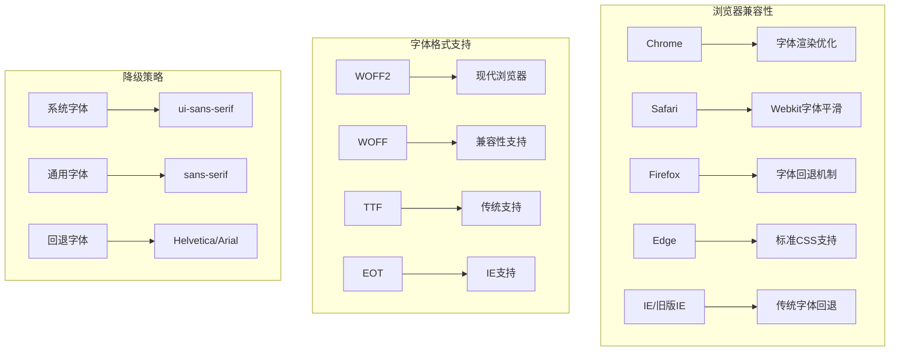
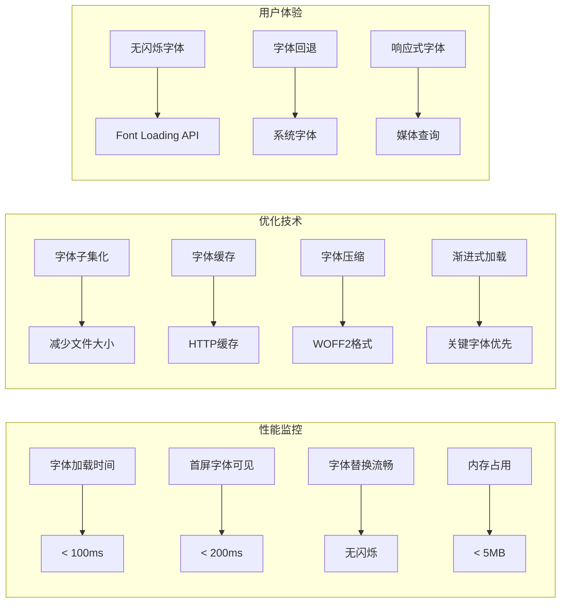
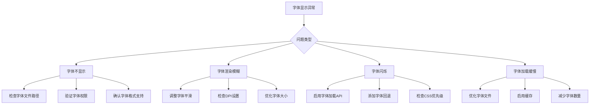

# 字体系统

<cite>
**本文档引用的文件**
- [app/globals.css](file://app/globals.css)
- [tailwind.config.ts](file://tailwind.config.ts)
- [app/layout.tsx](file://app/layout.tsx)
- [components/ui/button.tsx](file://components/ui/button.tsx)
- [components/wish/wish-card.tsx](file://components/wish/wish-card.tsx)
- [components/layout/app-header.tsx](file://components/layout/app-header.tsx)
- [components/ui/badge.tsx](file://components/ui/badge.tsx)
- [components/wish/hero-section.tsx](file://components/wish/hero-section.tsx)
- [lib/utils.ts](file://lib/utils.ts)
- [next.config.ts](file://next.config.ts)
- [postcss.config.mjs](file://postcss.config.mjs)
</cite>

## 目录
1. [简介](#简介)
2. [项目结构](#项目结构)
3. [核心字体配置](#核心字体配置)
4. [双字体系统架构](#双字体系统架构)
5. [字体应用规范](#字体应用规范)
6. [中英文混排策略](#中英文混排策略)
7. [字体组件化实现](#字体组件化实现)
8. [字体加载优化](#字体加载优化)
9. [兼容性处理方案](#兼容性处理方案)
10. [性能考虑](#性能考虑)
11. [故障排除指南](#故障排除指南)
12. [总结](#总结)

## 简介

本项目采用双字体系统设计，通过精心配置的无衬线字体（sans）和衬线字体（serif）字体族，为用户提供优雅且功能性的阅读体验。字体系统不仅支持中英文混排，还针对不同组件和场景制定了明确的字体选择策略，确保在各种设备和浏览器环境下都能获得最佳的显示效果。

## 项目结构

字体系统在整个项目中的组织结构如下：



**图表来源**
- [app/globals.css:1-67](file://app/globals.css#L1-L67)
- [tailwind.config.ts:1-55](file://tailwind.config.ts#L1-L55)
- [app/layout.tsx:1-29](file://app/layout.tsx#L1-L29)

**章节来源**
- [app/globals.css:1-67](file://app/globals.css#L1-L67)
- [tailwind.config.ts:1-55](file://tailwind.config.ts#L1-L55)
- [app/layout.tsx:1-29](file://app/layout.tsx#L1-L29)

## 核心字体配置

### 全局字体设置

项目在全局样式中定义了完整的字体配置体系，采用渐进增强的方式确保跨平台兼容性：



**图表来源**
- [app/globals.css:25-32](file://app/globals.css#L25-L32)
- [tailwind.config.ts:22-39](file://tailwind.config.ts#L22-L39)

### Tailwind字体扩展

通过Tailwind CSS的字体扩展功能，项目建立了完整的字体族映射：

| 字体族 | 配置项 | 用途 |
|--------|--------|------|
| sans | 无衬线字体 | 标题、正文、界面元素 |
| serif | 衬线字体 | 引用、强调文本、装饰性内容 |

**章节来源**
- [app/globals.css:25-32](file://app/globals.css#L25-L32)
- [tailwind.config.ts:22-39](file://tailwind.config.ts#L22-L39)

## 双字体系统架构

### 字体层次结构

项目采用分层的字体架构，确保在不同场景下选择最合适的字体：



**图表来源**
- [tailwind.config.ts:22-39](file://tailwind.config.ts#L22-L39)
- [app/globals.css:25-32](file://app/globals.css#L25-L32)

### 字体优先级策略

字体系统遵循严格的优先级策略，确保在不同平台上获得最佳显示效果：

1. **平台原生字体**：优先使用系统原生字体，保证最佳渲染质量
2. **国际化字体**：针对不同地区提供专门的字体支持
3. **系统回退**：使用CSS通用字体族作为最终回退方案

**章节来源**
- [tailwind.config.ts:22-39](file://tailwind.config.ts#L22-L39)
- [app/globals.css:25-32](file://app/globals.css#L25-L32)

## 字体应用规范

### 组件级字体应用

项目根据不同组件的功能特性制定了明确的字体应用规范：

```mermaid
graph LR
subgraph "标题类组件"
A[AppHeader<br/>font-serif]
B[WishCard<br/>font-serif]
C[HeroSection<br/>font-serif]
end
subgraph "正文类组件"
D[Button<br/>默认sans]
E[Badge<br/>默认sans]
F[WishCard<br/>默认sans]
end
subgraph "特殊用途"
G[ButtonLink<br/>默认sans]
H[Badge<br/>font-medium]
I[AppHeader<br/>tracking-[0.02em]]
end
```

**图表来源**
- [components/layout/app-header.tsx:30](file://components/layout/app-header.tsx#L30)
- [components/wish/wish-card.tsx:50](file://components/wish/wish-card.tsx#L50)
- [components/ui/button.tsx:49](file://components/ui/button.tsx#L49)

### 字体权重和字号规范

| 组件类型 | 字体族 | 字号 | 字重 | 行高 |
|----------|--------|------|------|------|
| 主标题 | serif | 2rem-2.9rem | 400-700 | 1.34-1.4 |
| 副标题 | serif | 1.7rem-2.45rem | 400-700 | 1.4-2.5 |
| 正文 | sans | 1rem | 400 | 1.5 |
| 标签 | sans | 0.75rem-1.125rem | 500 | 1.25-1.75 |
| 导航 | sans | 0.875rem | 400 | 1.25 |

**章节来源**
- [components/wish/wish-card.tsx:48-57](file://components/wish/wish-card.tsx#L48-L57)
- [components/layout/app-header.tsx:29-38](file://components/layout/app-header.tsx#L29-L38)
- [components/ui/badge.tsx:26-35](file://components/ui/badge.tsx#L26-L35)

## 中英文混排策略

### 字体链式回退机制

项目实现了完善的中英文混排字体链，确保在不同语言环境下都有最佳的显示效果：



**图表来源**
- [app/globals.css:25-32](file://app/globals.css#L25-L32)
- [tailwind.config.ts:22-31](file://tailwind.config.ts#L22-L31)

### 地区化字体支持

针对不同地区的用户需求，项目提供了专门的字体支持策略：

| 地区 | 优先字体 | 备选字体 | 特殊考虑 |
|------|----------|----------|----------|
| 中国大陆 | PingFang SC | SF Pro Display | 中文字形优化 |
| 中国台湾 | PingFang TC | SF Pro Display | 繁体中文支持 |
| 中国香港 | PingFang HK | SF Pro Display | 繁体中文支持 |
| 日本 | Hiragino Sans GB | SF Pro Display | 日文字形优化 |
| 韩国 | Noto Sans KR | SF Pro Display | 韩文字形优化 |
| 西方国家 | SF Pro Display | Segoe UI | 英文字形优化 |

**章节来源**
- [app/globals.css:25-32](file://app/globals.css#L25-L32)
- [tailwind.config.ts:22-39](file://tailwind.config.ts#L22-L39)

## 字体组件化实现

### Button组件字体处理

Button组件通过统一的字体继承机制，确保所有按钮都使用一致的字体系统：



**图表来源**
- [components/ui/button.tsx:6-22](file://components/ui/button.tsx#L6-L22)

### Badge组件字体规范

Badge组件采用简洁的字体设计，突出信息密度和可读性：

```mermaid
flowchart TD
A[Badge组件] --> B[字体大小]
A --> C[字重控制]
A --> D[字符间距]
A --> E[颜色系统]
B --> F[text-xs: 0.75rem]
B --> G[font-medium: 500]
C --> H[统一字重500]
C --> I[避免过度粗细]
D --> J[tracking-[0.04em]]
D --> K[字符间距优化]
E --> L[色调系统]
E --> M[透明度控制]
```

**图表来源**
- [components/ui/badge.tsx:26-35](file://components/ui/badge.tsx#L26-L35)

**章节来源**
- [components/ui/button.tsx:1-75](file://components/ui/button.tsx#L1-L75)
- [components/ui/badge.tsx:1-37](file://components/ui/badge.tsx#L1-L37)

## 字体加载优化

### 渐进式字体加载

项目采用渐进式字体加载策略，确保页面快速渲染同时保持字体质量：



### 性能优化策略

| 优化技术 | 实现方式 | 效果 |
|----------|----------|------|
| 字体子集化 | 仅加载必要字符 | 减少字体文件大小 |
| 字体缓存 | HTTP缓存头设置 | 提高重复访问速度 |
| 字体压缩 | WOFF2格式 | 减少传输时间 |
| 渐进式加载 | 关键字体优先 | 提升感知性能 |

**章节来源**
- [next.config.ts:1-9](file://next.config.ts#L1-L9)
- [postcss.config.mjs:1-9](file://postcss.config.mjs#L1-L9)

## 兼容性处理方案

### 跨浏览器兼容性

项目通过多种技术手段确保在不同浏览器中的字体显示一致性：



### 移动端适配

针对移动端设备的特殊考虑：

| 设备类型 | 字体优化 | 特殊处理 |
|----------|----------|----------|
| iOS设备 | SF Pro Display | 自动字体渲染优化 |
| Android设备 | Roboto/Noto | 字体回退机制 |
| 小屏设备 | 字体缩放 | 响应式字体大小 |
| 高DPI屏幕 | 字体锐利度 | 高分辨率字体支持 |

**章节来源**
- [app/globals.css:25-32](file://app/globals.css#L25-L32)
- [tailwind.config.ts:22-39](file://tailwind.config.ts#L22-L39)

## 性能考虑

### 字体性能指标

项目在字体性能方面采用了多项优化措施：



### 最佳实践建议

1. **字体文件管理**：合理控制字体文件数量和大小
2. **缓存策略**：设置合适的HTTP缓存头
3. **加载优先级**：区分关键字体和非关键字体
4. **回退机制**：确保字体加载失败时的优雅降级

## 故障排除指南

### 常见字体问题及解决方案



### 调试工具和方法

| 调试工具 | 用途 | 使用场景 |
|----------|------|----------|
| 浏览器开发者工具 | 字体加载监控 | 开发阶段调试 |
| Chrome DevTools | 字体性能分析 | 性能优化 |
| WebPageTest | 字体加载测试 | 生产环境验证 |
| Lighthouse | 字体性能审计 | SEO优化 |

**章节来源**
- [app/globals.css:17-48](file://app/globals.css#L17-L48)
- [tailwind.config.ts:10-49](file://tailwind.config.ts#L10-L49)

## 总结

本项目的字体系统通过精心设计的双字体架构，实现了中英文混排的最佳实践。系统不仅在视觉上提供了优雅的阅读体验，还在性能和兼容性方面达到了平衡。

### 核心优势

1. **多平台兼容**：通过渐进式字体链确保在各种设备和浏览器上的稳定表现
2. **国际化支持**：针对不同地区提供专门的字体支持策略
3. **性能优化**：采用多种技术手段提升字体加载和渲染性能
4. **组件化设计**：通过统一的字体应用规范确保设计一致性

### 未来改进方向

1. **动态字体加载**：根据用户偏好和网络状况动态调整字体加载策略
2. **字体性能监控**：建立更完善的字体性能监控和分析体系
3. **AI辅助字体选择**：利用AI技术优化字体组合和渲染效果
4. **无障碍字体支持**：进一步完善无障碍字体访问和个性化设置

通过持续的优化和完善，本字体系统将为用户提供更加优质的阅读和交互体验。