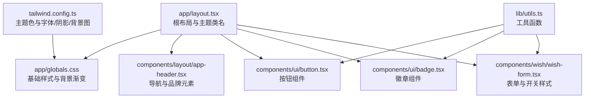
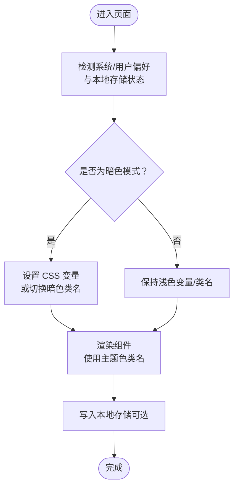
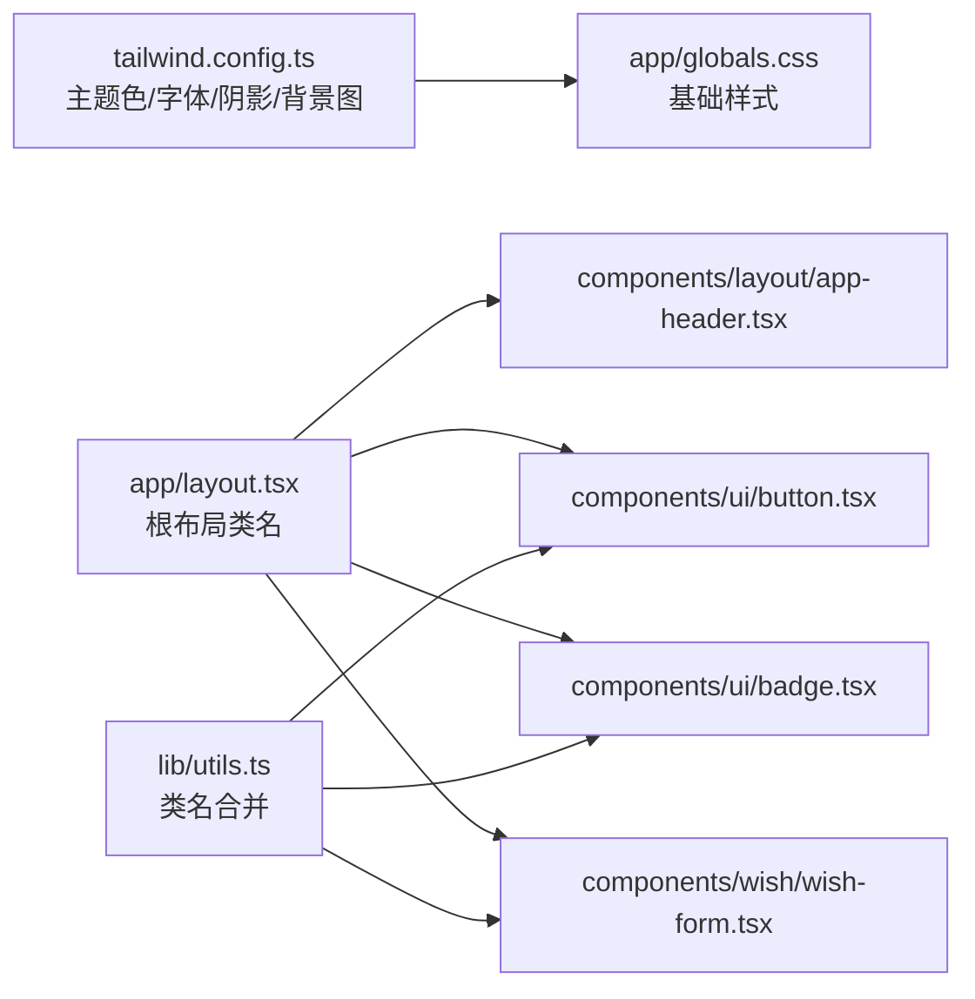

# 暗色模式与主题切换

<cite>
**本文引用的文件**
- [app/globals.css](file://app/globals.css)
- [app/layout.tsx](file://app/layout.tsx)
- [tailwind.config.ts](file://tailwind.config.ts)
- [lib/utils.ts](file://lib/utils.ts)
- [components/layout/app-header.tsx](file://components/layout/app-header.tsx)
- [components/ui/button.tsx](file://components/ui/button.tsx)
- [components/ui/badge.tsx](file://components/ui/badge.tsx)
- [components/wish/wish-form.tsx](file://components/wish/wish-form.tsx)
</cite>

## 目录
1. [简介](#简介)
2. [项目结构](#项目结构)
3. [核心组件](#核心组件)
4. [架构总览](#架构总览)
5. [详细组件分析](#详细组件分析)
6. [依赖关系分析](#依赖关系分析)
7. [性能考量](#性能考量)
8. [故障排查指南](#故障排查指南)
9. [结论](#结论)
10. [附录](#附录)

## 简介
本文件围绕当前代码库中的“暗色模式与主题切换”能力进行系统化梳理与扩展建议。当前项目已具备基于 Tailwind 的浅色主题体系（以暖灰、米色、苔藓等为基调），并在全局样式与组件中广泛使用主题色变量类名（如 bg-mist、text-ink、border-line 等）。本文将从以下维度展开：
- 如何在现有基础上扩展暗色模式支持（CSS 变量与媒体查询）
- 如何在组件中统一使用主题变量，避免硬编码颜色
- 主题切换的用户界面设计建议与交互体验优化
- 主题持久化与跨页面状态管理方案
- 性能优化与用户体验最佳实践

## 项目结构
项目采用 Next.js 应用程序目录结构，样式通过 Tailwind 配置与全局 CSS 组合，组件层使用语义化颜色类名，整体风格偏向“自然温暖”的浅色主题。

图表来源
- [app/layout.tsx:13-28](file://app/layout.tsx#L13-L28)
- [app/globals.css:17-33](file://app/globals.css#L17-L33)
- [tailwind.config.ts:10-48](file://tailwind.config.ts#L10-L48)
- [lib/utils.ts:1-12](file://lib/utils.ts#L1-L12)
- [components/layout/app-header.tsx:22-63](file://components/layout/app-header.tsx#L22-L63)
- [components/ui/button.tsx:6-22](file://components/ui/button.tsx#L6-L22)
- [components/ui/badge.tsx:5-12](file://components/ui/badge.tsx#L5-L12)
- [components/wish/wish-form.tsx:25-93](file://components/wish/wish-form.tsx#L25-L93)

章节来源
- [app/layout.tsx:13-28](file://app/layout.tsx#L13-L28)
- [app/globals.css:17-33](file://app/globals.css#L17-L33)
- [tailwind.config.ts:10-48](file://tailwind.config.ts#L10-L48)
- [lib/utils.ts:1-12](file://lib/utils.ts#L1-L12)

## 核心组件
- 根布局：在 html/body 上应用主题类名，承载页面整体外观与可访问性设置。
- 全局样式：定义基础排版、背景与选择器高亮等，为组件提供一致的基线。
- Tailwind 主题：集中定义颜色、字体、阴影与背景图，供组件类名直接使用。
- 组件层：导航、按钮、徽章、表单等均使用主题色类名，避免硬编码颜色。

章节来源
- [app/layout.tsx:19-25](file://app/layout.tsx#L19-L25)
- [app/globals.css:17-52](file://app/globals.css#L17-L52)
- [tailwind.config.ts:12-47](file://tailwind.config.ts#L12-L47)
- [components/layout/app-header.tsx:24-61](file://components/layout/app-header.tsx#L24-L61)
- [components/ui/button.tsx:6-22](file://components/ui/button.tsx#L6-L22)
- [components/ui/badge.tsx:5-12](file://components/ui/badge.tsx#L5-L12)
- [components/wish/wish-form.tsx:25-93](file://components/wish/wish-form.tsx#L25-L93)

## 架构总览
当前主题体系以“浅色自然风”为主，颜色变量通过 Tailwind 扩展注入，组件通过类名引用。若要引入暗色模式，建议采用“CSS 变量 + 媒体查询 + 类名切换”的组合方式，在不破坏现有类名体系的前提下平滑演进。

## 详细组件分析

### 根布局与全局样式
- 根布局在 body 上应用“最小高度、背景色、文本色、抗锯齿”等类名，奠定整体视觉基调。
- 全局样式定义了基础排版、滚动行为、选择器高亮以及页面组件层的通用样式。

章节来源
- [app/layout.tsx:19-25](file://app/layout.tsx#L19-L25)
- [app/globals.css:17-33](file://app/globals.css#L17-L33)

### Tailwind 主题配置
- 颜色：定义了 ink、mist、sand、oat、clay、moss、blush、line 等主题色，用于组件类名引用。
- 字体：定义 sans 与 serif 字体族，满足标题与正文的排版需求。
- 阴影与背景：提供卡片与柔和阴影，背景图用于纸质感装饰。

章节来源
- [tailwind.config.ts:12-47](file://tailwind.config.ts#L12-L47)

### 导航组件（AppHeader）
- 使用“边框、背景、模糊”等类名构建悬浮式导航，文字与边框使用主题色，保证在不同背景下的一致可读性。
- 建议在暗色模式下对边框透明度与背景色进行微调，确保视觉层次清晰。

章节来源
- [components/layout/app-header.tsx:24-61](file://components/layout/app-header.tsx#L24-L61)

### 按钮组件（Button）
- 通过 variants/sizes 组合生成多种按钮样式，颜色与过渡均基于主题色类名。
- 在暗色模式下，hover 状态的颜色应避免过亮，保持对比度与可读性。

章节来源
- [components/ui/button.tsx:6-22](file://components/ui/button.tsx#L6-L22)
- [components/ui/button.tsx:40-74](file://components/ui/button.tsx#L40-L74)

### 徽章组件（Badge）
- 通过 tone 属性映射到不同主题色，前缀点用于强调，适合在浅/暗两种背景下保持辨识度。

章节来源
- [components/ui/badge.tsx:5-12](file://components/ui/badge.tsx#L5-L12)
- [components/ui/badge.tsx:20-36](file://components/ui/badge.tsx#L20-L36)

### 表单与开关（WishForm）
- 输入框与开关使用主题色边框与背景，开关状态通过类名切换实现，便于在暗色模式下统一风格。
- 暗色模式下建议提升输入框与占位符的对比度，并保持悬停与聚焦态的可见性。

章节来源
- [components/wish/wish-form.tsx:25-58](file://components/wish/wish-form.tsx#L25-L58)
- [components/wish/wish-form.tsx:60-93](file://components/wish/wish-form.tsx#L60-L93)

### 工具函数（cn）
- 提供类名合并能力，便于在组件中根据状态动态拼接主题类名，减少重复逻辑。

章节来源
- [lib/utils.ts:1-3](file://lib/utils.ts#L1-L3)

## 依赖关系分析
组件与主题变量的依赖关系如下：

图表来源
- [tailwind.config.ts:12-47](file://tailwind.config.ts#L12-L47)
- [app/globals.css:17-33](file://app/globals.css#L17-L33)
- [app/layout.tsx:19-25](file://app/layout.tsx#L19-L25)
- [lib/utils.ts:1-3](file://lib/utils.ts#L1-L3)
- [components/layout/app-header.tsx:24-61](file://components/layout/app-header.tsx#L24-L61)
- [components/ui/button.tsx:40-74](file://components/ui/button.tsx#L40-L74)
- [components/ui/badge.tsx:20-36](file://components/ui/badge.tsx#L20-L36)
- [components/wish/wish-form.tsx:25-93](file://components/wish/wish-form.tsx#L25-L93)

## 性能考量
- CSS 变量切换与类名切换的性能差异：类名切换在重排范围可控时更稳定；CSS 变量切换在复杂场景下可能带来额外计算开销。
- 避免在暗色模式下使用过多滤镜（如 invert/grayscale），以免影响渲染性能。
- 将主题切换逻辑与路由切换解耦，尽量减少不必要的重渲染。
- 对于频繁切换的组件（如导航栏、按钮），优先使用类名切换并缓存主题状态。

## 故障排查指南
- 暗色模式下文字不可读：检查输入框占位符与边框对比度，必要时调整透明度或使用更高对比度的主题色。
- 切换后部分组件未更新：确认组件是否使用主题类名而非硬编码颜色；检查根节点是否正确应用主题类名。
- 切换动画卡顿：减少同时切换的 DOM 数量，优先处理关键路径（如导航栏、主内容区）。
- 本地存储未生效：确认存储键名与读取逻辑一致，且在 SSR/CSR 场景下均能正确初始化。

## 结论
当前项目已具备完善的浅色主题体系，组件层普遍使用主题色类名，为后续扩展暗色模式提供了良好基础。建议采用“CSS 变量 + 媒体查询 + 类名切换”的混合策略，在不破坏现有类名体系的前提下，平滑引入暗色模式，并通过统一的工具函数与主题配置实现跨页面一致的主题体验。

## 附录

### 暗色模式实现建议（步骤与要点）
- CSS 变量定义：在根节点定义一组主题变量（如 --bg-primary、--text-primary、--border-primary），在浅/暗两套值之间切换。
- 媒体查询与用户偏好：结合 prefers-color-scheme 与用户手动切换，决定初始主题。
- 类名切换：为 html/body 添加“light/dark”类名，组件通过类名引用主题变量。
- 组件适配：确保所有颜色使用主题变量或主题类名，避免硬编码颜色。
- 持久化：将用户选择写入 localStorage，页面加载时读取并应用。
- 跨页面状态：在根布局或全局 Provider 中维护主题状态，避免每个页面重复初始化。
- 无障碍：关注 contrast ratio，确保在暗色模式下仍满足可读性要求。

### 用户界面设计与交互建议
- 切换入口：在导航栏或设置页显式提供“浅色/深色”切换按钮，支持键盘可达性。
- 即时反馈：切换时提供轻微过渡动画，避免突变。
- 默认策略：尊重系统偏好，但允许用户覆盖；首次访问给出明确提示。
- 视觉一致性：在暗色模式下适当降低高亮强度，保持信息层级清晰。

### 组件使用主题变量的最佳实践
- 优先使用 Tailwind 主题类名（如 bg-mist/text-ink/border-line），避免直接写死颜色值。
- 动态类名：通过工具函数合并条件类名，按状态切换主题类。
- 组件内部：不要在组件内硬编码颜色，统一由父级或全局主题提供。