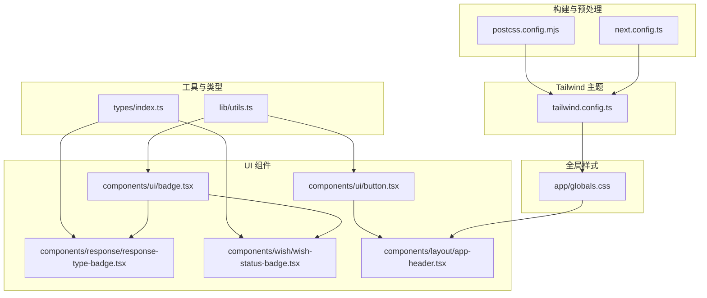
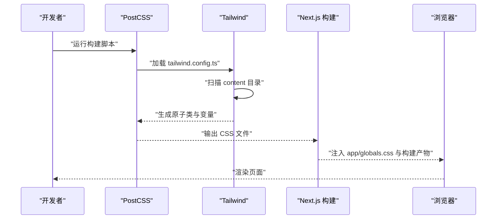
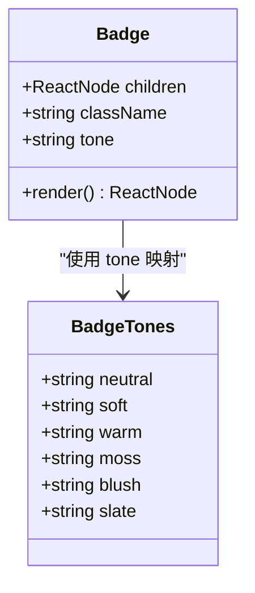
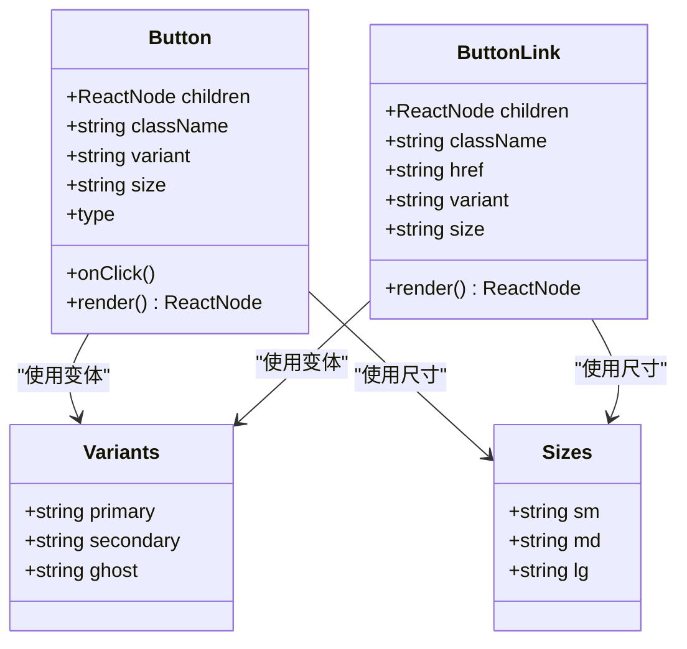
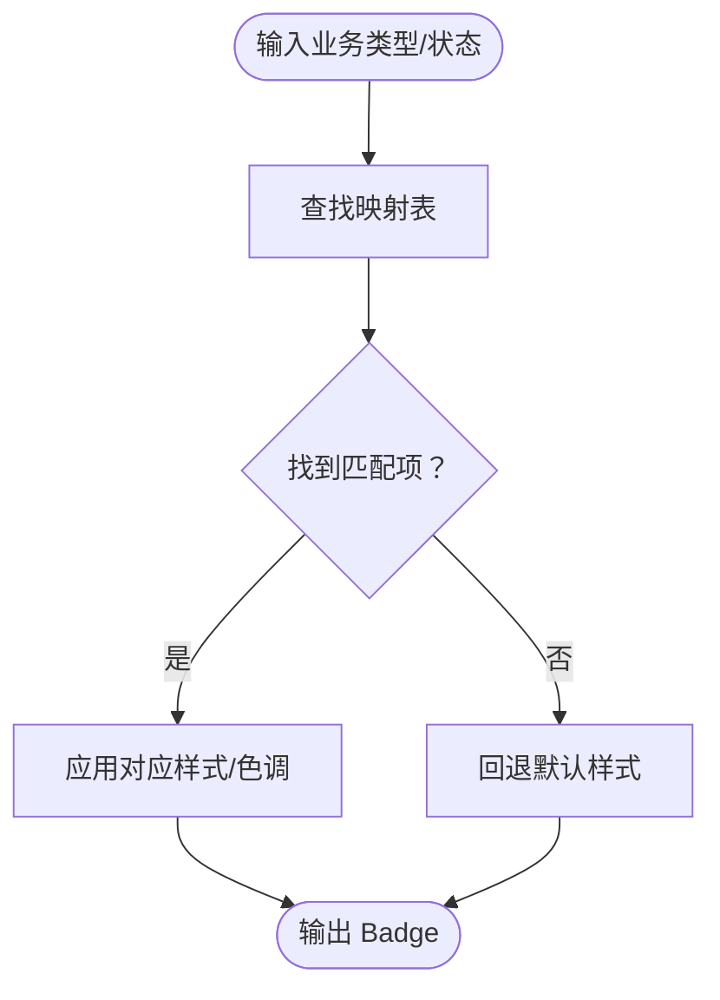
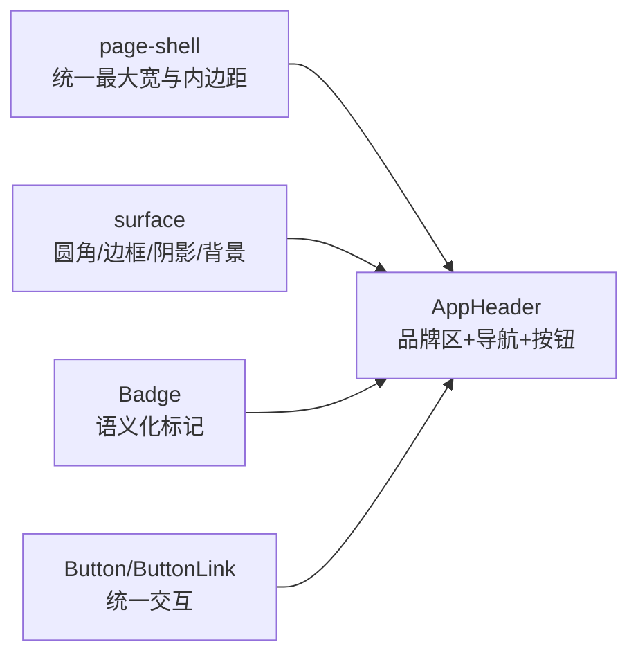
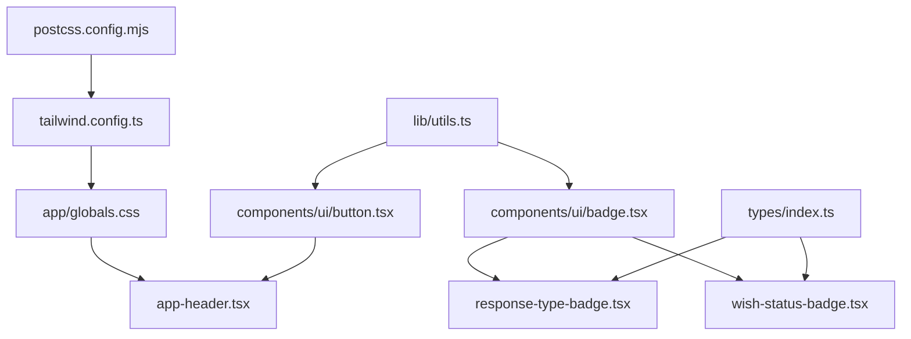

# 样式与主题

<cite>
**本文引用的文件**
- [tailwind.config.ts](file://tailwind.config.ts)
- [postcss.config.mjs](file://postcss.config.mjs)
- [app/globals.css](file://app/globals.css)
- [next.config.ts](file://next.config.ts)
- [lib/utils.ts](file://lib/utils.ts)
- [components/ui/badge.tsx](file://components/ui/badge.tsx)
- [components/ui/button.tsx](file://components/ui/button.tsx)
- [components/response/response-type-badge.tsx](file://components/response/response-type-badge.tsx)
- [components/wish/wish-status-badge.tsx](file://components/wish/wish-status-badge.tsx)
- [components/layout/app-header.tsx](file://components/layout/app-header.tsx)
- [types/index.ts](file://types/index.ts)
- [package.json](file://package.json)
</cite>

## 目录
1. [简介](#简介)
2. [项目结构](#项目结构)
3. [核心组件](#核心组件)
4. [架构总览](#架构总览)
5. [详细组件分析](#详细组件分析)
6. [依赖关系分析](#依赖关系分析)
7. [性能考量](#性能考量)
8. [故障排查指南](#故障排查指南)
9. [结论](#结论)
10. [附录](#附录)

## 简介
本文件面向“梦想回应平台”的样式与主题系统，系统性阐述 Tailwind CSS 的配置与定制、颜色与字体体系、阴影与背景图扩展、组件级样式规范（Badge、Button 及其语义化变体）、响应式策略与移动端优先理念、以及样式工程化的最佳实践（含按需构建与样式提取思路）。同时给出主题切换与暗色模式的可落地方案建议，并提供调试与维护指南。

## 项目结构
样式与主题相关的关键文件分布如下：
- 构建与预处理：PostCSS 配置启用 Tailwind 与 Autoprefixer；Next.js 构建配置控制输出目录。
- Tailwind 主题：颜色、字体族、阴影、背景图等扩展。
- 全局样式：重置与基础排版、选择器高亮、分层组件样式。
- 工具函数：类名合并工具，用于安全拼接 Tailwind 类。
- UI 组件：Badge、Button 及其语义化变体（响应类型、愿望状态）。
- 布局与导航：头部组件，演示页面壳与表面容器等通用样式层。
- 类型定义：愿望与响应的状态、类型枚举，支撑语义化 Badge 的映射。

图表来源
- [postcss.config.mjs:1-9](file://postcss.config.mjs#L1-L9)
- [next.config.ts:1-9](file://next.config.ts#L1-L9)
- [tailwind.config.ts:1-55](file://tailwind.config.ts#L1-L55)
- [app/globals.css:1-67](file://app/globals.css#L1-L67)
- [lib/utils.ts:1-12](file://lib/utils.ts#L1-L12)
- [components/ui/badge.tsx:1-37](file://components/ui/badge.tsx#L1-L37)
- [components/ui/button.tsx:1-75](file://components/ui/button.tsx#L1-L75)
- [components/response/response-type-badge.tsx:1-43](file://components/response/response-type-badge.tsx#L1-L43)
- [components/wish/wish-status-badge.tsx:1-39](file://components/wish/wish-status-badge.tsx#L1-L39)
- [components/layout/app-header.tsx:1-64](file://components/layout/app-header.tsx#L1-L64)

章节来源
- [postcss.config.mjs:1-9](file://postcss.config.mjs#L1-L9)
- [next.config.ts:1-9](file://next.config.ts#L1-L9)
- [tailwind.config.ts:1-55](file://tailwind.config.ts#L1-L55)
- [app/globals.css:1-67](file://app/globals.css#L1-L67)
- [lib/utils.ts:1-12](file://lib/utils.ts#L1-L12)
- [components/ui/badge.tsx:1-37](file://components/ui/badge.tsx#L1-L37)
- [components/ui/button.tsx:1-75](file://components/ui/button.tsx#L1-L75)
- [components/response/response-type-badge.tsx:1-43](file://components/response/response-type-badge.tsx#L1-L43)
- [components/wish/wish-status-badge.tsx:1-39](file://components/wish/wish-status-badge.tsx#L1-L39)
- [components/layout/app-header.tsx:1-64](file://components/layout/app-header.tsx#L1-L64)
- [types/index.ts:1-58](file://types/index.ts#L1-L58)

## 核心组件
本节聚焦样式系统的核心构件：颜色、字体、阴影、背景图、基础组件与语义化 Badge。

- 颜色系统
  - 自定义调色板：包含墨色、沙色、燕麦色、雾色、陶土、苔藓、腮红、线条等，覆盖文本、装饰、边框与背景的多场景需求。
  - 语义化映射：通过 Badge 的 tone 或直接类名，将状态与类型映射到具体色彩，确保一致性与可读性。
- 字体配置
  - 无衬线与衬线双字体族扩展，优先本地字体链路，保证在不同系统下的稳定呈现。
- 阴影与背景
  - 卡片阴影与柔和阴影扩展，营造轻盈立体感。
  - 纸质纹理背景图，增强页面质感。
- 基础组件
  - Badge：提供 neutral、soft、warm、moss、blush、slate 等色调；支持自定义类名叠加。
  - Button：统一基类与过渡动画；提供 primary、secondary、ghost 三种变体与 sm、md、lg 尺寸；同时提供 ButtonLink 以满足导航链接按钮化需求。
- 语义化 Badge
  - 响应类型 Badge：根据响应类型映射到特定色值与标签文案。
  - 愿望状态 Badge：根据状态映射到不同 tone，直观表达进展阶段。

章节来源
- [tailwind.config.ts:10-49](file://tailwind.config.ts#L10-L49)
- [app/globals.css:54-66](file://app/globals.css#L54-L66)
- [components/ui/badge.tsx:5-12](file://components/ui/badge.tsx#L5-L12)
- [components/ui/badge.tsx:20-36](file://components/ui/badge.tsx#L20-L36)
- [components/ui/button.tsx:6-16](file://components/ui/button.tsx#L6-L16)
- [components/ui/button.tsx:40-56](file://components/ui/button.tsx#L40-L56)
- [components/ui/button.tsx:59-74](file://components/ui/button.tsx#L59-L74)
- [components/response/response-type-badge.tsx:4-32](file://components/response/response-type-badge.tsx#L4-L32)
- [components/wish/wish-status-badge.tsx:4-28](file://components/wish/wish-status-badge.tsx#L4-L28)

## 架构总览
Tailwind CSS 在本项目中的工作流如下：
- PostCSS 作为编译管线入口，启用 Tailwind 与 Autoprefixer。
- Tailwind 读取配置文件，扫描内容目录，生成所需原子类。
- Next.js 构建时进行样式提取与产物输出。
- 全局样式文件集中引入 Tailwind 层并定义基础样式与组件层样式。
- UI 组件通过工具函数安全合并类名，实现一致的外观与交互。

图表来源
- [postcss.config.mjs:1-9](file://postcss.config.mjs#L1-L9)
- [tailwind.config.ts:3-9](file://tailwind.config.ts#L3-L9)
- [app/globals.css:1-3](file://app/globals.css#L1-L3)
- [next.config.ts:3-6](file://next.config.ts#L3-L6)

章节来源
- [postcss.config.mjs:1-9](file://postcss.config.mjs#L1-L9)
- [tailwind.config.ts:1-55](file://tailwind.config.ts#L1-L55)
- [app/globals.css:1-67](file://app/globals.css#L1-L67)
- [next.config.ts:1-9](file://next.config.ts#L1-L9)

## 详细组件分析

### Badge 组件
Badge 提供统一的标记样式与多种语义化色调，支持通过 tone 或直接传入 className 进行扩展。其设计要点：
- 使用伪元素前缀展示彩色圆点，强调可读性与层级感。
- tone 映射至不同色彩组合，便于快速表达状态或类型。
- 支持自定义类名叠加，满足局部差异化需求。

图表来源
- [components/ui/badge.tsx:5-12](file://components/ui/badge.tsx#L5-L12)
- [components/ui/badge.tsx:20-36](file://components/ui/badge.tsx#L20-L36)

章节来源
- [components/ui/badge.tsx:1-37](file://components/ui/badge.tsx#L1-L37)
- [lib/utils.ts:1-3](file://lib/utils.ts#L1-L3)

### Button 组件
Button 提供统一的交互基类与多种变体与尺寸，兼顾视觉层次与可用性：
- 变体：primary（强调）、secondary（导航式弱化）、ghost（极简下划线）。
- 尺寸：sm、md、lg 对应不同内边距与字号。
- 行为：统一过渡、焦点环、禁用态与点击事件。
- ButtonLink：基于 Next.js Link 的无刷新导航按钮化。

图表来源
- [components/ui/button.tsx:6-16](file://components/ui/button.tsx#L6-L16)
- [components/ui/button.tsx:18-22](file://components/ui/button.tsx#L18-L22)
- [components/ui/button.tsx:40-56](file://components/ui/button.tsx#L40-L56)
- [components/ui/button.tsx:59-74](file://components/ui/button.tsx#L59-L74)

章节来源
- [components/ui/button.tsx:1-75](file://components/ui/button.tsx#L1-L75)
- [lib/utils.ts:1-3](file://lib/utils.ts#L1-L3)

### 语义化 Badge（响应类型与愿望状态）
两类语义化 Badge 分别将业务类型与状态映射到具体样式：
- 响应类型 Badge：根据响应类型返回对应色值与标签文案，便于在列表与卡片中快速识别。
- 愿望状态 Badge：根据状态选择 tone，直观表达进展阶段。

图表来源
- [components/response/response-type-badge.tsx:4-32](file://components/response/response-type-badge.tsx#L4-L32)
- [components/wish/wish-status-badge.tsx:4-28](file://components/wish/wish-status-badge.tsx#L4-L28)
- [types/index.ts:1-14](file://types/index.ts#L1-L14)
- [types/index.ts:16-21](file://types/index.ts#L16-L21)

章节来源
- [components/response/response-type-badge.tsx:1-43](file://components/response/response-type-badge.tsx#L1-L43)
- [components/wish/wish-status-badge.tsx:1-39](file://components/wish/wish-status-badge.tsx#L1-L39)
- [types/index.ts:1-58](file://types/index.ts#L1-L58)

### 布局与页面壳样式
- 页面壳（page-shell）：统一最大宽度与水平内边距，适配不同屏幕尺寸。
- 表面容器（surface）：圆角、边框、阴影与背景的统一表面风格。
- 头部导航：使用 Badge 与 ButtonLink 实现品牌标识、导航与行动按钮的协调布局。

图表来源
- [app/globals.css:54-66](file://app/globals.css#L54-L66)
- [components/layout/app-header.tsx:22-61](file://components/layout/app-header.tsx#L22-L61)
- [components/ui/badge.tsx:20-36](file://components/ui/badge.tsx#L20-L36)
- [components/ui/button.tsx:59-74](file://components/ui/button.tsx#L59-L74)

章节来源
- [app/globals.css:54-66](file://app/globals.css#L54-L66)
- [components/layout/app-header.tsx:1-64](file://components/layout/app-header.tsx#L1-L64)

## 依赖关系分析
- 构建链路：PostCSS → Tailwind → Next.js → 浏览器。
- 主题扩展：Tailwind 配置扩展颜色、字体、阴影与背景图，全局样式文件引入 Tailwind 层并定义组件层样式。
- 组件依赖：UI 组件依赖工具函数进行类名合并，语义化 Badge 依赖类型定义进行映射。

图表来源
- [postcss.config.mjs:1-9](file://postcss.config.mjs#L1-L9)
- [tailwind.config.ts:1-55](file://tailwind.config.ts#L1-L55)
- [app/globals.css:1-67](file://app/globals.css#L1-L67)
- [lib/utils.ts:1-12](file://lib/utils.ts#L1-L12)
- [components/ui/badge.tsx:1-37](file://components/ui/badge.tsx#L1-L37)
- [components/ui/button.tsx:1-75](file://components/ui/button.tsx#L1-L75)
- [components/response/response-type-badge.tsx:1-43](file://components/response/response-type-badge.tsx#L1-L43)
- [components/wish/wish-status-badge.tsx:1-39](file://components/wish/wish-status-badge.tsx#L1-L39)
- [components/layout/app-header.tsx:1-64](file://components/layout/app-header.tsx#L1-L64)
- [types/index.ts:1-58](file://types/index.ts#L1-L58)

章节来源
- [postcss.config.mjs:1-9](file://postcss.config.mjs#L1-L9)
- [tailwind.config.ts:1-55](file://tailwind.config.ts#L1-L55)
- [app/globals.css:1-67](file://app/globals.css#L1-L67)
- [lib/utils.ts:1-12](file://lib/utils.ts#L1-L12)
- [components/ui/badge.tsx:1-37](file://components/ui/badge.tsx#L1-L37)
- [components/ui/button.tsx:1-75](file://components/ui/button.tsx#L1-L75)
- [components/response/response-type-badge.tsx:1-43](file://components/response/response-type-badge.tsx#L1-L43)
- [components/wish/wish-status-badge.tsx:1-39](file://components/wish/wish-status-badge.tsx#L1-L39)
- [components/layout/app-header.tsx:1-64](file://components/layout/app-header.tsx#L1-L64)
- [types/index.ts:1-58](file://types/index.ts#L1-L58)

## 性能考量
- 构建与打包
  - 使用 Next.js 的构建目录控制与生产构建脚本，确保样式产物稳定输出。
  - Tailwind 扫描范围明确，避免无关文件参与构建，减少产物体积。
- 样式提取与按需
  - Next.js 默认进行样式提取与最小化；建议保持 Tailwind 内容扫描范围精准，避免生成冗余类。
  - 对于大型页面，可考虑拆分页面级样式或延迟加载非首屏样式。
- 渲染与交互
  - Button 统一过渡与焦点环，提升可访问性与性能感知。
  - Badge 使用伪元素前缀与透明度组合，避免复杂阴影导致的重绘开销。

章节来源
- [next.config.ts:3-6](file://next.config.ts#L3-L6)
- [tailwind.config.ts:4-9](file://tailwind.config.ts#L4-L9)
- [components/ui/button.tsx:6-7](file://components/ui/button.tsx#L6-L7)

## 故障排查指南
- 类名不生效
  - 检查 Tailwind 内容扫描路径是否包含目标文件。
  - 确认类名拼写与工具函数合并逻辑正确。
- 颜色/字体未按预期
  - 核对 Tailwind 配置中的颜色与字体扩展是否正确加载。
  - 检查全局样式中是否覆盖了期望的默认值。
- 暗色模式缺失
  - 当前全局样式仅声明浅色方案；需要新增深色变量并在切换时更新根元素或类名。
- 响应式异常
  - 检查断点与媒体查询是否符合移动端优先策略；确认 Tailwind 断点与实际布局一致。

章节来源
- [tailwind.config.ts:4-9](file://tailwind.config.ts#L4-L9)
- [app/globals.css:5-7](file://app/globals.css#L5-L7)
- [lib/utils.ts:1-3](file://lib/utils.ts#L1-L3)

## 结论
本项目以 Tailwind CSS 为核心，结合全局样式与组件化设计，建立了清晰的颜色、字体、阴影与背景体系，并通过 Badge 与 Button 的统一规范实现了良好的可复用性与一致性。配合移动端优先的响应式策略与 Next.js 的构建链路，能够高效产出高质量的样式体验。后续可在现有基础上扩展暗色模式与更细粒度的主题变量，进一步完善主题系统的灵活性与可维护性。

## 附录

### 响应式设计与断点策略
- 移动端优先：从最小断点开始编写基础样式，再逐步向上扩展。
- 断点使用：利用 Tailwind 的 sm、md、lg 等断点类，配合页面壳与网格布局实现跨设备适配。
- 视口与滚动：全局样式中已设置平滑滚动与选择器高亮，提升移动端阅读体验。

章节来源
- [app/globals.css:13-15](file://app/globals.css#L13-L15)
- [app/globals.css:50-52](file://app/globals.css#L50-L52)
- [components/layout/app-header.tsx:53-59](file://components/layout/app-header.tsx#L53-L59)

### 主题切换与暗色模式方案（建议）
- 变量驱动：在 :root 中定义 CSS 变量，通过切换根元素类名或属性来切换主题。
- 颜色映射：为每种颜色提供明/暗两套映射，确保对比度与可读性。
- 自动检测：结合系统偏好与用户设置，自动或手动切换主题。
- 渐进增强：先保证浅色可用，再逐步完善深色体验。

[本节为概念性建议，不直接对应具体代码文件]

### 样式调试与维护最佳实践
- 统一命名：采用语义化类名与 BEM 风格，减少冲突与歧义。
- 层次管理：区分 base、component、utilities 层，避免样式覆盖混乱。
- 变量与常量：将常用颜色、尺寸、字体族集中管理，便于统一修改。
- 文档与规范：为关键组件与主题变量建立文档，便于团队协作与长期维护。

[本节为通用指导，不直接对应具体代码文件]