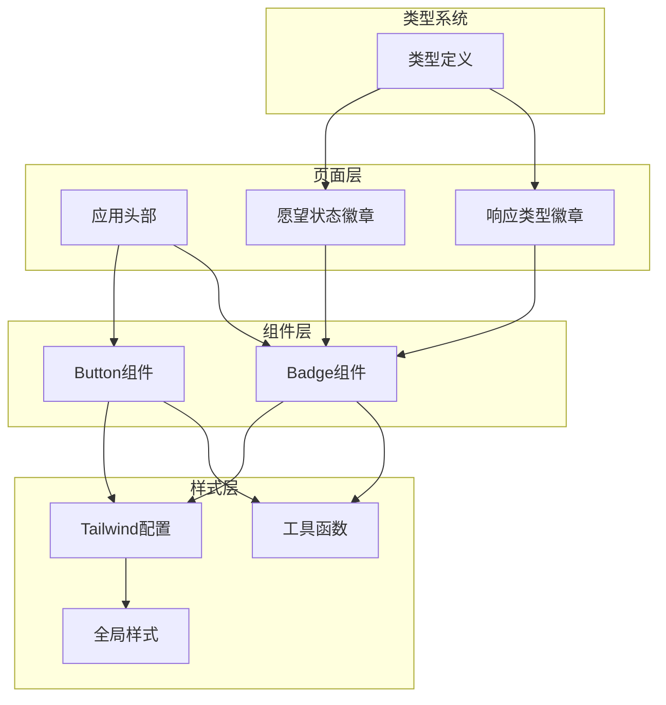
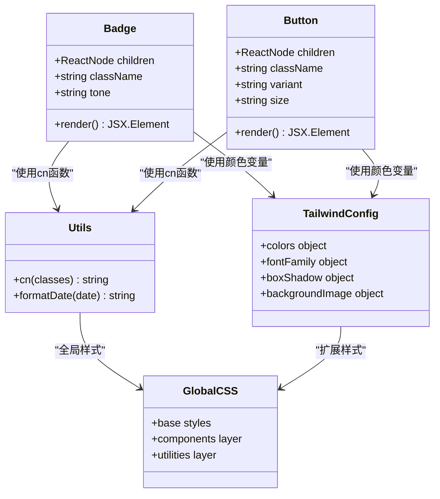
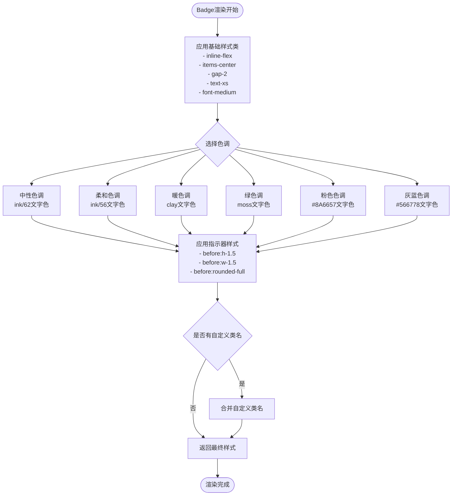
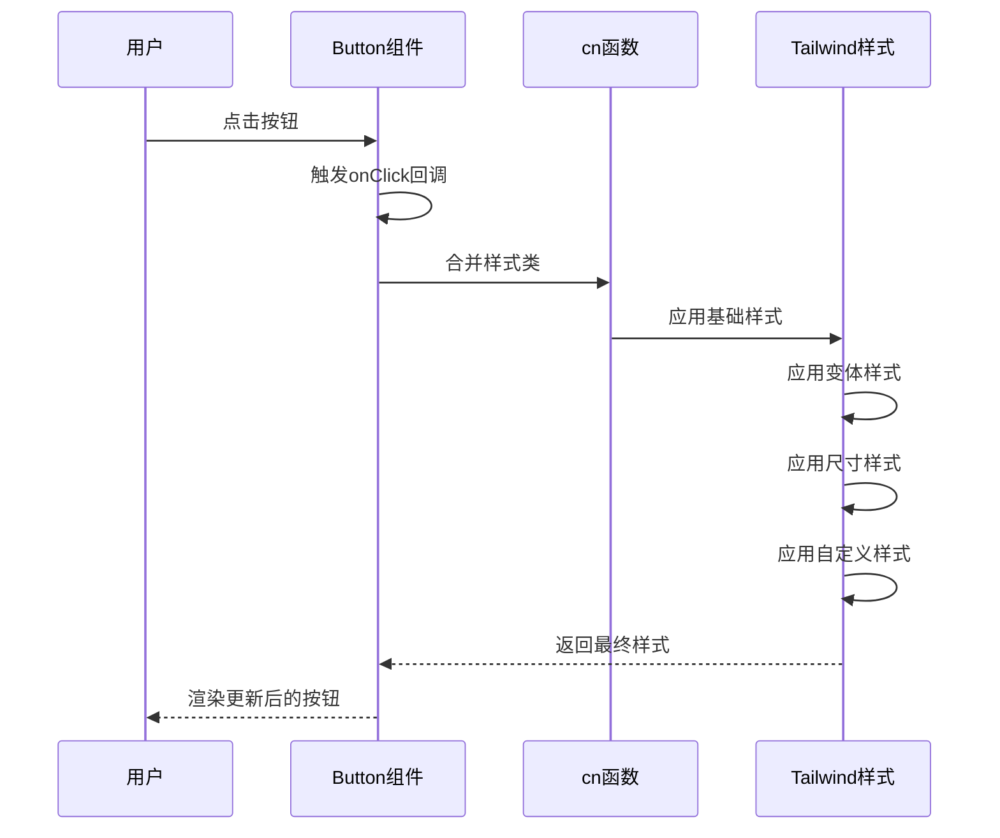
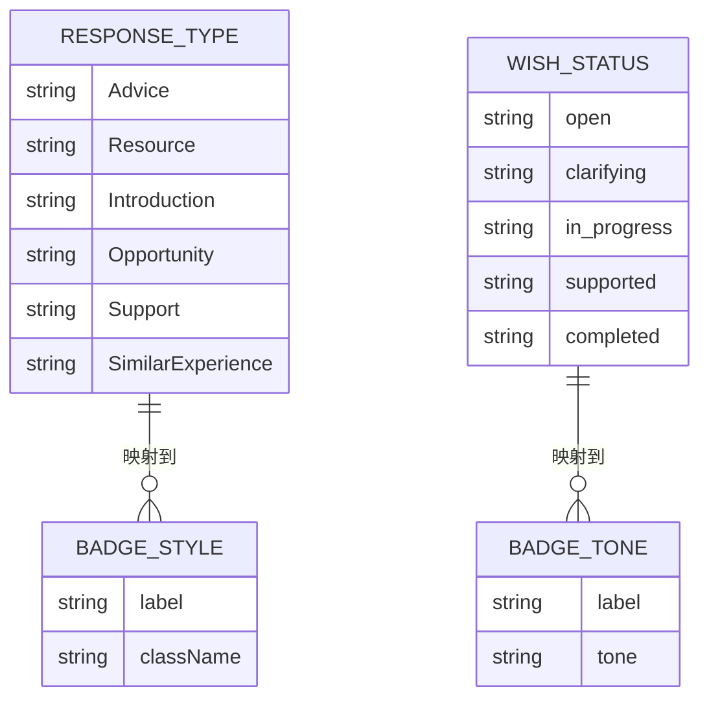
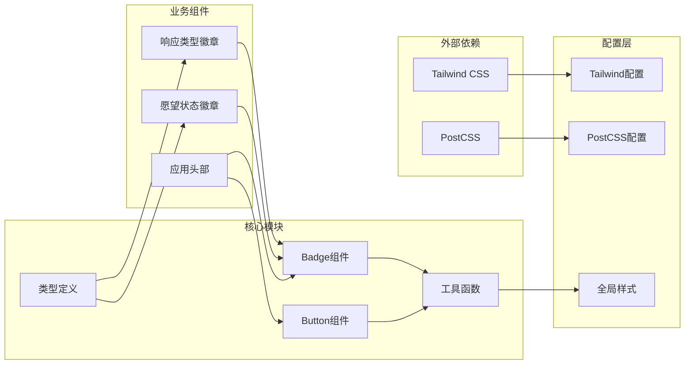

# 组件样式规范

<cite>
**本文档引用的文件**
- [components/ui/badge.tsx](file://components/ui/badge.tsx)
- [components/ui/button.tsx](file://components/ui/button.tsx)
- [tailwind.config.ts](file://tailwind.config.ts)
- [app/globals.css](file://app/globals.css)
- [lib/utils.ts](file://lib/utils.ts)
- [components/response/response-type-badge.tsx](file://components/response/response-type-badge.tsx)
- [components/wish/wish-status-badge.tsx](file://components/wish/wish-status-badge.tsx)
- [components/layout/app-header.tsx](file://components/layout/app-header.tsx)
- [types/index.ts](file://types/index.ts)
- [postcss.config.mjs](file://postcss.config.mjs)
</cite>

## 目录
1. [简介](#简介)
2. [项目结构](#项目结构)
3. [核心组件](#核心组件)
4. [架构概览](#架构概览)
5. [详细组件分析](#详细组件分析)
6. [依赖关系分析](#依赖关系分析)
7. [性能考虑](#性能考虑)
8. [故障排除指南](#故障排除指南)
9. [结论](#结论)

## 简介

本规范文档详细说明了项目中基础UI组件的样式设计原则和实现细节，重点涵盖Badge和Button等组件的原子化设计思想、变体设计规范、可复用性保证机制以及与全局样式的协调策略。通过使用Tailwind实用类进行样式组合，实现了高度一致且灵活的组件样式系统。

## 项目结构

项目采用模块化的组件架构，样式系统基于Tailwind CSS构建，实现了原子化设计原则：

**图表来源**
- [components/ui/badge.tsx:1-37](file://components/ui/badge.tsx#L1-L37)
- [components/ui/button.tsx:1-75](file://components/ui/button.tsx#L1-L75)
- [tailwind.config.ts:1-55](file://tailwind.config.ts#L1-L55)

**章节来源**
- [components/ui/badge.tsx:1-37](file://components/ui/badge.tsx#L1-L37)
- [components/ui/button.tsx:1-75](file://components/ui/button.tsx#L1-L75)
- [tailwind.config.ts:1-55](file://tailwind.config.ts#L1-L55)

## 核心组件

### Badge组件设计原则

Badge组件采用了原子化设计思想，通过组合基础样式类和主题变体实现高度可定制的徽章组件：

- **基础样式**：统一的布局、间距和字体设置
- **主题变体**：通过预定义的色调映射实现视觉一致性
- **前缀指示器**：使用伪元素创建圆形指示点
- **响应式设计**：适配不同屏幕尺寸的显示需求

### Button组件设计原则

Button组件实现了完整的交互状态管理，包括基础样式、变体和尺寸控制：

- **基础交互**：统一的过渡动画、焦点状态和禁用处理
- **变体系统**：primary、secondary、ghost三种主要风格
- **尺寸控制**：sm、md、lg三种尺寸规格
- **链接支持**：同时支持原生按钮和Next.js Link组件

**章节来源**
- [components/ui/badge.tsx:5-12](file://components/ui/badge.tsx#L5-L12)
- [components/ui/button.tsx:6-22](file://components/ui/button.tsx#L6-L22)

## 架构概览

样式系统的整体架构体现了清晰的分层设计：

**图表来源**
- [components/ui/badge.tsx:1-37](file://components/ui/badge.tsx#L1-L37)
- [components/ui/button.tsx:1-75](file://components/ui/button.tsx#L1-L75)
- [lib/utils.ts:1-12](file://lib/utils.ts#L1-L12)
- [tailwind.config.ts:10-48](file://tailwind.config.ts#L10-L48)
- [app/globals.css:1-67](file://app/globals.css#L1-L67)

## 详细组件分析

### Badge组件深度解析

Badge组件的设计体现了原子化样式的核心理念：

#### 样式架构

**图表来源**
- [components/ui/badge.tsx:20-36](file://components/ui/badge.tsx#L20-L36)

#### 变体设计规范

| 色调(Tone) | 文字颜色 | 指示器颜色 | 使用场景 |
|-----------|----------|------------|----------|
| neutral | ink/62 | ink/30 | 通用信息展示 |
| soft | ink/56 | clay/50 | 辅助信息标识 |
| warm | clay | clay/70 | 积极状态标识 |
| moss | moss | moss/80 | 成功状态标识 |
| blush | #8A6657 | #B18D7C | 特殊状态标识 |
| slate | #566778 | #7D8EA5 | 重要状态标识 |

**章节来源**
- [components/ui/badge.tsx:5-12](file://components/ui/badge.tsx#L5-L12)
- [components/response/response-type-badge.tsx:4-32](file://components/response/response-type-badge.tsx#L4-L32)
- [components/wish/wish-status-badge.tsx:4-28](file://components/wish/wish-status-badge.tsx#L4-L28)

### Button组件深度解析

Button组件提供了完整的交互状态管理和样式组合能力：

#### 样式组合流程

**图表来源**
- [components/ui/button.tsx:40-57](file://components/ui/button.tsx#L40-L57)
- [lib/utils.ts:1-3](file://lib/utils.ts#L1-L3)

#### 变体系统设计

| 变体(Variant) | 形状 | 边框 | 背景 | 文字色 | 悬停效果 | 使用场景 |
|-------------|------|------|------|--------|----------|----------|
| primary | 圆角 | 实线 | ink | 白色 | -translate-y-0.5 | 主要操作按钮 |
| secondary | 方角 | 底边 | 透明 | ink/72 | 底边变为clay/40 | 次要导航按钮 |
| ghost | 方角 | 透明 | 透明 | ink/60 | 底边变为ink/20 | 轻量级操作按钮 |

#### 尺寸规格

| 尺寸(Size) | 垂直内边距 | 字体大小 | 适用场景 |
|-----------|------------|----------|----------|
| sm | py-1.5 | text-sm | 移动端按钮 |
| md | py-2 | text-sm | 桌面端默认按钮 |
| lg | py-2.5 | text-[15px] | 大按钮操作 |

**章节来源**
- [components/ui/button.tsx:9-22](file://components/ui/button.tsx#L9-L22)
- [components/ui/button.tsx:18-22](file://components/ui/button.tsx#L18-L22)

### 类型系统集成

组件通过TypeScript类型系统确保样式使用的安全性：

**图表来源**
- [types/index.ts:8-14](file://types/index.ts#L8-L14)
- [types/index.ts:1-6](file://types/index.ts#L1-L6)

**章节来源**
- [types/index.ts:1-58](file://types/index.ts#L1-L58)
- [components/response/response-type-badge.tsx:34-42](file://components/response/response-type-badge.tsx#L34-L42)
- [components/wish/wish-status-badge.tsx:30-38](file://components/wish/wish-status-badge.tsx#L30-L38)

## 依赖关系分析

样式系统的依赖关系体现了清晰的层次结构：

**图表来源**
- [tailwind.config.ts:1-55](file://tailwind.config.ts#L1-L55)
- [postcss.config.mjs:1-9](file://postcss.config.mjs#L1-L9)
- [app/globals.css:1-67](file://app/globals.css#L1-L67)

**章节来源**
- [tailwind.config.ts:1-55](file://tailwind.config.ts#L1-L55)
- [postcss.config.mjs:1-9](file://postcss.config.mjs#L1-L9)
- [app/globals.css:1-67](file://app/globals.css#L1-L67)

## 性能考虑

### 样式优化策略

1. **原子化设计优势**
   - 减少CSS文件体积
   - 提高样式复用率
   - 降低样式冲突概率

2. **构建时优化**
   - Tailwind自动移除未使用样式
   - PostCSS优化和压缩
   - 缓存机制提升构建速度

3. **运行时性能**
   - cn函数避免不必要的样式计算
   - 条件渲染减少DOM节点
   - 合理的CSS优先级管理

### 最佳实践建议

- 避免过度嵌套的样式类
- 使用语义化类名提高可读性
- 定期清理未使用的样式类
- 保持颜色变量的一致性

## 故障排除指南

### 常见样式问题及解决方案

#### 样式冲突问题

**问题描述**：组件样式与其他样式类发生冲突

**解决方案**：
1. 使用自定义className覆盖默认样式
2. 检查Tailwind配置中的样式优先级
3. 避免在组件内部直接修改全局样式

#### 响应式问题

**问题描述**：组件在不同屏幕尺寸下显示异常

**解决方案**：
1. 使用Tailwind的响应式前缀
2. 测试关键断点的样式表现
3. 确保移动端友好的触摸目标尺寸

#### 交互状态问题

**问题描述**：按钮悬停或焦点状态不正确

**解决方案**：
1. 检查:focus-visible和:hover伪类的使用
2. 验证CSS优先级顺序
3. 确认JavaScript事件处理逻辑

**章节来源**
- [lib/utils.ts:1-3](file://lib/utils.ts#L1-L3)
- [tailwind.config.ts:10-48](file://tailwind.config.ts#L10-L48)

## 结论

本组件样式规范文档建立了基于Tailwind原子化设计的完整样式体系。通过Badge和Button组件的实现，展现了以下核心价值：

1. **一致性**：统一的颜色系统、字体规范和间距标准
2. **可复用性**：模块化的组件设计和样式组合
3. **可维护性**：清晰的类型系统和配置管理
4. **扩展性**：灵活的变体系统和主题支持

该样式系统为项目的UI组件提供了坚实的基础，确保了跨页面的一致用户体验，同时保持了足够的灵活性以适应未来的设计变更和功能扩展。