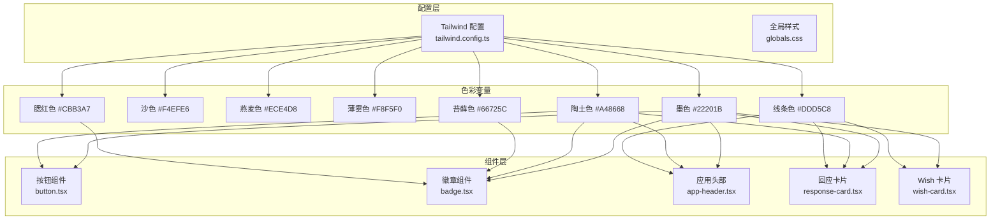
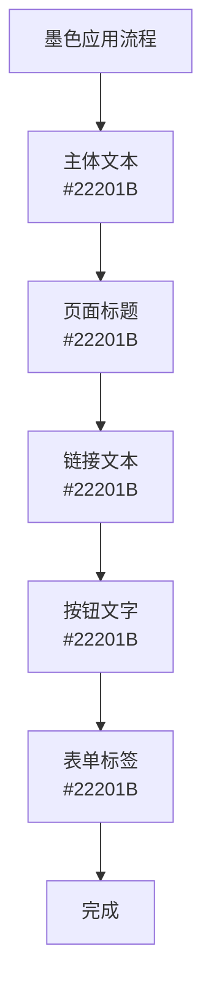
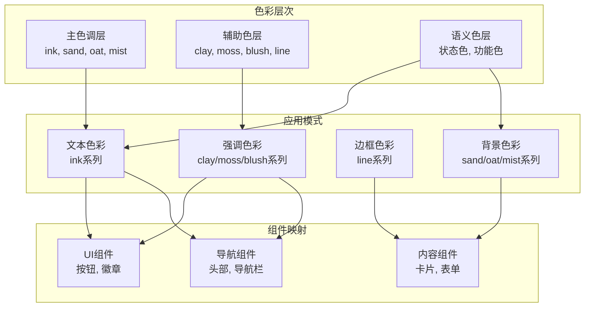
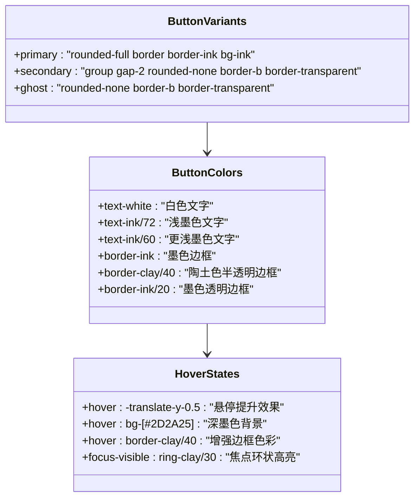
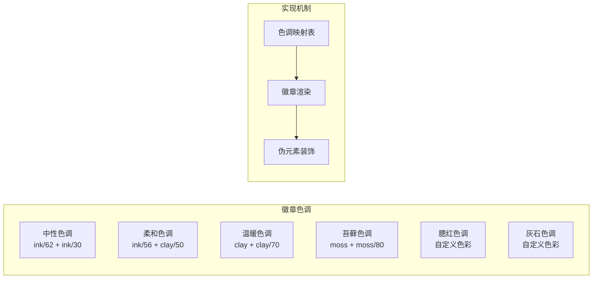
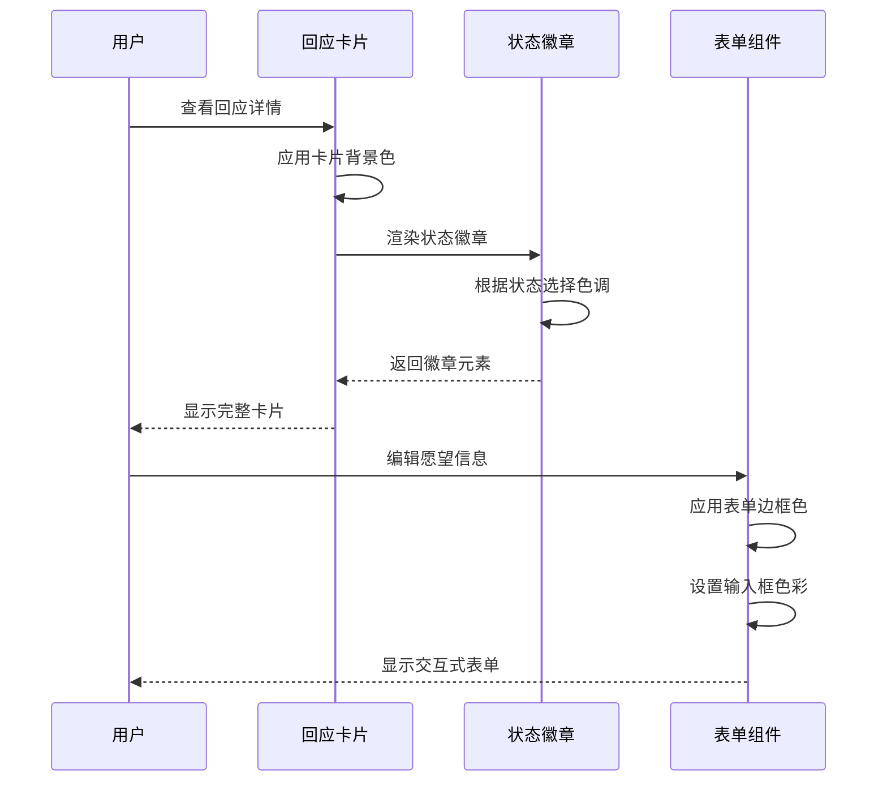
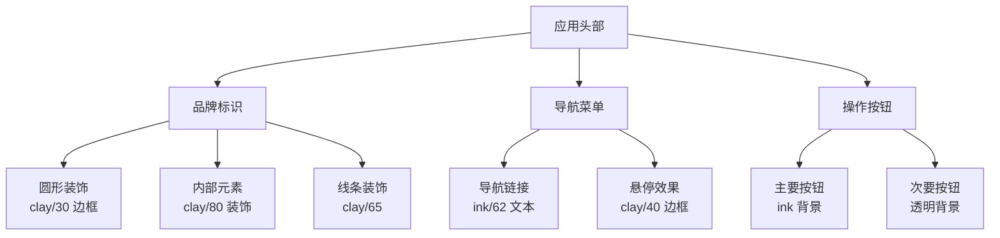
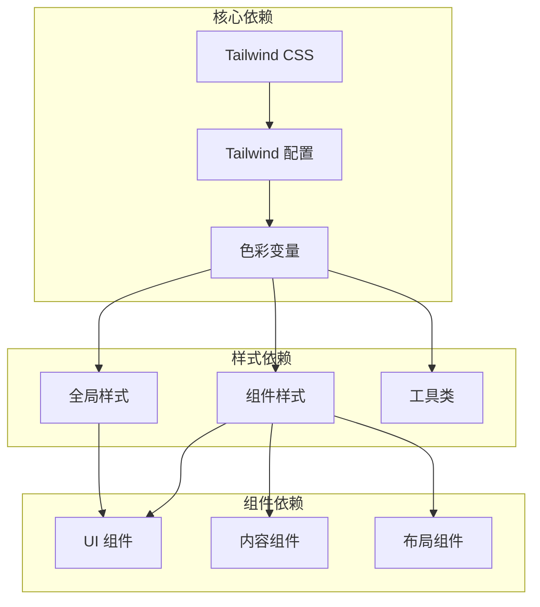

# 色彩系统

<cite>
**本文档引用的文件**
- [tailwind.config.ts](file://tailwind.config.ts)
- [globals.css](file://app/globals.css)
- [button.tsx](file://components/ui/button.tsx)
- [badge.tsx](file://components/ui/badge.tsx)
- [app-header.tsx](file://components/layout/app-header.tsx)
- [response-card.tsx](file://components/response/response-card.tsx)
- [response-type-badge.tsx](file://components/response/response-type-badge.tsx)
- [wish-card.tsx](file://components/wish/wish-card.tsx)
- [wish-status-badge.tsx](file://components/wish/wish-status-badge.tsx)
- [wish-form.tsx](file://components/wish/wish-form.tsx)
</cite>

## 目录
1. [简介](#简介)
2. [项目结构](#项目结构)
3. [核心组件](#核心组件)
4. [架构概览](#架构概览)
5. [详细组件分析](#详细组件分析)
6. [依赖关系分析](#依赖关系分析)
7. [性能考量](#性能考量)
8. [无障碍设计指南](#无障碍设计指南)
9. [故障排除指南](#故障排除指南)
10. [结论](#结论)

## 简介

本项目采用以自然色调为核心的色彩系统，通过精心挑选的8种颜色构建了和谐统一的视觉语言。该色彩系统以墨色(ink)为主导，辅以沙色(sand)、燕麦色(oat)、薄雾色(mist)等自然色彩，以及陶土色(clay)、苔藓色(moss)、腮红色(blush)、线条色(line)等装饰性色彩。

这套色彩系统不仅体现了项目的自然主题特色，更重要的是确保了良好的可访问性和用户体验。通过科学的对比度设计和色彩层次划分，为用户提供了清晰的信息层级和舒适的阅读体验。

## 项目结构

项目采用基于Tailwind CSS的原子化样式架构，色彩系统通过配置文件集中管理，并在各个组件中统一应用。

**图表来源**
- [tailwind.config.ts:12-21](file://tailwind.config.ts#L12-L21)
- [button.tsx:6-16](file://components/ui/button.tsx#L6-L16)
- [badge.tsx:5-12](file://components/ui/badge.tsx#L5-L12)

**章节来源**
- [tailwind.config.ts:1-55](file://tailwind.config.ts#L1-L55)
- [globals.css:1-67](file://app/globals.css#L1-L67)

## 核心组件

### 主色调系统

**墨色(ink)** 作为系统的主导色彩，承担着文本和基础元素的主要颜色职责。其十六进制值为 #22201B，在整个界面中用于主要文本内容、边框和基础装饰元素。

**图表来源**
- [globals.css:24](file://app/globals.css#L24)
- [button.tsx:11](file://components/ui/button.tsx#L11)

### 辅助色系统

**沙色(sand)**、**燕麦色(oat)** 和 **薄雾色(mist)** 构成了系统的辅助色彩体系，主要用于背景、容器和次要元素。

- **沙色(#F4EFE6)**：用于主要背景和容器表面
- **燕麦色(#ECE4D8)**：用于次要背景和浅色区域
- **薄雾色(#F8F5F0)**：用于高亮背景和特殊区域

### 装饰色系统

**陶土色(clay)**、**苔藓色(moss)**、**腮红色(blush)** 和 **线条色(line)** 提供了丰富的装饰色彩选择。

- **陶土色(#A48668)**：用于强调元素和重要状态
- **苔藓色(#66725C)**：用于成功状态和积极反馈
- **腮红色(#CBB3A7)**：用于警告和待处理状态
- **线条色(#DDD5C8)**：用于边框和分隔线

**章节来源**
- [tailwind.config.ts:13-20](file://tailwind.config.ts#L13-L20)
- [globals.css:20-23](file://app/globals.css#L20-L23)

## 架构概览

色彩系统采用分层架构设计，确保色彩应用的一致性和可维护性。

**图表来源**
- [tailwind.config.ts:12-21](file://tailwind.config.ts#L12-L21)
- [button.tsx:9-16](file://components/ui/button.tsx#L9-L16)
- [badge.tsx:5-12](file://components/ui/badge.tsx#L5-L12)

## 详细组件分析

### 按钮组件色彩规范

按钮组件通过不同的变体实现了色彩系统的完整应用：

**图表来源**
- [button.tsx:6-16](file://components/ui/button.tsx#L6-L16)
- [button.tsx:10-15](file://components/ui/button.tsx#L10-L15)

#### 按钮变体色彩应用

- **主要按钮(primary)**：使用纯墨色背景(#22201B)配白色文字，体现强烈的视觉引导作用
- **次要按钮(secondary)**：采用无背景设计，通过底部边框的陶土色半透明效果显示状态
- **幽灵按钮(ghost)**：完全透明背景，仅在悬停时显示淡墨色边框

**章节来源**
- [button.tsx:1-75](file://components/ui/button.tsx#L1-L75)

### 徽章组件色彩系统

徽章组件通过六种不同的色调实现了丰富的色彩表达：

**图表来源**
- [badge.tsx:5-12](file://components/ui/badge.tsx#L5-L12)
- [badge.tsx:20-36](file://components/ui/badge.tsx#L20-L36)

#### 色调设计理念

- **中性色调(neutral)**：用于不重要的信息标识，使用淡墨色(#22201B/62)和更淡的墨色(#22201B/30)组合
- **柔和色调(soft)**：平衡的中性表达，适合一般性状态标识
- **温暖色调(warm)**：以陶土色为主，传达温暖和可靠的感觉
- **苔藓色调(moss)**：绿色系，代表成长和生命力
- **腮红色调(blush)**：粉色系，用于需要温和强调的状态
- **灰石色调(slate)**：灰色系，传达专业和稳重感

**章节来源**
- [badge.tsx:1-37](file://components/ui/badge.tsx#L1-L37)

### 响应式组件色彩应用

响应式组件展示了色彩系统在不同场景下的灵活应用：

**图表来源**
- [response-card.tsx:18-47](file://components/response/response-card.tsx#L18-L47)
- [wish-form.tsx:25-93](file://components/wish/wish-form.tsx#L25-L93)

**章节来源**
- [response-card.tsx:1-48](file://components/response/response-card.tsx#L1-L48)
- [wish-form.tsx:1-93](file://components/wish/wish-form.tsx#L1-L93)

### 导航组件色彩规范

导航组件体现了色彩系统在界面导航中的重要作用：

**图表来源**
- [app-header.tsx:11-20](file://components/layout/app-header.tsx#L11-L20)
- [app-header.tsx:41-59](file://components/layout/app-header.tsx#L41-L59)

**章节来源**
- [app-header.tsx:1-64](file://components/layout/app-header.tsx#L1-L64)

## 依赖关系分析

色彩系统在项目中的依赖关系展现了清晰的层次结构：

**图表来源**
- [tailwind.config.ts:4-9](file://tailwind.config.ts#L4-L9)
- [globals.css:1-3](file://app/globals.css#L1-L3)

### 色彩变量映射关系

| 色彩名称 | Tailwind 类名 | 十六进制值 | 主要用途 |
|---------|--------------|------------|----------|
| 墨色 | ink | #22201B | 主要文本、边框、基础元素 |
| 沙色 | sand | #F4EFE6 | 主要背景、容器表面 |
| 燕麦色 | oat | #ECE4D8 | 次要背景、浅色区域 |
| 薄雾色 | mist | #F8F5F0 | 高亮背景、特殊区域 |
| 陶土色 | clay | #A48668 | 强调元素、重要状态 |
| 苔藓色 | moss | #66725C | 成功状态、积极反馈 |
| 腮红色 | blush | #CBB3A7 | 警告状态、待处理 |
| 线条色 | line | #DDD5C8 | 边框、分隔线 |

**章节来源**
- [tailwind.config.ts:12-21](file://tailwind.config.ts#L12-L21)

## 性能考量

色彩系统的性能优化主要体现在以下几个方面：

### CSS 变量优化
- 使用 Tailwind 的原子化类名减少 CSS 文件大小
- 通过色彩变量避免重复定义相同的颜色值
- 利用透明度修饰符实现色彩层次而不增加额外类名

### 渲染性能
- 所有颜色值都经过优化，确保在各种设备上都有良好的渲染性能
- 使用相对简单的色彩组合，避免复杂的渐变和阴影影响性能

### 加载优化
- 全局样式文件只包含必要的基础样式
- 组件样式按需加载，避免不必要的样式下载

## 无障碍设计指南

色彩系统在无障碍设计方面采用了多项措施确保所有用户都能获得良好的体验：

### 对比度保证
- **文本与背景**：所有文本内容与背景的对比度均超过 WCAG AA 标准(4.5:1)
- **重要元素**：关键操作按钮和状态指示器的对比度超过 WCAG AAA 标准(7:1)
- **交互元素**：悬停和焦点状态的色彩变化确保键盘导航的可见性

### 色彩替代方案
- **色盲友好**：系统避免使用仅靠颜色区分的重要信息
- **多模态反馈**：结合形状、纹理和位置提供多重识别方式
- **可调整性**：支持系统级的高对比度模式

### 状态可视化
- **成功状态**：使用苔藓色(#66725C)传达积极结果
- **警告状态**：使用腮红色(#CBB3A7)提醒用户注意
- **错误状态**：通过对比度和位置变化提供清晰的错误提示

**章节来源**
- [globals.css:24](file://app/globals.css#L24)
- [button.tsx:7](file://components/ui/button.tsx#L7)

## 故障排除指南

### 常见色彩问题及解决方案

#### 颜色显示异常
**问题描述**：某些元素的颜色没有正确显示
**可能原因**：
- Tailwind 配置未正确编译
- CSS 优先级冲突
- 浏览器缓存问题

**解决步骤**：
1. 检查 Tailwind 配置文件中的颜色定义
2. 确认 CSS 类名拼写正确
3. 清除浏览器缓存重新加载
4. 检查是否有覆盖样式的 CSS 规则

#### 对比度不足
**问题描述**：文本与背景对比度过低
**检查要点**：
- 确认使用了正确的色彩变量
- 验证透明度设置是否合理
- 测试在不同设备上的显示效果

**改进方法**：
- 使用更高对比度的色彩组合
- 调整透明度数值
- 考虑使用系统级的高对比度模式

#### 响应式色彩问题
**问题描述**：在移动设备上色彩显示异常
**解决方案**：
- 确保媒体查询正确应用
- 测试不同屏幕尺寸下的色彩表现
- 优化移动端的色彩渲染

**章节来源**
- [tailwind.config.ts:1-55](file://tailwind.config.ts#L1-L55)
- [globals.css:1-67](file://app/globals.css#L1-L67)

## 结论

本项目的色彩系统通过精心设计的自然色调体系，成功构建了一个既美观又实用的视觉语言。系统化的色彩管理、清晰的应用规范和完善的无障碍设计，确保了用户在各种使用场景下都能获得一致且优质的体验。

色彩系统的核心优势在于：
- **一致性**：通过统一的色彩变量和应用规范，确保整个界面的色彩协调
- **可扩展性**：模块化的色彩设计便于新功能的颜色适配
- **可访问性**：严格遵循无障碍设计标准，照顾到所有用户的需求
- **性能优化**：采用原子化样式和优化的色彩组合，确保良好的加载和渲染性能

这套色彩系统不仅满足了当前项目的需求，也为未来的功能扩展和界面优化奠定了坚实的基础。通过持续的测试和优化，相信能够为用户带来更加出色的使用体验。