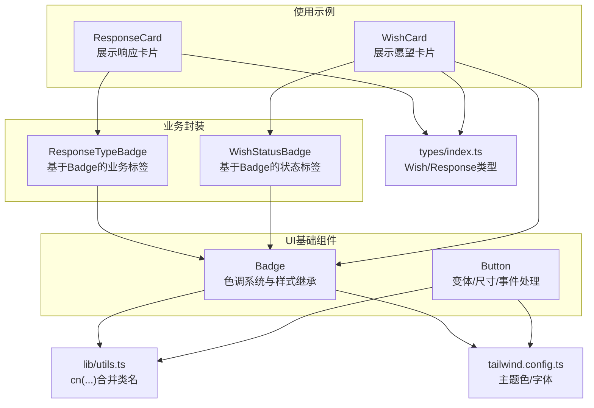
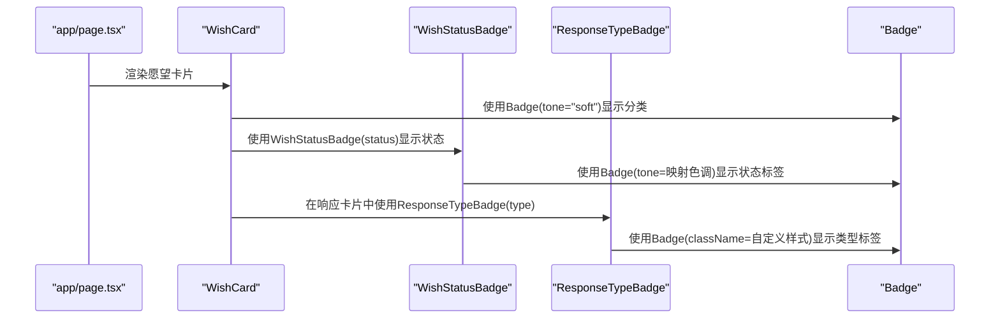
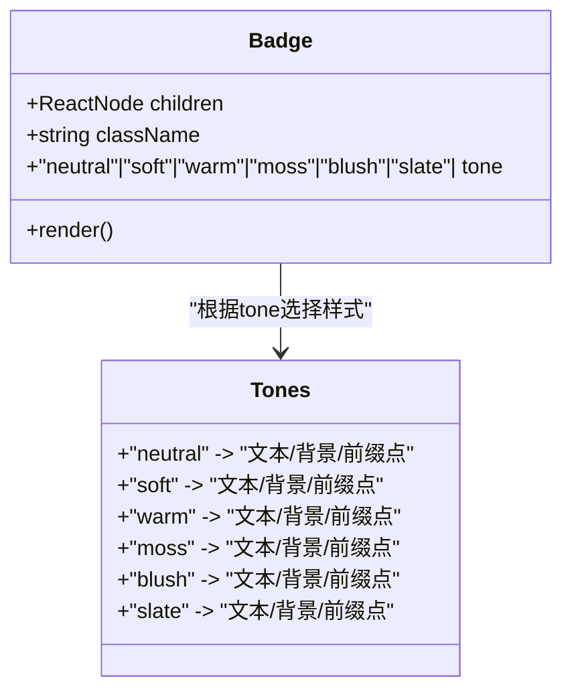
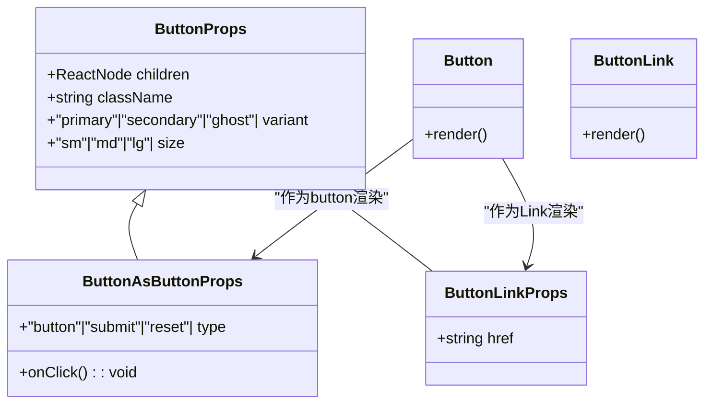
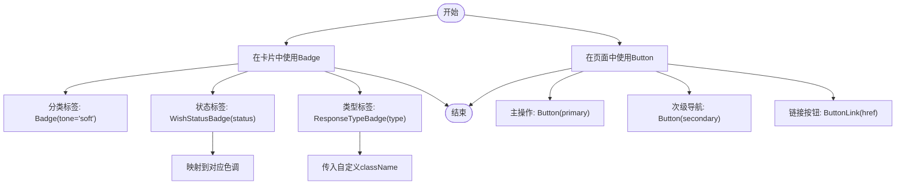
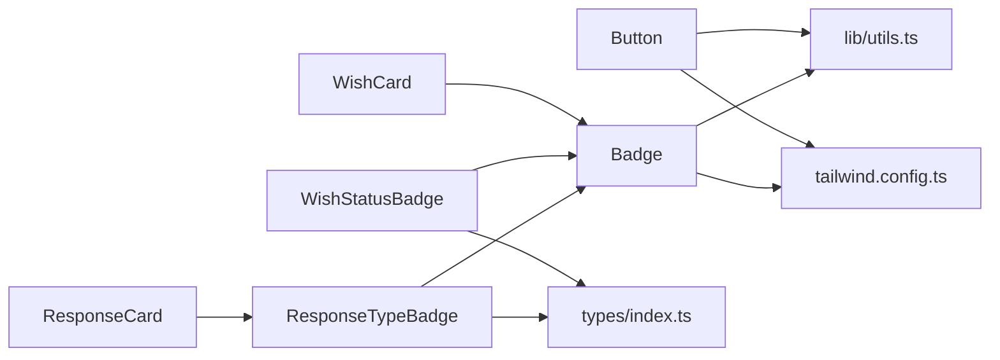

# UI基础组件

<cite>
**本文档引用的文件**
- [components/ui/badge.tsx](file://components/ui/badge.tsx)
- [components/ui/button.tsx](file://components/ui/button.tsx)
- [components/response/response-type-badge.tsx](file://components/response/response-type-badge.tsx)
- [components/wish/wish-status-badge.tsx](file://components/wish/wish-status-badge.tsx)
- [components/response/response-card.tsx](file://components/response/response-card.tsx)
- [components/wish/wish-card.tsx](file://components/wish/wish-card.tsx)
- [lib/utils.ts](file://lib/utils.ts)
- [types/index.ts](file://types/index.ts)
- [tailwind.config.ts](file://tailwind.config.ts)
- [app/page.tsx](file://app/page.tsx)
</cite>

## 目录
1. [简介](#简介)
2. [项目结构](#项目结构)
3. [核心组件](#核心组件)
4. [架构总览](#架构总览)
5. [详细组件分析](#详细组件分析)
6. [依赖关系分析](#依赖关系分析)
7. [性能考虑](#性能考虑)
8. [故障排查指南](#故障排查指南)
9. [结论](#结论)
10. [附录](#附录)

## 简介
本文件聚焦于UI基础组件的设计与实现，重点解析Badge与Button两大组件：Badge的色调系统（tones）配置、样式继承机制与className合并策略；Button的变体类型、尺寸规格、状态管理与事件处理机制；以及组件的类型定义、属性接口与默认值设置。同时提供丰富的使用示例、可访问性设计、响应式适配与性能优化建议，并说明组件间的组合模式与扩展方法。

## 项目结构
UI基础组件位于components/ui目录下，配合工具函数lib/utils.ts与类型定义types/index.ts，形成清晰的分层架构：
- 基础组件：badge.tsx、button.tsx
- 业务封装：response-type-badge.tsx、wish-status-badge.tsx
- 使用示例：response-card.tsx、wish-card.tsx
- 工具函数：cn(...)用于类名合并
- 类型定义：Wish、Response等业务类型
- 样式系统：tailwind.config.ts定义主题色与字体

图表来源
- [components/ui/badge.tsx:1-37](file://components/ui/badge.tsx#L1-L37)
- [components/ui/button.tsx:1-75](file://components/ui/button.tsx#L1-L75)
- [components/response/response-type-badge.tsx:1-43](file://components/response/response-type-badge.tsx#L1-L43)
- [components/wish/wish-status-badge.tsx:1-39](file://components/wish/wish-status-badge.tsx#L1-L39)
- [components/response/response-card.tsx:1-48](file://components/response/response-card.tsx#L1-L48)
- [components/wish/wish-card.tsx:1-93](file://components/wish/wish-card.tsx#L1-L93)
- [lib/utils.ts:1-12](file://lib/utils.ts#L1-L12)
- [types/index.ts:1-58](file://types/index.ts#L1-L58)
- [tailwind.config.ts:1-55](file://tailwind.config.ts#L1-L55)

章节来源
- [components/ui/badge.tsx:1-37](file://components/ui/badge.tsx#L1-L37)
- [components/ui/button.tsx:1-75](file://components/ui/button.tsx#L1-L75)
- [lib/utils.ts:1-12](file://lib/utils.ts#L1-L12)
- [tailwind.config.ts:1-55](file://tailwind.config.ts#L1-L55)

## 核心组件
本节概述两个核心组件的职责与能力边界：
- Badge：轻量级标签组件，提供多色调（tones）与前缀指示点，适合在卡片、列表中标识状态或分类。
- Button：通用按钮组件，支持primary/secondary/ghost三种变体与sm/md/lg三种尺寸，既可作为原生button，也可作为Next.js Link渲染为链接。

章节来源
- [components/ui/badge.tsx:14-36](file://components/ui/badge.tsx#L14-L36)
- [components/ui/button.tsx:24-74](file://components/ui/button.tsx#L24-L74)

## 架构总览
下图展示了从页面到组件的调用链路，体现组件间组合与复用关系。

图表来源
- [app/page.tsx:1-29](file://app/page.tsx#L1-L29)
- [components/wish/wish-card.tsx:1-93](file://components/wish/wish-card.tsx#L1-L93)
- [components/wish/wish-status-badge.tsx:1-39](file://components/wish/wish-status-badge.tsx#L1-L39)
- [components/response/response-type-badge.tsx:1-43](file://components/response/response-type-badge.tsx#L1-L43)
- [components/ui/badge.tsx:1-37](file://components/ui/badge.tsx#L1-L37)

## 详细组件分析

### Badge组件深度解析
- 设计理念
  - 以“前缀指示点”+“文本”的简洁形式承载信息，强调可读性与一致性。
  - 通过色调系统（tones）实现语义化区分，避免仅靠颜色造成视觉负担。
- 色调系统（tones）
  - 预置六种色调：neutral、soft、warm、moss、blush、slate。
  - 每个色调由文本色、背景色与前缀点色三部分组成，确保在浅色背景下具备足够对比度。
- 样式继承机制
  - 基础样式统一：居中对齐、无圆角、细小字号、字母间距微调、前缀点尺寸与内容占位。
  - tones映射：按tone选择对应的文本/背景/前缀点类名，实现语义化着色。
- className合并策略
  - 采用lib/utils.ts中的cn(...)进行类名合并，遵循“基础样式 + tone映射 + 外部传入className”的顺序，保证外部className具有最高优先级。
- 可访问性与响应式
  - 文本语义明确，适合屏幕阅读器识别。
  - 响应式方面，当前实现未显式添加断点类名，但基础样式具备良好的跨设备表现。
- 性能特性
  - 无状态组件，纯渲染，开销极低。
  - 通过预设色调减少运行时计算，提升渲染效率。

图表来源
- [components/ui/badge.tsx:5-12](file://components/ui/badge.tsx#L5-L12)
- [components/ui/badge.tsx:20-36](file://components/ui/badge.tsx#L20-L36)

章节来源
- [components/ui/badge.tsx:5-12](file://components/ui/badge.tsx#L5-L12)
- [components/ui/badge.tsx:20-36](file://components/ui/badge.tsx#L20-L36)
- [lib/utils.ts:1-3](file://lib/utils.ts#L1-L3)

### Button组件深度解析
- 设计理念
  - 提供统一的交互反馈与过渡动画，兼顾可用性与品牌风格。
  - 支持两种渲染形态：原生button与Next.js Link，满足不同路由需求。
- 变体类型（variants）
  - primary：圆角、边框、深色背景、悬停上移与轻微阴影，适合主操作。
  - secondary：无圆角、底部边框、透明背景、悬停改变边框与文本色，适合次级导航/装饰性按钮。
  - ghost：无圆角、底部边框、透明背景、悬停改变边框与文本色，适合弱操作或内联按钮。
- 尺寸规格（sizes）
  - sm：紧凑尺寸，适合工具栏或辅助操作。
  - md：标准尺寸，适合大多数场景。
  - lg：较大尺寸，适合重要操作或移动端。
- 状态管理与事件处理
  - 禁用态：禁用指针事件并降低不透明度，保持视觉一致性。
  - 聚焦态：焦点可见轮廓与半透明环形光晕，提升键盘可达性。
  - 悬停/激活态：提供平滑过渡与悬停上移效果，增强交互反馈。
  - 事件处理：支持onClick回调，type属性控制原生button行为。
- 类型定义与默认值
  - ButtonProps：children、className、variant、size。
  - ButtonAsButtonProps：在ButtonProps基础上增加onClick与type。
  - ButtonLinkProps：在ButtonProps基础上增加href。
  - 默认值：variant默认"primary"，size默认"md"。
- 可访问性与响应式
  - 焦点管理：通过focus-visible与ring实现键盘可达性。
  - 字体与对比度：基于主题色与字体配置，确保在浅色背景下具备良好可读性。
  - 响应式：通过Tailwind断点类名在不同设备上调整内边距与字号。
- 性能特性
  - 无状态组件，纯渲染，开销极低。
  - 通过预设变体与尺寸减少运行时计算。

图表来源
- [components/ui/button.tsx:24-47](file://components/ui/button.tsx#L24-L47)
- [components/ui/button.tsx:59-74](file://components/ui/button.tsx#L59-L74)

章节来源
- [components/ui/button.tsx:6-22](file://components/ui/button.tsx#L6-L22)
- [components/ui/button.tsx:24-47](file://components/ui/button.tsx#L24-L47)
- [components/ui/button.tsx:59-74](file://components/ui/button.tsx#L59-L74)

### 组件使用示例与组合模式
- Badge在卡片中的应用
  - 分类标签：WishCard中使用Badge(tone="soft")展示分类。
  - 状态标签：WishStatusBadge基于Badge映射状态到不同色调。
- Badge在业务标签中的应用
  - 响应类型标签：ResponseTypeBadge基于Badge传入自定义className，实现特定类型的视觉呈现。
- Button在页面中的应用
  - 主操作按钮：Button(variant="primary", size="md")用于提交或跳转。
  - 导航按钮：Button(variant="secondary", size="sm")用于侧边或工具栏。
  - 链接按钮：ButtonLink(href="/path")用于外链或内部路由跳转。
- 组合模式
  - 业务封装：将通用Badge封装为业务专用标签（如WishStatusBadge、ResponseTypeBadge），提升复用性与一致性。
  - 组合渲染：在卡片组件中组合多个标签与按钮，形成完整的交互单元。

图表来源
- [components/wish/wish-card.tsx:59-61](file://components/wish/wish-card.tsx#L59-L61)
- [components/wish/wish-status-badge.tsx:34-38](file://components/wish/wish-status-badge.tsx#L34-L38)
- [components/response/response-type-badge.tsx:38-42](file://components/response/response-type-badge.tsx#L38-L42)
- [components/ui/button.tsx:40-57](file://components/ui/button.tsx#L40-L57)
- [components/ui/button.tsx:59-74](file://components/ui/button.tsx#L59-L74)

章节来源
- [components/wish/wish-card.tsx:59-61](file://components/wish/wish-card.tsx#L59-L61)
- [components/wish/wish-status-badge.tsx:34-38](file://components/wish/wish-status-badge.tsx#L34-L38)
- [components/response/response-type-badge.tsx:38-42](file://components/response/response-type-badge.tsx#L38-L42)
- [components/ui/button.tsx:40-57](file://components/ui/button.tsx#L40-L57)
- [components/ui/button.tsx:59-74](file://components/ui/button.tsx#L59-L74)

## 依赖关系分析
- Badge依赖
  - lib/utils.ts：cn(...)用于类名合并。
  - tailwind.config.ts：主题色（ink、clay、moss、blush等）与字体配置。
- Button依赖
  - lib/utils.ts：cn(...)用于类名合并。
  - tailwind.config.ts：主题色与过渡动画配置。
- 业务封装依赖
  - types/index.ts：Wish、Response等类型定义，确保标签映射的类型安全。
  - Badge：业务标签基于Badge实现，复用其色调系统与样式继承机制。

图表来源
- [components/ui/badge.tsx:3-3](file://components/ui/badge.tsx#L3-L3)
- [components/ui/button.tsx:4-4](file://components/ui/button.tsx#L4-L4)
- [components/response/response-type-badge.tsx:1-2](file://components/response/response-type-badge.tsx#L1-L2)
- [components/wish/wish-status-badge.tsx:1-2](file://components/wish/wish-status-badge.tsx#L1-L2)
- [types/index.ts:1-58](file://types/index.ts#L1-L58)
- [tailwind.config.ts:1-55](file://tailwind.config.ts#L1-L55)

章节来源
- [lib/utils.ts:1-3](file://lib/utils.ts#L1-L3)
- [tailwind.config.ts:1-55](file://tailwind.config.ts#L1-L55)
- [types/index.ts:1-58](file://types/index.ts#L1-L58)

## 性能考虑
- 渲染成本
  - Badge与Button均为纯函数组件，无状态，渲染开销极低。
- 样式计算
  - tones与variants/sizes均为静态映射，避免运行时计算，提升渲染效率。
- 类名合并
  - 通过cn(...)合并类名，减少DOM属性拼接与字符串处理。
- 可访问性与响应式
  - 焦点可见轮廓与半透明环形光晕提升键盘可达性。
  - 基于Tailwind断点类名实现响应式布局，减少额外CSS。
- 扩展建议
  - 对于高频使用的标签，可考虑缓存className合并结果。
  - 对于复杂交互按钮，可引入节流/防抖以优化事件处理。

## 故障排查指南
- Badge显示异常
  - 检查tone参数是否为预设值之一，避免传入未知键导致样式缺失。
  - 确认className合并顺序，确保外部className覆盖预期样式。
- Button交互问题
  - 确认onClick回调正确绑定，type属性符合预期。
  - 检查禁用态样式是否生效（disabled与opacity）。
- 样式不生效
  - 确认Tailwind配置中主题色与字体已正确加载。
  - 检查className拼接顺序，确保外部类名优先级高于内置样式。
- 可访问性问题
  - 确保按钮具备焦点可见轮廓，避免仅依赖鼠标悬停提示。
  - 对于图标按钮，提供aria-label或title以增强可读性。

章节来源
- [components/ui/badge.tsx:20-36](file://components/ui/badge.tsx#L20-L36)
- [components/ui/button.tsx:40-57](file://components/ui/button.tsx#L40-L57)
- [lib/utils.ts:1-3](file://lib/utils.ts#L1-L3)

## 结论
Badge与Button构成了本项目的UI基础骨架：前者通过色调系统与样式继承实现语义化标签，后者通过变体与尺寸提供一致的交互体验。二者均采用纯函数组件与静态映射，具备优秀的性能与可维护性。通过业务封装（如WishStatusBadge、ResponseTypeBadge）与组合模式，实现了高复用与强一致性的界面设计。

## 附录
- 类型定义参考
  - Wish、Response、WishStatus、ResponseType等类型定义，确保组件使用时的类型安全。
- 样式系统参考
  - Tailwind配置中的主题色与字体，为组件提供一致的视觉语言。

章节来源
- [types/index.ts:1-58](file://types/index.ts#L1-L58)
- [tailwind.config.ts:10-48](file://tailwind.config.ts#L10-L48)