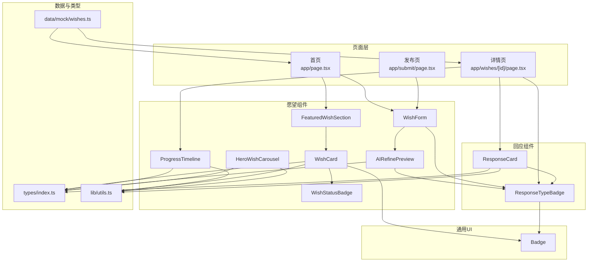
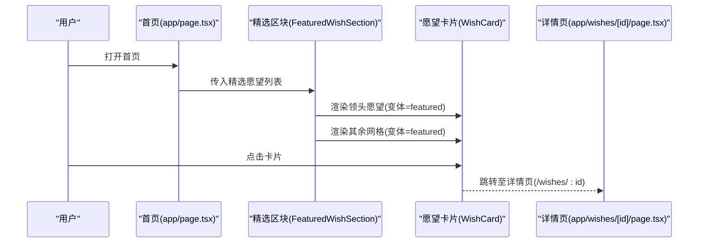
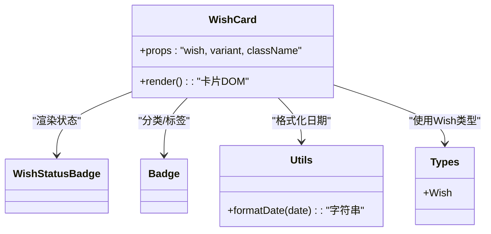
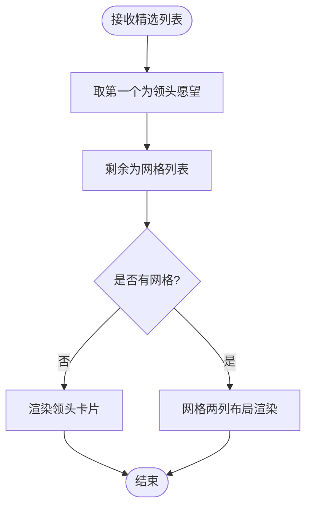
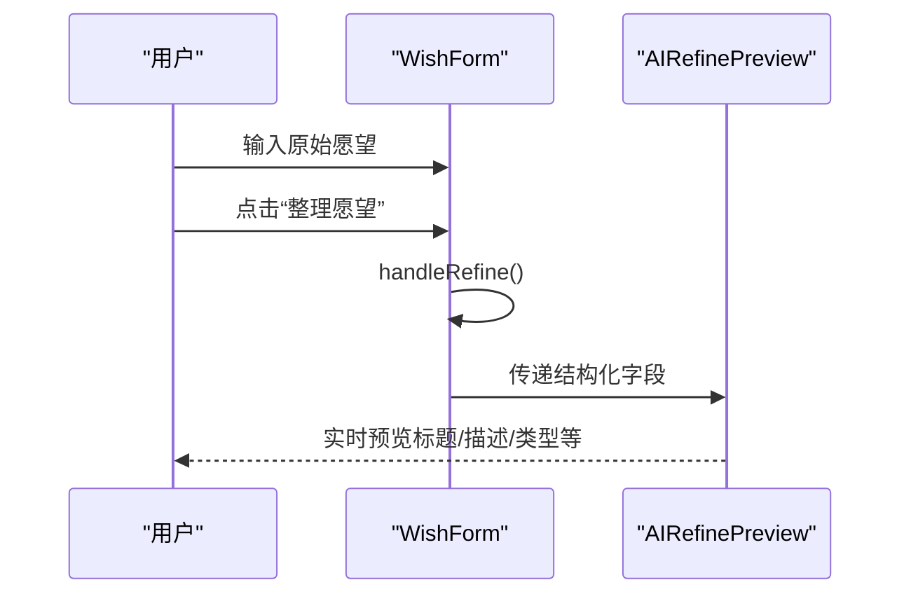
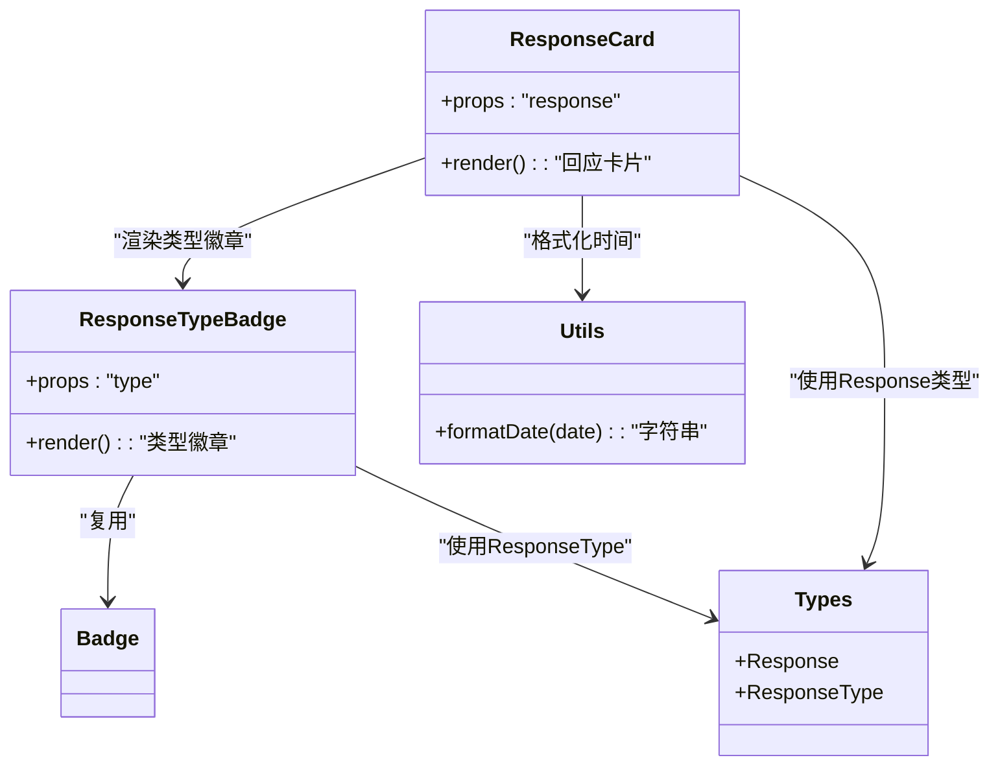
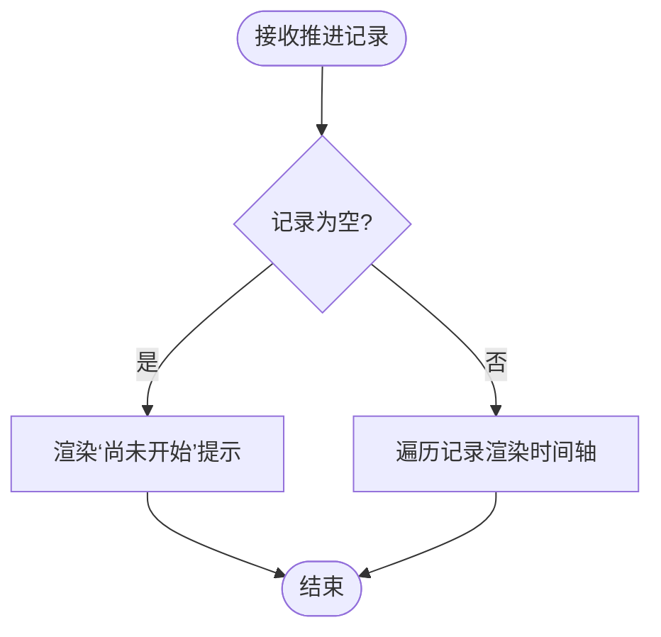
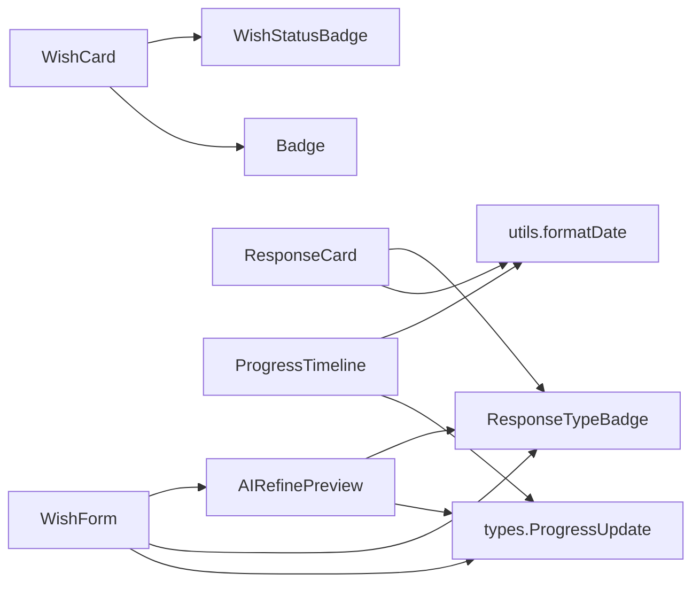

# 业务组件

<cite>
**本文引用的文件**
- [components/wish/wish-card.tsx](file://components/wish/wish-card.tsx)
- [components/wish/wish-form.tsx](file://components/wish/wish-form.tsx)
- [components/wish/featured-wish-section.tsx](file://components/wish/featured-wish-section.tsx)
- [components/response/response-card.tsx](file://components/response/response-card.tsx)
- [components/response/response-type-badge.tsx](file://components/response/response-type-badge.tsx)
- [components/wish/progress-timeline.tsx](file://components/wish/progress-timeline.tsx)
- [components/wish/ai-refine-preview.tsx](file://components/wish/ai-refine-preview.tsx)
- [components/wish/hero-wish-carousel.tsx](file://components/wish/hero-wish-carousel.tsx)
- [components/wish/wish-status-badge.tsx](file://components/wish/wish-status-badge.tsx)
- [components/ui/badge.tsx](file://components/ui/badge.tsx)
- [types/index.ts](file://types/index.ts)
- [lib/utils.ts](file://lib/utils.ts)
- [data/mock/wishes.ts](file://data/mock/wishes.ts)
- [app/page.tsx](file://app/page.tsx)
- [app/submit/page.tsx](file://app/submit/page.tsx)
- [app/wishes/[id]/page.tsx](file://app/wishes/[id]/page.tsx)
</cite>

## 目录
1. [简介](#简介)
2. [项目结构](#项目结构)
3. [核心组件](#核心组件)
4. [架构总览](#架构总览)
5. [详细组件分析](#详细组件分析)
6. [依赖关系分析](#依赖关系分析)
7. [性能考量](#性能考量)
8. [故障排查指南](#故障排查指南)
9. [结论](#结论)
10. [附录](#附录)

## 简介
本文件聚焦于“愿望管理”与“回应系统”的业务组件，系统性解析以下关键模块：
- 展示层：WishCard 的卡片渲染与交互、FeaturedWishSection 的精选内容布局
- 表单层：WishForm 的多步骤表单、字段校验与数据绑定、AIRefinePreview 的预览联动
- 回应层：ResponseCard 的回应渲染、ResponseTypeBadge 的类型标识、ProgressTimeline 的进度追踪
- 轮播与辅助：HeroWishCarousel 的自动轮播、AIRefinePreview 的内容整理
- 组件通信：props 传递、事件回调、状态同步与页面级数据流

目标是帮助开发者快速理解组件职责、数据流向与交互逻辑，并提供可操作的优化与排错建议。

## 项目结构
本项目采用按功能域分层的组织方式，业务组件集中在 components/wish 与 components/response 下，公共 UI 组件位于 components/ui，类型定义与工具函数分别在 types 与 lib 中，页面入口在 app 目录。

图表来源
- [app/page.tsx:1-29](file://app/page.tsx#L1-L29)
- [app/submit/page.tsx:1-24](file://app/submit/page.tsx#L1-L24)
- [app/wishes/[id]/page.tsx](file://app/wishes/[id]/page.tsx#L1-L184)
- [components/wish/wish-card.tsx:1-93](file://components/wish/wish-card.tsx#L1-L93)
- [components/wish/wish-form.tsx:1-264](file://components/wish/wish-form.tsx#L1-L264)
- [components/wish/featured-wish-section.tsx:1-47](file://components/wish/featured-wish-section.tsx#L1-L47)
- [components/response/response-card.tsx:1-48](file://components/response/response-card.tsx#L1-L48)
- [components/response/response-type-badge.tsx:1-43](file://components/response/response-type-badge.tsx#L1-L43)
- [components/wish/progress-timeline.tsx:1-76](file://components/wish/progress-timeline.tsx#L1-L76)
- [components/wish/ai-refine-preview.tsx:1-59](file://components/wish/ai-refine-preview.tsx#L1-L59)
- [components/wish/hero-wish-carousel.tsx:1-56](file://components/wish/hero-wish-carousel.tsx#L1-L56)
- [components/wish/wish-status-badge.tsx:1-39](file://components/wish/wish-status-badge.tsx#L1-L39)
- [components/ui/badge.tsx:1-37](file://components/ui/badge.tsx#L1-L37)
- [types/index.ts:1-58](file://types/index.ts#L1-L58)
- [lib/utils.ts:1-12](file://lib/utils.ts#L1-L12)
- [data/mock/wishes.ts:1-210](file://data/mock/wishes.ts#L1-L210)

章节来源
- [app/page.tsx:1-29](file://app/page.tsx#L1-L29)
- [app/submit/page.tsx:1-24](file://app/submit/page.tsx#L1-L24)
- [app/wishes/[id]/page.tsx](file://app/wishes/[id]/page.tsx#L1-L184)

## 核心组件
本节概览关键组件的职责与交互要点：
- WishCard：渲染愿望摘要、状态徽章、分类标签、最新进展或回应数量；支持“精选”样式变体；点击跳转详情页。
- FeaturedWishSection：首页精选区域，拆分“领头愿望 + 其余网格”，复用 WishCard 渲染。
- WishForm：三步式表单（原始愿望 → 结构化内容 → 希望的回应类型），内置 AI 预览联动；支持匿名与平台支持开关。
- ResponseCard：渲染单条回应，含作者名、时间、类型徽章与帮助说明文案；内容区展示回应正文。
- ResponseTypeBadge：根据回应类型映射不同样式与标签文本。
- ProgressTimeline：展示平台推进记录，无记录时提示“尚未开始”。
- AIRefinePreview：展示标题、描述、为什么重要、当前卡点与期望回应类型，用于表单预览。
- HeroWishCarousel：自动轮播展示精选语录。
- WishStatusBadge：根据愿望状态映射不同标签与色调。
- Badge：通用标签组件，支持多种色调。

章节来源
- [components/wish/wish-card.tsx:1-93](file://components/wish/wish-card.tsx#L1-L93)
- [components/wish/featured-wish-section.tsx:1-47](file://components/wish/featured-wish-section.tsx#L1-L47)
- [components/wish/wish-form.tsx:1-264](file://components/wish/wish-form.tsx#L1-L264)
- [components/response/response-card.tsx:1-48](file://components/response/response-card.tsx#L1-L48)
- [components/response/response-type-badge.tsx:1-43](file://components/response/response-type-badge.tsx#L1-L43)
- [components/wish/progress-timeline.tsx:1-76](file://components/wish/progress-timeline.tsx#L1-L76)
- [components/wish/ai-refine-preview.tsx:1-59](file://components/wish/ai-refine-preview.tsx#L1-L59)
- [components/wish/hero-wish-carousel.tsx:1-56](file://components/wish/hero-wish-carousel.tsx#L1-L56)
- [components/wish/wish-status-badge.tsx:1-39](file://components/wish/wish-status-badge.tsx#L1-L39)
- [components/ui/badge.tsx:1-37](file://components/ui/badge.tsx#L1-L37)

## 架构总览
页面与组件的调用关系如下：

图表来源
- [app/page.tsx:1-29](file://app/page.tsx#L1-L29)
- [components/wish/featured-wish-section.tsx:1-47](file://components/wish/featured-wish-section.tsx#L1-L47)
- [components/wish/wish-card.tsx:1-93](file://components/wish/wish-card.tsx#L1-L93)
- [app/wishes/[id]/page.tsx](file://app/wishes/[id]/page.tsx#L1-L184)

## 详细组件分析

### WishCard 组件分析
- 设计模式：展示型组件，接收 wish 对象与可选变体参数，内部组合 Badge、WishStatusBadge 与日期格式化工具，渲染统一的卡片骨架。
- 关键逻辑：
  - 根据变体选择圆角、内边距与悬停背景；
  - 当状态为进行中且存在推进记录时，展示推进节点指示与数量；否则展示回应数量；
  - 使用 Link 组件跳转至详情页。
- 性能与可访问性：
  - 使用 className 合并与条件渲染减少 DOM；
  - 推进节点最多展示前三个，避免长列表渲染压力。

图表来源
- [components/wish/wish-card.tsx:1-93](file://components/wish/wish-card.tsx#L1-L93)
- [components/wish/wish-status-badge.tsx:1-39](file://components/wish/wish-status-badge.tsx#L1-L39)
- [components/ui/badge.tsx:1-37](file://components/ui/badge.tsx#L1-L37)
- [lib/utils.ts:1-12](file://lib/utils.ts#L1-L12)
- [types/index.ts:30-48](file://types/index.ts#L30-L48)

章节来源
- [components/wish/wish-card.tsx:1-93](file://components/wish/wish-card.tsx#L1-L93)
- [lib/utils.ts:5-10](file://lib/utils.ts#L5-L10)
- [types/index.ts:30-48](file://types/index.ts#L30-L48)

### FeaturedWishSection 组件分析
- 设计模式：容器组件，负责将精选列表拆分为“领头愿望 + 网格其余”，并复用 WishCard 进行渲染。
- 关键逻辑：
  - 若无领头愿望则返回空；
  - 首屏展示大卡片，其余网格按两列自适应布局。
- 可扩展性：可通过 props 传入任意长度的 wish 数组，保持一致的视觉层级。

图表来源
- [components/wish/featured-wish-section.tsx:1-47](file://components/wish/featured-wish-section.tsx#L1-L47)
- [components/wish/wish-card.tsx:1-93](file://components/wish/wish-card.tsx#L1-L93)

章节来源
- [components/wish/featured-wish-section.tsx:1-47](file://components/wish/featured-wish-section.tsx#L1-L47)

### WishForm 组件分析
- 设计模式：受控表单 + 多步骤流程 + 预览联动。
- 数据绑定与状态：
  - 原始愿望 rawWish、结构化字段 title/description/whyImportant/currentBlocker、期望回应类型 selectedTypes、匿名与平台支持开关；
  - handleRefine 模拟 AI 预处理，更新描述与标题占位（若标题为空）。
- 表单验证与交互：
  - Field 与 Toggle 抽象输入组件，统一样式与交互；
  - 响应类型通过按钮集合多选，toggleType 实现增删；
  - AIRefinePreview 作为右侧栏实时预览。
- 错误处理与边界：
  - 原始愿望为空时不触发 refine；
  - 预览提示文案区分“已整理”与“未整理”。

图表来源
- [components/wish/wish-form.tsx:1-264](file://components/wish/wish-form.tsx#L1-L264)
- [components/wish/ai-refine-preview.tsx:1-59](file://components/wish/ai-refine-preview.tsx#L1-L59)

章节来源
- [components/wish/wish-form.tsx:1-264](file://components/wish/wish-form.tsx#L1-L264)
- [data/mock/wishes.ts:1-210](file://data/mock/wishes.ts#L1-L210)

### ResponseCard 与 ResponseTypeBadge 组件分析
- ResponseCard：渲染单条回应，包含作者名、创建时间、类型徽章、帮助说明文案与正文；通过响应类型映射表生成帮助价值说明。
- ResponseTypeBadge：根据类型映射不同标签文本与样式类名，复用通用 Badge 组件。

图表来源
- [components/response/response-card.tsx:1-48](file://components/response/response-card.tsx#L1-L48)
- [components/response/response-type-badge.tsx:1-43](file://components/response/response-type-badge.tsx#L1-L43)
- [components/ui/badge.tsx:1-37](file://components/ui/badge.tsx#L1-L37)
- [lib/utils.ts:5-10](file://lib/utils.ts#L5-L10)
- [types/index.ts:50-57](file://types/index.ts#L50-L57)

章节来源
- [components/response/response-card.tsx:1-48](file://components/response/response-card.tsx#L1-L48)
- [components/response/response-type-badge.tsx:1-43](file://components/response/response-type-badge.tsx#L1-L43)
- [lib/utils.ts:5-10](file://lib/utils.ts#L5-L10)
- [types/index.ts:50-57](file://types/index.ts#L50-L57)

### ProgressTimeline 组件分析
- 设计模式：条件渲染 + 时间轴样式。
- 关键逻辑：
  - 无推进记录时，展示“尚未开始”的引导文案；
  - 有记录时，按时间顺序渲染推进节点，绘制连接线，标注序号与日期。
- 可维护性：通过映射表扩展类型样式与文案，便于未来新增推进类型。

图表来源
- [components/wish/progress-timeline.tsx:1-76](file://components/wish/progress-timeline.tsx#L1-L76)
- [lib/utils.ts:5-10](file://lib/utils.ts#L5-L10)
- [types/index.ts:23-28](file://types/index.ts#L23-L28)

章节来源
- [components/wish/progress-timeline.tsx:1-76](file://components/wish/progress-timeline.tsx#L1-L76)
- [lib/utils.ts:5-10](file://lib/utils.ts#L5-L10)
- [types/index.ts:23-28](file://types/index.ts#L23-L28)

### AIRefinePreview 组件分析
- 设计模式：纯展示组件，接收结构化字段与期望回应类型，渲染预览面板。
- 关键逻辑：
  - 标题、描述、为什么重要、当前卡点四段信息；
  - 期望回应类型以徽章列表展示，复用 ResponseTypeBadge。
- 与 WishForm 的协作：WishForm 将当前状态传递给 AIRefinePreview，形成双向预览联动。

章节来源
- [components/wish/ai-refine-preview.tsx:1-59](file://components/wish/ai-refine-preview.tsx#L1-L59)
- [components/response/response-type-badge.tsx:1-43](file://components/response/response-type-badge.tsx#L1-L43)

### HeroWishCarousel 组件分析
- 设计模式：客户端轮播组件，基于定时器切换活动项。
- 关键逻辑：
  - 使用 useState 维护当前索引；
  - useEffect 在挂载时启动定时器，周期性递增索引并取模；
  - 通过绝对定位与过渡动画实现淡入淡出切换。
- 注意事项：当只有一条数据时跳过轮播，避免无效循环。

章节来源
- [components/wish/hero-wish-carousel.tsx:1-56](file://components/wish/hero-wish-carousel.tsx#L1-L56)

### 组件间通信机制
- Props 传递：
  - 页面向组件传递数据：首页传递精选列表与全部列表；详情页传递 wish 与 responses；表单向预览传递结构化字段。
- 事件回调：
  - 表单字段 onChange 更新本地状态；按钮点击触发 toggleType 或 handleRefine。
- 状态同步：
  - 表单与预览通过共享状态实现双向联动；卡片点击触发路由跳转至详情页。
- 页面级数据流：
  - 首页与详情页通过 lib 层的查询函数获取 mock 数据，保证页面与组件解耦。

章节来源
- [app/page.tsx:1-29](file://app/page.tsx#L1-L29)
- [app/wishes/[id]/page.tsx](file://app/wishes/[id]/page.tsx#L1-L184)
- [components/wish/wish-form.tsx:1-264](file://components/wish/wish-form.tsx#L1-L264)
- [data/mock/wishes.ts:1-210](file://data/mock/wishes.ts#L1-L210)

## 依赖关系分析
- 组件内聚与耦合：
  - WishCard/WishStatusBadge/Badge：低耦合，职责单一；
  - ResponseCard 依赖 ResponseTypeBadge 与工具函数；
  - ProgressTimeline 依赖工具函数与类型定义；
  - AIRefinePreview 依赖 ResponseTypeBadge 与类型定义；
  - WishForm 依赖 AIRefinePreview 与类型定义。
- 外部依赖：
  - Next.js Link 用于导航；
  - Tailwind 类名用于样式组织；
  - Intl.DateTimeFormat 用于日期格式化。

图表来源
- [components/wish/wish-card.tsx:1-93](file://components/wish/wish-card.tsx#L1-L93)
- [components/wish/wish-status-badge.tsx:1-39](file://components/wish/wish-status-badge.tsx#L1-L39)
- [components/response/response-card.tsx:1-48](file://components/response/response-card.tsx#L1-L48)
- [components/response/response-type-badge.tsx:1-43](file://components/response/response-type-badge.tsx#L1-L43)
- [components/wish/progress-timeline.tsx:1-76](file://components/wish/progress-timeline.tsx#L1-L76)
- [components/wish/ai-refine-preview.tsx:1-59](file://components/wish/ai-refine-preview.tsx#L1-L59)
- [components/wish/wish-form.tsx:1-264](file://components/wish/wish-form.tsx#L1-L264)
- [lib/utils.ts:5-10](file://lib/utils.ts#L5-L10)
- [types/index.ts:23-57](file://types/index.ts#L23-L57)

## 性能考量
- 渲染优化
  - WishCard 推进节点最多展示前三个，避免长列表渲染开销。
  - ProgressTimeline 无记录时直接返回简单提示，减少复杂 DOM。
  - HeroWishCarousel 使用绝对定位与过渡动画，避免频繁重排。
- 状态与计算
  - 表单中的 handleRefine 为同步更新，避免不必要的异步调用。
  - 日期格式化通过工具函数集中处理，减少重复计算。
- 可访问性
  - 所有交互元素具备键盘可达性；链接与按钮语义明确。

## 故障排查指南
- 表单无法提交
  - 症状：点击“发布”无反应。
  - 排查：确认表单未设置 type="submit" 导致默认行为被阻止；检查页面中 Button 的 type 是否正确。
  - 参考路径：[components/wish/wish-form.tsx:236-238](file://components/wish/wish-form.tsx#L236-L238)
- 预览未更新
  - 症状：修改字段后右侧预览未变化。
  - 排查：确认 AIRefinePreview 接收到了最新的 props；检查父组件是否正确传递字段值。
  - 参考路径：[components/wish/wish-form.tsx:244-250](file://components/wish/wish-form.tsx#L244-L250)
- 卡片点击无跳转
  - 症状：点击卡片无响应。
  - 排查：确认 Link 组件的 href 与路由参数匹配；检查路由配置。
  - 参考路径：[components/wish/wish-card.tsx:31-32](file://components/wish/wish-card.tsx#L31-L32)
- 进度时间轴空白
  - 症状：无推进记录时未显示提示。
  - 排查：确认传入的 updates 为空数组；检查条件渲染逻辑。
  - 参考路径：[components/wish/progress-timeline.tsx:9-23](file://components/wish/progress-timeline.tsx#L9-L23)
- 轮播不生效
  - 症状：轮播不动。
  - 排查：确认定时器已启动；当只有一条数据时会跳过轮播；检查 quotes.length。
  - 参考路径：[components/wish/hero-wish-carousel.tsx:16-26](file://components/wish/hero-wish-carousel.tsx#L16-L26)

章节来源
- [components/wish/wish-form.tsx:236-238](file://components/wish/wish-form.tsx#L236-L238)
- [components/wish/wish-card.tsx:31-32](file://components/wish/wish-card.tsx#L31-L32)
- [components/wish/progress-timeline.tsx:9-23](file://components/wish/progress-timeline.tsx#L9-L23)
- [components/wish/hero-wish-carousel.tsx:16-26](file://components/wish/hero-wish-carousel.tsx#L16-L26)

## 结论
本项目通过清晰的组件分层与稳定的 props/事件契约，实现了从“愿望发布”到“回应与推进”的完整业务闭环。各组件职责明确、耦合度低，便于扩展与维护。建议在后续迭代中：
- 引入真实异步请求与错误边界；
- 为轮播与表单增加防抖与节流；
- 丰富类型映射与文案，提升国际化支持。

## 附录
- 类型定义概览
  - Wish：包含标题、摘要、描述、原因、卡点、期望回应类型、分类、状态、回应数、精选标记、匿名与平台支持开关、创建/更新时间、推进记录等字段。
  - Response：包含回应 ID、所属愿望 ID、作者名、类型、内容、创建时间。
  - ProgressUpdate：包含推进记录 ID、标题、详情、日期。
  - ResponseType 与 WishStatus：枚举类型，用于约束数据与 UI 显示。

章节来源
- [types/index.ts:1-58](file://types/index.ts#L1-L58)