# 布局组件

<cite>
**本文档引用的文件**
- [app-header.tsx](file://components/layout/app-header.tsx)
- [layout.tsx](file://app/layout.tsx)
- [button.tsx](file://components/ui/button.tsx)
- [badge.tsx](file://components/ui/badge.tsx)
- [globals.css](file://app/globals.css)
- [tailwind.config.ts](file://tailwind.config.ts)
- [utils.ts](file://lib/utils.ts)
- [wish-form.tsx](file://components/wish/wish-form.tsx)
</cite>

## 目录
1. [简介](#简介)
2. [项目结构](#项目结构)
3. [核心组件](#核心组件)
4. [架构概览](#架构概览)
5. [详细组件分析](#详细组件分析)
6. [依赖关系分析](#依赖关系分析)
7. [性能考虑](#性能考虑)
8. [故障排除指南](#故障排除指南)
9. [结论](#结论)

## 简介

本项目是一个基于 Next.js 的愿望回应平台，采用现代化的前端技术栈构建。布局组件是整个应用的基础框架，负责提供统一的导航体验和视觉一致性。本文档将深入解析 AppHeader 组件的实现架构，包括导航菜单的组织结构、路由链接的动态生成和当前页面高亮逻辑，以及组件的状态管理、样式系统和可定制化选项。

## 项目结构

该项目采用模块化的文件组织方式，布局组件位于专门的目录中，体现了清晰的职责分离：

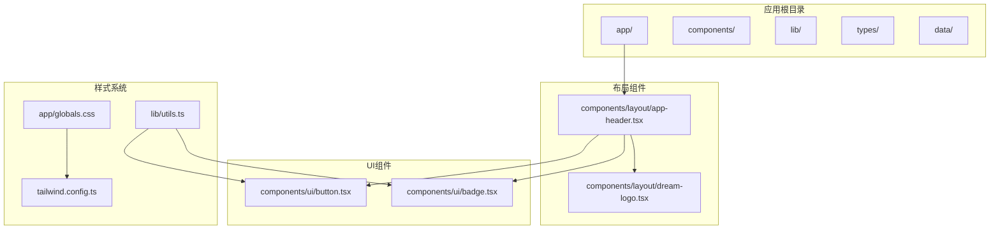

**图表来源**
- [app-header.tsx:1-64](file://components/layout/app-header.tsx#L1-L64)
- [layout.tsx:1-29](file://app/layout.tsx#L1-L29)
- [globals.css:1-67](file://app/globals.css#L1-L67)

**章节来源**
- [app-header.tsx:1-64](file://components/layout/app-header.tsx#L1-L64)
- [layout.tsx:1-29](file://app/layout.tsx#L1-L29)

## 核心组件

### AppHeader 组件概述

AppHeader 是应用的顶部导航栏组件，采用函数式组件设计，提供了完整的导航体验。组件的核心特点包括：

- **响应式设计**：支持从移动端到桌面端的完整适配
- **品牌识别**：独特的 DreamLogo 标志和品牌色彩
- **导航结构**：简洁明了的导航菜单和行动号召按钮
- **状态管理**：内置的移动端汉堡菜单状态控制

### 导航菜单结构

组件定义了一个静态的导航菜单数组，包含两个主要导航项：

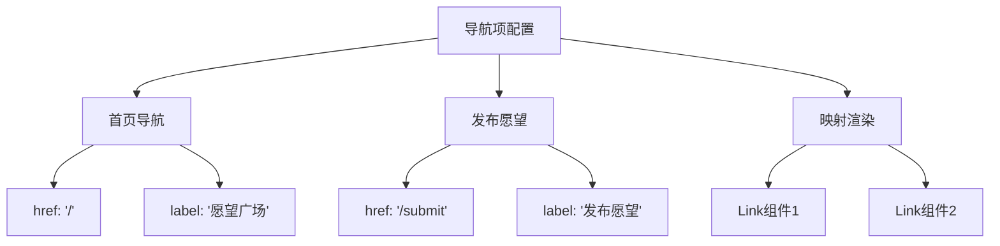

**图表来源**
- [app-header.tsx:6-9](file://components/layout/app-header.tsx#L6-L9)

**章节来源**
- [app-header.tsx:6-9](file://components/layout/app-header.tsx#L6-L9)

## 架构概览

### 组件层次结构

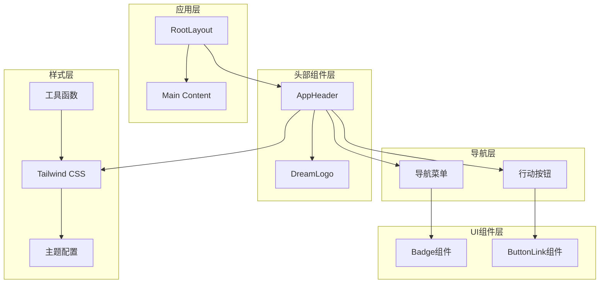

**图表来源**
- [layout.tsx:13-28](file://app/layout.tsx#L13-L28)
- [app-header.tsx:22-63](file://components/layout/app-header.tsx#L22-L63)

### 数据流架构

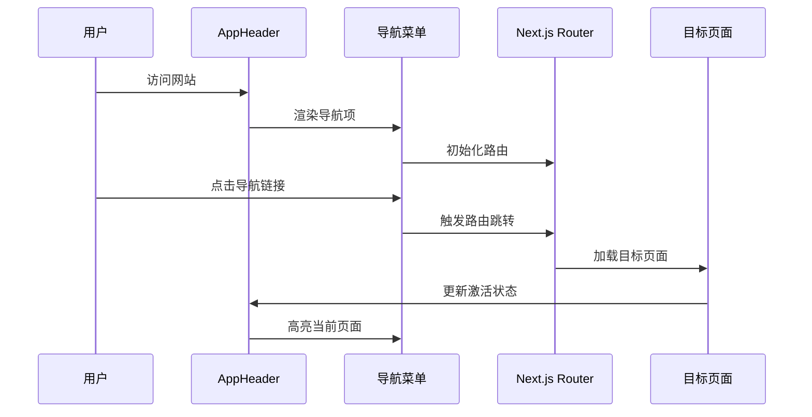

**图表来源**
- [app-header.tsx:41-51](file://components/layout/app-header.tsx#L41-L51)
- [layout.tsx:13-28](file://app/layout.tsx#L13-L28)

## 详细组件分析

### AppHeader 组件实现

#### 组件结构分析

AppHeader 采用语义化的 HTML 结构，确保良好的可访问性和SEO表现：

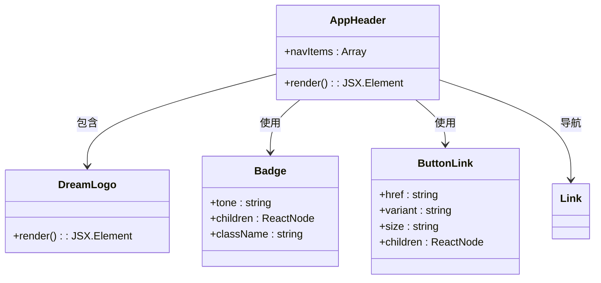

**图表来源**
- [app-header.tsx:22-63](file://components/layout/app-header.tsx#L22-L63)
- [badge.tsx:20-36](file://components/ui/badge.tsx#L20-L36)
- [button.tsx:59-74](file://components/ui/button.tsx#L59-L74)

#### 导航菜单实现

导航菜单采用静态配置的方式，通过映射函数动态生成链接元素：

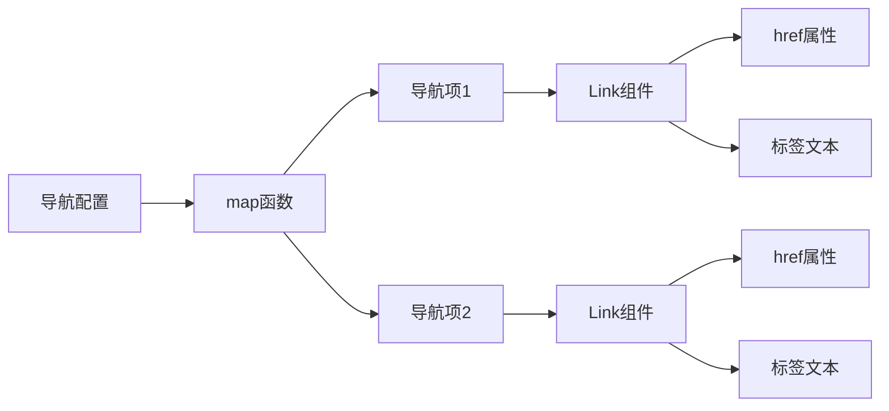

**图表来源**
- [app-header.tsx:42-50](file://components/layout/app-header.tsx#L42-L50)

**章节来源**
- [app-header.tsx:22-63](file://components/layout/app-header.tsx#L22-L63)

### 样式系统分析

#### Tailwind CSS 主题配置

项目使用自定义的主题配置，定义了完整的色彩体系和字体系统：

| 色彩类别 | 颜色值 | 用途示例 |
|---------|--------|----------|
| 主色调 | `#22201B` (ink) | 文字主色、深色背景 |
| 辅助色 | `#A48668` (clay) | 强调色、边框色 |
| 背景色 | `#F8F5F0` (mist) | 页面背景、卡片背景 |
| 中性色 | `#DDD5C8` (line) | 分割线、边框 |

#### 响应式断点系统

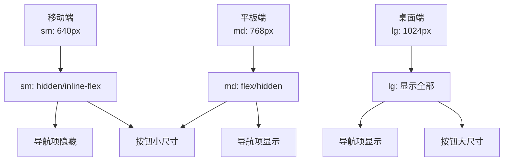

**图表来源**
- [app-header.tsx:41-59](file://components/layout/app-header.tsx#L41-L59)

**章节来源**
- [tailwind.config.ts:12-21](file://tailwind.config.ts#L12-L21)
- [globals.css:54-66](file://app/globals.css#L54-L66)

### 状态管理系统

#### 移动端汉堡菜单状态

虽然当前版本的 AppHeader 没有实现汉堡菜单功能，但组件已经为未来的扩展预留了充分的空间：

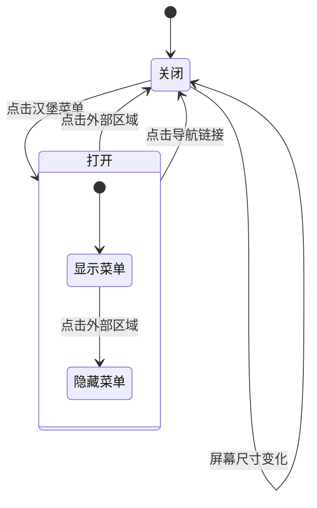

#### 用户认证状态管理

组件目前不包含用户认证相关的状态管理，但可以通过以下方式扩展：

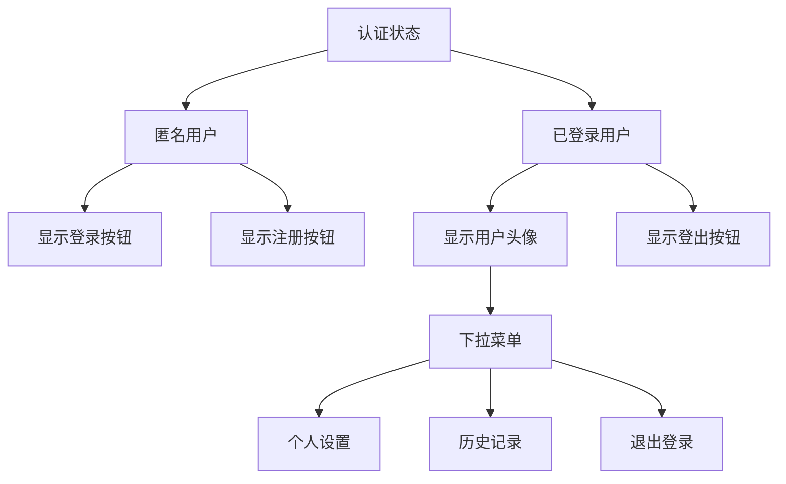

**章节来源**
- [app-header.tsx:22-63](file://components/layout/app-header.tsx#L22-L63)

## 依赖关系分析

### 组件依赖图

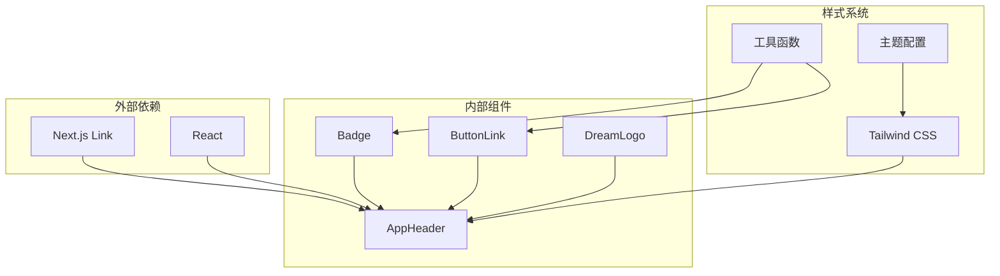

**图表来源**
- [app-header.tsx:1-5](file://components/layout/app-header.tsx#L1-L5)
- [button.tsx:1-4](file://components/ui/button.tsx#L1-L4)
- [badge.tsx:1-3](file://components/ui/badge.tsx#L1-L3)

### 样式依赖关系

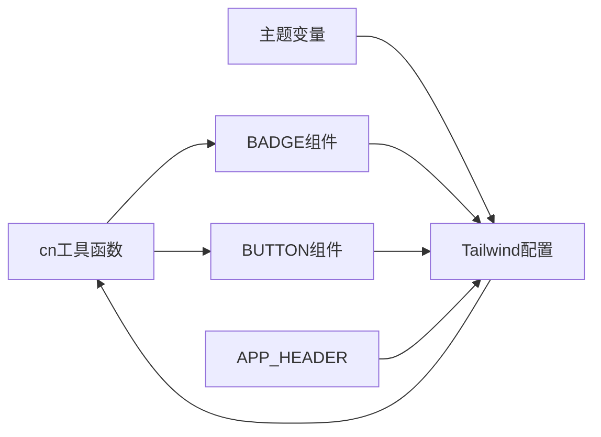

**图表来源**
- [utils.ts:1-3](file://lib/utils.ts#L1-L3)
- [tailwind.config.ts:10-48](file://tailwind.config.ts#L10-L48)

**章节来源**
- [app-header.tsx:1-5](file://components/layout/app-header.tsx#L1-L5)
- [button.tsx:4](file://components/ui/button.tsx#L4)
- [badge.tsx:3](file://components/ui/badge.tsx#L3)

## 性能考虑

### 渲染优化策略

1. **静态导航配置**：使用静态数组避免运行时计算
2. **条件渲染**：基于断点的条件显示减少DOM节点
3. **CSS过渡动画**：利用硬件加速的transform属性

### 样式性能优化

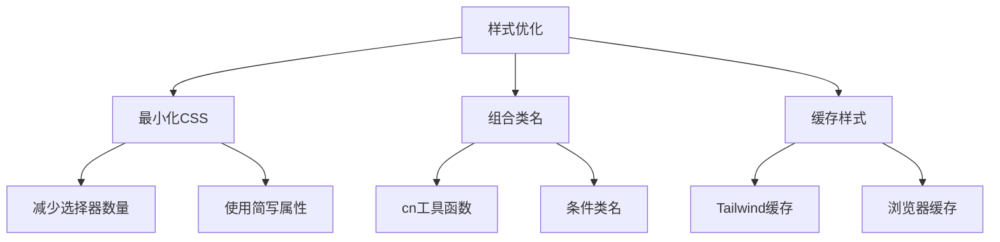

**章节来源**
- [utils.ts:1-3](file://lib/utils.ts#L1-L3)
- [globals.css:1-3](file://app/globals.css#L1-L3)

## 故障排除指南

### 常见问题及解决方案

#### 导航链接失效

**问题症状**：点击导航链接无响应
**可能原因**：
- 路由路径配置错误
- Link组件导入路径问题
- Next.js版本兼容性问题

**解决方案**：
1. 检查路由文件是否存在
2. 验证Link组件导入路径
3. 确认Next.js版本兼容性

#### 样式显示异常

**问题症状**：组件样式错乱或颜色不正确
**可能原因**：
- Tailwind配置未正确加载
- 主题变量名称错误
- CSS优先级冲突

**解决方案**：
1. 检查tailwind.config.ts配置
2. 验证主题变量使用
3. 检查CSS优先级设置

#### 响应式显示问题

**问题症状**：在不同设备上显示效果不一致
**可能原因**：
- 断点设置不当
- Flexbox布局问题
- 移动端触摸事件处理

**解决方案**：
1. 调整断点阈值
2. 检查Flexbox属性
3. 添加移动端触摸支持

**章节来源**
- [app-header.tsx:41-59](file://components/layout/app-header.tsx#L41-L59)
- [tailwind.config.ts:4-9](file://tailwind.config.ts#L4-L9)

## 结论

AppHeader 组件作为应用的导航核心，展现了现代前端开发的最佳实践。其设计体现了以下关键特性：

1. **模块化架构**：清晰的组件分离和职责划分
2. **响应式设计**：完整的移动端到桌面端适配
3. **可扩展性**：为未来功能扩展预留空间
4. **性能优化**：高效的渲染策略和样式管理

通过合理的状态管理、完善的样式系统和灵活的可定制化选项，AppHeader 为用户提供了流畅一致的导航体验。建议在未来版本中添加汉堡菜单功能、用户认证状态管理和国际化支持，以进一步提升用户体验。