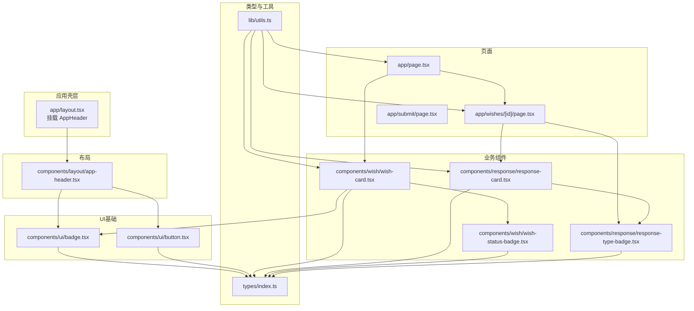
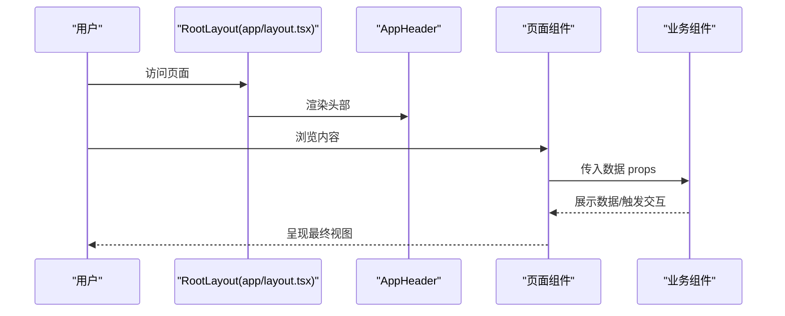
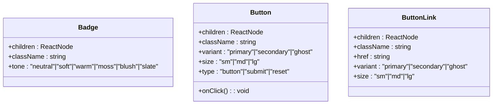
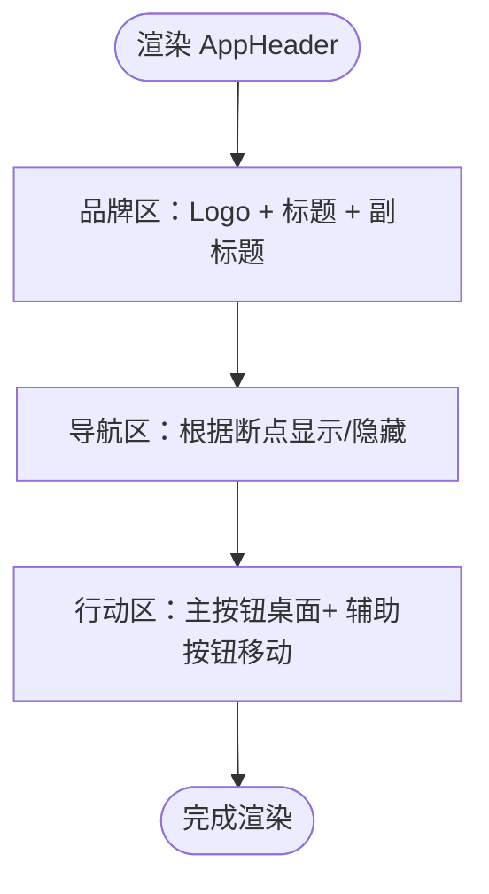
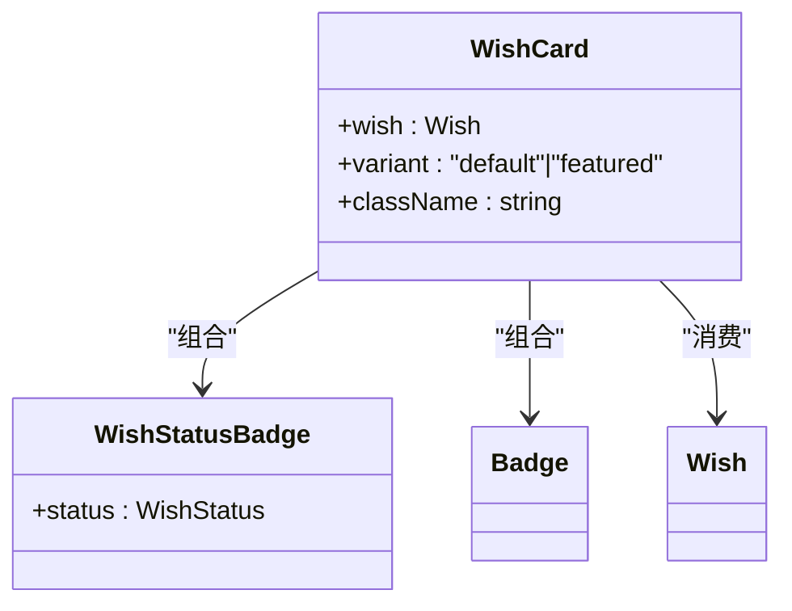
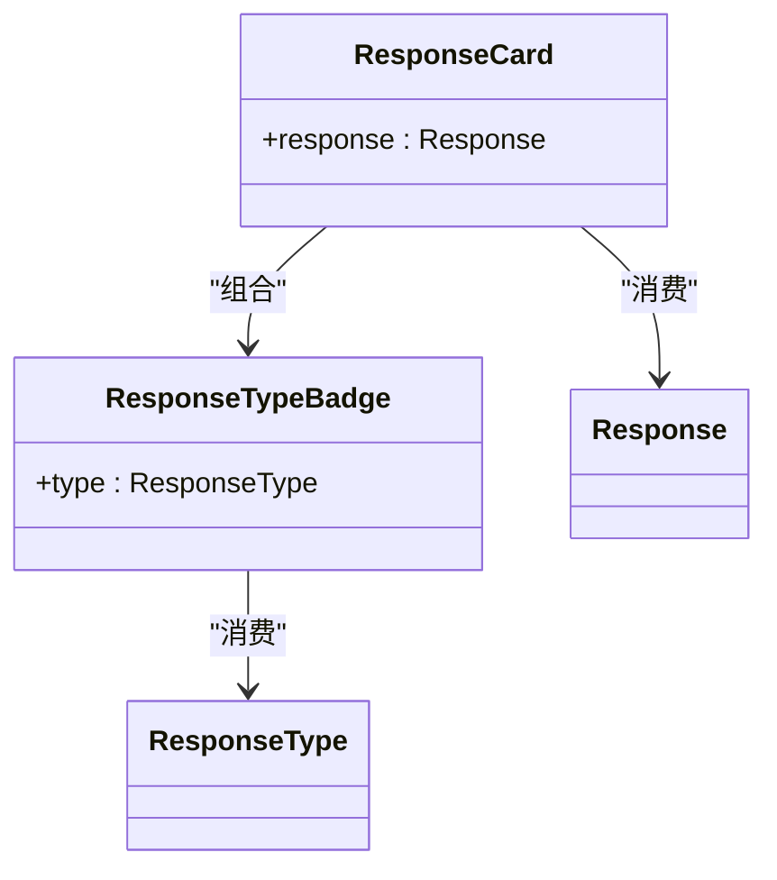
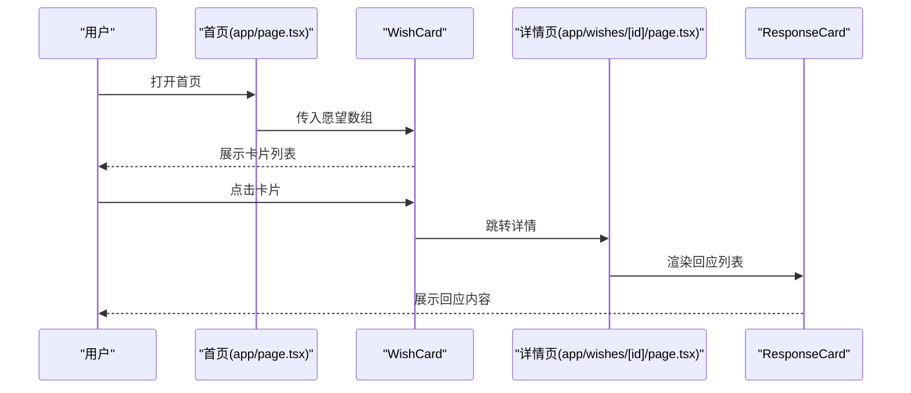
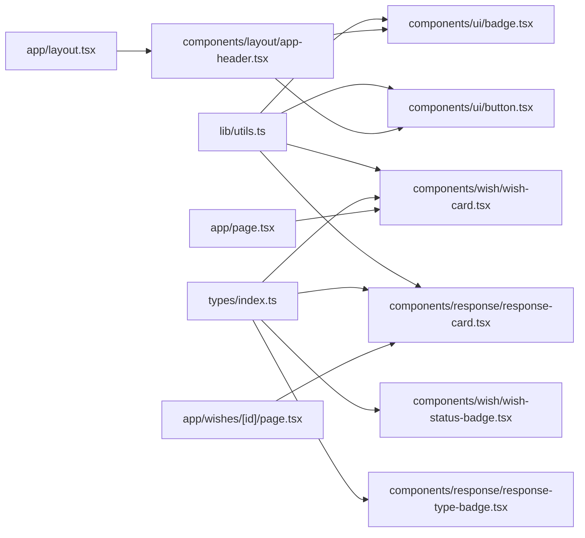

# 组件系统

<cite>
**本文引用的文件**
- [components/ui/badge.tsx](file://components/ui/badge.tsx)
- [components/ui/button.tsx](file://components/ui/button.tsx)
- [components/layout/app-header.tsx](file://components/layout/app-header.tsx)
- [components/response/response-card.tsx](file://components/response/response-card.tsx)
- [components/response/response-type-badge.tsx](file://components/response/response-type-badge.tsx)
- [components/wish/wish-card.tsx](file://components/wish/wish-card.tsx)
- [components/wish/wish-status-badge.tsx](file://components/wish/wish-status-badge.tsx)
- [types/index.ts](file://types/index.ts)
- [lib/utils.ts](file://lib/utils.ts)
- [app/layout.tsx](file://app/layout.tsx)
- [app/page.tsx](file://app/page.tsx)
- [app/wishes/[id]/page.tsx](file://app/wishes/[id]/page.tsx)
- [app/submit/page.tsx](file://app/submit/page.tsx)
</cite>

## 目录
1. [简介](#简介)
2. [项目结构](#项目结构)
3. [核心组件](#核心组件)
4. [架构总览](#架构总览)
5. [详细组件分析](#详细组件分析)
6. [依赖关系分析](#依赖关系分析)
7. [性能考量](#性能考量)
8. [故障排查指南](#故障排查指南)
9. [结论](#结论)
10. [附录](#附录)

## 简介
本文件系统性梳理「梦的平台 / 愿望被回应的平台」的组件体系，覆盖 UI 基础组件（Badge、Button）、布局组件（AppHeader）、以及业务组件（WishCard、ResponseCard 等）。文档重点阐述各组件的设计理念、属性与行为、数据流与交互、组件间通信方式、复用与性能优化策略，并结合页面使用场景说明组件组合与扩展方法。

### PRD 定义的完整组件清单 vs 当前实现

| 组件 | PRD 要求 | 当前状态 |
|------|---------|----------|
| AppHeader | ✅ | ✅ 已实现 |
| HeroSection | ✅ | ✅ 已实现 |
| WishCard | ✅ | ✅ 已实现 |
| WishStatusBadge | ✅ | ✅ 已实现 |
| FeaturedWishSection | ✅ | ✅ 已实现 |
| WishListSection | ✅ | ✅ 已实现 |
| ResponseTypeBadge | ✅ | ✅ 已实现 |
| ResponseCard | ✅ | ✅ 已实现 |
| ProgressTimeline | ✅ | ✅ 已实现 |
| WishForm | ✅ | ✅ 已实现 |
| AIRefinePreview | ✅ | ✅ 已实现 |
| ResponseForm | ✅ 结构化回应提交表单 | ❌ 待实现（详情页 textarea 为 readOnly） |
| WishFilterBar | ✅ 分类/状态筛选 | ❌ 待实现 |
| AdminWishTable | P1 运营后台 | ❌ 待实现 |
| WishStatusEditor | P1 运营后台 | ❌ 待实现 |
| FeaturedToggle | P1 运营后台 | ❌ 待实现 |
| ProgressNoteEditor | P1 运营后台 | ❌ 待实现 |

### 回应系统的组件差异化设计

回应不是评论，这是本平台的核心差异化。组件设计上必须体现：
- **ResponseTypeBadge** 必须有足够的辨识度，让用户一眼区分不同类型的帮助
- **ResponseCard** 必须体现"帮助价值"而不是"观点表达"，每张卡片底部有帮助价值说明文案
- **ResponseForm**（待实现）必须强制选择回应类型，不能退化成普通评论框

## 项目结构
组件按功能域分层组织：
- UI基础组件：位于 components/ui，提供通用视觉与交互能力（Badge、Button）
- 布局组件：位于 components/layout，负责全局导航与页头（AppHeader）
- 业务组件：位于 components/wish 与 components/response，承载愿望与回应的展示与交互
- 类型定义：位于 types/index.ts，统一 Wish、Response、状态与类型
- 工具函数：位于 lib/utils.ts，提供类名拼接与日期格式化
- 页面入口：位于 app/*，通过根布局挂载 AppHeader，并在各页面渲染业务组件

图表来源
- [app/layout.tsx:13-28](file://app/layout.tsx#L13-L28)
- [components/layout/app-header.tsx:22-63](file://components/layout/app-header.tsx#L22-L63)
- [components/ui/badge.tsx:20-36](file://components/ui/badge.tsx#L20-L36)
- [components/ui/button.tsx:40-74](file://components/ui/button.tsx#L40-L74)
- [components/wish/wish-card.tsx:15-92](file://components/wish/wish-card.tsx#L15-L92)
- [components/wish/wish-status-badge.tsx:34-38](file://components/wish/wish-status-badge.tsx#L34-L38)
- [components/response/response-card.tsx:18-47](file://components/response/response-card.tsx#L18-L47)
- [components/response/response-type-badge.tsx:38-42](file://components/response/response-type-badge.tsx#L38-L42)
- [types/index.ts:1-58](file://types/index.ts#L1-L58)
- [lib/utils.ts:1-12](file://lib/utils.ts#L1-L12)
- [app/page.tsx:6-28](file://app/page.tsx#L6-L28)
- [app/wishes/[id]/page.tsx:19-183](file://app/wishes/[id]/page.tsx#L19-L183)
- [app/submit/page.tsx:3-23](file://app/submit/page.tsx#L3-L23)

章节来源
- [app/layout.tsx:13-28](file://app/layout.tsx#L13-L28)
- [types/index.ts:1-58](file://types/index.ts#L1-L58)
- [lib/utils.ts:1-12](file://lib/utils.ts#L1-L12)

## 核心组件
本节聚焦UI基础组件与布局组件，说明其职责、属性与典型使用场景。

- Badge（徽标）
  - 功能：用于标注状态、类型或标签，支持多种色调（tone）与自定义类名
  - 关键属性：children、className、tone（默认 neutral）
  - 使用场景：状态徽章、分类标签、类型标识
  - 设计要点：通过前置圆点前缀强调视觉层级；色调映射集中定义，便于统一风格
  - 复用建议：在业务组件中复用，避免重复样式代码

- Button（按钮）
  - 功能：提供原生按钮与链接按钮两种形态，支持变体（primary/secondary/ghost）与尺寸（sm/md/lg）
  - 关键属性：children、className、variant、size、onClick、type（仅原生按钮）、href（仅链接按钮）
  - 使用场景：主导航入口、表单提交、卡片跳转
  - 设计要点：统一过渡与焦点环样式；链接按钮基于 Next.js Link 实现，利于SSR与路由优化

- AppHeader（应用头部）
  - 功能：全局导航与品牌展示，包含 Logo、站点名称、导航项、行动按钮
  - 关键特性：响应式布局（移动端隐藏导航与部分按钮）、粘性定位、模糊背景
  - 使用场景：所有页面的顶部导航容器
  - 设计要点：导航项集中维护；品牌徽标为纯CSS绘制，减少图片依赖

章节来源
- [components/ui/badge.tsx:14-36](file://components/ui/badge.tsx#L14-L36)
- [components/ui/button.tsx:24-74](file://components/ui/button.tsx#L24-L74)
- [components/layout/app-header.tsx:22-63](file://components/layout/app-header.tsx#L22-L63)

## 架构总览
组件系统遵循“基础组件—业务组件—页面”的分层架构。基础组件（Badge、Button）提供一致的视觉与交互基线；业务组件（WishCard、ResponseCard）封装领域数据与展示逻辑；页面通过根布局统一挂载 AppHeader，并按需渲染业务组件集合。

图表来源
- [app/layout.tsx:13-28](file://app/layout.tsx#L13-L28)
- [components/layout/app-header.tsx:22-63](file://components/layout/app-header.tsx#L22-L63)
- [app/page.tsx:6-28](file://app/page.tsx#L6-L28)
- [app/wishes/[id]/page.tsx:19-183](file://app/wishes/[id]/page.tsx#L19-L183)

## 详细组件分析

### UI基础组件：Badge 与 Button
- Badge
  - 数据结构：色调映射集中于组件内部，通过 tone 键选择对应样式类
  - 复杂度：O(1) 样式选择，无运行时计算开销
  - 可扩展性：新增色调只需在映射中添加键值对，保持调用方不变
  - 与工具函数：依赖 cn 合并类名，保证 className 的可叠加性

- Button
  - 设计模式：通过变体与尺寸映射生成类名，支持原生按钮与链接按钮两种导出
  - 可访问性：内置焦点环样式，提升键盘导航体验
  - 性能：类名拼接在渲染阶段完成，无额外状态管理成本

图表来源
- [components/ui/badge.tsx:14-36](file://components/ui/badge.tsx#L14-L36)
- [components/ui/button.tsx:24-74](file://components/ui/button.tsx#L24-L74)

章节来源
- [components/ui/badge.tsx:14-36](file://components/ui/badge.tsx#L14-L36)
- [components/ui/button.tsx:24-74](file://components/ui/button.tsx#L24-L74)

### 布局组件：AppHeader
- 结构组成：品牌区（Logo+标题+副标题）、导航区、行动按钮区
- 响应式策略：使用断点控制导航与按钮显示，移动端优先简洁
- 交互与导航：Next.js Link 提供页面内跳转，具备预取与SSR友好性
- 与基础组件协作：Badge 与 ButtonLink 分别用于品牌标签与行动按钮

图表来源
- [components/layout/app-header.tsx:22-63](file://components/layout/app-header.tsx#L22-L63)

章节来源
- [components/layout/app-header.tsx:22-63](file://components/layout/app-header.tsx#L22-L63)

### 业务组件：WishCard 与 WishStatusBadge
- WishCard
  - 数据模型：接收 Wish 对象，支持“默认”与“精选”两种变体
  - 视觉层次：通过圆角、背景与悬停效果区分不同卡片
  - 信息密度：聚合标题、摘要、分类、状态、进度/回应数等关键信息
  - 交互：作为链接跳转至详情页，详情页进一步展开回应与推进信息

- WishStatusBadge
  - 数据模型：根据 WishStatus 映射到标签文案与色调
  - 复用策略：在 WishCard 中与分类 Badge 并列展示，形成多维标签体系

图表来源
- [components/wish/wish-card.tsx:9-92](file://components/wish/wish-card.tsx#L9-L92)
- [components/wish/wish-status-badge.tsx:30-38](file://components/wish/wish-status-badge.tsx#L30-L38)
- [types/index.ts:30-48](file://types/index.ts#L30-L48)

章节来源
- [components/wish/wish-card.tsx:9-92](file://components/wish/wish-card.tsx#L9-L92)
- [components/wish/wish-status-badge.tsx:30-38](file://components/wish/wish-status-badge.tsx#L30-L38)
- [types/index.ts:30-48](file://types/index.ts#L30-L48)

### 业务组件：ResponseCard 与 ResponseTypeBadge
- ResponseCard
  - 数据模型：接收 Response 对象，展示作者、时间、类型徽标、正文与帮助价值说明
  - 文案辅助：根据 ResponseType 提供帮助价值的解释文案，增强用户理解
  - 视觉结构：卡片式容器、分隔线与辅助区块，确保信息层级清晰

- ResponseTypeBadge
  - 数据模型：根据 ResponseType 映射到标签文案与色调
  - 复用策略：在 ResponseCard 中展示类型标识，在 AI 预览等场景中复用

图表来源
- [components/response/response-card.tsx:14-47](file://components/response/response-card.tsx#L14-L47)
- [components/response/response-type-badge.tsx:34-42](file://components/response/response-type-badge.tsx#L34-L42)
- [types/index.ts:50-57](file://types/index.ts#L50-L57)

章节来源
- [components/response/response-card.tsx:14-47](file://components/response/response-card.tsx#L14-L47)
- [components/response/response-type-badge.tsx:34-42](file://components/response/response-type-badge.tsx#L34-L42)
- [types/index.ts:50-57](file://types/index.ts#L50-L57)

### 页面使用场景与数据流
- 根布局挂载 AppHeader，所有页面共享头部导航
- 首页：渲染英雄区、精选愿望与愿望列表，列表项为 WishCard
- 详情页：展示愿望背景、当前卡点、所需回应类型、回应列表（ResponseCard），侧栏展示状态与统计
- 提交页：展示愿望表单

图表来源
- [app/page.tsx:6-28](file://app/page.tsx#L6-L28)
- [components/wish/wish-card.tsx:15-92](file://components/wish/wish-card.tsx#L15-L92)
- [app/wishes/[id]/page.tsx:19-183](file://app/wishes/[id]/page.tsx#L19-L183)
- [components/response/response-card.tsx:18-47](file://components/response/response-card.tsx#L18-L47)

章节来源
- [app/layout.tsx:13-28](file://app/layout.tsx#L13-L28)
- [app/page.tsx:6-28](file://app/page.tsx#L6-L28)
- [app/wishes/[id]/page.tsx:19-183](file://app/wishes/[id]/page.tsx#L19-L183)

## 依赖关系分析
- 组件内聚与耦合
  - Badge 与 Button 为低耦合基础组件，通过 props 接口与 className 扩展
  - 业务组件（WishCard、ResponseCard）与类型模块（types/index.ts）存在直接依赖，确保数据结构一致性
  - 页面层仅负责数据准备与组件编排，不直接操作样式，降低页面复杂度

- 外部依赖
  - Next.js Link：用于导航与预取，提升首屏性能
  - 工具函数 cn 与 formatDate：统一类名拼接与日期格式化，减少重复逻辑

图表来源
- [lib/utils.ts:1-12](file://lib/utils.ts#L1-L12)
- [types/index.ts:1-58](file://types/index.ts#L1-L58)
- [components/layout/app-header.tsx:3-4](file://components/layout/app-header.tsx#L3-L4)
- [components/ui/badge.tsx:3](file://components/ui/badge.tsx#L3)
- [components/ui/button.tsx:4](file://components/ui/button.tsx#L4)
- [components/wish/wish-card.tsx:5-6](file://components/wish/wish-card.tsx#L5-L6)
- [components/response/response-card.tsx:2](file://components/response/response-card.tsx#L2)
- [app/layout.tsx:4](file://app/layout.tsx#L4)
- [app/page.tsx:1-3](file://app/page.tsx#L1-L3)
- [app/wishes/[id]/page.tsx:3-L8](file://app/wishes/[id]/page.tsx#L3-L8)

章节来源
- [lib/utils.ts:1-12](file://lib/utils.ts#L1-L12)
- [types/index.ts:1-58](file://types/index.ts#L1-L58)
- [components/layout/app-header.tsx:3-4](file://components/layout/app-header.tsx#L3-L4)
- [components/ui/badge.tsx:3](file://components/ui/badge.tsx#L3)
- [components/ui/button.tsx:4](file://components/ui/button.tsx#L4)
- [components/wish/wish-card.tsx:5-6](file://components/wish/wish-card.tsx#L5-L6)
- [components/response/response-card.tsx:2](file://components/response/response-card.tsx#L2)
- [app/layout.tsx:4](file://app/layout.tsx#L4)
- [app/page.tsx:1-3](file://app/page.tsx#L1-L3)
- [app/wishes/[id]/page.tsx:3-L8](file://app/wishes/[id]/page.tsx#L3-L8)

## 性能考量
- 渲染路径优化
  - 将样式拼接与格式化逻辑集中在工具函数，避免在组件内重复计算
  - 使用 Next.js Link 替代原生 a 标签，获得 SSR 与预取优势
- 组件体积与加载
  - Badge 与 Button 为纯展示组件，无状态与副作用，适合按需引入
  - 业务组件在详情页按需渲染，避免首页过度渲染
- 响应式与交互
  - AppHeader 使用断点控制元素显隐，减少移动端冗余渲染
  - 悬停与过渡动画采用 CSS，降低 JS 开销

## 故障排查指南
- 类名冲突
  - 症状：样式错乱或覆盖异常
  - 排查：检查 cn 的拼接顺序与 className 传入，确认未遗漏必要类名
  - 参考路径：[components/ui/badge.tsx:27-31](file://components/ui/badge.tsx#L27-L31)、[components/ui/button.tsx:49-55](file://components/ui/button.tsx#L49-L55)

- 导航失效
  - 症状：点击链接无反应或跳转异常
  - 排查：确认 Next.js Link 的 href 与页面路由匹配，检查静态参数生成
  - 参考路径：[components/layout/app-header.tsx:42-50](file://components/layout/app-header.tsx#L42-L50)、[app/wishes/[id]/page.tsx:13-L17](file://app/wishes/[id]/page.tsx#L13-L17)

- 数据不一致
  - 症状：标签文案与色调不匹配
  - 排查：核对类型映射（WishStatus 或 ResponseType）与组件内部映射是否一致
  - 参考路径：[components/wish/wish-status-badge.tsx:4-28](file://components/wish/wish-status-badge.tsx#L4-L28)、[components/response/response-type-badge.tsx:4-32](file://components/response/response-type-badge.tsx#L4-L32)

- 日期显示异常
  - 症状：日期格式不符合预期
  - 排查：检查本地化设置与输入日期字符串格式
  - 参考路径：[lib/utils.ts:5-10](file://lib/utils.ts#L5-L10)

章节来源
- [components/ui/badge.tsx:27-31](file://components/ui/badge.tsx#L27-L31)
- [components/ui/button.tsx:49-55](file://components/ui/button.tsx#L49-L55)
- [components/layout/app-header.tsx:42-50](file://components/layout/app-header.tsx#L42-L50)
- [app/wishes/[id]/page.tsx:13-L17](file://app/wishes/[id]/page.tsx#L13-L17)
- [components/wish/wish-status-badge.tsx:4-28](file://components/wish/wish-status-badge.tsx#L4-L28)
- [components/response/response-type-badge.tsx:4-32](file://components/response/response-type-badge.tsx#L4-L32)
- [lib/utils.ts:5-10](file://lib/utils.ts#L5-L10)

## 结论
该组件系统以“基础组件—业务组件—页面”分层构建，通过类型定义与工具函数保障一致性与可维护性。UI基础组件提供稳定基线，业务组件承载领域语义，页面负责编排与数据准备。整体设计强调可复用、可扩展与可维护，适合持续演进。

## 附录
- 组件复用最佳实践
  - 将样式与交互收敛到基础组件，业务组件只关注数据与展示
  - 使用类型映射集中管理文案与色调，避免分散硬编码
  - 利用 className 透传与 cn 合并，确保样式可控且可叠加

- 组件测试策略与调试方法
  - 单元测试：针对 Badge/StatusBadge 的映射表进行断言，验证输出文案与类名
  - 集成测试：在页面中渲染多个业务组件，验证数据流与交互链路
  - 调试技巧：利用浏览器开发者工具检查类名拼接、Next.js Link 的预取行为与响应式断点

- 组件组合与扩展方法
  - 新增业务组件时，优先复用 Badge 与 Button，保持风格一致
  - 通过 props 接口与变体（variant/size/tonal）扩展表现形式
  - 使用类型模块约束数据结构，确保上下游兼容