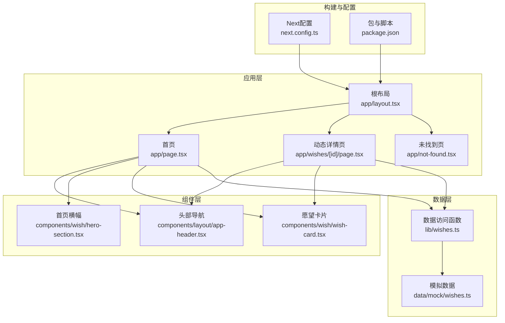
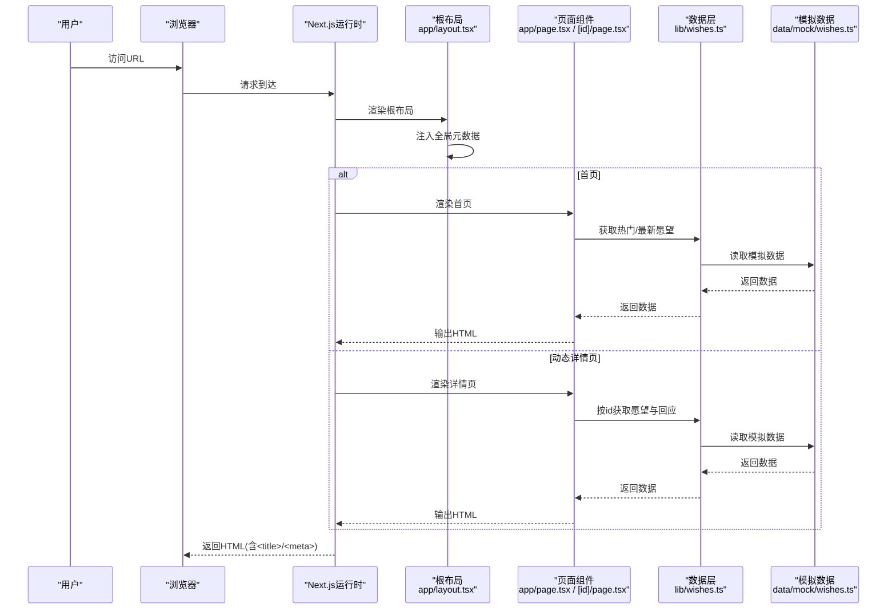
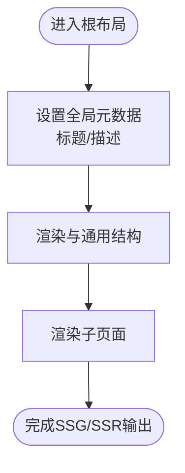
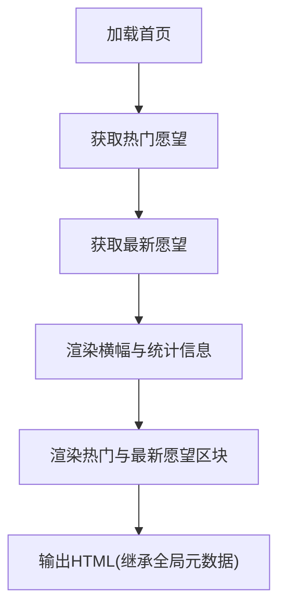
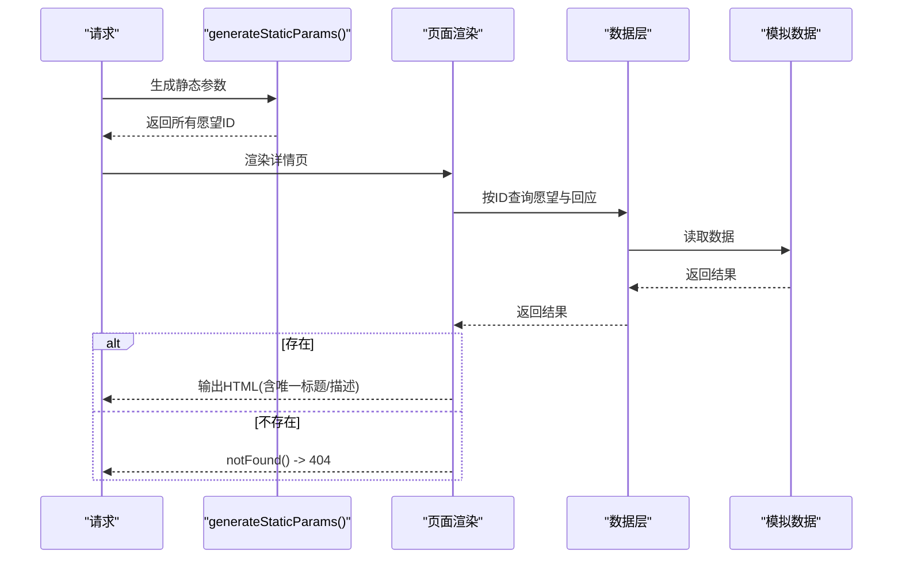
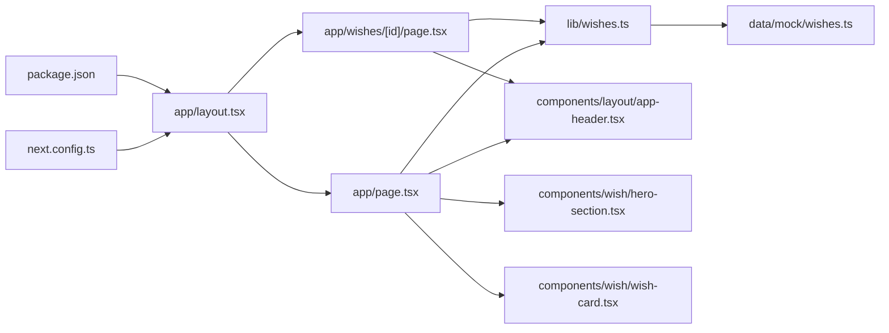

# SEO优化

<cite>
**本文引用的文件**
- [app/layout.tsx](file://app/layout.tsx)
- [app/wishes/[id]/page.tsx](file://app/wishes/[id]/page.tsx)
- [app/page.tsx](file://app/page.tsx)
- [next.config.ts](file://next.config.ts)
- [package.json](file://package.json)
- [lib/wishes.ts](file://lib/wishes.ts)
- [data/mock/wishes.ts](file://data/mock/wishes.ts)
- [lib/utils.ts](file://lib/utils.ts)
- [components/layout/app-header.tsx](file://components/layout/app-header.tsx)
- [components/wish/wish-card.tsx](file://components/wish/wish-card.tsx)
- [components/wish/hero-section.tsx](file://components/wish/hero-section.tsx)
- [app/not-found.tsx](file://app/not-found.tsx)
</cite>

## 目录
1. [引言](#引言)
2. [项目结构](#项目结构)
3. [核心组件](#核心组件)
4. [架构总览](#架构总览)
5. [详细组件分析](#详细组件分析)
6. [依赖关系分析](#依赖关系分析)
7. [性能考量](#性能考量)
8. [故障排查指南](#故障排查指南)
9. [结论](#结论)
10. [附录](#附录)

## 引言
本文件面向SEO优化目标，系统梳理梦想回应平台在Next.js应用中的搜索引擎可见性策略与实现。内容覆盖全局元数据配置、页面级动态元数据生成、动态路由页面的SEO处理、Next.js自动SEO能力（预渲染、静态生成、智能缓存）、关键词优化与结构化数据建议、社交媒体分享最佳实践、SEO性能监控与分析工具集成思路，以及多语言SEO与国际化策略。

## 项目结构
该仓库采用Next.js App Router目录结构，关键SEO相关位置如下：
- 全局布局与元数据：app/layout.tsx
- 首页：app/page.tsx
- 动态路由详情页：app/wishes/[id]/page.tsx
- 数据访问层：lib/wishes.ts
- 模拟数据：data/mock/wishes.ts
- 工具函数：lib/utils.ts
- 组件：components/layout/app-header.tsx、components/wish/*.tsx等
- 未找到页：app/not-found.tsx
- 构建配置：next.config.ts、package.json

图表来源
- [app/layout.tsx:1-29](file://app/layout.tsx#L1-L29)
- [app/page.tsx:1-29](file://app/page.tsx#L1-L29)
- [app/wishes/[id]/page.tsx:1-184](file://app/wishes/[id]/page.tsx#L1-L184)
- [lib/wishes.ts:1-27](file://lib/wishes.ts#L1-L27)
- [data/mock/wishes.ts:1-210](file://data/mock/wishes.ts#L1-L210)
- [components/layout/app-header.tsx:22-63](file://components/layout/app-header.tsx#L22-L63)
- [components/wish/wish-card.tsx:1-93](file://components/wish/wish-card.tsx#L1-L93)
- [components/wish/hero-section.tsx:1-53](file://components/wish/hero-section.tsx#L1-L53)
- [next.config.ts:1-9](file://next.config.ts#L1-L9)
- [package.json:1-29](file://package.json#L1-L29)

章节来源
- [app/layout.tsx:1-29](file://app/layout.tsx#L1-L29)
- [app/page.tsx:1-29](file://app/page.tsx#L1-L29)
- [app/wishes/[id]/page.tsx:1-184](file://app/wishes/[id]/page.tsx#L1-L184)
- [lib/wishes.ts:1-27](file://lib/wishes.ts#L1-L27)
- [data/mock/wishes.ts:1-210](file://data/mock/wishes.ts#L1-L210)
- [components/layout/app-header.tsx:22-63](file://components/layout/app-header.tsx#L22-L63)
- [components/wish/wish-card.tsx:1-93](file://components/wish/wish-card.tsx#L1-L93)
- [components/wish/hero-section.tsx:1-53](file://components/wish/hero-section.tsx#L1-L53)
- [next.config.ts:1-9](file://next.config.ts#L1-L9)
- [package.json:1-29](file://package.json#L1-L29)

## 核心组件
- 全局元数据与根布局：在根布局中集中声明站点标题与描述，确保所有页面继承一致的品牌语义与基础SEO信息。
- 首页：聚合热门与最新愿望，承载入口文案与关键词密度，提升首页索引权重。
- 动态详情页：基于路由参数动态加载单个愿望的标题、摘要、分类、状态等信息，形成高价值长尾页面。
- 数据访问层：通过统一函数封装数据读取，便于未来替换为数据库查询，同时保持SEO逻辑不变。
- 组件化结构：头部导航、横幅与卡片组件复用，保证页面结构一致性，有利于搜索引擎理解站点主题。

章节来源
- [app/layout.tsx:8-11](file://app/layout.tsx#L8-L11)
- [app/page.tsx:6-28](file://app/page.tsx#L6-L28)
- [app/wishes/[id]/page.tsx:19-31](file://app/wishes/[id]/page.tsx#L19-L31)
- [lib/wishes.ts:5-26](file://lib/wishes.ts#L5-L26)
- [components/layout/app-header.tsx:22-63](file://components/layout/app-header.tsx#L22-L63)

## 架构总览
以下序列图展示从请求到HTML输出的关键流程，体现Next.js自动SEO能力与元数据注入：

图表来源
- [app/layout.tsx:13-28](file://app/layout.tsx#L13-L28)
- [app/page.tsx:6-28](file://app/page.tsx#L6-L28)
- [app/wishes/[id]/page.tsx:19-31](file://app/wishes/[id]/page.tsx#L19-L31)
- [lib/wishes.ts:5-26](file://lib/wishes.ts#L5-L26)
- [data/mock/wishes.ts:12-150](file://data/mock/wishes.ts#L12-L150)

## 详细组件分析

### 全局元数据与根布局（app/layout.tsx）
- 全局元数据：在根布局导出的元数据对象中设置站点标题与描述，作为所有页面的基础SEO信息，确保搜索引擎索引到一致的品牌语义。
- HTML语言属性：根布局设置<html lang="zh-CN">，为中文内容提供语言提示，利于搜索引擎理解内容地域与语言特征。
- 结构化组织：根布局负责注入全局样式与通用头部元素，避免重复配置，降低维护成本。

图表来源
- [app/layout.tsx:8-11](file://app/layout.tsx#L8-L11)
- [app/layout.tsx:13-28](file://app/layout.tsx#L13-L28)

章节来源
- [app/layout.tsx:8-11](file://app/layout.tsx#L8-L11)
- [app/layout.tsx:19](file://app/layout.tsx#L19)

### 首页SEO（app/page.tsx）
- 页面结构：首页包含横幅、热门愿望与最新愿望列表，形成清晰的主题与关键词分布。
- 关键词密度：通过“愿望”“回应”“帮助”“正在等待回声”等高频词自然布局，提升主题相关性。
- 元数据继承：继承自根布局的全局元数据，确保首页具备统一的品牌与描述语义。
- 可访问性：使用语义化标题层级与段落，增强可读性与可索引性。

图表来源
- [app/page.tsx:6-28](file://app/page.tsx#L6-L28)
- [components/wish/hero-section.tsx:10-52](file://components/wish/hero-section.tsx#L10-L52)
- [components/wish/wish-card.tsx:15-92](file://components/wish/wish-card.tsx#L15-L92)

章节来源
- [app/page.tsx:6-28](file://app/page.tsx#L6-L28)
- [components/wish/hero-section.tsx:10-52](file://components/wish/hero-section.tsx#L10-L52)
- [components/wish/wish-card.tsx:15-92](file://components/wish/wish-card.tsx#L15-L92)

### 动态路由详情页SEO（app/wishes/[id]/page.tsx）
- 静态生成参数：通过generateStaticParams返回所有愿望ID，使每个详情页在构建时生成静态HTML，提升索引速度与稳定性。
- 动态数据加载：按路由参数加载单个愿望及其回应，形成高价值长尾页面。
- 页面级信息：使用愿望标题、摘要、分类、状态、创建时间等字段，构建丰富且独特的页面内容。
- 未找到处理：若ID不存在，调用notFound()触发404响应，避免产生低质量或重复索引内容。

图表来源
- [app/wishes/[id]/page.tsx:13-17](file://app/wishes/[id]/page.tsx#L13-L17)
- [app/wishes/[id]/page.tsx:19-31](file://app/wishes/[id]/page.tsx#L19-L31)
- [lib/wishes.ts:15-26](file://lib/wishes.ts#L15-L26)
- [data/mock/wishes.ts:12-150](file://data/mock/wishes.ts#L12-L150)

章节来源
- [app/wishes/[id]/page.tsx:13-17](file://app/wishes/[id]/page.tsx#L13-L17)
- [app/wishes/[id]/page.tsx:19-31](file://app/wishes/[id]/page.tsx#L19-L31)
- [lib/wishes.ts:15-26](file://lib/wishes.ts#L15-L26)
- [data/mock/wishes.ts:12-150](file://data/mock/wishes.ts#L12-L150)

### 未找到页SEO（app/not-found.tsx）
- 明确的404响应：通过notFound()确保搜索引擎正确识别无效或已删除的页面。
- 友好的用户体验：提供返回首页的引导，减少跳出率，间接提升整体SEO表现。

章节来源
- [app/not-found.tsx:3-22](file://app/not-found.tsx#L3-L22)

### 数据访问与工具函数（lib/wishes.ts、lib/utils.ts）
- 数据访问层：通过统一函数封装数据读取与排序逻辑，便于未来替换为数据库查询，同时保持SEO页面逻辑不变。
- 工具函数：格式化日期等辅助函数，用于在页面中呈现更友好的时间信息，提升可读性。

章节来源
- [lib/wishes.ts:5-26](file://lib/wishes.ts#L5-L26)
- [lib/utils.ts:5-10](file://lib/utils.ts#L5-L10)

### 组件级SEO要点（components/layout/app-header.tsx、components/wish/wish-card.tsx、components/wish/hero-section.tsx）
- 头部导航：包含品牌名称与简短标语，强化品牌认知与语义一致性。
- 横幅与卡片：使用语义化标题与段落，配合关键词自然分布，提升页面主题相关性。
- 链接结构：内部链接指向详情页，有助于搜索引擎爬虫发现与索引长尾页面。

章节来源
- [components/layout/app-header.tsx:22-63](file://components/layout/app-header.tsx#L22-L63)
- [components/wish/wish-card.tsx:15-92](file://components/wish/wish-card.tsx#L15-L92)
- [components/wish/hero-section.tsx:10-52](file://components/wish/hero-section.tsx#L10-L52)

## 依赖关系分析
- 耦合与内聚：根布局集中管理元数据，页面组件专注于内容渲染；数据访问层与模拟数据解耦，便于替换实现。
- 外部依赖：Next.js内置的SSG/SSR、路由系统与缓存机制；构建配置影响输出目录与严格模式等行为。
- 潜在风险：若未来将模拟数据替换为数据库查询，需确保generateStaticParams与页面渲染仍能稳定产出HTML。

图表来源
- [app/layout.tsx:13-28](file://app/layout.tsx#L13-L28)
- [app/page.tsx:6-28](file://app/page.tsx#L6-L28)
- [app/wishes/[id]/page.tsx:19-31](file://app/wishes/[id]/page.tsx#L19-L31)
- [lib/wishes.ts:5-26](file://lib/wishes.ts#L5-L26)
- [data/mock/wishes.ts:12-150](file://data/mock/wishes.ts#L12-L150)
- [components/layout/app-header.tsx:22-63](file://components/layout/app-header.tsx#L22-L63)
- [components/wish/hero-section.tsx:10-52](file://components/wish/hero-section.tsx#L10-L52)
- [components/wish/wish-card.tsx:15-92](file://components/wish/wish-card.tsx#L15-L92)
- [next.config.ts:3-6](file://next.config.ts#L3-L6)
- [package.json:5-10](file://package.json#L5-L10)

章节来源
- [app/layout.tsx:13-28](file://app/layout.tsx#L13-L28)
- [app/page.tsx:6-28](file://app/page.tsx#L6-L28)
- [app/wishes/[id]/page.tsx:19-31](file://app/wishes/[id]/page.tsx#L19-L31)
- [lib/wishes.ts:5-26](file://lib/wishes.ts#L5-L26)
- [data/mock/wishes.ts:12-150](file://data/mock/wishes.ts#L12-L150)
- [components/layout/app-header.tsx:22-63](file://components/layout/app-header.tsx#L22-L63)
- [components/wish/hero-section.tsx:10-52](file://components/wish/hero-section.tsx#L10-L52)
- [components/wish/wish-card.tsx:15-92](file://components/wish/wish-card.tsx#L15-L92)
- [next.config.ts:3-6](file://next.config.ts#L3-L6)
- [package.json:5-10](file://package.json#L5-L10)

## 性能考量
- 预渲染与静态生成：通过generateStaticParams在构建时生成静态HTML，缩短首屏加载时间，提升搜索引擎抓取效率。
- 缓存策略：Next.js默认缓存与标签化缓存有助于减少重复计算与网络请求，提高整体性能。
- 构建配置：严格模式与输出目录配置影响构建产物体积与启动性能，应结合实际部署环境调整。
- 图片与资源：建议在图片与静态资源层面引入现代格式与懒加载策略，进一步优化SEO体验。

## 故障排查指南
- 404页面：若出现大量404，检查generateStaticParams是否覆盖全部有效ID，以及页面中是否存在错误的内部链接。
- 元数据缺失：确认根布局的全局元数据是否正确导出，页面是否继承到预期的标题与描述。
- 数据不一致：若详情页显示空数据，检查数据访问函数与模拟数据结构是否匹配。
- 未找到处理：确保页面在ID不存在时调用notFound()，避免产生低质量页面。

章节来源
- [app/wishes/[id]/page.tsx:27-29](file://app/wishes/[id]/page.tsx#L27-L29)
- [app/layout.tsx:8-11](file://app/layout.tsx#L8-L11)
- [lib/wishes.ts:15-17](file://lib/wishes.ts#L15-L17)

## 结论
本项目在Next.js生态下实现了基础且有效的SEO策略：全局元数据集中管理、首页与动态详情页的结构化内容、静态生成与缓存机制。为进一步提升SEO表现，建议在现有基础上补充页面级动态元数据（如动态标题、描述与Open Graph标签）、结构化数据（Schema.org）与社交媒体分享标签，并结合分析工具进行持续监控与优化。

## 附录

### 页面级动态元数据与Open Graph建议
- 动态标题与描述：在详情页根据愿望标题、摘要与分类动态生成<title>与<meta name="description">，提升页面独特性与点击率。
- Open Graph标签：添加og:title、og:description、og:image、og:url、og:type等，优化社交分享效果。
- Twitter Card：添加twitter:card、twitter:title、twitter:description、twitter:image等，提升Twitter分享质量。
- 结构化数据：为详情页添加Article或BreadcrumbList等Schema，帮助搜索引擎理解页面内容层次。

### 关键词优化与内容策略
- 自然分布：在标题、摘要、段落与标签中合理分布关键词，避免堆砌。
- 长尾词：利用不同愿望的独特描述与分类，覆盖更多长尾搜索意图。
- 内容质量：确保每条详情页内容具有独立价值，减少重复与薄内容。

### 社交媒体分享最佳实践
- 图片尺寸与比例：推荐使用1200x630像素的图片，适配主流社交平台。
- 动态OG图片：可按愿望类型或状态生成差异化OG图片，提升点击率。
- 分享文案：提供简洁有力的分享文案，引导用户转发与互动。

### SEO性能监控与分析
- Google Search Console：提交sitemap、监控索引覆盖率与搜索表现。
- Analytics/Ads：集成分析工具，跟踪流量来源、停留时长与转化路径。
- 实时监控：关注页面加载速度、移动端体验与核心Web指标（Core Web Vitals）。

### 多语言SEO与国际化策略
- 语言与地域：根布局设置<html lang="zh-CN">，确保中文内容的语言标识。
- 多语言扩展：若未来支持多语言，建议采用多域名或多语言子路径策略，并为每种语言维护独立的sitemap与hreflang标签。
- 本地化内容：确保不同语言版本的标题、描述与结构化数据同步更新。