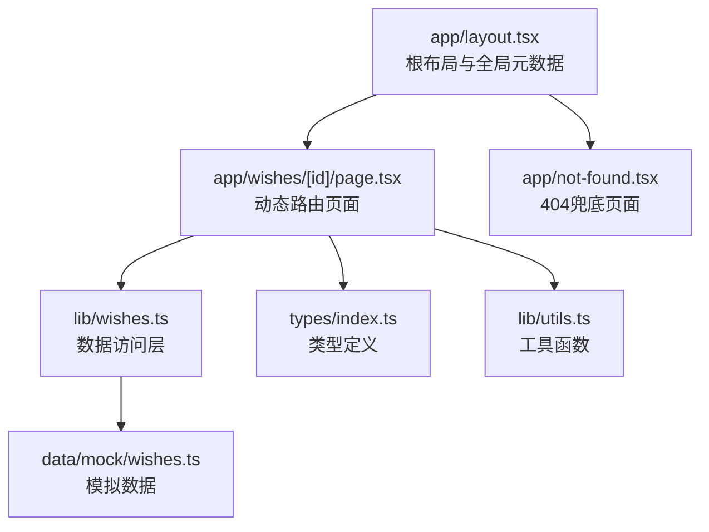
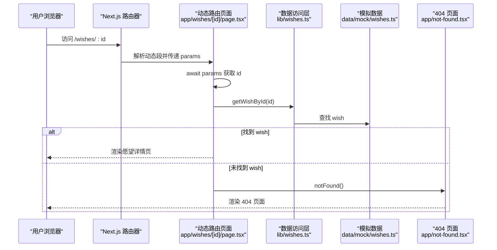
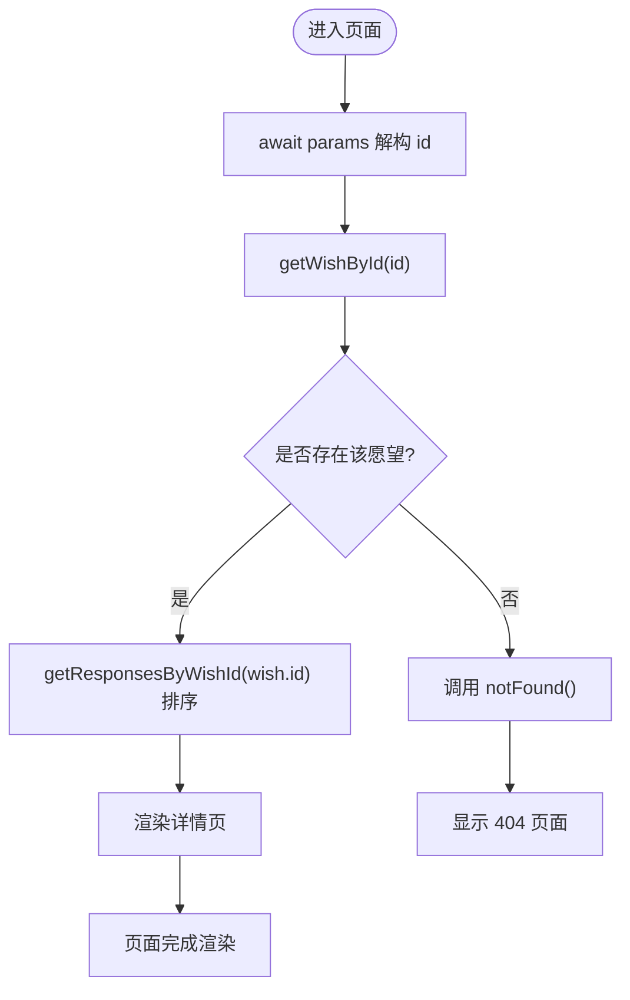
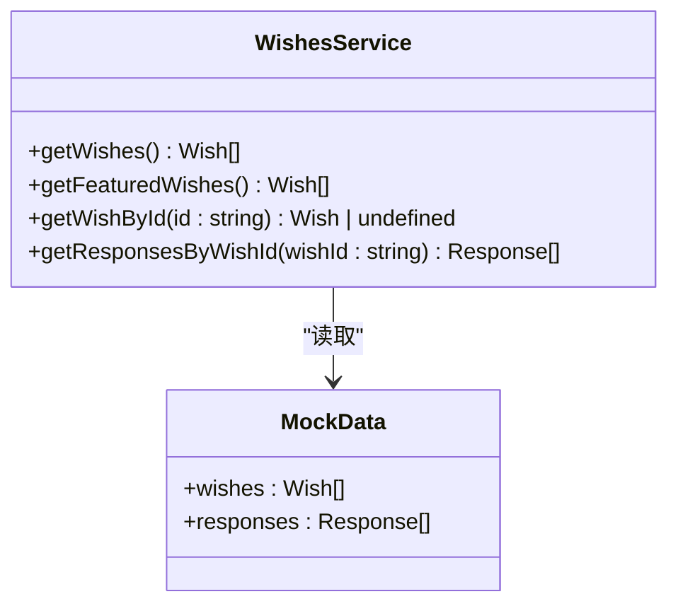
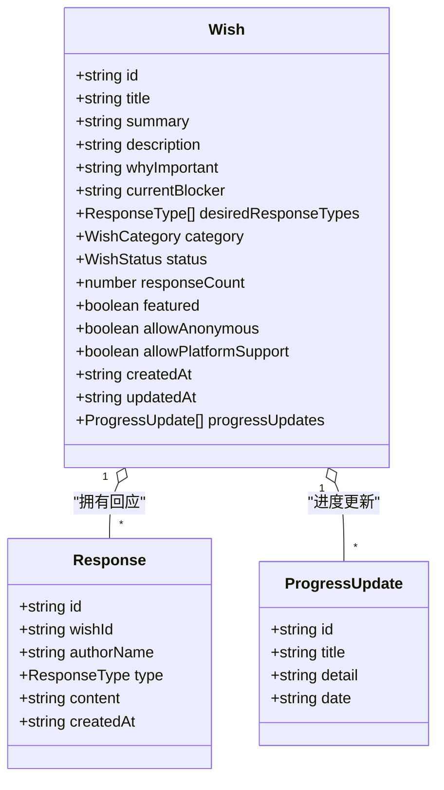
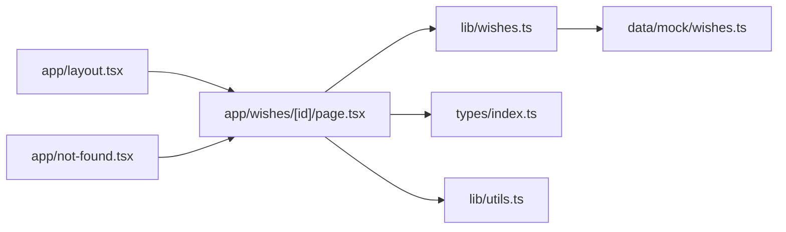

# 动态路由

<cite>
**本文引用的文件**
- [app/wishes/[id]/page.tsx](file://app/wishes/[id]/page.tsx)
- [app/layout.tsx](file://app/layout.tsx)
- [app/not-found.tsx](file://app/not-found.tsx)
- [lib/wishes.ts](file://lib/wishes.ts)
- [types/index.ts](file://types/index.ts)
- [data/mock/wishes.ts](file://data/mock/wishes.ts)
- [lib/utils.ts](file://lib/utils.ts)
- [next.config.ts](file://next.config.ts)
- [package.json](file://package.json)
</cite>

## 目录
1. [简介](#简介)
2. [项目结构](#项目结构)
3. [核心组件](#核心组件)
4. [架构总览](#架构总览)
5. [详细组件分析](#详细组件分析)
6. [依赖关系分析](#依赖关系分析)
7. [性能考量](#性能考量)
8. [故障排查指南](#故障排查指南)
9. [结论](#结论)
10. [附录](#附录)

## 简介
本文件聚焦于 Next.js App Router 中的动态路由实现，以 app/wishes/[id]/page.tsx 为例，系统性解析动态路由参数的提取、类型验证、错误处理、嵌套结构与路径匹配规则，并给出在组件中使用动态参数（客户端与服务器端）的方法、SEO 优化策略（动态元数据与预渲染配置），以及参数验证、类型安全与性能优化的最佳实践。读者无需具备深厚的前端背景，也可通过图示与分层讲解快速掌握。

## 项目结构
该项目采用 Next.js App Router 的目录约定式路由，动态路由位于 app/wishes/[id]/page.tsx。根布局负责全局样式与头部导航，未找到页面用于兜底展示。

图表来源
- [app/layout.tsx:1-29](file://app/layout.tsx#L1-L29)
- [app/wishes/[id]/page.tsx:1-184](file://app/wishes/[id]/page.tsx#L1-L184)
- [app/not-found.tsx:1-24](file://app/not-found.tsx#L1-L24)
- [lib/wishes.ts:1-27](file://lib/wishes.ts#L1-L27)
- [data/mock/wishes.ts:1-210](file://data/mock/wishes.ts#L1-L210)
- [types/index.ts:1-58](file://types/index.ts#L1-L58)
- [lib/utils.ts:1-12](file://lib/utils.ts#L1-L12)

章节来源
- [app/layout.tsx:1-29](file://app/layout.tsx#L1-L29)
- [app/wishes/[id]/page.tsx:1-184](file://app/wishes/[id]/page.tsx#L1-L184)
- [app/not-found.tsx:1-24](file://app/not-found.tsx#L1-L24)
- [lib/wishes.ts:1-27](file://lib/wishes.ts#L1-L27)
- [data/mock/wishes.ts:1-210](file://data/mock/wishes.ts#L1-L210)
- [types/index.ts:1-58](file://types/index.ts#L1-L58)
- [lib/utils.ts:1-12](file://lib/utils.ts#L1-L12)

## 核心组件
- 动态路由页面：app/wishes/[id]/page.tsx
  - 提供 generateStaticParams 以静态生成静态参数列表，结合数据源进行预渲染。
  - 使用 params 异步解构获取动态段 id，并通过数据访问层查询具体愿望与回应。
  - 当未找到目标愿望时，调用 notFound 触发 404 页面。
- 数据访问层：lib/wishes.ts
  - 将页面的数据访问封装为函数，便于替换为真实数据库查询。
  - 提供按 id 查询愿望与按 wishId 查询回应列表等方法。
- 类型定义：types/index.ts
  - 定义 Wish、Response、WishStatus、WishCategory 等类型，确保参数与返回值的类型安全。
- 模拟数据：data/mock/wishes.ts
  - 提供 wishes 与 responses 的模拟数据，供开发与演示使用。
- 工具函数：lib/utils.ts
  - 提供日期格式化等通用工具，用于渲染页面内容。
- 根布局：app/layout.tsx
  - 定义全局元数据与页面骨架，所有子路由共享。
- 404 页面：app/not-found.tsx
  - 统一的未找到页面，用于兜底动态路由无效 id 的场景。

章节来源
- [app/wishes/[id]/page.tsx:13-31](file://app/wishes/[id]/page.tsx#L13-L31)
- [lib/wishes.ts:15-26](file://lib/wishes.ts#L15-L26)
- [types/index.ts:30-58](file://types/index.ts#L30-L58)
- [data/mock/wishes.ts:12-150](file://data/mock/wishes.ts#L12-L150)
- [lib/utils.ts:5-10](file://lib/utils.ts#L5-L10)
- [app/layout.tsx:8-11](file://app/layout.tsx#L8-L11)
- [app/not-found.tsx:3-22](file://app/not-found.tsx#L3-L22)

## 架构总览
动态路由在 Next.js App Router 中遵循以下流程：
- 路径匹配：根据 app/wishes/[id]/page.tsx 的文件名，Next.js 将 [id] 作为动态段。
- 参数提取：params 为 Promise<{ id: string }>，需 await 解构后得到字符串类型的 id。
- 数据加载：通过数据访问层按 id 查询愿望与回应。
- 错误处理：若未找到，调用 notFound 触发 404 页面。
- 预渲染：generateStaticParams 返回静态参数列表，配合数据源进行静态生成。

图表来源
- [app/wishes/[id]/page.tsx:19-31](file://app/wishes/[id]/page.tsx#L19-L31)
- [lib/wishes.ts:15-17](file://lib/wishes.ts#L15-L17)
- [data/mock/wishes.ts:12-150](file://data/mock/wishes.ts#L12-L150)
- [app/not-found.tsx:3-22](file://app/not-found.tsx#L3-L22)

## 详细组件分析

### 动态路由页面：app/wishes/[id]/page.tsx
- 动态参数提取
  - params 是 Promise<{ id: string }>，需 await 后解构得到 id。
  - 类型安全：id 为字符串，符合 Next.js App Router 对动态段的默认类型。
- 数据加载与业务逻辑
  - 通过 getWishById(id) 获取愿望对象；若不存在则 notFound()。
  - 通过 getResponsesByWishId(wish.id) 获取回应列表并排序。
  - 使用 formatDate 工具函数格式化创建时间。
- 预渲染与静态生成
  - generateStaticParams 返回 wishes.map(wish => ({ id: wish.id }))，用于静态生成所有愿望详情页。
- 错误处理
  - 未找到时调用 notFound()，触发 404 页面。
- 组件渲染
  - 结合多个业务组件（如进度时间线、回应卡片、状态徽章等）渲染详情页。

图表来源
- [app/wishes/[id]/page.tsx:19-31](file://app/wishes/[id]/page.tsx#L19-L31)
- [lib/wishes.ts:15-26](file://lib/wishes.ts#L15-L26)
- [lib/utils.ts:5-10](file://lib/utils.ts#L5-L10)
- [app/not-found.tsx:3-22](file://app/not-found.tsx#L3-L22)

章节来源
- [app/wishes/[id]/page.tsx:13-31](file://app/wishes/[id]/page.tsx#L13-L31)
- [app/wishes/[id]/page.tsx:39-182](file://app/wishes/[id]/page.tsx#L39-L182)

### 数据访问层：lib/wishes.ts
- 职责
  - 将页面的数据访问封装为函数，便于替换为真实数据库查询。
- 关键方法
  - getWishById(id: string): 根据 id 查找愿望。
  - getResponsesByWishId(wishId: string): 根据 wishId 过滤回应并按时间倒序。
- 复杂度
  - 数组查找与过滤均为 O(n)，排序为 O(n log n)。

图表来源
- [lib/wishes.ts:5-26](file://lib/wishes.ts#L5-L26)
- [data/mock/wishes.ts:12-210](file://data/mock/wishes.ts#L12-L210)

章节来源
- [lib/wishes.ts:15-26](file://lib/wishes.ts#L15-L26)
- [data/mock/wishes.ts:12-210](file://data/mock/wishes.ts#L12-L210)

### 类型系统：types/index.ts
- 定义了 Wish、Response、WishStatus、WishCategory、ProgressUpdate 等类型，确保：
  - 动态参数 id 的类型为 string。
  - 响应类型枚举与分类枚举的可选性与一致性。
  - 进度更新字段的结构化约束。

图表来源
- [types/index.ts:30-58](file://types/index.ts#L30-L58)
- [types/index.ts:23-28](file://types/index.ts#L23-L28)

章节来源
- [types/index.ts:1-58](file://types/index.ts#L1-L58)

### 工具函数：lib/utils.ts
- formatDate(dateString: string): 使用本地化格式化日期，用于详情页展示创建时间。
- cn(...classes): 合并类名，简化样式拼接。

章节来源
- [lib/utils.ts:5-10](file://lib/utils.ts#L5-L10)

### 根布局与全局元数据：app/layout.tsx
- 定义全局 Metadata（标题与描述），所有子路由共享。
- 提供根 HTML 结构与全局样式入口。

章节来源
- [app/layout.tsx:8-28](file://app/layout.tsx#L8-L28)

### 404 兜底页面：app/not-found.tsx
- 统一的未找到页面，用于动态路由无效 id 的兜底。
- 提供返回首页的按钮，改善用户体验。

章节来源
- [app/not-found.tsx:3-22](file://app/not-found.tsx#L3-L22)

## 依赖关系分析
- 组件耦合
  - 动态路由页面依赖数据访问层与工具函数，耦合度低，便于替换数据源。
  - 数据访问层依赖模拟数据，便于开发与测试。
- 外部依赖
  - Next.js App Router 提供动态路由、静态生成与 404 触发能力。
  - React 生态提供组件渲染与状态管理。

图表来源
- [app/wishes/[id]/page.tsx:1-12](file://app/wishes/[id]/page.tsx#L1-L12)
- [lib/wishes.ts:1-2](file://lib/wishes.ts#L1-L2)
- [data/mock/wishes.ts:1-2](file://data/mock/wishes.ts#L1-L2)
- [types/index.ts:1-58](file://types/index.ts#L1-L58)
- [lib/utils.ts:1-12](file://lib/utils.ts#L1-L12)
- [app/layout.tsx:1-29](file://app/layout.tsx#L1-L29)
- [app/not-found.tsx:1-24](file://app/not-found.tsx#L1-L24)

章节来源
- [app/wishes/[id]/page.tsx:1-12](file://app/wishes/[id]/page.tsx#L1-L12)
- [lib/wishes.ts:1-2](file://lib/wishes.ts#L1-L2)
- [data/mock/wishes.ts:1-2](file://data/mock/wishes.ts#L1-L2)
- [types/index.ts:1-58](file://types/index.ts#L1-L58)
- [lib/utils.ts:1-12](file://lib/utils.ts#L1-L12)
- [app/layout.tsx:1-29](file://app/layout.tsx#L1-L29)
- [app/not-found.tsx:1-24](file://app/not-found.tsx#L1-L24)

## 性能考量
- 静态生成与预渲染
  - 通过 generateStaticParams 返回静态参数列表，结合数据源进行静态生成，减少运行时开销。
  - 在构建阶段生成所有动态路由页面，提升首屏性能与 SEO 友好度。
- 数据访问优化
  - 使用数组过滤与排序时注意数据量大小；对于大规模数据，建议引入分页或缓存。
- 渲染优化
  - 将组件拆分为细粒度模块，避免不必要的重渲染。
  - 使用 React.memo 或类似策略优化子组件渲染。
- 缓存策略
  - 在生产环境合理设置 revalidate 与缓存头，平衡新鲜度与性能。
- 构建配置
  - next.config.ts 中的 distDir 可自定义构建输出目录，便于部署与缓存策略。

章节来源
- [app/wishes/[id]/page.tsx:13-17](file://app/wishes/[id]/page.tsx#L13-L17)
- [next.config.ts:3-6](file://next.config.ts#L3-L6)
- [package.json:5-10](file://package.json#L5-L10)

## 故障排查指南
- 动态参数为空或类型不符
  - 确认 params 为 Promise<{ id: string }>，必须 await 后解构。
  - 若 id 为非字符串，检查上游数据源与 generateStaticParams 的返回值。
- 未找到页面
  - 当 getWishById 返回空时，调用 notFound() 触发 404 页面。
  - 检查数据源中是否存在对应 id 的愿望。
- 预渲染未生效
  - 确认 generateStaticParams 是否返回正确的 id 列表。
  - 检查构建日志与静态产物是否包含对应页面。
- SEO 元数据缺失
  - 根布局的 Metadata 为全局元数据，动态详情页可扩展为动态元数据（见下一节）。

章节来源
- [app/wishes/[id]/page.tsx:24-29](file://app/wishes/[id]/page.tsx#L24-L29)
- [lib/wishes.ts:15-17](file://lib/wishes.ts#L15-L17)
- [app/not-found.tsx:3-22](file://app/not-found.tsx#L3-L22)

## 结论
本项目通过 Next.js App Router 的动态路由机制，实现了基于 id 的愿望详情页。通过 generateStaticParams 进行静态生成，结合数据访问层与类型系统，保证了参数提取、数据加载与渲染的可靠性。配合统一的 404 兜底页面与全局元数据，提升了用户体验与 SEO 表现。未来可在动态元数据生成、参数验证与缓存策略方面进一步优化，以满足更高性能与可维护性的需求。

## 附录

### 动态路由参数在组件中的使用方法
- 服务器端（异步）
  - 在页面组件中 await params，解构得到 id，然后通过数据访问层查询数据。
  - 适用于需要在服务端渲染的场景，如 SEO、预渲染。
- 客户端（异步）
  - 在客户端组件中使用 useSearchParams 或通过路由提供的参数访问 id。
  - 适用于交互性强、需要客户端状态管理的场景。

章节来源
- [app/wishes/[id]/page.tsx:19-24](file://app/wishes/[id]/page.tsx#L19-L24)

### 动态路由的嵌套结构与路径匹配规则
- 嵌套结构
  - app/wishes/[id]/page.tsx 表示在 wishes 目录下存在一个动态段 [id]。
  - Next.js 会将 /wishes/:id 映射到该页面。
- 匹配规则
  - 动态段 [id] 默认为字符串类型。
  - 若需要更严格的类型控制，可在 generateStaticParams 中限制 id 集合，或在运行时进行校验。

章节来源
- [app/wishes/[id]/page.tsx:13-17](file://app/wishes/[id]/page.tsx#L13-L17)

### SEO 优化策略
- 全局元数据
  - 根布局定义全局 title 与 description，适用于所有页面。
- 动态元数据（建议）
  - 在页面组件中导出 generateMetadata 函数，根据 id 查询到的 wish 动态生成标题、描述与 Open Graph 元信息。
  - 例如：根据 wish.title 与 summary 生成页面标题与描述，根据 wish.originLabel 生成作者信息。
- 预渲染与缓存
  - 使用 generateStaticParams 与静态生成，提升 SEO 与首屏性能。
  - 在生产环境设置合理的 revalidate 与缓存头，平衡新鲜度与性能。

章节来源
- [app/layout.tsx:8-11](file://app/layout.tsx#L8-L11)
- [app/wishes/[id]/page.tsx:13-17](file://app/wishes/[id]/page.tsx#L13-L17)

### 路由参数验证、类型安全与最佳实践
- 参数类型验证
  - 使用类型系统确保 id 为 string；在运行时可添加额外校验（如长度、字符集）。
- 类型安全
  - 通过 types/index.ts 定义 Wish、Response 等类型，确保数据结构一致。
- 最佳实践
  - 将数据访问封装在 lib 层，便于替换为真实数据库。
  - 使用 generateStaticParams 进行静态生成，减少运行时开销。
  - 在未找到时调用 notFound()，保持一致的错误处理体验。
  - 对大列表进行分页或缓存，避免阻塞渲染。

章节来源
- [types/index.ts:30-58](file://types/index.ts#L30-L58)
- [lib/wishes.ts:15-26](file://lib/wishes.ts#L15-L26)
- [app/wishes/[id]/page.tsx:24-29](file://app/wishes/[id]/page.tsx#L24-L29)