# 导航策略

<cite>
**本文档中引用的文件**
- [components/layout/app-header.tsx](file://components/layout/app-header.tsx)
- [app/layout.tsx](file://app/layout.tsx)
- [components/ui/button.tsx](file://components/ui/button.tsx)
- [app/page.tsx](file://app/page.tsx)
- [app/submit/page.tsx](file://app/submit/page.tsx)
- [components/wish/wish-card.tsx](file://components/wish/wish-card.tsx)
- [types/index.ts](file://types/index.ts)
- [next.config.ts](file://next.config.ts)
- [package.json](file://package.json)
</cite>

## 目录
1. [简介](#简介)
2. [项目结构](#项目结构)
3. [核心组件](#核心组件)
4. [架构概览](#架构概览)
5. [详细组件分析](#详细组件分析)
6. [导航策略实现](#导航策略实现)
7. [性能优化](#性能优化)
8. [无障碍支持](#无障碍支持)
9. [故障排除指南](#故障排除指南)
10. [结论](#结论)

## 简介

本项目是一个基于 Next.js 的愿望平台前端应用，采用现代 React 和 TypeScript 技术栈构建。导航策略作为用户体验的核心组成部分，通过精心设计的组件架构和响应式布局，为用户提供了流畅、直观的页面跳转体验。

本项目的导航系统主要基于 Next.js 的内置导航解决方案，包括客户端导航（Client-Side Navigation）和服务器端渲染（Server-Side Rendering），实现了高性能的单页应用体验。

## 项目结构

项目采用按功能模块组织的目录结构，导航相关的组件分布在以下关键位置：

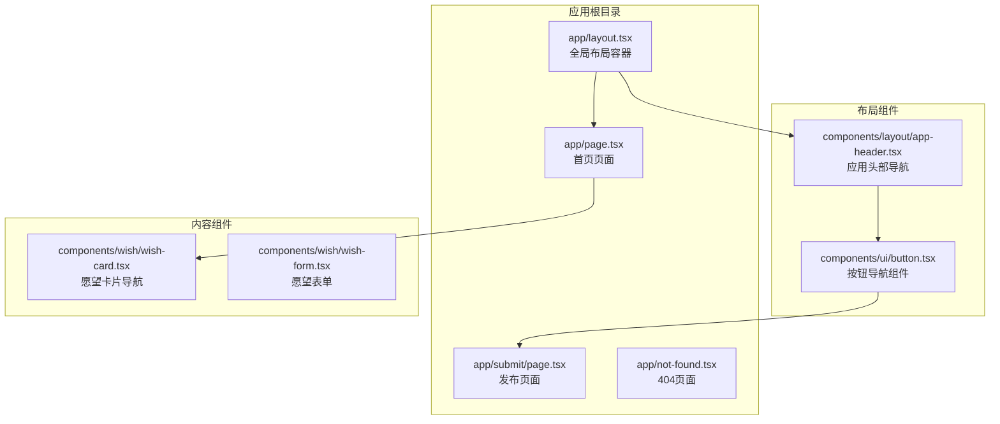

**图表来源**
- [app/layout.tsx:13-28](file://app/layout.tsx#L13-L28)
- [components/layout/app-header.tsx:22-63](file://components/layout/app-header.tsx#L22-L63)

**章节来源**
- [app/layout.tsx:1-29](file://app/layout.tsx#L1-L29)
- [components/layout/app-header.tsx:1-64](file://components/layout/app-header.tsx#L1-L64)

## 核心组件

### 应用头部导航组件

AppHeader 组件是整个导航系统的核心，负责维护全局导航菜单和品牌标识。

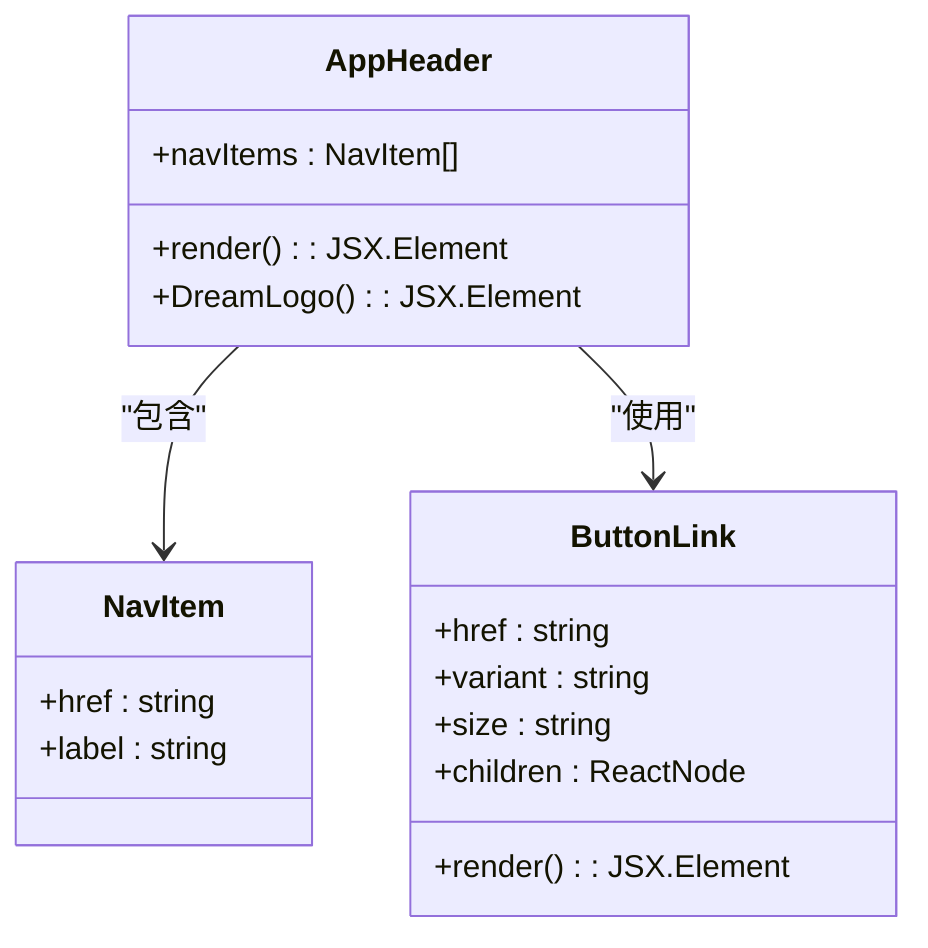

**图表来源**
- [components/layout/app-header.tsx:6-9](file://components/layout/app-header.tsx#L6-L9)
- [components/layout/app-header.tsx:53-59](file://components/layout/app-header.tsx#L53-L59)

### 导航菜单数据结构

导航菜单采用简单而灵活的数据结构，便于维护和扩展：

| 属性名 | 类型 | 描述 | 示例值 |
|--------|------|------|--------|
| href | string | 导航链接地址 | "/" |
| label | string | 菜单显示文本 | "愿望广场" |

**章节来源**
- [components/layout/app-header.tsx:6-9](file://components/layout/app-header.tsx#L6-L9)

## 架构概览

### 导航系统整体架构

```mermaid
graph TD
subgraph "客户端导航层"
NextLink["Next.js Link 组件"]
ButtonLink["ButtonLink 组件"]
ClientNav["客户端导航逻辑"]
end
subgraph "服务端渲染层"
SSR["服务器端渲染"]
HTML["HTML 响应"]
Cache["缓存机制"]
end
subgraph "用户界面层"
AppHeader["AppHeader 导航"]
Content["页面内容"]
Footer["页面底部"]
end
NextLink --> ClientNav
ButtonLink --> ClientNav
ClientNav --> AppHeader
ClientNav --> Content
SSR --> HTML
HTML --> AppHeader
Cache --> SSR
```

**图表来源**
- [components/layout/app-header.tsx:1-1](file://components/layout/app-header.tsx#L1-L1)
- [components/ui/button.tsx:59-74](file://components/ui/button.tsx#L59-L74)

### 页面路由架构

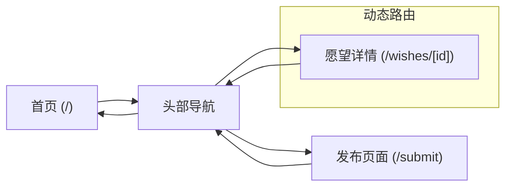

**图表来源**
- [app/page.tsx:1-29](file://app/page.tsx#L1-L29)
- [app/submit/page.tsx:1-24](file://app/submit/page.tsx#L1-L24)
- [components/wish/wish-card.tsx:31](file://components/wish/wish-card.tsx#L31)

**章节来源**
- [app/page.tsx:1-29](file://app/page.tsx#L1-L29)
- [app/submit/page.tsx:1-24](file://app/submit/page.tsx#L1-L24)

## 详细组件分析

### AppHeader 组件深度分析

AppHeader 组件实现了响应式导航设计，包含品牌标识、主导航菜单和行动按钮。

#### 组件结构分析

```mermaid
classDiagram
class AppHeader {
+sticky : "sticky top-0 z-30"
+border : "border-b border-stone-200/80"
+bg : "bg-stone-50/88"
+backdrop : "backdrop-blur-xl"
+render() : JSX.Element
}
class DreamLogo {
+absolutePositions : Array
+render() : JSX.Element
}
class NavigationMenu {
+hidden : "hidden md : flex"
+gap : "gap-6"
+items : NavItem[]
+render() : JSX.Element
}
class ActionButtons {
+ButtonLink : "hidden sm : inline-flex"
+ButtonLink : "sm : hidden"
+variants : "primary"
+sizes : "md/sm"
}
AppHeader --> DreamLogo : "包含"
AppHeader --> NavigationMenu : "包含"
AppHeader --> ActionButtons : "包含"
```

**图表来源**
- [components/layout/app-header.tsx:22-63](file://components/layout/app-header.tsx#L22-L63)

#### 响应式设计实现

组件采用 Tailwind CSS 实现响应式布局，通过断点控制不同屏幕尺寸下的显示效果：

| 断点 | 类名 | 显示条件 | 功能 |
|------|------|----------|------|
| sm | hidden sm:inline-flex | ≥640px | 移动端隐藏，桌面端显示 |
| md | hidden md:inline-flex | ≥768px | 中等屏幕显示徽章 |
| lg | lg:grid-cols | ≥1024px | 大屏幕网格布局 |

**章节来源**
- [components/layout/app-header.tsx:22-63](file://components/layout/app-header.tsx#L22-L63)

### ButtonLink 组件分析

ButtonLink 组件是对 Next.js Link 组件的封装，提供了统一的导航样式和交互行为。

#### 组件特性

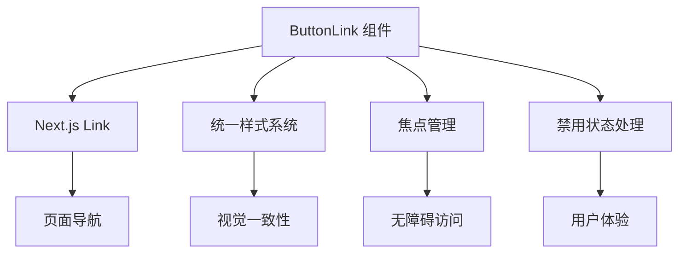

**图表来源**
- [components/ui/button.tsx:59-74](file://components/ui/button.tsx#L59-L74)

**章节来源**
- [components/ui/button.tsx:1-75](file://components/ui/button.tsx#L1-L75)

### 愿望卡片导航分析

WishCard 组件展示了如何在内容组件中实现导航集成。

#### 导航集成模式

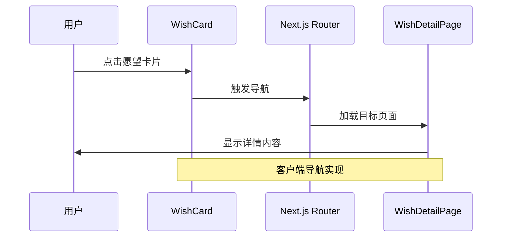

**图表来源**
- [components/wish/wish-card.tsx:23-32](file://components/wish/wish-card.tsx#L23-L32)

**章节来源**
- [components/wish/wish-card.tsx:1-93](file://components/wish/wish-card.tsx#L1-L93)

## 导航策略实现

### 客户端导航与服务器端导航选择

#### 客户端导航（Client-Side Navigation）

客户端导航适用于：
- 同域内的页面跳转
- 单页应用内部的路由切换
- 需要保持页面状态的场景

实现特点：
- 使用 Next.js Link 组件
- 支持预加载和预取
- 保持应用状态不变
- 提供平滑的过渡动画

#### 服务器端导航（Server-Side Navigation）

服务器端导航适用于：
- 跨域链接
- 外部资源访问
- 需要完整页面刷新的场景

实现特点：
- 使用标准 HTML anchor 标签
- 完整的服务器请求响应流程
- 清除客户端状态
- 适合 SEO 和可访问性场景

### 导航性能优化策略

#### 预加载和预取机制

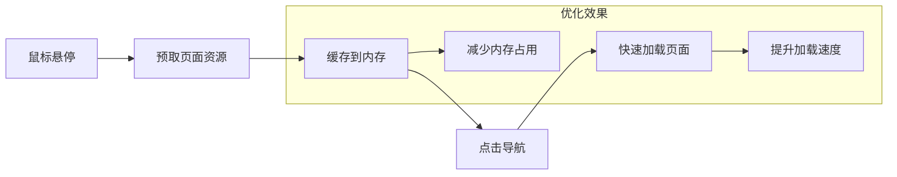

#### 导航状态管理

导航状态管理包括活动链接高亮和导航历史记录：

| 状态类型 | 实现方式 | 用户体验 |
|----------|----------|----------|
| 活动链接 | CSS 类名切换 | 视觉反馈 |
| 导航历史 | 浏览器历史 API | 返回功能 |
| 状态持久化 | localStorage | 刷新保持 |

**章节来源**
- [components/layout/app-header.tsx:42-50](file://components/layout/app-header.tsx#L42-L50)

## 性能优化

### 预加载策略

#### 链接预加载

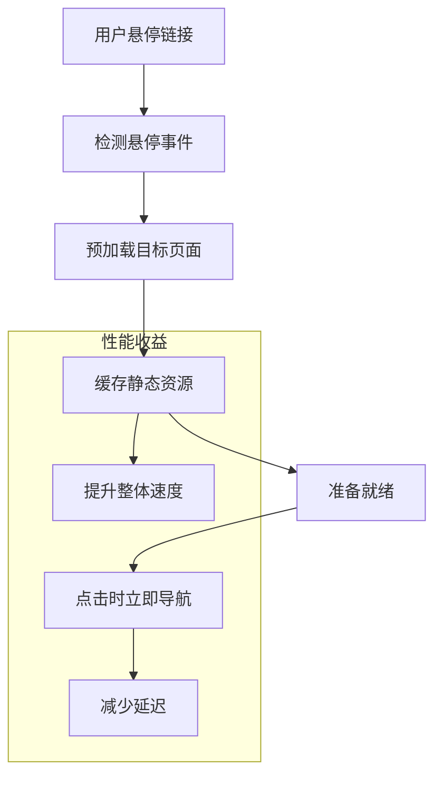

#### 图片和资源优化

- 使用 WebP 格式的图片
- 实现懒加载和占位符
- 压缩和优化静态资源

### 缓存策略

#### 多层缓存架构

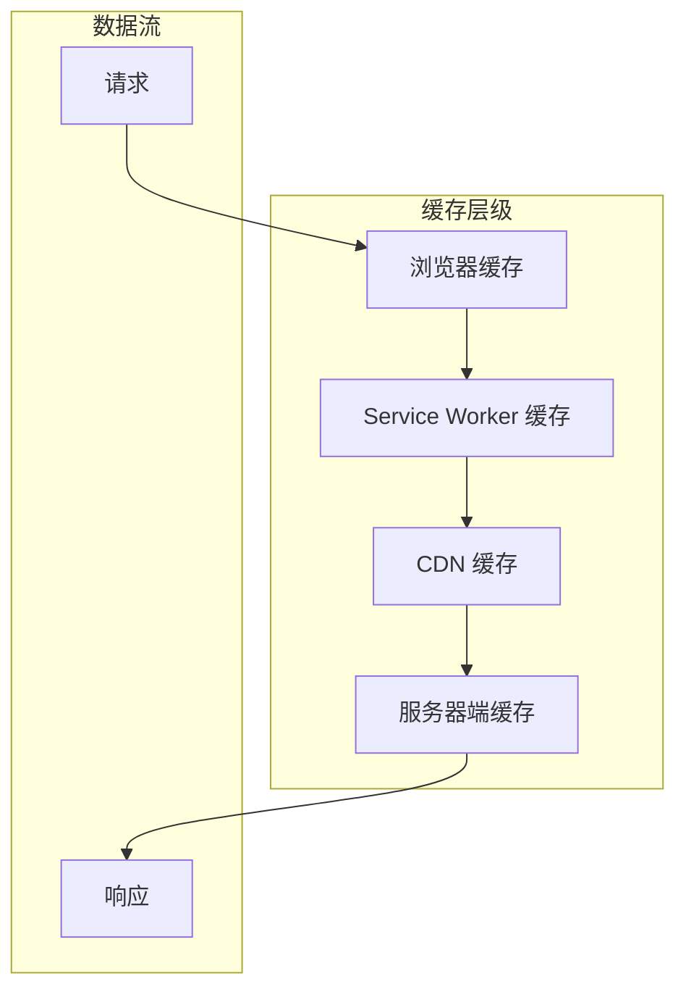

**章节来源**
- [next.config.ts:1-9](file://next.config.ts#L1-L9)

## 无障碍支持

### 键盘导航支持

项目实现了完整的键盘导航支持：

#### 键盘快捷键

| 快捷键 | 功能 | 说明 |
|--------|------|------|
| Tab | 导航到下一个可聚焦元素 | 标准浏览器行为 |
| Enter | 触发当前元素操作 | 适用于按钮和链接 |
| Space | 触发当前元素操作 | 替代 Enter 键 |
| Esc | 关闭模态框/菜单 | 退出当前交互 |

#### 无障碍属性

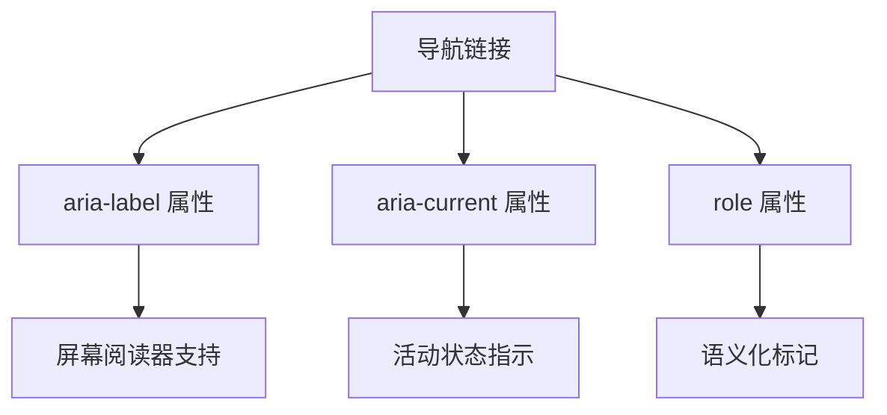

### 焦点管理

组件实现了智能的焦点管理：

- 自动焦点到主要内容区域
- 模态框打开时焦点锁定
- 焦点可见性指示器
- 键盘导航顺序优化

**章节来源**
- [components/ui/button.tsx:6-7](file://components/ui/button.tsx#L6-L7)

## 故障排除指南

### 常见导航问题及解决方案

#### 页面跳转失效

**问题症状**：点击导航链接无反应

**可能原因**：
- Link 组件导入错误
- 路由路径配置错误
- 组件未正确渲染

**解决步骤**：
1. 检查 Link 组件导入路径
2. 验证路由配置
3. 确认组件渲染逻辑

#### 导航状态异常

**问题症状**：活动链接高亮不正确

**可能原因**：
- 状态管理逻辑错误
- 样式类名冲突
- 路由匹配问题

**解决步骤**：
1. 检查路由匹配逻辑
2. 验证状态更新机制
3. 排查样式冲突

#### 性能问题

**问题症状**：页面跳转缓慢

**可能原因**：
- 资源加载阻塞
- 过多的重渲染
- 缺少预加载

**解决步骤**：
1. 分析网络请求
2. 优化组件渲染
3. 实施预加载策略

**章节来源**
- [components/layout/app-header.tsx:1-64](file://components/layout/app-header.tsx#L1-L64)

## 结论

本项目的导航策略展现了现代前端应用的最佳实践，通过精心设计的组件架构和响应式布局，为用户提供了流畅、直观的导航体验。

### 主要成就

1. **组件化设计**：AppHeader 组件实现了高度可复用的导航解决方案
2. **响应式布局**：通过断点控制实现了跨设备的导航体验
3. **性能优化**：客户端导航和预加载机制确保了优秀的用户体验
4. **无障碍支持**：完整的键盘导航和屏幕阅读器支持
5. **扩展性**：清晰的组件接口便于功能扩展

### 未来改进方向

1. **增强的导航状态管理**：考虑引入专门的导航状态管理库
2. **高级预加载策略**：实现基于用户行为的智能预加载
3. **导航性能监控**：添加导航性能指标的实时监控
4. **国际化支持**：扩展多语言导航菜单支持

这个导航系统为类似的应用提供了坚实的基础，既满足了当前的功能需求，也为未来的扩展预留了充足的空间。