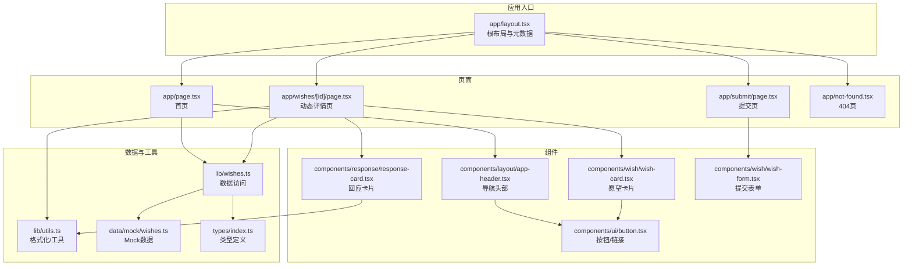
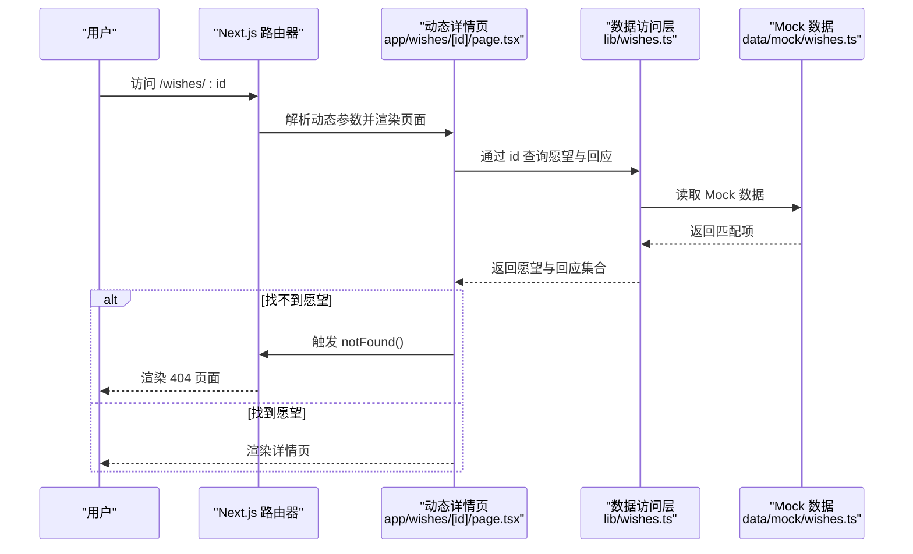
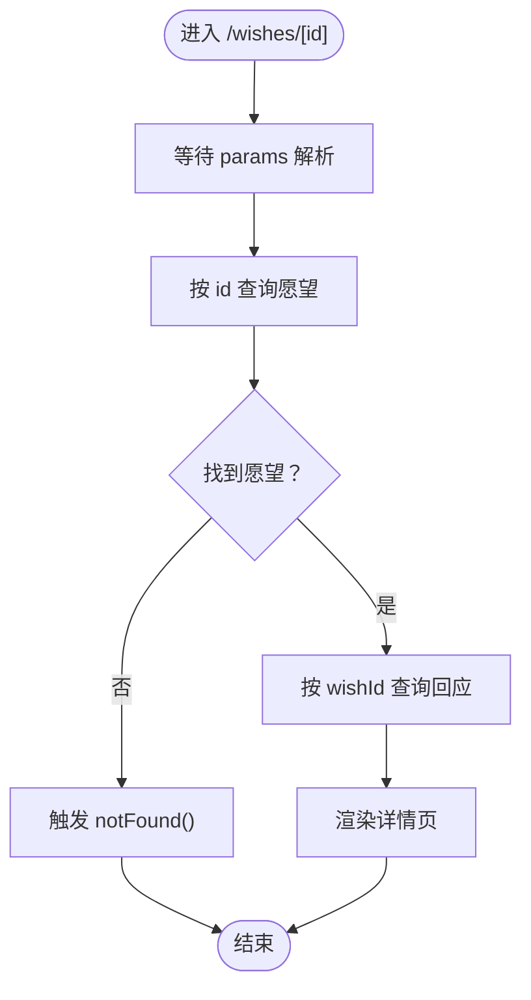
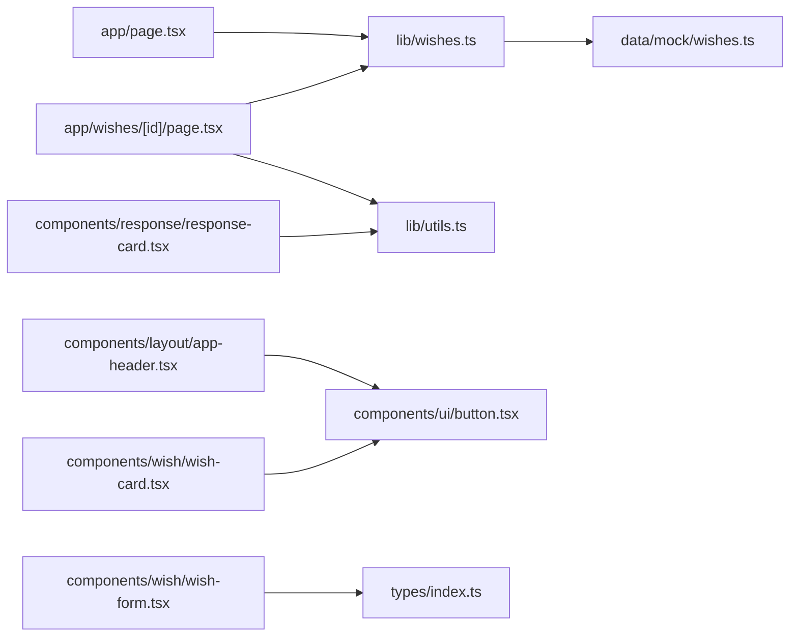

# 路由与导航

<cite>
**本文引用的文件**
- [app/layout.tsx](file://app/layout.tsx)
- [app/page.tsx](file://app/page.tsx)
- [app/wishes/[id]/page.tsx](file://app/wishes/[id]/page.tsx)
- [app/submit/page.tsx](file://app/submit/page.tsx)
- [app/not-found.tsx](file://app/not-found.tsx)
- [components/layout/app-header.tsx](file://components/layout/app-header.tsx)
- [components/ui/button.tsx](file://components/ui/button.tsx)
- [components/wish/wish-form.tsx](file://components/wish/wish-form.tsx)
- [components/wish/wish-card.tsx](file://components/wish/wish-card.tsx)
- [components/response/response-card.tsx](file://components/response/response-card.tsx)
- [lib/wishes.ts](file://lib/wishes.ts)
- [lib/utils.ts](file://lib/utils.ts)
- [data/mock/wishes.ts](file://data/mock/wishes.ts)
- [types/index.ts](file://types/index.ts)
- [next.config.ts](file://next.config.ts)
- [package.json](file://package.json)
</cite>

## 目录
1. [引言](#引言)
2. [项目结构](#项目结构)
3. [核心组件](#核心组件)
4. [架构总览](#架构总览)
5. [详细组件分析](#详细组件分析)
6. [依赖分析](#依赖分析)
7. [性能考虑](#性能考虑)
8. [故障排查指南](#故障排查指南)
9. [结论](#结论)
10. [附录](#附录)

## 引言
本文件面向「梦的平台 / 愿望被回应的平台」的路由与导航系统，基于 Next.js App Router 的页面组织与动态路由机制，系统梳理以下主题：
- 动态路由与参数解析：以 app/wishes/[id]/page.tsx 为例，说明动态参数提取、静态生成与兆底处理。
- 页面布局与元数据：app/layout.tsx 中的根布局、全局样式与元数据配置。
- 页面间导航策略：客户端导航（Link）、服务端渲染与静态生成的取舍与依据。
- 路由守卫与权限控制：基于 notFound 与参数校验的简单守卫思路。
- SEO 优化：动态元数据生成、结构化数据与搜索引擎友好性。
- 导航性能优化与用户体验：预加载、骨架屏、滚动恢复与无障碍。
- 路由扩展与自定义导航组件：基于现有 Link 组件的扩展与复用。

### 产品信息架构

根据 PRD 定义，完整的路由体系应包含：

```
首页 / 愿望广场
├── 顶部品牌区
├── 分类筛选
├── 精选愿望
├── 最新愿望流
├── 推进中的愿望
└── 精选故事入口

发布愿望页
├── 原始愿望输入
├── AI 结构化结果
├── 用户确认编辑
└── 发布设置

愿望详情页
├── 愿望主体
├── 背景与卡点
├── 回应区
└── 进展区

回应提交层（弹层/内嵌）
├── 回应类型选择
├── 回应内容
└── 公开/后续联系设置

轻运营后台（MVP 后期）
├── 愿望列表
├── 愿望状态修改
├── 精选标记
└── 推进标记
```

### 当前已实现 vs 待实现路由

| 路由 | 状态 | 说明 |
|------|------|------|
| `/` | ✅ 已实现 | 首页/愿望广场 |
| `/submit` | ✅ 已实现 | 发布愿望页 |
| `/wishes/[id]` | ✅ 已实现 | 愿望详情页 |
| `/not-found` | ✅ 已实现 | 404 页面 |
| `/admin/wishes` | ❌ 待实现 | 轻运营后台 |
| 回应提交弹层 | ❌ 待实现 | 详情页内回应表单 |

## 项目结构
本项目采用 Next.js App Router 的约定式页面组织，关键目录与文件如下：
- 根布局与元数据：app/layout.tsx
- 首页：app/page.tsx
- 动态详情页：app/wishes/[id]/page.tsx
- 提交页：app/submit/page.tsx
- 404 页：app/not-found.tsx
- 导航头部：components/layout/app-header.tsx
- UI 组件：components/ui/button.tsx
- 业务组件：components/wish/*、components/response/*
- 数据访问层：lib/wishes.ts
- 类型定义：types/index.ts
- Mock 数据：data/mock/wishes.ts
- 工具函数：lib/utils.ts
- 构建配置：next.config.ts、package.json



图表来源
- [app/layout.tsx:1-29](file://app/layout.tsx#L1-L29)
- [app/page.tsx:1-29](file://app/page.tsx#L1-L29)
- [app/wishes/[id]/page.tsx:1-184](file://app/wishes/[id]/page.tsx#L1-L184)
- [app/submit/page.tsx:1-24](file://app/submit/page.tsx#L1-L24)
- [app/not-found.tsx:1-24](file://app/not-found.tsx#L1-L24)
- [components/layout/app-header.tsx:1-64](file://components/layout/app-header.tsx#L1-L64)
- [components/ui/button.tsx:1-75](file://components/ui/button.tsx#L1-L75)
- [components/wish/wish-card.tsx:1-93](file://components/wish/wish-card.tsx#L1-L93)
- [components/response/response-card.tsx:1-48](file://components/response/response-card.tsx#L1-L48)
- [components/wish/wish-form.tsx:1-264](file://components/wish/wish-form.tsx#L1-L264)
- [lib/wishes.ts:1-27](file://lib/wishes.ts#L1-L27)
- [lib/utils.ts:1-12](file://lib/utils.ts#L1-L12)
- [data/mock/wishes.ts:1-210](file://data/mock/wishes.ts#L1-L210)
- [types/index.ts:1-58](file://types/index.ts#L1-L58)

章节来源
- [app/layout.tsx:1-29](file://app/layout.tsx#L1-L29)
- [app/page.tsx:1-29](file://app/page.tsx#L1-L29)
- [app/wishes/[id]/page.tsx:1-184](file://app/wishes/[id]/page.tsx#L1-L184)
- [app/submit/page.tsx:1-24](file://app/submit/page.tsx#L1-L24)
- [app/not-found.tsx:1-24](file://app/not-found.tsx#L1-L24)
- [components/layout/app-header.tsx:1-64](file://components/layout/app-header.tsx#L1-L64)
- [components/ui/button.tsx:1-75](file://components/ui/button.tsx#L1-L75)
- [components/wish/wish-card.tsx:1-93](file://components/wish/wish-card.tsx#L1-L93)
- [components/response/response-card.tsx:1-48](file://components/response/response-card.tsx#L1-L48)
- [components/wish/wish-form.tsx:1-264](file://components/wish/wish-form.tsx#L1-L264)
- [lib/wishes.ts:1-27](file://lib/wishes.ts#L1-L27)
- [lib/utils.ts:1-12](file://lib/utils.ts#L1-L12)
- [data/mock/wishes.ts:1-210](file://data/mock/wishes.ts#L1-L210)
- [types/index.ts:1-58](file://types/index.ts#L1-L58)

## 核心组件
- 根布局与元数据：在根布局中集中声明站点标题与描述，并注入全局样式与头部组件，确保所有页面共享一致的视觉与语义基础。
- 首页：聚合精选与最新愿望列表，通过数据访问层获取数据并进行简单计算（如待回应计数）。
- 动态详情页：接收动态参数 id，查询愿望与回应，渲染详情内容与侧栏信息；使用静态生成参数与兜底逻辑处理不存在的 id。
- 提交页：提供愿望发布的表单组件，强调“先整理、再发布”的流程体验。
- 404 页：统一的未找到页面，提供返回首页的引导按钮。
- 导航头部：包含站点 Logo、主导航与发布按钮，使用 Link 实现客户端导航。
- UI 组件：ButtonLink 封装 Link，统一按钮风格与交互行为。
- 业务组件：WishCard、ResponseCard 等用于渲染列表与详情内容。
- 数据访问层：封装对 Mock 数据的访问，便于替换为真实后端。
- 工具函数：cn 用于类名合并，formatDate 用于本地化日期格式化。

章节来源
- [app/layout.tsx:8-28](file://app/layout.tsx#L8-L28)
- [app/page.tsx:6-28](file://app/page.tsx#L6-L28)
- [app/wishes/[id]/page.tsx:13-31](file://app/wishes/[id]/page.tsx#L13-L31)
- [app/submit/page.tsx:3-23](file://app/submit/page.tsx#L3-L23)
- [app/not-found.tsx:3-22](file://app/not-found.tsx#L3-L22)
- [components/layout/app-header.tsx:6-59](file://components/layout/app-header.tsx#L6-L59)
- [components/ui/button.tsx:59-74](file://components/ui/button.tsx#L59-L74)
- [lib/wishes.ts:5-26](file://lib/wishes.ts#L5-L26)
- [lib/utils.ts:1-12](file://lib/utils.ts#L1-L12)

## 架构总览
Next.js App Router 将页面视为“服务器组件”，通过 app 目录下的约定式路由组织页面树。动态路由通过方括号语法定义，参数在页面组件中以 params 形式可用。本项目采用“静态生成 + 参数预渲染”的策略，结合兜底处理保证路由健壮性。



图表来源
- [app/wishes/[id]/page.tsx:13-31](file://app/wishes/[id]/page.tsx#L13-L31)
- [lib/wishes.ts:15-26](file://lib/wishes.ts#L15-L26)
- [data/mock/wishes.ts:12-150](file://data/mock/wishes.ts#L12-L150)

## 详细组件分析

### 动态路由与参数处理（/wishes/[id]）
- 参数提取：页面组件接收 Promise 化的 params，await 后得到 id。
- 静态生成参数：generateStaticParams 返回所有愿望 id，使每个详情页在构建时生成静态 HTML。
- 兜底处理：若根据 id 无法查到愿望，则调用 notFound，触发 404 页面渲染。
- 数据访问：通过 lib/wishes.ts 的 getWishById 与 getResponsesByWishId 获取详情与回应列表。
- 本地化：使用 lib/utils.ts 的 formatDate 对时间字段进行本地化展示。



图表来源
- [app/wishes/[id]/page.tsx:19-31](file://app/wishes/[id]/page.tsx#L19-L31)
- [lib/wishes.ts:15-26](file://lib/wishes.ts#L15-L26)
- [lib/utils.ts:5-10](file://lib/utils.ts#L5-L10)

章节来源
- [app/wishes/[id]/page.tsx:13-31](file://app/wishes/[id]/page.tsx#L13-L31)
- [lib/wishes.ts:15-26](file://lib/wishes.ts#L15-L26)
- [lib/utils.ts:5-10](file://lib/utils.ts#L5-L10)

### 页面组件结构设计（app/layout.tsx）
- 元数据：在根布局中集中声明 title 与 description，确保所有页面具备一致的 SEO 基础。
- 全局样式：引入全局 CSS，统一字体、色彩与排版。
- 结构化布局：在 html/body 中包裹 AppHeader 与 main，main 下承载各页面 children。
- 语言属性：设置 html lang 为 zh-CN，提升可访问性与 SEO 友好度。

章节来源
- [app/layout.tsx:8-28](file://app/layout.tsx#L8-L28)

### 页面间导航策略
- 客户端导航：使用 next/link 的 Link 组件实现页面跳转，避免整页刷新，提升交互流畅度。
- 服务端渲染与静态生成：首页与详情页均采用 SSR/SSG 策略，首页通过数据访问层获取数据，详情页通过 generateStaticParams 预渲染静态页面。
- 选择依据：静态生成适用于内容相对稳定的页面；详情页通过预渲染提高首屏性能与 SEO；首页聚合数据时优先保证实时性与一致性。

章节来源
- [components/layout/app-header.tsx:22-59](file://components/layout/app-header.tsx#L22-L59)
- [app/page.tsx:6-28](file://app/page.tsx#L6-L28)
- [app/wishes/[id]/page.tsx:13-31](file://app/wishes/[id]/page.tsx#L13-L31)

### 路由守卫与权限控制
- 简单守卫：在动态详情页中，若根据 id 无法查到愿望则 notFound，形成基础的“存在性守卫”。
- 权限控制扩展：可在 params 解析后增加角色/登录态校验，若不满足条件则 redirect 或渲染受保护页面。

章节来源
- [app/wishes/[id]/page.tsx:27-29](file://app/wishes/[id]/page.tsx#L27-L29)

### SEO 优化策略
- 动态元数据：根布局集中设置 title/description，详情页可基于愿望内容动态生成 meta 标签（当前示例未实现，建议在页面组件中使用 generateMetadata）。
- 结构化数据：可在详情页渲染 JSON-LD 结构化数据，提升搜索结果丰富度。
- 可访问性：设置 html lang、语义化标签与键盘导航友好的按钮组件。
- 链接友好：使用 Link 组件生成内部链接，避免外链跳转影响权重。

章节来源
- [app/layout.tsx:8-11](file://app/layout.tsx#L8-L11)
- [components/ui/button.tsx:59-74](file://components/ui/button.tsx#L59-L74)

### 导航性能优化与用户体验
- 预渲染：详情页通过 generateStaticParams 预渲染，显著降低首屏延迟。
- 骨架屏：在数据加载期间使用占位元素，改善感知性能。
- 滚动恢复：在多页场景中启用滚动恢复，减少跳转后的滚动偏移。
- 无障碍：按钮组件提供焦点可见性与键盘操作支持，导航菜单提供语义化结构。

章节来源
- [app/wishes/[id]/page.tsx:13-17](file://app/wishes/[id]/page.tsx#L13-L17)
- [components/ui/button.tsx:6-74](file://components/ui/button.tsx#L6-L74)

### 路由扩展与自定义导航组件
- 自定义 Link 组件：ButtonLink 封装 Link，统一风格与交互，适合在导航与按钮场景复用。
- 导航头部扩展：在 AppHeader 中维护导航项数组，新增页面时只需在此处维护即可。
- 卡片导航：WishCard 使用 Link 将整块卡片作为可点击区域，提升点击面积与易用性。

章节来源
- [components/ui/button.tsx:59-74](file://components/ui/button.tsx#L59-L74)
- [components/layout/app-header.tsx:6-59](file://components/layout/app-header.tsx#L6-L59)
- [components/wish/wish-card.tsx:23-31](file://components/wish/wish-card.tsx#L23-L31)

## 依赖分析
- 组件耦合：页面组件依赖数据访问层与工具函数；UI 组件被多个页面复用；导航组件贯穿全局。
- 外部依赖：Next.js Link、React、Next 配置等。
- 数据流：页面组件通过 lib/wishes.ts 读取 data/mock/wishes.ts，再渲染至组件树。



图表来源
- [app/page.tsx:4-8](file://app/page.tsx#L4-L8)
- [app/wishes/[id]/page.tsx:9-11](file://app/wishes/[id]/page.tsx#L9-L11)
- [lib/wishes.ts:1-27](file://lib/wishes.ts#L1-L27)
- [data/mock/wishes.ts:1-210](file://data/mock/wishes.ts#L1-L210)
- [lib/utils.ts:1-12](file://lib/utils.ts#L1-L12)
- [components/layout/app-header.tsx:4-59](file://components/layout/app-header.tsx#L4-L59)
- [components/ui/button.tsx:1-75](file://components/ui/button.tsx#L1-L75)
- [components/wish/wish-card.tsx:1-93](file://components/wish/wish-card.tsx#L1-L93)
- [components/response/response-card.tsx:1-48](file://components/response/response-card.tsx#L1-L48)
- [components/wish/wish-form.tsx:1-264](file://components/wish/wish-form.tsx#L1-L264)
- [types/index.ts:1-58](file://types/index.ts#L1-L58)

章节来源
- [app/page.tsx:4-8](file://app/page.tsx#L4-L8)
- [app/wishes/[id]/page.tsx:9-11](file://app/wishes/[id]/page.tsx#L9-L11)
- [lib/wishes.ts:1-27](file://lib/wishes.ts#L1-L27)
- [data/mock/wishes.ts:1-210](file://data/mock/wishes.ts#L1-L210)
- [lib/utils.ts:1-12](file://lib/utils.ts#L1-L12)
- [components/layout/app-header.tsx:4-59](file://components/layout/app-header.tsx#L4-L59)
- [components/ui/button.tsx:1-75](file://components/ui/button.tsx#L1-L75)
- [components/wish/wish-card.tsx:1-93](file://components/wish/wish-card.tsx#L1-L93)
- [components/response/response-card.tsx:1-48](file://components/response/response-card.tsx#L1-L48)
- [components/wish/wish-form.tsx:1-264](file://components/wish/wish-form.tsx#L1-L264)
- [types/index.ts:1-58](file://types/index.ts#L1-L58)

## 性能考虑
- 静态生成：详情页通过 generateStaticParams 预渲染，减少运行时查询开销。
- 数据访问层：将数据读取封装在 lib/wishes.ts，便于替换为异步数据源并统一缓存策略。
- 组件拆分：将 UI 与业务逻辑分离，利于按需加载与代码分割。
- 工具函数：cn 与 formatDate 简化类名拼接与日期格式化，减少重复逻辑。

## 故障排查指南
- 404 场景：当动态参数对应的愿望不存在时，notFound 会被触发，渲染 app/not-found.tsx。检查 id 是否正确、数据是否加载成功。
- 导航异常：若 Link 未生效，检查路由路径与组件导入是否正确。
- 样式问题：确认 app/layout.tsx 中的全局样式已正确引入，且无冲突类名覆盖。
- 构建错误：检查 next.config.ts 与 package.json 中的脚本与依赖版本。

章节来源
- [app/wishes/[id]/page.tsx:27-29](file://app/wishes/[id]/page.tsx#L27-L29)
- [app/not-found.tsx:3-22](file://app/not-found.tsx#L3-L22)
- [components/layout/app-header.tsx:22-59](file://components/layout/app-header.tsx#L22-L59)
- [next.config.ts:3-6](file://next.config.ts#L3-L6)
- [package.json:5-9](file://package.json#L5-L9)

## 结论
本项目基于 Next.js App Router 构建了清晰的页面组织与导航体系：根布局统一元数据与样式，动态路由通过参数解析与静态生成实现高性能详情页，数据访问层与工具函数保障可维护性。通过 Link 组件实现客户端导航，结合预渲染与简单守卫，兼顾性能与可靠性。未来可在详情页实现动态元数据与结构化数据，进一步提升 SEO 表现。

## 附录
- Next 配置：reactStrictMode 与 distDir 设置。
- 构建脚本：dev、build、start、lint。
- 类型定义：Wish、Response、WishStatus、ResponseType、WishCategory 等。

章节来源
- [next.config.ts:3-6](file://next.config.ts#L3-L6)
- [package.json:5-9](file://package.json#L5-L9)
- [types/index.ts:1-58](file://types/index.ts#L1-L58)