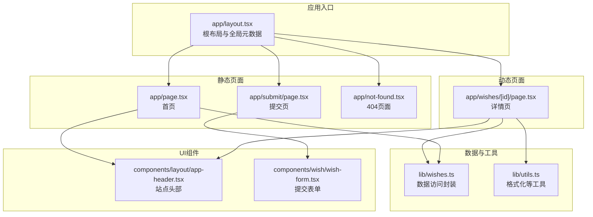
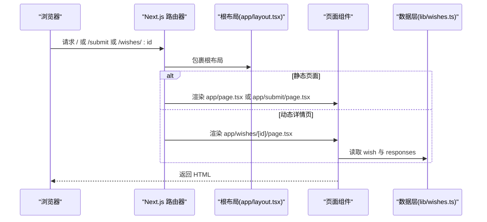
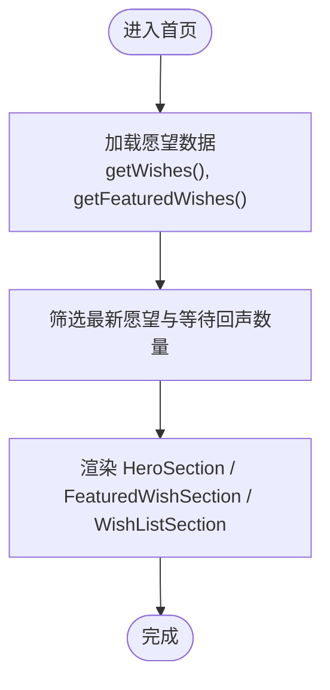
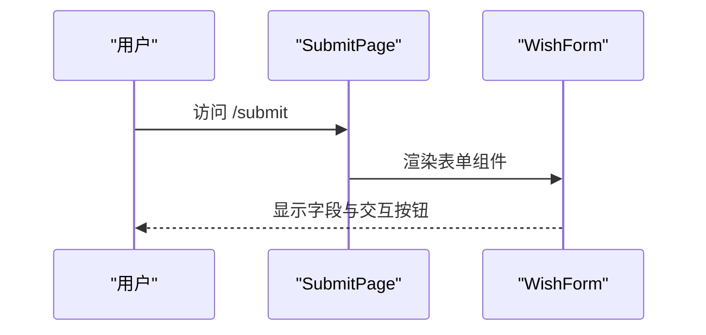
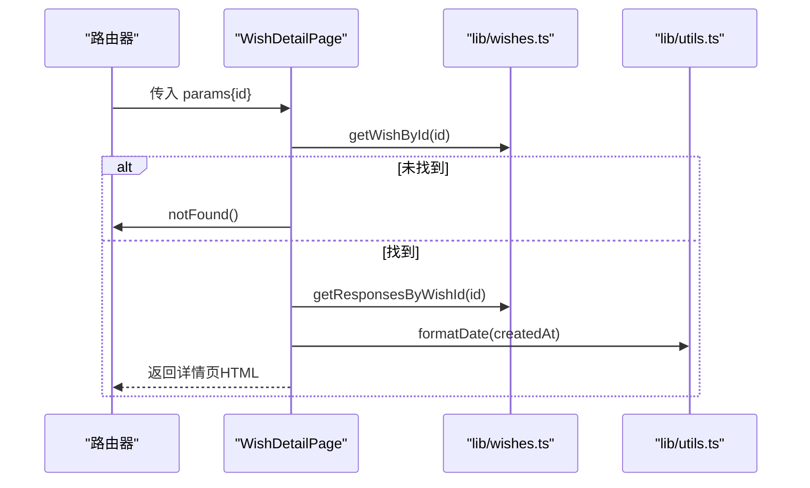
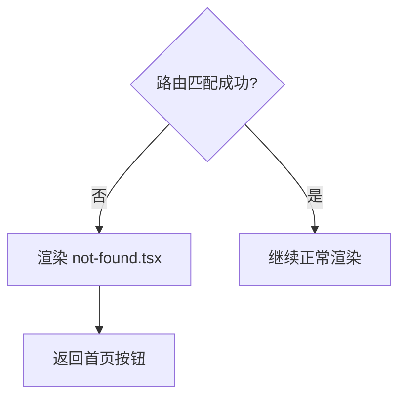
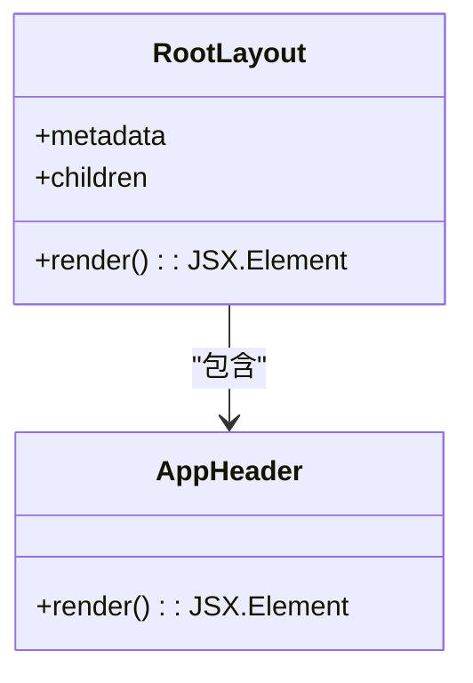
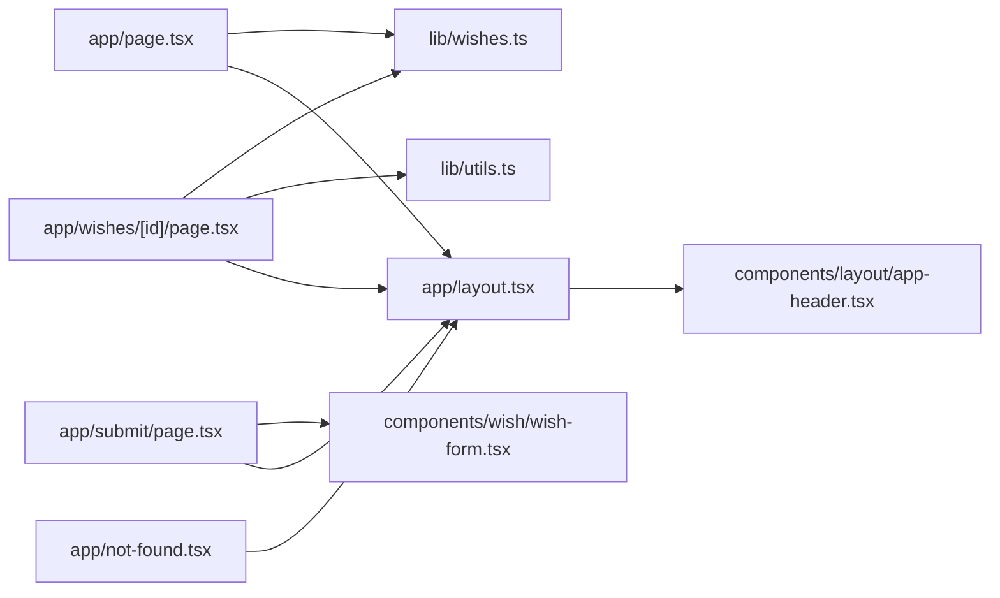

# 静态路由

<cite>
**本文引用的文件**
- [app/page.tsx](file://app/page.tsx)
- [app/submit/page.tsx](file://app/submit/page.tsx)
- [app/layout.tsx](file://app/layout.tsx)
- [app/not-found.tsx](file://app/not-found.tsx)
- [app/wishes/[id]/page.tsx](file://app/wishes/[id]/page.tsx)
- [lib/wishes.ts](file://lib/wishes.ts)
- [components/layout/app-header.tsx](file://components/layout/app-header.tsx)
- [components/wish/wish-form.tsx](file://components/wish/wish-form.tsx)
- [lib/utils.ts](file://lib/utils.ts)
- [next.config.ts](file://next.config.ts)
- [package.json](file://package.json)
</cite>

## 目录
1. [简介](#简介)
2. [项目结构](#项目结构)
3. [核心组件](#核心组件)
4. [架构总览](#架构总览)
5. [详细组件分析](#详细组件分析)
6. [依赖分析](#依赖分析)
7. [性能考虑](#性能考虑)
8. [故障排查指南](#故障排查指南)
9. [结论](#结论)
10. [附录](#附录)

## 简介
本文件系统性梳理该项目的静态路由与页面体系，重点覆盖以下方面：
- 路由约定与页面组织：基于 app 目录的路由规则、动态路由参数处理与静态生成策略。
- 页面组件结构：首页、提交页、详情页与 404 页面的职责与实现要点。
- 元数据管理：根布局的全局元数据与页面级元数据（含生成函数）的使用方式。
- 渲染模式：服务端渲染与静态生成的选择依据与构建产物特征。
- 页面间跳转与导航：基于 Next.js Link 组件的最佳实践与性能优化建议。
- 错误处理与自定义 404：notFound 触发与自定义 404 页面的实现。

## 项目结构
该项目采用 Next.js App Router 的目录结构，页面通过文件系统自动映射为路由：
- 根布局与全局样式：app/layout.tsx 提供根布局与全局元数据。
- 首页：app/page.tsx 对应根路径 "/"。
- 提交页：app/submit/page.tsx 对应 "/submit"。
- 动态详情页：app/wishes/[id]/page.tsx 对应 "/wishes/:id"。
- 自定义 404：app/not-found.tsx 用于捕获未匹配路由。
- 工具与数据访问层：lib/wishes.ts 封装数据获取；lib/utils.ts 提供通用工具。
- 导航组件：components/layout/app-header.tsx 提供站点头部与导航链接。
- 表单组件：components/wish/wish-form.tsx 实现提交表单交互（客户端组件）。

图表来源
- [app/layout.tsx:1-29](file://app/layout.tsx#L1-L29)
- [app/page.tsx:1-29](file://app/page.tsx#L1-L29)
- [app/submit/page.tsx:1-24](file://app/submit/page.tsx#L1-L24)
- [app/wishes/[id]/page.tsx:1-184](file://app/wishes/[id]/page.tsx#L1-L184)
- [app/not-found.tsx:1-24](file://app/not-found.tsx#L1-L24)
- [lib/wishes.ts:1-27](file://lib/wishes.ts#L1-L27)
- [lib/utils.ts:1-12](file://lib/utils.ts#L1-L12)
- [components/layout/app-header.tsx:1-64](file://components/layout/app-header.tsx#L1-L64)
- [components/wish/wish-form.tsx:1-264](file://components/wish/wish-form.tsx#L1-L264)

章节来源
- [app/layout.tsx:1-29](file://app/layout.tsx#L1-L29)
- [app/page.tsx:1-29](file://app/page.tsx#L1-L29)
- [app/submit/page.tsx:1-24](file://app/submit/page.tsx#L1-L24)
- [app/wishes/[id]/page.tsx:1-184](file://app/wishes/[id]/page.tsx#L1-L184)
- [app/not-found.tsx:1-24](file://app/not-found.tsx#L1-L24)
- [lib/wishes.ts:1-27](file://lib/wishes.ts#L1-L27)
- [lib/utils.ts:1-12](file://lib/utils.ts#L1-L12)
- [components/layout/app-header.tsx:1-64](file://components/layout/app-header.tsx#L1-L64)
- [components/wish/wish-form.tsx:1-264](file://components/wish/wish-form.tsx#L1-L264)

## 核心组件
- 根布局与全局元数据：app/layout.tsx 定义根 HTML 结构、全局样式与默认 Metadata，所有页面共享。
- 首页：app/page.tsx 展示精选与最新愿望列表，调用 lib/wishes.ts 获取数据。
- 提交页：app/submit/page.tsx 展示发布愿望的引导与表单占位，使用 wish-form 组件。
- 动态详情页：app/wishes/[id]/page.tsx 使用 generateStaticParams 静态生成详情页，结合 notFound 处理不存在的 ID。
- 自定义 404：app/not-found.tsx 提供未匹配路由的友好提示与返回链接。
- 数据访问层：lib/wishes.ts 提供 getWishes、getFeaturedWishes、getWishById、getResponsesByWishId 等方法。
- 工具函数：lib/utils.ts 提供 cn 与日期格式化等工具。
- 导航组件：components/layout/app-header.tsx 提供站点头部与导航链接，使用 Next.js Link。

章节来源
- [app/layout.tsx:1-29](file://app/layout.tsx#L1-L29)
- [app/page.tsx:1-29](file://app/page.tsx#L1-L29)
- [app/submit/page.tsx:1-24](file://app/submit/page.tsx#L1-L24)
- [app/wishes/[id]/page.tsx:1-184](file://app/wishes/[id]/page.tsx#L1-L184)
- [app/not-found.tsx:1-24](file://app/not-found.tsx#L1-L24)
- [lib/wishes.ts:1-27](file://lib/wishes.ts#L1-L27)
- [lib/utils.ts:1-12](file://lib/utils.ts#L1-L12)
- [components/layout/app-header.tsx:1-64](file://components/layout/app-header.tsx#L1-L64)

## 架构总览
静态路由系统遵循 Next.js App Router 的约定式路由与页面导出规范：
- 页面组件导出默认函数作为渲染入口。
- 根布局导出 metadata 作为全局 SEO 基础信息。
- 动态路由通过 [param] 文件夹名捕获路径参数，详情页通过 generateStaticParams 静态生成。
- 未匹配路由触发 app/not-found.tsx，实现自定义 404。

图表来源
- [app/layout.tsx:1-29](file://app/layout.tsx#L1-L29)
- [app/page.tsx:1-29](file://app/page.tsx#L1-L29)
- [app/submit/page.tsx:1-24](file://app/submit/page.tsx#L1-L24)
- [app/wishes/[id]/page.tsx:1-184](file://app/wishes/[id]/page.tsx#L1-L184)
- [lib/wishes.ts:1-27](file://lib/wishes.ts#L1-L27)

## 详细组件分析

### 首页 app/page.tsx
- 组件职责：展示首页内容，包括英雄区、等待回声统计、精选愿望与最新愿望列表。
- 数据来源：通过 lib/wishes.ts 获取数据，过滤出精选与最新愿望。
- 结构特点：使用语义化区块与样式类组织内容，保持可读性与一致性。
- 生命周期与渲染：作为静态页面，构建时生成 HTML；运行时按需进行客户端交互（如后续引入交互逻辑）。

图表来源
- [app/page.tsx:1-29](file://app/page.tsx#L1-L29)
- [lib/wishes.ts:1-27](file://lib/wishes.ts#L1-L27)

章节来源
- [app/page.tsx:1-29](file://app/page.tsx#L1-L29)
- [lib/wishes.ts:1-27](file://lib/wishes.ts#L1-L27)

### 提交页 app/submit/page.tsx
- 组件职责：提供发布愿望的引导文案与表单占位，强调“先整理，再发布”的流程。
- 交互特性：表单为客户端组件（use client），便于本地状态与交互。
- 组件依赖：使用 wish-form 组件承载表单字段与预设值。

图表来源
- [app/submit/page.tsx:1-24](file://app/submit/page.tsx#L1-L24)
- [components/wish/wish-form.tsx:1-264](file://components/wish/wish-form.tsx#L1-L264)

章节来源
- [app/submit/page.tsx:1-24](file://app/submit/page.tsx#L1-L24)
- [components/wish/wish-form.tsx:1-264](file://components/wish/wish-form.tsx#L1-L264)

### 动态详情页 app/wishes/[id]/page.tsx
- 动态路由：通过 [id] 捕获路径参数，支持多条静态详情页生成。
- 静态生成：generateStaticParams 返回所有 wish 的 id，构建期生成对应页面。
- 错误处理：当 wish 不存在时调用 notFound，触发 404。
- 数据访问：通过 lib/wishes.ts 获取 wish 与 responses，并使用 lib/utils.ts 格式化时间。

图表来源
- [app/wishes/[id]/page.tsx:1-184](file://app/wishes/[id]/page.tsx#L1-L184)
- [lib/wishes.ts:1-27](file://lib/wishes.ts#L1-L27)
- [lib/utils.ts:1-12](file://lib/utils.ts#L1-L12)

章节来源
- [app/wishes/[id]/page.tsx:1-184](file://app/wishes/[id]/page.tsx#L1-L184)
- [lib/wishes.ts:1-27](file://lib/wishes.ts#L1-L27)
- [lib/utils.ts:1-12](file://lib/utils.ts#L1-L12)

### 自定义 404 页面 app/not-found.tsx
- 组件职责：在路由未匹配时显示友好提示与返回链接。
- 设计要点：提供清晰的文案与引导，提升用户体验。

图表来源
- [app/not-found.tsx:1-24](file://app/not-found.tsx#L1-L24)

章节来源
- [app/not-found.tsx:1-24](file://app/not-found.tsx#L1-L24)

### 根布局与全局元数据 app/layout.tsx
- 全局元数据：通过 metadata 导出 title 与 description，作为所有页面的默认 SEO 基础。
- 结构设计：包裹 html、body 与主容器，注入站点头部组件。
- 默认布局继承：子页面无需重复声明全局样式与基础结构。

图表来源
- [app/layout.tsx:1-29](file://app/layout.tsx#L1-L29)
- [components/layout/app-header.tsx:1-64](file://components/layout/app-header.tsx#L1-L64)

章节来源
- [app/layout.tsx:1-29](file://app/layout.tsx#L1-L29)
- [components/layout/app-header.tsx:1-64](file://components/layout/app-header.tsx#L1-L64)

### 页面级元数据与 SEO 管理
- 全局元数据：根布局导出 metadata，作为默认标题与描述。
- 页面级元数据：可通过页面导出 generateMetadata 函数动态生成页面特定的 title、description、openGraph 等（若扩展页面可按需添加）。
- SEO 最佳实践：确保每页 title 与 description 与页面内容一致；为详情页提供 openGraph 与 twitter 元数据以优化分享效果。

章节来源
- [app/layout.tsx:8-11](file://app/layout.tsx#L8-L11)
- [app/wishes/[id]/page.tsx:19-L38](file://app/wishes/[id]/page.tsx#L19-L38)

### 页面间跳转与导航最佳实践
- 使用 Next.js Link 组件：在 app-header.tsx 中使用 Link 进行内部导航，避免整页刷新。
- 跳转到提交页：在详情页与首页中提供跳转至 /submit 的按钮，保持用户路径连贯。
- 性能优化建议：
  - 利用 Link 的预取能力，减少首屏后的点击延迟。
  - 对频繁访问的页面（如首页、详情页）优先使用静态生成。
  - 避免在导航中引入不必要的客户端状态与重渲染。

章节来源
- [components/layout/app-header.tsx:1-64](file://components/layout/app-header.tsx#L1-L64)
- [app/wishes/[id]/page.tsx:117-L143](file://app/wishes/[id]/page.tsx#L117-L143)

### 渲染模式与静态生成
- 静态生成：首页与提交页为静态页面，构建时生成 HTML，适合内容稳定、无需实时数据的场景。
- 动态详情页：通过 generateStaticParams 静态生成所有 wish 的详情页，提升性能与 SEO。
- 服务端渲染：详情页使用异步读取数据的方式，适合需要根据 ID 动态获取内容的场景。
- 构建产物特征：构建日志与缓存头信息表明使用了静态生成与缓存标签。

章节来源
- [app/page.tsx:1-29](file://app/page.tsx#L1-L29)
- [app/submit/page.tsx:1-24](file://app/submit/page.tsx#L1-L24)
- [app/wishes/[id]/page.tsx:13-L17](file://app/wishes/[id]/page.tsx#L13-L17)
- [package.json:1-29](file://package.json#L1-L29)

## 依赖分析
- 组件耦合关系：
  - 页面组件依赖数据访问层（lib/wishes.ts）与工具函数（lib/utils.ts）。
  - 根布局统一注入头部组件（components/layout/app-header.tsx）。
  - 提交页依赖 wish-form 组件。
- 外部依赖：
  - Next.js 提供路由、元数据与构建能力。
  - React 生态组件库与样式工具（Tailwind CSS）。

图表来源
- [app/page.tsx:1-29](file://app/page.tsx#L1-L29)
- [app/submit/page.tsx:1-24](file://app/submit/page.tsx#L1-L24)
- [app/wishes/[id]/page.tsx:1-184](file://app/wishes/[id]/page.tsx#L1-L184)
- [app/not-found.tsx:1-24](file://app/not-found.tsx#L1-L24)
- [lib/wishes.ts:1-27](file://lib/wishes.ts#L1-L27)
- [lib/utils.ts:1-12](file://lib/utils.ts#L1-L12)
- [components/layout/app-header.tsx:1-64](file://components/layout/app-header.tsx#L1-L64)

章节来源
- [app/page.tsx:1-29](file://app/page.tsx#L1-L29)
- [app/submit/page.tsx:1-24](file://app/submit/page.tsx#L1-L24)
- [app/wishes/[id]/page.tsx:1-184](file://app/wishes/[id]/page.tsx#L1-L184)
- [app/not-found.tsx:1-24](file://app/not-found.tsx#L1-L24)
- [lib/wishes.ts:1-27](file://lib/wishes.ts#L1-L27)
- [lib/utils.ts:1-12](file://lib/utils.ts#L1-L12)
- [components/layout/app-header.tsx:1-64](file://components/layout/app-header.tsx#L1-L64)

## 性能考虑
- 静态生成优先：首页与详情页采用静态生成，降低服务器压力并提升首屏速度。
- 数据访问封装：通过 lib/wishes.ts 将数据源与组件解耦，便于替换为真实后端接口而不影响页面。
- 组件拆分：将导航、表单、卡片等拆分为独立组件，提升复用性与可维护性。
- 构建配置：next.config.ts 设置严格模式与自定义 distDir，有助于生产环境的稳定性与可移植性。

章节来源
- [next.config.ts:1-9](file://next.config.ts#L1-L9)
- [lib/wishes.ts:1-27](file://lib/wishes.ts#L1-L27)

## 故障排查指南
- 404 页面未显示：
  - 确认路由是否正确匹配；对于动态路由，检查 [id] 是否有效。
  - 在详情页中，当 wish 不存在时必须调用 notFound，否则会渲染空内容。
- 元数据异常：
  - 若页面未显示预期标题或描述，请检查根布局的 metadata 导出与页面级 generateMetadata（如已扩展）。
- 导航失效：
  - 确保使用 Next.js Link 组件进行内部跳转；避免直接使用 a 标签导致整页刷新。
- 构建失败或产物缺失：
  - 检查 generateStaticParams 返回的参数是否与实际数据一致；确认构建脚本与 distDir 配置。

章节来源
- [app/wishes/[id]/page.tsx:27-L29](file://app/wishes/[id]/page.tsx#L27-L29)
- [app/layout.tsx:8-11](file://app/layout.tsx#L8-L11)
- [components/layout/app-header.tsx:1-64](file://components/layout/app-header.tsx#L1-L64)
- [package.json:5-9](file://package.json#L5-L9)

## 结论
本项目通过清晰的目录结构与约定式路由，实现了首页、提交页、动态详情页与自定义 404 的完整静态路由体系。根布局统一提供元数据与基础结构，页面组件专注于业务内容展示。借助 generateStaticParams 与静态生成，系统在性能与 SEO 上具备良好表现。未来可在页面级扩展 generateMetadata 以进一步优化 SEO，并逐步替换 lib/wishes.ts 的模拟数据为真实后端接口。

## 附录
- 关键实现参考路径：
  - 首页渲染与数据过滤：[app/page.tsx:6-28](file://app/page.tsx#L6-L28)
  - 提交页结构与表单占位：[app/submit/page.tsx:3-23](file://app/submit/page.tsx#L3-L23)
  - 动态详情页静态生成与 notFound：[app/wishes/[id]/page.tsx:13-L29](file://app/wishes/[id]/page.tsx#L13-L29)
  - 根布局与全局元数据：[app/layout.tsx:8-11](file://app/layout.tsx#L8-L11)
  - 自定义 404 页面：[app/not-found.tsx:3-22](file://app/not-found.tsx#L3-L22)
  - 数据访问封装：[lib/wishes.ts:5-17](file://lib/wishes.ts#L5-L17)
  - 工具函数：[lib/utils.ts:5-10](file://lib/utils.ts#L5-L10)
  - 导航组件：[components/layout/app-header.tsx:22-62](file://components/layout/app-header.tsx#L22-L62)
  - 构建配置：[next.config.ts:3-6](file://next.config.ts#L3-L6)