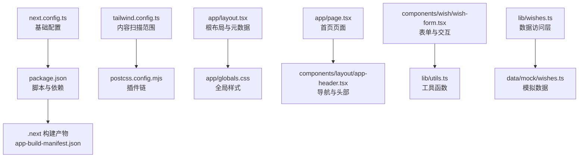
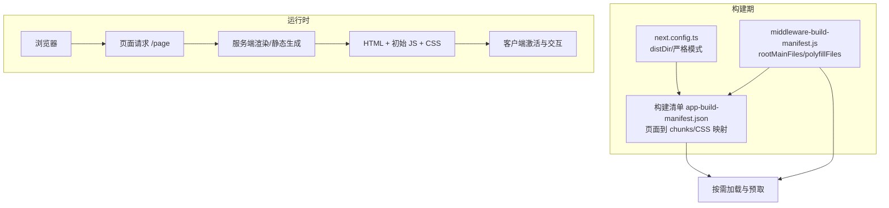
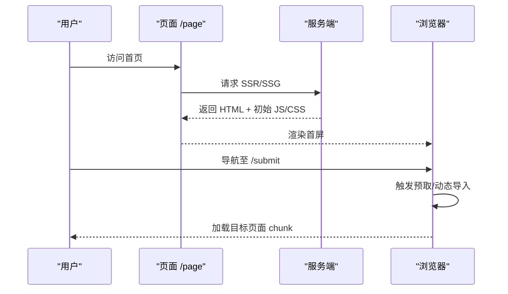
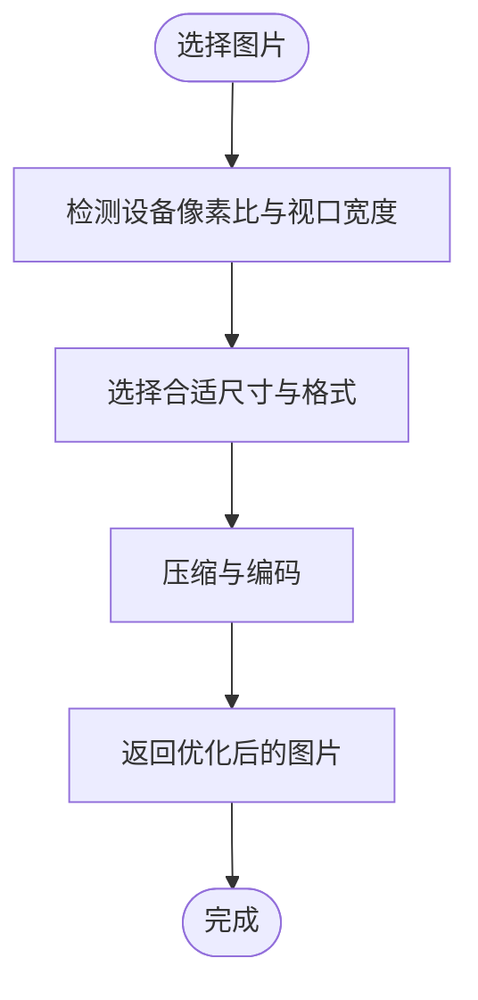
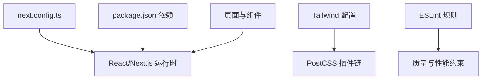

# 性能优化

<cite>
**本文引用的文件**
- [next.config.ts](file://next.config.ts)
- [package.json](file://package.json)
- [tailwind.config.ts](file://tailwind.config.ts)
- [postcss.config.mjs](file://postcss.config.mjs)
- [app/layout.tsx](file://app/layout.tsx)
- [app/globals.css](file://app/globals.css)
- [app/page.tsx](file://app/page.tsx)
- [components/layout/app-header.tsx](file://components/layout/app-header.tsx)
- [components/wish/wish-form.tsx](file://components/wish/wish-form.tsx)
- [lib/utils.ts](file://lib/utils.ts)
- [lib/wishes.ts](file://lib/wishes.ts)
- [data/mock/wishes.ts](file://data/mock/wishes.ts)
- [.next-stale-20260422-142725/app-build-manifest.json](file://.next-stale-20260422-142725/app-build-manifest.json)
- [.next-stale-20260422-142725/server/middleware-build-manifest.js](file://.next-stale-20260422-142725/server/middleware-build-manifest.js)
- [.next-stale-20260422-142725/images-manifest.json](file://.next-stale-20260422-142725/images-manifest.json)
- [eslint.config.mjs](file://eslint.config.mjs)
</cite>

## 目录
1. [引言](#引言)
2. [项目结构](#项目结构)
3. [核心组件](#核心组件)
4. [架构总览](#架构总览)
5. [详细组件分析](#详细组件分析)
6. [依赖分析](#依赖分析)
7. [性能考量](#性能考量)
8. [故障排查指南](#故障排查指南)
9. [结论](#结论)
10. [附录](#附录)

## 引言
本指南面向部署后的 Next.js 应用，聚焦于生产性能优化实践，涵盖以下方面：
- Next.js 内置性能特性：自动代码分割、懒加载与预取策略
- 静态资源优化：图片压缩、字体优化、CSS 提取与按需加载
- Bundle 大小分析与优化步骤
- 缓存策略：浏览器缓存、CDN 缓存与边缘缓存
- Lighthouse 性能评分提升实战技巧
- 运行时性能指标监控与分析
- 移动端与低带宽环境优化策略

本指南基于仓库现有配置与源码进行分析，结合 Next.js 生产最佳实践，给出可落地的优化建议。

## 项目结构
该项目采用 App Router 结构，页面级组件位于 app 目录，全局样式通过 Tailwind CSS 与 PostCSS 构建，构建产物位于 .next 或自定义 distDir（由脚本设置）。Tailwind 的 content 范围覆盖 app 与 components，确保按需生成样式。

图表来源
- [next.config.ts:1-9](file://next.config.ts#L1-L9)
- [package.json:1-29](file://package.json#L1-L29)
- [tailwind.config.ts:1-55](file://tailwind.config.ts#L1-L55)
- [postcss.config.mjs:1-9](file://postcss.config.mjs#L1-L9)
- [app/layout.tsx:1-29](file://app/layout.tsx#L1-L29)
- [app/globals.css:1-67](file://app/globals.css#L1-L67)
- [app/page.tsx:1-29](file://app/page.tsx#L1-L29)
- [components/layout/app-header.tsx:1-64](file://components/layout/app-header.tsx#L1-L64)
- [components/wish/wish-form.tsx:1-264](file://components/wish/wish-form.tsx#L1-L264)
- [lib/utils.ts:1-12](file://lib/utils.ts#L1-L12)
- [lib/wishes.ts:1-27](file://lib/wishes.ts#L1-L27)
- [data/mock/wishes.ts:1-210](file://data/mock/wishes.ts#L1-L210)

章节来源
- [next.config.ts:1-9](file://next.config.ts#L1-L9)
- [package.json:1-29](file://package.json#L1-L29)
- [tailwind.config.ts:1-55](file://tailwind.config.ts#L1-L55)
- [postcss.config.mjs:1-9](file://postcss.config.mjs#L1-L9)
- [app/layout.tsx:1-29](file://app/layout.tsx#L1-L29)
- [app/globals.css:1-67](file://app/globals.css#L1-L67)
- [app/page.tsx:1-29](file://app/page.tsx#L1-L29)
- [components/layout/app-header.tsx:1-64](file://components/layout/app-header.tsx#L1-L64)
- [components/wish/wish-form.tsx:1-264](file://components/wish/wish-form.tsx#L1-L264)
- [lib/utils.ts:1-12](file://lib/utils.ts#L1-L12)
- [lib/wishes.ts:1-27](file://lib/wishes.ts#L1-L27)
- [data/mock/wishes.ts:1-210](file://data/mock/wishes.ts#L1-L210)

## 核心组件
- 根布局与元数据：根布局负责语言、主题色与全局样式引入，同时提供站点元信息，有助于 SEO 与首屏渲染。
- 页面组件：首页聚合多个业务区块，使用本地数据访问层，减少网络请求。
- 组件与工具：UI 组件以 Tailwind 类名组织，工具函数提供类名拼接等通用逻辑。
- 样式系统：Tailwind content 覆盖 app 与 components，配合 PostCSS 自动注入与前缀处理，实现按需 CSS 与兼容性增强。

章节来源
- [app/layout.tsx:1-29](file://app/layout.tsx#L1-L29)
- [app/page.tsx:1-29](file://app/page.tsx#L1-L29)
- [lib/utils.ts:1-12](file://lib/utils.ts#L1-L12)
- [tailwind.config.ts:1-55](file://tailwind.config.ts#L1-L55)
- [postcss.config.mjs:1-9](file://postcss.config.mjs#L1-L9)

## 架构总览
下图展示页面构建与资源加载的关键路径，体现 Next.js 的自动代码分割与构建清单映射关系。

图表来源
- [next.config.ts:1-9](file://next.config.ts#L1-L9)
- [.next-stale-20260422-142725/app-build-manifest.json:1-35](file://.next-stale-20260422-142725/app-build-manifest.json#L1-L35)
- [.next-stale-20260422-142725/server/middleware-build-manifest.js:1-33](file://.next-stale-20260422-142725/server/middleware-build-manifest.js#L1-L33)

## 详细组件分析

### 自动代码分割与懒加载
- 页面级代码分割：构建清单显示每个页面对应独立的 JS chunk 与 CSS 文件，确保按需加载。
- 组件级懒加载：推荐对非首屏使用的重型组件采用动态导入与 Suspense 边界包裹，降低初始包体积。
- 预取策略：在用户可能导航的方向上使用预取（如链接悬停或即将出现时），提升二次导航性能。

图表来源
- [.next-stale-20260422-142725/app-build-manifest.json:14-18](file://.next-stale-20260422-142725/app-build-manifest.json#L14-L18)
- [.next-stale-20260422-142725/server/middleware-build-manifest.js:8-12](file://.next-stale-20260422-142725/server/middleware-build-manifest.js#L8-L12)

章节来源
- [.next-stale-20260422-142725/app-build-manifest.json:1-35](file://.next-stale-20260422-142725/app-build-manifest.json#L1-L35)
- [.next-stale-20260422-142725/server/middleware-build-manifest.js:1-33](file://.next-stale-20260422-142725/server/middleware-build-manifest.js#L1-L33)

### 静态资源优化

#### 图片优化
- 使用 Next/image 并启用默认 loader，自动根据设备像素比生成多尺寸资源，减少带宽浪费。
- 合理设置 formats 与 sizes，优先使用现代格式（如 WebP）。
- 控制最大响应体大小，避免过大图片影响 TTFB 与 CLS。

图表来源
- [.next-stale-20260422-142725/images-manifest.json:1-58](file://.next-stale-20260422-142725/images-manifest.json#L1-L58)

章节来源
- [.next-stale-20260422-142725/images-manifest.json:1-58](file://.next-stale-20260422-142725/images-manifest.json#L1-L58)

#### 字体优化
- 使用 next/font 管理字体加载，避免 FOIT/FOUT，提升可读性与视觉稳定性。
- 在 Tailwind 中声明字体族，确保按需生成类名，避免未使用字体被打包。

章节来源
- [tailwind.config.ts:22-38](file://tailwind.config.ts#L22-L38)
- [.next-stale-20260422-142725/server/next-font-manifest.js:1-1](file://.next-stale-20260422-142725/server/next-font-manifest.js#L1-L1)

#### CSS 提取与按需加载
- Tailwind 通过 PostCSS 注入基础、组件与实用类，结合 content 扫描实现按需 CSS。
- 全局样式集中管理，避免重复与冗余规则；页面级样式通过独立 chunk 输出，减少首屏 CSS 体积。

章节来源
- [postcss.config.mjs:1-9](file://postcss.config.mjs#L1-L9)
- [app/globals.css:1-67](file://app/globals.css#L1-L67)
- [tailwind.config.ts:4-9](file://tailwind.config.ts#L4-L9)

### Bundle 大小分析与优化步骤
- 分析构建清单：查看页面对应的 chunks 与 CSS 数量，识别超大模块。
- 使用分析工具：在构建脚本中加入分析参数，定位体积占比高的依赖或页面。
- 优化策略：
  - 将第三方库拆分为独立 chunk，利用浏览器缓存复用
  - 对重型库进行动态导入与条件加载
  - 移除未使用代码与样式，保持 content 范围精准
  - 启用 Tree Shaking 与最小化

章节来源
- [.next-stale-20260422-142725/app-build-manifest.json:1-35](file://.next-stale-20260422-142725/app-build-manifest.json#L1-L35)

### 缓存策略配置
- 浏览器缓存：静态资源通过构建 ID 命名，结合长缓存策略与 ETag/Last-Modified 实现智能刷新。
- CDN 缓存：为不同资源类型设置差异化 TTL（如 JS/CSS 长缓存，HTML 短缓存）。
- 边缘缓存：在边缘节点缓存热点页面与静态资源，降低源站压力。

章节来源
- [.next-stale-20260422-142725/app-build-manifest.json:14-18](file://.next-stale-20260422-142725/app-build-manifest.json#L14-L18)

### Lighthouse 性能评分提升实战
- 减少主线程阻塞：将非关键 JS 异步加载，推迟非关键初始化
- 优化图片与字体：使用合适的尺寸与格式，启用懒加载
- 改善 CLS：为图片与 iframe 设置尺寸，避免布局偏移
- 提升 FID/LCP：减少首屏 JS 体积，优先加载关键资源

章节来源
- [eslint.config.mjs:1-18](file://eslint.config.mjs#L1-L18)

### 运行时性能指标监控与分析
- 指标采集：记录 FCP/LCP/FID/CLS/TBT 等 Core Web Vitals
- 工具集成：在生产环境接入性能监控 SDK，收集用户端性能数据
- 分析流程：对比不同版本指标变化，定位回归与优化空间

章节来源
- [eslint.config.mjs:1-18](file://eslint.config.mjs#L1-L18)

### 移动端与低带宽环境优化
- 资源优先级：为移动端设置更严格的缓存与压缩策略
- 图片策略：优先使用 WebP，按设备密度与视口宽度生成尺寸
- 交互优化：减少首屏 JS，使用骨架屏与占位符提升感知性能

章节来源
- [.next-stale-20260422-142725/images-manifest.json:1-58](file://.next-stale-20260422-142725/images-manifest.json#L1-L58)

## 依赖分析
- 构建与打包：Next.js 15、React 19、Tailwind CSS、PostCSS
- 开发与质量：ESLint（含 core-web-vitals 规则）
- 运行时：通过脚本设置 distDir，便于自定义构建目录

图表来源
- [next.config.ts:1-9](file://next.config.ts#L1-L9)
- [package.json:11-27](file://package.json#L11-L27)
- [tailwind.config.ts:1-55](file://tailwind.config.ts#L1-L55)
- [postcss.config.mjs:1-9](file://postcss.config.mjs#L1-L9)
- [eslint.config.mjs:1-18](file://eslint.config.mjs#L1-L18)

章节来源
- [package.json:1-29](file://package.json#L1-L29)
- [next.config.ts:1-9](file://next.config.ts#L1-L9)
- [tailwind.config.ts:1-55](file://tailwind.config.ts#L1-L55)
- [postcss.config.mjs:1-9](file://postcss.config.mjs#L1-L9)
- [eslint.config.mjs:1-18](file://eslint.config.mjs#L1-L18)

## 性能考量
- 代码分割：页面级 chunk 与 CSS 分离，减少首屏负载
- 样式按需：Tailwind content 范围精准，避免未使用样式被打包
- 字体与图片：使用 next/font 与 Next/image，结合现代格式与尺寸策略
- 构建目录：通过脚本设置 distDir，便于部署与缓存管理

章节来源
- [.next-stale-20260422-142725/app-build-manifest.json:1-35](file://.next-stale-20260422-142725/app-build-manifest.json#L1-L35)
- [tailwind.config.ts:4-9](file://tailwind.config.ts#L4-L9)
- [app/globals.css:1-67](file://app/globals.css#L1-L67)
- [package.json:5-10](file://package.json#L5-L10)

## 故障排查指南
- 构建异常：检查 next.config.ts 与 package.json 脚本，确认 distDir 设置与依赖版本匹配
- 样式缺失：核对 Tailwind content 范围与 PostCSS 插件链，确保类名正确生成
- 图片加载问题：验证 images-manifest 配置与设备尺寸列表，确认格式与尺寸策略
- 性能退化：使用构建清单分析页面 chunk 与 CSS，定位超大模块并进行拆分或替换

章节来源
- [next.config.ts:1-9](file://next.config.ts#L1-L9)
- [package.json:1-29](file://package.json#L1-L29)
- [tailwind.config.ts:1-55](file://tailwind.config.ts#L1-L55)
- [postcss.config.mjs:1-9](file://postcss.config.mjs#L1-L9)
- [.next-stale-20260422-142725/images-manifest.json:1-58](file://.next-stale-20260422-142725/images-manifest.json#L1-L58)

## 结论
本指南基于仓库现有配置与构建清单，总结了 Next.js 部署后的性能优化要点：以自动代码分割为基础，结合图片与字体优化、CSS 提取与按需加载、缓存策略与 Lighthouse 实战技巧，辅以运行时监控与移动端/低带宽优化，形成一套可执行的性能优化体系。建议在持续集成中加入性能基线与回归检测，确保上线质量。

## 附录
- 关键文件速览
  - 构建配置：[next.config.ts:1-9](file://next.config.ts#L1-L9)
  - 依赖与脚本：[package.json:1-29](file://package.json#L1-L29)
  - 样式与构建：[tailwind.config.ts:1-55](file://tailwind.config.ts#L1-L55)、[postcss.config.mjs:1-9](file://postcss.config.mjs#L1-L9)
  - 根布局与样式：[app/layout.tsx:1-29](file://app/layout.tsx#L1-L29)、[app/globals.css:1-67](file://app/globals.css#L1-L67)
  - 页面与组件：[app/page.tsx:1-29](file://app/page.tsx#L1-L29)、[components/layout/app-header.tsx:1-64](file://components/layout/app-header.tsx#L1-L64)、[components/wish/wish-form.tsx:1-264](file://components/wish/wish-form.tsx#L1-L264)
  - 数据与工具：[lib/utils.ts:1-12](file://lib/utils.ts#L1-L12)、[lib/wishes.ts:1-27](file://lib/wishes.ts#L1-L27)、[data/mock/wishes.ts:1-210](file://data/mock/wishes.ts#L1-L210)
  - 构建清单与图片配置：[app-build-manifest.json:1-35](file://.next-stale-20260422-142725/app-build-manifest.json#L1-L35)、[middleware-build-manifest.js:1-33](file://.next-stale-20260422-142725/server/middleware-build-manifest.js#L1-L33)、[images-manifest.json:1-58](file://.next-stale-20260422-142725/images-manifest.json#L1-L58)
  - 质量规则：[eslint.config.mjs:1-18](file://eslint.config.mjs#L1-L18)