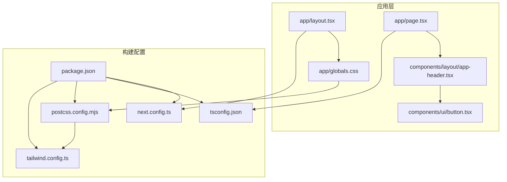
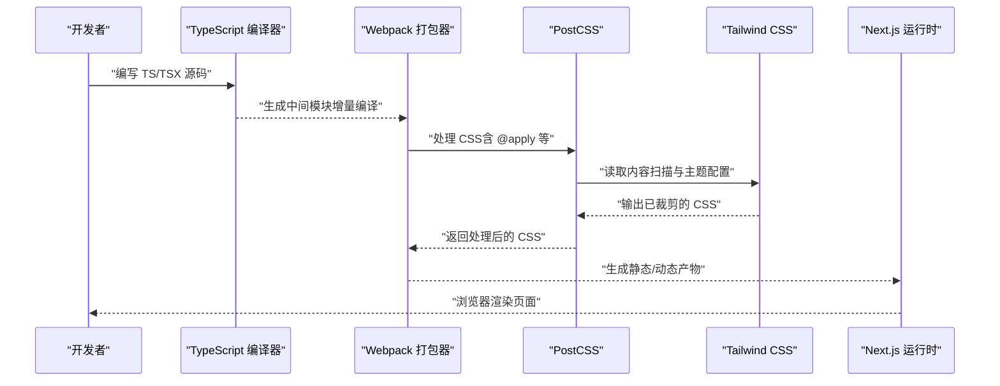
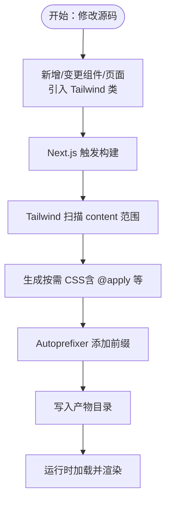
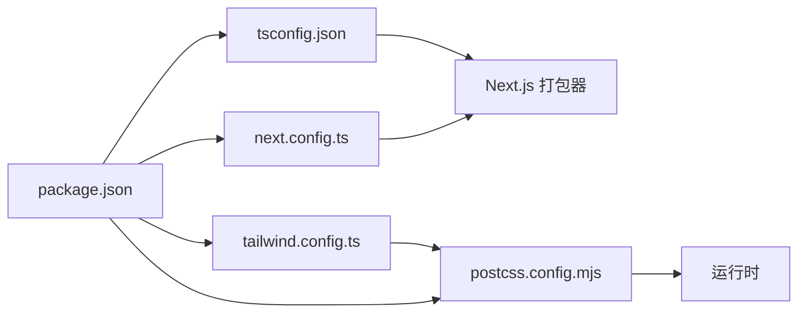

# 构建配置

<cite>
**本文引用的文件**
- [next.config.ts](file://next.config.ts)
- [tsconfig.json](file://tsconfig.json)
- [postcss.config.mjs](file://postcss.config.mjs)
- [tailwind.config.ts](file://tailwind.config.ts)
- [package.json](file://package.json)
- [app/layout.tsx](file://app/layout.tsx)
- [app/globals.css](file://app/globals.css)
- [components/ui/button.tsx](file://components/ui/button.tsx)
- [components/layout/app-header.tsx](file://components/layout/app-header.tsx)
- [app/page.tsx](file://app/page.tsx)
- [next-env.d.ts](file://next-env.d.ts)
</cite>

## 目录
1. [简介](#简介)
2. [项目结构](#项目结构)
3. [核心组件](#核心组件)
4. [架构总览](#架构总览)
5. [详细组件分析](#详细组件分析)
6. [依赖分析](#依赖分析)
7. [性能考量](#性能考量)
8. [故障排查指南](#故障排查指南)
9. [结论](#结论)
10. [附录](#附录)

## 简介
本文件系统性梳理该 Next.js 项目的构建配置与相关工程化实践，重点覆盖以下方面：
- Next.js 核心构建配置项：reactStrictMode、distDir 的作用与最佳实践
- TypeScript 编译配置优化：编译目标、模块解析、路径映射与增量编译
- PostCSS 与 Tailwind CSS 集成：插件链路、内容扫描与自定义 CSS 流程
- 构建性能优化：代码分割、Tree Shaking、Bundle 分析与缓存策略
- 开发与生产差异化配置：脚本与环境变量联动
- 构建缓存与增量构建：提升开发效率的实操建议

## 项目结构
该项目采用 App Router 结构，样式通过 Tailwind CSS 与 PostCSS 处理，TypeScript 提供类型安全与增量编译能力，Next.js 负责打包与运行时优化。

图表来源
- [next.config.ts:1-9](file://next.config.ts#L1-L9)
- [tsconfig.json:1-29](file://tsconfig.json#L1-L29)
- [postcss.config.mjs:1-9](file://postcss.config.mjs#L1-L9)
- [tailwind.config.ts:1-55](file://tailwind.config.ts#L1-L55)
- [package.json:1-29](file://package.json#L1-L29)
- [app/layout.tsx:1-29](file://app/layout.tsx#L1-L29)
- [app/globals.css:1-67](file://app/globals.css#L1-L67)
- [components/layout/app-header.tsx:1-64](file://components/layout/app-header.tsx#L1-L64)
- [components/ui/button.tsx:1-75](file://components/ui/button.tsx#L1-L75)
- [app/page.tsx:1-29](file://app/page.tsx#L1-L29)

章节来源
- [next.config.ts:1-9](file://next.config.ts#L1-L9)
- [tsconfig.json:1-29](file://tsconfig.json#L1-L29)
- [postcss.config.mjs:1-9](file://postcss.config.mjs#L1-L9)
- [tailwind.config.ts:1-55](file://tailwind.config.ts#L1-L55)
- [package.json:1-29](file://package.json#L1-L29)

## 核心组件
- Next.js 构建配置（next.config.ts）
  - reactStrictMode：启用 React 严格模式，帮助捕获潜在问题
  - distDir：产物目录，默认为 .next；可通过环境变量覆盖
- TypeScript 编译配置（tsconfig.json）
  - 编译目标与模块：ES2017、esnext
  - 模块解析：bundler（面向打包器）
  - 路径映射：@/* → ./*
  - 增量编译：incremental 启用
  - 插件：内置 next 插件
- PostCSS 与 Tailwind CSS（postcss.config.mjs、tailwind.config.ts）
  - PostCSS 插件链：tailwindcss、autoprefixer
  - Tailwind 内容扫描：app、components、data、lib 下的 JS/TS/TSX/MDX
  - 主题扩展：颜色、字体、阴影、背景图等
- 包管理与脚本（package.json）
  - 开发：next dev
  - 构建：NEXT_DIST_DIR=.next-build next build
  - 启动：NEXT_DIST_DIR=.next-build next start

章节来源
- [next.config.ts:3-6](file://next.config.ts#L3-L6)
- [tsconfig.json:3-23](file://tsconfig.json#L3-L23)
- [postcss.config.mjs:1-9](file://postcss.config.mjs#L1-L9)
- [tailwind.config.ts:3-51](file://tailwind.config.ts#L3-L51)
- [package.json:5-10](file://package.json#L5-L10)

## 架构总览
下图展示了从源码到产物的关键链路：TypeScript 编译 → Webpack 打包 → PostCSS/Tailwind 处理 → 运行时渲染。

图表来源
- [tsconfig.json:15-23](file://tsconfig.json#L15-L23)
- [postcss.config.mjs:1-9](file://postcss.config.mjs#L1-L9)
- [tailwind.config.ts:4-51](file://tailwind.config.ts#L4-L51)
- [next.config.ts:3-6](file://next.config.ts#L3-L6)

## 详细组件分析

### Next.js 构建配置（next.config.ts）
- reactStrictMode
  - 作用：在开发模式下对组件进行额外检查，提前暴露潜在问题（如副作用、不安全的生命周期等）
  - 最佳实践：保持开启；仅在迁移或定位问题时临时关闭
- distDir
  - 作用：指定构建产物目录，便于隔离不同环境或版本
  - 最佳实践：通过环境变量控制目录名，避免污染工作区；生产构建可使用独立目录
- 其他建议
  - 可结合 experimental 或 future 选项按需启用实验特性
  - 对于大型项目，可考虑拆分构建阶段或启用并行构建

章节来源
- [next.config.ts:3-6](file://next.config.ts#L3-L6)
- [package.json:7-8](file://package.json#L7-L8)

### TypeScript 编译配置（tsconfig.json）
- 编译目标与模块
  - target: ES2017，满足现代浏览器生态
  - module: esnext，配合 bundler 解析器获得更优的 Tree Shaking
- 模块解析与路径映射
  - moduleResolution: bundler，面向打包器的解析策略
  - paths: "@/*" → ".*"，统一相对路径写法，提升可维护性
- 增量编译与类型检查
  - incremental: 启用增量编译，显著缩短二次编译时间
  - isolatedModules: 与 bundler 协同，确保单文件编译稳定性
  - strict: 启用严格模式，减少隐式类型错误
- 插件与入口范围
  - plugins: 使用内置 next 插件，增强 App Router 类型支持
  - include/exclude: 明确包含与排除范围，避免无关文件参与编译

章节来源
- [tsconfig.json:3-26](file://tsconfig.json#L3-L26)
- [next-env.d.ts:1-7](file://next-env.d.ts#L1-L7)

### PostCSS 与 Tailwind CSS 集成（postcss.config.mjs、tailwind.config.ts）
- PostCSS 插件链
  - tailwindcss：生成与裁剪原子类
  - autoprefixer：自动添加厂商前缀
- Tailwind 内容扫描
  - content 覆盖 app、components、data、lib 下的 JS/TS/TSX/MDX，确保按需生成 CSS
- 主题扩展
  - colors、fontFamily、boxShadow、backgroundImage 等扩展，统一设计语言
- 自定义 CSS 流程
  - 在 app/globals.css 中引入 @tailwind base/components/utilities，并在需要时使用 @layer 组织组件层样式
  - 通过 Tailwind 配置与 PostCSS 插件链实现“先按需生成，再自动补全前缀”的流水线

图表来源
- [tailwind.config.ts:4-51](file://tailwind.config.ts#L4-L51)
- [postcss.config.mjs:1-9](file://postcss.config.mjs#L1-L9)
- [app/globals.css:1-67](file://app/globals.css#L1-L67)

章节来源
- [postcss.config.mjs:1-9](file://postcss.config.mjs#L1-L9)
- [tailwind.config.ts:3-51](file://tailwind.config.ts#L3-L51)
- [app/globals.css:1-67](file://app/globals.css#L1-L67)

### 开发与生产差异化配置（package.json 脚本）
- 开发环境
  - next dev：默认使用 .next 作为 distDir
- 生产构建
  - NEXT_DIST_DIR=.next-build next build：将构建产物输出到 .next-build
  - NEXT_DIST_DIR=.next-build next start：从 .next-build 启动
- 最佳实践
  - 将 distDir 与 CI/CD 缓存结合，提升重复构建速度
  - 在本地开发中保留默认 .next，避免误删生产产物

章节来源
- [package.json:5-10](file://package.json#L5-L10)
- [next.config.ts:5](file://next.config.ts#L5)

### 样式与组件使用示例（验证配置生效）
- app/layout.tsx
  - 引入全局样式与头部组件，使用 Tailwind 类控制布局与配色
- app/globals.css
  - 引入 Tailwind 三段式指令，定义基础样式与 @layer 组件层
- components/layout/app-header.tsx
  - 大量使用 Tailwind 类，体现内容扫描与按需生成的效果
- components/ui/button.tsx
  - 通过 cn 组合工具与 variants/sizes 定义一致的交互态与视觉规范
- app/page.tsx
  - 页面级容器与区块使用 Tailwind 类组织结构

章节来源
- [app/layout.tsx:1-29](file://app/layout.tsx#L1-L29)
- [app/globals.css:1-67](file://app/globals.css#L1-L67)
- [components/layout/app-header.tsx:1-64](file://components/layout/app-header.tsx#L1-L64)
- [components/ui/button.tsx:1-75](file://components/ui/button.tsx#L1-L75)
- [app/page.tsx:1-29](file://app/page.tsx#L1-L29)

## 依赖分析
- 构建链路依赖
  - Next.js（运行时与打包器）
  - TypeScript（类型检查与增量编译）
  - PostCSS（CSS 处理管线）
  - Tailwind CSS（原子类与按需裁剪）
- 关键耦合点
  - tsconfig.json 的 moduleResolution 与 bundler 协作，影响 Tree Shaking 效果
  - tailwind.config.ts 的 content 范围决定 CSS 生成规模
  - postcss.config.mjs 的插件顺序影响输出质量与体积

图表来源
- [tsconfig.json:10-11](file://tsconfig.json#L10-L11)
- [postcss.config.mjs:1-9](file://postcss.config.mjs#L1-L9)
- [tailwind.config.ts:4-51](file://tailwind.config.ts#L4-L51)
- [next.config.ts:3-6](file://next.config.ts#L3-L6)
- [package.json:11-27](file://package.json#L11-L27)

章节来源
- [tsconfig.json:10-11](file://tsconfig.json#L10-L11)
- [postcss.config.mjs:1-9](file://postcss.config.mjs#L1-L9)
- [tailwind.config.ts:4-51](file://tailwind.config.ts#L4-L51)
- [next.config.ts:3-6](file://next.config.ts#L3-L6)
- [package.json:11-27](file://package.json#L11-L27)

## 性能考量
- 代码分割与路由
  - App Router 默认按路由拆分，结合 Suspense 与动态导入进一步细化
- Tree Shaking
  - 使用 esnext + bundler 解析，确保未使用导出被移除
  - 避免副作用模块与全局注入，减少打包器保守处理
- Bundle 分析
  - 使用 Next.js 内置分析或 webpack-bundle-analyzer 查看依赖树与体积
  - 关注第三方库是否包含未使用的子模块
- 构建缓存与增量构建
  - 启用 tsconfig.json 的 incremental，缩短二次编译时间
  - 将 distDir 独立存放，结合 CI/CD 缓存目录，加速重复构建
- CSS 体积优化
  - 控制 tailwind.config.ts 的 content 范围，避免扫描过多文件
  - 合理使用 @apply 与 @layer，减少重复样式与冗余类组合

[本节为通用性能指导，无需特定文件引用]

## 故障排查指南
- 构建失败或样式异常
  - 检查 tailwind.config.ts 的 content 范围是否覆盖到新增文件
  - 确认 app/globals.css 是否正确引入 Tailwind 指令
- TypeScript 报错或类型不生效
  - 确认 tsconfig.json 的 paths 与 moduleResolution 设置
  - 检查 next-env.d.ts 是否存在且未被手动修改
- 开发与生产产物不一致
  - 核对 package.json 中的 NEXT_DIST_DIR 环境变量是否按预期设置
  - 确保 distDir 不同，避免相互覆盖
- 样式未生效或类名冲突
  - 检查组件中是否正确使用 Tailwind 类
  - 确认 PostCSS 插件顺序与 Tailwind 版本兼容

章节来源
- [tailwind.config.ts:4-9](file://tailwind.config.ts#L4-L9)
- [app/globals.css:1-3](file://app/globals.css#L1-L3)
- [next-env.d.ts:1-7](file://next-env.d.ts#L1-L7)
- [package.json:7-8](file://package.json#L7-L8)
- [tsconfig.json:21-23](file://tsconfig.json#L21-L23)

## 结论
本项目在构建配置上遵循现代化工程实践：Next.js 严格模式与可配置产物目录、TypeScript 增量编译与 bundler 解析、PostCSS 与 Tailwind 的高效集成。通过合理的内容扫描、模块解析与缓存策略，可在保证开发体验的同时获得较小的运行时体积与稳定的构建性能。建议在后续迭代中持续关注依赖体积与内容扫描范围，配合分析工具与缓存策略，进一步优化构建效率。

[本节为总结性内容，无需特定文件引用]

## 附录
- 关键配置速览
  - Next.js：reactStrictMode、distDir
  - TypeScript：target、module、moduleResolution、paths、incremental、plugins
  - PostCSS：tailwindcss、autoprefixer
  - Tailwind：content、theme.extend、plugins
  - 脚本：dev/build/start 与 distDir 环境变量联动

章节来源
- [next.config.ts:3-6](file://next.config.ts#L3-L6)
- [tsconfig.json:3-23](file://tsconfig.json#L3-L23)
- [postcss.config.mjs:1-9](file://postcss.config.mjs#L1-L9)
- [tailwind.config.ts:3-51](file://tailwind.config.ts#L3-L51)
- [package.json:5-10](file://package.json#L5-L10)