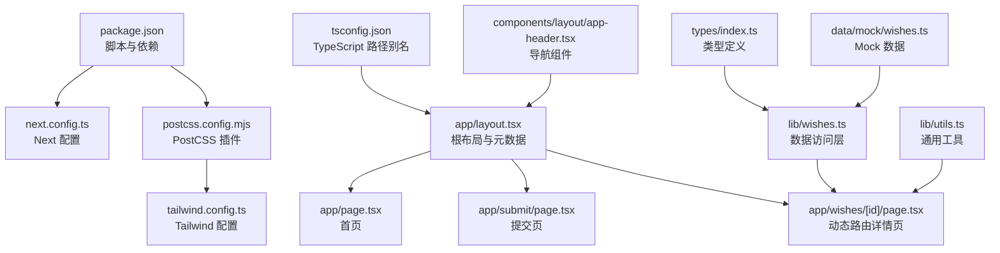
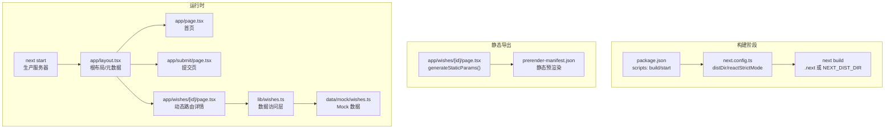
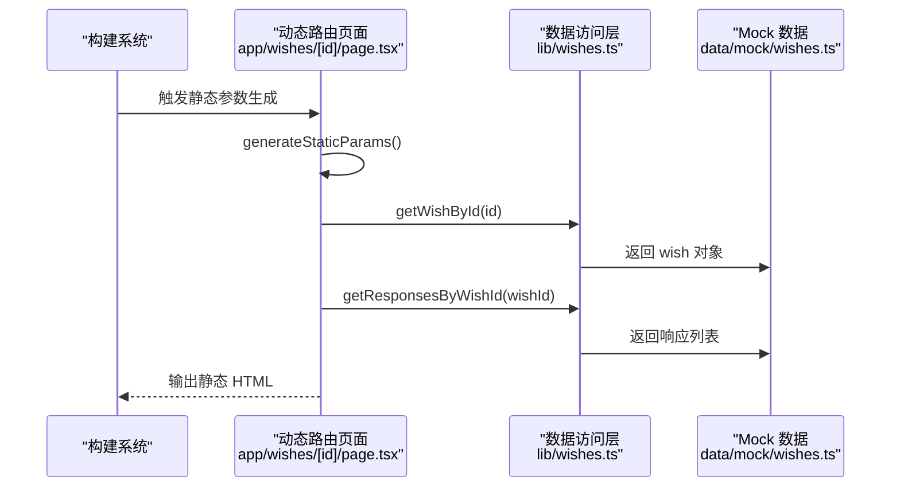
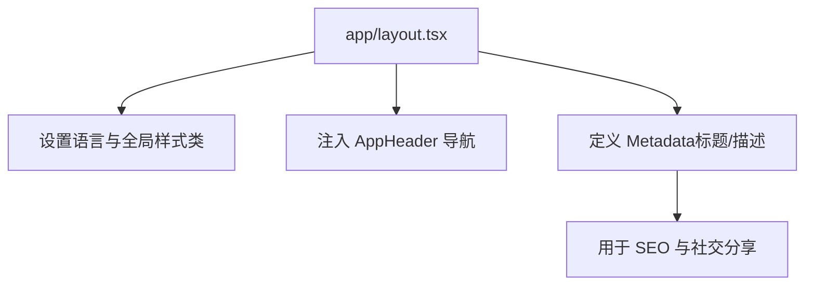
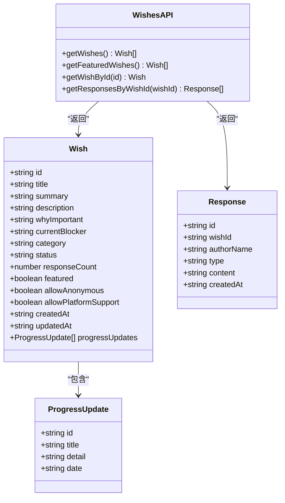
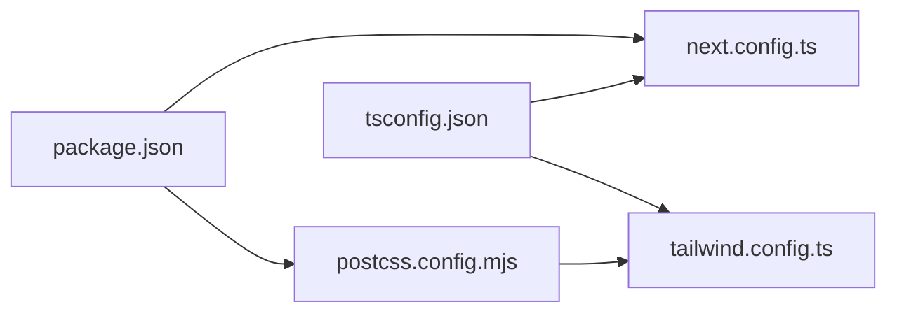

# 生产部署

<cite>
**本文引用的文件**
- [package.json](file://package.json)
- [next.config.ts](file://next.config.ts)
- [tailwind.config.ts](file://tailwind.config.ts)
- [postcss.config.mjs](file://postcss.config.mjs)
- [tsconfig.json](file://tsconfig.json)
- [app/layout.tsx](file://app/layout.tsx)
- [app/page.tsx](file://app/page.tsx)
- [app/submit/page.tsx](file://app/submit/page.tsx)
- [app/wishes/[id]/page.tsx](file://app/wishes/[id]/page.tsx)
- [lib/wishes.ts](file://lib/wishes.ts)
- [lib/utils.ts](file://lib/utils.ts)
- [types/index.ts](file://types/index.ts)
- [data/mock/wishes.ts](file://data/mock/wishes.ts)
- [components/layout/app-header.tsx](file://components/layout/app-header.tsx)
</cite>

## 目录
1. [简介](#简介)
2. [项目结构](#项目结构)
3. [核心组件](#核心组件)
4. [架构总览](#架构总览)
5. [详细组件分析](#详细组件分析)
6. [依赖分析](#依赖分析)
7. [性能考量](#性能考量)
8. [故障排查指南](#故障排查指南)
9. [结论](#结论)
10. [附录](#附录)

## 简介
本指南面向生产环境部署，覆盖 Vercel、Netlify 等主流平台的部署流程与配置要点；解释环境变量与安全配置（含 API 密钥与敏感信息处理）；提供域名与 SSL 配置、CDN 加速策略；说明预渲染与静态导出、动态路由处理；给出部署前性能检查清单与部署后验证步骤；并展示多环境（开发/测试/生产）配置与切换策略。

## 项目结构
该仓库采用 Next.js App Router 结构，页面位于 app 目录，组件位于 components 目录，样式通过 TailwindCSS 配置，类型定义位于 types 目录，数据层通过 lib 层封装，mock 数据位于 data/mock。构建与运行脚本通过 package.json 定义，Next 配置位于 next.config.ts，样式工具链由 postcss.config.mjs 与 tailwind.config.ts 组成。

**图表来源**
- [package.json:1-29](file://package.json#L1-L29)
- [next.config.ts:1-9](file://next.config.ts#L1-L9)
- [postcss.config.mjs:1-9](file://postcss.config.mjs#L1-L9)
- [tailwind.config.ts:1-55](file://tailwind.config.ts#L1-L55)
- [tsconfig.json:1-29](file://tsconfig.json#L1-L29)
- [app/layout.tsx:1-29](file://app/layout.tsx#L1-L29)
- [app/page.tsx:1-29](file://app/page.tsx#L1-L29)
- [app/submit/page.tsx:1-24](file://app/submit/page.tsx#L1-L24)
- [app/wishes/[id]/page.tsx](file://app/wishes/[id]/page.tsx#L1-L184)
- [lib/wishes.ts:1-27](file://lib/wishes.ts#L1-L27)
- [lib/utils.ts:1-12](file://lib/utils.ts#L1-L12)
- [types/index.ts:1-58](file://types/index.ts#L1-L58)
- [data/mock/wishes.ts:1-210](file://data/mock/wishes.ts#L1-L210)
- [components/layout/app-header.tsx:1-64](file://components/layout/app-header.tsx#L1-L64)

**章节来源**
- [package.json:1-29](file://package.json#L1-L29)
- [next.config.ts:1-9](file://next.config.ts#L1-L9)
- [postcss.config.mjs:1-9](file://postcss.config.mjs#L1-L9)
- [tailwind.config.ts:1-55](file://tailwind.config.ts#L1-L55)
- [tsconfig.json:1-29](file://tsconfig.json#L1-L29)
- [app/layout.tsx:1-29](file://app/layout.tsx#L1-L29)

## 核心组件
- 构建与运行脚本：通过 scripts 字段定义 dev/build/start，支持 NEXT_DIST_DIR 环境变量控制输出目录。
- Next 配置：启用严格模式与可选的 distDir 设置，便于自定义构建产物目录。
- 样式体系：Tailwind 配置 content 覆盖 app、components、data、lib，确保按需生成样式；PostCSS 启用 tailwindcss 与 autoprefixer。
- 类型系统：tsconfig.json 使用 bundler 解析与路径别名 @/*，提升模块解析效率与可维护性。
- 页面与路由：根布局与元数据在 app/layout.tsx 中集中管理；首页、提交页与动态路由详情页分别位于 app/page.tsx、app/submit/page.tsx、app/wishes/[id]/page.tsx。
- 数据访问层：lib/wishes.ts 将页面的数据访问封装为函数，便于替换为真实后端（如 Supabase）。
- 工具与类型：lib/utils.ts 提供 cn 与日期格式化；types/index.ts 定义 Wish、Response、WishStatus 等核心类型。
- Mock 数据：data/mock/wishes.ts 提供 wish 与 response 的示例数据，支撑页面渲染与交互。

**章节来源**
- [package.json:5-10](file://package.json#L5-L10)
- [next.config.ts:3-6](file://next.config.ts#L3-L6)
- [tailwind.config.ts:4-9](file://tailwind.config.ts#L4-L9)
- [postcss.config.mjs:1-9](file://postcss.config.mjs#L1-L9)
- [tsconfig.json:21-23](file://tsconfig.json#L21-L23)
- [app/layout.tsx:8-11](file://app/layout.tsx#L8-L11)
- [app/page.tsx:1-29](file://app/page.tsx#L1-L29)
- [app/submit/page.tsx:1-24](file://app/submit/page.tsx#L1-L24)
- [app/wishes/[id]/page.tsx](file://app/wishes/[id]/page.tsx#L13-L17)
- [lib/wishes.ts:1-27](file://lib/wishes.ts#L1-L27)
- [lib/utils.ts:1-12](file://lib/utils.ts#L1-L12)
- [types/index.ts:1-58](file://types/index.ts#L1-L58)
- [data/mock/wishes.ts:1-210](file://data/mock/wishes.ts#L1-L210)

## 架构总览
下图展示生产部署的关键路径：构建产物生成、静态导出与运行时请求处理；同时标注动态路由参数与数据访问层。

**图表来源**
- [package.json:5-10](file://package.json#L5-L10)
- [next.config.ts:3-6](file://next.config.ts#L3-L6)
- [app/wishes/[id]/page.tsx](file://app/wishes/[id]/page.tsx#L13-L17)
- [app/layout.tsx:8-11](file://app/layout.tsx#L8-L11)
- [app/page.tsx:1-29](file://app/page.tsx#L1-L29)
- [app/submit/page.tsx:1-24](file://app/submit/page.tsx#L1-L24)
- [lib/wishes.ts:1-27](file://lib/wishes.ts#L1-L27)
- [data/mock/wishes.ts:1-210](file://data/mock/wishes.ts#L1-L210)

## 详细组件分析

### 动态路由与静态预渲染
- 动态路由：app/wishes/[id]/page.tsx 使用动态段 [id]，并在页面中实现 generateStaticParams 以生成静态预渲染参数列表，从而将已知的 wish id 静态化，减少运行时查询成本。
- 数据访问：lib/wishes.ts 提供 getWishById 与 getResponsesByWishId，页面通过这些函数读取数据；当前使用 data/mock/wishes.ts 的 mock 数据。
- 严格模式：next.config.ts 启用 reactStrictMode，有助于在开发阶段发现潜在问题，生产环境仍保持稳定。

**图表来源**
- [app/wishes/[id]/page.tsx](file://app/wishes/[id]/page.tsx#L13-L17)
- [lib/wishes.ts:15-26](file://lib/wishes.ts#L15-L26)
- [data/mock/wishes.ts:12-150](file://data/mock/wishes.ts#L12-L150)

**章节来源**
- [app/wishes/[id]/page.tsx](file://app/wishes/[id]/page.tsx#L13-L17)
- [lib/wishes.ts:1-27](file://lib/wishes.ts#L1-L27)
- [data/mock/wishes.ts:1-210](file://data/mock/wishes.ts#L1-L210)
- [next.config.ts:4-5](file://next.config.ts#L4-L5)

### 根布局与元数据
- 根布局：app/layout.tsx 定义 html lang、全局样式类与元数据（title/description），并引入 AppHeader 导航组件。
- 元数据：metadata 在根布局中集中声明，便于 SEO 与社交分享优化。

**图表来源**
- [app/layout.tsx:8-11](file://app/layout.tsx#L8-L11)
- [components/layout/app-header.tsx:1-64](file://components/layout/app-header.tsx#L1-L64)

**章节来源**
- [app/layout.tsx:1-29](file://app/layout.tsx#L1-L29)
- [components/layout/app-header.tsx:1-64](file://components/layout/app-header.tsx#L1-L64)

### 数据访问层与类型系统
- 数据访问：lib/wishes.ts 将数据读取逻辑封装为函数，便于替换为真实后端（如 Supabase），保持页面层不变。
- 类型定义：types/index.ts 定义 Wish、Response、WishStatus、WishCategory、ResponseType 等核心类型，确保数据一致性。
- 工具函数：lib/utils.ts 提供 cn 与日期格式化，辅助页面渲染与国际化显示。

**图表来源**
- [types/index.ts:23-58](file://types/index.ts#L23-L58)
- [lib/wishes.ts:1-27](file://lib/wishes.ts#L1-L27)

**章节来源**
- [lib/wishes.ts:1-27](file://lib/wishes.ts#L1-L27)
- [types/index.ts:1-58](file://types/index.ts#L1-L58)
- [lib/utils.ts:1-12](file://lib/utils.ts#L1-L12)

## 依赖分析
- 构建与运行：package.json 定义 dev/build/start 脚本，支持 NEXT_DIST_DIR 控制构建输出目录。
- Next 配置：next.config.ts 启用 reactStrictMode，并允许通过环境变量设置 distDir。
- 样式工具链：postcss.config.mjs 启用 tailwindcss 与 autoprefixer；tailwind.config.ts content 覆盖 app、components、data、lib，确保按需生成样式。
- TypeScript：tsconfig.json 使用 bundler 解析与路径别名 @/*，提升模块解析效率。

**图表来源**
- [package.json:5-10](file://package.json#L5-L10)
- [next.config.ts:1-9](file://next.config.ts#L1-L9)
- [postcss.config.mjs:1-9](file://postcss.config.mjs#L1-L9)
- [tailwind.config.ts:4-9](file://tailwind.config.ts#L4-L9)
- [tsconfig.json:10-23](file://tsconfig.json#L10-L23)

**章节来源**
- [package.json:1-29](file://package.json#L1-L29)
- [next.config.ts:1-9](file://next.config.ts#L1-L9)
- [postcss.config.mjs:1-9](file://postcss.config.mjs#L1-L9)
- [tailwind.config.ts:1-55](file://tailwind.config.ts#L1-L55)
- [tsconfig.json:1-29](file://tsconfig.json#L1-L29)

## 性能考量
- 构建产物目录：通过 NEXT_DIST_DIR 自定义构建输出目录，便于缓存与分发。
- 严格模式：reactStrictMode 有助于早期发现副作用问题，提升稳定性。
- 样式按需生成：Tailwind content 覆盖 app、components、data、lib，避免无用样式。
- 路由预渲染：动态路由通过 generateStaticParams 预渲染已知参数，降低运行时开销。
- 资源加载：利用 CDN（平台自带或自备）加速静态资源与构建产物。

[本节为通用指导，无需列出章节来源]

## 故障排查指南
- 构建失败
  - 检查 package.json 中 scripts 是否正确，确认 NEXT_DIST_DIR 环境变量设置。
  - 查看 next.config.ts 中 distDir 与 reactStrictMode 配置。
- 样式异常
  - 确认 tailwind.config.ts 的 content 路径包含实际使用的组件与页面。
  - 检查 postcss.config.mjs 是否启用 tailwindcss 与 autoprefixer。
- 路由 404
  - 确认 app/wishes/[id]/page.tsx 的 generateStaticParams 是否包含目标 id。
  - 检查 lib/wishes.ts 的 getWishById 是否能返回对应对象。
- 数据为空
  - 确认 data/mock/wishes.ts 中是否存在目标 wish 或 response。
- 类型错误
  - 检查 tsconfig.json 的路径别名与模块解析设置。

**章节来源**
- [package.json:5-10](file://package.json#L5-L10)
- [next.config.ts:3-6](file://next.config.ts#L3-L6)
- [tailwind.config.ts:4-9](file://tailwind.config.ts#L4-L9)
- [postcss.config.mjs:1-9](file://postcss.config.mjs#L1-L9)
- [app/wishes/[id]/page.tsx](file://app/wishes/[id]/page.tsx#L13-L17)
- [lib/wishes.ts:15-17](file://lib/wishes.ts#L15-L17)
- [data/mock/wishes.ts:12-150](file://data/mock/wishes.ts#L12-L150)
- [tsconfig.json:21-23](file://tsconfig.json#L21-L23)

## 结论
本项目基于 Next.js App Router，具备良好的静态导出与动态路由能力；通过数据访问层与类型系统实现清晰的职责分离；Tailwind 与 PostCSS 配置确保样式按需生成。结合本文提供的部署流程、环境变量与安全配置、域名与 SSL、CDN 加速、预渲染与动态路由策略、多环境配置与切换方案，可高效完成生产部署与运维。

[本节为总结，无需列出章节来源]

## 附录

### 平台部署流程与配置（Vercel / Netlify）
- Vercel
  - 仓库连接与构建：在 Vercel 控制台连接 Git 仓库，选择项目根目录，自动识别 Next.js 配置。
  - 构建命令：使用默认 Next.js 构建命令；若需自定义，可在项目设置中设置构建命令与输出目录。
  - 环境变量：在 Vercel 项目设置的 Environment Variables 中添加，区分环境（如生产/预发）。
  - 预渲染：由于存在 generateStaticParams，平台将自动进行静态预渲染。
  - 域名与 SSL：在 Domains 中绑定自定义域名，Vercel 自动生成并托管 SSL 证书。
  - CDN：Vercel 全球 CDN 自动生效，无需额外配置。
- Netlify
  - 仓库连接与构建：连接 Git 仓库，设置构建命令与发布目录。
  - 环境变量：在 Site Settings > Build & Deploy > Environment 中添加。
  - 预渲染：Netlify 不支持 App Router 的静态参数生成，需改用静态导出或服务端渲染。
  - 域名与 SSL：在 Domain Management 中绑定域名，Netlify 提供免费 SSL。
  - CDN：Netlify 全球 CDN 默认启用。

[本节为通用指导，无需列出章节来源]

### 环境变量与安全配置
- 敏感信息
  - API 密钥与数据库凭据应存储在平台的 Environment Variables 中，不要提交到仓库。
  - 在代码中通过 process.env 访问，避免硬编码。
- 开发/测试/生产隔离
  - 使用不同环境变量前缀或命名空间（如 DEV_API_URL、STAGING_API_URL、PROD_API_URL）。
  - 在构建阶段注入，运行时仅读取，避免泄露。
- 最佳实践
  - 限制最小权限原则；定期轮换密钥；启用审计日志。

[本节为通用指导，无需列出章节来源]

### 域名、SSL 与 CDN
- 域名
  - 在平台控制台绑定自定义域名，确保 DNS 记录正确指向平台提供的 CNAME/IP。
- SSL
  - 多数平台自动签发与续期证书；如需自定义证书，按平台指引上传。
- CDN
  - 利用平台自带 CDN；必要时可叠加自有 CDN（如边缘缓存、压缩、图片优化）。

[本节为通用指导，无需列出章节来源]

### 预渲染与静态导出、动态路由策略
- 静态导出
  - 若使用 Netlify 等不支持 generateStaticParams 的平台，可考虑 next export 生成静态站点（需移除动态参数与服务端逻辑）。
- 动态路由
  - 保留 generateStaticParams 以预渲染已知参数；未知参数在运行时处理。
  - 如需全静态，需在构建前确定所有参数集合或改为服务端渲染。

[本节为通用指导，无需列出章节来源]

### 多环境部署与切换策略
- 环境划分
  - 开发：本地开发与最小化预发；测试：集成测试与 UAT；生产：线上流量。
- 切换策略
  - 通过分支策略（如 main/staging/dev）与 CI/CD 管道自动部署至不同环境。
  - 使用环境变量区分 API 地址、数据库连接与第三方服务密钥。
  - 通过平台的环境标签或子域实现可视化区分。

[本节为通用指导，无需列出章节来源]

### 部署前性能检查清单
- 构建产物
  - 确认构建成功且 distDir 正确；检查静态导出完整性。
- 路由与数据
  - 核对 generateStaticParams 是否覆盖全部动态参数；验证 getWishById 与 getResponsesByWishId 返回预期。
- 样式与类型
  - 确认 Tailwind content 路径包含所有组件；TS 编译无错误。
- 安全
  - 确认敏感变量未提交；最小权限与轮换策略已执行。
- 可观测性
  - 配置日志与监控；准备回滚方案。

[本节为通用指导，无需列出章节来源]

### 部署后验证步骤
- 功能验证
  - 首页、提交页、动态详情页均能正常访问；导航与交互无误。
- 性能验证
  - 首屏加载时间、TTFB、LCP 等指标达标；CDN 缓存生效。
- 安全验证
  - HTTPS 正常；敏感信息未泄露；权限最小化。
- 回归验证
  - 关键用户路径（如发布、查看详情、提交帮助）通过自动化或手动回归。

[本节为通用指导，无需列出章节来源]