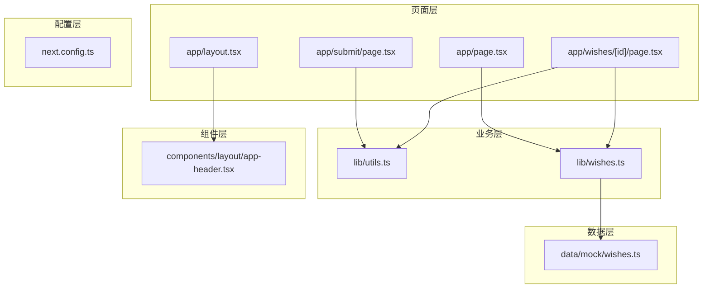
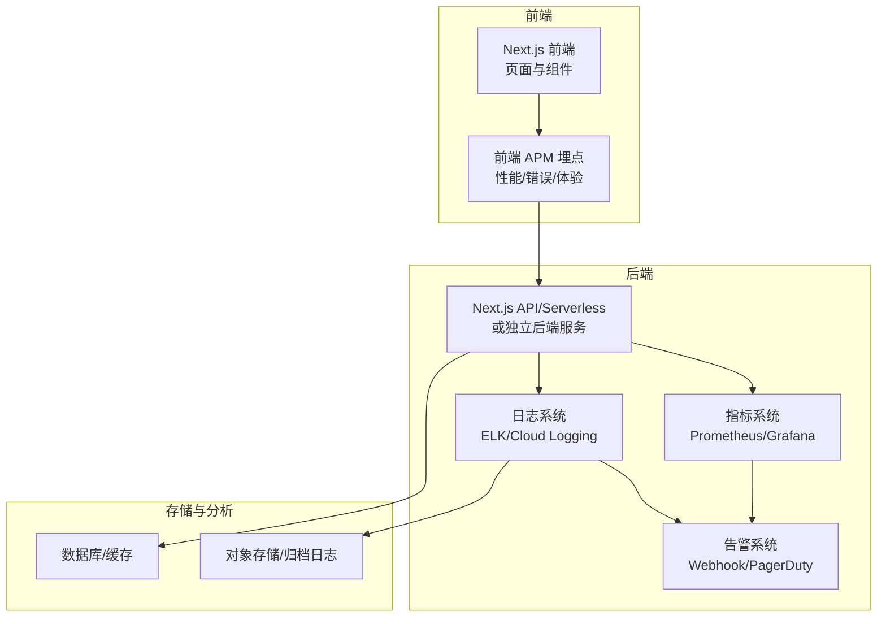
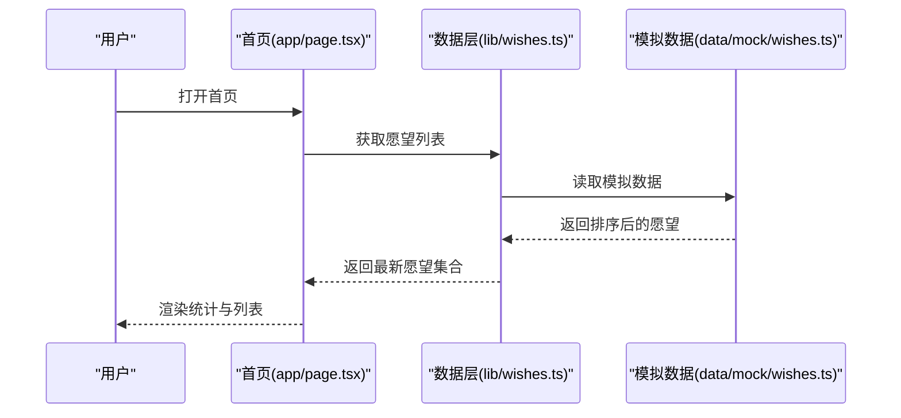
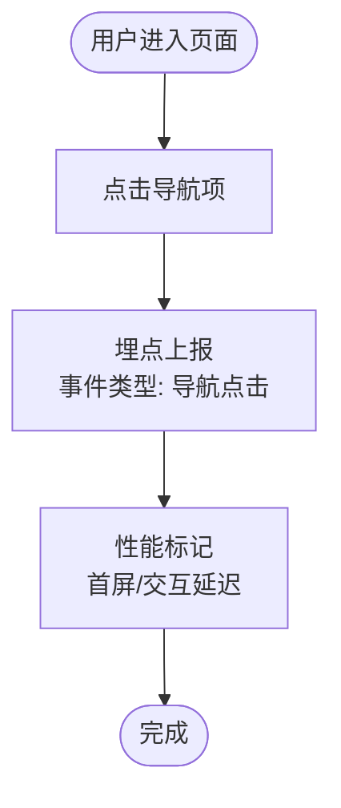
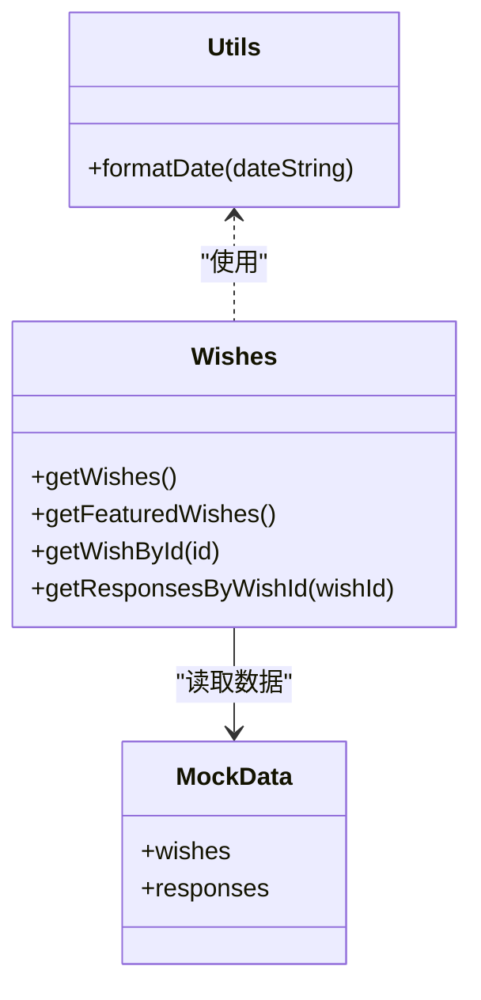
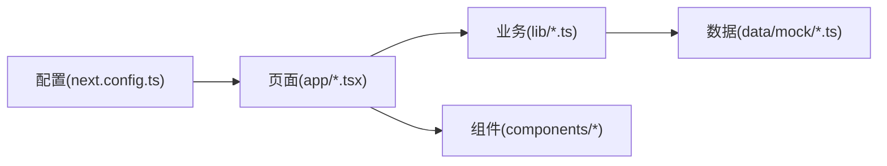

# 监控与日志

<cite>
**本文引用的文件**
- [package.json](file://package.json)
- [next.config.ts](file://next.config.ts)
- [app/layout.tsx](file://app/layout.tsx)
- [app/page.tsx](file://app/page.tsx)
- [app/submit/page.tsx](file://app/submit/page.tsx)
- [app/wishes/[id]/page.tsx](file://app/wishes/[id]/page.tsx)
- [lib/utils.ts](file://lib/utils.ts)
- [lib/wishes.ts](file://lib/wishes.ts)
- [data/mock/wishes.ts](file://data/mock/wishes.ts)
- [components/layout/app-header.tsx](file://components/layout/app-header.tsx)
</cite>

## 目录
1. [简介](#简介)
2. [项目结构](#项目结构)
3. [核心组件](#核心组件)
4. [架构总览](#架构总览)
5. [详细组件分析](#详细组件分析)
6. [依赖关系分析](#依赖关系分析)
7. [性能考虑](#性能考虑)
8. [故障排查指南](#故障排查指南)
9. [结论](#结论)
10. [附录](#附录)

## 简介
本指南面向部署后的监控与日志配置，目标是帮助团队建立一套完整的可观测性体系，覆盖应用性能监控（APM）、错误追踪、性能指标收集、用户体验监控、结构化日志、日志聚合与告警、关键性能指标（KPI）定义与仪表板、健康检查与可用性监控、错误报告与用户行为分析，以及监控数据的可视化与报表生成。  
由于当前仓库为前端 Next.js 应用，未包含后端服务与监控集成代码，因此本指南将以“可落地的配置建议+概念性流程图”为主，帮助你在现有工程基础上快速扩展监控能力。

## 项目结构
该仓库采用 Next.js 应用结构，页面级路由位于 app 目录，业务逻辑封装在 lib 层，静态资源与样式位于 app/globals.css，UI 组件位于 components 目录，数据模拟位于 data/mock。  
- 页面层：app/*.tsx 负责渲染与交互
- 业务层：lib/*.ts 封装数据访问与格式化
- 数据层：data/mock/*.ts 提供模拟数据
- 组件层：components/* 提供可复用 UI
- 配置层：next.config.ts 定义构建与运行参数

**图表来源**
- [app/layout.tsx:1-29](file://app/layout.tsx#L1-L29)
- [app/page.tsx:1-29](file://app/page.tsx#L1-L29)
- [app/submit/page.tsx:1-24](file://app/submit/page.tsx#L1-L24)
- [app/wishes/[id]/page.tsx](file://app/wishes/[id]/page.tsx#L1-L184)
- [lib/utils.ts:1-12](file://lib/utils.ts#L1-L12)
- [lib/wishes.ts:1-27](file://lib/wishes.ts#L1-L27)
- [data/mock/wishes.ts:1-210](file://data/mock/wishes.ts#L1-L210)
- [components/layout/app-header.tsx:1-64](file://components/layout/app-header.tsx#L1-L64)
- [next.config.ts:1-9](file://next.config.ts#L1-L9)

**章节来源**
- [package.json:1-29](file://package.json#L1-L29)
- [next.config.ts:1-9](file://next.config.ts#L1-L9)

## 核心组件
- 页面与布局：根布局负责全局样式与导航；首页负责统计“等待回声”的数量；详情页负责渲染愿望详情与回声列表。
- 业务工具：格式化工具提供日期格式化；数据访问层封装了愿望与回声的查询。
- 组件：头部组件提供导航与品牌信息。
- 配置：Next 构建目录与严格模式配置。

**章节来源**
- [app/layout.tsx:1-29](file://app/layout.tsx#L1-L29)
- [app/page.tsx:1-29](file://app/page.tsx#L1-L29)
- [app/wishes/[id]/page.tsx](file://app/wishes/[id]/page.tsx#L1-L184)
- [lib/utils.ts:1-12](file://lib/utils.ts#L1-L12)
- [lib/wishes.ts:1-27](file://lib/wishes.ts#L1-L27)
- [components/layout/app-header.tsx:1-64](file://components/layout/app-header.tsx#L1-L64)
- [next.config.ts:1-9](file://next.config.ts#L1-L9)

## 架构总览
以下为部署后监控与日志的整体架构建议，涵盖前端埋点、后端指标、日志采集与告警、仪表板与报表。

[此图为概念性架构示意，不对应具体源码文件，故无图表来源]

## 详细组件分析

### 页面与路由的可观测性要点
- 首页统计“等待回声”的数量，可作为关键业务 KPI 的基础数据来源之一。
- 详情页加载愿望与回声列表，涉及网络请求与渲染耗时，是性能监控的重点。
- 提交页承载用户输入与提交流程，是错误与体验监控的关键入口。

**图表来源**
- [app/page.tsx:1-29](file://app/page.tsx#L1-L29)
- [lib/wishes.ts:1-27](file://lib/wishes.ts#L1-L27)
- [data/mock/wishes.ts:1-210](file://data/mock/wishes.ts#L1-L210)

**章节来源**
- [app/page.tsx:1-29](file://app/page.tsx#L1-L29)
- [lib/wishes.ts:1-27](file://lib/wishes.ts#L1-L27)
- [data/mock/wishes.ts:1-210](file://data/mock/wishes.ts#L1-L210)

### 组件与导航的可观测性要点
- 头部组件提供导航入口，可在此处埋点“导航点击”事件，用于分析用户路径与跳出率。
- 布局组件负责全局样式与容器，确保埋点脚本与性能标记的统一注入。

[此图为通用流程示意，不对应具体源码文件，故无图表来源]

**章节来源**
- [components/layout/app-header.tsx:1-64](file://components/layout/app-header.tsx#L1-L64)
- [app/layout.tsx:1-29](file://app/layout.tsx#L1-L29)

### 数据访问与格式化的可观测性要点
- 数据访问层封装了愿望与回声的查询，便于在调用前后插入性能与错误埋点。
- 格式化工具提供日期格式化，避免因本地化差异导致的异常。

**图表来源**
- [lib/utils.ts:1-12](file://lib/utils.ts#L1-L12)
- [lib/wishes.ts:1-27](file://lib/wishes.ts#L1-L27)
- [data/mock/wishes.ts:1-210](file://data/mock/wishes.ts#L1-L210)

**章节来源**
- [lib/utils.ts:1-12](file://lib/utils.ts#L1-L12)
- [lib/wishes.ts:1-27](file://lib/wishes.ts#L1-L27)
- [data/mock/wishes.ts:1-210](file://data/mock/wishes.ts#L1-L210)

## 依赖关系分析
- 页面依赖业务层，业务层依赖数据层，形成清晰的单向依赖。
- 组件依赖 UI 基础组件，保持低耦合高内聚。
- 配置层影响构建产物与运行时行为，需与监控配置协同。

**图表来源**
- [app/page.tsx:1-29](file://app/page.tsx#L1-L29)
- [lib/wishes.ts:1-27](file://lib/wishes.ts#L1-L27)
- [data/mock/wishes.ts:1-210](file://data/mock/wishes.ts#L1-L210)
- [components/layout/app-header.tsx:1-64](file://components/layout/app-header.tsx#L1-L64)
- [next.config.ts:1-9](file://next.config.ts#L1-L9)

**章节来源**
- [package.json:1-29](file://package.json#L1-L29)
- [next.config.ts:1-9](file://next.config.ts#L1-L9)

## 性能考虑
- 构建与运行参数：通过配置构建目录与严格模式，有助于在生产环境获得更稳定的性能表现。
- 页面渲染：首页与详情页的数据量与渲染复杂度不同，应分别进行性能基线与回归测试。
- 依赖与体积：减少不必要的依赖与动态导入，有助于降低首屏加载时间。

**章节来源**
- [next.config.ts:1-9](file://next.config.ts#L1-L9)
- [package.json:1-29](file://package.json#L1-L29)

## 故障排查指南
- 错误捕获：利用 Next.js 的错误边界与全局错误页面，结合前端 APM 的错误上报，定位异常堆栈与上下文。
- 日志采集：在关键路径（数据请求、用户交互、导航）添加结构化日志，确保字段一致且包含时间戳、用户标识、请求 ID。
- 回归验证：通过自动化测试与性能基准，持续监控关键指标（如首屏时间、交互延迟、错误率）。

[本节为通用指导，不直接分析具体文件，故无章节来源]

## 结论
本指南提供了部署后监控与日志的配置思路与实施建议。对于当前前端工程，建议优先完成前端 APM 埋点、结构化日志与错误上报、关键 KPI 定义与仪表板搭建，并逐步引入健康检查与可用性监控。随着业务发展，可进一步完善后端指标与日志聚合、告警策略与报表自动化。

[本节为总结性内容，不直接分析具体文件，故无章节来源]

## 附录

### APM 设置（前端）
- 错误追踪：在全局错误边界中上报错误，包含堆栈、URL、用户标识、设备信息。
- 性能指标：记录首屏时间、交互延迟、页面可见性变化、网络请求耗时。
- 用户体验监控：记录关键交互（导航、提交、滚动深度）与失败场景。

[本节为通用指导，不直接分析具体文件，故无章节来源]

### 日志系统配置
- 结构化日志：统一字段（时间戳、级别、模块、消息、上下文、用户标识、请求 ID）。
- 日志聚合：集中收集至日志平台，按模块与级别筛选与检索。
- 告警设置：基于错误率、响应时间、可用性阈值触发告警。

[本节为通用指导，不直接分析具体文件，故无章节来源]

### 关键性能指标（KPI）与仪表板
- KPI 建议：错误率、首屏时间、交互延迟、页面可用性、用户转化率。
- 仪表板：以趋势图、热力图、漏斗图等形式呈现，支持多维度钻取。

[本节为通用指导，不直接分析具体文件，故无章节来源]

### 健康检查与可用性监控
- 健康检查：定时探测首页与关键接口，输出状态与耗时。
- 可用性监控：基于探针与真实用户监控（RUM）综合评估。

[本节为通用指导，不直接分析具体文件，故无章节来源]

### 错误报告与用户行为分析
- 错误报告：自动汇总错误、关联用户与会话，支持复现步骤。
- 用户行为分析：埋点导航、表单提交、页面停留等行为，生成行为路径与漏斗。

[本节为通用指导，不直接分析具体文件，故无章节来源]

### 监控数据可视化与报表
- 可视化：使用图表库与仪表板工具，实现多维指标展示。
- 报表：定期生成周报/月报，包含趋势、对比与改进建议。

[本节为通用指导，不直接分析具体文件，故无章节来源]