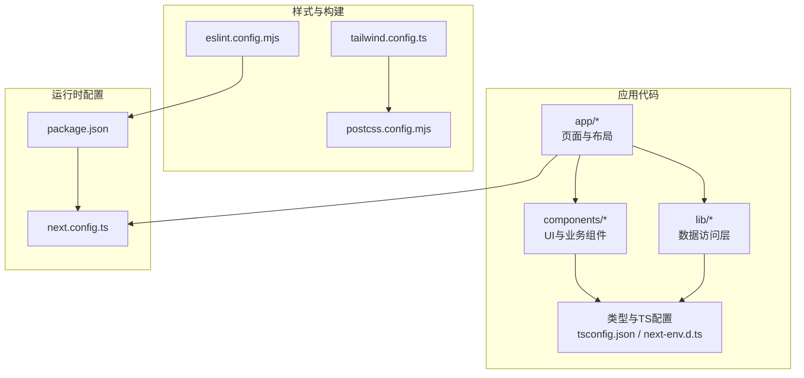
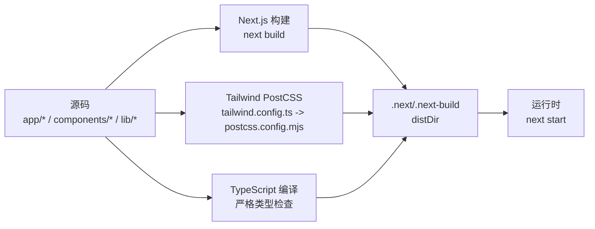
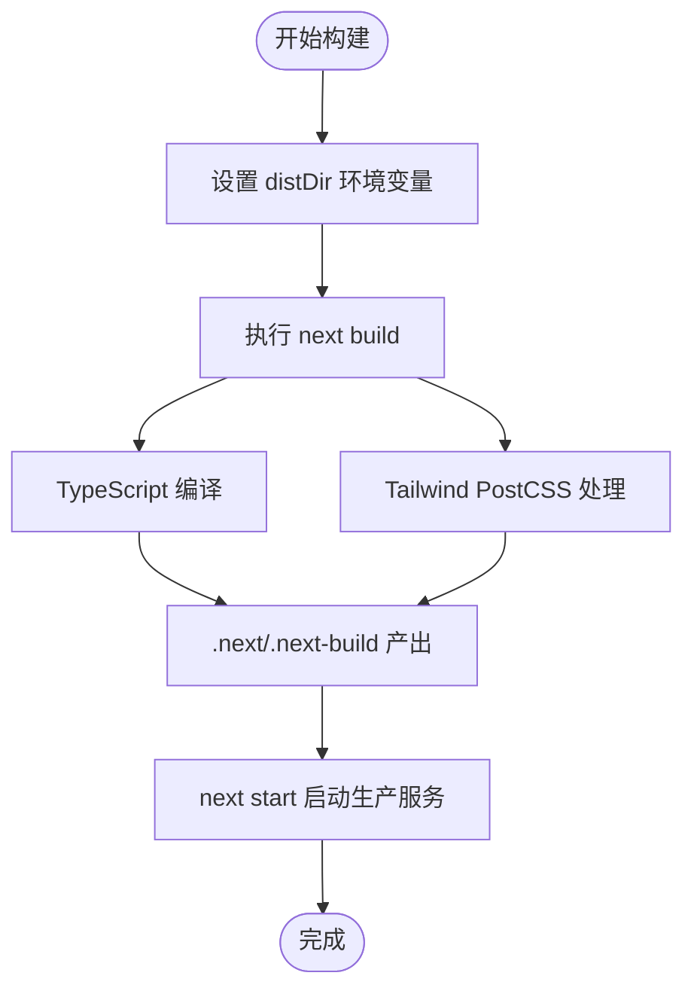
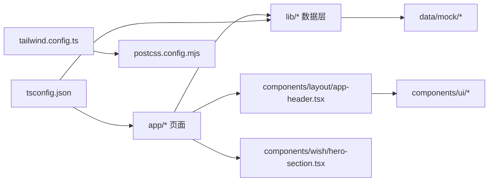

# 部署与构建

<cite>
**本文引用的文件**
- [next.config.ts](file://next.config.ts)
- [package.json](file://package.json)
- [tailwind.config.ts](file://tailwind.config.ts)
- [postcss.config.mjs](file://postcss.config.mjs)
- [tsconfig.json](file://tsconfig.json)
- [eslint.config.mjs](file://eslint.config.mjs)
- [next-env.d.ts](file://next-env.d.ts)
- [app/layout.tsx](file://app/layout.tsx)
- [app/page.tsx](file://app/page.tsx)
- [components/layout/app-header.tsx](file://components/layout/app-header.tsx)
- [components/wish/hero-section.tsx](file://components/wish/hero-section.tsx)
- [lib/utils.ts](file://lib/utils.ts)
- [lib/wishes.ts](file://lib/wishes.ts)
</cite>

## 目录
1. [简介](#简介)
2. [项目结构](#项目结构)
3. [核心组件](#核心组件)
4. [架构总览](#架构总览)
5. [详细组件分析](#详细组件分析)
6. [依赖分析](#依赖分析)
7. [性能考虑](#性能考虑)
8. [故障排查指南](#故障排查指南)
9. [结论](#结论)
10. [附录](#附录)

## 简介
本指南面向“梦想回应平台”的部署与构建，围绕Next.js应用的构建配置优化、生产部署（含Vercel、Netlify）、Docker容器化与Kubernetes部署、CDN与缓存策略、监控与日志、A/B测试与灰度发布、回滚与应急响应、以及CI/CD流水线最佳实践展开。文档同时提供部署后的性能监控与用户体验检查清单，帮助团队在不同环境下稳定交付高质量体验。

## 项目结构
该仓库为一个基于Next.js App Router的应用，采用TypeScript与TailwindCSS进行样式管理，使用PostCSS进行编译管线整合。核心目录与职责概览如下：
- app：页面与布局定义，包含根布局、首页与动态路由页面
- components：可复用UI与业务组件（布局、愿望相关）
- lib：数据访问层封装（当前使用mock数据）
- 样式与工具：TailwindCSS、PostCSS、通用工具函数
- 构建与类型：Next.js配置、TypeScript配置、ESLint配置、Next类型声明

图表来源
- [next.config.ts:1-9](file://next.config.ts#L1-L9)
- [package.json:1-29](file://package.json#L1-L29)
- [tailwind.config.ts:1-55](file://tailwind.config.ts#L1-L55)
- [postcss.config.mjs:1-9](file://postcss.config.mjs#L1-L9)
- [tsconfig.json:1-29](file://tsconfig.json#L1-L29)
- [eslint.config.mjs:1-19](file://eslint.config.mjs#L1-L19)
- [next-env.d.ts:1-7](file://next-env.d.ts#L1-L7)

章节来源
- [next.config.ts:1-9](file://next.config.ts#L1-L9)
- [package.json:1-29](file://package.json#L1-L29)
- [tailwind.config.ts:1-55](file://tailwind.config.ts#L1-L55)
- [postcss.config.mjs:1-9](file://postcss.config.mjs#L1-L9)
- [tsconfig.json:1-29](file://tsconfig.json#L1-L29)
- [eslint.config.mjs:1-19](file://eslint.config.mjs#L1-L19)
- [next-env.d.ts:1-7](file://next-env.d.ts#L1-L7)

## 核心组件
- Next.js构建配置：通过环境变量控制dist目录，启用严格模式，便于在CI中统一构建产物路径。
- 构建脚本：开发、构建、启动脚本分别指定不同的dist目录，避免构建产物冲突。
- 样式系统：TailwindCSS内容扫描范围覆盖app与components等目录；PostCSS集成Tailwind与Autoprefixer。
- 类型系统：严格类型检查、增量编译、模块解析策略适配Next.js App Router。
- 质量保障：ESLint规则继承Next核心Web Vitals规则，并忽略构建输出与打包产物目录。

章节来源
- [next.config.ts:1-9](file://next.config.ts#L1-L9)
- [package.json:5-10](file://package.json#L5-L10)
- [tailwind.config.ts:4-9](file://tailwind.config.ts#L4-L9)
- [postcss.config.mjs:1-9](file://postcss.config.mjs#L1-L9)
- [tsconfig.json:2-26](file://tsconfig.json#L2-L26)
- [eslint.config.mjs:3-16](file://eslint.config.mjs#L3-L16)

## 架构总览
下图展示了从源码到构建产物的关键路径，以及样式与类型系统的参与点。

图表来源
- [next.config.ts:5-6](file://next.config.ts#L5-L6)
- [package.json:7-8](file://package.json#L7-L8)
- [tailwind.config.ts:1-55](file://tailwind.config.ts#L1-L55)
- [postcss.config.mjs:1-9](file://postcss.config.mjs#L1-L9)
- [tsconfig.json:2-26](file://tsconfig.json#L2-L26)

## 详细组件分析

### 构建配置与优化策略
- 构建输出目录：通过环境变量控制dist目录，便于CI/CD中隔离构建产物，减少并发冲突。
- 严格模式：开启React严格模式有助于早期发现潜在问题。
- 性能优化建议（结合现有配置）：
  - 使用增量编译与严格类型检查，缩短本地开发迭代周期。
  - Tailwind内容扫描仅限必要目录，避免不必要的重编译。
  - 在CI中固定Node版本与依赖锁定，确保构建一致性。

图表来源
- [next.config.ts:5-6](file://next.config.ts#L5-L6)
- [package.json:7-8](file://package.json#L7-L8)
- [tsconfig.json:13-14](file://tsconfig.json#L13-L14)
- [tailwind.config.ts:4-9](file://tailwind.config.ts#L4-L9)
- [postcss.config.mjs:1-9](file://postcss.config.mjs#L1-L9)

章节来源
- [next.config.ts:1-9](file://next.config.ts#L1-L9)
- [package.json:5-10](file://package.json#L5-L10)
- [tsconfig.json:2-26](file://tsconfig.json#L2-L26)
- [tailwind.config.ts:4-9](file://tailwind.config.ts#L4-L9)
- [postcss.config.mjs:1-9](file://postcss.config.mjs#L1-L9)

### 生产环境部署（Vercel/Netlify）
- Vercel
  - 构建命令：使用仓库中的构建脚本，确保distDir一致。
  - 输出目录：与构建脚本生成的目录保持一致。
  - 环境变量：NEXT_PUBLIC_* 前缀用于客户端可见变量；服务端密钥不暴露于客户端。
  - 缓存策略：利用Vercel边缘缓存与静态资源缓存，结合Next.js的静态导出或ISR策略（如需）。
- Netlify
  - 构建命令与输出目录同上。
  - 环境变量：通过Netlify仪表板或分支别名设置。
  - CDN与缓存：结合Netlify的边缘缓存与浏览器缓存头配置。

章节来源
- [package.json:7-8](file://package.json#L7-L8)
- [next.config.ts:5-6](file://next.config.ts#L5-L6)

### Docker 容器化部署
- 构建阶段
  - 使用多阶段构建，先安装依赖并执行构建，再复制dist目录到轻量镜像。
  - 固定Node版本，使用依赖锁定文件。
- 运行阶段
  - 使用最小化基础镜像（如官方Node镜像的slim版）。
  - 设置NODE_ENV=production，暴露NEXT_PORT（如需要），映射容器端口。
  - 将distDir作为只读卷挂载或在构建阶段完成复制。
- 健康检查
  - 通过HTTP健康检查探测Next.js服务端口，确保进程存活与端口可用。

章节来源
- [package.json:11-15](file://package.json#L11-L15)
- [next.config.ts:5-6](file://next.config.ts#L5-L6)

### Kubernetes 集群部署
- Deployment
  - 使用容器镜像，设置资源请求与限制，启用滚动更新策略。
  - 挂载配置（Secret/ConfigMap）以注入环境变量与静态资源（如需）。
- Service
  - 暴露ClusterIP或LoadBalancer，配合Ingress控制器。
- Ingress
  - 配置TLS、路径转发与缓存头，结合边缘缓存策略。
- HPA
  - 根据CPU/内存或自定义指标自动扩缩容。

章节来源
- [package.json:11-15](file://package.json#L11-L15)
- [next.config.ts:5-6](file://next.config.ts#L5-L6)

### CDN 与缓存策略
- 静态资源
  - 利用Next.js构建产物中的静态文件指纹化，结合CDN缓存与长缓存策略。
- HTML与API
  - 对HTML与API响应设置合理的Cache-Control与ETag/Last-Modified，支持条件请求。
- 边缘缓存
  - 在CDN层面按路径与文件类型分层缓存，避免敏感数据被缓存。
- 浏览器缓存
  - 对CSS/JS设置长缓存，对HTML设置短缓存或协商缓存。

章节来源
- [package.json:11-15](file://package.json#L11-L15)
- [tailwind.config.ts:4-9](file://tailwind.config.ts#L4-L9)

### 监控与日志记录
- 日志
  - Next.js默认输出访问日志与错误日志；在容器/集群环境中接入集中式日志（如ELK/Cloud Logging）。
- 指标
  - 指标采集：CPU、内存、QPS、P95/P99延迟、错误率。
  - 可视化：Prometheus/Grafana或云厂商监控面板。
- 健康检查
  - 通过探针检测容器/进程健康状态，异常时触发重启或告警。

章节来源
- [package.json:11-15](file://package.json#L11-L15)

### A/B测试与灰度发布
- 路由级灰度
  - 通过网关/反向代理按用户ID哈希或Cookie分流至新旧版本。
- 功能开关
  - 使用环境变量或集中式配置中心控制功能开关，逐步放开流量。
- 数据观测
  - 对比关键指标（转化率、留存、错误率）评估效果。

章节来源
- [app/layout.tsx:13-28](file://app/layout.tsx#L13-L28)
- [app/page.tsx:6-28](file://app/page.tsx#L6-L28)

### 回滚与应急响应
- 快速回滚
  - 保留最近几个版本镜像与构建产物，一键切换到上一个稳定版本。
- 应急预案
  - 降级策略：关闭高风险功能、回退到静态快照、启用只读模式。
  - 通知机制：建立值班与告警通道，明确升级/回滚负责人。

章节来源
- [package.json:7-8](file://package.json#L7-L8)
- [next.config.ts:5-6](file://next.config.ts#L5-L6)

### CI/CD 流水线与自动化部署
- 触发条件
  - 分支保护、PR合并、标签推送等。
- 步骤建议
  - 代码检查（ESLint、类型检查）、单元测试、构建、打包、安全扫描、镜像构建、部署到预发布/生产、健康检查、通知。
- 最佳实践
  - 并行化任务、缓存依赖、多环境分离、零停机发布、自动回滚。

章节来源
- [eslint.config.mjs:1-19](file://eslint.config.mjs#L1-L19)
- [tsconfig.json:2-26](file://tsconfig.json#L2-L26)
- [package.json:5-10](file://package.json#L5-L10)

## 依赖分析
- 组件耦合
  - 页面组件依赖数据访问层；布局组件依赖UI组件；样式系统贯穿全局。
- 外部依赖
  - Next.js、React、TailwindCSS、PostCSS、TypeScript、ESLint。
- 潜在循环依赖
  - 当前结构清晰，未见直接循环依赖迹象。

图表来源
- [app/page.tsx:1-29](file://app/page.tsx#L1-L29)
- [lib/wishes.ts:1-27](file://lib/wishes.ts#L1-L27)
- [components/layout/app-header.tsx:1-64](file://components/layout/app-header.tsx#L1-L64)
- [components/wish/hero-section.tsx:1-53](file://components/wish/hero-section.tsx#L1-L53)
- [tailwind.config.ts:1-55](file://tailwind.config.ts#L1-L55)
- [postcss.config.mjs:1-9](file://postcss.config.mjs#L1-L9)
- [tsconfig.json:2-26](file://tsconfig.json#L2-L26)

章节来源
- [app/page.tsx:1-29](file://app/page.tsx#L1-L29)
- [lib/wishes.ts:1-27](file://lib/wishes.ts#L1-L27)
- [components/layout/app-header.tsx:1-64](file://components/layout/app-header.tsx#L1-L64)
- [components/wish/hero-section.tsx:1-53](file://components/wish/hero-section.tsx#L1-L53)
- [tailwind.config.ts:1-55](file://tailwind.config.ts#L1-L55)
- [postcss.config.mjs:1-9](file://postcss.config.mjs#L1-L9)
- [tsconfig.json:2-26](file://tsconfig.json#L2-L26)

## 性能考虑
- 构建性能
  - 增量编译、严格类型检查、模块解析策略优化。
  - Tailwind内容扫描范围收敛，避免全量扫描。
- 运行性能
  - 静态资源指纹化与CDN缓存、浏览器缓存头合理设置。
  - 服务端渲染与静态导出策略选择（根据路由需求）。
- 开发体验
  - ESLint与类型检查前置，减少生产问题。

章节来源
- [tsconfig.json:2-26](file://tsconfig.json#L2-L26)
- [tailwind.config.ts:4-9](file://tailwind.config.ts#L4-L9)
- [eslint.config.mjs:1-19](file://eslint.config.mjs#L1-L19)

## 故障排查指南
- 构建失败
  - 检查distDir是否被多个任务同时写入；确认Node版本与依赖锁定文件。
- 样式异常
  - 确认Tailwind内容扫描路径包含目标文件；检查PostCSS插件顺序。
- 类型错误
  - 清理类型缓存后重试；检查TS配置与路径映射。
- 运行时错误
  - 查看容器/集群日志；检查环境变量与端口映射；验证健康检查。

章节来源
- [next.config.ts:5-6](file://next.config.ts#L5-L6)
- [tailwind.config.ts:4-9](file://tailwind.config.ts#L4-L9)
- [postcss.config.mjs:1-9](file://postcss.config.mjs#L1-L9)
- [tsconfig.json:2-26](file://tsconfig.json#L2-L26)
- [eslint.config.mjs:1-19](file://eslint.config.mjs#L1-L19)

## 结论
本指南基于现有配置与目录结构，给出了从构建到生产的完整落地建议。建议在实际部署中结合业务场景细化缓存策略、监控体系与灰度方案，并通过CI/CD实现自动化与可观测性，持续提升交付质量与稳定性。

## 附录
- 部署后检查清单
  - 构建产物完整性与指纹化校验
  - CDN缓存命中率与边缘节点健康
  - 关键指标（QPS、错误率、P95延迟）基线
  - 日志采集与告警阈值
  - A/B测试与灰度流量分配
  - 回滚预案与演练记录