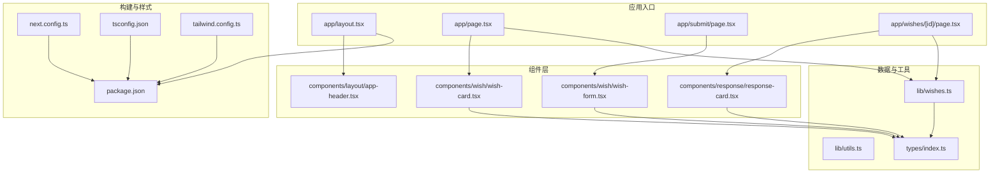
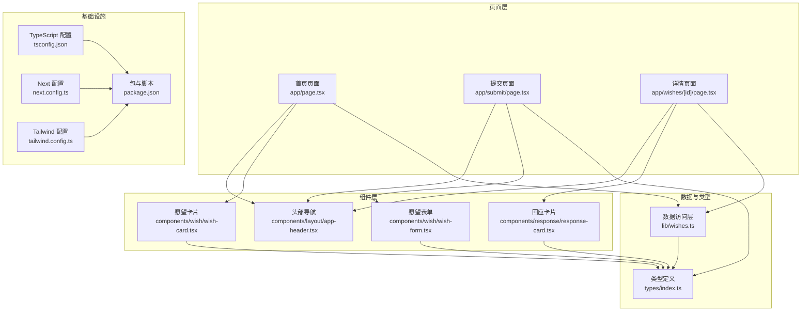
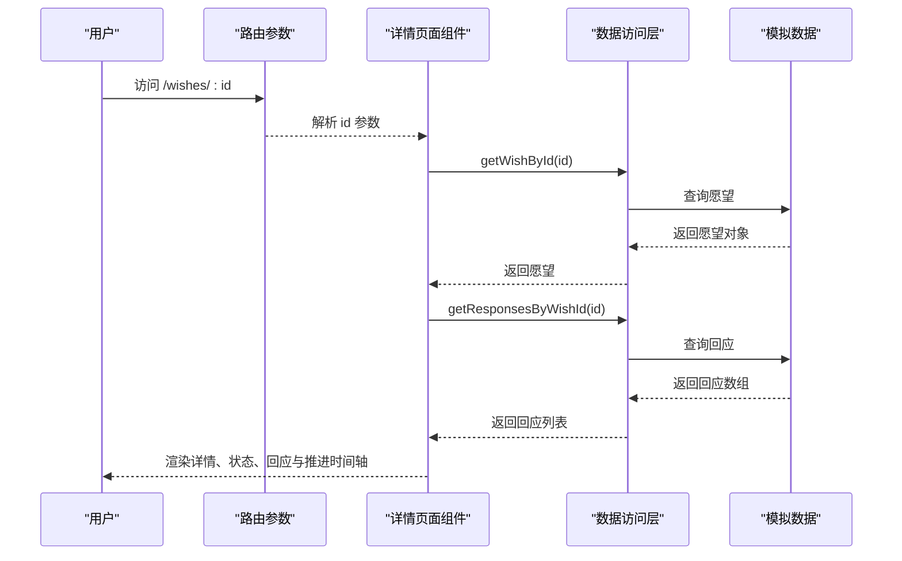
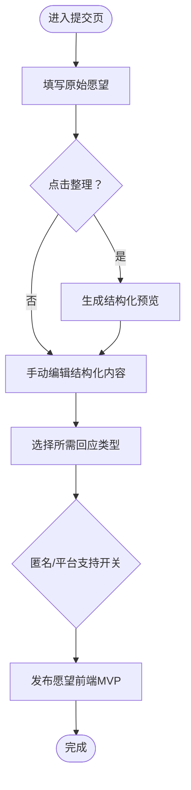
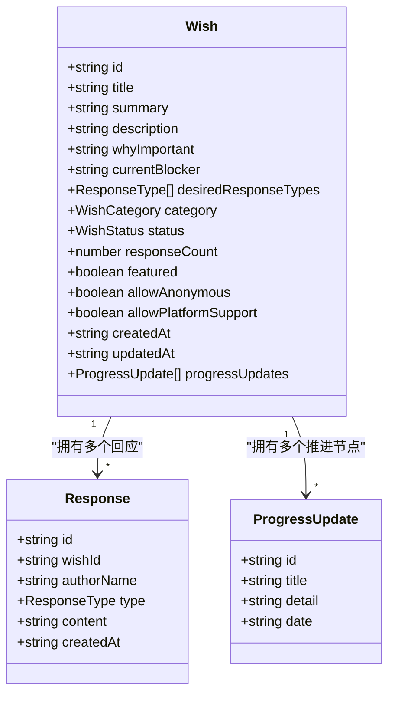
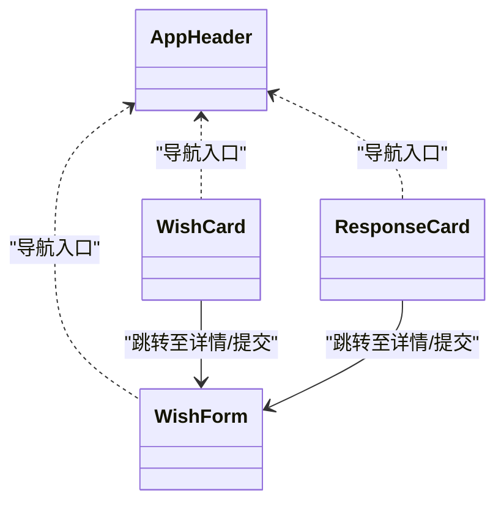
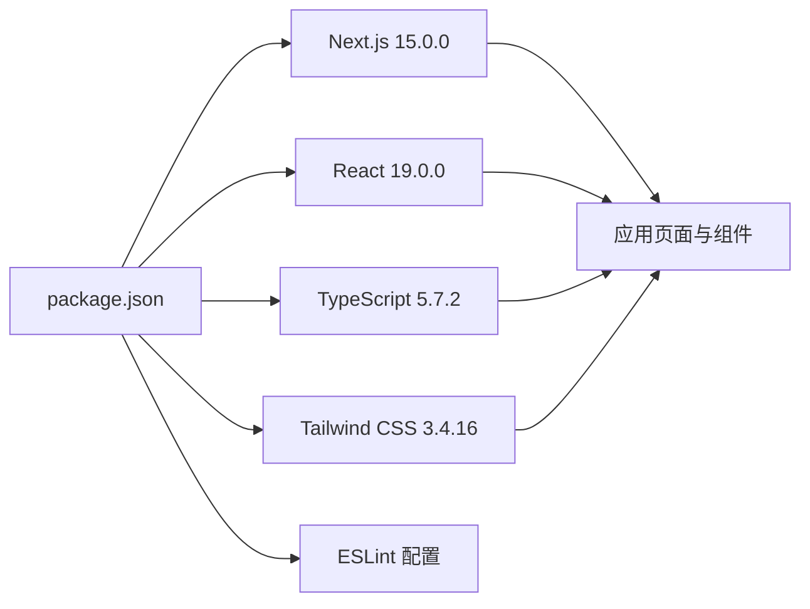

# 项目概述

<cite>
**本文引用的文件**
- [package.json](file://package.json)
- [next.config.ts](file://next.config.ts)
- [tsconfig.json](file://tsconfig.json)
- [tailwind.config.ts](file://tailwind.config.ts)
- [types/index.ts](file://types/index.ts)
- [app/layout.tsx](file://app/layout.tsx)
- [app/page.tsx](file://app/page.tsx)
- [app/submit/page.tsx](file://app/submit/page.tsx)
- [app/wishes/[id]/page.tsx](file://app/wishes/[id]/page.tsx)
- [lib/utils.ts](file://lib/utils.ts)
- [lib/wishes.ts](file://lib/wishes.ts)
- [components/layout/app-header.tsx](file://components/layout/app-header.tsx)
- [components/wish/wish-form.tsx](file://components/wish/wish-form.tsx)
- [components/wish/wish-card.tsx](file://components/wish/wish-card.tsx)
- [components/response/response-card.tsx](file://components/response/response-card.tsx)
</cite>

## 目录
1. [引言](#引言)
2. [项目结构](#项目结构)
3. [核心组件](#核心组件)
4. [架构总览](#架构总览)
5. [详细组件分析](#详细组件分析)
6. [依赖关系分析](#依赖关系分析)
7. [性能考量](#性能考量)
8. [故障排查指南](#故障排查指南)
9. [结论](#结论)
10. [附录](#附录)

## 引言

### 产品定位
「梦的平台」是一个让愿望被看见、被回应、甚至被实现的平台。

这不是普通社区，不是树洞，不是论坛，也不是任务外包平台。它的核心是：

- 用户公开写下一个愿望或一直想做却没开始的事
- 平台帮助把这个愿望整理得更清楚（AI 结构化翻译层）
- 其他用户可以给出结构化回应（不是评论，而是有类型的帮助输入）
- 少量愿望还有机会被平台推进，最终形成真实故事

产品的本质是：**情绪表达入口 + AI 结构化翻译层 + 结构化回应系统 + 少量真实推进案例**

平台卖的不是梦，而是梦被回应的可能性。许愿池是入口，求解和任务是闭环。浪漫的入口，现实的骨架。

### 核心闭环
```
Wish → Response → Match → Outcome → Story → More Wishes
```
V1 只验证：愿望会被看见 → 会被回应 → 会产生少量真实改变。

### V1 验证目标
1. **用户是否愿意公开发布愿望**：愿望入口是否有吸引力，用户是否愿意表达真实需求
2. **其他用户是否愿意回应愿望**：愿望是否能引发共鸣，回应机制是否比评论更有价值
3. **少量愿望是否能被推进成真实故事**：愿望是否能从表达进入行动，平台是否能沉淀案例

### 目标用户
- **发愿望的人（Wish Maker）**：有长期想做但没开始的事，想被理解、被帮助
- **回应者（Responder）**：有善意、有经验、有资源，愿意提供建议、机会、连接
- **平台运营者（Operator）**：审核内容、精选愿望、推进少量高价值愿望、沉淀故事案例

### 产品原则
1. 先让愿望被认真对待，再考虑规模化
2. 愿望不是任务，不要一开始全部平台化、交易化
3. 回应不是评论，必须强调"有帮助的回应"
4. AI 是翻译层，不是主角，不代替真实的人类帮助关系
5. 少量真实推进案例比大量空互动更重要

### 北极星指标
**7天内获得至少1条有效回应的愿望占比**——最直接反映平台是否"活着"。

### 技术概述
本项目是「梦的平台」的前端 MVP（最小可行产品），基于 Next.js 15.0.0 构建，通过 React 19.0.0、TypeScript 5.7.2、Tailwind CSS 3.4.16 等技术选型，确保开发效率、可维护性与视觉一致性。当前阶段使用 Mock 数据驱动开发，为后续迁移到 Supabase 真实数据库奠定基础。

## 项目结构
项目采用 Next.js App Router 的目录组织方式，按功能域划分 app、components、lib、types 等层次，配合 Tailwind CSS 实现样式系统，TypeScript 提供类型安全保障。



图表来源
- [app/layout.tsx:1-29](file://app/layout.tsx#L1-L29)
- [app/page.tsx:1-29](file://app/page.tsx#L1-L29)
- [app/submit/page.tsx:1-24](file://app/submit/page.tsx#L1-L24)
- [app/wishes/[id]/page.tsx](file://app/wishes/[id]/page.tsx#L1-L184)
- [components/layout/app-header.tsx:1-64](file://components/layout/app-header.tsx#L1-L64)
- [components/wish/wish-form.tsx:1-264](file://components/wish/wish-form.tsx#L1-L264)
- [components/wish/wish-card.tsx:1-93](file://components/wish/wish-card.tsx#L1-L93)
- [components/response/response-card.tsx:1-48](file://components/response/response-card.tsx#L1-L48)
- [lib/wishes.ts:1-27](file://lib/wishes.ts#L1-L27)
- [lib/utils.ts:1-12](file://lib/utils.ts#L1-L12)
- [types/index.ts:1-58](file://types/index.ts#L1-L58)
- [next.config.ts:1-9](file://next.config.ts#L1-L9)
- [tsconfig.json:1-29](file://tsconfig.json#L1-L29)
- [tailwind.config.ts:1-55](file://tailwind.config.ts#L1-L55)
- [package.json:1-29](file://package.json#L1-L29)

章节来源
- [package.json:1-29](file://package.json#L1-L29)
- [next.config.ts:1-9](file://next.config.ts#L1-L9)
- [tsconfig.json:1-29](file://tsconfig.json#L1-L29)
- [tailwind.config.ts:1-55](file://tailwind.config.ts#L1-L55)

## 核心组件
- 应用布局与导航：根布局负责全局样式与头部导航，提供统一的站点外观与交互入口。
- 首页：聚合展示精选与最新愿望，统计“等待回声”数量，形成信息密度与引导转化。
- 提交页：提供“原始愿望—结构化内容—需求类型—匿名与平台支持”三步流程，内置 AI 整理预览。
- 详情页：展示愿望背景、重要性、卡点、所需回应类型、平台推进时间轴与回应列表；右侧卡片汇总状态、分类、回应数与平台参与度。
- 数据访问层：封装对模拟数据的查询方法，便于后续替换为真实后端。
- 工具函数：通用类名拼接与日期格式化，提升组件复用性与一致性。

章节来源
- [app/layout.tsx:1-29](file://app/layout.tsx#L1-L29)
- [app/page.tsx:1-29](file://app/page.tsx#L1-L29)
- [app/submit/page.tsx:1-24](file://app/submit/page.tsx#L1-L24)
- [app/wishes/[id]/page.tsx](file://app/wishes/[id]/page.tsx#L1-L184)
- [lib/wishes.ts:1-27](file://lib/wishes.ts#L1-L27)
- [lib/utils.ts:1-12](file://lib/utils.ts#L1-L12)

## 架构总览
本项目采用“页面级组件 + 组件库 + 类型定义 + 数据访问层”的分层架构。页面组件负责路由与数据请求，组件库负责可复用UI，类型定义保证数据结构一致，数据访问层隔离数据源变更风险。



图表来源
- [app/page.tsx:1-29](file://app/page.tsx#L1-L29)
- [app/submit/page.tsx:1-24](file://app/submit/page.tsx#L1-L24)
- [app/wishes/[id]/page.tsx](file://app/wishes/[id]/page.tsx#L1-L184)
- [components/layout/app-header.tsx:1-64](file://components/layout/app-header.tsx#L1-L64)
- [components/wish/wish-form.tsx:1-264](file://components/wish/wish-form.tsx#L1-L264)
- [components/wish/wish-card.tsx:1-93](file://components/wish/wish-card.tsx#L1-L93)
- [components/response/response-card.tsx:1-48](file://components/response/response-card.tsx#L1-L48)
- [lib/wishes.ts:1-27](file://lib/wishes.ts#L1-L27)
- [types/index.ts:1-58](file://types/index.ts#L1-L58)
- [tsconfig.json:1-29](file://tsconfig.json#L1-L29)
- [next.config.ts:1-9](file://next.config.ts#L1-L9)
- [tailwind.config.ts:1-55](file://tailwind.config.ts#L1-L55)
- [package.json:1-29](file://package.json#L1-L29)

## 详细组件分析

### 页面级流程：愿望详情页
详情页承担“展示—互动—推进”的闭环职责，包含静态参数生成、愿望与回应数据加载、状态与分类展示、平台推进时间轴与回应列表渲染。



图表来源
- [app/wishes/[id]/page.tsx](file://app/wishes/[id]/page.tsx#L13-L31)
- [lib/wishes.ts:15-26](file://lib/wishes.ts#L15-L26)

章节来源
- [app/wishes/[id]/page.tsx](file://app/wishes/[id]/page.tsx#L1-L184)
- [lib/wishes.ts:1-27](file://lib/wishes.ts#L1-L27)

### 表单流程：愿望提交
提交页采用“原始愿望—结构化内容—需求类型—匿名与平台支持”的三步流程，内置 AI 整理预览，强调“先表达、再整理、再发布”的体验。



图表来源
- [app/submit/page.tsx:1-24](file://app/submit/page.tsx#L1-L24)
- [components/wish/wish-form.tsx:95-131](file://components/wish/wish-form.tsx#L95-L131)

章节来源
- [app/submit/page.tsx:1-24](file://app/submit/page.tsx#L1-L24)
- [components/wish/wish-form.tsx:1-264](file://components/wish/wish-form.tsx#L1-L264)

### 数据模型与类型安全
项目通过 TypeScript 定义愿望、回应与进度更新的数据结构，确保页面与组件在编译期即具备强类型约束，降低运行时错误概率。



图表来源
- [types/index.ts:30-58](file://types/index.ts#L30-L58)

章节来源
- [types/index.ts:1-58](file://types/index.ts#L1-L58)

### 组件关系与复用
- 头部导航：提供站点 Logo、导航链接与移动端按钮，贯穿全站。
- 愿望卡片：在首页与列表中复用，承载标题、摘要、分类、状态与更新时间等关键信息。
- 回应卡片：统一展示回应类型、作者、时间与内容，提供帮助价值说明。
- 表单组件：封装字段输入、类型切换与开关操作，支持预览与校验提示。



图表来源
- [components/layout/app-header.tsx:1-64](file://components/layout/app-header.tsx#L1-L64)
- [components/wish/wish-form.tsx:1-264](file://components/wish/wish-form.tsx#L1-L264)
- [components/wish/wish-card.tsx:1-93](file://components/wish/wish-card.tsx#L1-L93)
- [components/response/response-card.tsx:1-48](file://components/response/response-card.tsx#L1-L48)

章节来源
- [components/layout/app-header.tsx:1-64](file://components/layout/app-header.tsx#L1-L64)
- [components/wish/wish-card.tsx:1-93](file://components/wish/wish-card.tsx#L1-L93)
- [components/response/response-card.tsx:1-48](file://components/response/response-card.tsx#L1-L48)

## 依赖关系分析
- 构建与运行：Next.js 15.0.0 提供 App Router、SSG/SSR 能力；TypeScript 5.7.2 提供类型检查与编译；Tailwind CSS 3.4.16 提供原子化样式与主题定制。
- 开发工具：ESLint 与 Next ESLint 配置保障代码风格与最佳实践。
- 运行时依赖：React 19.0.0 与 React DOM 提供组件渲染与状态管理基础。



图表来源
- [package.json:11-27](file://package.json#L11-L27)
- [next.config.ts:1-9](file://next.config.ts#L1-L9)
- [tsconfig.json:1-29](file://tsconfig.json#L1-L29)
- [tailwind.config.ts:1-55](file://tailwind.config.ts#L1-L55)

章节来源
- [package.json:1-29](file://package.json#L1-L29)
- [next.config.ts:1-9](file://next.config.ts#L1-L9)
- [tsconfig.json:1-29](file://tsconfig.json#L1-L29)
- [tailwind.config.ts:1-55](file://tailwind.config.ts#L1-L55)

## 性能考量
- 构建与打包：Next.js 15 的 App Router 与增量构建优化页面加载；distDir 可配置输出目录，便于缓存与部署。
- 样式体积：Tailwind 通过 content 排除 node_modules，仅提取实际使用类，减少 CSS 体积。
- 类型检查：严格模式与 noEmit 配置避免运行时类型错误，提升稳定性。
- 组件渲染：卡片与列表组件使用条件渲染与懒加载策略，减少首屏压力。

章节来源
- [next.config.ts:3-6](file://next.config.ts#L3-L6)
- [tailwind.config.ts:4-9](file://tailwind.config.ts#L4-L9)
- [tsconfig.json:7-8](file://tsconfig.json#L7-L8)

## 故障排查指南
- 页面未找到：详情页在找不到愿望时返回 404，检查路由参数与数据源一致性。
- 样式异常：确认 Tailwind content 路径包含组件目录，执行清理缓存后重建。
- 类型报错：检查 types 中枚举与接口定义是否与数据访问层返回值一致。
- 构建失败：核对 package.json 脚本与 Next/Tailwind/TypeScript 版本兼容性。

章节来源
- [app/wishes/[id]/page.tsx](file://app/wishes/[id]/page.tsx#L27-L29)
- [tailwind.config.ts:4-9](file://tailwind.config.ts#L4-L9)
- [types/index.ts:1-58](file://types/index.ts#L1-L58)
- [package.json:5-10](file://package.json#L5-L10)

## 结论
本项目以 Next.js 15.0.0 为基础，结合 React 19.0.0、TypeScript 5.7.2 与 Tailwind CSS 3.4.16，构建出高内聚、低耦合的前端MVP。通过清晰的页面与组件边界、类型安全的数据模型以及可替换的数据访问层，为后续接入真实后端与扩展功能打下坚实基础。

### 当前状态与已知差距
- 数据模型中 WishStatus 枚举（代码：`open/clarifying/in_progress/supported/completed`）与 PRD 定义（`open/responded/curated/in_progress/realized`）存在差异，需后续对齐
- ResponseType 枚举代码实现了 6 种，PRD 定义了 8 种（含 `direct_help`、`sponsor`），需后续对齐
- 回应提交表单尚未实现（详情页 textarea 当前为 readOnly）
- 首页分类/状态筛选功能尚未实现
- 运营后台页面（`/admin/wishes`）尚未实现
- AI 结构化整理目前为模拟实现，后续需接入真实 LLM
- 匿名发布时显示 "Anonymous Dreamer" 的规则尚未实现

## 附录

### 开发里程碑

| 里程碑 | 目标 | 关键内容 |
|--------|------|----------|
| M1 | 高保真前端原型 | 首页、发布页、详情页、回应表单、mock 数据 |
| M2 | 接入真实数据 | wishes/responses 表、CRUD、后台改状态 |
| M3 | 接入 AI 结构化 | raw_input → structured fields、失败兜底 |
| M4 | 优化展示与精选推进 | featured 区、in_progress 区、progress_note 展示 |

### 功能优先级

**P0（必须有）**：愿望发布、AI 结构化整理、愿望广场浏览、愿望详情页、结构化回应、愿望状态展示、精选愿望内容位

**P1（应该有）**：匿名发布、愿望标签系统、愿望收藏/关注、平台精选机制、进展时间线

**P2（可以后做）**：私信系统、支付和抽佣、高级个人主页、复杂推荐算法、众筹系统

### V1 明确不做
支付系统、众筹功能、完整私信体系、复杂社交关系链、积分等级体系、高级推荐算法、品牌合作后台、完整交易市场

### 产品五层结构
```
流量入口层 → 表达结构化层 → 回应互动层 → 推进匹配层 → 结果沉淀层
```
真正需要重点做的是中间三层：表达结构化层、回应互动层、推进匹配层。

### 核心风险
1. 愿望很多但没人回应 → 退化为许愿墙
2. 回应只是情绪评论 → 平台没实质价值
3. 愿望质量太差 → 气质崩塌
4. 过早做交易化 → 损伤温度与表达欲
5. AI 输出太模板化 → 用户觉得假

### 发展路线图与扩展方向
- 后端集成：将 lib/wishes.ts 替换为 Supabase，实现真实数据持久化与实时更新
- 用户系统：引入认证与授权，支持真实身份发布与匿名选项的统一管理
- 回应互动：完善回应提交表单、回应类型筛选、高质量回应排序
- 平台推进：扩展进度更新的时间轴与里程碑，运营后台精选与推进管理
- AI 结构化：从模拟实现升级为真实 LLM 调用，支持失败兜底与手动编辑
- SEO与可访问性：补充动态 meta 标签、结构化数据与无障碍属性
- 性能优化：启用 Image 优化、字体子集化与关键 CSS 提取
- 冷启动策略：邀请制投稿 + 人工审核 + 先运营高质量回应者